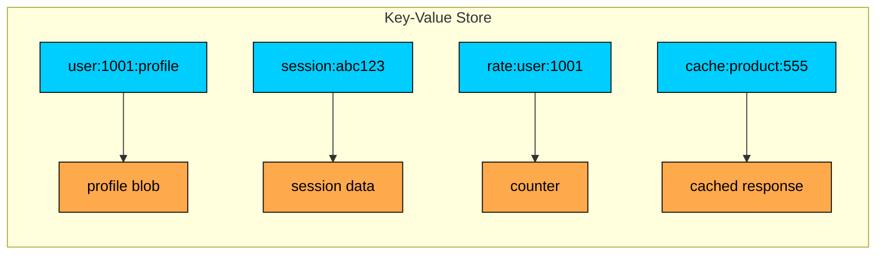
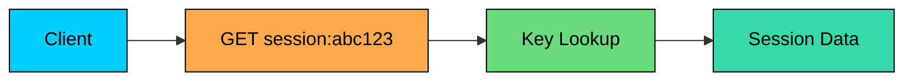
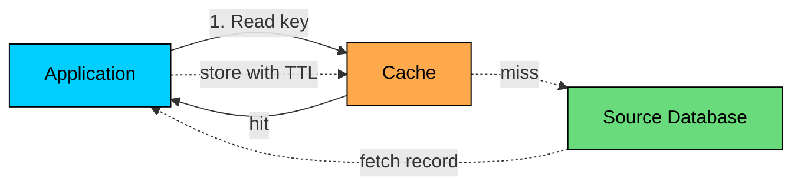
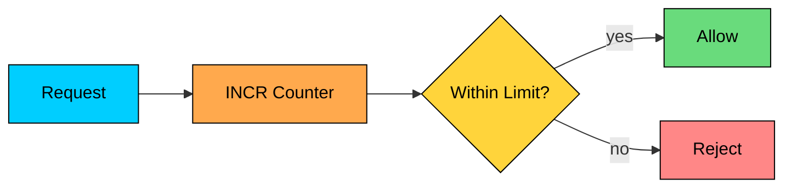
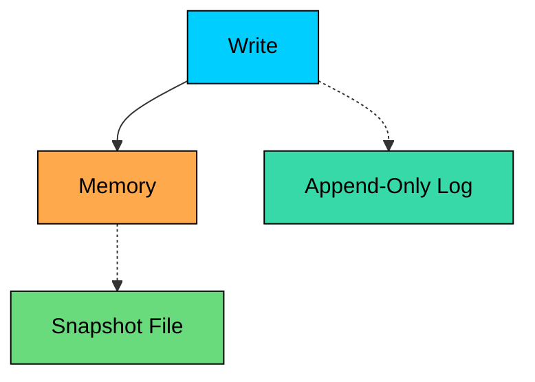
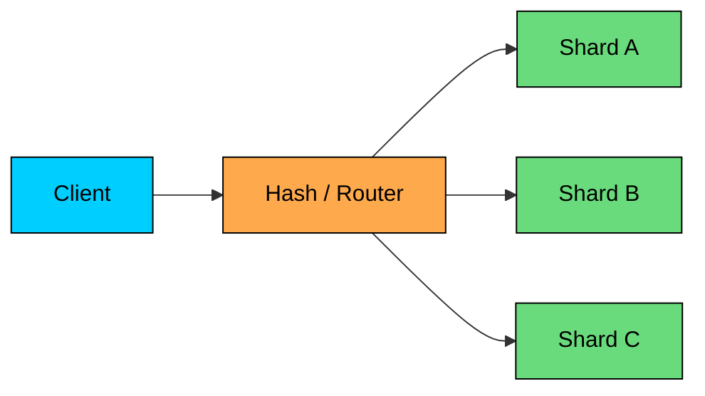

import React from 'react';
import CodeBlock from '../../../../components/ui/CodeBlock';
import Callout from '../../../../components/ui/Callout';

<div className="article-header">
  <div className="breadcrumb">
    <a href="/">Curated Notes</a>
    <span className="breadcrumb-separator">›</span>
    <span className="breadcrumb-current">Key-Value Stores</span>
  </div>
  <h1>Key-Value Stores</h1>
  <p style={{ color: 'var(--text-muted)', fontSize: '1.1rem', marginBottom: '16px', lineHeight: '1.6' }}>
    Master the essentials of Key-Value Stores in this curated guide.
  </p>
  <div className="meta-info">
    <span className="meta-item">
      <svg width="14" height="14" viewBox="0 0 24 24" fill="none" stroke="currentColor" strokeWidth="2"><circle cx="12" cy="12" r="10"/><polyline points="12 6 12 12 16 14"/></svg>
      10 min read
    </span>
    <span className="difficulty-badge difficulty-badge--intermediate">Intermediate</span>
  </div>
</div>

<section className="content-section">

A key-value store is the simplest database model: store a value under a key, then fetch it later using that same key.

A key-value store does not try to answer rich ad hoc queries. It does not join records, inspect nested fields, or enforce a relational schema.

It is optimized for direct lookups, updates, deletes, counters, expirations, and sometimes a small set of server-side data structures.

Use a key-value store when the application already knows the key it needs.

Examples:

- `session:abc123` -&gt; session data
- `cache:product:555` -&gt; cached product response
- `rate:user:1001:minute` -&gt; request counter
- `cart:user:1001` -&gt; shopping cart

This model is common in caches, session stores, rate limiters, leaderboards, feature flags, and high-throughput primary stores such as DynamoDB-style systems.

---

## The Key-Value Model

A key-value store has two basic parts. The key is a unique identifier, usually a string or binary value.

The value is the data stored under that key, and it may be a string, JSON blob, binary object, counter, hash, set, list, or another supported type depending on the database.





#### Basic Operations

The core API is small. `GET key` returns the value for a key, and `SET key value` stores or replaces a value. `DEL key` removes a key, while `EXISTS key` checks whether a key is present.

`EXPIRE key ttl` removes a key after a time limit, and `INCR key` atomically increments a numeric value.

Each of these operations runs on a short lookup path. The engine can route by key, find the record, and return the value without query planning, joins, or secondary indexes.





The exact performance depends on memory, storage engine, network distance, replication, value size, and consistency settings.

In-memory systems such as Redis or Memcached are often used when very low latency matters. Durable distributed systems such as DynamoDB trade some latency for persistence, scale, and managed operations.

---

## Key Design

In a key-value store, the key is the primary access path, so key design directly shapes performance, operability, and partitioning.

#### Use Predictable Names

A consistent naming scheme with prefixes and separators makes keys easy to scan and group.


```shell
user:1001:profile
user:1001:settings
session:abc123
cache:product:555
rate:api:user:1001
```


Prefixes make keys easier to reason about, operate, and expire. They also help avoid accidental collisions between different parts of the application.

#### Keep Keys Compact

Keys consume memory and storage. A few extra bytes do not matter for a small system, but they do matter when there are tens or hundreds of millions of keys.

Prefer:


```shell
user:1001:profile
```


Avoid:


```shell
production:application:customer-service:user-profile-object:1001
```


#### Avoid Hot Keys

A hot key is a key that receives far more traffic than the rest of the dataset. One viral post, one popular product, or one global counter can overload a single shard.

Common fixes include splitting counters into multiple buckets, caching hot read-only values closer to the caller, adding jitter to expirations, avoiding placing all tenants or users behind one shared key, and using a data model that spreads writes across partitions.

---

## Common Use Cases

A few patterns show up again and again in real systems.

#### Caching

Caching is the classic key-value use case. The source of truth stays in a durable database. The key-value store keeps a faster copy of frequently read data.





Cache-aside flow:

1. Read from cache.
2. On hit, return the cached value.
3. On miss, read from the database.
4. Store the result in cache with a TTL.
5. Return the value.

Caching reduces load on the primary database and improves latency for repeated reads. The tradeoff is stale data. A cached value may lag behind the database until it expires or is invalidated.

#### Session Storage

Sessions are a natural fit because every request has a session ID.


```shell
Key: session:abc123
Value: {
  "user_id": 1001,
  "roles": ["user", "admin"],
  "created_at": "timestamp"
}
TTL: 12 hours
```


The access pattern is simple: read the session by ID, update it if needed, and let it expire automatically.

#### Rate Limiting

Rate limiters often use atomic counters with expiration.


```shell
Key: rate:user:1001:window
Value: 47
TTL: 90 seconds
```





Atomic increment is important here. A read-then-write counter can let too many requests through under concurrency.

#### Leaderboards

Some key-value stores provide sorted sets or similar structures. Redis sorted sets are a common example.


```shell
ZADD leaderboard:daily 1500 user:1001
ZADD leaderboard:daily 2300 user:1002
ZADD leaderboard:daily 1800 user:1003

ZRANGE leaderboard:daily 0 9 REV WITHSCORES
```


This works well when the query is "top N by score" or "rank for this user." It is a poor fit for complex analytical questions across many dimensions.

#### Temporary Application State

Shopping carts, password reset tokens, one-time codes, feature flag snapshots, and short-lived workflow state can fit well when the value is accessed by a known key and has a natural expiration.

---

## Redis and Memcached

Redis and Memcached are often used as in-memory key-value systems, especially for caching.

#### Redis

Redis stores data primarily in memory and supports multiple data structures. Strings hold cached values, counters, and tokens. Hashes store small objects with fields.

Sets hold unique members for tags and membership checks. Sorted sets back leaderboards and ranked lists. Lists serve as simple queues or recent-item buffers, and streams are append-only event logs.

Redis also supports expiration, Lua scripts, transactions, replication, clustering, and persistence options.

In 2024, Redis Ltd. relicensed Redis from BSD to a source-available dual license (RSALv2 and SSPLv1), and later moved newer Redis releases to AGPLv3.

The Linux Foundation forked the last BSD-licensed version into a community project called Valkey, which is now a drop-in alternative used by many cloud providers. The Redis API and command set are essentially the same across both.

#### Memcached

Memcached is simpler. It is mostly a distributed in-memory cache for string or binary values. It does not provide Redis-style data structures, persistence, streams, or rich server-side operations.

That simplicity can be a strength. If the only requirement is a large, fast, disposable cache, Memcached can be easier to operate and reason about.

---

## Persistence and Durability

Key-value stores are not all the same. Some are disposable caches. Some are durable primary databases.

In-memory caches such as Redis and Memcached hold low-latency cached or temporary data. Durable distributed key-value databases such as DynamoDB, ScyllaDB, Aerospike, and Riak act as primary storage by key.

Embedded key-value engines such as RocksDB, LevelDB, and BadgerDB are building blocks for other databases or for on-device storage. Coordination key-value systems such as etcd, Consul KV, and ZooKeeper-style services handle configuration, membership, and leader election.

#### Redis Persistence

Redis can persist data to disk, but you must choose the durability tradeoff.


| Mode | How It Works | Trade-off |
|------|--------------|-----------|
| Snapshot | Periodically writes a point-in-time copy | Fast restart, possible recent data loss |
| Append-only file | Logs write commands to disk | Better durability, more write and recovery cost |
| Both | Uses snapshots and append-only logging | Common practical compromise |





Do not treat Redis persistence as identical to a transactional database. It can be durable enough for many workloads, but the configuration matters.

#### Durable Key-Value Stores

Durable key-value databases store data on persistent media and replicate it for availability. DynamoDB is a familiar managed example. These systems usually expose a primary key model and may add sort keys, conditional writes, secondary indexes, and streams.

They are a better fit when the key-value store is the system of record.

---

## Distribution and Scaling

Key-value stores scale by partitioning the keyspace.





The partitioning function maps each key to a shard. This works well for single-key operations because each request has a clear owner.

#### Multi-Key Operations

Multi-key operations are harder. If two keys live on different shards, the system must coordinate across nodes or reject the operation.

Redis Cluster handles this by using hash slots. Keys that need to be used together can be placed in the same slot with hash tags.


```shell
{user:1001}:profile
{user:1001}:settings
```


Both keys hash by the `user:1001` tag, so they can live on the same shard.

#### Consistency

Distributed key-value stores make different consistency choices.


| Model | What It Means | Typical Example |
|-------|---------------|-----------------|
| Strong read | A read reflects the most recent acknowledged write | etcd, DynamoDB consistent reads |
| Eventual read | A read may briefly return older data | replicated caches, DynamoDB default reads |
| Local single-node read | Reads and writes on one node are ordered by that node | standalone Redis |


The right model depends on the data. A stale product page cache may be fine. A stale permission decision may not be.

---

## Atomicity and Locks

Single-key atomic operations are one of the most useful features of key-value stores.

Examples:

- increment a counter
- set a value only if it does not exist
- update a TTL
- add a member to a set
- append an item to a stream

#### Conditional Writes

Conditional writes prevent lost updates.


```shell
SET lock:resource:123 owner-7 NX EX 30
```


This says: set the key only if it does not exist, and expire it after 30 seconds.

#### Distributed Locks

Distributed locks have several failure modes. A lock with a TTL is a lease, and it does not guarantee mutual exclusion on its own. The holder may pause, the network may partition, or the lease may expire while work is still running.

For low-risk coordination, a Redis lease can be enough. For high-value correctness, prefer a system designed for coordination, such as etcd, or use fencing tokens so the downstream resource can reject stale lock holders.

---

## Access Patterns and Limits

Key-value stores are excellent when the access pattern is direct.


| Good Fit | Poor Fit |
|----------|----------|
| Get session by session ID | Find sessions by browser or city |
| Get product cache by product ID | Search products by text |
| Increment rate counter by user ID | Compute analytics across all users |
| Get cart by user ID | Join carts with orders and payments |
| Store feature flag by key | Query arbitrary flag metadata |


If you need to query by value, join related entities, scan large ranges, or aggregate across many records, use a database built for those access patterns.

Secondary indexes can be added in some key-value databases, but they change the tradeoff. You are no longer using a pure key-value access pattern.

---

## When to Choose Key-Value Stores

Choose a key-value store when:

- **The application knows the key.** Reads and writes are mostly direct lookups.
- **Low latency matters.** The system is on a hot request path.
- **Values are simple.** The database does not need to understand much about the inside of the value.
- **TTL is useful.** Data should expire naturally.
- **Single-key atomic operations are enough.** Counters, leases, sets, and conditional writes cover the need.
- **Horizontal partitioning by key works.** The workload can be spread across keys without constant cross-shard coordination.

Consider another database when:

- **You need rich queries.** Use relational, document, search, or analytical storage.
- **Relationships are central.** Use relational or graph models.
- **The data is the source of truth and durability is strict.** Use a durable key-value database or another primary database, not a disposable cache.
- **Hot keys dominate traffic.** Fix the data model before adding nodes.
- **Cross-key transactions are common.** A relational database or transactional distributed database may be simpler.

---

## Summary

Key-value stores trade query flexibility for a small, fast, predictable access pattern. The data model is a key plus a value, and the main access path is a direct lookup by key.

Their strengths are latency, simplicity, TTLs, counters, and caching. They scale by partitioning the keyspace, and their main risk is being a poor fit when queries are not key-based. Common systems include Redis, Memcached, DynamoDB-style stores, and etcd.

The real design question is whether the product can access this data by key most of the time. If yes, the model can stay very simple. If no, the simplicity becomes a constraint.

The next chapter explores wide-column stores, which extend key-based access patterns for very large, write-heavy datasets.

</section>
