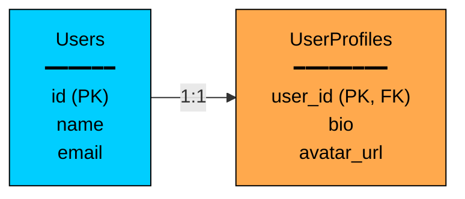
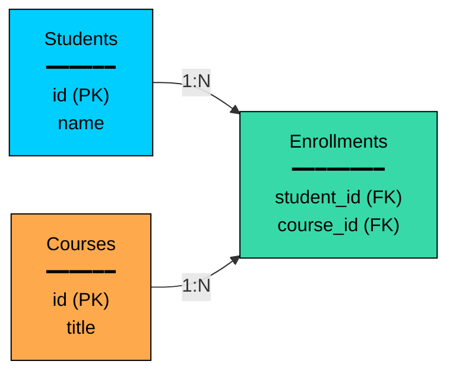
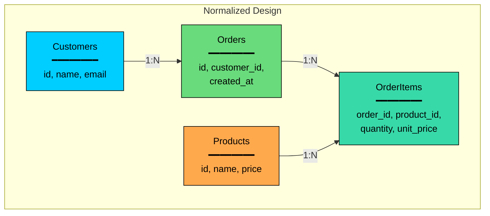
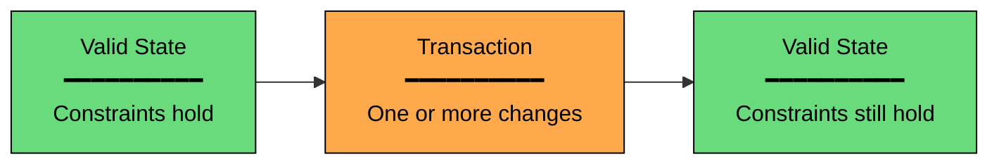
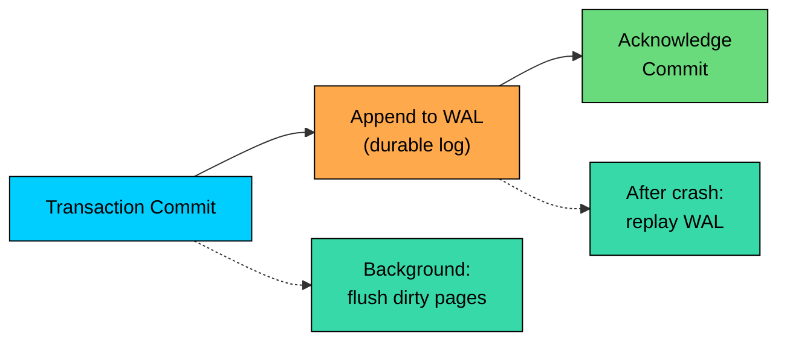
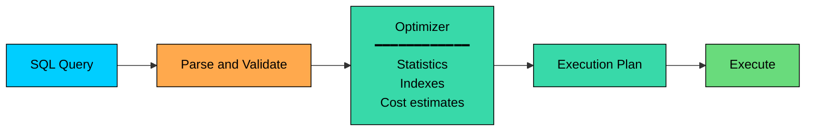
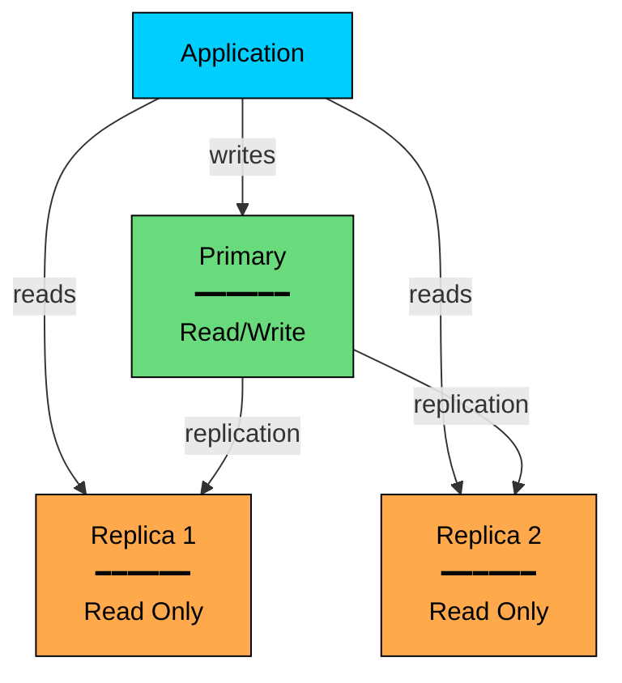
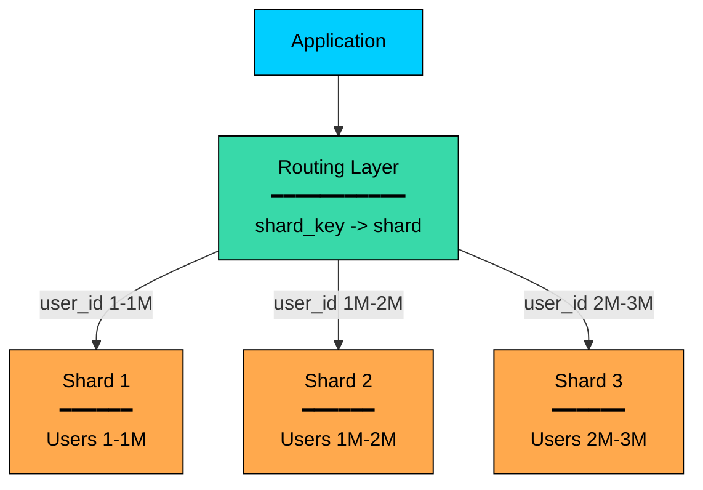

import React from 'react';
import CodeBlock from '../../../../components/ui/CodeBlock';
import Callout from '../../../../components/ui/Callout';

<div className="article-header">
  <div className="breadcrumb">
    <a href="/">Curated Notes</a>
    <span className="breadcrumb-separator">›</span>
    <span className="breadcrumb-current">Relational Databases</span>
  </div>
  <h1>Relational Databases</h1>
  <p style={{ color: 'var(--text-muted)', fontSize: '1.1rem', marginBottom: '16px', lineHeight: '1.6' }}>
    Master the essentials of Relational Databases in this curated guide.
  </p>
  <div className="meta-info">
    <span className="meta-item">
      <svg width="14" height="14" viewBox="0 0 24 24" fill="none" stroke="currentColor" strokeWidth="2"><circle cx="12" cy="12" r="10"/><polyline points="12 6 12 12 16 14"/></svg>
      10 min read
    </span>
    <span className="difficulty-badge difficulty-badge--intermediate">Intermediate</span>
  </div>
</div>

<section className="content-section">

Relational databases are still the default storage choice for many production systems.

That is not because they are old or familiar. It is because they solve a hard set of problems well: storing structured data, enforcing rules, supporting transactions, and answering flexible queries without forcing the application to manually scan and combine records.

When you place an order, transfer money, reserve a seat, update inventory, or generate a report, a relational database is often the system handling it. These workloads need more than storage. They need correctness.

Relational databases are especially strong when data has clear structure and relationships, the system must protect important invariants, and queries need joins, filters, sorting, grouping, or reporting.

They are also a good fit when the team wants mature operational tooling and the database is the system of record.

They are not perfect for every workload, but they are the baseline to understand before choosing anything else.

---

## The Relational Model

The relational model was introduced by Edgar F. Codd in 1970. His key idea was simple but powerful: represent data as relations, which we usually call tables, and let the database decide how to store and retrieve that data physically.

Before relational databases, applications often had to follow data through physical pointers or rigid hierarchical structures. The relational model separated logical data modeling from physical storage. That separation is one reason SQL databases remain useful across so many domains.

#### Tables, Rows, and Columns

A relational database organizes data into tables. Each table represents one kind of thing: users, orders, products, payments, invoices, or shipments.

Each row represents one instance of that thing. Each column represents one attribute.

##### **Users Table**


| id | name       | email             | created_at |
|----|------------|-------------------|------------|
| 1  | Alice Chen | alice@example.com | 2024-01-15 |
| 2  | Bob Smith  | bob@example.com   | 2024-02-20 |
| 3  | Carol Wu   | carol@example.com | 2024-03-10 |


Several properties matter. Columns have names and types, and a column might store integers, text, timestamps, booleans, decimals, or structured values such as JSON.

Rows are unordered, so unless a query uses `ORDER BY`, the database does not promise a result order. Columns are referenced by name, and the physical order of columns is not a reliable way to reason about data.

Tables can also enforce rules, with constraints that reject invalid records before they become part of the system.

#### Primary Keys

A primary key uniquely identifies a row in a table. It cannot be `NULL`, and no two rows in the table can have the same primary key.

Primary key choice affects storage, indexing, replication, debugging, and API design. There is no single best key type.


| Type | Example | Strengths | Trade-offs |
|------|---------|-----------|------------|
| **Auto-increment integer** | `1`, `2`, `3` | Compact, readable, efficient indexes | Predictable, centralized generation, awkward across independent writers |
| **UUID** | `550e8400-e29b-41d4-a716-446655440000` | Generated independently, globally unique enough for most systems | Larger indexes, random UUIDs can hurt locality |
| **Time-ordered ID** | ULID, UUIDv7, Snowflake-style ID | Distributed generation with better index locality | More moving parts, clock behavior matters |
| **Natural key** | `email`, `sku` | Meaningful, no extra identifier | Can change, may expose sensitive data, not always stable |
| **Composite key** | `(user_id, product_id)` | Models relationship tables cleanly | Wider references and more complex joins |


Many applications use surrogate keys such as integers, UUIDs, or time-ordered IDs. Natural keys are useful when the domain value is truly stable, but stable natural keys are rarer than they first appear.

#### Foreign Keys and Relationships

A foreign key is a column, or set of columns, that references the primary key of another table. It is how relational databases enforce relationships between records.


#### Users Table

| id | name  | email             |
|----|-------|-------------------|
| 1  | Alice | alice@example.com |
| 2  | Bob   | bob@example.com   |

#### Orders Table

| id  | user_id | total   | status    |
|-----|---------|---------|-----------|
| 101 | 1       | $150.00 | shipped   |
| 102 | 1       | $75.50  | pending   |
| 103 | 2       | $200.00 | delivered |

#### Foreign Key Relationship
- `orders.user_id` -&gt; `users.id`


Here, one user can have many orders. The database can reject an order whose `user_id` does not exist. This is called **referential integrity**.

Foreign keys also let you define behavior when referenced rows change:

- **RESTRICT / NO ACTION:** prevent deleting a user while orders still reference that user.
- **CASCADE:** delete or update dependent rows automatically.
- **SET NULL:** keep the dependent row but remove the reference.
- **SET DEFAULT:** keep the dependent row and replace the reference with the column's default value.

These choices are business rules. For example, deleting a user should usually not delete that user's completed financial records.

#### Relationship Types

Relational modeling commonly uses three relationship shapes.

**One-to-One:** Each row in one table maps to at most one row in another table. This is useful when optional or sensitive fields should be separated.





**One-to-Many:** One row maps to many rows in another table. A user has many orders. A customer has many invoices.

**Many-to-Many:** Rows on both sides can relate to many rows on the other side. This is modeled with a junction table.





The `enrollments` table represents the relationship itself. Junction tables often carry their own fields, such as `enrolled_at`, `status`, or `grade`.

---

## Schema and Data Integrity

A relational schema defines the structure and rules of the data: tables, columns, data types, indexes, primary keys, foreign keys, uniqueness rules, defaults, and checks.

This is one of the major strengths of relational databases. The database can reject bad writes even if application code has a bug.

#### Schema Definition

Schemas are defined with Data Definition Language (DDL). The example below uses PostgreSQL syntax. Other databases spell auto-incrementing keys differently: MySQL uses `BIGINT AUTO_INCREMENT`, SQL Server uses `BIGINT IDENTITY`, and Oracle traditionally uses sequences or `GENERATED AS IDENTITY`.


```sql
CREATE TABLE users (
    id BIGSERIAL PRIMARY KEY,
    email VARCHAR(255) NOT NULL UNIQUE,
    name VARCHAR(100) NOT NULL,
    created_at TIMESTAMP NOT NULL DEFAULT CURRENT_TIMESTAMP
);

CREATE TABLE orders (
    id BIGSERIAL PRIMARY KEY,
    user_id BIGINT NOT NULL REFERENCES users(id),
    total DECIMAL(10, 2) NOT NULL CHECK (total >= 0),
    status VARCHAR(20) NOT NULL DEFAULT 'pending',
    created_at TIMESTAMP NOT NULL DEFAULT CURRENT_TIMESTAMP
);
```


This schema protects several rules:


| Constraint | Purpose | Example |
|------------|---------|---------|
| `NOT NULL` | Require a value | Every order must have a `user_id` |
| `UNIQUE` | Prevent duplicates | Two users cannot share the same email |
| `PRIMARY KEY` | Identify each row | Every user has one unique `id` |
| `REFERENCES` | Enforce relationships | Orders must point to real users |
| `CHECK` | Enforce custom rules | Order total cannot be negative |
| `DEFAULT` | Fill missing values | New orders default to `pending` |


#### Schema-on-Write

Relational databases use **schema-on-write**. Data is checked before it is stored. If the write violates the schema, the database rejects it.

This creates friction when the schema changes, but it also prevents data drift. Without it, different application versions can write differently shaped records, and several versions of an order can accumulate in the database without anyone noticing.


| Approach | Validation Time | Strengths | Trade-offs |
|----------|-----------------|-----------|------------|
| **Schema-on-write** | Before storage | Strong data quality, predictable queries | Migrations require planning |
| **Schema-on-read** | During reads | Flexible ingestion, useful for raw or varied data | Bad or inconsistent data can accumulate |


Schema changes are normal in production systems. A common pattern is to handle them with backward-compatible migrations: add nullable columns first, deploy code that writes both old and new fields if needed, backfill data safely, then remove old structures later.

#### Normalization

Normalization organizes data to reduce duplication and avoid update anomalies. The goal is not academic purity. The goal is to store each important fact in one authoritative place unless there is a good reason to duplicate it.

Consider this denormalized order table:


| order_id | customer_name | customer_email | product_name | product_price |
|----------|---------------|----------------|--------------|---------------|
| 1        | Alice Chen    | alice@ex.com   | Keyboard     | $79.00        |
| 2        | Alice Chen    | alice@ex.com   | Mouse        | $25.00        |
| 3        | Bob Smith     | bob@ex.com     | Keyboard     | $79.00        |


This design creates several problems. An update anomaly happens when Alice changes her email and several rows must be updated.

A delete anomaly happens when Bob's only order is deleted and the only record of Bob disappears with it. An insert anomaly happens when a new customer cannot be represented until they place an order.

A normalized design separates customers, products, and orders:





Normalization is the usual starting point for transactional systems. Denormalization is still useful, but it should be a deliberate choice: caches, search indexes, reporting tables, materialized views, and read models often duplicate data to make reads faster.

---

## ACID Transactions

Transactions let a database apply multiple changes as one unit. ACID describes the guarantees expected from those transactions.

#### Atomicity

Atomicity means all-or-nothing. Either every operation in the transaction commits, or none of them do.


```sql
BEGIN;
    UPDATE accounts SET balance = balance - 100 WHERE id = 1;
    UPDATE accounts SET balance = balance + 100 WHERE id = 2;
COMMIT;
```


If the second update fails, the first update is rolled back. The system does not leave money halfway between accounts.

#### Consistency

Consistency means a transaction moves the database from one valid state to another valid state. The database enforces declared rules such as foreign keys, unique constraints, checks, and data types.





This does not mean the database understands every business rule. If your application allows a nonsensical but constraint-valid update, the database may accept it. Good schema design and application logic work together.

#### Isolation

Isolation controls how concurrent transactions see each other's changes. Stronger isolation prevents more anomalies but can reduce concurrency.

Common anomalies include:

- **Dirty read:** reading data written by a transaction that has not committed.
- **Non-repeatable read:** reading the same row twice and seeing different committed values.
- **Phantom read:** repeating a query and seeing a different set of matching rows.
- **Write skew:** two transactions make decisions from overlapping data and commit a state that violates an application invariant.

SQL defines four standard isolation levels, each preventing more anomalies than the last:


| Isolation Level | What It Prevents | Typical Trade-off |
|-----------------|------------------|-------------------|
| Read Uncommitted | Very little; dirty reads may be possible | Rarely appropriate for critical data |
| Read Committed | Dirty reads | Common default; allows some anomalies |
| Repeatable Read | Dirty and non-repeatable reads; PostgreSQL also prevents phantoms under snapshot isolation | Better transaction stability; behavior varies by database |
| Serializable | Makes concurrent transactions behave as if run one at a time | Strongest correctness; more retries or blocking |


Do not assume every database implements these names identically. PostgreSQL, MySQL/InnoDB, SQL Server, and Oracle differ in important details.

#### Durability

Durability means that once a transaction commits, the database can recover it after a crash.

Databases usually achieve this with a write-ahead log (WAL). The database records the change in a durable log before treating the transaction as committed. If the server crashes before modified pages are fully written to data files, recovery replays the log.





Durability also depends on configuration and storage behavior. Settings such as synchronous commit, replication mode, and disk flush guarantees affect the real failure window.

---

## SQL and Query Planning

SQL is declarative. You describe the result you want; the database decides how to compute it.

#### Declarative Queries

Consider a query that returns all orders over `$100` placed by users in California.


```sql
SELECT orders.*
FROM orders
JOIN users ON orders.user_id = users.id
WHERE users.state = 'California'
  AND orders.total > 100;
```


The query does not say whether to scan users first, scan orders first, use an index, or choose a specific join algorithm. The optimizer decides based on table statistics, indexes, estimated row counts, and cost rules.

#### Common Query Patterns

**Aggregations** compute values across groups:


```sql
SELECT
    user_id,
    COUNT(*) AS order_count,
    SUM(total) AS total_spent
FROM orders
GROUP BY user_id
HAVING SUM(total) > 1000;
```


**Joins** combine related rows:


```sql
SELECT
    u.name,
    COUNT(o.id) AS order_count
FROM users u
LEFT JOIN orders o ON u.id = o.user_id
GROUP BY u.id, u.name;
```


**Window functions** compute values across related rows without collapsing the result set:


```sql
SELECT
    user_id,
    id AS order_id,
    total,
    SUM(total) OVER (
        PARTITION BY user_id
        ORDER BY created_at
    ) AS running_total
FROM orders;
```


#### Query Optimizer

The query optimizer turns SQL into an execution plan. The plan can be inspected with `EXPLAIN`, and in many databases, `EXPLAIN ANALYZE` runs the query and shows actual timing.


```sql
EXPLAIN ANALYZE
SELECT *
FROM orders
WHERE user_id = 123;
```


Under the hood, the database moves the query through several stages before returning results:





The optimizer's choices depend heavily on available indexes. Indexes make many queries fast, but every index has a write cost and storage cost. A well-designed relational schema includes indexes for important access patterns, not indexes for every column.

---

## Scaling Relational Databases

Relational databases can scale a long way, especially with careful schema design, indexing, batching, connection pooling, and query tuning. But scaling writes across many machines is harder than scaling reads.

#### Vertical Scaling

The simplest scaling path is a larger machine: more CPU, more memory, faster disks, and better network throughput.

Vertical scaling is attractive because the application does not need to understand distribution. Transactions, joins, indexes, and constraints keep working in the familiar way.

The limits are practical. Hardware eventually hits a ceiling, large machines become expensive, and maintenance and failover become more consequential. One primary database can also still be a write bottleneck.

For many systems, vertical scaling plus good indexing is enough for a long time.

#### Read Replicas

Read replicas copy data from the primary database. Writes go to the primary. Read-only queries can be routed to replicas.





Read replicas help when the workload is read-heavy. They do not remove the write bottleneck.

Replicas come with trade-offs. Replication lag means a replica may not have the latest committed write yet. Read-your-writes guarantees can break, so after a user changes data, the next read may need to go to the primary.

Failover requires coordination and can still lose recent writes depending on replication mode. Operational load also grows, since backups, monitoring, schema changes, and connection management now involve more nodes.

#### Sharding

Sharding splits rows across multiple database servers. Each shard owns a subset of the data.





Sharding can scale reads and writes, but it changes the system. The database is no longer one simple logical place from the application's point of view.

Sharding introduces several challenges. Shard key choice matters because a poor key creates hot shards or forces many cross-shard queries. Cross-shard joins require fetching data from multiple shards and combining it elsewhere.

Cross-shard transactions become distributed transactions, which are slower and harder to operate. Rebalancing, the act of moving data between shards, is risky under live traffic. Global constraints such as unique constraints and foreign keys are harder to enforce across shard boundaries.

A good shard key spreads load evenly, keeps related data together, and matches common query patterns. Sharding is a tool for real scale pressure, not a default starting point.

---

## Common Relational Databases

Several relational databases are widely used in production. The differences matter, but the choice usually depends more on team experience, ecosystem, hosting model, and workload than on a feature checklist.

#### PostgreSQL

PostgreSQL is a strong general-purpose choice with excellent SQL support, extensibility, JSONB, indexing options, full-text search, and a rich extension ecosystem such as PostGIS and pgvector.

It is a good fit when you want a reliable default, complex queries, strong data modeling, and room to grow into specialized features without leaving the relational world.

#### MySQL

MySQL is widely used for web applications and managed cloud databases. InnoDB provides transactions, row-level locking, indexes, and replication support.

It is a good fit when your team already knows it, your workload is web-oriented, and you value its operational familiarity and hosting ecosystem.

#### SQL Server

SQL Server is common in Microsoft-centered environments. It provides strong enterprise features, mature tooling, high availability options, security features, and deep integration with the .NET and Microsoft analytics ecosystem.

It is a good fit for enterprise systems where the organization already runs Microsoft infrastructure and values integrated tooling.

#### Oracle Database

Oracle Database remains important in large enterprises with demanding transactional workloads, legacy estates, and strict operational requirements.

It is a good fit when an organization already has Oracle expertise, licensing, tooling, and applications built around it.


&gt; **Practical Advice**
&gt;
&gt; For most new backend systems, PostgreSQL is a safe default. But a database your team operates well is usually better than a more impressive one your team does not understand.


---

## When to Choose Relational

Choose a relational database when data has relationships. Users, orders, payments, invoices, permissions, and inventory all connect naturally through tables.

Choose it when correctness matters, because transactions and constraints protect against double-spending, overselling, invalid references, and partial updates.

Choose it when queries are varied, since SQL handles joins, reporting, filtering, sorting, and aggregation without building a separate access path for every question.

Choose it when the database is the source of truth and you want durable storage with backups, migrations, replication, and mature recovery tooling.

And choose it when the expected scale is within normal operational bounds, since a well-indexed relational database can handle a large amount of traffic before it stops being enough.

#### When to Consider Alternatives

Consider another database type, or an additional specialized store, when:

- **Exact-key lookups dominate.** A key-value store may be simpler and faster.
- **Data is deeply nested and read as one aggregate.** A document database may fit the access pattern.
- **Write volume is extreme and queries are predictable.** A wide-column store may be better.
- **Relationship traversal is the core problem.** A graph database may be more natural.
- **Search, time-series, or vector similarity is central.** Use a specialized index or database for that access pattern.

The usual architecture is not "relational or specialized." It is often relational as the source of truth, with caches, search indexes, analytics stores, or vector indexes built from it.

---

## Summary

Relational databases remain central because they combine several important properties. Tables and relationships model structured business data clearly. Schema enforcement prevents invalid data from entering the system.

ACID transactions keep multi-step changes correct under failures and concurrency. SQL expresses complex queries without manual data scanning.

Indexes and the optimizer let the database choose efficient execution plans. Operational maturity means backups, replication, recovery, tooling, and expertise are widely available.

The practical lesson is simple: start with relational unless the requirements clearly point elsewhere. Understand its strengths first. When another database type is added later, the problem it is solving becomes much easier to articulate.

The next chapter explores document databases, which trade some relational structure for flexible, nested documents and aggregate-oriented reads.

---

## Quiz

</section>
