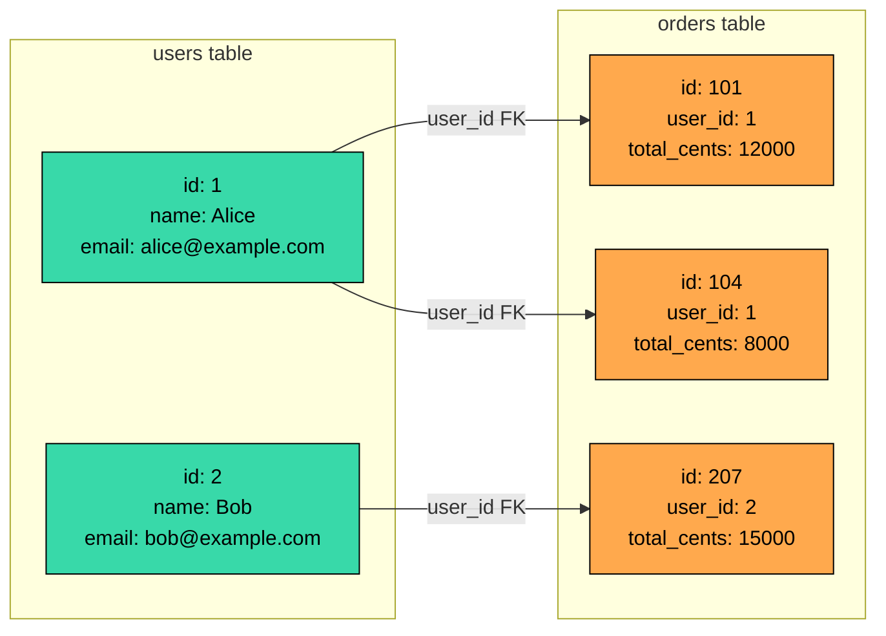
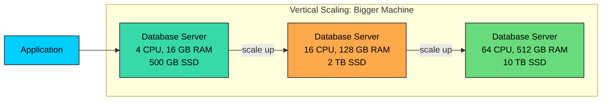
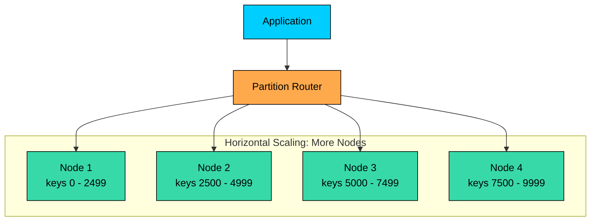

import React from 'react';
import CodeBlock from '../../../../components/ui/CodeBlock';
import Callout from '../../../../components/ui/Callout';

<div className="article-header">
  <div className="breadcrumb">
    <a href="/">Curated Notes</a>
    <span className="breadcrumb-separator">›</span>
    <span className="breadcrumb-current">SQL vs NoSQL</span>
  </div>
  <h1>SQL vs NoSQL</h1>
  <p style={{ color: 'var(--text-muted)', fontSize: '1.1rem', marginBottom: '16px', lineHeight: '1.6' }}>
    Master the essentials of SQL vs NoSQL in this curated guide.
  </p>
  <div className="meta-info">
    <span className="meta-item">
      <svg width="14" height="14" viewBox="0 0 24 24" fill="none" stroke="currentColor" strokeWidth="2"><circle cx="12" cy="12" r="10"/><polyline points="12 6 12 12 16 14"/></svg>
      10 min read
    </span>
    <span className="difficulty-badge difficulty-badge--intermediate">Intermediate</span>
  </div>
</div>

<section className="content-section">

"SQL vs NoSQL" is shorthand for several decisions at once: data model, query patterns, consistency guarantees, and operational tradeoffs.

SQL usually means a relational database such as PostgreSQL, MySQL, SQL Server, or Oracle. Data is modeled in tables, relationships are represented with keys, and queries are written in SQL.

NoSQL is an umbrella term. It includes key-value stores, document databases, wide-column databases, graph databases, time-series databases, and other systems that do not use the relational model as their primary interface.

The useful question is:

&gt; What access patterns, consistency needs, scale requirements, and operational constraints does this system have?

---

## The Core Difference

Relational databases organize data around relations. NoSQL databases usually organize data around access patterns.


| Question | SQL / Relational | NoSQL |
|----------|------------------|-------|
| Primary model | Tables, rows, columns, relationships | Key-value, document, wide-column, graph, or specialized model |
| Query style | Declarative SQL | Database-specific API or query language |
| Schema | Explicit and enforced by the database | Flexible or query-shaped, depending on the system |
| Relationships | Joins and foreign keys are first-class | Often embedded, denormalized, traversed, or handled by application logic |
| Transactions | Strong general-purpose transaction support | Varies widely by database and operation scope |
| Scaling model | Vertical scaling, replicas, partitioning, sharding | Often designed for horizontal partitioning from the start |


This table is only a starting point. Modern systems blur the categories. PostgreSQL can store JSON. MongoDB supports transactions. DynamoDB has conditional writes. Distributed SQL databases scale horizontally. The details matter more than the label.

---

## Data Model

#### Relational Model

In a relational database, data is split into tables with defined columns. Relationships are represented with primary keys and foreign keys.

Example: users and orders.





```sql
CREATE TABLE users (
    id BIGINT PRIMARY KEY,
    name TEXT NOT NULL,
    email TEXT NOT NULL UNIQUE
);

CREATE TABLE orders (
    id BIGINT PRIMARY KEY,
    user_id BIGINT NOT NULL REFERENCES users(id),
    total_cents BIGINT NOT NULL,
    created_at TIMESTAMP NOT NULL
);
```


This model works well when the data has important relationships and the application needs to query those relationships in different ways.

For example:


```sql
SELECT u.name, o.id, o.total_cents
FROM users u
JOIN orders o ON o.user_id = u.id
WHERE u.email = 'alice@example.com'
ORDER BY o.created_at DESC;
```


The database can plan joins, use indexes, enforce constraints, and keep related updates inside transactions.

#### NoSQL Models

NoSQL covers several different models. Each type optimizes for a different shape of data.


| Type | Model | Good Fit |
|------|-------|----------|
| Key-value | Key points to value | Sessions, caches, counters, simple lookups |
| Document | JSON-like document | User profiles, catalogs, content, aggregates |
| Wide-column | Partition key plus sorted rows or columns | High-write event data, large-scale lookup by partition |
| Graph | Nodes and edges | Relationship traversal, fraud rings, recommendations |
| Time-series | Measurements over time | Metrics, telemetry, IoT, observability |
| Search | Inverted index | Text search, filtering, ranking |


A document version of a user with recent orders might look like this:


```json
{
  "_id": 1,
  "name": "Alice",
  "email": "alice@example.com",
  "recent_orders": [
    { "id": 101, "total_cents": 12000 },
    { "id": 104, "total_cents": 8000 }
  ]
}
```


This is useful when the application usually reads the user and recent orders together. It is less useful if many workflows need to query orders independently, join them with payments, or enforce complex cross-entity rules.

---

## Schema

The common phrase "SQL has schema and NoSQL has no schema" is misleading.

SQL databases enforce schema in the database. You declare tables, columns, data types, constraints, and relationships. This catches bad data early and gives the optimizer useful information.

NoSQL databases often have flexible database-level schema, but the application still has a schema. It may live in code, validation rules, event contracts, API versions, or indexing definitions.


| Schema Question | SQL | NoSQL |
|-----------------|-----|-------|
| Who enforces shape? | Database | Often application, database rules, or both |
| Can records differ? | Usually less, unless using nullable columns or JSON | Often yes |
| Are migrations needed? | Yes | Still yes, but often at application or document-version level |
| What is the risk? | Migration complexity | Inconsistent records and hidden data quality problems |


Flexible schema is helpful when data varies naturally, such as product attributes by category. It is harmful when it lets every writer invent a slightly different version of the same business object.

---

## Query Patterns

Relational databases are strong when the application needs multiple query paths over the same normalized data: finding all orders for a user, finding all users who bought a product, computing revenue by month, joining orders with payments, refunds, and shipments, and enforcing uniqueness and referential integrity.

NoSQL databases are strong when the access patterns are known and the data model is shaped around those patterns: getting a session by session ID, fetching a product document by product ID, reading all events for a device and time range, retrieving a user's feed from precomputed rows, or traversing a user's social graph.

The design tradeoff is important:


| Approach | Benefit | Cost |
|----------|---------|------|
| Normalize data | Fewer duplicates, flexible joins, strong integrity | Joins and coordination can become expensive at scale |
| Denormalize data | Fast reads for known access patterns | Duplicate data, harder updates, eventual consistency risk |


Denormalization is a useful technique, but every duplicate copy needs an update strategy.

---

## Transactions and Consistency

Relational databases are usually the safest default when the system needs multi-row or multi-table transactions.

Example: transferring money.


```sql
BEGIN;

UPDATE accounts
SET balance_cents = balance_cents - 50000
WHERE id = 'A' AND balance_cents >= 50000;

-- If the previous statement updated 0 rows, ROLLBACK.

UPDATE accounts
SET balance_cents = balance_cents + 50000
WHERE id = 'B';

COMMIT;
```


Both updates must succeed or fail as one unit. A relational database gives you mature tools for this: constraints, isolation levels, locks, rollback, and durable commits.

NoSQL transaction support varies widely:

- A key-value store may provide atomic operations on one key.
- A document database may provide atomic updates to one document and sometimes multi-document transactions.
- A wide-column database may provide conditional writes or limited batch atomicity.
- A graph database may provide ACID transactions within the graph.
- A distributed database may use quorum writes, consensus, or per-partition guarantees.

The important question is not "Does it support transactions?" It is across how many records and partitions the guarantees hold, what isolation level applies, what the latency looks like, and what happens during failover.

---

## Scaling

Older SQL-vs-NoSQL explanations often say:

- SQL scales vertically.
- NoSQL scales horizontally.

The classic picture for vertical scaling is a single database server that grows over time:





And the picture for horizontal scaling is data partitioned across many smaller nodes:





In practice, that picture is too simple. Both shapes show up in both worlds.

Relational databases can scale with larger machines, read replicas, partitioning, sharding, connection pooling, caching, and distributed SQL systems. Many high-traffic systems run successfully on relational databases for a long time.

NoSQL systems often make horizontal scaling easier because the data model is designed around partition keys and independent records. But that does not mean scaling is automatic. Bad partition keys, hot keys, large documents, unbounded partitions, and cross-partition queries can still break the system.

Scaling is mostly about access patterns:


| Workload Shape | Usually Easier With |
|----------------|---------------------|
| Many joins and changing query needs | Relational database |
| Simple lookups by key at very high volume | Key-value or wide-column store |
| Large flexible aggregates | Document database |
| Time-range writes and rollups | Time-series database |
| Relationship traversal | Graph database |
| Text search and ranking | Search engine |


---

## Performance

No database type is fast in the abstract. A database is fast for a workload.

SQL databases can be fast for indexed lookups, joins over well-modeled data, analytical queries on moderate datasets, and transactional updates. They can be slow when queries miss indexes, join huge intermediate results, or force too much coordination.

NoSQL databases can be fast when reads and writes match the primary access pattern. They can be slow or awkward when the application needs ad hoc queries, secondary indexes at high write volume, cross-partition reads, or multi-record transactions.

Performance depends on indexes, partition keys, data size, value or document size, query selectivity, consistency level, replication factor, network distance, and operational tuning. The database category matters, but the data model matters more.

---

## Operational Tradeoffs

Relational databases are mature, well understood, and widely supported. Teams know how to back them up, migrate schemas, tune queries, inspect locks, and restore from failures. The hard parts are usually scaling write-heavy workloads, managing schema migrations, and keeping complex queries efficient.

NoSQL databases can simplify scale for the right access pattern, but they often push more responsibility into application design. The team must understand partition keys, consistency levels, denormalization, backfills, repair jobs, and data duplication.


| Operational Question | Why It Matters |
|----------------------|----------------|
| Can we restore from backup? | Data loss happens outside normal query paths |
| Can we change the schema safely? | Both SQL and NoSQL systems evolve |
| Can we observe slow queries or hot partitions? | Performance issues often come from data shape |
| Can we reprocess or repair derived data? | Denormalized copies drift |
| Can the team operate this database? | Familiarity is part of reliability |


A familiar database that the team operates well is often better than a theoretically ideal database nobody understands.

---

## How to Choose

Choose a relational database when:

- **Data relationships matter.** Joins and constraints are part of the domain.
- **Transactions matter.** Multi-record correctness is required.
- **Query patterns will evolve.** Product and analytics needs are not fully known.
- **Data integrity matters.** The database should enforce rules, not only the application.
- **The team wants a strong default.** Relational databases are a good starting point for many systems.

Choose a NoSQL database when:

- **The access pattern is clear.** Data is usually read and written by known keys or partitions.
- **The data model matches the database.** Documents, graphs, time series, or wide rows map naturally to the problem.
- **Horizontal scale is a first-order requirement.** The workload is too large or too distributed for a single primary database design.
- **Flexible records are useful.** Different entities naturally have different fields.
- **Limited transaction scope is acceptable.** The application can tolerate the database's consistency model.

Use both when needed. Many real systems use a relational database as the source of truth and add NoSQL systems for caching, search, analytics, events, or specialized access patterns.

---

## Common Mistakes

- **Choosing NoSQL to avoid modeling.** Flexible schema does not remove the need for data design.
- **Choosing SQL for every access pattern.** Search, time-series, and graph workloads may need specialized stores.
- **Assuming NoSQL means no transactions.** Some NoSQL systems have useful transaction support, but the scope varies.
- **Assuming SQL cannot scale.** Relational systems can go very far with good indexing, replicas, partitioning, and careful design.
- **Ignoring operational skill.** A database choice is also an on-call choice.
- **Treating replicas as backups.** Replication copies mistakes quickly.

---

## Summary

SQL and NoSQL are broad categories, not fixed rules.


| Need | Strong Starting Point |
|------|-----------------------|
| General application data with relationships | Relational database |
| Financial or inventory transactions | Relational database |
| Session cache or counters | Key-value store |
| Flexible aggregate documents | Document database |
| Large partitioned event writes | Wide-column store |
| Relationship traversal | Graph database |
| Metrics and telemetry | Time-series database |
| Text search | Search engine |


For most new systems, a relational database is a strong default until a specific access pattern proves otherwise. Move to a NoSQL system when its data model directly matches the workload, not because it sounds more scalable.

---

## Quiz

</section>
