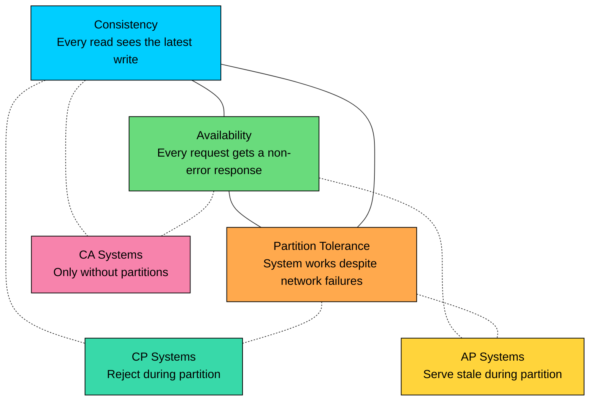
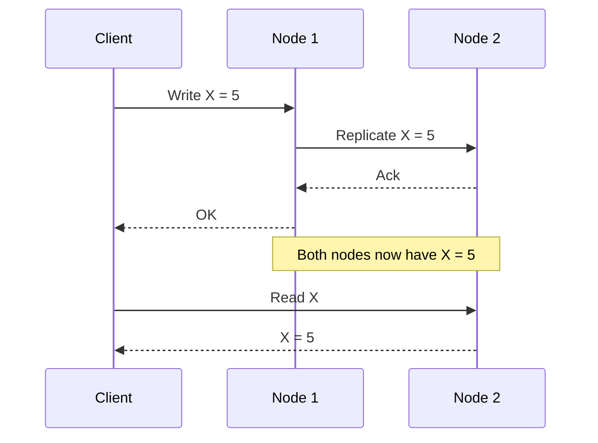
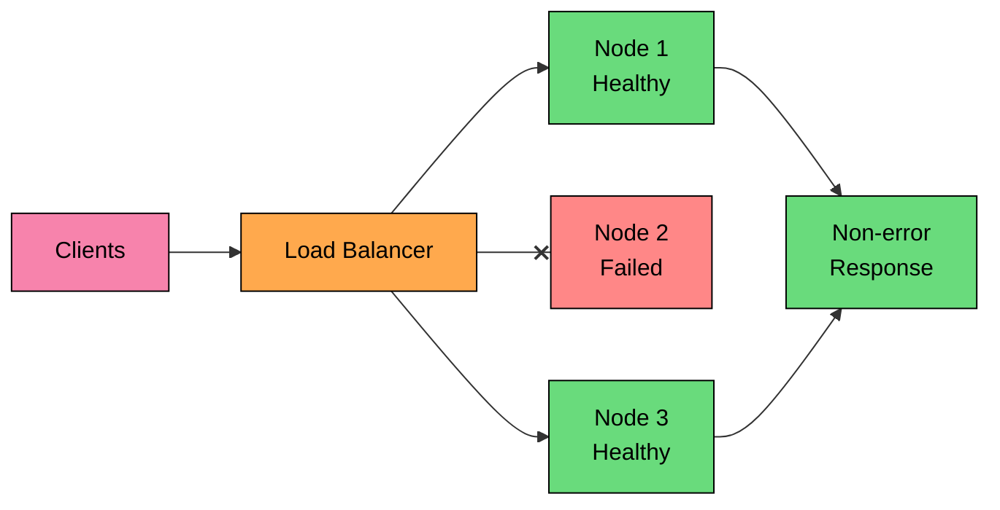
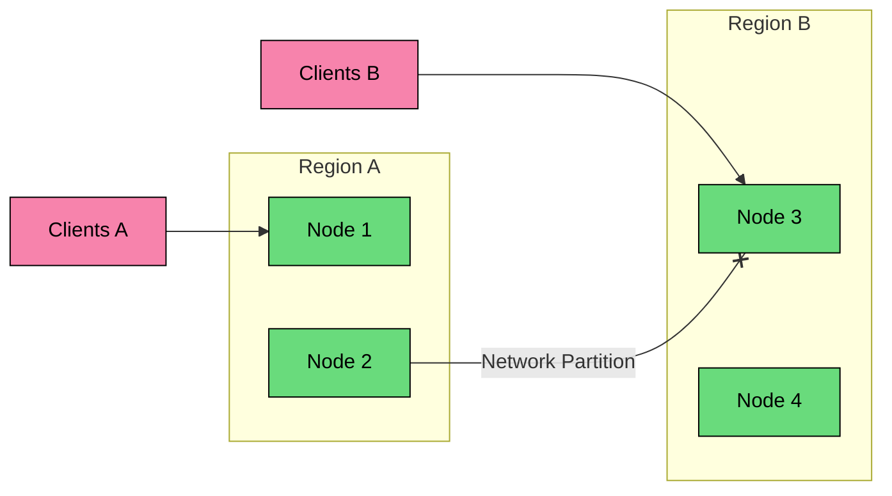

import React from 'react';
import CodeBlock from '../../../../components/ui/CodeBlock';
import Callout from '../../../../components/ui/Callout';

  

    <a href="/">Curated Notes</a>
    ›
    CAP Theorem
  

  <h1>CAP Theorem</h1>
  

    Master the essentials of CAP Theorem in this curated guide.
  

  

    
      <svg width="14" height="14" viewBox="0 0 24 24" fill="none" stroke="currentColor" strokeWidth="2"><circle cx="12" cy="12" r="10"/><polyline points="12 6 12 12 16 14"/></svg>
      10 min read
    
    Intermediate
  

<section className="content-section">

The **CAP theorem** is one of the most quoted ideas in distributed systems, and also one of the easiest to misuse.

The short version is:

**When a distributed data system is partitioned, it cannot provide both strong consistency and full availability for the affected operations.**

That wording matters. CAP is not saying that every database must permanently choose two letters from a triangle. It is saying that when nodes cannot communicate, the system must decide whether to reject some operations or allow some operations to proceed with stale or divergent state.

CAP stands for:

- **Consistency:** every read observes the latest write, or the system returns an error instead of stale data.
- **Availability:** every request to a non-failing node receives a non-error response.
- **Partition tolerance:** the system continues to behave according to its design even when messages between nodes are delayed or dropped.

CAP was introduced by Eric Brewer in 2000 and later formalized by Seth Gilbert and Nancy Lynch. It is still useful, but only when you apply it precisely.

---

## 1. What CAP Really Means

CAP is about replicated data under network failure.

Imagine a product service replicated across two regions. A user changes the price of a product in Region A. Before Region B receives the update, the network link between the regions fails.

Now a client in Region B asks for the product price.

The system has only two options:

1. **Return a response from Region B:** The response may be stale. The system remains available but gives up strong consistency.
2. **Refuse or delay the response:** The system preserves strong consistency but gives up availability for that request.

There is no protocol that can make Region B know about a write it cannot communicate with.

That is CAP.

#### The Common Misreading

The phrase "choose two out of three" is a useful memory aid, but it is a poor design rule.

In real distributed systems:

1. **Partition tolerance is not optional.** Networks fail, packets drop, links saturate, regions become unreachable, and load balancers route around partial failures.
2. **The trade-off appears during partitions.** When the network is healthy, many systems provide both good availability and strong consistency.
3. **The choice is often per operation.** A system may reject stale permission checks while still serving cached product images.
4. **Availability in CAP is not uptime.** A service can have excellent uptime and still choose consistency by returning errors for unsafe operations during a partition.
5. **Consistency in CAP is not ACID consistency.** CAP consistency is closer to linearizability: reads observe the latest completed write.

Use CAP to reason about failure behavior, not to label an entire database with one permanent acronym.

---

## 2. The Three Properties

#### 2.1 Consistency

In CAP, consistency means a strong read-after-write guarantee. After a write succeeds, later reads must return that write or a newer value. If the system cannot prove that a read is fresh, it should return an error rather than stale data.

Example:

1. A user revokes an API key.
2. The system acknowledges the revocation.
3. A later authorization check must reject that API key.

If a partitioned replica still accepts the key because it has not seen the revocation, the system is available but not strongly consistent.

This kind of consistency matters for bank balances, inventory claims, distributed locks, permission checks, quota enforcement, billing records, safety policy versions, and model deployment state.

#### 2.2 Availability

In CAP, availability means every request sent to a non-failing node eventually receives a non-error response.

This is stricter and narrower than the way engineers usually use the word "availability."

CAP availability does not require that the response be fresh, useful to the business, or fast. It does not promise that the service meets any particular uptime SLO, and it does not guarantee that every feature remains usable during a regional outage.

An AP system may remain available by accepting a write locally and reconciling later. A CP system may be highly reliable in normal operation but still return an error during a partition when it cannot safely serve the request.

#### 2.3 Partition Tolerance

Partition tolerance means the system has a defined behavior when nodes cannot communicate.

A partition can be caused by a broken link, packet loss, firewall rule, bad deploy, overloaded network device, DNS issue, routing problem, region isolation, or a node that is alive but unreachable.

For a distributed system, you do not usually choose whether to tolerate partitions. You choose what the system does when a partition happens.

---

## 3. CP, AP, and CA

CAP categories are useful if you treat them as failure-mode descriptions.

#### 3.1 CP: Consistency + Partition Tolerance

A CP system preserves strong consistency during a partition by refusing operations that cannot be completed safely.

During a partition, a CP system has several ways to preserve consistency. It can reject writes on the minority side, reject reads from replicas that cannot prove freshness, or require a quorum before committing.

It can also route operations to a leader or majority partition, or block requests until the partition heals or a timeout expires.

This protects invariants, but it reduces availability for some clients.

**Example: inventory reservation**

If only one unit is left, two partitioned regions must not both sell it. A CP design requires a single leader, quorum, or transaction boundary for the reservation. If a region cannot reach the required authority, it should fail the reservation rather than guess.

Common CP use cases include payment authorization, ledger updates, scarce inventory reservation, distributed locks and leases, permission revocation, quota enforcement, exactly-once workflow transitions, and model deployment state or safety policy rollout.

Systems built around consensus, such as Raft or Paxos groups, usually make CP-style choices for the data controlled by that group. They can be highly available when a majority is reachable, but they will reject operations when they cannot safely form that majority.

#### 3.2 AP: Availability + Partition Tolerance

An AP system remains available during a partition by allowing reachable replicas to continue serving requests.

During a partition, an AP system can serve stale reads, accept writes in more than one partition, and queue replication for later. After communication is restored, it resolves conflicts using application-specific merge rules.

This improves availability, but the application must handle stale data and conflicts.

**Example: shopping cart**

If a user adds one item from a phone and another item from a laptop while replicas are temporarily disconnected, the system can accept both updates and merge the cart later. A union of cart items is usually a reasonable merge rule.

That same strategy would be unsafe for bank withdrawals. Two withdrawals cannot both succeed just because they happened in different partitions.

Common AP use cases include shopping carts, DNS records during propagation, CDN metadata and cached assets, and counters such as likes, views, and reactions.

Activity feeds, notifications, search indexes, and vector indexes after document ingestion typically fall in the same category, as do analytics aggregates and collaborative systems that use CRDTs or explicit merge logic.

AP systems are not automatically easy. Conflict resolution is part of the design. Last-write-wins may be acceptable for presence state, but it can silently lose user edits. For important data, you need versioning, merge logic, idempotency, reconciliation jobs, and user-visible repair flows.

#### 3.3 CA: Consistency + Availability

CA is possible when there is no partition.

A single-node database can be consistent and available as long as the node is healthy. A distributed system can also provide strong consistency and good availability while the network is healthy.

But in a real distributed system, partitions are part of the failure model. Once nodes can be separated, CA is not a useful long-term category. If a distributed system never defines its behavior during a partition, it has not escaped CAP; it has only left that behavior unspecified.

---

## 4. CAP in Real Systems

Real systems rarely fit cleanly into one label.

A database may be CP for one table, AP for another, strongly consistent for primary-key reads, eventually consistent for secondary indexes, and session-consistent for a client using a token.

A product architecture often combines these: a CP database for orders, an AP cache for catalog browsing, and an eventually consistent search index, all in the same product.

#### Examples

| System Area | Typical CAP Choice | Reason |
|-------------|--------------------|--------|
| Payment ledger | CP | Incorrect writes are worse than temporary rejection |
| Inventory reservation | CP | Prevents overselling scarce items |
| API key revocation | CP on enforcement path | Stale permission checks are security bugs |
| Product catalog browsing | AP or eventual | Users can tolerate short-lived staleness |
| Shopping cart | AP with merge logic | Accepting updates is usually better than rejecting them |
| Search index | AP or eventual | Search is derived from source data |
| Vector index | AP or eventual | Embedding and indexing pipelines lag by design |
| Analytics dashboard | AP or eventual | Freshness can be shown with timestamps |
| Feature store for model serving | Depends on feature | Some features tolerate lag; others affect safety or billing |

The phrase "this database is CP" or "this database is AP" is often too coarse. Ask about the exact operation:

1. Which replica can accept the write?
2. What acknowledgement is required before success?
3. Can a stale replica serve the read?
4. What happens when the leader is unreachable?
5. Are secondary indexes, streams, caches, and global replicas covered by the same guarantee?
6. Can two regions accept writes to the same item?
7. If conflicts happen, how are they detected and resolved?

Modern managed databases make this even more important. Some systems offer per-operation read consistency, quorum settings, session guarantees, or different consistency modes for global replication. You cannot infer behavior from the words SQL, NoSQL, distributed, serverless, or multi-region.

---

## 5. CAP and Latency

CAP only talks about what happens during partitions. Most systems spend most of their time outside full partitions, where the daily trade-off is usually consistency versus latency.

That is why PACELC is useful:

- **If there is a partition (P), choose between availability (A) and consistency (C).**
- **Else (E), choose between latency (L) and consistency (C).**

Reading from a local replica is faster than reading from a cross-region quorum, but it may be stale. Writing to one region is faster than synchronously replicating to another region before acknowledging.

Similarly, serving from a cache is faster than validating freshness with the source of truth, and querying a vector index is faster than rebuilding embeddings synchronously after every document update.

This is the trade-off engineers face every day. CAP explains the hard limit under partition. PACELC explains why consistency still costs latency when the network is healthy.

---

## 6. Practical Design Guidance

Do not start by asking whether the system should be CP or AP. Start by identifying the invariant.

Ask these questions:

1. **What must never happen?** Examples: double charge, oversell, unauthorized access, two workers owning the same job.
2. **What can be temporarily stale?** Examples: search results, recommendations, counters, dashboards, cached assets.
3. **What should happen during a partition?** Reject, degrade, serve stale data, queue work, or accept conflicts?
4. **How will users understand the state?** Pending, syncing, stale timestamp, retry, or explicit conflict resolution?
5. **How will the system recover?** Replay logs, repair replicas, merge conflicts, rebuild indexes, or reconcile ledgers?
6. **How will you measure it?** Replication lag, quorum failures, conflict rate, cache age, consumer lag, stale-read rate, and recovery time.

#### Strong Consistency Where Invariants Live

Use CP-style behavior when stale or conflicting data causes real damage. Common candidates are billing and payments, account balances and ledger entries, quota and rate-limit enforcement, and access control or permission revocation.

The same applies to scarce inventory, distributed locks, workflow transitions that must happen exactly once, and infrastructure state like model rollout, safety policy versions, and production configuration.

In these paths, a clear error is often better than a successful response based on unsafe state.

#### Availability Where Staleness is Acceptable

Use AP-style behavior when accepting temporary staleness produces a better product and does not violate core invariants. Feeds, notifications, and shopping carts with merge logic are typical candidates, along with search indexes, vector retrieval indexes, and recommendation results.

Usage analytics, view counts, reaction counts, and CDN or edge caches fit the same pattern: derived or aggregate data where exact freshness is not worth the coordination cost.

In these paths, define the staleness budget. "Eventually" is not an SLO. If users or downstream systems care, expose freshness explicitly.

---

## Summary

CAP is a failure-mode theorem for replicated data.

Key takeaways:

1. **CAP is not a permanent "choose two" triangle.** The real choice appears during partitions.
2. **Partition tolerance is not optional for distributed systems.** Networks fail; design the behavior.
3. **CAP consistency means strong read-after-write behavior.** It is not the same as ACID consistency.
4. **CAP availability means non-error responses from non-failing nodes.** It is not the same as uptime or low latency.
5. **CP systems reject unsafe operations during partitions.** They protect invariants by sacrificing availability for affected requests.
6. **AP systems keep serving during partitions.** They require stale-read handling, conflict resolution, and reconciliation.
7. **CA is only meaningful when partitions are outside the model.** That is usually a single-node system or a distributed system ignoring a real failure mode.
8. **PACELC completes the practical picture.** Even without partitions, stronger consistency often costs latency.

For system design, the useful question is not "Is this system CP or AP?" The useful question is: **when communication fails, which operations must stop, and which operations may continue with stale or mergeable state?**

</section>
