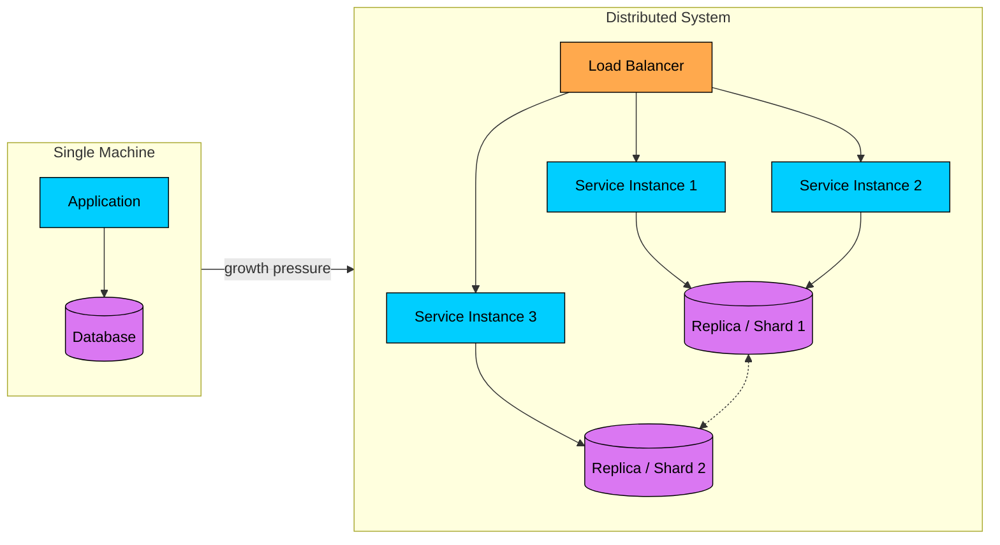
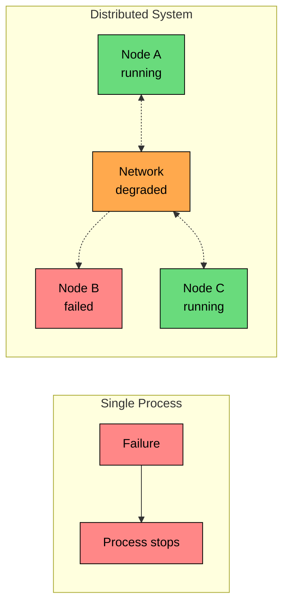
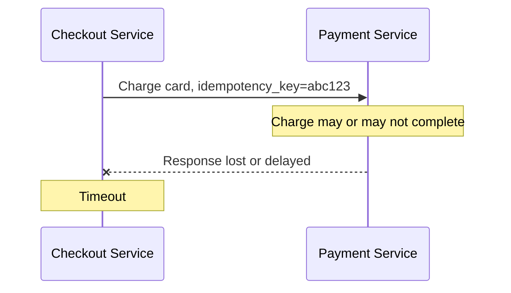
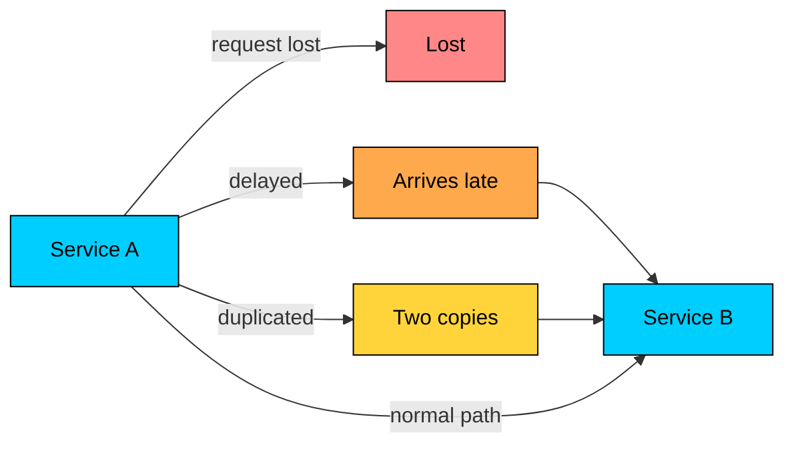
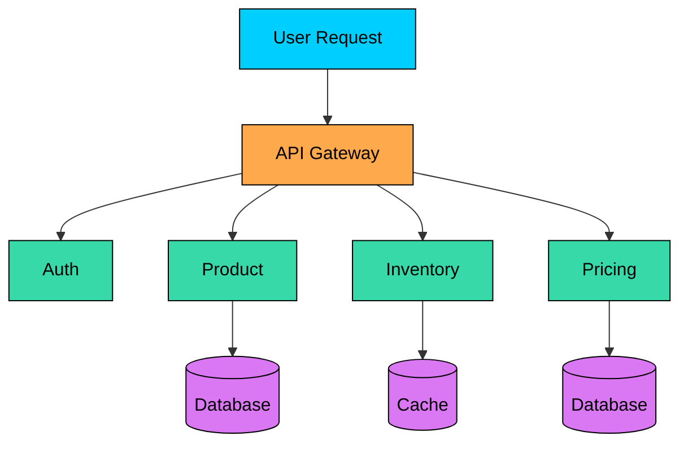
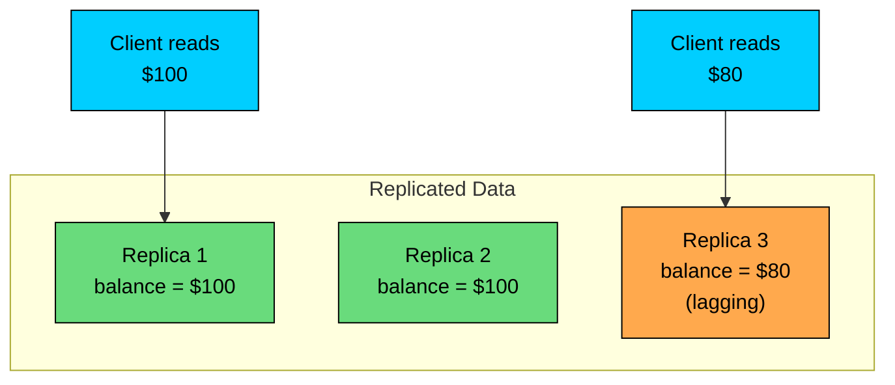

import React from 'react';
import CodeBlock from '../../../../components/ui/CodeBlock';
import Callout from '../../../../components/ui/Callout';

<div className="article-header">
  <div className="breadcrumb">
    <a href="/">Curated Notes</a>
    <span className="breadcrumb-separator">›</span>
    <span className="breadcrumb-current">Challenges of Distribution</span>
  </div>
  <h1>Challenges of Distribution</h1>
  <p style={{ color: 'var(--text-muted)', fontSize: '1.1rem', marginBottom: '16px', lineHeight: '1.6' }}>
    Master the essentials of Challenges of Distribution in this curated guide.
  </p>
  <div className="meta-info">
    <span className="meta-item">
      <svg width="14" height="14" viewBox="0 0 24 24" fill="none" stroke="currentColor" strokeWidth="2"><circle cx="12" cy="12" r="10"/><polyline points="12 6 12 12 16 14"/></svg>
      10 min read
    </span>
    <span className="difficulty-badge difficulty-badge--intermediate">Intermediate</span>
  </div>
</div>

<section className="content-section">

A distributed system is one whose work is spread across multiple machines that communicate over a network.

That one sentence hides most of the difficulty. Once a system crosses a network boundary, the assumptions that make single-machine software easy no longer hold.

A request can time out even though the server completed it. Two nodes can disagree about the current value of the same record. A clock can be correct enough for logs and still wrong enough to corrupt ordering logic.

These are not edge cases. They are normal operating conditions, and the goal is to build the right instincts for working with them: expect uncertainty, make operations repeatable, and coordinate only when the business requirement truly needs it.

---

## Why Distribute a System?

Distribution adds complexity, so there should be a clear reason to do it.


| Reason | What It Solves | Common Example |
|--------|----------------|----------------|
| **Scale** | One machine runs out of CPU, memory, disk, or network capacity | Add application servers behind a load balancer |
| **Availability** | One failed machine should not take down the whole service | Run replicas across multiple availability zones |
| **Latency** | Users are far from the only data center | Serve traffic from a region closer to the user |
| **Isolation** | One component should not exhaust resources for everything else | Split background jobs from request handling |
| **Team autonomy** | Large teams need independent ownership and deployments | Separate services for payments, search, and notifications |
| **Data residency** | Some data must stay in a specific region or country | Store EU customer data in EU regions |





The benefits are real. So is the cost. Every extra machine, service, replica, queue, and region creates another place where state can diverge and another network call that can fail.

---

## The Core Difference: Partial Failure

In a single process, failures are usually easier to reason about. A function returns, throws, or the process stops. The failure boundary is relatively clear.

Distributed systems introduce **partial failure**: one part of the system can fail while the rest continues running.

The payment service is healthy, but checkout cannot reach it. A database primary is down, yet replicas keep serving stale reads. One availability zone loses network connectivity while the others keep accepting traffic. A service processes a request successfully, then crashes before sending the response.





Partial failure is hard because the system may be neither clearly up nor clearly down. It is often in an unknown state.

#### The Timeout Problem

Suppose the checkout service asks the payment service to charge a card.





After the timeout, checkout cannot know which of these happened:

1. The request never reached the payment service.
2. The payment service charged the card, but the response was lost.
3. The payment service is still working and may finish later.
4. The payment service crashed halfway through and will recover later.

This is why distributed systems lean on a stack of patterns rather than one solution. Timeouts keep callers from waiting forever. Retries cover transient failures.

Idempotency keys make sure repeated requests do not produce repeated side effects. Durable state lets recovery resume from a known point. And reconciliation processes repair inconsistencies after the fact, once the truth is clearer.

The important lesson: a timeout does not mean failure. It means the caller stopped waiting.

---

## Challenge 1: Unreliable Networks

Distributed systems communicate by sending messages. Those messages travel through network cards, switches, routers, load balancers, proxies, kernels, queues, and application runtimes. Any one of those layers can delay, drop, duplicate, or reorder traffic.

A request or response can be lost entirely, or arrive much later than expected. A retry can deliver the same operation twice. Two messages sent in order can arrive out of order.

A subset of nodes can stay connected to each other but get cut off from the rest. And in the trickiest case, an asymmetric path lets A reach B even though B's responses to A keep disappearing.





#### The Two Generals Problem

The Two Generals Problem captures the impossibility of reaching certain agreement over an unreliable channel.

Two generals must attack at the same time. They can only communicate by sending messengers across dangerous territory. A messenger might be captured.


```shell
General A                    General B
    |                            |
    |------ Attack at dawn ----->|  maybe lost
    |                            |
    |<----- Confirmed -----------|  maybe lost
    |                            |
    |------ Confirmed confirmed->|  maybe lost
```


No finite exchange of acknowledgments can make both sides completely certain that the other side knows the plan. Each acknowledgment creates the need to know whether that acknowledgment was received.

Real systems are not helpless. TCP, retries, acknowledgments, message brokers, replication logs, and consensus protocols all improve reliability under specific assumptions.

But they do not remove uncertainty. They turn it into engineering choices with costs: latency, duplicate handling, storage, coordination, and failure recovery.

#### Practical Design Implications

When a request crosses a network, assume the caller may see an unknown outcome.

Good distributed designs make remote operations idempotent so retries are safe, bound them with timeouts so resources are not held forever, and make them observable enough that failures can be diagnosed from logs, metrics, and traces.

They also make operations recoverable, so a later process can finish or compensate incomplete work, and they are explicit about delivery semantics: at-most-once, at-least-once, or effectively exactly-once within a specific subsystem.

The common mistake is to treat a remote call like a local function call. It is not. A remote call is a request to another independent system that may succeed, fail, or leave you unsure.

---

## Challenge 2: No Shared Clock

On one machine, it is tempting to use timestamps to order events. In a distributed system, each machine has its own clock. Those clocks drift, get corrected, and may disagree by milliseconds or more.

NTP and similar systems are useful for keeping clocks close enough for logs, monitoring, token expiration, and human reasoning. They are not a general solution for ordering every event in a distributed system.


```shell
Same real moment:

Machine A clock: 10:00:00.000
Machine B clock: 10:00:00.037
Machine C clock: 09:59:59.982
```


Those differences look small, but many production systems process thousands of events in that window.

#### Why Wall-Clock Ordering Is Risky

Imagine two users editing the same profile.

1. User A updates the profile through Server A.
2. User B updates the same profile through Server B.
3. Server B's clock is 40 ms ahead.
4. The database resolves conflicts using "latest timestamp wins."

The update with the larger timestamp wins, but that may not be the update that happened later in real time. Worse, the losing update may disappear silently.

The same hazard appears across many subsystems. Last-write-wins conflict resolution can drop valid writes. Distributed lock expiration becomes unsafe when machines disagree about time.

Cache expiration and invalidation behave strangely under skew. And incident timelines can appear out of order when logs come from many nodes that never agreed on "now."

#### What Engineers Use Instead

If the system only needs approximate time, wall clocks are fine. If correctness depends on ordering, use a stronger mechanism.

Monotonic clocks measure elapsed time on a single machine but cannot be compared across machines. Lamport timestamps establish a causal order across message exchanges, though they cannot detect all concurrent events.

Vector clocks can detect concurrency, at the cost of metadata that grows with the number of nodes. Hybrid logical clocks combine physical time with logical ordering for the best of both, with more implementation complexity.

For the strongest guarantee, a consensus log produces a single agreed order at the cost of coordination latency.

The rule of thumb: use wall-clock time for observation and expiration; be careful using it for correctness.

---

## Challenge 3: Unpredictable Latency

Network calls do not have stable timing. A request that usually takes 2 ms can occasionally take 200 ms or 2 seconds. Under overload, a service may still be alive but too slow to be useful.

Latency is usually described with percentiles:


```shell
Example latency distribution:

p50   2 ms     Half of requests are faster than this
p90   8 ms     90% are faster than this
p99  40 ms     99% are faster than this
p999 250 ms    99.9% are faster than this
```


Average latency hides the problem. Users and upstream services feel the tail.

#### Why Tail Latency Matters

A user request often fans out to several downstream calls.





If one downstream call has a 1% chance of being slow, four independent calls have about a 3.9% chance that at least one is slow:


```shell
P(at least one slow call) = 1 - (0.99)^4 = 3.9%
```


With more fan-out, the chance of hitting a slow dependency grows quickly.

The causes are familiar to anyone who has debugged a slow endpoint: network congestion and packet retransmits, queueing inside a service, or garbage collection and runtime pauses.

Beyond the runtime, CPU throttling or a noisy neighbor on the same host, slow disk or database queries, cold caches after a restart, or simply the speed of light across regions can all add tail latency on their own.

#### Practical Design Implications

Latency problems become reliability problems when callers wait too long and consume threads, connections, memory, or queue capacity.

The defenses are familiar: realistic timeouts on every remote call, deadlines that nested calls share so each hop spends a slice of the caller's remaining budget, backpressure instead of unlimited acceptance, and circuit breakers that stop calling dependencies that are clearly unhealthy.

On top of that, avoid unnecessary fan-out on critical paths, and track tail latency, not only averages.

The goal is not to make every request fast. The goal is to keep slow requests from dragging the whole system down.

---

## Challenge 4: No Global State

On a single machine, state has one obvious location. In a distributed system, state is copied, partitioned, cached, queued, and replicated across many places.

There is no instant, authoritative view of "the whole system" that every node can read without coordination.





Different clients may see different values depending on which replica, cache, shard, or region handles their request.

#### Common State Problems

A user updates their address, but another service reads the old value from a lagging replica. Two services read the same counter, update it independently, and one write overwrites the other.

A retry creates two orders or sends two emails. Two regions accept different updates for the same record during a partition. The database is updated, but a cache still serves the old value.

These problems are not always unacceptable. A stale product recommendation is usually fine. A stale bank balance during withdrawal is not. The right design depends on the business invariant.

#### Consistency Has a Cost

Keeping distributed state consistent requires coordination. Coordination usually means extra messages, waiting for replicas, leader election, locks, transactions, quorums, or consensus.

That cost shows up as:

- Higher latency
- Lower throughput
- Reduced availability during failures
- More operational complexity

This is the heart of many distributed-system trade-offs. Stronger guarantees make application behavior easier to reason about, but they require more coordination. Weaker guarantees are faster and more available, but the application must tolerate or repair temporary inconsistency.

During a network partition, a system often has to choose between:

- **Rejecting some operations** to preserve consistency
- **Accepting operations independently** and reconciling conflicts later

Neither choice is universally correct. A payment ledger, a social feed, and an online presence indicator should not make the same trade-off.

---

## The Fallacies of Distributed Computing

The fallacies of distributed computing are a useful checklist of assumptions that break when software crosses a network.


| Assumption | Reality |
|------------|---------|
| The network is reliable | Messages can be lost, delayed, duplicated, or reordered |
| Latency is zero | Every remote call has a cost |
| Bandwidth is infinite | Large payloads and high fan-out saturate links |
| The network is secure | Traffic needs authentication, authorization, and encryption |
| Topology does not change | Nodes, routes, and dependencies change over time |
| There is one administrator | Different teams and vendors control different parts |
| Transport cost is zero | Moving data costs money, CPU, and time |
| The network is homogeneous | Regions, devices, protocols, and links behave differently |


These fallacies are old because the problems are old. They remain relevant because cloud infrastructure makes distribution easier to create, not easier to reason about.

---

## The Mental Model Shift

Distributed systems require a different mental model.


| Single-Machine Thinking | Distributed-System Thinking |
|-------------------------|-----------------------------|
| A call succeeds or fails | A call may leave the outcome unknown |
| State has one current value | State may differ across replicas |
| Time can order events | Clocks may disagree |
| Failure is usually local and obvious | Failure can be partial and ambiguous |
| Retrying is simple | Retrying can duplicate side effects |
| Strong coordination is cheap | Coordination costs latency and availability |


When designing a distributed operation, ask:

1. What happens if the request is lost?
2. What happens if the response is lost?
3. What happens if the operation runs twice?
4. What happens if another node sees stale state?
5. What happens if a node crashes after doing half the work?
6. What invariant must never be violated?

The last question matters most. You do not need perfect consistency everywhere. You need to know which parts of the system require it.

---

## Summary

Distribution is useful because it helps systems scale, survive failures, reduce latency, and support independent ownership. It is difficult because it removes the simple assumptions of single-machine software.

The main challenges are:

- **Partial failure:** Some components fail while others continue.
- **Unreliable networks:** Messages can be lost, delayed, duplicated, reordered, or isolated by partitions.
- **No shared clock:** Wall-clock timestamps are risky for ordering events across machines.
- **Unpredictable latency:** Slow dependencies can become system-wide reliability problems.
- **No global state:** Different nodes can hold different, temporarily valid views of the system.

Good distributed systems do not pretend these problems disappear. They make uncertainty explicit with timeouts, retries, idempotency, durable state, observability, reconciliation, and carefully chosen consistency guarantees.

The next chapters explore these ideas in more depth, starting with network partitions and the split-brain problem.

</section>
