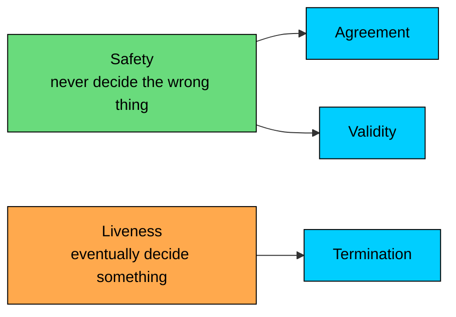
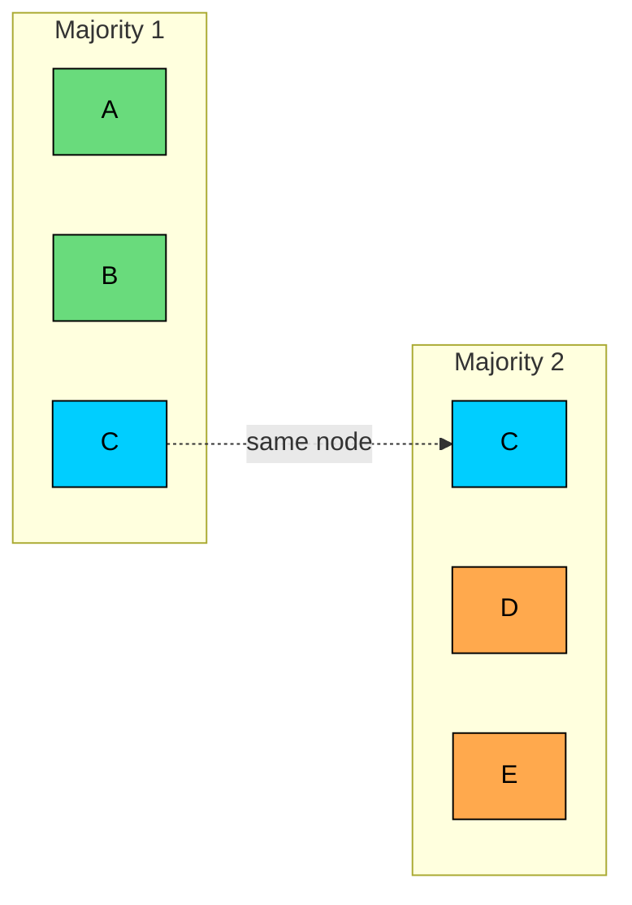
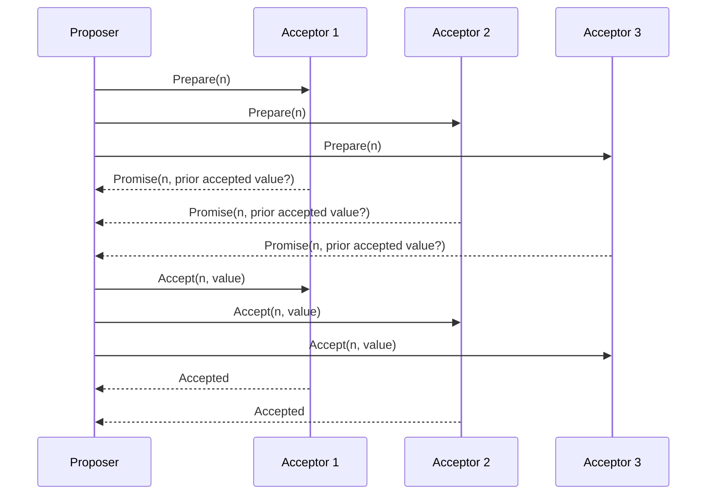
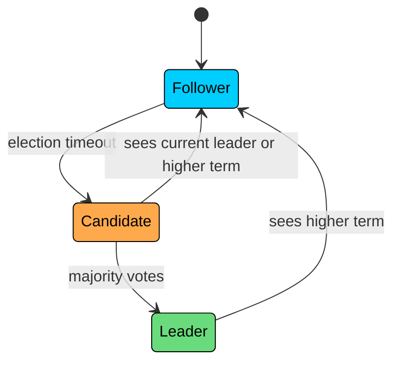
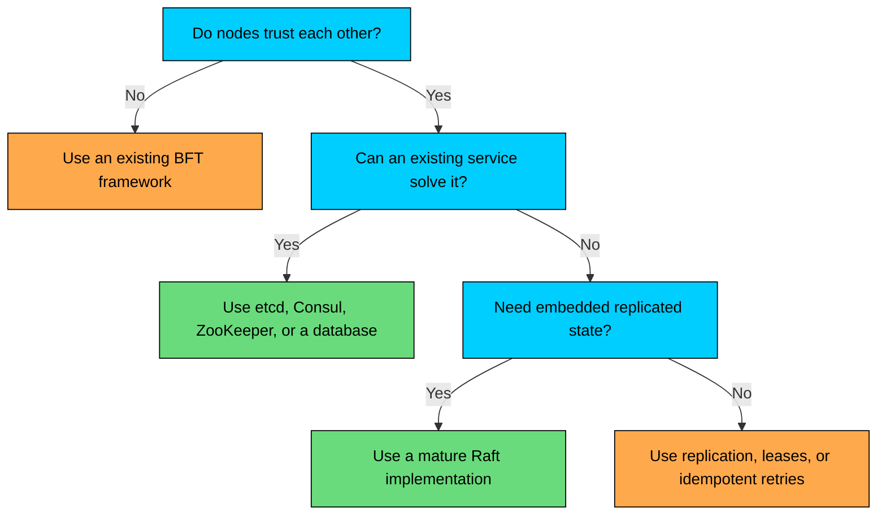

import React from 'react';
import CodeBlock from '../../../../components/ui/CodeBlock';
import Callout from '../../../../components/ui/Callout';

  

    <a href="/">Curated Notes</a>
    ›
    Consensus Algorithms Overview
  

  <h1>Consensus Algorithms Overview</h1>
  

    Master the essentials of Consensus Algorithms Overview in this curated guide.
  

  

    
      <svg width="14" height="14" viewBox="0 0 24 24" fill="none" stroke="currentColor" strokeWidth="2"><circle cx="12" cy="12" r="10"/><polyline points="12 6 12 12 16 14"/></svg>
      10 min read
    
    Intermediate
  

<section className="content-section">

Consensus is how a group of machines agrees on one decision even when some machines fail and messages are delayed.

That decision might be:

- Which node is the leader?
- What is the next entry in a replicated log?
- Has this transaction committed?
- Which configuration is active for the cluster?

Consensus is expensive, but it is the tool we use when correctness depends on agreement. Databases, coordination services, message brokers, and schedulers all rely on it somewhere, usually for a small but critical part of the system.

---

## What Consensus Guarantees

A consensus protocol solves a narrow problem: several nodes propose values, and the group chooses one value.

For a protocol to be correct, it must provide three properties.

| Property | Meaning | Why It Matters |
|----------|---------|----------------|
| **Agreement** | Correct nodes do not decide different values | Prevents split-brain and divergent state |
| **Validity** | The chosen value must come from a proposed value | Prevents meaningless decisions |
| **Termination** | Correct nodes eventually decide | Prevents the protocol from running forever |

Agreement and validity are **safety** properties. They prevent bad outcomes. Termination is a **liveness** property. It says the system eventually makes progress.

The FLP result explains the hard part: in a fully asynchronous network, no deterministic consensus algorithm can guarantee termination if even one node may crash.

Production systems deal with this by making practical assumptions:

- A majority of voting nodes eventually remains reachable.
- Message delays eventually become reasonable.
- Clocks are not used for correctness, only for timeouts and retries.
- Nodes can persist enough state to survive restarts.

Under those assumptions, protocols such as Paxos and Raft preserve safety during failures and recover liveness when the system stabilizes.

That distinction matters. A healthy consensus system may stop accepting writes during a bad partition, but it must not commit two conflicting histories.

---

## The Common Pattern

Crash-fault-tolerant consensus systems tend to use the same building blocks. A **quorum** requires a majority so two decisions cannot be made by disjoint groups. An **epoch number** marks leadership generations and rejects stale messages. A **leader** (or primary) serializes writes through one node during normal operation. A **replicated log** stores the agreed sequence of commands, and **durable state** lets each node remember votes and log entries across crashes.

Consensus relies on quorum intersection. In a five-node cluster, any majority has at least one node in common with any other majority. That overlap carries information from old decisions into new ones.

This is why consensus clusters usually use an odd number of voters. Three voters tolerate one failure. Five tolerate two. Four voters still require three for a majority, so the cluster tolerates the same single failure as three voters while making it easier to lose quorum: any two failures out of four nodes break the cluster, and every write costs one extra acknowledgment. Adding the fourth voter raises cost and lowers availability at the same time.

---

## Paxos

Paxos is the classic consensus algorithm. Leslie Lamport introduced it in the late 1980s, and it became the foundation for much of the distributed systems work that followed.

Basic Paxos decides one value through three roles. A **proposer** suggests a value and drives the protocol. **Acceptors** vote on proposals and store promises. **Learners** find out which value was chosen. In real systems, one server often plays all three roles; the separation exists to explain the protocol.

Paxos has two phases:

1. **Prepare / Promise:** A proposer asks acceptors to promise not to accept older proposal numbers. Acceptors also report any value they have already accepted.
2. **Accept / Accepted:** The proposer asks acceptors to accept a value. If it learned about a previous accepted value, it must carry that value forward.

The second rule is what keeps Paxos safe. A new proposer cannot overwrite a value that may already have been chosen by a majority.

Paxos is proven, but it leaves many engineering details to the implementation. Basic Paxos decides a single value, while real systems need a sequence of values. Multi-Paxos handles that by using a stable leader and running Paxos over log slots. Once the leader is established, normal writes avoid the full prepare phase.

**Where it shows up:** Google Chubby and Spanner use Paxos-style protocols. Many systems also use Paxos variants internally, often with implementation-specific optimizations.

**Main trade-off:** Paxos has excellent theoretical foundations, but the protocol is hard to explain, hard to implement, and easy to get subtly wrong.

---

## Raft

Raft was designed to provide the same kind of replicated-log consensus as Multi-Paxos, but with a clearer structure.

It separates the problem into three parts:

- **Leader election:** choose one leader for a term.
- **Log replication:** have the leader append entries and replicate them to followers.
- **Safety:** prevent a leader without the right log history from being elected.

Every Raft node is a follower, candidate, or leader. Time is divided into terms. A node that sees a higher term steps down, which prevents old leaders from continuing to act as if they are current.

During normal operation:

1. The client sends a write to the leader.
2. The leader appends the command to its log.
3. The leader sends the entry to followers.
4. Once a majority stores the entry, the leader commits it.
5. Followers apply committed entries in log order.

A few Raft concepts recur throughout the protocol. A **term** is a leadership generation. The **leader** serializes writes. The **commit index** marks the highest log entry known to be committed. The **log matching** property ensures that replicas with the same index and term agree on every previous entry. Raft also uses a **randomized election timeout** to reduce repeated split votes.

Raft is popular because the full protocol is easier to teach, test, and operate than Paxos. Production Raft still has hard problems: disk persistence, snapshots, membership changes, slow followers, clock tuning, and client retry behavior.

**Where it shows up:** etcd, Consul, CockroachDB, TiKV, YugabyteDB, RabbitMQ quorum queues, and Kafka's KRaft metadata quorum all use Raft or Raft-inspired replication.

**Main trade-off:** Raft is usually the best choice when you need to understand or implement consensus, but you should still prefer a mature library or service over writing your own protocol.

---

## Viewstamped Replication

Viewstamped Replication (VR), introduced by Oki and Liskov in 1988 and later revised, is another leader-based replicated state machine protocol.

VR uses different names for familiar ideas. A **view** is what Raft calls a term. The **primary** is the leader, **backups** are followers, a **view change** is a leader election, and an **operation number** is a log index.

During normal operation, the primary orders client requests and replicates them to backups. A request commits after a quorum acknowledges it. If the primary fails, replicas run a view-change protocol to select a new primary and preserve committed operations.

VR matters because it shows that many consensus ideas are not unique to Paxos or Raft. Quorums, epochs, leaders, and replicated logs appear again and again because they solve the same underlying failure cases.

**Where it shows up:** VR is mainly historical and academic, but its ideas influenced later protocols, including Raft.

---

## ZAB

ZAB, the ZooKeeper Atomic Broadcast protocol, is the protocol behind Apache ZooKeeper.

ZooKeeper is a coordination service. It stores small amounts of critical metadata and provides primitives used for leader election, service discovery, configuration, and locks.

ZAB is usually described as an atomic broadcast protocol rather than plain single-value consensus. It ensures ZooKeeper replicas deliver state changes in the same order.

Key ideas:

- Writes go through the ZooKeeper leader.
- Each transaction gets a `zxid`, made from an epoch and a counter.
- Followers acknowledge proposals.
- A transaction commits after a quorum acknowledges it.
- Leader recovery synchronizes followers before normal broadcasting resumes.

ZooKeeper nodes play one of three roles. The **leader** orders writes and proposes transactions. **Followers** vote, store state, and can serve reads. **Observers** are non-voting replicas used to scale reads.

Observers are useful because adding voting members increases quorum cost. A five-voter cluster needs three acknowledgments. A seven-voter cluster needs four. Observers receive updates without changing the voting quorum.

**Where it shows up:** ZooKeeper is still used in parts of the Hadoop ecosystem, HBase, and systems built around ZooKeeper's coordination primitives. Kafka removed ZooKeeper mode entirely in Kafka 4.0, so current Kafka clusters use KRaft, a Raft-based metadata quorum, instead.

**Main trade-off:** ZooKeeper gives mature coordination primitives, but operating it well still requires care around quorum sizing, session timeouts, disk latency, and client behavior.

---

## Byzantine Fault Tolerance

Paxos, Raft, VR, and ZAB assume **crash faults**: a node may stop, restart, or miss messages, but it does not lie.

Byzantine fault tolerant protocols handle a stronger model. A Byzantine node can behave arbitrarily:

- Send different messages to different peers.
- Claim false state.
- Sign conflicting votes if the protocol allows it.
- Try to make honest nodes disagree.

This matters when participants do not fully trust each other, such as public blockchains or some permissioned multi-party systems.

BFT costs more because the protocol must outvote malicious behavior.

| Failure Model | Nodes Needed to Tolerate f Faults | Typical Use |
|---------------|-----------------------------------|-------------|
| **Crash fault tolerance** | `2f + 1` | Internal databases and coordination services |
| **Byzantine fault tolerance** | `3f + 1` | Blockchains and untrusted multi-party systems |

PBFT is the classic practical BFT protocol. Tendermint brought BFT consensus into proof-of-stake blockchain systems. HotStuff simplified parts of BFT consensus and influenced later blockchain designs.

Company-owned infrastructure rarely needs BFT. If you control the nodes and the operators, crash-fault-tolerant consensus is usually the right model. Use authentication, authorization, auditing, and isolation to reduce the chance of compromised nodes instead of paying the cost of BFT on every decision.

---

## Choosing an Approach

Start by asking whether an existing system can handle the consensus problem for you.

A production design should prefer a proven component:

| Need | Practical Choice |
|------|------------------|
| Kubernetes metadata | etcd |
| Service discovery and key-value coordination | Consul or etcd |
| ZooKeeper-style coordination primitives | ZooKeeper |
| Strongly consistent distributed SQL | A database that already embeds Raft or Paxos |
| Ordered replicated metadata inside Kafka | KRaft (the only metadata mode from Kafka 4.0 onward) |
| Untrusted validators | A mature BFT or blockchain framework |

If you are building a new internal replicated service and truly need embedded consensus, Raft is usually the best starting point. It has clear documentation, good test material, and many production implementations to learn from.

Paxos is useful background, especially when reading papers or older systems. For a fresh implementation, Paxos usually gives you more freedom than you want. Freedom in consensus protocols often becomes ambiguity, and ambiguity becomes bugs.

Use consensus for small, critical decisions. Do not route every user request through one global consensus group unless the business requirement demands it. High-scale systems usually shard data and run many independent consensus groups.

---

## Performance and Scaling

Consensus adds latency because a write must reach a quorum before it is committed. In a single datacenter, this can be a few milliseconds. Across regions, the speed of light dominates. A leader in one region waiting for a quorum in another region will pay cross-region round-trip time.

Throughput is usually limited by:

- Leader CPU
- Disk sync latency
- Network bandwidth
- Follower lag
- Size and frequency of log entries

Consensus usually scales by splitting work across many independent groups. Inside a single group, **batching** commits many operations per round trip and **pipelining** keeps multiple replication requests in flight. **Snapshots** compact old log entries and speed up recovery, and **non-voting replicas** scale reads without enlarging the quorum. To scale beyond what one group can do, **sharding** (or multi-Raft) spreads data across many independent consensus groups.

This is why systems such as CockroachDB and TiKV use many Raft groups instead of one global group. Each shard has strong consistency locally, while the cluster scales by distributing shards.

---

## Summary

Consensus is the machinery behind strongly consistent distributed systems. It lets nodes agree on leaders, log entries, transactions, and cluster metadata despite crashes and network delays.

The main ideas are:

- Consensus guarantees agreement and validity as safety properties.
- Termination requires practical assumptions about timing and available quorums.
- Paxos is foundational but difficult to implement correctly.
- Raft packages the same core ideas into a clearer replicated-log protocol.
- VR and ZAB use similar leader, epoch, quorum, and log patterns.
- BFT protocols handle malicious or arbitrary behavior, but they cost more.
- Production systems should use mature consensus implementations whenever possible.
- Consensus should protect critical state, not become an unnecessary bottleneck for every request.

</section>
