import React from 'react';
import CodeBlock from '../../../../components/ui/CodeBlock';
import Callout from '../../../../components/ui/Callout';

  

    <a href="/">Curated Notes</a>
    ›
    The Problem with Distributed Transactions
  

  <h1>The Problem with Distributed Transactions</h1>
  

    Master the essentials of The Problem with Distributed Transactions in this curated guide.
  

  

    
      <svg width="14" height="14" viewBox="0 0 24 24" fill="none" stroke="currentColor" strokeWidth="2"><circle cx="12" cy="12" r="10"/><polyline points="12 6 12 12 16 14"/></svg>
      10 min read
    
    Intermediate
  

<section className="content-section">

A local transaction is simple because one database owns the data. The application runs a sequence of statements, and the database commits everything or rolls everything back.

Distributed systems remove that single point of control. One business operation, like placing an order, may touch several services that each own their own database and commit independently. That creates the core problem: **how do we keep the whole business operation correct when some steps commit and later steps fail?**

If payment succeeds but the order is never confirmed, the customer is charged for something the system cannot ship. If inventory is reserved but payment fails, stock sits locked even though nobody bought it. This chapter looks at why local ACID transactions do not extend naturally across services, why failures in distributed workflows are hard to interpret, and what any solution must handle.

---

## Local Transactions Are Simple

In a single database, the transaction manager sees all the data involved.

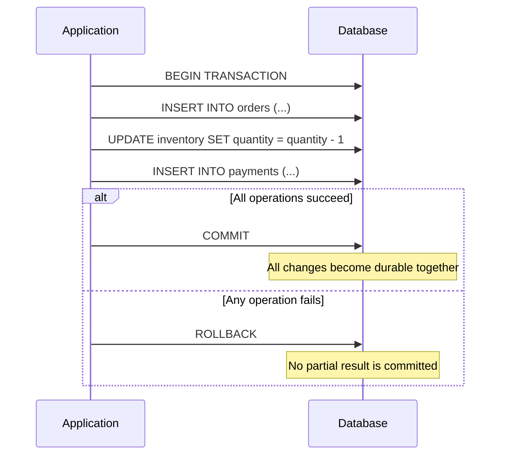

The database provides ACID guarantees:

| Property | Guarantee |
|----------|-----------|
| **Atomicity** | The transaction commits completely or not at all |
| **Consistency** | Committed data satisfies the database's rules and constraints |
| **Isolation** | Concurrent transactions do not observe unsafe intermediate states |
| **Durability** | Committed changes survive crashes according to the database's durability settings |

This works because the database can lock rows, track uncommitted changes, check constraints, and recover from its own log. One system owns the decision.

---

## Distributed Work Has No Single Owner

Now split the same operation across services.

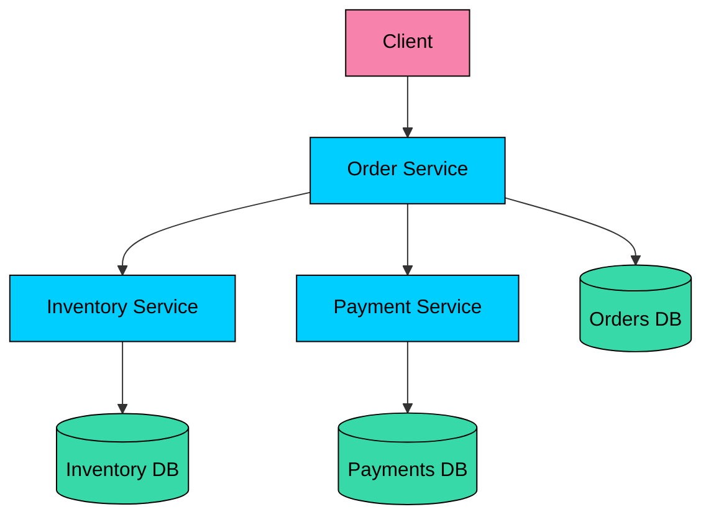

Each service can make a correct local decision and still leave the overall workflow in a bad state.

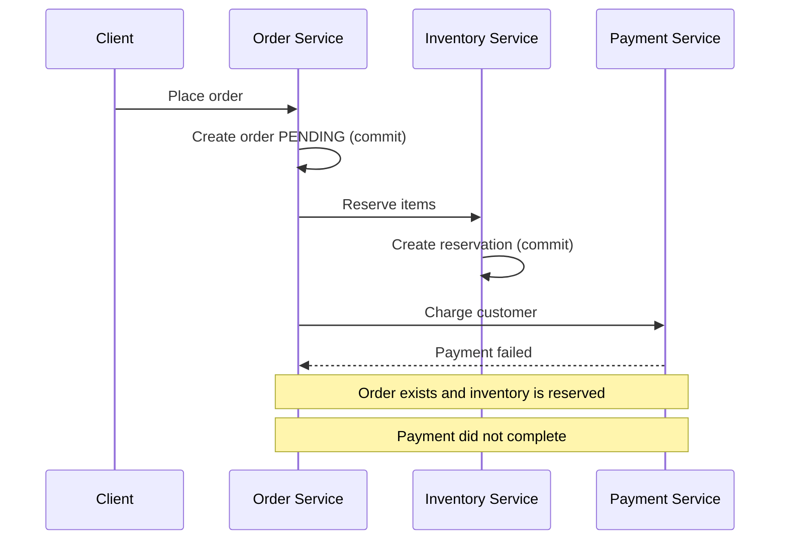

The order database cannot roll back the inventory database. The inventory service cannot know the payment result unless someone tells it. The payment service may not even be part of the same infrastructure.

Once a service commits a local transaction, undoing it is no longer a database rollback. It is a new business action, such as canceling an order, releasing a reservation, voiding an authorization, or issuing a refund.

---

## Why Not Use One Shared Database?

Putting all data in one database can be the right answer for many systems, especially early in a product's life. A modular monolith with strong local transactions is often simpler and safer than premature microservices.

But large systems sometimes split ownership for good reasons:

| Reason | What It Means |
|--------|---------------|
| **Independent scaling** | Payment, search, inventory, and order traffic may have very different load patterns |
| **Data ownership** | Teams need clear authority over schemas, writes, and invariants |
| **Technology fit** | Some workloads need relational storage, others need document, key-value, search, or ledger-style stores |
| **Fault isolation** | One overloaded subsystem should not take down every workflow |
| **Deployment independence** | Teams may need to change services without coordinating every database migration |

The trade-off is real. Service autonomy moves some consistency work out of the database and into the system design.

---

## Failure Scenarios

Distributed failures are often partial. One service may commit, another may time out, and a third may still be processing.

#### Partial Commit

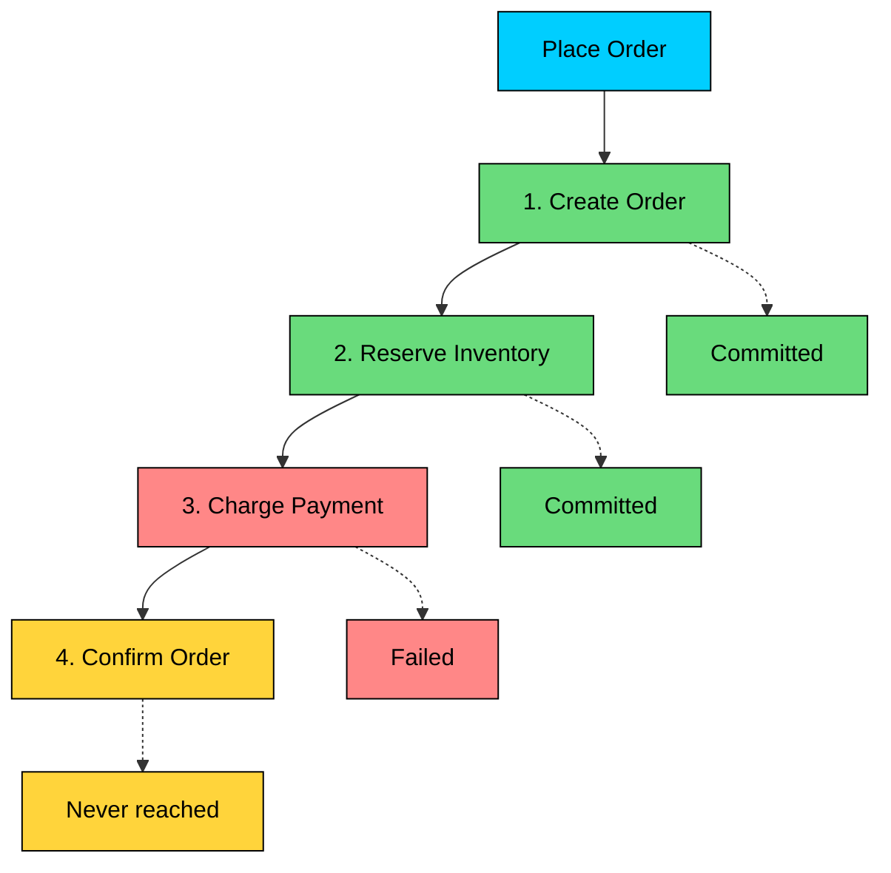

The first two services did exactly what they were asked to do. The workflow is still incomplete.

#### Network Partition

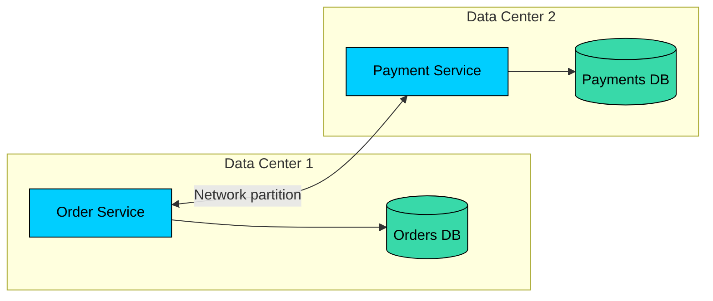

When services cannot communicate, the caller does not know whether the remote service is down, slow, isolated, or still doing the work.

#### Timeout Ambiguity

A timeout is not a result. It is the absence of a result.

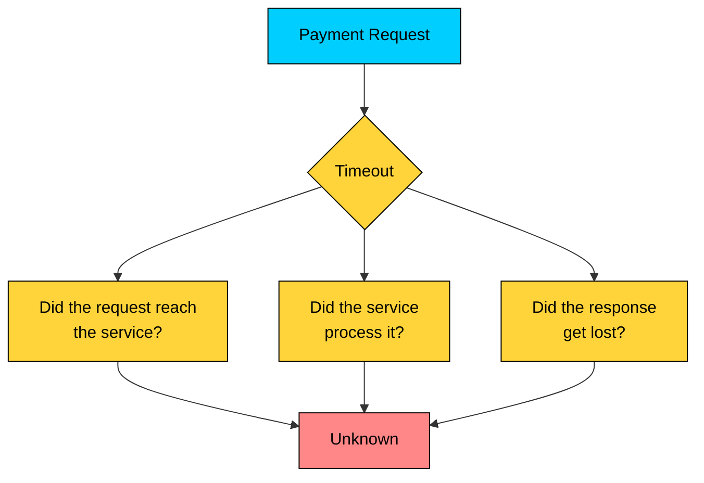

| What Happened | Payment State | Retrying Without Protection |
|---------------|---------------|-----------------------------|
| Request never arrived | Not charged | Safe |
| Request arrived and failed before commit | Not charged | Usually safe |
| Request succeeded but response was lost | Charged | May double-charge |

This is why production payment and ordering systems rely on idempotency keys, durable request records, unique constraints, and reconciliation jobs. Retrying is necessary, but blind retrying is dangerous.

#### Service Crash

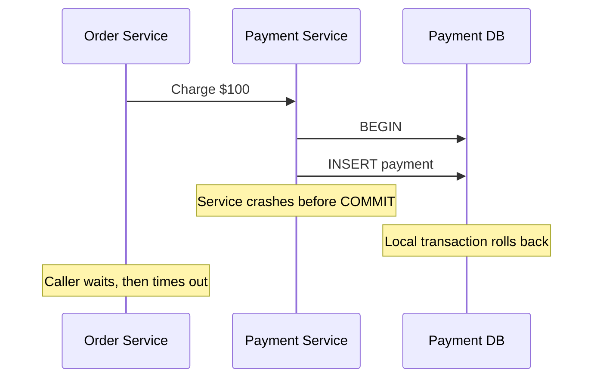

The payment was not committed, but the caller does not automatically know that. A crash after commit but before the response would look similar from the caller's point of view.

---

## Consistency Choices

Local transactions usually give one application a strong view of one database. Distributed systems make you choose where strong consistency is worth the cost.

#### Strong Consistency

Strong consistency means reads reflect the latest committed write according to the system's contract. In practice, this usually requires coordination before the write is acknowledged or before a read is served.

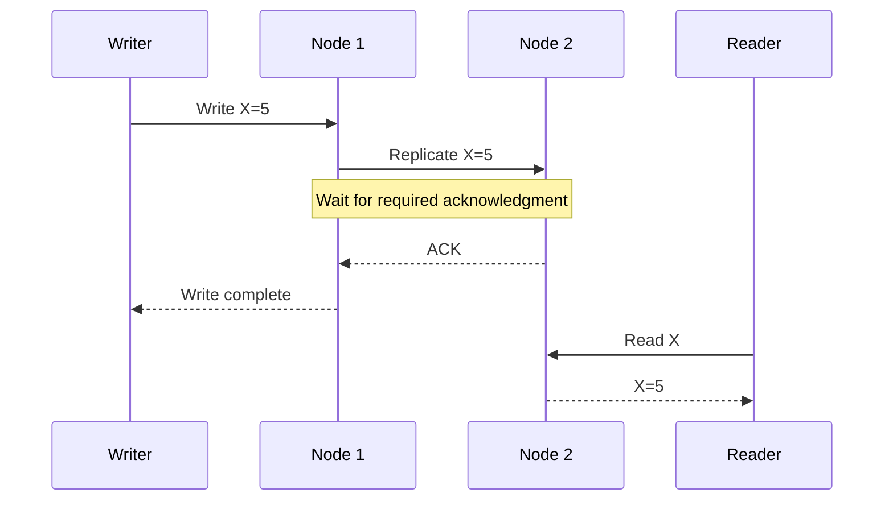

The cost is latency and reduced availability when the required participants cannot communicate.

#### Eventual Consistency

Eventual consistency means replicas or services may disagree for a while, but converge if updates stop and messages are delivered.

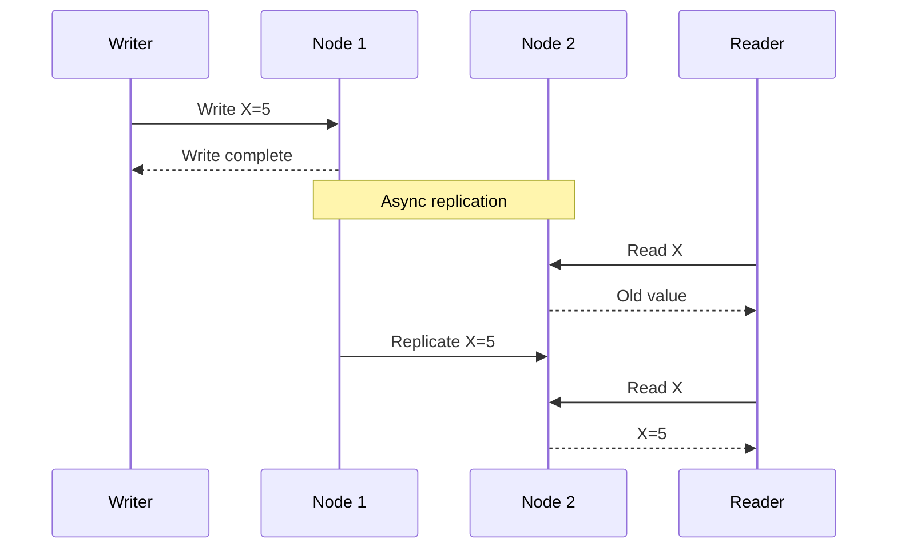

The benefit is lower latency and better availability. The cost is that application code must handle intermediate states.

#### The CAP Connection

During a network partition, a distributed system cannot always provide both a consistent answer and an available answer.

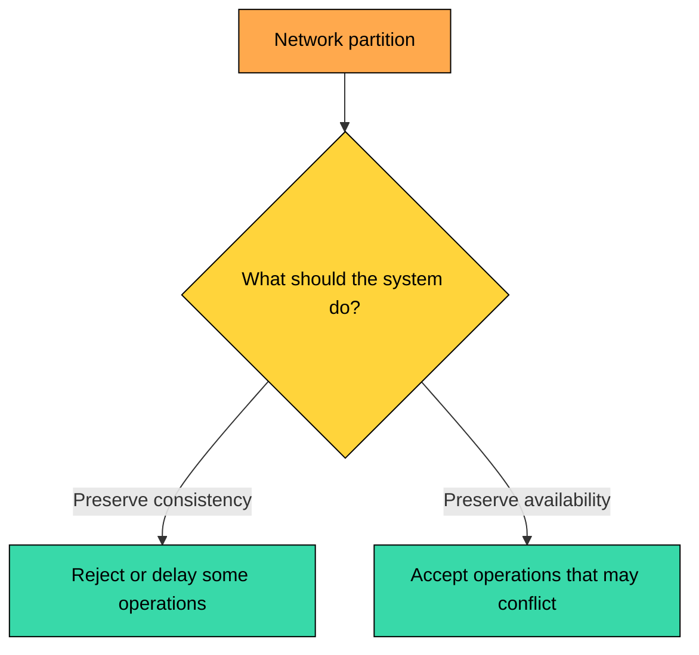

This is the practical lesson from CAP. Partitions are not an exotic edge case; they are part of operating distributed systems. Your design must decide what happens when coordination is not possible.

---

## Real Consequences

Inconsistent state becomes support tickets, accounting gaps, unavailable inventory, and manual cleanup.

#### Double Charge

Scenario: payment succeeds, but the response is lost

1. Order Service calls Payment Service.
2. Payment Service charges the customer.
3. The response is lost.
4. Order Service times out and retries.
5. Payment Service charges the customer again.

#### Unconfirmed Order

Scenario: payment succeeds, but order confirmation fails

1. Payment Service captures $100.
2. Order Service fails before marking the order `CONFIRMED`.
3. The order remains `PENDING` or lacks its payment reference.
4. Support sees a charge with no clear fulfillment state.

#### Orphaned Reservation

Scenario: inventory is reserved, but payment fails

1. Inventory Service reserves 5 items.
2. Payment Service declines the card.
3. The workflow crashes before releasing the reservation.
4. Items appear unavailable until cleanup runs.

#### Conflicting Decisions

Scenario: two services make local decisions from stale information

1. Inventory says the last item is available.
2. Two order workflows reserve it concurrently.
3. Both payments succeed.
4. Only one order can be fulfilled.

---

## Why Agreement Is Hard

Distributed transaction systems are built on unreliable communication between independently failing components.

#### No Shared Memory

Services cannot share local variables, process memory, or database locks. They coordinate by sending messages.

Messages can be delayed, lost, duplicated, reordered, or delivered after the caller has already given up.

#### No Perfect Failure Detector

If a service does not respond, you cannot tell from the outside whether it crashed, paused for garbage collection, lost network connectivity, or completed the work but lost the response.

Timeouts are useful engineering tools. They are not proof of failure.

#### No Reliable Global Clock

Each machine has its own clock, and clocks drift.

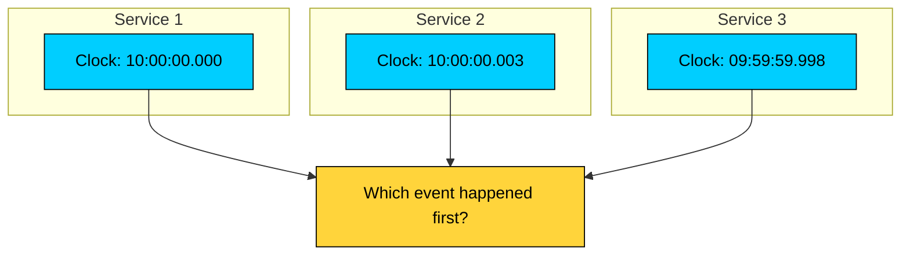

Timestamps are useful for observability, ordering within one system, and conflict resolution policies. They are not an authoritative source of truth for cross-service transaction order.

#### Agreement Needs Durable State

If a coordinator asks three participants to commit, every participant must be able to recover its local transaction state after a crash. That means durable logs, transaction IDs, retries, and careful handling of duplicate messages.

This is why distributed transaction protocols are more than "call three services and roll back on error." The hard part is recovery after failures at every point in the workflow.

---

## What a Good Solution Must Handle

A practical design must answer these questions:

| Question | Why It Matters |
|----------|----------------|
| **Who decides the final outcome?** | Without a decision point, services may disagree forever |
| **What is recorded durably?** | Recovery depends on facts that survive crashes |
| **Are retries safe?** | Duplicate requests are normal in distributed systems |
| **What states can users see?** | Intermediate states must be valid business states |
| **How are failures repaired?** | Some work needs compensation, reconciliation, or manual review |
| **What is the availability trade-off?** | Stronger coordination often means more waiting or blocking |

No pattern gives perfect atomicity, isolation, availability, low latency, and simple operations across arbitrary services. Good systems choose the right trade-off for each workflow.

---

## Approaches

Several patterns address distributed transactions, each with different trade-offs.

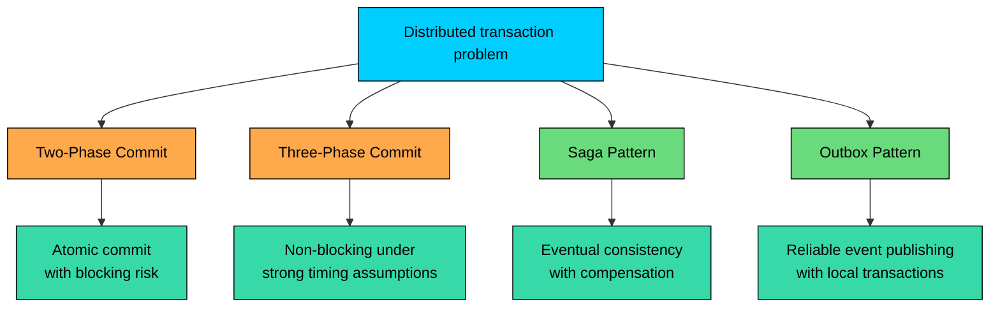

| Pattern | Best Fit | Main Trade-off |
|---------|----------|----------------|
| **Two-Phase Commit** | Databases or tightly controlled transactional resources | Strong atomic commit, but participants can block while holding locks |
| **Three-Phase Commit** | Teaching distributed commit limitations | Adds a phase, but relies on assumptions that rarely hold in real networks |
| **Saga** | Long-running business workflows across services | Higher availability, but intermediate states and compensation are visible |
| **Outbox** | Reliable event publishing from a service database | Solves message publishing consistency, not the whole business transaction by itself |

---

## Summary

Distributed transactions are hard because the system loses the one thing local transactions depend on: a single authority with complete control over the data.

In a distributed workflow:

- each service commits its own local transaction
- later failures cannot be erased by database rollback
- timeouts do not tell you what happened
- retries can create duplicates unless operations are idempotent
- intermediate states must be valid and observable
- recovery requires durable state, not just error handling

The goal is not to pretend distributed workflows behave like one database transaction. The goal is to design explicit coordination, compensation, retry, and reconciliation paths so the system reaches a correct business outcome.

</section>
