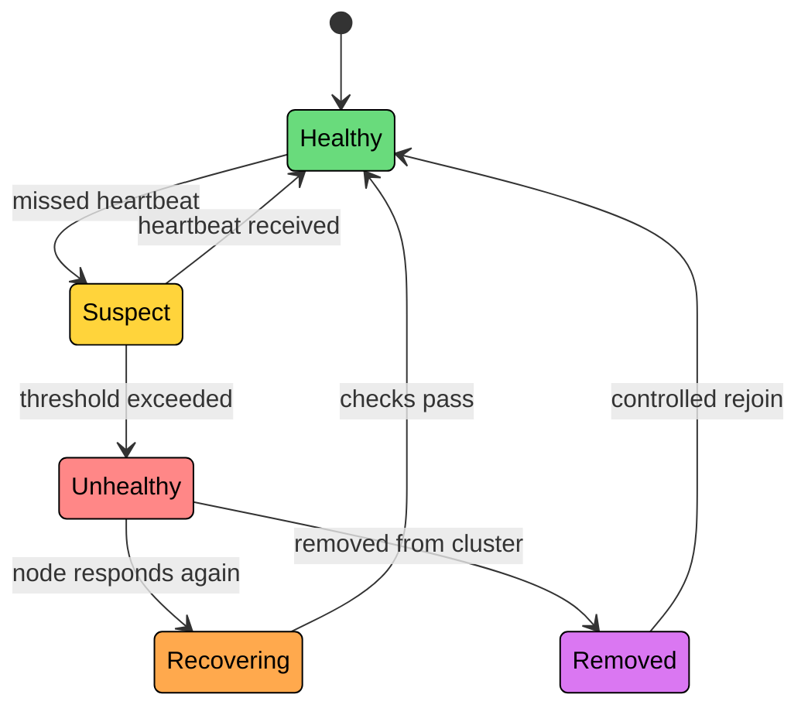
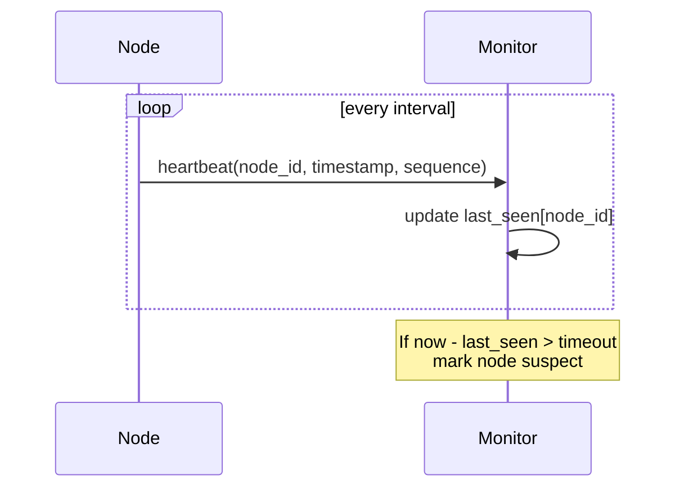
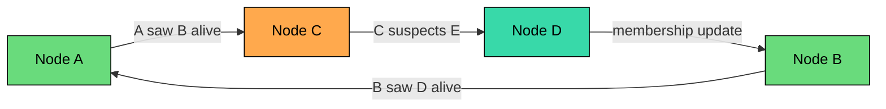
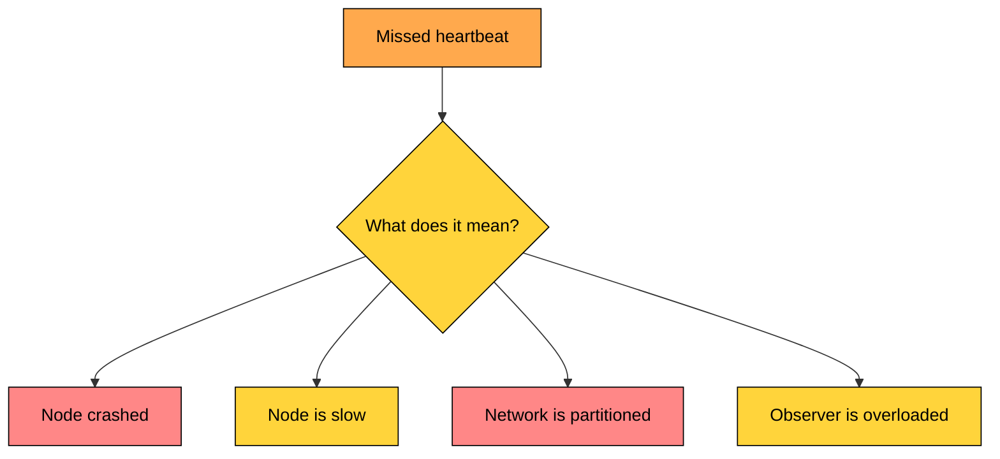
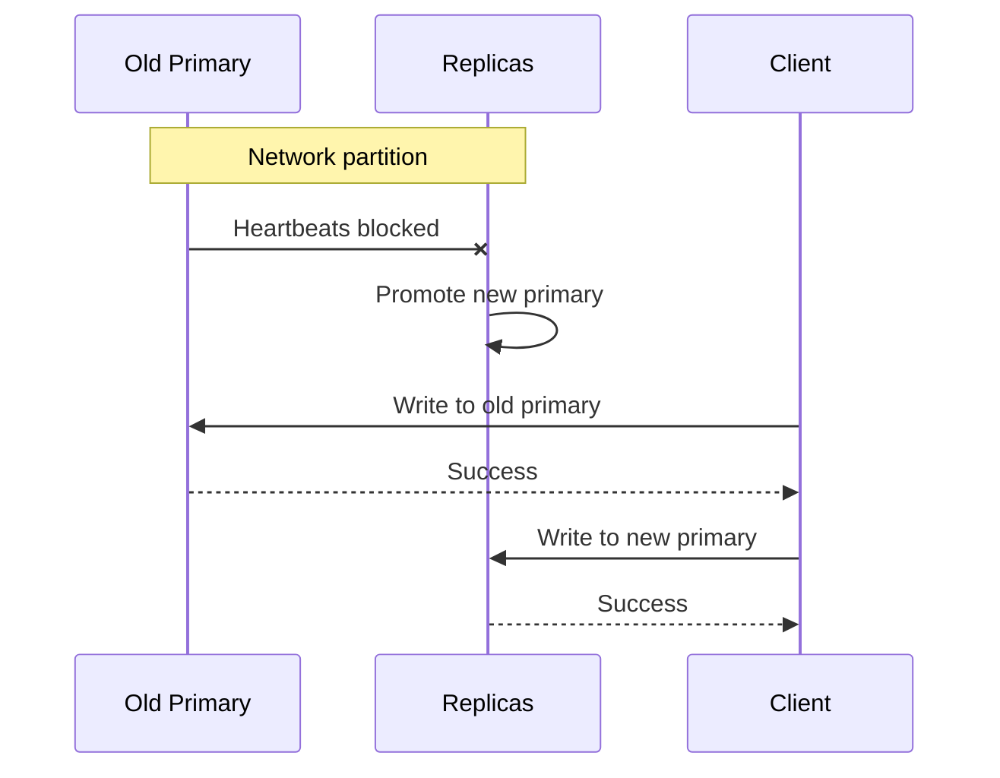

import React from 'react';
import CodeBlock from '../../../../components/ui/CodeBlock';
import Callout from '../../../../components/ui/Callout';

<div className="article-header">
  <div className="breadcrumb">
    <a href="/">Curated Notes</a>
    <span className="breadcrumb-separator">›</span>
    <span className="breadcrumb-current">Heartbeats</span>
  </div>
  <h1>Heartbeats</h1>
  <p style={{ color: 'var(--text-muted)', fontSize: '1.1rem', marginBottom: '16px', lineHeight: '1.6' }}>
    Master the essentials of Heartbeats in this curated guide.
  </p>
  <div className="meta-info">
    <span className="meta-item">
      <svg width="14" height="14" viewBox="0 0 24 24" fill="none" stroke="currentColor" strokeWidth="2"><circle cx="12" cy="12" r="10"/><polyline points="12 6 12 12 16 14"/></svg>
      10 min read
    </span>
    <span className="difficulty-badge difficulty-badge--intermediate">Intermediate</span>
  </div>
</div>

<section className="content-section">

A heartbeat is a small periodic message that says, "I am still alive."

Distributed systems use heartbeats to detect when nodes, services, workers, or connections may have failed. They are simple and ubiquitous: databases, queues, Kubernetes, service discovery, leader election, WebSocket connections, and storage systems all use some version of them.

But heartbeats come with an important warning: a missing heartbeat does not prove a node is dead. It only proves the observer did not receive a message in time.

Acting too quickly on missed heartbeats can trigger unnecessary failovers and even split-brain. Acting too slowly increases downtime.

---

## What Heartbeats Detect


&gt; [!PAYWALL] This content is for premium members only.


Heartbeats help answer one question:

&gt; Have I heard from this component recently enough to keep trusting it?

They are used to detect or suspect a crashed node, a stopped process, a broken network path, a stalled worker, a disconnected client, a leader that is no longer reachable, or a replica that has stopped keeping up.

The careful word is **suspect**. A heartbeat system should usually move a component through states, not jump straight from healthy to dead.





This gives the system room to handle short network hiccups without overreacting.

---

## How Heartbeats Work

A basic heartbeat system has two roles:

- **Sender:** the node or process that sends periodic heartbeats
- **Observer:** the monitor, peer, control plane, or coordinator that tracks them





A heartbeat message is usually small. At minimum it carries a node ID so the observer knows who sent it, and a timestamp for rough freshness checks and debugging.

A sequence number helps detect missed, duplicated, or reordered heartbeats. Some systems also include the sender's current role (leader, follower, worker, standby), a short health summary like CPU and queue depth, or a replication position that shows whether a replica is still keeping up.

Keep the payload small unless the extra data is used for a real decision. In large clusters, even small messages add up quickly.

---

## Push, Pull, and Gossip

There are several heartbeat models.

#### Push Heartbeats

Nodes send heartbeats to a monitor or coordinator.


```shell
Every 5 seconds:
  worker-17 -> coordinator: I am alive
```


Push is simple and efficient when many nodes report to one control plane. Kubernetes nodes reporting to the API server are an example of this pattern.

The weakness is the central observer. If the observer is overloaded or unreachable, many healthy nodes may look unhealthy.

#### Pull Heartbeats

The observer periodically checks each node.


```shell
Every 5 seconds:
  monitor -> service-12: health check
  service-12 -> monitor: OK
```


Pull is common for load balancers and service health checks. It verifies that the node can respond to a specific kind of request.

The weakness is scale. A monitor probing thousands of nodes too often can become a bottleneck.

#### Gossip Heartbeats

Nodes exchange health information with peers instead of reporting only to one monitor.





Gossip scales well because failure information spreads through the cluster gradually. Systems such as Cassandra and Consul use gossip-style membership and failure detection.

The trade-off is that detection is eventual. Different nodes may temporarily have different views of who is alive.

---

## Intervals, Timeouts, and Thresholds

Heartbeat behavior is mostly controlled by three settings.

The **interval** is how often heartbeats are sent: shorter intervals detect failures faster but use more network and CPU. The **timeout** is how long the observer waits before becoming suspicious: shorter timeouts react faster but create more false positives.

The **failure threshold** is how many missed heartbeats trigger action: a higher threshold is safer but slower.

Example:


```shell
Heartbeat interval: 2 seconds
Failure threshold: 3 missed heartbeats
Expected detection time: about 6 seconds plus network and processing delay
```


A common starting point is to declare suspicion after 2-5 missed heartbeats. The right value depends on the network, workload, and cost of being wrong.

#### Fast Detection vs. False Positives

Every choice here is a trade. A short interval and low threshold give fast failover but produce false positives during latency spikes or GC pauses.

A long interval and high threshold avoid false positives at the cost of slower recovery from real failures.

An adaptive timeout that adjusts to observed latency fits variable networks better, but adds implementation complexity. A multi-stage suspicion model (healthy → suspect → unhealthy) avoids many bad decisions, at the cost of more states to reason about.

There is no perfect timeout. Distributed failure detection is probabilistic. You are choosing how quickly the system should act on incomplete evidence.

---

## Why Missed Heartbeats Happen

Missed heartbeats do not always mean crashes. The process may genuinely be gone, but more often something subtler is happening.

A network partition can stop heartbeats from reaching the observer even though the sender is healthy. CPU saturation can leave the process alive but unable to schedule the heartbeat work.

A garbage collection pause or a disk stall can keep the node frozen long enough to miss a deadline. Packet loss and congestion can delay or drop heartbeats in transit.

Even the observer side matters: an overloaded monitor may receive heartbeats but process them too late, and local clock or timer issues can throw off the scheduling on either end.

This is why heartbeat failures should be interpreted as signals, not facts.





The response should match the risk. Removing a backend from a load balancer after missed heartbeats is usually fine. Promoting a new database primary requires stronger safeguards such as quorum and fencing.

---

## Heartbeats and Split-Brain

Heartbeats are often used to trigger failover. That makes them powerful, but also dangerous.

Suppose replicas stop receiving heartbeats from the primary. They may conclude the primary is dead and promote a new primary. But the old primary may still be alive and reachable by some clients.





This is how heartbeat-based failure detection can contribute to split-brain if failover is not protected.

Good systems do not promote a new leader only because heartbeats stopped.

They combine heartbeats with majority quorum, leader leases, fencing of the old node, fencing tokens that downstream systems enforce, and epoch or term numbers that mark each leadership generation.

Heartbeats can tell you when to investigate or start an election. They should not be the only proof that it is safe to take exclusive ownership.

---

## What Happens After Suspicion?

A heartbeat system should define actions for each state.


| State | Meaning | Typical Action |
|-------|---------|----------------|
| **Healthy** | Heartbeats arriving normally | Keep routing work |
| **Suspect** | One or more heartbeats missed | Probe again, reduce traffic, gather more evidence |
| **Unhealthy** | Threshold exceeded | Stop routing new work, trigger recovery |
| **Recovering** | Node responds again | Run readiness checks before full traffic |
| **Removed** | Node is no longer trusted | Require manual or controlled rejoin |


For stateless services, recovery may be simple: remove the instance from rotation and let an orchestrator restart it.

For stateful systems, recovery is more careful. Check replication lag before promoting a replica. Make sure the old leader is fenced before accepting writes elsewhere.

Rebuild or resync stale replicas before they serve reads. And avoid sending traffic back to a node simply because one heartbeat returned, since a single message is not strong evidence of recovery.

---

## Heartbeats vs. Health Checks

Heartbeats and health checks are related, but not identical.


| Mechanism | Main Question | Example |
|-----------|---------------|---------|
| **Heartbeat** | Is the component still communicating? | Worker sends "alive" every 5 seconds |
| **Liveness check** | Should this process be restarted? | Kubernetes liveness probe |
| **Readiness check** | Should this process receive traffic? | Service is running but cache warmup is not done |
| **Deep health check** | Can dependencies and critical paths work? | API checks database and queue connectivity |


A process can be alive but not ready. It can send heartbeats while its database connection pool is exhausted. It can pass a shallow health check while failing real user requests.

Use the cheapest signal that is safe for the decision being made.

---

## Real-World Uses

Heartbeats show up almost everywhere distributed systems run.

In Kubernetes, kubelets report node status to the control plane, while liveness and readiness probes decide whether each pod should run and receive traffic. In Kafka consumer groups, consumers send heartbeats to the coordinator to keep their group membership; missing them triggers a partition reassignment.

In Raft-based systems, the leader sends heartbeats to followers to maintain authority and suppress unnecessary elections. ZooKeeper-style sessions are kept alive by client heartbeats, and session expiry removes ephemeral state.

Load balancers run periodic health checks to remove unhealthy backends from rotation. Storage systems use heartbeats from data nodes to report liveness along with disk usage and block status to a coordinator. Even WebSockets rely on ping/pong messages to detect broken long-lived connections.

The details differ, but the pattern is the same: periodic communication is used to maintain trust in a component's liveness or membership.

---

## Best Practices

A few habits separate a robust heartbeat system from a noisy one.

Always pass through a suspect state before declaring failure, so one missed message does not trigger a recovery action. Tune intervals from observed latency in your environment, since production networks vary by region, workload, and time of day.

Add jitter so nodes do not all send heartbeats at the same instant and stampede the monitor. Include sequence numbers to detect missed, duplicated, or reordered messages.

Beyond the message itself, separate liveness from readiness so traffic is never sent to a process that is alive but not yet able to serve. Protect failover with quorum or fencing so missed heartbeats cannot escalate into split-brain.

Monitor heartbeat lag and false-positive rates to learn whether detection is too aggressive. And rate-limit recovery actions so a wave of suspicion does not turn into a restart or failover storm.

---

## Common Mistakes


| Mistake | Why It Hurts |
|---------|--------------|
| Treating missed heartbeats as proof of death | Slow or partitioned nodes may still be running |
| Using the same timeout everywhere | Cross-region links and same-rack links behave differently |
| Restarting on every missed heartbeat | Creates churn and can make overload worse |
| Promoting leaders based only on heartbeats | Can create split-brain |
| Sending heavy heartbeat payloads | Adds overhead and can delay the heartbeat itself |
| Ignoring observer overload | The monitor may be the reason heartbeats appear late |
| Rejoining nodes immediately | A recovered node may have stale state or old leadership assumptions |


---

## Summary

Heartbeats are periodic messages used to detect whether a component is still communicating.

They are simple, but the interpretation is subtle:

- A received heartbeat is evidence that a component was recently reachable.
- A missed heartbeat is evidence of uncertainty, not proof of failure.
- Short timeouts detect failures faster but increase false positives.
- Long timeouts reduce false positives but increase recovery time.
- Stateful failover needs stronger protection than heartbeats alone.

Use heartbeats to create timely suspicion. Use quorum, fencing, leases, readiness checks, and recovery rules to decide what action is safe.

The next chapter pulls these ideas together with the broader set of patterns distributed systems use to handle failures: timeouts, retries, idempotency, circuit breakers, bulkheads, fallbacks, and recovery automation.

---

## Quiz

</section>
