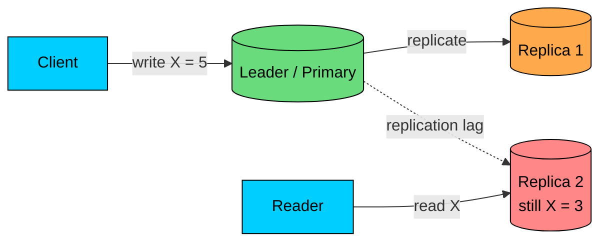
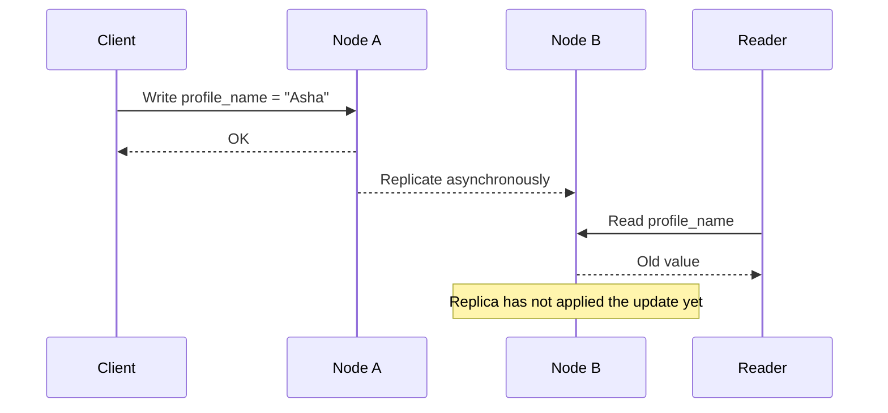
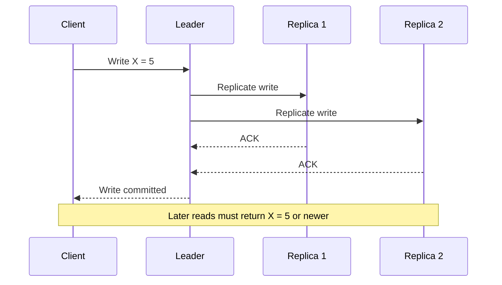
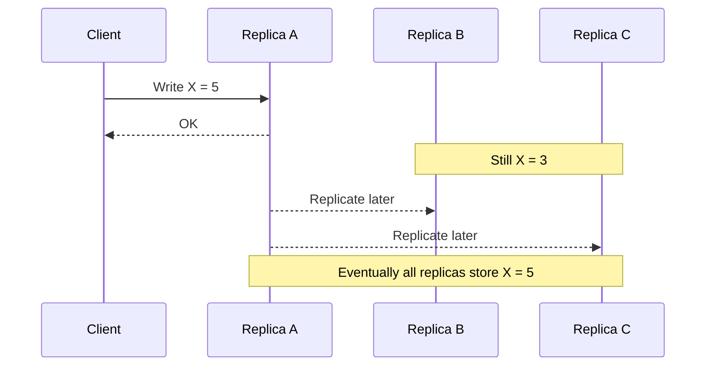

import React from 'react';
import CodeBlock from '../../../../components/ui/CodeBlock';
import Callout from '../../../../components/ui/Callout';

<div className="article-header">
  <div className="breadcrumb">
    <a href="/">Curated Notes</a>
    <span className="breadcrumb-separator">›</span>
    <span className="breadcrumb-current">Strong vs Eventual Consistency</span>
  </div>
  <h1>Strong vs Eventual Consistency</h1>
  <p style={{ color: 'var(--text-muted)', fontSize: '1.1rem', marginBottom: '16px', lineHeight: '1.6' }}>
    Master the essentials of Strong vs Eventual Consistency in this curated guide.
  </p>
  <div className="meta-info">
    <span className="meta-item">
      <svg width="14" height="14" viewBox="0 0 24 24" fill="none" stroke="currentColor" strokeWidth="2"><circle cx="12" cy="12" r="10"/><polyline points="12 6 12 12 16 14"/></svg>
      10 min read
    </span>
    <span className="difficulty-badge difficulty-badge--intermediate">Intermediate</span>
  </div>
</div>

<section className="content-section">

Distributed systems usually keep more than one copy of important data. When one copy changes, the consistency model decides what other clients are allowed to see.

**Strong consistency** says that once a write is acknowledged, later reads observe that write or a newer one. **Eventual consistency** says replicas may disagree for a while but converge if updates stop and replication succeeds.





Neither is universally better. The choice changes user experience, latency, failure behavior, cost, and application complexity.

Use strong consistency where stale data can break correctness. Use eventual consistency where temporary staleness is acceptable and availability or low latency matters more.

Most production systems use both, picking the model per operation.

---

## 1. What Consistency Means

Consistency defines what values a read is allowed to return after writes have happened.

On a single database primary, this is usually straightforward. A transaction commits, and later reads from that primary can see the committed data.

In a replicated system, the answer is harder:

1. A write commits on one node.
2. Other replicas receive the update later.
3. Some clients may read from replicas that have not caught up.
4. A network partition may prevent replicas from communicating.
5. Two replicas may accept conflicting writes if the system allows multi-writer operation.





The consistency model tells the application whether that stale read is allowed.

---

## 2. Strong Consistency

Strong consistency means reads behave as if there is one authoritative copy of the data.

In practice, engineers often mean **linearizability** for individual operations: if write A completes before read B begins, read B must see A or a later write.

For databases with transactions, the stronger goal is often **strict serializability**: transactions appear to run one at a time, and that order respects real time.

The wording matters. Strong consistency is not simply "all replicas are always identical." Replicas may still lag internally.

The system preserves the guarantee by routing reads to the leader, checking a quorum, waiting for replicas, or rejecting requests when it cannot prove freshness.

#### Strong Consistency Flow





The system may not wait for every replica. Many strongly consistent systems use a majority quorum or consensus group.

The important part is that once the write is acknowledged, later reads cannot safely return an older value.

#### How Systems Provide Strong Consistency

Several techniques show up together. A single-leader design funnels all writes through one primary node so that ordering is unambiguous.

Consensus protocols such as Raft or Paxos agree on operation order across a group of nodes. Quorum reads and writes contact enough replicas to guarantee overlap between any read set and any write set.

Synchronous replication makes commits wait for the required replicas before acknowledging. Leader leases and read barriers let reads verify freshness before returning.

On top of all of this, transactions use isolation and commit protocols to protect multi-row updates.

Every one of these techniques adds coordination, and coordination adds latency while shrinking the set of failures the system can hide.

#### Advantages

The biggest advantage is a simpler correctness model. Application code can trust that a committed write is visible to later reads, which removes a whole class of subtle bugs.

Invariants such as "balance cannot go below zero" or "seat cannot be sold twice" become much easier to enforce because there is a single, agreed-upon order of operations.

Conflict behavior is clear in the same way: one operation order wins, and the system never asks the application to merge divergent histories.

All of this makes strong consistency a natural fit for transactions, which is why financial transfers, inventory reservations, bookings, and permission changes lean on it.

#### Trade-offs

The cost is felt in latency, availability, throughput, and operational effort. Writes, and sometimes reads, may wait for coordination, which raises latency.

During a partition the system may reject requests rather than risk stale or conflicting data, which lowers availability. Serializing operations through a leader or consensus group limits concurrency and caps write throughput.

Implementing and operating consensus, failover, leases, clock assumptions, and transaction isolation also takes real engineering effort. The cost grows even further across regions, because the speed of light becomes part of every request path.

Strong consistency is worth paying for when stale or conflicting data would cause real damage.

#### Good Use Cases

The clearest examples involve money, scarce resources, and access control. Payment authorization and fund reservation belong here, as do inventory reservation for scarce items and seat booking where two customers must not claim the same seat.

Distributed locks and leases need strong consistency by definition, and so do permission changes for sensitive resources.

Uniqueness constraints on usernames, emails, or IDs depend on it, as do workflow state transitions that must happen exactly once.

Banking is a common but misleading example. The displayed account balance and the long-term ledger are usually eventually consistent, reconciled in batches, and corrected with compensating entries.

The part that needs strong consistency is the authorization decision: confirming sufficient funds and reserving them before approving a transaction.

For AI systems, strong consistency is often needed around billing, quota enforcement, access control, safety policy changes, and durable conversation ownership.

It is usually not needed for every derived recommendation or analytics counter.

---

## 3. Eventual Consistency

Eventual consistency allows replicas to return different values temporarily.

The guarantee is convergence: if no new writes occur and replication continues, all replicas eventually agree on the same value.





The system may acknowledge writes before every replica has applied them. Reads can be served from nearby or available replicas, even if those replicas are behind.

#### What Eventual Consistency Guarantees

The core promise is convergence. Once updates stop and replication completes, every replica agrees on the same value.

While propagation is in flight, different replicas may return different values, and the system leans toward availability by letting a replica serve reads or writes without coordinating with every other replica.

The price the application pays is visible staleness: clients may need to handle old values, duplicates, reordering, or outright conflicts.

"Eventually" is not a latency SLO. It might be milliseconds in a healthy same-region system. It might be minutes during a network issue, backlog, region outage, or replay.

If the product depends on a convergence bound, measure it and expose it as an operational metric.

#### How Systems Provide Eventual Consistency

The techniques fall into a few familiar shapes. Asynchronous replication lets a primary acknowledge writes before replicas catch up. Read replicas accept queries that may lag behind the primary by a small amount.

Multi-leader replication goes further and lets more than one region accept writes, reconciling them later. Event-driven projections build a read model by consuming a stream of events, so the read side updates after some processing delay.

Caches and CDNs copy data close to users and refresh or invalidate it on a schedule.

Search indexes pick up changes to primary data after an indexing lag, and vector indexes become queryable only after newly embedded documents finish ingestion.

Eventual consistency is everywhere because derived data is everywhere.

#### Advantages

The main wins are speed, availability, and geographic reach. Reads can be served locally and writes can avoid global coordination, which keeps latency low.

Replicas can keep serving requests during partial failures, which raises availability. Users can read from nearby regions or edge caches, which improves locality.

Systems can absorb writes and propagate changes asynchronously, which lifts throughput. All of this makes eventual consistency a natural fit for derived data such as analytics, search, feeds, recommendations, and materialized views, where small amounts of lag are acceptable.

#### Trade-offs

The costs show up as stale reads, missing read-your-writes guarantees, conflicts when multiple writers touch the same data, and the extra application logic needed for pending states, retries, idempotency, and reconciliation.

Debugging is also harder because race conditions can depend on replication timing, cache state, and consumer lag in ways that are difficult to reproduce.

Eventual consistency is not an excuse to be vague. You still need to define acceptable staleness, conflict handling, and recovery behavior.

#### Good Use Cases

The classic examples are counters and feeds. Like counts, view counts, and share counts can tolerate a few seconds of staleness without anyone noticing. Notifications and activity feeds work the same way.

Search indexes and analytics dashboards are derived views of primary data, so a small indexing or aggregation lag is normal. Recommendations and ranking signals fit here too, along with product catalog browsing, CDN-cached assets, and DNS propagation.

On the AI side, feature stores, derived ML features, and vector search indexes that update after document ingestion all rely on eventual consistency.

These systems still need correctness, but they often do not need every user to see every update at the exact same time.

---

## 4. Conflict Resolution

Eventual consistency becomes harder when multiple replicas can accept writes for the same data.

Example: a user edits their display name on a laptop while their phone, briefly offline, edits it too. When both devices sync, the system has two versions.

Several strategies are common. Last write wins keeps the value with the newest timestamp or version, which is simple but can silently lose updates.

A version check rejects writes that carry stale version numbers, pushing the client to retry or merge. An application merge applies domain-specific rules to combine the conflicting values, which usually takes more code but is often the safest option.

CRDTs are data types designed to merge concurrent updates safely, which works well for some structures such as counters and sets but does not cover every business rule.

When automated approaches do not fit, the system can fall back to manual resolution by asking a user or operator to choose, which is expensive but sometimes necessary.

Last write wins is common because it is simple. It is also dangerous for valuable data. It may be fine for a profile color preference. It is not fine for bank transfers, inventory, or legal documents.

Prefer domain-specific merge rules where correctness matters.

---

## 5. Client-Centric Guarantees

Many systems are eventually consistent globally but provide stronger guarantees for one user or session.

These guarantees make products feel sane without requiring global strong consistency for every operation.

#### Read Your Writes

After a client writes a value, that same client sees the value on later reads.

Example: you update your profile photo and immediately see the new photo, even if other users still see the old one for a few seconds.

Implementations usually take one of a few shapes. The user's next reads can be routed to the primary, or the session can carry a timestamp or replication position so the read side knows what to wait for.

The read can also block until a replica has caught up to the user's last write, or the UI can show an optimistic version of the change while the backend catches up.

#### Monotonic Reads

Once a client has seen a newer value, it should not later see an older value.

Example: if a dashboard shows job status as `COMPLETED`, a refresh should not show `RUNNING` again because the request hit a stale replica.

Common implementations include sticky routing that keeps a client pinned to the same replica while it is healthy, version-aware reads that compare the returned version against what the client already saw, and session-level tracking of a minimum acceptable version.

#### Causal Consistency

If one operation depends on another, everyone should observe them in that order.

Example: a reply should not appear before the comment it replies to. A permission-dependent action should not appear before the permission grant that allowed it.

Causal consistency is often enough for collaboration, comments, messaging, and social feeds where users care about relationships between events more than a single global order.

---

## 6. Quorums and Tunable Consistency

Some distributed databases let you tune how many replicas must participate in reads and writes.

Suppose there are `N` replicas. `W` is the number of replicas that must acknowledge a write, and `R` is the number that must answer a read.

If `R + W > N`, every read set and every write set are guaranteed to overlap on at least one replica.


```plaintext
N = 3 replicas
W = 2 write acknowledgments
R = 2 read responses

R + W = 4, which is greater than N
```


That overlap is necessary for a read to see the latest acknowledged write, but it is not sufficient on its own.

A quorum read may still return an older value when a concurrent write has acknowledged on a different overlapping subset, or when the contacted replica has not yet applied a write that another replica in the quorum has.

Turning overlap into a real freshness guarantee requires more machinery: version vectors or timestamps to compare returned values, and read repair or anti-entropy to converge replicas.

Sloppy quorums and hinted handoff also need to be disabled or accounted for, and the system needs a way to order concurrent writes.

This is why systems like Cassandra do not call QUORUM reads linearizable. For true single-key linearizability, Cassandra layers Paxos on top of the quorum through lightweight transactions.

Dynamo-style stores reach similar conclusions: quorums protect against most lag, but a separate coordination protocol is needed when stale or conflicting reads are unacceptable.

Tunable consistency is helpful when different operations have different needs. Checkout confirmation may require strong or quorum consistency, while product recommendations can use eventually consistent reads.

User profile updates often work well with read-your-writes, and analytics counters can accept delayed aggregation without any user-visible impact.

Use the strongest guarantee needed for the operation, not for the entire system by default.

---

## 7. Choosing Strong or Eventual Consistency

A handful of questions usually decide it. If stale data can cause money loss, security issues, or legal problems, strong consistency is the right answer.

If two users can claim the same scarce resource, the reservation path needs strong consistency or a single authoritative path even if the rest of the system is relaxed.

If the UI can explain temporary staleness, eventual consistency is often fine, and if the data is derived from another source of truth, eventual consistency is usually acceptable.

If the system needs low-latency global reads, eventual consistency together with caching or local replicas may be the only practical option.

Two more questions are easy to forget but matter as much as the others.

What happens during a network partition? The choice is between rejecting requests and serving possibly stale data.

What happens when conflicts occur? Merge, reject, or reconciliation behavior needs to be defined before launch.


| Requirement | Better Fit |
|-------------|------------|
| Payment authorization and fund reservation | Strong consistency |
| Inventory for scarce items | Strong consistency |
| Permission revocation | Strong consistency for enforcement paths |
| Social counters | Eventual consistency |
| Search results | Eventual consistency |
| CDN assets | Eventual consistency with invalidation |
| User profile display | Eventual consistency with read-your-writes |
| AI conversation ownership and billing | Strong consistency |
| AI recommendations, embeddings, analytics | Eventual consistency |


The mature answer is rarely "make everything strongly consistent" or "eventual consistency everywhere." Most systems mix models by data type and operation.

---

## 8. Practical Rule

Strong consistency buys simple reasoning at the cost of coordination.

Eventual consistency buys availability, locality, and throughput at the cost of temporary disagreement.

Use strong consistency for authoritative decisions and invariants. Use eventual consistency for derived views, caches, feeds, search, analytics, and globally distributed reads where stale data is acceptable.

Then document the contract. A consistency model is only useful if application engineers know what they can rely on.

---

## Quiz

</section>
