import React from 'react';
import CodeBlock from '../../../../components/ui/CodeBlock';
import Callout from '../../../../components/ui/Callout';

  

    <a href="/">Curated Notes</a>
    ›
    Availability
  

  <h1>Availability</h1>
  

    Master the essentials of Availability in this curated guide.
  

  

    
      <svg width="14" height="14" viewBox="0 0 24 24" fill="none" stroke="currentColor" strokeWidth="2"><circle cx="12" cy="12" r="10"/><polyline points="12 6 12 12 16 14"/></svg>
      10 min read
    
    Intermediate
  

<section className="content-section">

A system can be perfectly designed to handle millions of requests and still be useless to its users if it goes down whenever a single server fails. Scaling to high load and staying operational under failure are two different problems, and the second one is what **availability** addresses.

&gt; **What Availability Measures**
&gt;
&gt; Availability measures how often your system is operational and accessible to users. A highly available system continues functioning even when individual components fail.

**Availability** is not the same as **reliability**. A system can be highly available (always up) but unreliable (sometimes gives wrong answers). The two properties are related but distinct.

---

## Measuring Availability

Availability is typically expressed as a percentage of uptime over a given period. The formula is straightforward:

`Availability = Uptime / (Uptime + Downtime)`

For example, if a system was up for 364 days and down for 1 day in a year:

**Availability = 364 / 365 = 99.73%**

That single day of downtime drops the system below "three nines" availability.

#### The "Nines" of Availability

Availability is often described in terms of "nines." Each additional nine dramatically reduces allowed downtime:

| Availability | Downtime per Year | Downtime per Month | Downtime per Week |
|--------------|-------------------|--------------------|--------------------|
| 99% (two nines) | 3.65 days | 7.3 hours | 1.68 hours |
| 99.9% (three nines) | 8.76 hours | 43.8 minutes | 10.1 minutes |
| 99.99% (four nines) | 52.6 minutes | 4.38 minutes | 1.01 minutes |
| 99.999% (five nines) | 5.26 minutes | 26.3 seconds | 6.05 seconds |
| 99.9999% (six nines) | 31.5 seconds | 2.63 seconds | 0.6 seconds |

#### Availability in Series vs Parallel

How you combine components dramatically affects overall availability.

#### Components in Series

When components are in series, meaning all must work for the system to function, availability multiplies:

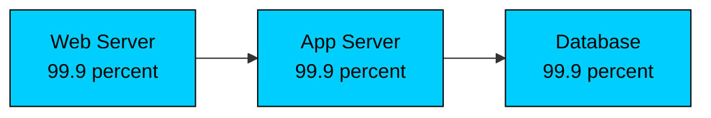

**Overall = 99.9% × 99.9% × 99.9% = 99.7%**

Each component in the chain reduces overall availability. You started with three components, each at "three nines," but the combined system is below three nines. Add more components in series, and availability keeps dropping.

#### Components in Parallel

When components are in parallel, meaning any can handle the request, availability improves dramatically:

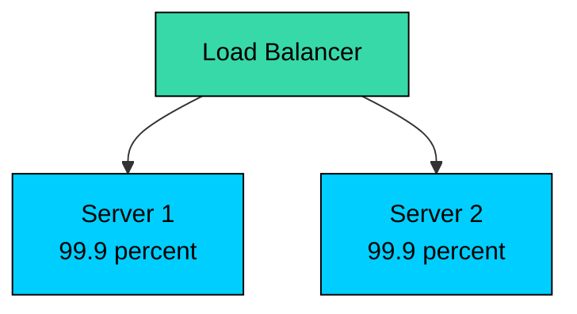

For both servers to be down simultaneously, both must fail at the same time:

**Failure probability = 0.1% × 0.1% = 0.0001%**

**Availability = 100% - 0.0001% = 99.9999%**

Two servers with 99.9% availability each give you exactly six nines when running in parallel. This is the power of redundancy.

---

## Common Failure Modes

To design for availability, you need a working model of how systems fail. The common failure modes fall into a small number of categories, and most production outages combine elements from more than one of them.

#### Hardware Failures

Everything physical eventually breaks. The question is when, not if.

| Component | Typical Failure Rate | MTBF |
|-----------|---------------------|------|
| Hard Drive (HDD) | 2-4% per year | 300,000 hours |
| SSD | 0.5-1% per year | 1-2 million hours |
| Server | 2-4% per year | 300,000 hours |
| Network Switch | 1-2% per year | 500,000 hours |
| Power Supply | 1-3% per year | 400,000 hours |

*MTBF = Mean Time Between Failures.*

At scale, hardware failures are not exceptional events. They are routine. A data center with 10,000 servers will see hundreds of hardware failures per year. If your architecture cannot handle a server dying at any moment, you do not have a highly available system.

#### Software Failures

Software failures are harder to predict than hardware failures because they depend on input, state, and timing rather than physical wear. Common categories include:

- **Bugs:** Code defects that cause crashes or incorrect behavior
- **Memory leaks:** Gradual resource exhaustion
- **Deadlocks:** Processes waiting on each other indefinitely
- **Cascading failures:** One failure triggering failures in dependent systems

#### Network Failures

Networks fail in ways that are often intermittent and hard to reproduce, which makes them harder to debug than a clean hardware crash.

- **Packet loss:** Data does not reach its destination
- **Latency spikes:** Delays in communication
- **Partition:** Network split isolates groups of servers
- **DNS failures:** Name resolution stops working

#### Human Errors

A large share of production outages is attributable to human error rather than hardware or software faults.

Common examples:

- **Configuration mistakes:** wrong environment variable, typo in a config file
- **Failed deployments:** bad code or broken migrations pushed to production
- **Accidental deletions:** running the wrong command in the wrong place
- **Capacity planning errors:** underestimating traffic for a launch

This is why automation, testing, and operational guardrails matter. Mature systems are designed so that common human mistakes are either prevented at source or quickly reversible.

---

## Redundancy: The Foundation of Availability

Redundancy is the foundational technique behind almost every availability strategy. Having more than one of something means that any single failure leaves at least one working component still able to serve traffic.

Redundancy means deploying backup components that can take over when primary components fail.

#### Active-Passive (Standby)

In an active-passive configuration, one component handles all the work while another waits idle as a backup. When the active component fails, the passive one takes over.

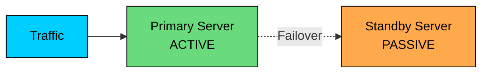

Active-passive mode is commonly used in situations where you want a single source of truth and controlled writes like databases, stateful services, and systems requiring a single leader.

#### Pros

- Simple to reason about
- Standby typically uses fewer resources
- Clear source of truth

#### Cons

- Failover takes time (detection + promotion + routing changes)
- Standby may not be truly “production-ready” because it isn’t tested under real load
- Potential for split-brain problem

The standby can be configured in different states of readiness:

| Standby Type | State | Failover Time | Cost |
|--------------|-------|---------------|------|
| **Cold Standby** | Powered off, needs to boot | Minutes | Lowest |
| **Warm Standby** | Running but not receiving traffic | Seconds to minutes | Medium |
| **Hot Standby** | Running, data synchronized, ready to serve | Seconds | Highest |

**Cold standby** is cheapest but slowest. The backup server is not running, so failover requires booting the machine, starting services, and potentially restoring data. This might take 5-15 minutes, which is too slow for most production systems but acceptable for disaster recovery.

**Warm standby** keeps the backup running and configured, but not actively processing requests. It might be receiving replicated data but is not in the load balancer pool. Failover involves adding it to the pool and possibly promoting it, which takes seconds to a few minutes.

**Hot standby** is the most expensive but fastest. The backup is fully synchronized and ready to serve immediately. For databases, this often means synchronous replication where every write is confirmed on both primary and standby before acknowledging the client.

#### Active-Active

In an active-active configuration, all components handle traffic simultaneously. There is no distinction between primary and backup because every node is doing real work.

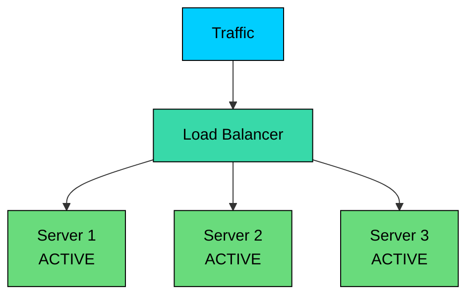

When one node fails, the load balancer simply stops sending traffic to it. There is no failover process because the other nodes were already handling traffic. The remaining nodes absorb the additional load.

#### Pros

- No failover delay
- All nodes tested under real load
- Better resource utilization

#### Cons

- More complex
- Must handle data consistency across nodes
- Requires stateless design or shared state

The key requirement for active-active is that requests can be handled by any node. This works naturally for stateless services where each request is independent. For stateful services, you need either shared storage (like a database or Redis) or sticky sessions (which reduces availability benefits).

#### Geographic Redundancy

Redundancy within a single data center protects against hardware failures, but what if the entire data center goes offline? Power outages, network cuts, natural disasters, or even a backhoe cutting a fiber line can take down an entire facility.

Geographic redundancy distributes your system across multiple physical locations:

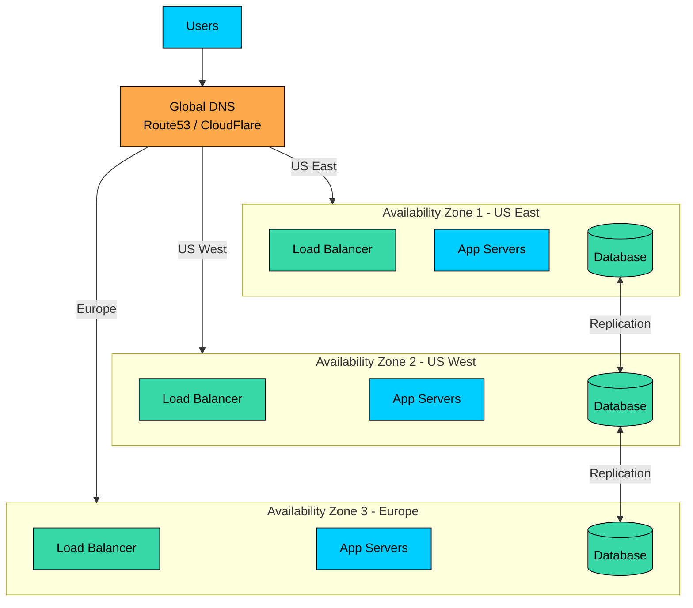

Cloud providers offer different levels of geographic redundancy:

| Level | What It Is | Protects Against | Latency Impact |
|-------|------------|------------------|----------------|
| **Availability Zones (AZs)** | Separate data centers in the same region, connected by low-latency links | Single data center failure | Minimal (1-2ms) |
| **Regions** | Geographically separate areas (e.g., US-East vs US-West) | Regional disasters, widespread outages | Significant (50-100ms+) |
| **Multi-Cloud** | Different cloud providers (AWS + GCP) | Cloud provider outages | Variable |

**Availability Zones** are the sweet spot for most applications. They provide meaningful isolation (separate power, cooling, and network) while keeping latency low enough for synchronous replication. Most cloud-native applications deploy across at least two AZs.

**Multi-region** deployment is necessary for global applications or those requiring disaster recovery from regional events. The challenge is data replication, since synchronous replication across regions adds significant latency. Most multi-region systems use asynchronous replication and accept some data loss in a disaster (typically seconds to minutes of transactions).

#### Redundancy Across Layers

A chain is only as strong as its weakest link. If you have redundant app servers but a single database, the database is your single point of failure. True high availability requires redundancy at every layer of your stack.

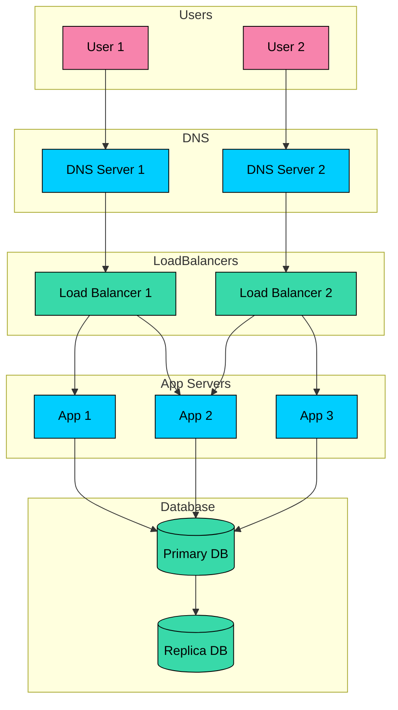

Notice that redundancy gets harder as you move down the stack. Adding more web servers is trivial. Adding database replicas with automatic failover requires careful engineering.

&gt; **NOTE**
&gt;
&gt; Redundancy is not free. Every backup server, every replica, every additional availability zone costs money. The question is whether that cost is justified by the reduction in downtime risk.

---

## High Availability Patterns

Patterns are reusable solutions to common problems. The following patterns appear repeatedly in highly available systems.

#### Pattern 1: Load Balancer with Multiple Backends

The most common and fundamental pattern for stateless services. A load balancer distributes traffic across multiple servers, automatically routing around failures.

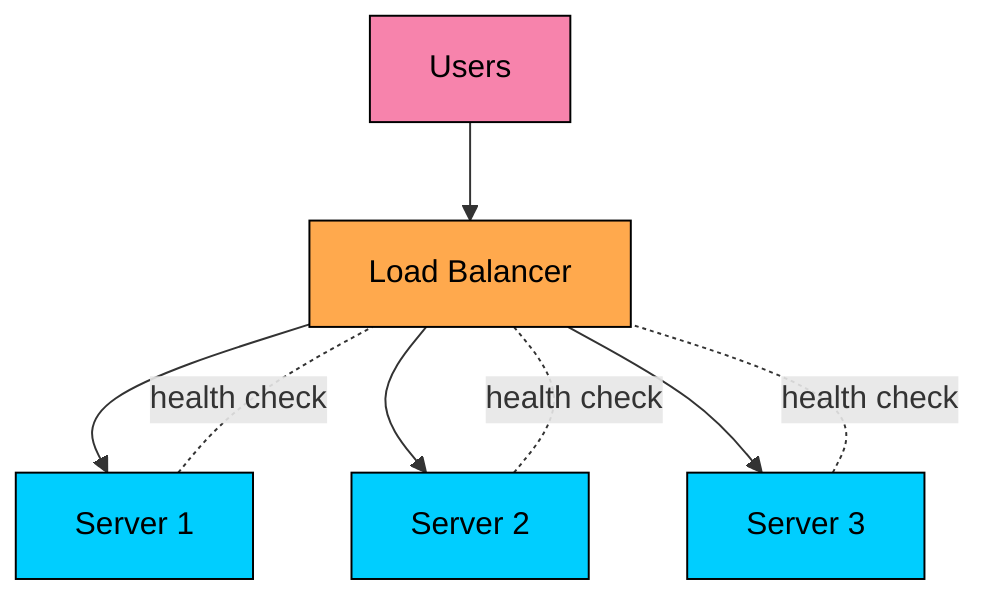

##### **How it provides high availability:**

- Load balancer continuously monitors backend health
- Failed servers are automatically removed from rotation
- Traffic redistributes to healthy servers within seconds
- New servers can be added without any downtime

#### Load Balancer Redundancy

The load balancer itself is a single point of failure. For true high availability, you need redundant load balancers:

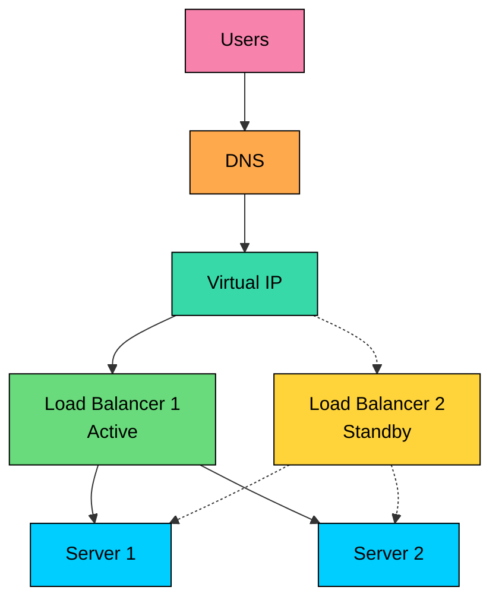

Cloud providers handle this automatically. AWS ALB, Google Cloud Load Balancer, and Azure Load Balancer are all managed services with built-in redundancy. On-premises, you might use keepalived with a virtual IP that floats between two HAProxy instances.

#### Pattern 2: Database Replication with Automatic Failover

Databases are stateful and cannot simply be load-balanced like web servers. Database high availability requires replication and careful failover management.

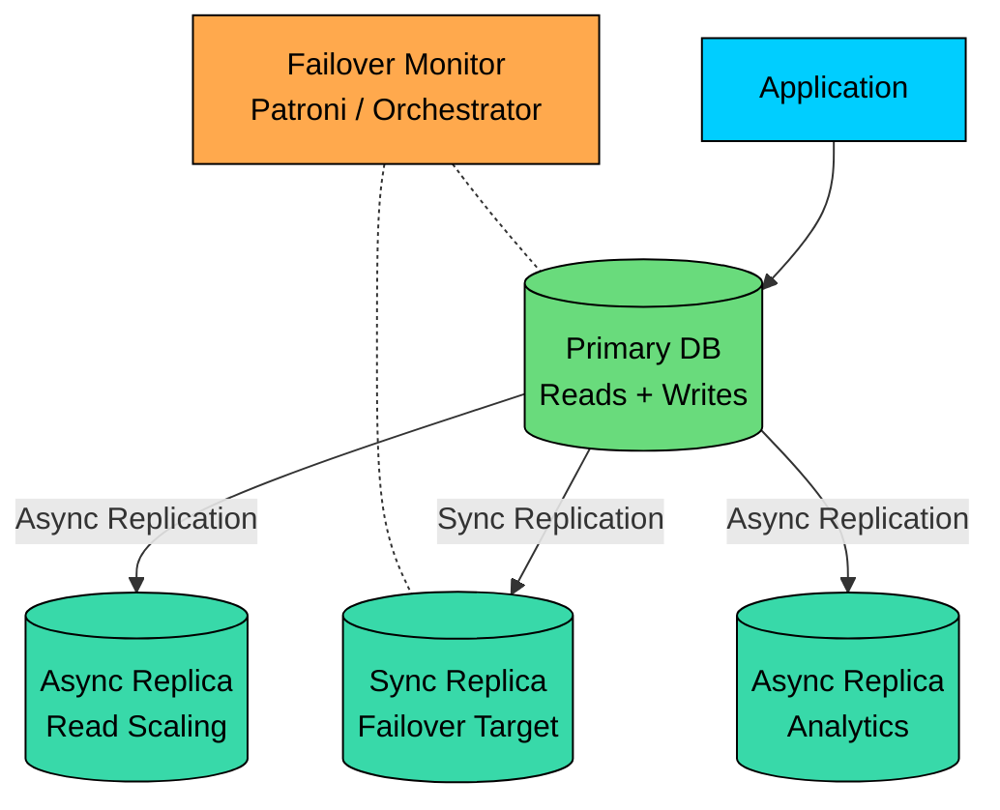

#### Synchronous vs Asynchronous Replication

| Type | How It Works | Data Loss | Performance Impact |
|------|--------------|-----------|-------------------|
| **Synchronous** | Write confirmed only after replica acknowledges | Zero (RPO = 0) | Higher latency (wait for replica) |
| **Asynchronous** | Write confirmed immediately, replica catches up later | Possible (seconds to minutes) | No impact on write latency |
| **Semi-synchronous** | Wait for at least one replica, others async | Minimal | Moderate impact |

**Synchronous replication** guarantees zero data loss but adds latency. Every write must wait for the replica to confirm. If your replica is in a different region, this adds significant latency (50-100ms per write).

**Asynchronous replication** has no performance impact but can lose data. If the primary fails, any writes not yet replicated are lost. The "replication lag" is typically seconds but can grow during high load.

Most production systems use synchronous replication for the failover target and asynchronous replication for read replicas and analytics.

#### Pattern 3: Queue-Based Load Leveling

When downstream services cannot handle peak load, use a queue to buffer requests and process them at a sustainable rate.

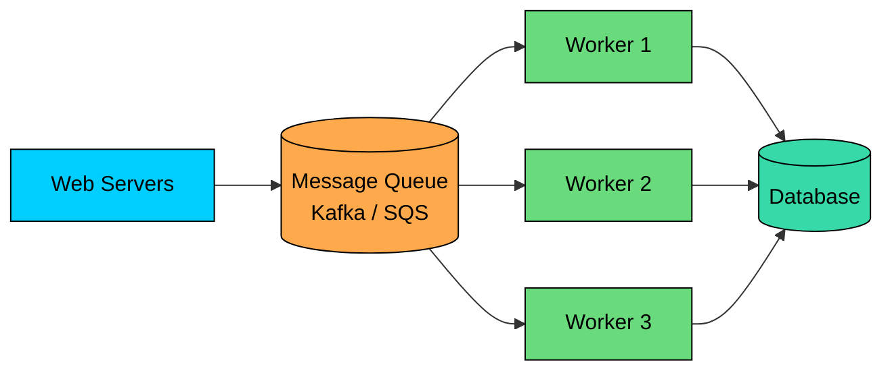

#### **How it provides high availability:**

- Decouples producers from consumers
- Buffers traffic spikes that would overwhelm the database
- Workers can fail and restart without losing messages
- Can scale workers independently based on queue depth

This pattern is essential for handling bursty traffic. A flash sale might generate 100x normal traffic for a few minutes. Without a queue, the database would be overwhelmed. With a queue, orders accumulate and are processed at a sustainable rate.

#### Pattern 4: Circuit Breaker

When a dependency fails, continuing to call it wastes resources and can cause cascading failures. The circuit breaker pattern prevents this by failing fast.

```mermaid
stateDiagram-v2
    [*] --> Closed: Start

    Closed --> Open: Failures exceed threshold
    Open --> HalfOpen: Timeout expires
    HalfOpen --> Closed: Test request succeeds
    HalfOpen --> Open: Test request fails

    note right of Closed: Normal operation<br/>Requests pass through
    note right of Open: Failing fast<br/>Requests rejected immediately
    note right of HalfOpen: Testing recovery<br/>Limited requests allowed

    classDef closed fill:#69db7c,stroke:#000,color:#000
    classDef open fill:#ff8787,stroke:#000,color:#000
    classDef half fill:#ffd43b,stroke:#000,color:#000

    class Closed closed
    class Open open
    class HalfOpen half
```

#### Circuit Breaker States

| State | Behavior | Transitions |
|-------|----------|-------------|
| **Closed** | Normal operation. All requests pass through. Track failure rate. | → Open: when failure rate exceeds threshold |
| **Open** | Fail fast. All requests immediately rejected with error. | → Half-Open: after timeout period |
| **Half-Open** | Testing. Allow limited requests through. | → Closed: if test succeeds / → Open: if test fails |

---

## Summary

Availability measures how often a system is operational. Designing for it means accepting that components fail and engineering around that fact.

Key takeaways:

1. **Availability is measured in nines.** Each additional nine cuts allowed downtime by roughly 10x. Four nines allows about 52 minutes of downtime per year, five nines allows about 5.
2. **Series components multiply failure.** Three components at 99.9% in series give 99.7% overall. Parallel components compound availability in the other direction.
3. **Failures come from hardware, software, networks, and people.** Human error accounts for a large share of real outages, which is why automation and guardrails matter as much as redundant hardware.
4. **Redundancy is the foundation of availability.** Active-passive is simpler to reason about; active-active gives faster failover and better resource utilization.
5. **Geographic redundancy protects against data center and regional failures.** Multi-AZ is the common baseline; multi-region adds cost, latency, and consistency complexity.
6. **Redundancy must exist at every layer.** A redundant app tier in front of a single database does not solve the availability problem.
7. **Patterns combine into resilient designs.** Load balancers with health checks, replicated databases with managed failover, queue-based load leveling, and circuit breakers each address a specific failure mode.
8. **Redundancy is not free.** Match the investment to the business impact of downtime, not to an aspiration of "as many nines as possible."

The useful question is not "how many nines do we have?" The useful question is: **when this specific component fails, what stops working, who notices, and how quickly does the system recover?**

</section>
