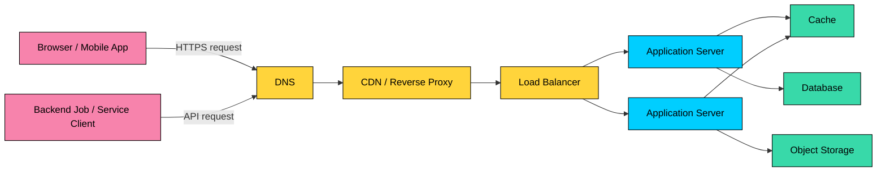
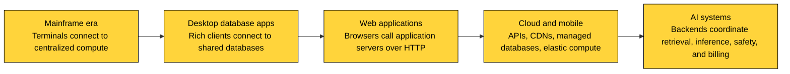
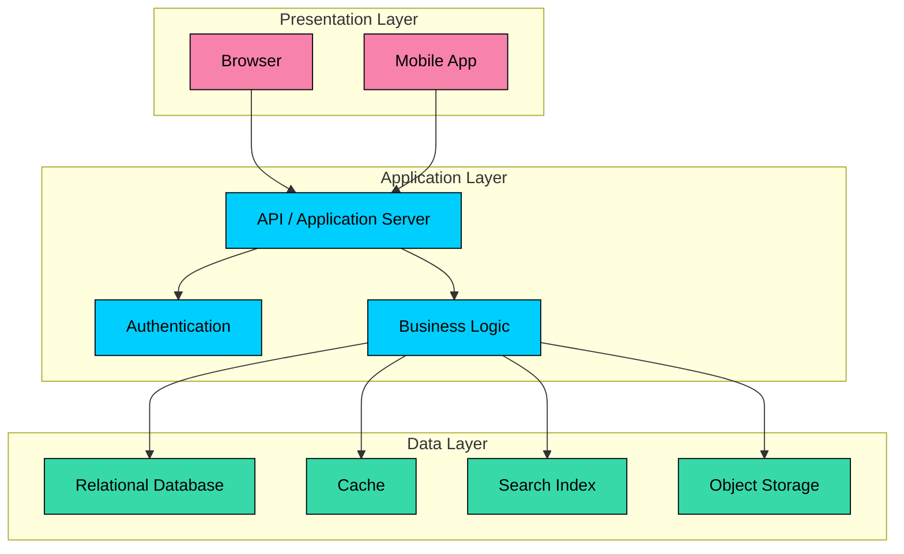

import React from 'react';
import CodeBlock from '../../../../components/ui/CodeBlock';
import Callout from '../../../../components/ui/Callout';

  

    <a href="/">Curated Notes</a>
    ›
    Client-Server Architecture
  

  <h1>Client-Server Architecture</h1>
  

    Master the essentials of Client-Server Architecture in this curated guide.
  

  

    
      <svg width="14" height="14" viewBox="0 0 24 24" fill="none" stroke="currentColor" strokeWidth="2"><circle cx="12" cy="12" r="10"/><polyline points="12 6 12 12 16 14"/></svg>
      10 min read
    
    Intermediate
  

<section className="content-section">

Client-server architecture separates request initiators from shared services that process work and protect resources.

The core model is simple, but production systems add DNS, TLS, load balancing, caching, databases, queues, and observability to make it reliable at scale.

This chapter covers what client-server architecture means, how requests travel between clients and servers, common tiers, scaling techniques, failure modes, and real-world examples.

---

## 1. What Is Client-Server Architecture?

Client-server architecture is a computing model where a **client** requests data or an action, and a **server** handles the request, applies the required logic, and sends back a response.

The client is usually close to the user or calling application. The server is usually responsible for shared state, business rules, security checks, and access to protected resources such as databases, files, models, and internal services.

#### Key Components

- **Client:** The program that initiates communication. It might be a web browser, mobile app, desktop application, command-line tool, IoT device, backend worker, or another service.
- **Server:** The program that accepts requests and produces responses. A server does not have to be one physical machine. In production, it is often a fleet of processes behind a load balancer.
- **Network:** The path between client and server. It includes DNS, routing, firewalls, proxies, TLS termination, and transport protocols such as TCP or QUIC.
- **Protocol:** The contract that defines how messages are formatted and exchanged. Common examples include HTTP, gRPC, WebSocket, SMTP, IMAP, and database-specific protocols.

&gt; **EXAMPLE**
&gt;
&gt; When you open a web page, the browser acts as the client. It resolves the domain name, establishes a secure connection, sends an HTTP request, receives HTML, CSS, JavaScript, images, and data, and renders the result. The server side may include a CDN, an edge cache, an application server, several internal services, and a database.

#### Evolution of Client-Server Architecture

The model evolved as applications moved from single-machine programs to shared systems used by many people at once.

Early systems often used terminals connected to a central mainframe. Later, desktop applications connected directly to shared databases. Web applications pushed much of the logic back to application servers. Modern systems often combine browser and mobile clients, edge delivery, API gateways, microservices, managed databases, event streams, and third-party APIs.

The pattern remains the same: clients ask for work; servers coordinate the work and protect shared resources.

---

## 2. How Client-Server Communication Works

At a high level, a request-response flow looks like this:

1. **The client decides what it needs.** A user clicks a button, a mobile app opens a screen, a scheduled job starts, or another service calls an API.
2. **The client finds the server.** For internet traffic, the client usually uses DNS to resolve a domain name to an IP address. The request may go first to a CDN, reverse proxy, or load balancer rather than directly to an application process.
3. **The client establishes a connection.** Most web traffic uses HTTPS. With HTTP/1.1 and HTTP/2, that usually means TLS over TCP. With HTTP/3, TLS is integrated into QUIC over UDP.
4. **The client sends a request.** The request contains a method, path, headers, and sometimes a body. For example, a mobile app might send `GET /api/playlists/42` with an authorization token.
5. **The server processes the request.** The server validates the request, authenticates the caller, checks authorization, executes business logic, reads or writes data, and calls other services if needed.
6. **The server sends a response.** The response includes a status code, headers, and a body such as HTML, JSON, a binary file, or a streaming response.
7. **The client handles the result.** The client renders a screen, updates local state, retries on safe failures, shows an error, or continues reading a stream.

&gt; **Key Technologies Involved**
&gt;
&gt; - **DNS:** Maps names such as `algomaster.io` to network addresses.
&gt; - **HTTP/HTTPS:** The dominant application protocol for web and API traffic.
&gt; - **TCP:** Provides reliable, ordered byte streams for most HTTP/1.1 and HTTP/2 traffic.
&gt; - **QUIC:** A UDP-based transport commonly used with HTTP/3 to reduce connection setup cost and improve behavior on changing networks.
&gt; - **TLS:** Encrypts traffic and authenticates the server to the client.
&gt; - **Ports:** Identify the application endpoint on a host. HTTPS commonly uses port `443`.

#### A Practical Example: AI Chat Application

Consider a chat application that calls a large language model:

1. The browser sends the user's prompt to the application's backend.
2. The backend authenticates the user, checks quota, validates input, and stores conversation metadata.
3. The backend calls a model inference service. That service may route to GPU-backed workers, retrieve context from a vector database, and stream tokens as they are generated.
4. The backend streams partial output back to the browser using server-sent events, WebSocket, or chunked HTTP.
5. The browser renders tokens incrementally so the user does not wait for the full response.

This is still client-server architecture. The "server" is simply a set of cooperating services rather than one process on one machine.

---

## 3. Types of Client-Server Architectures

Client-server systems are often described by the number of tiers involved. A tier is a separately deployable or logically distinct layer with a clear responsibility.

### 1-Tier Architecture

In **1-tier architecture**, the user interface, business logic, and data storage live in the same application or on the same machine.

#### Example Use Cases

- A local spreadsheet
- A single-user desktop accounting tool
- A local developer utility that stores data in a file

#### Pros

- Simple to build and run
- No network dependency
- Low operational overhead

#### Cons

- Poor fit for collaboration
- Difficult to centralize security and backups
- Limited scalability

&gt; Best suited for local, offline, single-user applications.

### 2-Tier Architecture

In **2-tier architecture**, the client communicates directly with a server. A common version is a desktop or internal application connecting directly to a database server.

- The **client** handles the user interface and may contain business logic.
- The **server** stores data and may enforce some rules through stored procedures, constraints, or database permissions.

#### Example Use Case

- An internal desktop application that connects to a central PostgreSQL or SQL Server database.

#### Pros

- Straightforward for small internal systems
- Fewer moving parts than a multi-tier architecture
- Good performance when the client and database are on the same trusted network

#### Cons

- Clients may need direct database credentials, which increases security risk
- Business logic can become duplicated across client versions
- Schema changes can break deployed clients
- Scaling beyond a small user base becomes difficult

&gt; Suitable for controlled internal environments, not for public internet-facing systems.

### 3-Tier Architecture

**3-tier architecture** separates presentation, application logic, and data storage.

- **Presentation layer:** The browser, mobile app, or desktop UI.
- **Application layer:** The backend service that enforces business rules, handles authentication, validates requests, and coordinates workflows.
- **Data layer:** Databases, object storage, search indexes, caches, and other persistent stores.

&gt; **EXAMPLE**
&gt;
&gt; In an e-commerce system, the mobile app calls an order API. The application server validates the cart, checks inventory, authorizes payment, writes the order to the database, emits an event, and returns an order confirmation.

#### Pros

- Centralizes business logic on the server
- Keeps database access away from untrusted clients
- Allows each tier to scale and evolve separately
- Makes testing, deployment, and operational ownership clearer

#### Cons

- More infrastructure than a local or direct database application
- Network calls introduce latency and partial failures
- Poor API design can create chatty clients or overloaded backends

&gt; This is the common baseline for web applications, SaaS products, mobile backends, and many internal platforms.

### N-Tier Architecture

**N-tier architecture** extends the 3-tier model with additional layers or services. Common additions include API gateways, authentication services, caches, search services, queues, analytics pipelines, model inference services, and backend-for-frontend layers.

In real systems, N-tier does not always mean a strict chain where every layer talks only to the next one. It means responsibilities are separated behind explicit interfaces.

#### Common Layers and Services

- **Client:** Browser, mobile app, desktop app, partner integration, or another service.
- **Edge layer:** CDN, web application firewall, rate limiter, or reverse proxy.
- **API layer:** API gateway, GraphQL gateway, backend-for-frontend, or public API service.
- **Application services:** Domain services that implement business workflows.
- **Data services:** Databases, caches, object stores, search indexes, and vector databases.
- **Asynchronous infrastructure:** Message queues, event streams, background workers, and schedulers.
- **Operational layer:** Metrics, logs, traces, secrets management, and deployment automation.

&gt; **EXAMPLE**
&gt;
&gt; A production AI assistant may use a web client, a BFF, an authentication service, a conversation service, a retrieval service, a vector database, a model inference gateway, GPU workers, object storage, and an event stream for analytics and evaluation.

#### Pros

- Lets teams scale and deploy high-traffic components independently
- Provides clear boundaries for security, ownership, and reliability
- Supports specialized infrastructure such as search, streaming, and model inference
- Improves fault isolation when designed carefully

#### Cons

- Adds operational complexity
- Makes debugging harder without strong tracing and logs
- Increases latency if every user action crosses too many services
- Requires disciplined API contracts and backward compatibility

&gt; Best for systems where scale, team boundaries, regulatory requirements, or specialized workloads justify the extra complexity.

---

## 4. Advantages of Client-Server Architecture

Client-server architecture remains widely used because it gives engineers practical control over shared systems. Servers can centralize validation, authorization, auditing, consistency, secrets, databases, model access, payment systems, and operational visibility. Server-side logic can also evolve without forcing every client to update immediately, as long as API contracts remain compatible.

---

## 5. Challenges and Design Considerations

The same centralization that makes client-server systems manageable can also create bottlenecks and failure modes. A single server, database, region, or dependency can harm availability, while hot endpoints, slow queries, overloaded thread pools, and exhausted connection pools can raise latency for everyone.

Production systems also need deliberate handling for unreliable networks, state, security exposure, old client versions, and cost. Timeouts, retries with backoff, idempotency keys, redundancy, failover, careful API evolution, and cost-aware design are part of the architecture, not afterthoughts.

---

## 6. Scaling the Client-Server Model

Modern systems rarely depend on one server process. They scale by spreading traffic with load balancers, adding stateless application instances, caching frequently accessed data, serving cacheable content from CDNs or edge compute, and improving the database layer with indexes, read replicas, partitioning, sharding, connection pooling, and query optimization.

They also move slow or non-critical work to queues and background workers, split services only when there is a clear scaling or ownership reason, and use backpressure or rate limiting to reject, delay, or shed work before the system collapses.

---

## 7. Real-World Applications

Client-server architecture appears in many forms. The important part is to identify who initiates the request, who owns the shared resource, and what reliability guarantees the interaction needs.

#### Web Browsing

When you visit [`www.wikipedia.org`](https://www.wikipedia.org), the browser sends HTTPS requests for the page and its assets. Some responses may come from caches or CDN edges; dynamic responses may reach application servers and databases.

#### Email Services

Email clients such as Gmail, Outlook, and Apple Mail connect to mail servers. SMTP is used to send mail between servers, while IMAP is commonly used by clients to sync mailboxes. POP3 still exists, but it is less common for modern multi-device mail access.

#### Online Banking

Banking apps use client-server architecture to authenticate users, authorize actions, show balances, process transfers, and maintain audit trails. The server side is responsible for strong consistency, fraud controls, encryption, regulatory logging, and careful access control.

#### Cloud Computing

Cloud platforms expose client-server APIs for compute, storage, databases, identity, networking, and observability. A deployment tool, SDK, CLI, or application acts as the client. The cloud control plane acts as the server.

#### AI Applications

AI products usually use client-server architecture because model inference, retrieval, safety checks, and billing need centralized control. A browser or mobile client should not hold API secrets, call private databases directly, or manage GPU scheduling. The backend coordinates those responsibilities and streams results back to the client.

---

## 8. Key Takeaways

- Client-server architecture separates request initiators from shared services that process work and protect resources.
- A server is usually a fleet of processes and managed services, not one machine.
- Three-tier architecture is the practical baseline for most web and mobile systems.
- N-tier systems add specialized layers when scale, reliability, security, or team ownership requires them.
- The hard parts are not the request and response themselves. The hard parts are latency, failure handling, security, versioning, state, and cost.
- Good client-server design keeps clients simple, protects shared resources, and makes server-side behavior observable and evolvable.

</section>
