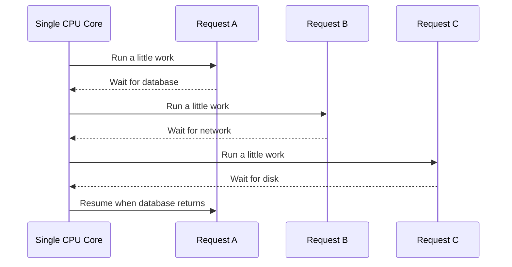
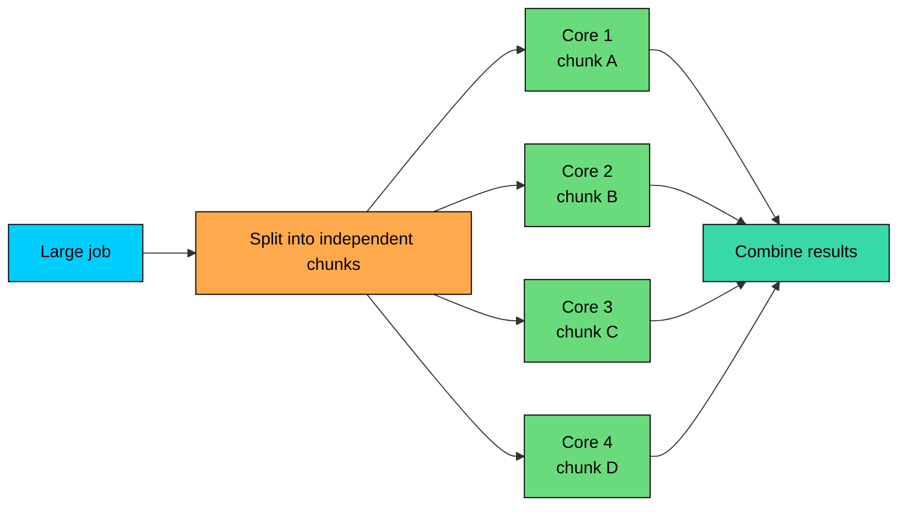
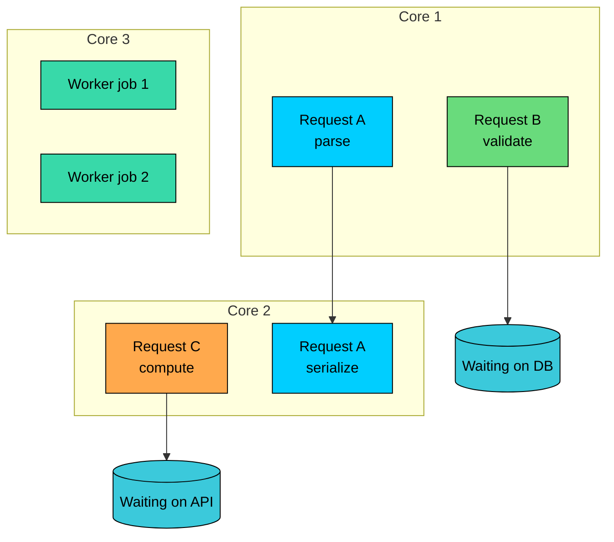

import React from 'react';
import CodeBlock from '../../../../components/ui/CodeBlock';
import Callout from '../../../../components/ui/Callout';

<div className="article-header">
  <div className="breadcrumb">
    <a href="/">Curated Notes</a>
    <span className="breadcrumb-separator">›</span>
    <span className="breadcrumb-current">Concurrency vs Parallelism</span>
  </div>
  <h1>Concurrency vs Parallelism</h1>
  <p style={{ color: 'var(--text-muted)', fontSize: '1.1rem', marginBottom: '16px', lineHeight: '1.6' }}>
    Master the essentials of Concurrency vs Parallelism in this curated guide.
  </p>
  <div className="meta-info">
    <span className="meta-item">
      <svg width="14" height="14" viewBox="0 0 24 24" fill="none" stroke="currentColor" strokeWidth="2"><circle cx="12" cy="12" r="10"/><polyline points="12 6 12 12 16 14"/></svg>
      10 min read
    </span>
    <span className="difficulty-badge difficulty-badge--intermediate">Intermediate</span>
  </div>
</div>

<section className="content-section">

Concurrency and parallelism are related ideas that solve different problems.

**Concurrency** is a system making progress on many tasks during the same period of time. **Parallelism** is many tasks executing at the same instant.


A web server holding 10,000 open connections is concurrent. A data job using 64 CPU cores to transform records at the same moment is parallel.

The trade-offs differ. Concurrency is about responsiveness, I/O waiting, scheduling, and backpressure. Parallelism is about using more cores, machines, or accelerators to finish CPU-heavy work faster. Most real systems use both.

---

## 1. Concurrency

Concurrency means a system can make progress on multiple tasks during the same period of time.

Those tasks do not have to run at the exact same instant. A single CPU core can run concurrent work by switching between tasks.

An event loop can run concurrent work by starting I/O operations, doing other work while they wait, and resuming callbacks when results arrive.

Concurrency is a design property. It says the system can keep multiple operations in flight without forcing each one to finish before the next one starts.





The server is not doing everything at once. It is keeping several operations alive and switching to work that can make progress.

#### Why Concurrency Matters

Most backend services spend a lot of time waiting. They wait on databases, caches, remote APIs, disk, network packets, locks, and on model inference or other services.

If one request blocks the whole process while it waits, the service wastes capacity. Concurrency lets the system serve other work during those waits.

This is why concurrency is essential for web servers, API gateways, message consumers, crawlers, chat systems, and orchestration services.

#### Common Concurrency Models

Several models show up across languages and runtimes.

The thread-per-request model gives each request its own operating system thread, which keeps blocking code straightforward but breaks down once thread counts get high enough to cause memory pressure and context-switch overhead.

A thread pool bounds that cost by running many tasks on a fixed number of threads, which works well for web servers, workers, and database clients, though the pool itself can become the bottleneck through exhaustion and queueing.

Event loops take a different approach. One or a few threads multiplex many I/O operations, which is a strong fit for services with very high connection counts, but any CPU-heavy work on the loop blocks every other request.

Async/await sits on top of similar machinery and lets code suspend while waiting for I/O and resume later, which suits APIs that fan out many remote calls but introduces its own class of cancellation and hidden-concurrency bugs.

The actor model isolates state inside actors that exchange messages, which fits stateful concurrent systems but introduces concerns about message ordering and mailbox buildup.

Queue workers pull jobs from a queue, which works for background processing and retries, but a growing backlog or duplicate processing can quietly degrade the system.

Concurrency is not the same as creating many threads. Threads are one implementation. Async I/O, event loops, actors, fibers, coroutines, and queues are also concurrency tools.

#### Example: Concurrent Requests

A service receives three requests. Each request needs a database call that takes 100 ms.

Sequential handling:


```plaintext
Request A: 100 ms
Request B: 100 ms
Request C: 100 ms

Total time: about 300 ms
```


Concurrent handling:


```plaintext
Start A, B, and C
All wait on database at the same time
All finish after about 100 ms

Total time: about 100 ms
```


Concurrency improves latency and throughput when work spends time waiting. It does not make one CPU execute more instructions per second.

#### Concurrency Costs

Concurrency adds failure modes. Race conditions appear when two tasks update shared state in the wrong order. Deadlocks happen when tasks wait forever on locks held by each other.

Resource exhaustion kicks in when too many concurrent requests consume memory, sockets, threads, or database connections. Context-switch overhead burns CPU without doing useful work when thread switching gets excessive.

Backpressure problems show up when the service accepts more work than downstream systems can handle. And debugging gets harder because interleavings vary from run to run, which makes bugs hard to reproduce.

Good concurrent systems use limits to contain these problems: connection pools, worker pools, queues, semaphores, rate limits, timeouts, and cancellation.

---

## 2. Parallelism

Parallelism means multiple pieces of work are executing at the same instant.

Parallelism requires multiple execution resources: CPU cores, machines, GPU cores, or accelerators. It is most useful when the work is CPU-heavy or can be split across independent units.





This is the shape behind many familiar workloads. Summing a large array across several CPU cores, encoding multiple video frames at the same time, and training a model on multiple GPUs all follow the same pattern.

The same pattern shows up in running independent simulations across a cluster, processing partitions of a dataset in Spark, and serving inference across multiple model replicas. The shared idea is doing real work on many execution resources at once.

Parallelism reduces elapsed time when the work can be divided and the overhead of dividing, scheduling, and combining results is smaller than the time saved.

#### Parallelism Is Not Free

Adding more cores does not always make work faster.

Parallelism has overhead at every step: splitting work into chunks, scheduling tasks, moving data between memory, cores, processes, or machines, synchronizing shared state, combining results, and waiting for the slowest subtask to finish.

Some workloads do not parallelize well. If 90% of a job can run in parallel but 10% must run serially, the serial part becomes the limit.

In distributed systems, network and storage often become the bottleneck before CPU does.

#### Example: Parallel Sum in Java

This example splits an array into smaller ranges and sums them using `ForkJoinPool`.


```java
import java.util.concurrent.ForkJoinPool;
import java.util.concurrent.RecursiveTask;
import java.util.stream.IntStream;

class ParallelSum extends RecursiveTask<Integer> {
    private static final int THRESHOLD = 10;

    private final int[] numbers;
    private final int start;
    private final int end;

    ParallelSum(int[] numbers, int start, int end) {
        this.numbers = numbers;
        this.start = start;
        this.end = end;
    }

    @Override
    protected Integer compute() {
        if (end - start <= THRESHOLD) {
            int sum = 0;
            for (int i = start; i < end; i++) {
                sum += numbers[i];
            }
            return sum;
        }

        int mid = start + (end - start) / 2;
        ParallelSum left = new ParallelSum(numbers, start, mid);
        ParallelSum right = new ParallelSum(numbers, mid, end);

        left.fork();
        int rightResult = right.compute();
        int leftResult = left.join();

        return leftResult + rightResult;
    }
}

public class Main {
    public static void main(String[] args) {
        int[] numbers = IntStream.rangeClosed(1, 100).toArray();

        ForkJoinPool pool = new ForkJoinPool();
        int result = pool.invoke(new ParallelSum(numbers, 0, numbers.length));

        System.out.println(result);
    }
}
```


The result is `5050`.

For an array of 100 integers, this is overkill. The overhead is larger than the benefit. Parallelism pays off when the work per chunk is large enough.

---

## 3. Concurrency vs Parallelism in Services

In system design, concurrency and parallelism often appear at different layers, and the same service usually exhibits both.

An API server is concurrent when it keeps many requests in flight while they wait on I/O, and it is parallel when several request handlers run on different CPU cores at the same instant.

A database client is concurrent when it has many queries waiting for responses, while the database engine itself is parallel when it scans partitions using several internal workers.

Queue workers are concurrent when many jobs sit reserved or waiting on external services, and parallel when many workers process jobs at the same time across cores or machines.

The same split shows up in data pipelines, where many stages can be active inside a pipeline while Spark tasks run in parallel across many executors.

AI systems hold many conversations waiting on retrieval or tool calls (concurrency) while GPU batch inference or multiple model replicas run work in parallel.

Even a browser coordinates UI, network, timers, and rendering concurrently while rasterization, decoding, and workers use multiple cores in parallel.

A high-throughput backend usually needs all three of these together: concurrency to keep many requests and I/O operations in progress, parallelism to use the available CPU cores and machines, and backpressure to avoid overwhelming databases, queues, and downstream APIs.

---

## 4. Four Common Combinations

#### Neither Concurrent Nor Parallel

One task runs to completion before the next starts.


```plaintext
Task A -> Task B -> Task C
```


This is simple and predictable, but slow when tasks wait on I/O or when CPU work could be divided.

#### Concurrent, Not Parallel

Multiple tasks are in progress, but only one executes at a time.


```plaintext
Core 1: A1, B1, C1, A2, B2, C2
```


An event loop running on one thread and handling many socket connections is a typical example.

This is good for I/O-heavy workloads, but CPU-heavy code can block the entire loop.

#### Parallel, Not Concurrent

One job is split into pieces that execute at the same time.


```plaintext
Core 1: chunk A
Core 2: chunk B
Core 3: chunk C
Core 4: chunk D
```


A batch job that partitions one dataset and processes all partitions at once is a typical example.

There may be only one user-visible job, but its internal work runs in parallel.

#### Concurrent and Parallel

Many tasks are in progress, and several are executing at the same instant.





This is the normal shape of modern backend services: many requests in flight, many cores active, and many dependencies being waited on.

---

## 5. Choosing the Right Tool

Use concurrency when the system waits often. API servers handling many clients, WebSocket gateways, and crawlers fetching many URLs all fit this shape.

So do services calling several downstream APIs, queue consumers waiting on databases or third-party APIs, and AI agents waiting on retrieval, tools, or model responses.

The common thread is time spent blocked on something external.

Use parallelism when the system computes heavily. Image and video processing, compression and encryption, search indexing, analytics and ETL jobs, machine learning training, batch inference and embedding generation, and scientific simulations all fit this shape.

The common thread is real work to compute, and enough of it that splitting the work is worth the overhead.

A useful way to think about which tool to reach for is to start from the bottleneck. If the system is waiting on the network or a database, the first move is usually more concurrency with sensible limits.

If a single CPU core is saturated, the first move is parallelism across cores. If a GPU sits underutilized, batching or running more parallel work per device helps.

If the database itself is overloaded, the answer is the opposite of more concurrency: less of it, plus better queries, caching, or backpressure.

If thread counts are out of control, bounded pools or async I/O are the fix. If a queue backlog is growing, more workers help only when the downstream dependencies still have capacity.

That last case matters. More concurrency is not always better. If the database is already overloaded, adding more concurrent requests makes latency worse. Good systems use concurrency limits to protect shared dependencies.

---

## 6. Common Mistakes

#### Mistake 1: Treating Threads as Free

Every thread consumes memory and scheduling overhead. Thousands of blocked threads can spend more time context-switching than doing useful work.

Use bounded pools, async I/O, or event-driven designs when connection counts are high.

#### Mistake 2: Running CPU Work on an Event Loop

An event loop is good at coordinating I/O. It is bad at running long CPU-heavy tasks inline.

If a Node.js server, Python async service, or browser main thread runs expensive computation on the event loop, it stops processing other events. Move CPU-heavy work to worker threads, processes, or a separate service.

#### Mistake 3: Ignoring Shared State

Concurrency creates interleavings. If two tasks update shared state, the order matters.

Use transactions, locks, atomic operations, message passing, immutable data, or single-writer designs where appropriate.

#### Mistake 4: Confusing More Workers With More Throughput

Workers increase throughput only until another bottleneck appears.

If every worker calls the same database, external API, or GPU service, the downstream system sets the real limit.

#### Mistake 5: Forgetting Cancellation and Timeouts

Concurrent systems need cancellation. If a client disconnects or a request times out, expensive downstream work should stop when possible.

This is especially important for AI workloads. A model should not keep generating tokens for a user who has already closed the page.

---

## 7. Summary


| Aspect | Concurrency | Parallelism |
|--------|-------------|-------------|
| Core idea | Many tasks are in progress | Many tasks execute at the same instant |
| Main goal | Responsiveness and resource utilization | Faster completion of compute-heavy work |
| Requires multiple cores? | No | Yes, or multiple machines/accelerators |
| Common implementation | Async I/O, event loops, threads, queues | Multi-core execution, distributed workers, GPUs |
| Best for | I/O-bound workloads | CPU/GPU-bound workloads |
| Main risk | Race conditions, overload, resource exhaustion | Coordination overhead, skew, synchronization cost |
| Example | API server handling many open requests | Spark job processing partitions across executors |


Concurrency keeps a system busy while work waits.

Parallelism makes a system faster by using more execution resources at the same time.

A scalable service usually needs both, but it also needs limits. Unbounded concurrency and careless parallelism do not create capacity. They create contention.

</section>
