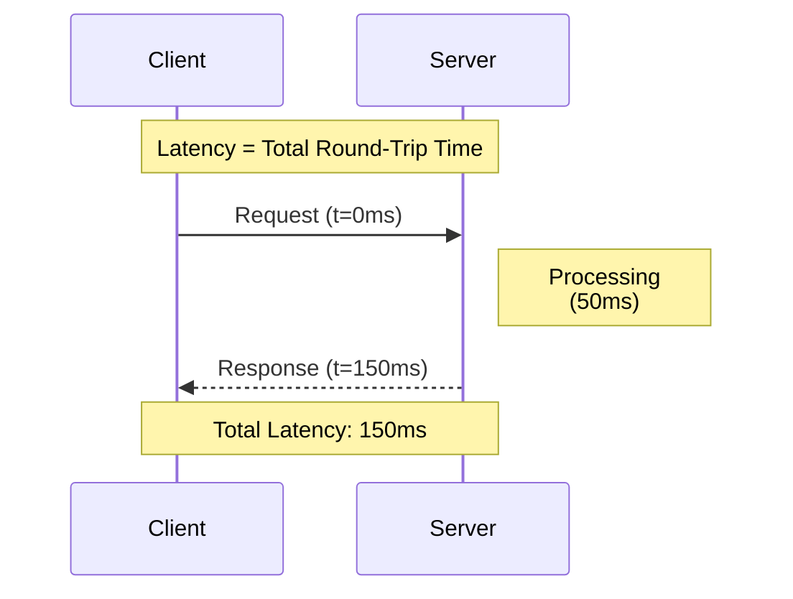
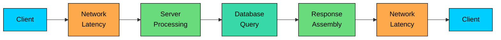
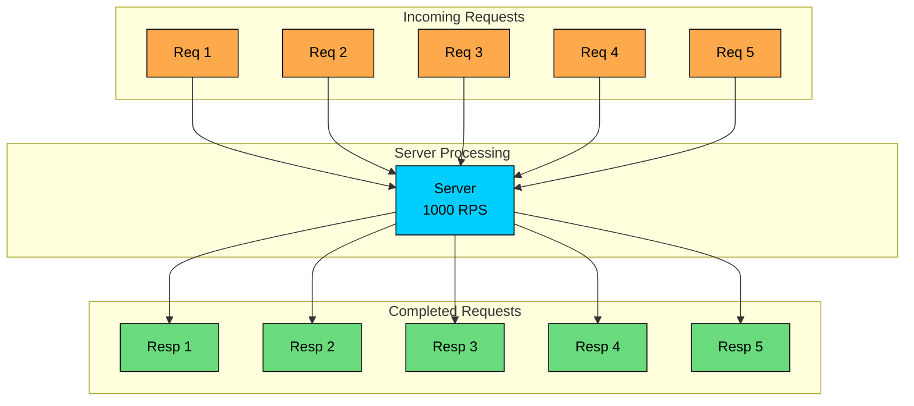
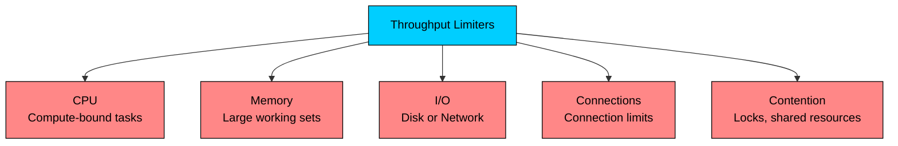
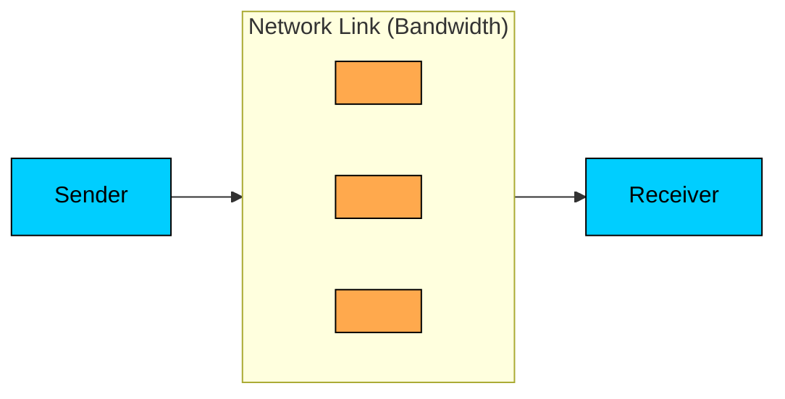

import React from 'react';
import CodeBlock from '../../../../components/ui/CodeBlock';
import Callout from '../../../../components/ui/Callout';

<div className="article-header">
  <div className="breadcrumb">
    <a href="/">Curated Notes</a>
    <span className="breadcrumb-separator">›</span>
    <span className="breadcrumb-current">Latency vs Throughput vs Bandwidth</span>
  </div>
  <h1>Latency vs Throughput vs Bandwidth</h1>
  <p style={{ color: 'var(--text-muted)', fontSize: '1.1rem', marginBottom: '16px', lineHeight: '1.6' }}>
    Master the essentials of Latency vs Throughput vs Bandwidth in this curated guide.
  </p>
  <div className="meta-info">
    <span className="meta-item">
      <svg width="14" height="14" viewBox="0 0 24 24" fill="none" stroke="currentColor" strokeWidth="2"><circle cx="12" cy="12" r="10"/><polyline points="12 6 12 12 16 14"/></svg>
      10 min read
    </span>
    <span className="difficulty-badge difficulty-badge--intermediate">Intermediate</span>
  </div>
</div>

<section className="content-section">

When discussing system performance, three terms come up repeatedly: **latency**, **throughput**, and **bandwidth**. These concepts are often confused or used interchangeably, but they measure fundamentally different things.

Understanding these metrics is crucial for:

- Diagnosing performance bottlenecks
- Making informed architectural decisions
- Setting realistic expectations with stakeholders
- Answering system design interview questions

This chapter walks through each concept, the relationships between them, and which metric matters most in different situations.

---

## The Highway Analogy

A simple analogy makes the distinctions concrete. Think of a highway connecting two exits:


- **Bandwidth** is the number of lanes on the highway. More lanes mean more cars can travel simultaneously.
- **Throughput** is how many cars actually pass through per hour. This depends on traffic conditions, not just the number of lanes.
- **Latency** is the time it takes for a single car to travel from one Exit 1 to Exit 10.

A highway might have 4 lanes (high bandwidth), but if there is an accident, only 100 cars per hour pass through (low throughput). Meanwhile, each car might take 2 hours to complete the journey (high latency).

This analogy helps explain why these metrics do not always move together.

---

## Latency

**Latency** is the time it takes for a single request to travel from source to destination and back. It measures delay.

In networking, latency is often called **round-trip time (RTT)**, the time from sending a request to receiving a response.





#### Components of Latency

Latency is not a single value. It is the sum of multiple delays:





1. **Propagation delay**: Time for signals to travel through the medium. Light in fiber travels at ~200,000 km/s. A cross-Atlantic request (6,000 km) takes ~30ms just for propagation.
2. **Transmission delay**: Time to push bits onto the wire. Depends on packet size and link bandwidth.
3. **Processing delay**: Time for routers, load balancers, and servers to process packets.
4. **Queuing delay**: Time spent waiting in buffers when components are busy.

#### Measuring Latency

Latency is typically measured using percentiles:


| Metric | Description |
|--------|-------------|
| **p50 (median)** | 50% of requests are faster than this |
| **p95** | 95% of requests are faster than this |
| **p99** | 99% of requests are faster than this |
| **p99.9** | 99.9% of requests are faster than this |


**Why percentiles matter:** Average latency hides outliers. A system with 10ms average might have p99 of 500ms, meaning 1% of users experience terrible performance.

#### What Affects Latency?


| Factor | Impact |
|--------|--------|
| Geographic distance | More distance = more propagation delay |
| Network congestion | Causes queuing delays |
| Server load | Increases processing time |
| Database queries | Slow queries add latency |
| DNS resolution | Cold requests need DNS lookup |
| TLS handshake | Adds 1-2 round trips |


#### Reducing Latency

- **Use CDNs**: Serve content from edge locations closer to users
- **Caching**: Eliminate round trips by caching at multiple layers
- **Connection pooling**: Avoid repeated connection setup
- **Database optimization**: Add indexes, optimize queries
- **Geographic distribution**: Deploy servers closer to users
- **Protocol optimization**: Use HTTP/2, HTTP/3 (QUIC)

---

## Throughput

**Throughput** is the amount of work completed per unit of time. It measures volume.

For web systems, throughput is often expressed as **requests per second (RPS)** or **transactions per second (TPS)**.





#### Throughput vs Bandwidth

A common confusion: **bandwidth** is theoretical maximum capacity, while **throughput** is actual achieved rate.


| Metric | Definition | Example |
|--------|------------|---------|
| **Bandwidth** | Maximum possible data transfer rate | 1 Gbps network link |
| **Throughput** | Actual data transfer achieved | 600 Mbps actual transfer |


You can never have throughput higher than bandwidth, but throughput is almost always lower due to:

- Protocol overhead (headers, acknowledgments)
- Congestion and packet loss
- Processing limitations
- Inefficient resource utilization

#### Calculating Throughput

For a single-threaded system:


```shell
Throughput = 1 / Latency

If latency = 10ms:
Throughput = 1 / 0.01s = 100 requests/second
```


For a multi-threaded system:


```shell
Throughput = Concurrent Workers / Latency

If latency = 10ms and 50 workers:
Throughput = 50 / 0.01s = 5,000 requests/second
```


#### What Limits Throughput?





The **bottleneck** determines maximum throughput. A system is only as fast as its slowest component.

#### Improving Throughput

- **Horizontal scaling**: Add more servers
- **Vertical scaling**: Add more CPU, memory
- **Async processing**: Do not block on slow operations
- **Batching**: Process multiple items together
- **Caching**: Reduce work by reusing results
- **Connection pooling**: Reuse expensive connections
- **Load balancing**: Distribute work evenly

---

## Bandwidth

**Bandwidth** is the maximum rate at which data can be transferred. It measures capacity.

Bandwidth is typically expressed in **bits per second (bps)**: Kbps, Mbps, Gbps.





#### Types of Bandwidth


| Type | Description |
|------|-------------|
| **Network bandwidth** | Capacity of network links (1 Gbps Ethernet) |
| **Memory bandwidth** | Rate of data transfer to/from RAM (DDR4: ~25 GB/s) |
| **Disk bandwidth** | Read/write speed of storage (SSD: ~500 MB/s) |
| **Bus bandwidth** | Internal data transfer rate (PCIe 4.0 x16: ~32 GB/s, PCIe 5.0 x16: ~64 GB/s) |


#### Bandwidth-Delay Product

An important concept that connects bandwidth and latency:


```shell
Bandwidth-Delay Product (BDP) = Bandwidth × Latency
```


BDP represents how much data can be "in flight" at any moment.

**Example:**

- Bandwidth: 1 Gbps = 125 MB/s
- Latency: 100ms (coast-to-coast US)
- BDP: 125 MB/s × 0.1s = 12.5 MB

This means 12.5 MB of data can be traveling through the pipe at any instant. If your TCP window size is smaller than BDP, you will not fully utilize available bandwidth.

---

## Summary

Latency, throughput, and bandwidth measure different aspects of system performance. Confusing them leads to optimizing the wrong thing.


| Metric | What It Measures | Typical Unit | Optimize By |
|--------|------------------|--------------|-------------|
| Latency | Time per request | ms | Caching, CDNs, geographic placement, fewer round trips |
| Throughput | Work completed per unit time | RPS, TPS, MB/s | Scaling, concurrency, batching, async processing |
| Bandwidth | Maximum data transfer rate | Mbps, Gbps | Upgrading the link, compression, parallel connections |


Key takeaways:

1. **Latency is the delay for a single request.** Measure it with percentiles (p50, p95, p99), not averages, because averages hide the slow tail.
2. **Throughput is the volume of work completed per unit time.** It is capped by the slowest component in the path, not the headline capacity number.
3. **Bandwidth is the theoretical maximum data transfer rate.** Achieved throughput is almost always lower because of protocol overhead, congestion, and processing limits.
4. **Latency and throughput often trade off.** Batching, queuing, and pipelining raise throughput but add latency to individual requests.
5. **Little's Law connects them:** concurrency = throughput x latency. To raise throughput, either raise concurrency or lower per-request latency.
6. **The bandwidth-delay product sets the in-flight data ceiling.** A TCP window smaller than BDP leaves bandwidth on the table even when the link is fast.
7. **Lower latency with caching, CDNs, geographic placement, and protocol upgrades** like HTTP/2 and HTTP/3. Round trips dominate at distance.
8. **Raise throughput with horizontal scaling, async processing, batching, and connection pooling.** Find the bottleneck first; widening anything else has no effect.

A system can have high bandwidth and low throughput, or low latency and low throughput. The metrics describe different bottlenecks. The first step in performance work is naming which one applies.

---

## Quiz

</section>
