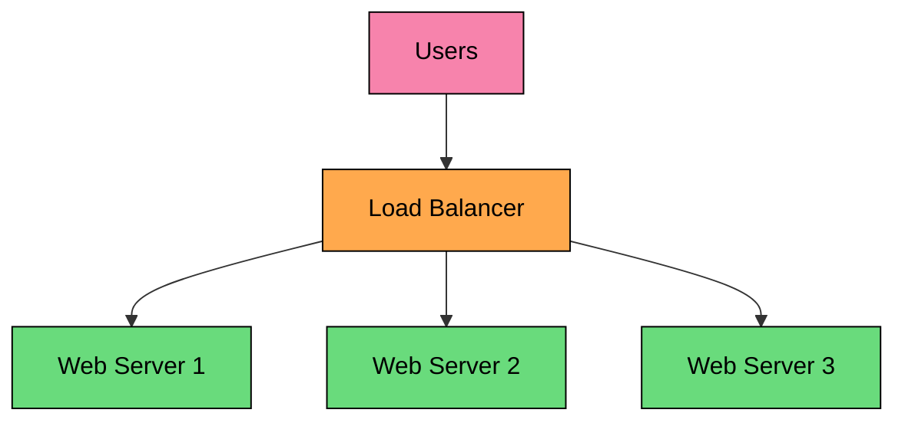
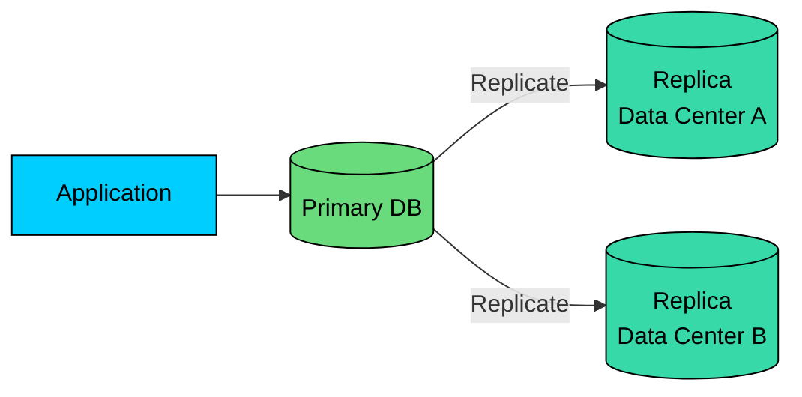
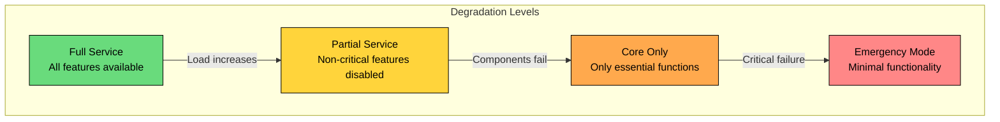
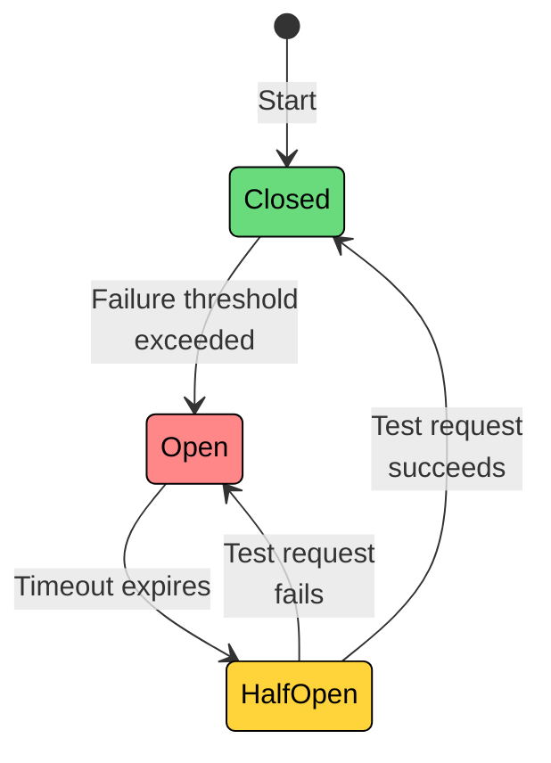
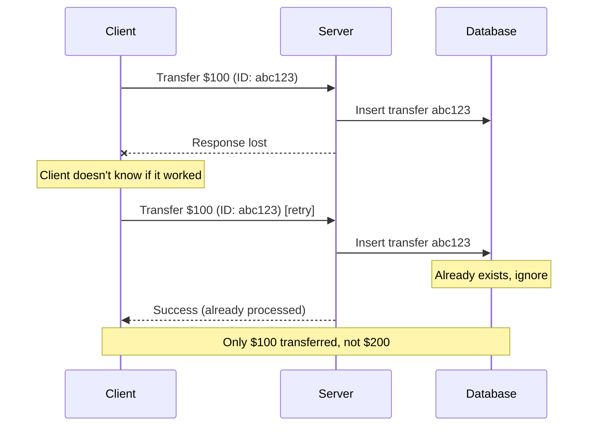

import React from 'react';
import CodeBlock from '../../../../components/ui/CodeBlock';
import Callout from '../../../../components/ui/Callout';

  

    <a href="/">Curated Notes</a>
    ›
    Reliability
  

  <h1>Reliability</h1>
  

    Master the essentials of Reliability in this curated guide.
  

  

    
      <svg width="14" height="14" viewBox="0 0 24 24" fill="none" stroke="currentColor" strokeWidth="2"><circle cx="12" cy="12" r="10"/><polyline points="12 6 12 12 16 14"/></svg>
      10 min read
    
    Intermediate
  

<section className="content-section">

A system that stays up but occasionally produces wrong answers is not actually serving its users. Beyond capacity and uptime, there is a third concern: **reliability**.

A reliable system performs its intended function correctly and consistently, even in the face of faults. Availability asks "Is the system up?"; reliability asks "Is the system doing what it should?"

The distinction matters. Consider a payment system that is always available but occasionally charges customers twice. Or a messaging app that delivers messages out of order.

These systems are available, but they are not reliable. Users tend to lose confidence in a system that gives wrong answers faster than in one that occasionally goes down.

---

## What is Reliability?

&gt; **DEFINITION**
&gt;
&gt; **Reliability** is the probability that a system will perform its intended function correctly over a given period of time, under specified conditions.

This definition has several important parts. 

- "Correctly" means producing the right output, not just any output.
- "Over a given period" means reliability is measured over time, not at a single instant.
- "Under specified conditions" means we define what normal operation looks like.

An available system responds. A reliable system responds correctly. You want both, but they are distinct properties.

#### Reliability vs Related Concepts

People often confuse reliability with availability and fault tolerance. Here is how they differ:

| Concept | Question It Answers | Example |
|---------|--------------------| --------|
| **Availability** | Is the system responding? | System returns HTTP 200 |
| **Reliability** | Is the response correct? | The balance returned is accurate |
| **Fault Tolerance** | Does it keep working when components fail? | Works with one database replica down |
| **Durability** | Is data preserved despite failures? | Data survives disk failure |

A payment system that charges customers twice is available (it processes requests) but unreliable (it processes them incorrectly). A database that loses writes during failover is fault-tolerant (it continues operating) but not durable (data was lost).

These properties are related but independent. You can optimize for one while accidentally sacrificing another. 

A system that aggressively caches data for availability might serve stale (incorrect) responses, trading reliability for uptime.

---

## Measuring Reliability

You cannot improve what you do not measure. Reliability has several well-established metrics that help you understand how your system behaves over time.

#### 1. Mean Time Between Failures (MTBF)

**MTBF** measures the average time between failures. A higher MTBF means failures are less frequent.

`MTBF = Total Operating Time / Number of Failures`

**Example:** if a system ran for 10,000 hours and experienced 5 failures, MTBF = 10,000 / 5 = 2,000 hours.

An MTBF of 2,000 hours means you can expect one failure roughly every 83 days. This helps with planning. If you have 100 servers each with MTBF of 2,000 hours, you will see approximately one server failure per day across your fleet.

#### 2. Mean Time To Recovery (MTTR)

**MTTR** measures how long it takes to restore the system after a failure. A lower MTTR means faster recovery.

`MTTR = Total Downtime / Number of Failures`

**Example:** if 5 failures occurred and total repair time was 10 hours, MTTR = 10 / 5 = 2 hours per failure.

MTTR includes detection time, diagnosis time, repair time, and verification time. Reducing MTTR often has more impact than reducing failure rate. If you cannot prevent failures, at least recover quickly.

#### 3. Error Rate

Percentage of requests that result in errors.

`Error Rate = Failed Requests / Total Requests × 100%`

| System Type | Target Error Rate | Meaning |
|-------------|-------------------|---------|
| Critical systems | &lt; 0.01% | 1 in 10,000 requests fails |
| Standard systems | &lt; 0.1% | 1 in 1,000 requests fails |
| Tolerant systems | &lt; 1% | 1 in 100 requests fails |

#### 4. Data Correctness

Percentage of responses that contain correct data.

`Correctness = Correct Responses / Total Responses × 100%`

This is the often-overlooked metric. A system can have 99.99% availability and 0.01% error rate, but if 1% of successful responses contain wrong data, you have a reliability problem. Users received a response, it just was not the right one.

---

## Why Systems Become Unreliable

Reliability failures come from multiple sources.

#### Hardware Failures

Physical components wear out and fail over time. Disks develop bad sectors, memory cells corrupt, CPUs overheat, and network cards malfunction. Each of these failure modes has predictable statistical behavior at scale.

Hardware failures are well-understood and follow predictable statistical patterns, but at scale they become a daily occurrence rather than a rare event.

#### Software Bugs

Software bugs are responsible for a large share of reliability problems. Unlike hardware failures, which tend to be random and independent, software bugs are systematic: every request that hits the buggy code path fails in the same way.

The most dangerous bugs are those that do not crash the system but silently produce wrong results.

#### Configuration Errors

Configuration mistakes are surprisingly common and often catastrophic. A typo in a configuration file can bring down an entire service.

AWS's S3 outage in 2017 was triggered by a command to remove a small number of servers that accidentally removed a much larger set.

#### Human Error

Human error is a leading cause of production outages. Operators mistype commands, engineers deploy untested changes, and on-call responders misdiagnose problems under time pressure.

#### Overload and Cascading Failures

Systems that work perfectly under normal load can fail catastrophically when overloaded. When one component slows down, requests queue up, timeouts fire, retries multiply the load, and the problem cascades.

---

## Key Principles of Reliable Systems

To build reliable systems, engineers typically focus on several core principles:

#### Redundancy

Redundancy means having backup components ready to take over if one part fails. This could involve multiple servers, duplicate network paths, or backup databases.

#### Failover Mechanisms

Failover is the process by which a system automatically switches to a redundant or standby component when a failure is detected. This ensures continuous operation without noticeable disruption to users.

#### Load Balancing

Load balancing distributes incoming traffic across multiple servers. This not only improves performance but also prevents any single server from becoming a single point of failure.

#### Monitoring and Alerting

A reliable system is constantly monitored. Tools and dashboards track system health and performance, while alerting mechanisms notify engineers of issues before they escalate into major problems.

#### Graceful Degradation

Even when parts of the system fail, a well-designed system can still provide core functionality rather than going completely offline. This concept is known as graceful degradation.

---

## Techniques to Enhance Reliability

These principles translate into a set of practical techniques.

#### 1. Redundant Architectures

The most fundamental reliability technique is having more components than you need. If one fails, others continue operating.

For example, if you have a web server handling user requests, deploy several servers behind a load balancer:

If one server fails, the load balancer automatically routes traffic to the remaining servers.

#### 2. Data Replication

Ensure your data is not stored in a single location. Use data replication strategies across multiple databases or data centers.

This way, if one database fails, the system can still access a copy from another location.

#### 3. Graceful Degradation

When parts of the system fail, graceful degradation keeps the core functionality working. Instead of complete failure, the system provides reduced service.

Consider an e-commerce site:

- **Full service:** Personalized recommendations, real-time inventory, all payment options
- **Partial service:** Generic recommendations, cached inventory, primary payment options
- **Core only:** Browse products, checkout with basic payment
- **Emergency mode:** Display cached product pages, accept orders for later processing

#### 4. Circuit Breakers

In a microservices architecture, one service failing can cascade failures throughout the system. Circuit breakers detect when a service is failing and temporarily cut off requests to prevent overload, allowing the system to recover gracefully.

In the **closed** state, requests pass through normally. Failures are counted. When failures exceed a threshold (e.g., 5 failures in 30 seconds), the circuit opens.

In the **open** state, requests fail immediately without calling the dependency. This prevents wasting resources and allows the dependency time to recover.

After a timeout (e.g., 30 seconds), the circuit moves to **half-open**. A limited number of test requests are allowed through. If they succeed, the circuit closes. If they fail, it opens again.

#### 5. Idempotency

Network failures make it unclear whether a request succeeded or failed. If you retry, you might execute the operation twice. Idempotent operations produce the same result regardless of how many times they are executed.

The idempotency key (abc123) allows the server to detect retries. The first execution stores the key. Subsequent executions with the same key return the stored result without re-executing.

Stripe, PayPal, and other payment processors require idempotency keys for money-moving operations. Without them, network issues could cause duplicate charges.

---

## Summary

Reliability is the probability that a system performs its intended function correctly over time. Availability asks if the system responds; reliability asks if the response is right.

Key takeaways:

1. **Reliability, availability, fault tolerance, and durability are distinct properties.** A system can be available and unreliable, or fault-tolerant but not durable. Optimizing for one can quietly sacrifice another.
2. **MTBF measures how often things break, MTTR measures how fast you recover.** Reducing MTTR often has more impact than trying to prevent every failure.
3. **Error rate and correctness are both required.** A response that never errors but contains wrong data still fails the user.
4. **Failures come from many sources.** Hardware wear, software bugs, configuration mistakes, human error, and overload cascades each call for different defenses.
5. **Redundancy plus failover keeps the system serving when components die.** An untested failover path is a false sense of safety.
6. **Graceful degradation reduces blast radius.** Core flows should keep working when optional services fail; emergency mode is better than a blank page.
7. **Circuit breakers prevent one slow dependency from taking down the rest of the system.** Fail fast, then recover deliberately.
8. **Idempotency makes retries safe.** Money-moving operations should require an idempotency key so duplicate requests do not cause duplicate effects.

The practical question for any feature is: **if a dependency returns wrong data, returns slow, or fails entirely, what does the user see, and does the system recover on its own?**

</section>
