import React from 'react';
import CodeBlock from '../../../../components/ui/CodeBlock';
import Callout from '../../../../components/ui/Callout';

  

    <a href="/">Curated Notes</a>
    ›
    Scalability
  

  <h1>Scalability</h1>
  

    Master the essentials of Scalability in this curated guide.
  

  

    
      <svg width="14" height="14" viewBox="0 0 24 24" fill="none" stroke="currentColor" strokeWidth="2"><circle cx="12" cy="12" r="10"/><polyline points="12 6 12 12 16 14"/></svg>
      10 min read
    
    Intermediate
  

<section className="content-section">

As an application grows, the load on it grows too: more users, more data, more requests per second. A design that worked for a thousand users may not work for a million, and a database that served a hundred queries per second may not serve ten thousand.

This is where **scalability** becomes critical. 

&gt; **What is Scalability?**
&gt;
&gt; **Scalability** is the ability of a system to handle increased load by adding resources. The key word here is "ability", a scalable system can grow to meet demand without requiring a complete architectural overhaul.

Scalability is one of the foundational concerns of system design. Many other properties of a production system depend on the choices made at the scaling layer.

---

## Measuring Scalability

Before scaling, you need to understand how to measure it. You cannot improve what you do not measure, and vague statements like "we need to scale" are useless without concrete numbers.

Scalability is typically evaluated along these dimensions:

#### Load Metrics

| Metric | Description | Example |
|--------|-------------|---------|
| **Requests per second (RPS)** | Number of API calls the system handles | 10,000 RPS |
| **Concurrent users** | Users active at the same time | 50,000 concurrent |
| **Data volume** | Amount of data stored or processed | 10 TB storage |
| **Throughput** | Data transferred per unit time | 1 GB/s |
| **Query rate** | Database queries per second | 50,000 QPS |
| **Message rate** | Messages processed through queues | 100,000 msg/s |

#### Performance Under Load

A system scales well if it maintains acceptable performance as load increases. Here is what good and bad scaling looks like:

| Load Increase | Response Time | Behavior | What It Means |
|---------------|---------------|----------|---------------|
| 1x (baseline) | 50ms | Baseline | Normal operation |
| 2x | 55ms | Excellent | Sublinear growth, caching working well |
| 5x | 70ms | Good | System handling load efficiently |
| 10x | 150ms | Acceptable | Linear degradation, predictable |
| 10x | 500ms | Concerning | Superlinear degradation, bottleneck forming |
| 10x | Timeout | Critical | System at breaking point |

The goal is to keep performance relatively stable as load increases. Ideally, you want linear or sublinear degradation, where doubling load does not double response time. When response times spike or the system starts timing out, you have hit a scalability wall.

---

## Vertical Scaling (Scale Up)

Vertical scaling means adding more power to your existing machines. Instead of adding more servers, you upgrade to bigger ones.

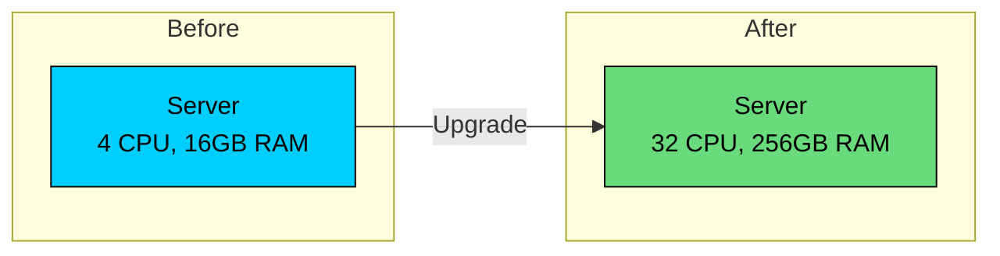

This is often the first response to performance problems because it requires no architectural changes.

#### Common Vertical Scaling Actions

- **Add more CPU cores** for compute-intensive workloads
- **Increase RAM** to cache more data in memory
- **Use faster SSDs** to reduce I/O bottlenecks
- **Upgrade network cards** for higher bandwidth

#### Pros and Cons

#### Pros

- **Simple:** No code changes required. Just move to a bigger machine.
- **Lower latency:** All data is local, no network hops.
- **No distributed complexity:** A single server means no network partitions, no data synchronization issues.

#### Cons

- **Hardware limits:** You cannot scale beyond the largest available machine. Even cloud providers have limits.
- **Single point of failure:** One server means one failure point. If it goes down, everything goes down.
- **Cost curve:** Larger machines cost disproportionately more. Doubling capacity often more than doubles cost.
- **Downtime during upgrades:** Migrating to a bigger machine typically requires downtime.

#### When to Use Vertical Scaling

Vertical scaling works well for:

- **Databases** where data locality matters (before sharding becomes necessary)
- **Applications with strong consistency requirements**
- **Early-stage startups** that need simplicity over scale
- **Workloads with predictable, moderate growth**

&gt; **NOTE**
&gt;
&gt; Never dismiss vertical scaling as "not scalable." Many real-world systems run on vertically scaled databases for years. The key is knowing when horizontal scaling becomes necessary.

---

## Horizontal Scaling (Scale Out)

Vertical scaling eventually hits a ceiling. When the biggest available machine is not big enough, or when you need fault tolerance that a single machine cannot provide, you need a different approach.

Horizontal scaling means adding more machines rather than upgrading existing ones. Instead of one powerful server, you distribute the load across many commodity servers.

This is how companies like Google, Netflix, and Amazon handle billions of requests.

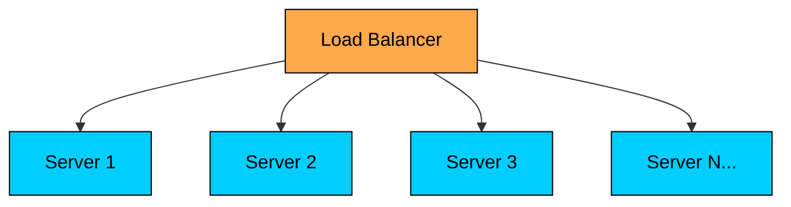

Instead of one powerful server, you have many commodity servers working together. A load balancer distributes incoming requests across all servers.

#### Pros and Cons

#### Pros

- **No hard limit:** You can keep adding servers as needed. Cloud providers make this nearly unlimited.
- **Fault tolerance:** If one server fails, others continue serving traffic. No single point of failure.
- **Cost-effective:** Many smaller machines often cost less than one giant machine.
- **Geographic distribution:** You can place servers closer to users for lower latency.

#### Cons

- **Complexity:** Distributed systems are harder to build, debug, and maintain.
- **Data consistency:** Keeping data synchronized across servers is challenging.
- **Network overhead:** Communication between servers adds latency.
- **Stateless requirement:** Application servers typically need to be stateless, which may require architectural changes.

#### Stateless vs Stateful Services

For horizontal scaling to work effectively, services should be **stateless**. A stateless service does not store any session data locally. Each request can be handled by any server.

The difference is significant for scaling:

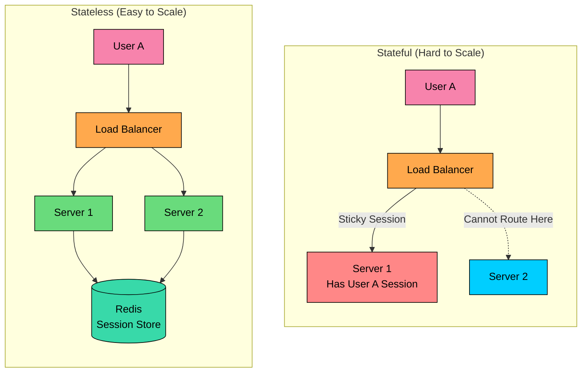

In the stateful model, once a user's session is stored on Server 1, all their requests must go to that same server. This creates hotspots and makes it risky to remove servers. In the stateless model, session data lives in a shared store like Redis, so any server can handle any request. The load balancer has complete freedom to distribute traffic.

To make services stateless:

- Store session data in a shared cache (Redis, Memcached)
- Use tokens (JWT) instead of server-side sessions
- Store uploaded files in object storage (S3) instead of local disk

---

## Scaling Different Components

A typical system is not monolithic. It has multiple components, each with different scaling characteristics and challenges. Understanding these differences is crucial because the scaling strategy that works for one tier often does not work for another.

#### Application Tier

Application servers are usually the easiest to scale horizontally, provided they are stateless:

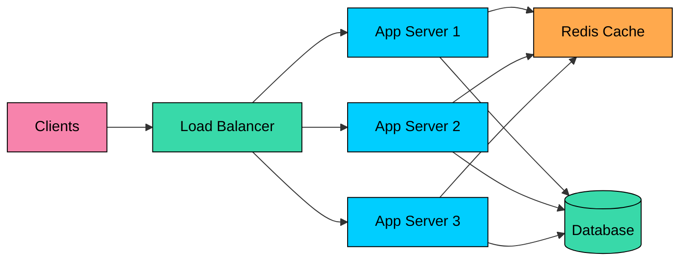

##### **Key strategies:**

- Make services stateless
- Use a load balancer to distribute traffic
- Auto-scale based on CPU, memory, or request count
- Deploy across multiple availability zones

#### Database Tier

Databases are typically the hardest to scale because they manage state. Unlike application servers, you cannot simply spin up more database instances and put a load balancer in front of them. Data consistency, durability, and transaction isolation all complicate matters.

The approach depends on your workload pattern:

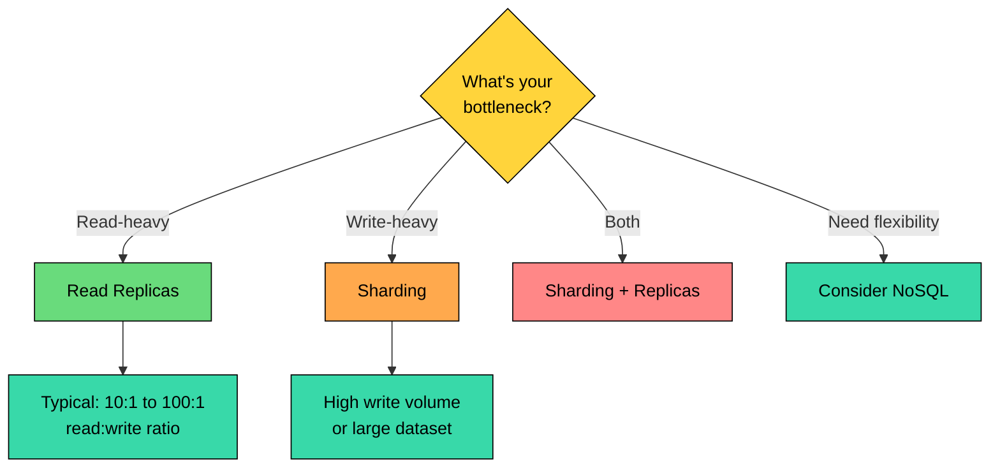

#### 1. Read Replicas

For read-heavy workloads (which most applications are), create copies of your database that handle read queries:

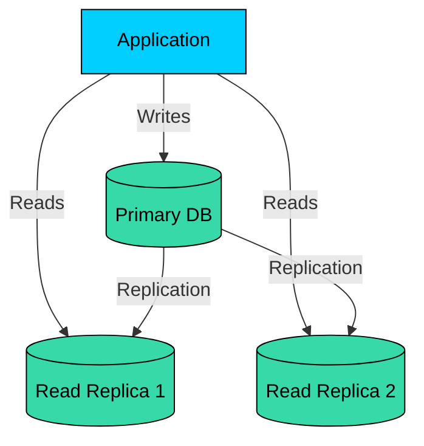

Primary handles all writes, replicas receive changes and serve reads.

**When to use:** Read-to-write ratio is 10:1 or higher, and writes are not the bottleneck.

#### Pros

- Simple to set up (managed services handle it)
- Offloads read traffic from primary	
- Provides read availability if primary fails	
- No application changes for basic setup

#### Cons

- Does not help with write-heavy workloads
- Introduces replication lag (stale reads)
- Replicas consume storage (full data copy)
- Failover can cause brief inconsistency

#### 2. Sharding (Partitioning)

When read replicas are not enough, or when write volume exceeds what a single primary can handle, you need to split your data across multiple databases based on a partition key:

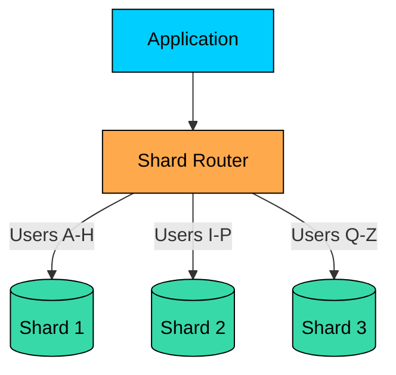

#### Pros

- Distributes both reads AND writes	
- Scales horizontally (add more shards)	
- Each shard is smaller, faster	
- Can place shards in different regions

#### Cons

- Complex to implement correctly
- Cross-shard queries are expensive or impossible
- Rebalancing shards is operationally difficult
- Transactions across shards are very hard

##### **Common sharding strategies:**

- **Range-based:** Shard by value ranges (A-H, I-P, Q-Z)
- **Hash-based:** Hash the key and mod by number of shards
- **Directory-based:** Maintain a lookup table mapping keys to shards

#### 3. NoSQL Databases

NoSQL databases like Cassandra, MongoDB, and DynamoDB are designed for horizontal scaling from the ground up:

- **Built-in sharding:** Data is automatically distributed
- **Eventual consistency:** Trade strong consistency for availability
- **No joins:** Data model must accommodate denormalization

#### Pros

- Built-in sharding (automatic distribution)
- Designed for horizontal scale	
- Often better write performance
- Schema flexibility

#### Cons

- Different query patterns than SQL
- No joins (denormalization required)
- Eventual consistency in many cases
- Less tooling ecosystem than SQL

#### Caching Tier

Caching reduces load on databases and improves response times. A well-designed cache can handle 100x the throughput of a database, making it essential for high-traffic systems. Redis, for example, can handle 100,000+ operations per second on a single node.

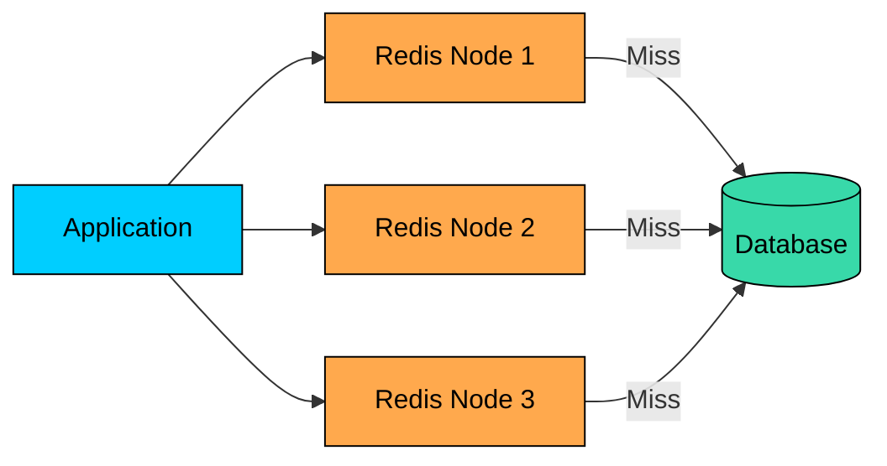

##### **Cache Scaling strategies:**

- **Redis Cluster:** Automatically partitions data across nodes using hash slots
- **Consistent hashing:** Distributes keys evenly and minimizes redistribution when nodes are added or removed
- **Cache-aside pattern:** Application checks cache first, falls back to database on cache miss, then populates the cache

#### Message Queue Tier

Message queues are essential for scaling asynchronous workloads. They decouple producers from consumers, allowing each to scale independently, and they buffer traffic spikes so consumers can process at their own pace.

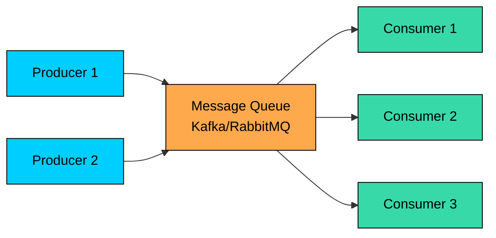

##### **How queues help scalability:**

- **Decouple producers and consumers:** Scale each independently
- **Buffer traffic spikes:** Queue absorbs bursts, consumers process at their own pace
- **Partition topics:** Kafka partitions allow parallel consumption

---

## Example: Scaling from 0 to millions of users

Theory is useful, but seeing scalability in action makes it stick. Let us walk through how a startup might scale a social media application from zero to millions of users. Each stage solves a specific bottleneck that emerged from growth.

#### Stage 1: Single Server (0-10K users)

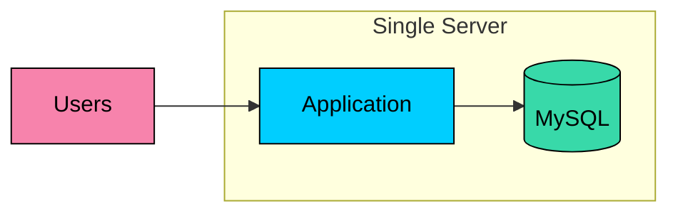

At launch, everything runs on one machine. The application and database share the same server. This setup is simple, cheap, and perfectly adequate for a few thousand users. There is no distributed system complexity, no network latency between components, and debugging is straightforward.

The bottleneck emerges when the application and database start competing for CPU and memory on the same machine.

#### Stage 2: Separate Database (10K-100K users)

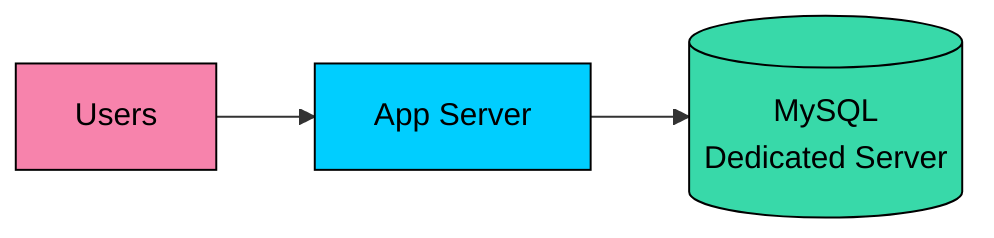

The first scaling move is usually separating the database onto its own machine. Now each component can be tuned independently. You can give the database server more RAM for caching, while the app server gets more CPU for request processing.

The bottleneck shifts to the database. As user counts grow, the database handles more queries, and read operations start slowing down.

#### Stage 3: Add Caching (100K-500K users)

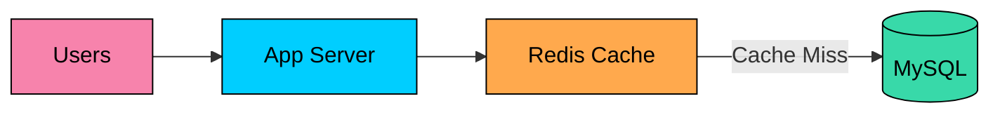

Adding a cache layer dramatically reduces database load. Hot data, things like user profiles, recent posts, and session data, gets served from memory. Redis can handle hundreds of thousands of reads per second, far more than MySQL. With a good caching strategy, 80-90% of reads never hit the database.

The bottleneck is now the single app server. It cannot handle the incoming request volume.

#### Stage 4: Multiple App Servers (500K-2M users)

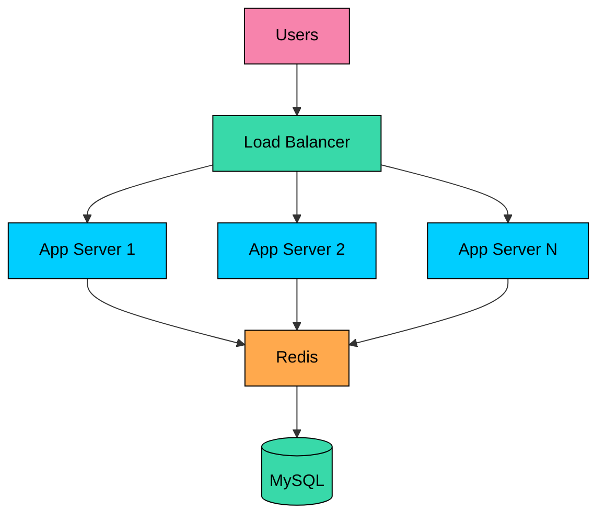

This is where horizontal scaling begins. A load balancer distributes traffic across multiple app servers. Each server is stateless, storing no session data locally. The Redis cache serves as the shared session store.

Adding more app servers is now trivial. Need more capacity? Spin up another server. Traffic spike during peak hours? Auto-scaling adds servers automatically.

The bottleneck shifts back to the database. With more app servers generating more queries, the single MySQL instance becomes overwhelmed.

#### Stage 5: Read Replicas (2M-10M users)

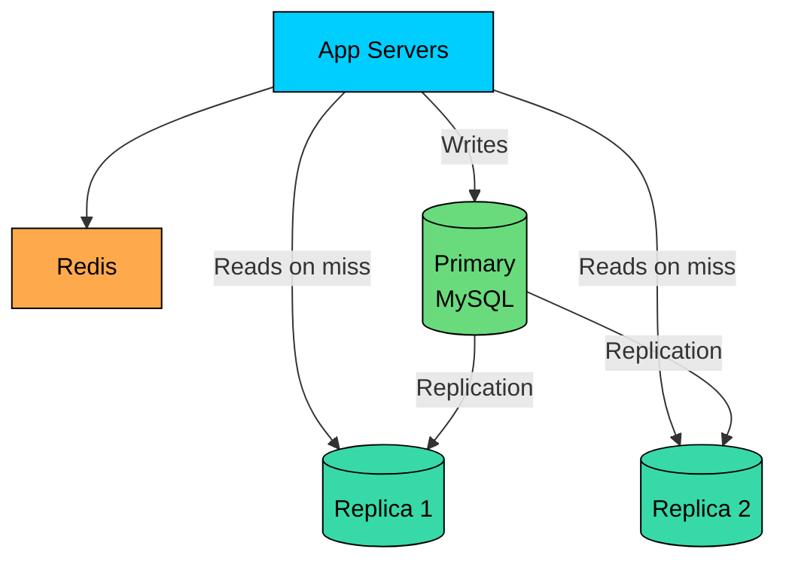

Most applications are read-heavy, with reads outnumbering writes by 10:1 or more. Read replicas take advantage of this pattern. The primary database handles all writes, while replicas serve read queries. This multiplies read capacity without changing the application much.

The trade-off is replication lag. Replicas may be a few milliseconds behind the primary, so recently written data might not be immediately visible on reads. For most applications, this is acceptable.

The bottleneck becomes write throughput. One primary database can only handle so many writes per second.

#### Stage 6: Sharding (10M+ users)

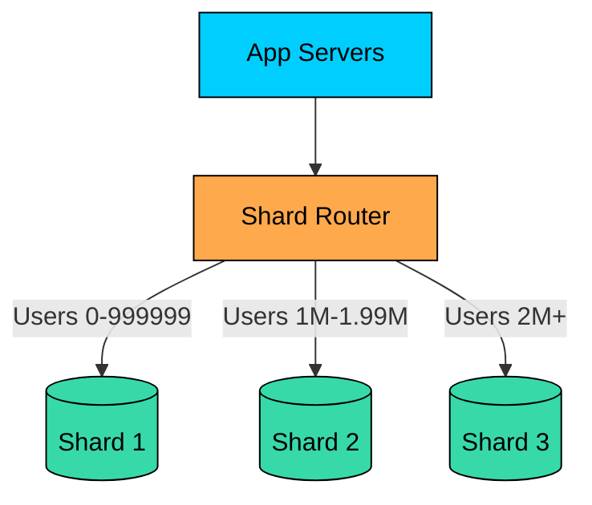

Sharding is the final frontier of relational database scaling. Data is partitioned across multiple databases based on a shard key, typically user ID. Each shard handles a subset of users, distributing both read and write load.

This is powerful but comes with significant complexity. Cross-shard queries become expensive or impossible. Rebalancing shards when they grow unevenly is operationally challenging. Many teams at this stage consider moving to distributed databases like CockroachDB or Vitess that handle sharding automatically.

---

## Summary

Scalability is about designing systems that can grow with demand without falling apart. Here are the key takeaways:

- **Vertical scaling** is simple but has limits. Use it for databases, early-stage systems, and workloads where simplicity matters more than infinite growth.
- **Horizontal scaling** is more complex but can grow indefinitely. It requires stateless services and careful data management.
- **Different components scale differently.** App servers are easy to scale horizontally. Databases are hard because they manage state. Know the difference.
- **Always identify the bottleneck first** before deciding how to scale. Adding more app servers does not help if the database is the problem.
- **Common patterns** like load balancing, caching, async processing, and database optimization appear in almost every scalable system.

Scalability addresses the question of handling more load. Designing for scale is one of the recurring trade-offs in system design: every choice (vertical vs horizontal, stateful vs stateless, replicate vs shard) has costs that depend on the workload pattern and the bottleneck.

</section>
