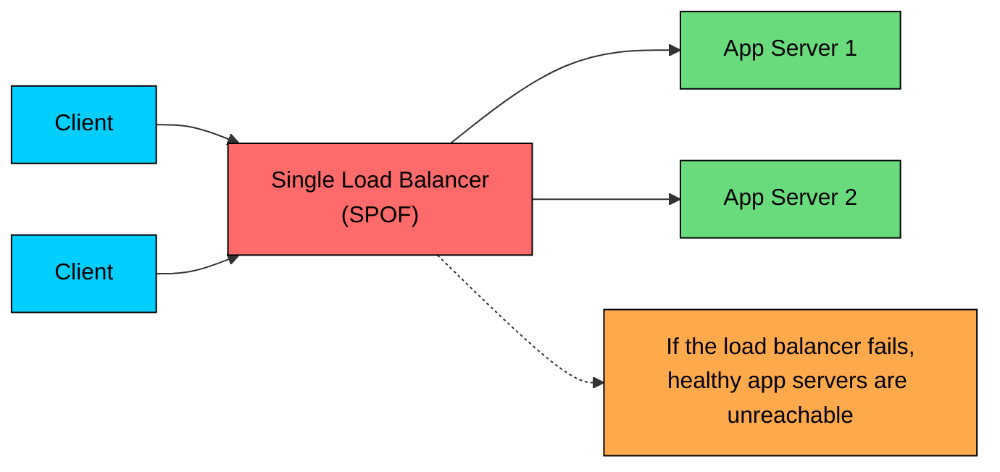
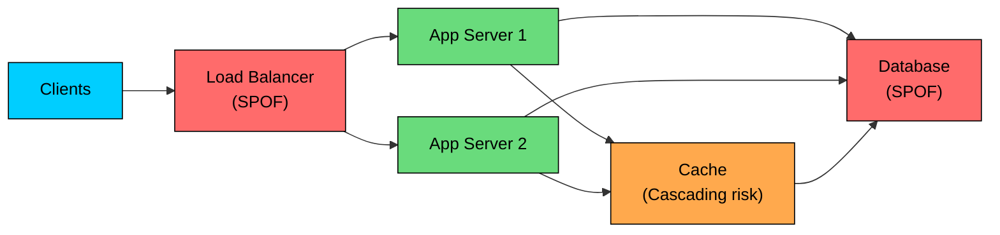
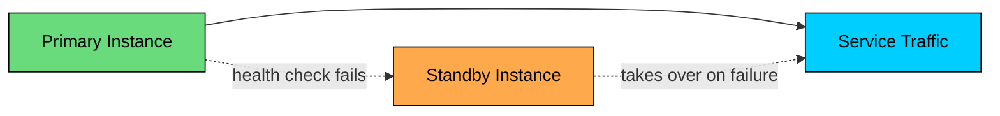
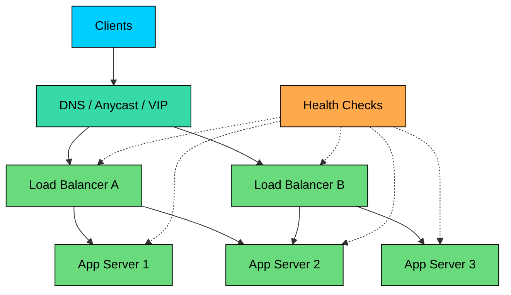
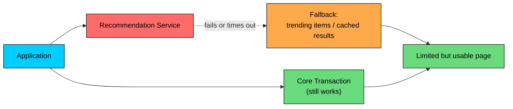

import React from 'react';
import CodeBlock from '../../../../components/ui/CodeBlock';
import Callout from '../../../../components/ui/Callout';

  

    <a href="/">Curated Notes</a>
    ›
    Single Point of Failure
  

  <h1>Single Point of Failure</h1>
  

    Master the essentials of Single Point of Failure in this curated guide.
  

  

    
      <svg width="14" height="14" viewBox="0 0 24 24" fill="none" stroke="currentColor" strokeWidth="2"><circle cx="12" cy="12" r="10"/><polyline points="12 6 12 12 16 14"/></svg>
      10 min read
    
    Intermediate
  

<section className="content-section">

A **single point of failure (SPOF)** is any component, dependency, process, or decision point whose failure can take down the system or a critical user flow.

The component does not have to be a server. A SPOF can be a database primary, load balancer, DNS provider, cloud region, message broker, secrets manager, deployment pipeline, human approval step, shared library, feature flag service, or one overloaded team that knows how to recover the system.

In the diagram, a single load balancer sits in front of multiple application servers. If that load balancer fails and nothing else can route traffic, the application servers may still be healthy, but users cannot reach them. The load balancer is a SPOF.

Reducing SPOFs improves availability, but the goal is not to add redundancy everywhere. The goal is to understand which failures matter, reduce the blast radius, and make recovery predictable.

---

## 1. What Makes Something a SPOF

A component is a SPOF when three things are true:

1. A critical path depends on it.
2. There is no working alternative when it fails.
3. The failure causes unacceptable impact.

That last part matters. Not every failed component is a SPOF.

If a recommendation service fails and the homepage can still show popular items, that service is not a SPOF for checkout. It may be a SPOF for personalized recommendations, but not for the whole product.

If a cache fails and every request falls back to the database, the cache may not be a direct SPOF. But if the fallback traffic overwhelms the database and causes a wider outage, the cache has become part of a cascading failure path.

Good SPOF analysis is about user flows and dependencies, not just counting servers.

#### Example Architecture

This system has one load balancer, two application servers, one cache, and one database. The load balancer is the most obvious SPOF: if it fails, clients cannot reach either application server. The database is another one, since reads and writes that require durable data stop when it fails.

The cache is more subtle. The system may keep running when it fails, but the database can see a sudden load spike that turns a cache outage into a database outage.

SPOFs can also hide in the network path and the control plane. If every component depends on one NAT gateway, firewall, route, or private link, that shared dependency becomes the real SPOF.

If deployments or service discovery depend on one unavailable service, recovery can stall even when the data path is healthy.

The application servers are less likely to be SPOFs because there are two of them. But even that depends on health checks, load balancing, capacity, and failure isolation. If one server cannot handle the extra load after the other fails, the pair is redundant on paper but not in practice.

---

## 2. Common SPOFs

SPOFs often hide in places that are not obvious on the first architecture diagram.

| Area | Common SPOF | Failure Impact |
|------|-------------|----------------|
| Traffic entry | One load balancer, one ingress controller, one DNS provider | Users cannot reach the service |
| Compute | One application instance or one availability zone | Requests fail when that instance or zone fails |
| Data | One database primary without failover | Reads or writes stop; data may be at risk |
| Cache | One cache cluster with no fallback limits | Database overload after cache failure |
| Messaging | One broker, queue, or stream cluster | Producers block or consumers stop |
| Configuration | One config service or feature flag system | Services cannot start or update safely |
| Secrets | One secrets manager path or token issuer | Authentication or service startup fails |
| Storage | One object bucket, volume, filesystem, or metadata server | Files become unavailable |
| Network | One NAT gateway, route table, firewall, VPN, or private link | Large parts of the system lose connectivity |
| Operations | One deployment pipeline, runbook, account, or expert | Recovery depends on a single process or person |

Finally, operational SPOFs sit outside the runtime path but bite during incidents. A single deployment pipeline, runbook, cloud account, or in-house expert means recovery depends on one process or one person being available.

AI and ML systems add their own common SPOFs. A single vector database cluster shared across every retrieval path is one. A model gateway without regional failover is another. So is one queue that owns all batch inference jobs, or a single embedding service required for ingestion.

Operational dependencies add more. One policy service that every prompt must pass through, a feature store required before model serving can start, or a centralized quota service that fails closed without a fallback mode can each take down the AI path even when the models are healthy.

Some of these should fail closed for safety. If the policy service is unavailable, rejecting high-risk requests may be the correct behavior. That choice should be explicit and documented, not an accidental side effect of the implementation.

---

## 3. How to Identify SPOFs

SPOF analysis is a dependency exercise.

#### 3.1 Start With Critical User Flows

Start by mapping the flows that must work, such as user sign-in, checkout, payment authorization, search, document upload, model inference, admin permission changes, and incident rollback.

For each flow, list every dependency in the request path: services, databases, caches, queues, secrets, DNS, network paths, third-party APIs, and control-plane services.

Then ask: **if this dependency fails, what happens to the flow?**

#### 3.2 Trace Runtime and Recovery Dependencies

Many systems have two dependency graphs:

1. **Runtime graph:** what is needed to serve traffic.
2. **Recovery graph:** what is needed to repair the system after failure.

A service may keep running while a dependency is down, but you may be unable to deploy, rotate credentials, change feature flags, or fail over. That recovery dependency can become the real SPOF during an incident.

The app might serve traffic but be unable to restart because the secrets manager is down. The database might have replicas, but failover requires a manual command that only one person can run.

The service might be able to run in another region, but DNS failover is manual and untested. Backups might exist, but restore permissions are tied to one unavailable account.

#### 3.3 Look for Shared Fate

Two components are not truly redundant if they fail together.

Some shared-fate problems are infrastructure-level: a primary and its replica sitting in the same availability zone, multiple load balancers that all depend on one DNS record or one network path, or multi-region services that share one global control plane.

Others are easier to miss: two services backed by the same overloaded database, redundant workers reading from the same queue partition, and backups stored in the same account or region as the primary data.

Redundancy only helps when failures are independent enough.

#### 3.4 Run Failure Reviews

For each important component, ask:

1. What happens if it is slow?
2. What happens if it returns errors?
3. What happens if it returns bad data?
4. What happens if it is unreachable from one zone or region?
5. What happens if it recovers with stale state?
6. What happens if failover works but capacity is reduced?

Slow dependencies are especially dangerous. A hard failure often triggers health checks. A slow dependency can tie up threads, connection pools, queues, and retries until the whole service degrades.

#### 3.5 Test the Assumptions

An architecture diagram describes intended behavior. Controlled failure tests are how teams confirm that the actual behavior matches that intent.

Start with single-component tests: kill one application instance, disable a cache node, block access to a database replica, or force a queue consumer group rebalance.

Then move to broader scenarios: simulate a zone failure, break DNS resolution in a test environment, run a backup restore drill, and fail over to another region while measuring recovery time.

Chaos engineering is useful when it is tied to specific hypotheses. Random failure injection without clear expectations often creates noise. Start with targeted tests: "If cache cluster A fails, checkout latency stays under 300 ms and database CPU stays below 70%."

---

## 4. Strategies to Reduce SPOFs

#### 4.1 Redundancy

Redundancy means having another component that can take over when one fails.

Common patterns include multiple application instances, database replicas, multiple cache nodes, multiple message brokers, multiple DNS nameservers, deployment across multiple availability zones, and multiple people trained on the same runbook.

Redundancy can be **active-active**, where multiple components serve traffic at the same time, or **active-passive**, where a standby takes over after failure.

Active-active usually gives better capacity and faster failover. Active-passive is simpler to reason about, but the failover path itself must be exercised regularly. A standby that has never taken over in a real failure cannot be relied on to take over correctly.

#### 4.2 Load Balancing and Health Checks

Load balancers distribute traffic across healthy instances.

They reduce SPOFs only if the load balancer layer itself is redundant.

A few details matter in practice. Health checks should detect real readiness, not just process liveness. Failed instances should drain existing requests before removal when possible. Overloaded instances should be removed or shed load before they collapse.

Load balancer configuration should be versioned and recoverable. Cross-zone or cross-region routing should account for capacity and latency, since routing all traffic to a healthy zone that cannot serve it does not improve availability.

#### 4.3 Data Replication and Backup

Replication keeps data available when one node fails.

Common approaches:

- **Synchronous replication:** commit waits for another replica or quorum. Better freshness, higher latency.
- **Asynchronous replication:** primary acknowledges first, replicas catch up later. Lower latency, possible data loss during failover.
- **Multi-primary replication:** multiple nodes accept writes. Higher availability, but conflicts must be handled.
- **Read replicas:** improve read capacity and failover options, but may lag.

Replication is not backup. If bad data is written, replicated deletion or corruption may spread quickly. Backups protect against data loss, operator mistakes, application bugs, ransomware, and accidental deletes.

For critical data, test restore time, restore correctness, and the permissions required to perform a restore. Until a backup has been restored end-to-end at least once, its recoverability is unproven.

#### 4.4 Geographic and Failure-Domain Isolation

Distribute components across independent failure domains: processes, hosts, racks, availability zones, regions, cloud accounts, and (when the business case justifies the complexity) different providers.

Geographic distribution helps with regional failures, but it introduces replication lag, consistency trade-offs, failover complexity, and higher operational cost.

For many systems, multi-AZ design is the right first step. Multi-region design is useful when the product truly needs regional disaster recovery or low-latency global access.

#### 4.5 Graceful Degradation

Some dependencies should not take the whole product down.

Concrete examples are easy to find. If recommendations fail, show trending items. If search is degraded, fall back to exact title matching or cached results.

If a vector index is rebuilding, show ingestion status instead of returning empty answers. If analytics are delayed, show the last-updated timestamp so users know what they are looking at. If a third-party enrichment API fails, continue the core transaction without enrichment.

Graceful degradation should be explicit. A clearly-labeled limited-mode response is usually better than a successful-looking response built on stale or incomplete data.

#### 4.6 Backpressure, Timeouts, and Circuit Breakers

Many outages spread because callers wait too long, retry too aggressively, or keep sending traffic to a dependency that is already failing.

The defenses are well-known. Latency controls include timeouts on every remote call, bounded retries with jitter, and circuit breakers to fail fast.

Resource controls add bulkheads, queue limits, and load shedding when the system is saturated. Boundary controls include rate limits and idempotency keys so retries do not double-apply writes.

These patterns do not remove SPOFs by themselves. They prevent one failing dependency from consuming the rest of the system.

#### 4.7 Monitoring, Alerting, and Runbooks

Monitoring does not make a system redundant, but it reduces time to detection and recovery.

Track health check failures, error rate, latency percentiles, and saturation across CPU, memory, disk, connections, thread pools, and queue depth. Also track replication lag, failover events, backup and restore status, dependency errors, and regional or zone-level traffic imbalance.

Alerts should map to action. If an alert fires and no responder knows how to handle it, the gap in operational knowledge is itself a single point of failure.

Runbooks should cover how to detect the failure, how to fail over, how to roll back, how to verify recovery, who owns the decision, and what customer impact to expect.

---

## 5. Redundancy Trade-Offs

Removing SPOFs is not free. Redundancy adds cost, operational complexity, more moving parts, more replication and consistency decisions, more failover states to test, and more ways to misconfigure traffic routing.

Sometimes accepting a SPOF is reasonable, especially for a low-risk internal tool, an early prototype, or a non-critical feature. The real problem is having a SPOF in a critical path without knowing it.

For each SPOF, make an explicit decision:

1. Remove it now.
2. Mitigate it with graceful degradation.
3. Monitor it and accept the risk.
4. Put it on the roadmap with a clear trigger.

Use business impact to decide. The checkout database and the badge-count cache should not get the same level of engineering investment.

---

## Summary

A single point of failure is any dependency whose failure can take down a critical system path.

Key takeaways:

1. **SPOFs are dependency problems.** Look at user flows, not just servers.
2. **Redundancy only helps when failure modes are independent.** Shared zones, accounts, networks, and control planes can defeat redundancy.
3. **Caches and optional services can still cause cascading failures.** A fallback path must have enough capacity.
4. **Replication is not backup.** You need both for critical data.
5. **Failover must be tested.** Untested standby systems often fail during the first real incident.
6. **Graceful degradation reduces blast radius.** Not every dependency should take down the whole product.
7. **Operational SPOFs matter.** Runbooks, permissions, deployment pipelines, and human knowledge can be single points too.
8. **Accepting a SPOF can be valid.** Make it a conscious trade-off based on risk, cost, and user impact.

The practical question is simple: **if this thing fails right now, what stops working, who notices, and how do we recover?**

</section>
