import React from 'react';
import CodeBlock from '../../../../components/ui/CodeBlock';
import Callout from '../../../../components/ui/Callout';

<div className="article-header">
  <div className="breadcrumb">
    <a href="/">Curated Notes</a>
    <span className="breadcrumb-separator">›</span>
    <span className="breadcrumb-current">30 Must-Know System Design Concepts</span>
  </div>
  <h1>30 Must-Know System Design Concepts</h1>
  <p style={{ color: 'var(--text-muted)', fontSize: '1.1rem', marginBottom: '16px', lineHeight: '1.6' }}>
    Master the essentials of 30 Must-Know System Design Concepts in this curated guide.
  </p>
  <div className="meta-info">
    <span className="meta-item">
      <svg width="14" height="14" viewBox="0 0 24 24" fill="none" stroke="currentColor" strokeWidth="2"><circle cx="12" cy="12" r="10"/><polyline points="12 6 12 12 16 14"/></svg>
      10 min read
    </span>
    <span className="difficulty-badge difficulty-badge--intermediate">Intermediate</span>
  </div>
</div>

<section className="content-section">


[](https://www.youtube.com/watch?v=s9Qh9fWeOAk)


System design can feel overwhelming at first. There are hundreds of concepts, dozens of technologies, and seemingly infinite ways to architect a system. It’s natural to wonder where to even begin.

Here's the good news: you don't need to know everything. Most system design problems, whether in real-world systems or interviews, are built on the same small set of core ideas. Once you understand these building blocks, you can mix and match them to design almost any system.

In this chapter, I’ll walk you through 30 of the most important system design concepts you’ll encounter in practice and in interviews. Think of this chapter as both a gentle introduction to system design and a concise revision guide before an interview.

To make learning easier, I’ve organized these 30 concepts into six groups that build on each other:

1. **Networking Foundations** - How computers talk to each other
2. **APIs and Communication** - How applications exchange data
3. **Data Storage** - Where and how data lives
4. **Scaling** - Handling growth
5. **Distributed Systems** - Challenges of running multiple machines
6. **Architecture Patterns** - Organizing large-scale systems

Let's start from the ground up.

---

## Group 1: Networking Foundations

Before designing any system, you need to understand how computers talk to each other. Every single request in a distributed system, whether it is a Google search or an Instagram like, travels across a network. These six concepts are the foundation everything else rests on.

#### 1. Client-Server Model

Every web application you use follows a simple pattern: your browser (the client) asks a server for something, and the server responds. That is the client-server model. It is so fundamental that you will see it in literally every system design diagram.


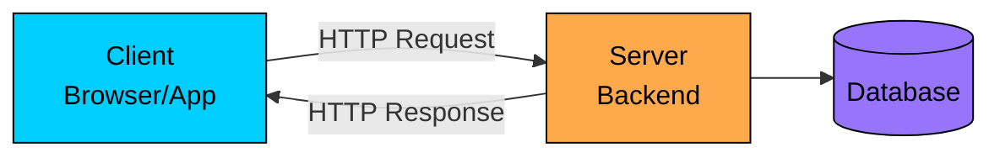


The client is any device that initiates a request: your browser, a mobile app, or even another server. The server listens for requests, processes them, and sends back responses. This separation is powerful because it lets you change the client (build a mobile app alongside the web app) without touching the server, and scale the server independently of clients.

But how does the client actually find the server on the internet?

---

#### 2. IP Address

Every device connected to the internet has a unique address, just like every house has a street address. That is an IP address. Without it, your request would have no idea where to go.


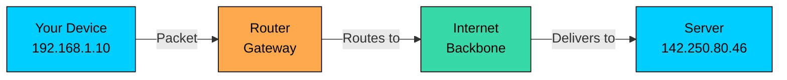


There are two versions: IPv4 (like 192.168.1.1) and IPv6 (like 2001:0db8:85a3::8a2e:0370:7334). IPv4 gives us about 4.3 billion addresses, which seemed like plenty until every smartphone, laptop, and smart fridge needed one. IPv6 solves this by offering a virtually unlimited number of addresses.

For system design, the key thing to know is that IP addresses identify machines on a network. When you talk about servers, load balancers, or database nodes, each one has an IP address that others use to reach it.

Of course, nobody wants to memorize IP addresses. So how does your browser know that "google.com" maps to 142.250.80.46?

---

#### 3. DNS (Domain Name System)

DNS is the phone book of the internet. You type "google.com" into your browser, and DNS translates that into an IP address your computer can actually route to. Without DNS, you would need to memorize the IP address of every website you visit.


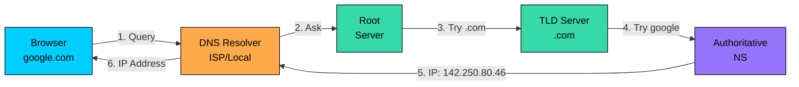


The resolution process involves multiple servers working together. Your browser first checks its local cache. If the answer is not there, it asks a DNS resolver (usually provided by your ISP). The resolver queries root servers, then top-level domain servers (.com, .org), and finally the authoritative name server for that specific domain. The result gets cached at every level so this chain does not repeat for every request.

DNS is also used for load balancing (returning different IPs for the same domain) and failover (pointing traffic to a backup server when the primary goes down).

Now that the client can find the server, your request doesn't always go directly to the server.

---

#### 4. Proxy vs Reverse Proxy

A proxy is a middleman that sits between clients and servers. But there are two types, and they serve very different purposes.


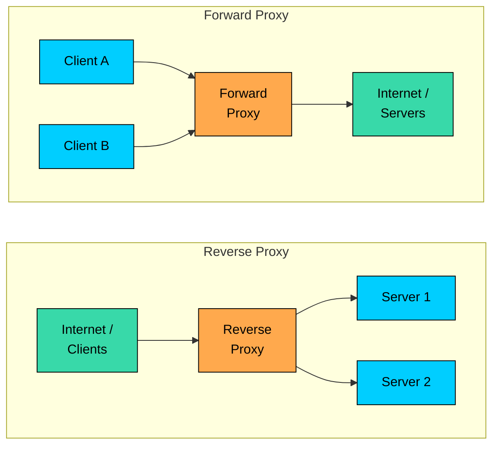


A **forward proxy** sits in front of clients. It hides the client's identity from the server. Think of a VPN or corporate proxy: the server sees the proxy's IP, not yours. Use cases include privacy, content filtering, and bypassing geo-restrictions.

A **reverse proxy** sits in front of servers. It hides the server's identity from the client. The client thinks it is talking to one server, but the reverse proxy could be routing requests to dozens of backend servers. Nginx and HAProxy are common examples. Reverse proxies handle SSL termination, caching, compression, and load balancing.

Whenever a client communicates with a server, there’s always some delay. One of the biggest causes of this delay is physical distance and that brings us to our next topic: **latency**.

---

#### 5. Latency

Latency is the time it takes for data to travel from point A to point B. It is measured in milliseconds and it directly impacts user experience. A 100ms delay is barely noticeable, but 1 second feels sluggish, and 3 seconds? Users start leaving.


Latency comes from multiple sources: network distance (speed of light in fiber), serialization (converting data to bytes), processing time on the server, and queuing delays when the server is busy. You cannot beat physics, so a request from Mumbai to New York will always take longer than Mumbai to a nearby server.

This is why system design solutions often include CDNs (serving content from nearby edge nodes), caching (avoiding round trips to the database), and regional deployments (placing servers closer to users). Reducing latency is one of the most common non-functional requirements in system design.

Now, when data actually travels between client and server, what language do they speak?

---

#### 6. HTTP / HTTPS

HTTP (Hypertext Transfer Protocol) is the language that clients and servers use to communicate on the web. It defines how requests are structured and how responses come back. HTTPS is the same thing, but encrypted with TLS so nobody can eavesdrop.


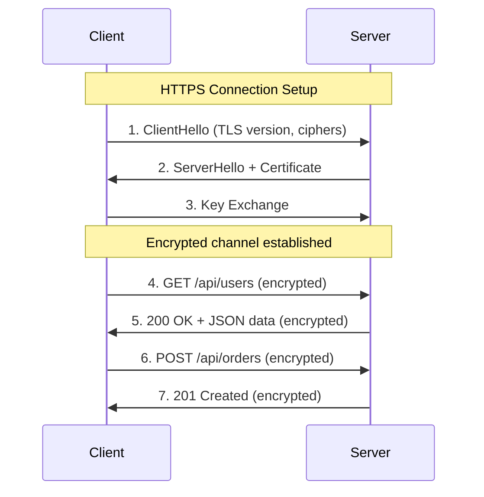


HTTP is stateless: each request is independent, and the server does not remember previous requests. This makes scaling easier (any server can handle any request) but means you need mechanisms like cookies, tokens, or sessions to maintain state across requests.

Key things to know for interviews: HTTP methods (GET, POST, PUT, DELETE), status codes (200 OK, 404 Not Found, 500 Server Error), and headers (for authentication, caching, content type). HTTPS adds a TLS handshake that takes an extra round trip but protects data in transit.

With networking covered, let's move up a layer. How do applications actually exchange data in a structured way?

---

## Group 2: APIs and Communication

Now that we know how machines connect, how do applications actually talk to each other? You need well-defined contracts, called APIs, that specify what data you can request and what format it comes back in. This group covers the major API styles and real-time communication patterns.

#### 7. APIs (Application Programming Interfaces)

An API is a contract between two pieces of software. It defines what you can ask for, how to ask for it, and what you will get back.


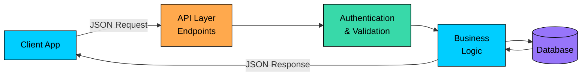


&gt; **Real-World Analogy**
&gt;
&gt; Think of an API like a restaurant menu. You do not go into the kitchen and cook. You look at the menu (API documentation), place an order (request), and get your food (response). The kitchen (server) handles the complexity behind the scenes.


Most modern APIs communicate using JSON over HTTP. The client sends a request to a specific URL (called an endpoint), the server processes it, and returns a response with a status code and data.

But, not all APIs are built the same. Different API styles exist to serve different needs. Two of the most popular ones are **REST** and **GraphQL**.

---

#### 8. REST API

REST (Representational State Transfer) is the most common API style on the web. It treats everything as a "resource" and uses standard HTTP methods to interact with those resources. It is simple, stateless, and works well for most applications.


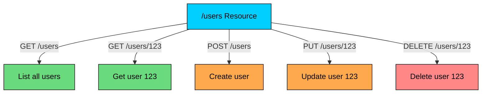


REST maps naturally to CRUD operations: Create (POST), Read (GET), Update (PUT/PATCH), and Delete (DELETE). Each resource gets its own URL, and the HTTP method tells the server what to do. For example, `GET /users/123` fetches user 123, while `DELETE /users/123` removes them.

**Key REST principles:**

- stateless (no session on the server)
- cacheable (responses can be cached)
- uniform interface (consistent URL patterns)

REST's simplicity is its biggest strength, but it has a drawback: if a client needs data from multiple resources, it has to make multiple requests.

What if the client could get exactly the data it needs in a single request?

---

#### 9. GraphQL

GraphQL, developed by Facebook, lets clients request exactly the data they need in one query. Instead of hitting multiple REST endpoints, you send a single query describing the shape of the data you want, and the server returns exactly that.


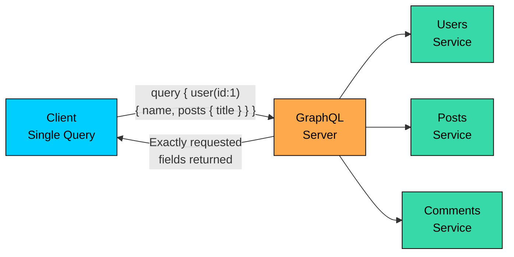


With REST, fetching a user's profile with their posts might require two separate requests: one to `/users/123` and another to `/users/123/posts`. With GraphQL, you describe both in a single query, and the server resolves them and returns a combined result.

The trade-off? GraphQL adds complexity on the server side (you need resolvers for each field), can make caching harder (since every query is different), and can lead to performance issues if clients request deeply nested data. 

For most system design problems, REST is the safer default, but mentioning GraphQL shows breadth of knowledge, especially for systems where clients need flexible data fetching (like social media feeds).

REST and GraphQL handle request-response patterns. But what about real-time communication where the server needs to push data to clients?

---

#### 10. WebSockets

HTTP is a one-way street: the client always initiates the request. But what about chat apps, live sports scores, or collaborative editors?

You need the server to push updates to the client instantly. That is where **WebSockets** come in.


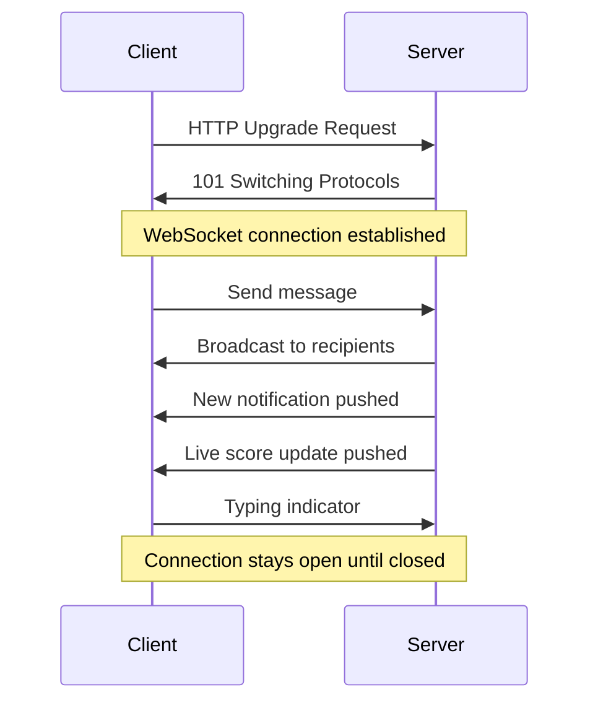


WebSockets start as a regular HTTP request, then "upgrade" to a persistent, bidirectional connection. Once established, both sides can send messages at any time without the overhead of creating new HTTP connections. This makes them perfect for real-time features.

The downside is that WebSocket connections are stateful, the server needs to keep track of every open connection, which makes scaling harder. If a server goes down, all its connections are lost. 

WebSockets enable real-time communication between a client and a server, but what if a server needs to notify another server (or client) when an event occurs?

Example:

- When a user makes a payment, Stripe needs to notify your application **instantly**.
- If someone pushes code to GitHub, a CI/CD system (e.g., Jenkins) should be triggered automatically.

This is where **Webhooks** come in.

---

#### 11. Webhooks

Webhooks flip the usual model around. Instead of the client repeatedly asking "has anything changed?" (polling), the server sends a notification to the client when something happens. The client registers a callback URL, and the server POSTs to that URL whenever the event occurs.


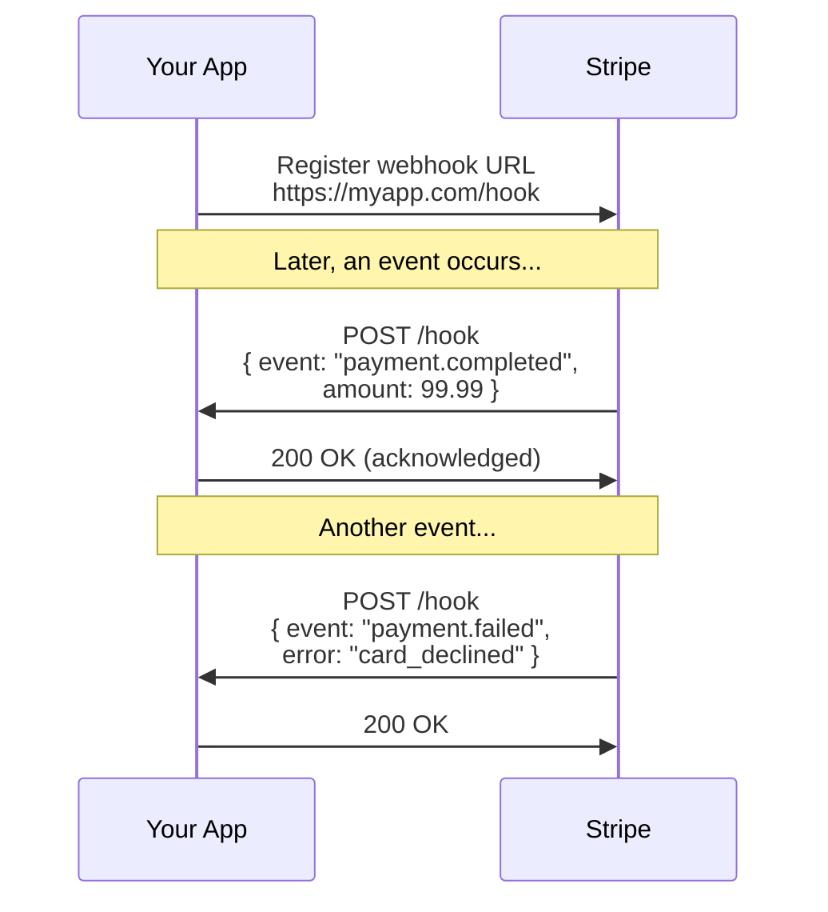


Webhooks are widely used for integrations: payment notifications (Stripe), code push events (GitHub), message delivery status (Twilio). The key challenge is reliability, what if your server is down when the webhook fires? Good webhook systems include retry logic, event logging, and idempotency handling.

In system design, use webhooks for asynchronous event notifications between services, especially when integrating with third-party platforms.

We have covered how data moves between applications. But where does all that data actually live?

---

## Group 3: Data Storage

APIs move data around, but where does that data actually live? Choosing the right storage strategy is one of the most important decisions in system design. This group covers database types, indexing, partitioning, caching, and more.

#### 12. Databases

A database is an organized collection of data that supports efficient storage, retrieval, and manipulation. But there is no single "best" database. Different data shapes and access patterns call for different types.


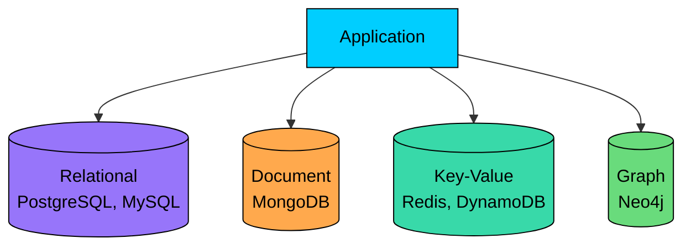


**Relational databases** (PostgreSQL, MySQL) store data in structured tables with defined relationships. Great for transactional data where consistency matters. 

**Document databases** (MongoDB) store data as flexible JSON-like documents. Good for varied or evolving schemas. 

**Key-value stores** (Redis, DynamoDB) are like hash maps, blazing fast for simple lookups by key. 

**Graph databases** (Neo4j) model relationships as first-class citizens, ideal for social networks or recommendation engines.

In system design, we choose database based on the data model, query patterns, and scalability requirements. There is no right answer without context.

The most common choice is between relational and non-relational databases. Let's dig deeper into that decision.

---

#### 13. SQL vs NoSQL

SQL databases enforce a strict schema and support ACID transactions. NoSQL databases trade some of that rigidity for flexibility and horizontal scalability.


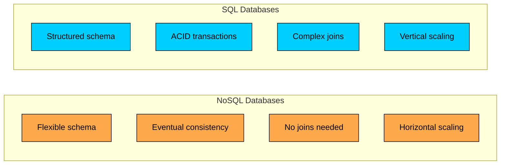


**Choose SQL when:** You need strong consistency (banking, inventory), complex queries with joins, well-defined schemas that rarely change, or ACID guarantees.

**Choose NoSQL when:** You need horizontal scalability, your schema evolves frequently, you are dealing with high write throughput, or your data is naturally unstructured (logs, social media posts).

The reality is that most production systems use both. An e-commerce platform might store orders in PostgreSQL (needs ACID) and product catalog in MongoDB (flexible schema, read-heavy). The key interview insight is explaining **why** you chose one over the other for a specific part of your system.

Once you have data in a database, how do you find it quickly?

---

#### 14. Database Indexing

Without an index, finding a row in a table means scanning every single row, one by one. That is fine for 100 rows. For 100 million rows? That is a disaster. 

An index is a data structure that makes lookups fast, like the index at the back of a textbook.

Most databases use B-tree indexes by default. A B-tree organizes data in a sorted, balanced tree structure that supports O(log n) lookups. When you create an index on the `email` column, the database builds a separate B-tree that maps email values to their row locations on disk.

The trade-off: indexes speed up reads but slow down writes (every INSERT or UPDATE must also update the index). They also consume storage space. You should index columns that appear in WHERE clauses and JOIN conditions, but avoid indexing everything.

Indexes help you find data faster, but what happens when a single database cannot hold all your data?

---

#### 15. Vertical Partitioning

When your database tables grow wide with dozens of columns, vertical partitioning splits them into narrower tables. Each partition holds a subset of columns, and they are joined by a shared key.


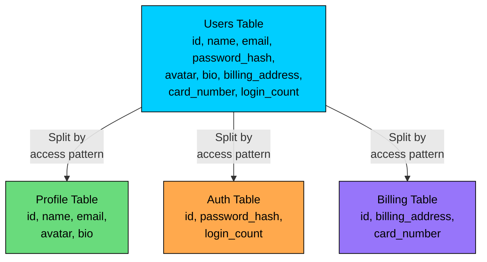


The idea is to separate data by access pattern. Your user profile page needs name and avatar, not the billing address. By splitting the table, each query touches only the columns it actually needs, which means fewer bytes read from disk and faster responses.

Vertical partitioning also improves security (billing data can have stricter access controls) and allows each partition to be optimized independently (different indexes, different storage engines). In interviews, mention it when you have a table with many columns that are accessed in different contexts.

Sometimes the problem is not wide tables but too many rows. And sometimes the solution is not better querying, but smarter storage. What if you stored pre-computed results?

---

#### 16. Caching

Caching stores frequently accessed data in a fast layer (usually memory) so you do not have to hit the database for every request. It is the single most effective technique for improving read performance.


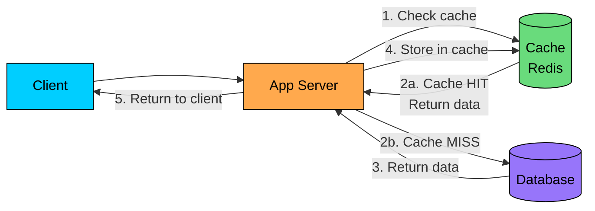


The pattern shown above is called **cache-aside** (or lazy loading). The application checks the cache first. On a hit, it returns immediately. On a miss, it fetches from the database, stores the result in the cache, and then returns it. Redis and Memcached are the most popular in-memory caches.

The hard part of caching is **invalidation**: when the underlying data changes, the cache needs to be updated or cleared. Common strategies include TTL (time-to-live, data expires automatically), write-through (update cache and database together), and write-behind (update cache first, database later).

Caching helps with read performance. But what about queries that need to join multiple tables?

---

#### 17. Denormalization

In normalized databases, data is split across many tables to avoid duplication. That is clean, but joining 5 tables to load a single page is slow. Denormalization deliberately adds redundant data to reduce the number of joins.


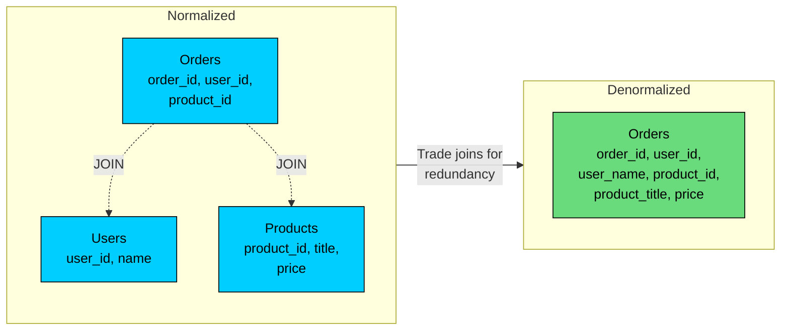


In the normalized version, displaying an order with the user's name and product title requires joining three tables. In the denormalized version, all the data is in one table, so a single read returns everything. The trade-off: you are storing `user_name` and `product_title` in the orders table, which means if a user changes their name, you need to update it in multiple places.

Denormalization is a read optimization. Use it when your system is read-heavy and those reads involve expensive joins. It is very common in NoSQL databases, where joins are not natively supported. In interviews, always pair denormalization with a strategy for keeping the redundant data consistent.

Databases handle structured data. But what about images, videos, and large files?

---

#### 18. Blob Storage

Not all data fits neatly into rows and columns. Images, videos, PDFs, backups, these are "binary large objects" (blobs) that need specialized storage. Blob storage systems like Amazon S3 are designed to store massive amounts of unstructured data cheaply and reliably.


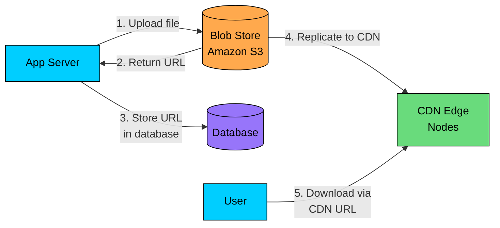


The pattern is simple: store the file in blob storage, get back a URL, and store that URL in your database. Your database stays lean (it holds a URL string, not a 10MB image), and the blob storage handles durability, replication, and serving.

Blob stores are optimized for large, immutable files. They offer high durability (S3 promises 99.999999999% durability, also known as 11 nines), cheap storage, and built-in CDN integration for fast delivery. In system design interviews, whenever you are dealing with media (images, videos, documents), always store them in blob storage and reference them by URL in your database.

We have covered where data lives and how to access it efficiently. But what happens when your system grows beyond what a single server can handle?

---

## Group 4: Scaling

Your app is growing. A single server can not handle the load anymore. What now? Scaling is about handling more traffic, more data, and more users without things falling apart. There are two fundamental approaches, and they are not mutually exclusive.

#### 19. Vertical Scaling (Scale Up)

The simplest way to handle more load: get a bigger machine. More CPU, more RAM, faster disks. That is vertical scaling. No code changes required.


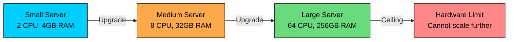


Vertical scaling is attractive because it is simple. Your application does not need to worry about distributing work across multiple machines. A single powerful server can handle a surprising amount of traffic, plenty for startups and small-to-medium applications.

The problem? There is a hard ceiling. You can not keep buying bigger machines forever. The largest cloud instances have limits, and they get disproportionately expensive. You also have a single point of failure: if that one big server goes down, everything goes down. That is why, beyond a certain point, you need a different approach.

---

#### 20. Horizontal Scaling (Scale Out)

Instead of making one server bigger, add more servers. Horizontal scaling distributes the load across multiple machines, and there is no theoretical upper limit to how many you can add.


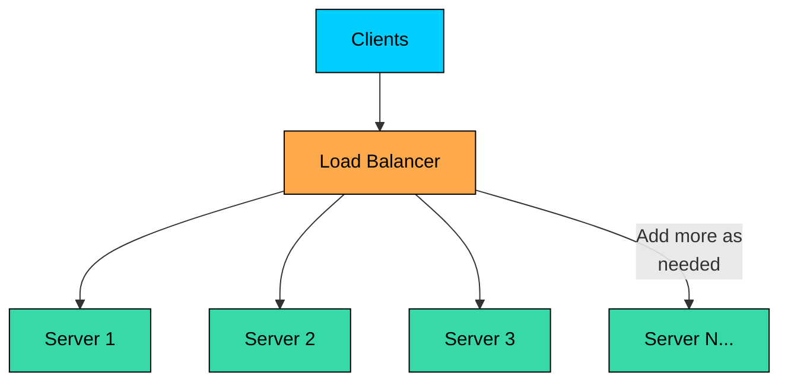


Horizontal scaling is how every large-scale system works. Google, Netflix, Amazon, they all run thousands of servers behind load balancers. Adding capacity is as simple as spinning up more instances.

The catch? Your application needs to be designed for it. Servers should be **stateless**, meaning any server can handle any request without relying on local state. Session data needs to live in a shared store (like Redis), not in server memory. You also need a load balancer to distribute traffic, and your database needs its own scaling strategy (replication, sharding). Horizontal scaling adds complexity, but it removes the ceiling.

But how do you decide which server handles each request? That is where load balancers come in.

---

#### 21. Load Balancers

A load balancer sits between clients and your server pool, distributing incoming requests so no single server gets overwhelmed. It is the traffic cop of your system.


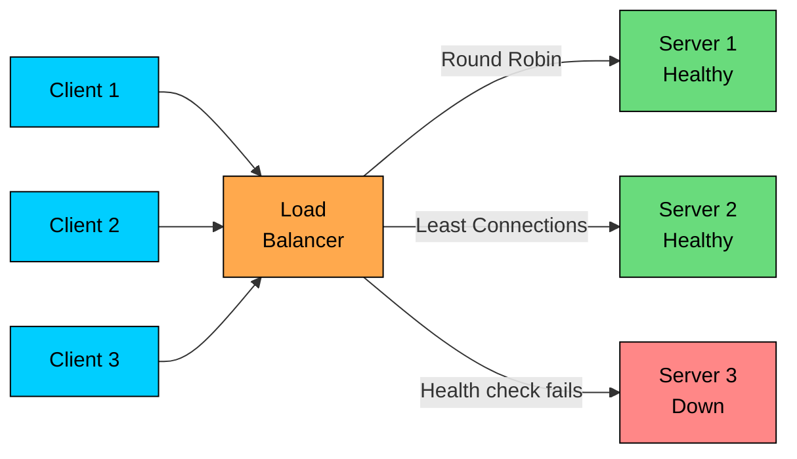


Common algorithms include **Round Robin** (requests go to servers in order), **Least Connections** (send to the server handling the fewest requests), and **Weighted** (servers with more capacity get more traffic). The load balancer also runs health checks: if a server stops responding, traffic is automatically routed to healthy servers.

Load balancers provide two critical benefits: **scalability** (distribute load across many servers) and **availability** (route around failures). In system design, you will always place a load balancer in front of your application servers. Some systems use multiple layers: one LB for web servers, another for application servers, another for databases.

Load balancers distribute work across application servers. But what about the database? How do you scale reads?

---

#### 22. Replication

Replication copies your data across multiple database servers. The most common setup is primary-replica: all writes go to the primary, and changes are replicated to one or more replicas that handle read queries.


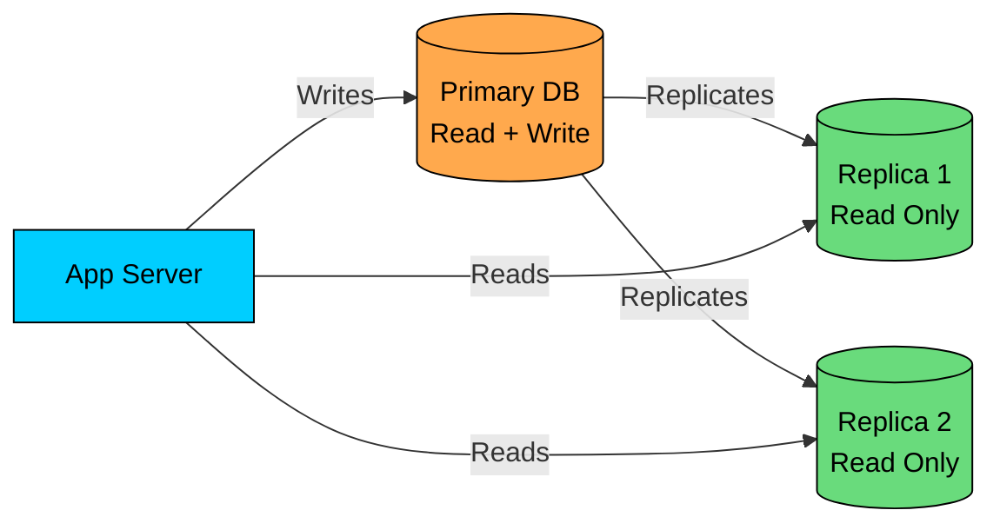


Most applications are read-heavy (think of how many times you scroll Twitter/X vs how many times you tweet). By directing reads to replicas, you offload the primary database and can handle many times more read traffic. If a replica fails, reads are redirected to other replicas. If the primary fails, a replica can be promoted to take over.

The trade-off is **replication lag**: there is a small delay between when data is written to the primary and when it appears on replicas. This means reads from replicas might return slightly stale data. For most applications this is fine (your tweet appearing half a second later on someone else's feed is acceptable), but for critical operations like account balance checks, you should read from the primary.

Replication handles read scaling. But what about write scaling, when a single primary cannot keep up with write volume?

---

#### 23. Sharding

Sharding splits your data across multiple database nodes, where each node holds a different subset of the data. Unlike replication (every node has all the data), sharding means each node has only a portion. This distributes both storage and write load.


```mermaid
flowchart TD
    APP[App Server]:::primary --> ROUTE[Shard Router<br/>shard_key % N]:::orange

    ROUTE -->|user_id 1-1M| DB1[(Shard 1)]:::secondary
    ROUTE -->|user_id 1M-2M| DB2[(Shard 2)]:::secondary
    ROUTE -->|user_id 2M-3M| DB3[(Shard 3)]:::secondary

    classDef primary fill:#00ceff,stroke:#000,color:#000
    classDef orange fill:#ffa94d,stroke:#000,color:#000
    classDef secondary fill:#38d9a9,stroke:#000,color:#000
```


The **shard key** determines which shard holds each piece of data. A common approach is hash-based sharding: compute a hash of the key (like user_id) and use modulo to pick a shard. Range-based sharding assigns consecutive key ranges to each shard. The choice of shard key is critical, a bad key creates "hot shards" where one node gets most of the traffic.

Sharding challenges include: cross-shard queries (joining data across shards is expensive), rebalancing (adding a new shard means redistributing data), and operational complexity. 

We have covered scaling individual components. But once you are running multiple servers and databases, a new set of challenges appears.

---

## Group 5: Distributed Systems

Once you have multiple servers, databases, and caches spread across a network, you enter the world of distributed systems. Things that are trivial on a single machine, like keeping data consistent, become genuinely hard when machines can fail independently and networks can partition.

#### 24. CAP Theorem

The CAP theorem states that a distributed system can only guarantee two out of three properties: **Consistency** (every read returns the latest write), **Availability** (every request gets a response), and **Partition Tolerance** (the system works even if network links between nodes fail).


```mermaid
flowchart TD
    CAP[CAP Theorem]:::primary
    CAP --> C[Consistency<br/>Latest data always]:::green
    CAP --> A[Availability<br/>Always responds]:::orange
    CAP --> P[Partition Tolerance<br/>Survives network splits]:::secondary

    C --- CP[CP Systems<br/>MongoDB, HBase,<br/>Redis Cluster]:::purple
    A --- AP[AP Systems<br/>Cassandra, DynamoDB,<br/>CouchDB]:::purple

    classDef primary fill:#00ceff,stroke:#000,color:#000
    classDef green fill:#69db7c,stroke:#000,color:#000
    classDef orange fill:#ffa94d,stroke:#000,color:#000
    classDef secondary fill:#38d9a9,stroke:#000,color:#000
    classDef purple fill:#9775fa,stroke:#000,color:#000
```


Since network partitions are unavoidable in distributed systems, the real choice is between **CP** (consistency + partition tolerance) and **AP** (availability + partition tolerance).

**CP systems** (like MongoDB, HBase) refuse to serve requests if they cannot guarantee the data is up-to-date. Better for banking, inventory, or anything where stale data causes real problems. **AP systems** (like Cassandra, DynamoDB) always respond, even if the data might be slightly stale. Better for social media feeds, product catalogs, or analytics where availability matters more than perfect accuracy.

Data consistency is one challenge of distributed systems. Another is delivering content fast to users around the world.

---

#### 25. CDN (Content Delivery Network)

A CDN is a network of servers distributed across the globe that caches and serves content from locations close to users. Instead of every request traveling to your origin server in Virginia, users get content from the nearest edge node.


```mermaid
flowchart LR
    ORIGIN[Origin Server<br/>Virginia]:::primary -->|Push content| E1[Edge Node<br/>London]:::orange
    ORIGIN -->|Push content| E2[Edge Node<br/>Singapore]:::orange
    ORIGIN -->|Push content| E3[Edge Node<br/>Mumbai]:::orange

    U1[User UK]:::secondary --> E1
    U2[User SEA]:::secondary --> E2
    U3[User India]:::secondary --> E3

    classDef primary fill:#00ceff,stroke:#000,color:#000
    classDef orange fill:#ffa94d,stroke:#000,color:#000
    classDef secondary fill:#38d9a9,stroke:#000,color:#000
```


CDNs primarily serve static content: images, CSS, JavaScript, videos. Some CDNs (like CloudFlare) also cache dynamic content or run serverless functions at the edge. The first user in a region gets a cache miss (request goes to origin), but subsequent users in that region get the cached copy, which is orders of magnitude faster.

Major CDN providers include CloudFront (AWS), Cloudflare, and Akamai. In system design interviews, always include a CDN when your system serves media or static assets. It reduces latency, decreases load on your origin server, and improves availability (even if your origin goes down, cached content can still be served).

CDNs handle content delivery. But what about ensuring that retried requests do not cause duplicate side effects?

---

#### 26. Idempotency

In distributed systems, requests can fail and be retried. A network timeout does not mean the request failed, maybe the server processed it but the response got lost. If the client retries, you could end up charging a customer twice or sending duplicate emails. Idempotency prevents this.


```mermaid
sequenceDiagram
    participant C as Client
    participant S as Server

    C->>S: POST /payments<br/>Idempotency-Key: abc-123<br/>amount: $50
    Note over S: Process payment, store key abc-123
    S->>C: 200 OK, payment_id: 789

    Note over C,S: Network issue, client retries...

    C->>S: POST /payments<br/>Idempotency-Key: abc-123<br/>amount: $50
    Note over S: Key abc-123 already seen,<br/>return stored result
    S->>C: 200 OK, payment_id: 789<br/>(same result, no duplicate charge)
```


An idempotent operation produces the same result regardless of how many times you execute it. GET and DELETE are naturally idempotent (getting a resource twice returns the same thing, deleting an already-deleted resource is a no-op). POST is not naturally idempotent, which is why you add an **idempotency key**: a unique identifier the client sends with each request. The server checks if it has already processed that key and returns the cached result instead of processing again.

Stripe, PayPal, and most payment APIs require idempotency keys for exactly this reason. In system design interviews, mention idempotency whenever you discuss payments, order creation, or any operation where duplicates would be harmful.

With all these building blocks, individual concepts, how do you actually organize a large-scale system?

---

## Group 6: Architecture Patterns

With all the building blocks in place, from networking to storage to scaling, the final question is: how do you actually organize all these pieces into a coherent system? Architecture patterns give you proven blueprints for structuring large applications.

#### 27. Microservices

As applications grow, a single codebase (monolith) becomes hard to maintain, deploy, and scale. Microservices split the application into small, independent services, each responsible for one business capability, each with its own database.


```mermaid
flowchart TD
    subgraph MICRO[Microservices]
        direction TB
        US[Users<br/>Service]:::primary --> UDB[(Users DB)]:::purple
        OS[Orders<br/>Service]:::orange --> ODB[(Orders DB)]:::purple
        PS[Payments<br/>Service]:::green --> PDB[(Payments DB)]:::purple
        IS[Inventory<br/>Service]:::secondary --> IDB[(Inventory DB)]:::purple
    end
	
    subgraph MONO[Monolith]
        direction TB
        M1[Users + Orders +<br/>Payments + Inventory<br/>Single Codebase]:::red
        M1 --> MDB[(Single DB)]:::red
    end	

    classDef primary fill:#00ceff,stroke:#000,color:#000
    classDef orange fill:#ffa94d,stroke:#000,color:#000
    classDef green fill:#69db7c,stroke:#000,color:#000
    classDef secondary fill:#38d9a9,stroke:#000,color:#000
    classDef purple fill:#9775fa,stroke:#000,color:#000
    classDef red fill:#ff8787,stroke:#000,color:#000
```


Each microservice can be developed, deployed, and scaled independently. The payments service handling more traffic? Scale just that service. A bug in inventory? Fix and deploy it without touching anything else. Different teams can own different services and even use different programming languages.

The downsides are real: distributed systems complexity (network calls instead of function calls), data consistency across services (no shared database means no easy joins), and operational overhead (monitoring, deploying, and debugging dozens of services). 

Speaking of async communication, how do services talk to each other without waiting?

---

#### 28. Message Queues

Synchronous communication (service A calls service B and waits for a response) creates tight coupling. If service B is slow or down, service A suffers too. Message queues decouple services by introducing an intermediary that stores messages until the consumer is ready to process them.


```mermaid
flowchart LR
    P[Producer<br/>Order Service]:::primary -->|1. Send message| Q[Message Queue<br/>Kafka / RabbitMQ / SQS]:::orange
    Q -->|2. Deliver when<br/>consumer ready| C1[Consumer<br/>Email Service]:::green
    Q -->|2. Deliver when<br/>consumer ready| C2[Consumer<br/>Inventory Service]:::green
    Q -->|2. Deliver when<br/>consumer ready| C3[Consumer<br/>Analytics Service]:::green

    classDef primary fill:#00ceff,stroke:#000,color:#000
    classDef orange fill:#ffa94d,stroke:#000,color:#000
    classDef green fill:#69db7c,stroke:#000,color:#000
```


When a user places an order, the Order Service does not need to wait for the email to be sent, inventory to be updated, and analytics to be recorded. It drops a message on the queue and moves on. Each downstream service picks up the message at its own pace. If the email service is down for a minute, the messages wait in the queue and get processed when it comes back.

Message queues provide: **decoupling** (services do not need to know about each other), **buffering** (handle traffic spikes by absorbing bursts), **reliability** (messages persist even if consumers crash), and **scalability** (add more consumers to process faster). Popular choices include Kafka (high throughput, event streaming), RabbitMQ (traditional message broker), and SQS (managed AWS service).

Services are decoupled now, but every external client still needs to know the address of every service. How do you simplify that?

---

#### 29. Rate Limiting

When your API is public, or even when it is internal, you need to protect it from being overwhelmed. Rate limiting controls how many requests a client can make within a time window. It prevents abuse, protects backend services, and ensures fair usage.


```mermaid
flowchart LR
    C[Client<br/>Request]:::primary --> RL{Rate Limiter<br/>Check Counter}:::orange
    RL -->|Under limit<br/>150/200 used| ALLOW[Allow<br/>Process Request]:::green
    RL -->|Over limit<br/>200/200 used| REJECT[Reject<br/>429 Too Many<br/>Requests]:::red
    ALLOW --> SERVER[Backend<br/>Server]:::secondary

    classDef primary fill:#00ceff,stroke:#000,color:#000
    classDef orange fill:#ffa94d,stroke:#000,color:#000
    classDef green fill:#69db7c,stroke:#000,color:#000
    classDef red fill:#ff8787,stroke:#000,color:#000
    classDef secondary fill:#38d9a9,stroke:#000,color:#000
```


Common algorithms include **Token Bucket** (tokens refill at a fixed rate; each request costs a token), **Sliding Window** (count requests in a rolling time window), and **Fixed Window** (count requests in discrete time intervals). The rate limiter typically sits at the API gateway level and uses a fast store like Redis to track request counts per client.

Rate limiting is essential for: preventing DDoS attacks, protecting expensive operations (like database queries), enforcing API usage tiers (free users get 100 req/min, paid users get 10,000), and ensuring one bad client does not ruin the experience for everyone else.

Rate limiting is one of many cross-cutting concerns. How do you manage all of them, authentication, routing, rate limiting, without duplicating logic across every service?

---

#### 30. API Gateway

An API gateway is a single entry point for all client requests. Instead of clients talking directly to dozens of microservices, they talk to the gateway, which handles routing, authentication, rate limiting, and other cross-cutting concerns.


```mermaid
flowchart TB
    C1[Web Client]:::primary --> GW[API Gateway<br/>Auth, Rate Limit,<br/>Route, Transform]:::orange
    C2[Mobile App]:::primary --> GW
    C3[3rd Party]:::primary --> GW

    GW --> S1[Users<br/>Service]:::secondary
    GW --> S2[Orders<br/>Service]:::secondary
    GW --> S3[Payments<br/>Service]:::secondary
    GW --> S4[Search<br/>Service]:::secondary

    classDef primary fill:#00ceff,stroke:#000,color:#000
    classDef orange fill:#ffa94d,stroke:#000,color:#000
    classDef secondary fill:#38d9a9,stroke:#000,color:#000
```


Without an API gateway, every service would need to implement authentication, rate limiting, and logging independently. The gateway centralizes these concerns. It also simplifies the client: instead of knowing the addresses of 20 services, the client knows one URL. The gateway routes each request to the right service based on the path.

Additional gateway capabilities include: request/response transformation (converting between protocols or data formats), response aggregation (combining results from multiple services into one response), caching, and circuit breaking (stopping requests to a failing service). Popular options include Kong, AWS API Gateway, and Nginx.

</section>
