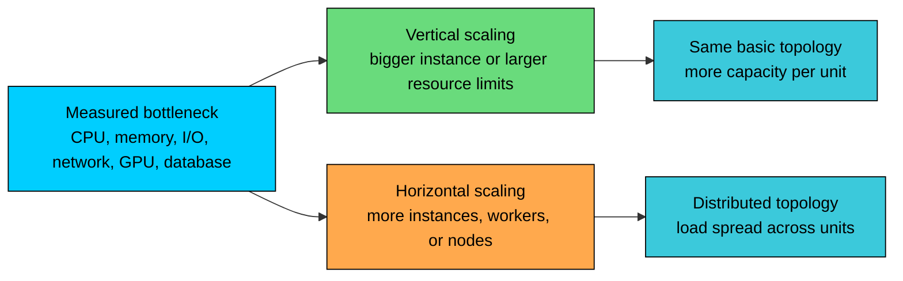
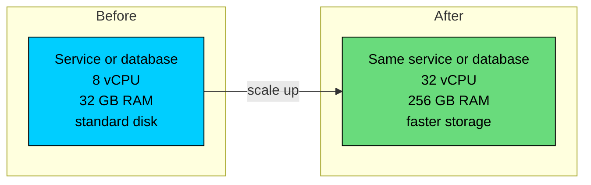
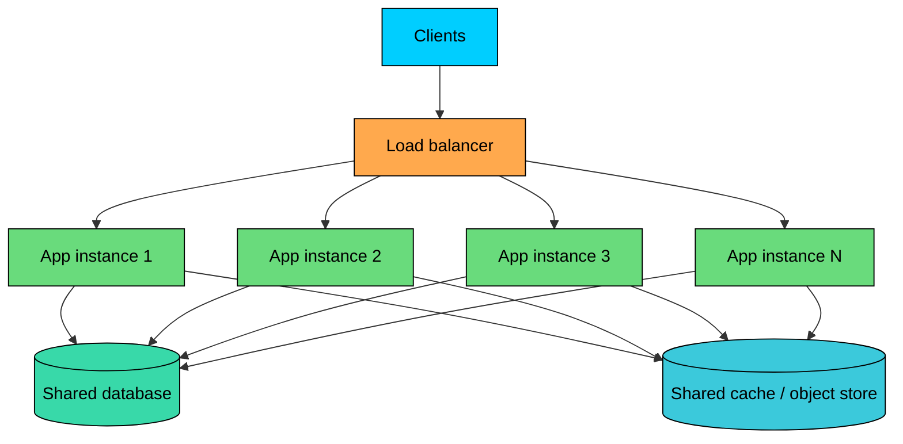
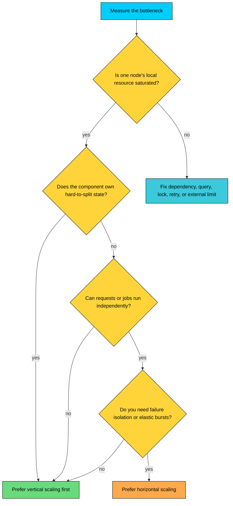
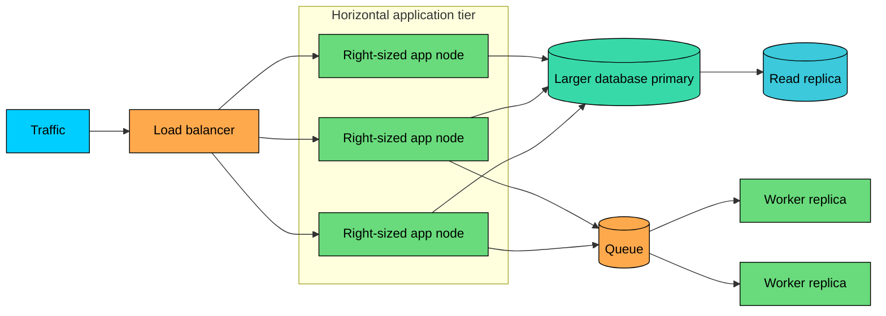

import React from 'react';
import CodeBlock from '../../../../components/ui/CodeBlock';
import Callout from '../../../../components/ui/Callout';

  

    <a href="/">Curated Notes</a>
    ›
    Vertical vs Horizontal Scaling
  

  <h1>Vertical vs Horizontal Scaling</h1>
  

    Master the essentials of Vertical vs Horizontal Scaling in this curated guide.
  

  

    
      <svg width="14" height="14" viewBox="0 0 24 24" fill="none" stroke="currentColor" strokeWidth="2"><circle cx="12" cy="12" r="10"/><polyline points="12 6 12 12 16 14"/></svg>
      10 min read
    
    Intermediate
  

<section className="content-section">

Scaling starts with a bottleneck: CPU, memory, disk I/O, network bandwidth, database locks, GPU memory, or some shared dependency that has become saturated. Once the bottleneck is identified, there are two ways to add capacity.

**Vertical scaling** makes an existing machine or runtime bigger. **Horizontal scaling** adds more machines, containers, processes, or nodes.

Neither is universally better. The right choice depends on where the load is, how much state the component owns, how quickly demand changes, and what failure mode the business can tolerate. Most production systems use both.

---

## 1. Vertical Scaling

Vertical scaling, or **scaling up**, means giving an existing unit more resources. That unit might be a physical server, a cloud VM, a database instance, a Kubernetes pod, a cache node, or a GPU worker.

The idea is the same in every case: keep the system shape mostly unchanged, but run it on a larger resource envelope.

Common examples include moving a database from 8 vCPU and 32 GB RAM to 32 vCPU and 256 GB RAM, or increasing memory so the hot working set fits in cache.

A write-heavy database might benefit from faster NVMe storage or higher provisioned IOPS, while a Kubernetes workload may need higher CPU and memory requests.

An inference service might move to a larger GPU instance because the model no longer fits comfortably in memory.

Vertical scaling is often the first practical move because it avoids redesigning the application.

#### Pros of Vertical Scaling

The biggest advantage is a simple operational model, since a larger node usually requires fewer application changes than splitting the workload across many nodes.

Data locality is another win, because memory, CPU, and local storage stay close together, which matters for databases, caches, search indexes, and in-memory analytics.

A single node also avoids distributed locks, cross-node joins, replica lag, and request routing complexity, so coordination overhead stays low.

When a service is genuinely CPU-bound or memory-bound, a larger machine can buy time quickly.

This is also why vertical scaling is often the natural fit for stateful systems: databases and stateful services are usually easier to scale up before they are scaled out.

#### Cons of Vertical Scaling

The first limit is a hard ceiling. Every platform has a largest practical instance size, and while the cloud makes large machines easier to rent, it does not remove physical limits.

Failure isolation is also poor, because if one large node owns the whole workload, that node remains a major failure domain.

Cost rises non-linearly as you move into very large machines, high-memory instances, provisioned I/O, and GPU instances.

Upgrades are rarely invisible either, since many vertical changes still require restarting a process, replacing a VM, evicting a pod, or failing over a database.

Finally, more hardware does not help every kind of bottleneck. More CPU does not fix a slow external API, a hot database row, a bad index, or a serialized code path.

Vertical scaling is not a beginner-only strategy. Many serious production systems run for years on vertically scaled databases or search clusters because the simpler design is more reliable than premature distribution.

---

## 2. Horizontal Scaling

Horizontal scaling, or **scaling out**, means adding more units and spreading work across them.

For an application tier, this usually means running more instances behind a load balancer. For workers, it means adding more consumers to a queue.

For storage, it may mean replicas, partitions, or shards. For AI systems, it may mean more model-serving replicas, more embedding workers, or more vector database nodes.

Horizontal scaling works best when each unit can handle work independently.

A stateless HTTP service is a clean example. Any instance can serve any request, and shared state lives outside the instance in a database, cache, object store, or token.

Add more instances and the load balancer has more places to send traffic.

Stateful systems are harder. If data is tied to a specific node, the system needs routing, replication, consensus, rebalancing, and recovery logic.

#### Pros of Horizontal Scaling

The headline benefit is a higher capacity ceiling. You can add nodes as demand grows, as long as the architecture and dependencies can absorb the extra traffic.

Availability also improves, because if one node fails, others can continue serving traffic.

Cloud platforms and orchestrators add elasticity on top of that, scaling capacity up or down based on load, queue depth, or custom metrics.

Smaller units also reduce the blast radius of a single machine failure, which gives better failure isolation. Geographic placement becomes possible too, since workloads can run closer to users or data when latency, compliance, or data residency requires it.

#### Cons of Horizontal Scaling

The cost is distributed systems complexity. You now have to handle partial failure, retries, timeouts, load balancing, deployment coordination, and observability across many nodes.

Shared dependencies become a new risk, because adding application servers can overload the database, cache, message broker, or downstream service.

Replication, sharding, and caching also introduce stale reads, conflicts, and operational edge cases, so data consistency gets harder.

Tail latency creeps in when a request fans out to several services, since the slowest dependency drags the rest.

New nodes are not instant either: they may need time to start, load models, fill caches, establish connections, or join clusters.

Horizontal scaling is powerful, but it is not free capacity.

If the database primary can handle 20,000 writes per second, adding 50 more web servers does not raise that limit. It may only make the database fail faster.

---

## 3. Scaling Depends on the Layer

Different components scale differently. A good design does not apply one rule everywhere.

Stateless API servers and background workers scale out cleanly, as long as sessions, files, and mutable state live outside the instance and workers stay idempotent.

Queue depth is a useful scaling signal for the worker tier.

Relational databases are a different story. Read replicas help reads, but writes usually require stronger techniques such as partitioning or sharding.

Caches sit in a similar middle ground, where replication and partitioning help, but hot keys can still overload one node.

Search indexes and vector databases both scale horizontally with trade-offs. Shards improve capacity for search, but they also make rebalancing, ranking, and query fan-out more complex.

Vector databases gain storage and query throughput from more nodes, while recall, indexing cost, and data placement become design concerns.

Model inference scales by replication for throughput, and large models may also need vertical scaling, batching, quantization, or model parallelism.

This is why "just scale horizontally" is incomplete advice. The web tier may scale out easily while the database, embedding pipeline, or GPU inference tier becomes the real constraint.

---

## 4. When to Choose Vertical vs Horizontal Scaling

Start with measurement. Look at utilization, saturation, latency percentiles, queue depth, error rates, database wait events, and cost per request. Scaling before measuring often hides the real issue.

#### Choose Vertical Scaling When

Vertical scaling is usually a good first move when the bottleneck is local to one node, meaning CPU, memory, disk I/O, network bandwidth, or GPU memory is saturated on that machine.

It also fits stateful workloads, since databases, caches, and search nodes often benefit from larger machines before they benefit from distribution.

When the traffic forecast does not justify sharding, multi-node coordination, or a larger operations surface, vertical scaling keeps things simple.

There are two more situations where scaling up wins. If the working set almost fits, more RAM can keep hot data in memory and avoid expensive disk reads.

If the code is difficult to distribute, as with legacy systems, monoliths, or tightly coupled services, a larger machine may be the only safe option until the architecture catches up.

For example, a PostgreSQL primary may be slow because the hot indexes no longer fit in memory. Moving to a larger instance can be the right next step while you optimize queries and plan longer-term partitioning.

#### Choose Horizontal Scaling When

Horizontal scaling is usually the better direction when availability matters across failures, since one node should not take down the whole service.

It is also a natural fit when traffic is bursty, because more replicas can absorb spikes, especially for stateless services and queue workers.

Workloads that are naturally parallel, with independent requests, jobs, tenants, files, embeddings, or messages, can be split across separate workers without much coordination.

Scaling out also becomes necessary when one machine is near its practical limit and the next larger machine is unavailable, too expensive, or still not enough.

Regional distribution is another driver, when users or data are spread across regions and latency or compliance requires local serving.

For example, an API service is CPU-bound during peak traffic, stores no local session state, and depends on a database that still has headroom. Adding more API replicas behind a load balancer is the natural move.

---

## 5. Combining Vertical and Horizontal Scaling

Most production systems combine both.

A horizontally scaled service still needs each node to be right-sized. A database shard may be a large machine.

A model-serving cluster may run several replicas, each on a GPU instance large enough to hold the model and serve batches efficiently.

A common combination is a bigger database paired with more application servers, where the stateless tier scales out while the database stays on a larger primary.

Read-heavy systems often add read replicas on top of vertical primary scaling, moving read traffic to replicas while writes stay on a stronger primary.

Sharded databases follow a similar mixed pattern: split data horizontally, but size each shard for its working set and write load.

The same logic applies to background work and AI workloads. Queue workers scale out for throughput, and each worker instance grows when individual jobs need more CPU, memory, or GPU capacity.

Inference systems add model-serving replicas for availability and throughput, then tune each replica for GPU memory, batch size, and latency targets, often paired with batching.

Autoscaling does not remove the need for design. Horizontal autoscaling can add replicas when metrics rise, and vertical autoscaling can adjust resource requests or recommend larger allocations.

Both still depend on good metrics, startup time, dependency capacity, and safe rollout behavior.

---

## 6. Practical Decision Framework

Use this order when deciding how to scale:

1. **Find the bottleneck.** Use metrics and traces, not guesses.
2. **Remove obvious waste.** Fix slow queries, missing indexes, unbounded retries, excessive payloads, and inefficient algorithms.
3. **Scale vertically when it buys simple headroom.** This is often the fastest safe move for stateful components.
4. **Scale horizontally when availability, elasticity, or total capacity requires it.** Make the service stateless or partition the state deliberately.
5. **Protect shared dependencies.** Add connection limits, backpressure, rate limits, queues, and load shedding where needed.
6. **Re-test under realistic load.** The bottleneck will move after every meaningful scaling change.

The best scaling strategy is the one that increases capacity without creating an operational burden the team cannot safely run.

Vertical scaling gives you simplicity and locality. Horizontal scaling gives you elasticity and fault tolerance. Mature systems use both, but they apply each one where it matches the actual workload.

</section>
