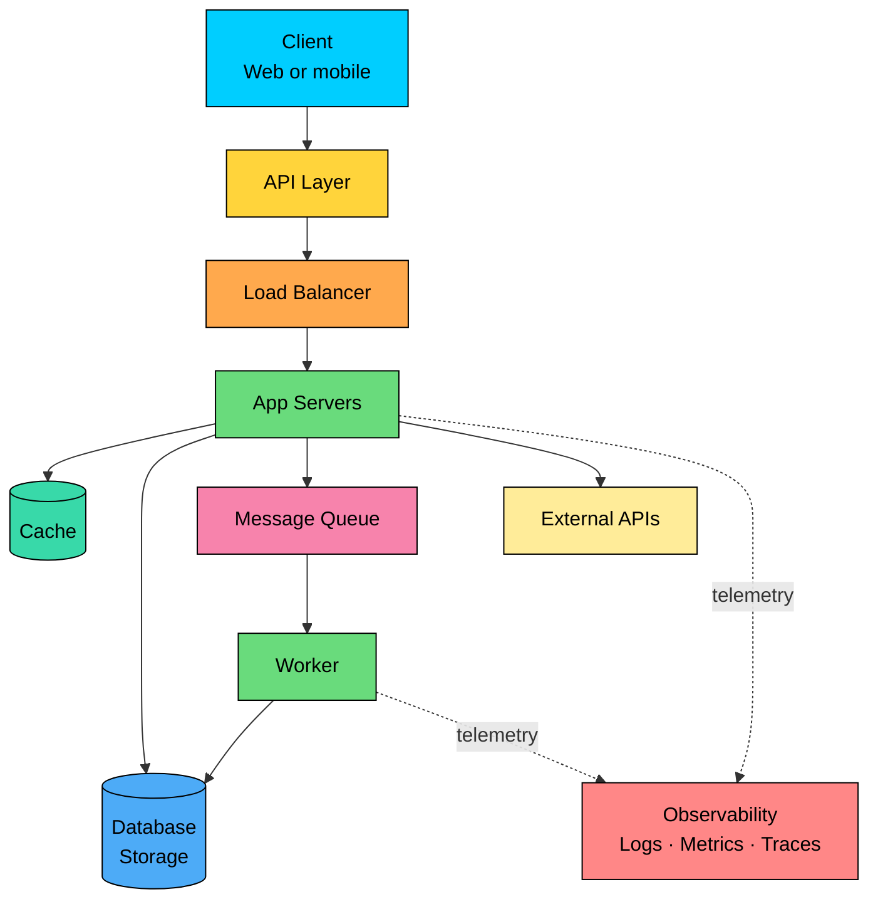
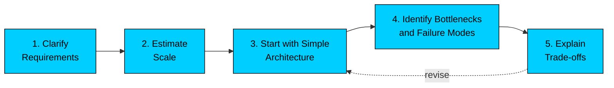

import React from 'react';
import CodeBlock from '../../../../components/ui/CodeBlock';
import Callout from '../../../../components/ui/Callout';

  

    <a href="/">Curated Notes</a>
    ›
    What is System Design?
  

  <h1>What is System Design?</h1>
  

    Master the essentials of What is System Design? in this curated guide.
  

  

    
      <svg width="14" height="14" viewBox="0 0 24 24" fill="none" stroke="currentColor" strokeWidth="2"><circle cx="12" cy="12" r="10"/><polyline points="12 6 12 12 16 14"/></svg>
      10 min read
    
    Intermediate
  

<section className="content-section">

System design is the process of deciding how a software system should be structured so it can meet its requirements at the expected scale.

It involves more than drawing boxes and arrows. Good system design explains what the system must do, how data moves through it, which components are responsible for which jobs, where it can fail or slow down, and what trade-offs the design is making.

In a small application, one server and one database may be enough. As traffic, data, users, and reliability expectations grow, the design usually needs more pieces: load balancers, caches, queues, replicas, partitions, monitoring, and failure handling.

The aim is the simplest architecture that satisfies the requirements.

---

## 1. The Core Idea

System design is about making trade-offs under constraints.

If users need very low latency, you may add caching or serve data from regions closer to them. If the system must stay available during failures, you may add redundancy and failover. And if writes are growing too fast for one database, you may partition the data.

There is rarely one perfect design. A good design is one where the choices match the problem.

&gt; **TIP**
&gt;
&gt; A common pitfall is starting from technologies: "Use Kafka, Redis, Kubernetes, and Cassandra."
&gt;
&gt; A better approach is to start from requirements: "We need to handle high write volume, absorb traffic spikes, and process events asynchronously. That points toward a queue or log-based system."

---

## 2. What System Design Covers

A system design discussion usually revolves around a few recurring questions:

1. **Requirements:** What should the system do, and what is explicitly out of scope?
2. **Scale:** How many users, requests, writes, reads, and how much data should it handle?
3. **Data:** What data is stored, where is it stored, and how is it accessed?
4. **APIs and communication:** How do clients and services talk to each other?
5. **Reliability:** What happens when a server, database, network link, or external service fails?
6. **Performance:** What latency and throughput targets matter most?
7. **Consistency:** Which operations must be strongly correct, and where is eventual consistency acceptable?
8. **Operations:** How will the system be monitored, debugged, deployed, and evolved?
9. **Cost:** Is the design reasonable for the expected business and traffic scale?

These questions shape the architecture more than any fixed template. The same product can have very different designs depending on its constraints.

For example, a chat app for a small internal team has different requirements than WhatsApp. A food delivery app in one city does not need the same multi-region strategy as a global marketplace.

---

## 3. Basic Building Blocks

A typical system is built from a small set of components. Not every system needs all of them, but each one solves a specific kind of problem.

- **Client:** The web app, mobile app, browser, or service that sends requests.
- **API layer:** The interface clients use to interact with the system.
- **Load balancer:** Distributes traffic across multiple servers.
- **Application servers:** Run business logic and coordinate reads, writes, and workflows.
- **Cache:** Stores frequently accessed data so the system can respond faster and reduce database load.
- **Database or storage:** Persists the system's durable data.
- **Message queue or event log:** Decouples producers and consumers, especially for asynchronous work.
- **External services:** Payment providers, email/SMS providers, identity systems, analytics tools, and other third-party dependencies.
- **Observability stack:** Logs, metrics, traces, alerts, and dashboards used to understand production behavior.

System design is less about listing these components and more about explaining how requests and data flow through them.

For example, when a user opens a feed, does the request hit a cache first? If the cache misses, which service queries the database? Is the feed computed on read, precomputed on write, or built using a hybrid approach? Those choices are the real design.

---

## 4. How to Approach a Design Problem

A good design usually starts simple and adds complexity only when the requirements justify it. The process usually moves through five steps, with the architecture being revised as new pressures appear.

#### Step 1: Clarify the Requirements

Before choosing an architecture, understand the problem.

Ask:

- What are the core features?
- Who are the users?
- What should we exclude?
- What scale are we designing for?
- Which operations need low latency?
- Which operations need strong correctness?
- What availability or durability expectations exist?

Requirements decide the architecture.

For example, "users can view a timeline" is not enough. A timeline with 10,000 daily users can be generated differently from a timeline with 500 million daily users and a 200 ms latency target.

#### Step 2: Estimate the Scale

Rough numbers help avoid designing the wrong system.

Estimate:

- Read and write requests per second
- Storage growth
- Bandwidth
- Peak traffic patterns
- Hot keys or uneven access patterns

The aim is not exact math but to identify design pressure. A system handling 100 writes per second and one handling 1 million writes per second will not have the same bottlenecks.

#### Step 3: Start With a Simple Architecture

Begin with the smallest design that can work:

- Client
- API layer
- Application service
- Database

Then add components only when there is a clear reason. A cache helps when repeated reads overload the database or latency is too high. A queue helps when work can happen asynchronously or when traffic spikes need buffering. Replicas help when read traffic grows or when availability needs the redundancy. Partitioning becomes necessary when a single machine can no longer hold or serve the data. Regional deployment makes sense when users are far away or availability requirements demand it.

Real systems evolve this way, one constraint at a time.

#### Step 4: Identify Bottlenecks and Failure Modes

Once the baseline design is clear, look for weak points. What happens if the database goes down, or if traffic suddenly increases 10x? What happens if the cache is empty, or a queue consumer falls behind, or a third-party API becomes slow or unavailable? Which data can be stale, and which data must be correct immediately?

A good design acknowledges these failures and explains how the system behaves when they occur.

#### Step 5: Explain Trade-offs

Every meaningful design choice has a cost.

Caching can reduce latency, but it introduces invalidation problems. Replication can improve availability and read throughput, but it creates consistency lag. Sharding can increase write capacity, but it makes queries and operations harder. Asynchronous processing can absorb spikes, but users may not see results immediately.

A useful design discussion covers both sides: why a choice helps and what new problem it creates.

---

## 5. System Design in Interviews vs Real Life

In real life, system design is an ongoing process. Teams design, build, measure, learn, and revise. Existing systems also come with constraints: legacy code, team ownership, budgets, migrations, compliance rules, and operational history.

Interviews compress this into a 45 to 60 minute conversation about an ambiguous problem. A useful answer in that format clarifies the scope before solving, picks an architecture that matches the requirements, reasons about scale and bottlenecks, handles failures and trade-offs, and communicates the design clearly.

The same fundamentals apply in both settings: understand the problem, start simple, identify pressure points, and justify the choices.

---

## 6. Conclusion

System design is the skill of turning requirements into an architecture that can handle real-world constraints: scale, latency, reliability, correctness, operations, and cost.

The rest of this course focuses on building design judgment. For every component, the questions are the same: why does it exist, what problem does it solve, and what trade-off does it introduce?

</section>
