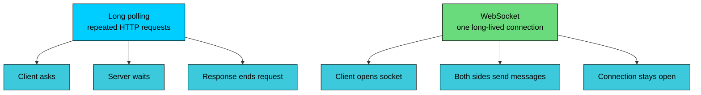
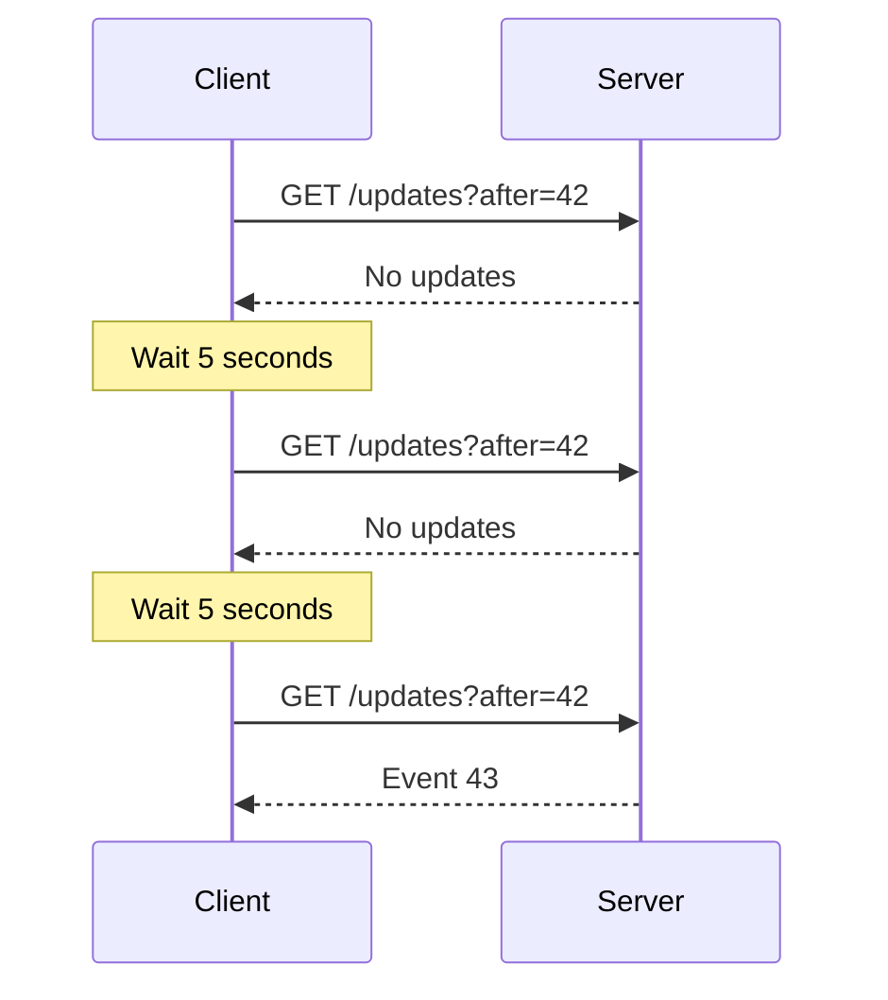
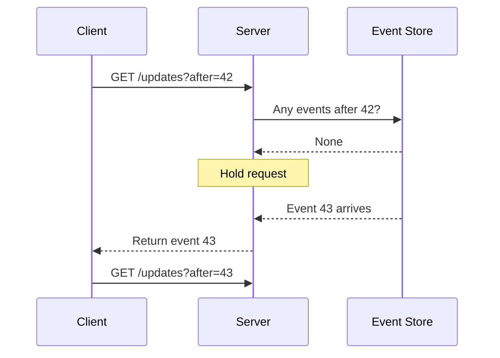
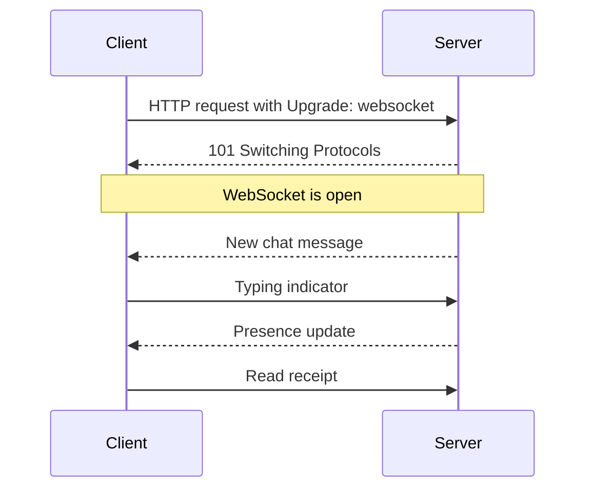
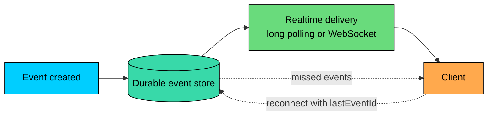

import React from 'react';
import CodeBlock from '../../../../components/ui/CodeBlock';
import Callout from '../../../../components/ui/Callout';

<div className="article-header">
  <div className="breadcrumb">
    <a href="/">Curated Notes</a>
    <span className="breadcrumb-separator">›</span>
    <span className="breadcrumb-current">Long Polling vs WebSockets</span>
  </div>
  <h1>Long Polling vs WebSockets</h1>
  <p style={{ color: 'var(--text-muted)', fontSize: '1.1rem', marginBottom: '16px', lineHeight: '1.6' }}>
    Master the essentials of Long Polling vs WebSockets in this curated guide.
  </p>
  <div className="meta-info">
    <span className="meta-item">
      <svg width="14" height="14" viewBox="0 0 24 24" fill="none" stroke="currentColor" strokeWidth="2"><circle cx="12" cy="12" r="10"/><polyline points="12 6 12 12 16 14"/></svg>
      10 min read
    </span>
    <span className="difficulty-badge difficulty-badge--intermediate">Intermediate</span>
  </div>
</div>

<section className="content-section">

Many products need to deliver updates without forcing the user to refresh: chat messages, build statuses, payment changes, cursor movements in a shared document, AI tokens streaming back from a model.

Traditional HTTP request-response fits this badly because the server has no way to send anything until the client asks.

**Long polling** keeps the HTTP model, but the server holds each request open until data is available or a timeout fires.

**WebSockets** upgrade an HTTP connection into a long-lived bidirectional channel where either side can send messages at any time.





Neither is universally better. Long polling is simpler and works almost anywhere HTTP works. WebSockets are better for frequent, bidirectional messages, but they require more operational discipline. Most production systems use both, sometimes in the same product.

---

## 1. The Problem With Short Polling

The simplest update strategy is short polling:

1. The client asks for updates every N seconds.
2. The server returns new data or an empty response.
3. The client waits and asks again.





Short polling is easy, but it forces a bad trade-off. Poll frequently and most requests return nothing. Poll slowly and users see stale data.

For example, 100,000 clients polling every 5 seconds creates about 20,000 requests per second even when there are no updates. That traffic still consumes CPU, network, logs, TLS and session handling, rate-limit checks, and database or cache reads.

Long polling and WebSockets reduce that waste in different ways.

---

## 2. Long Polling

Long polling is HTTP polling where the server waits before responding.

The client sends a request with a cursor such as `after=42`. The server checks for newer events. If events exist, it responds immediately. If not, it holds the request open until an event arrives or a timeout is reached.

After every response, the client sends the next request.





Long polling is not a permanent connection. It is a chain of HTTP requests where each request may wait before returning.

#### Long Polling Client Example


```javascript
let lastEventId = 0;

async function pollUpdates() {
  while (true) {
    try {
      const response = await fetch(`/updates?after=${lastEventId}`, {
        headers: { Accept: 'application/json' }
      });

      if (!response.ok) {
        throw new Error(`HTTP ${response.status}`);
      }

      const events = await response.json();

      for (const event of events) {
        handleEvent(event);
        lastEventId = event.id;
      }
    } catch (error) {
      await sleep(1000 + Math.random() * 1000);
    }
  }
}

function handleEvent(event) {
  console.log('event:', event);
}

function sleep(ms) {
  return new Promise(resolve => setTimeout(resolve, ms));
}

pollUpdates();
```


The cursor is critical. Without it, events can be lost during reconnect gaps, timeouts, mobile network changes, or page reloads.

#### Strengths of Long Polling

The biggest advantage is that long polling works over normal HTTP. It fits existing proxies, authentication, load balancers, and server frameworks without special configuration.

Client behavior stays simple too: send a request, process the response, repeat. That simplicity makes it a good choice for infrequent updates such as notifications, status changes, comments, and low-volume feeds.

It also makes a useful fallback when WebSockets are blocked or not worth the operational cost, and it avoids maintaining a permanent bidirectional channel when the client only needs server-to-client updates.

#### Trade-offs of Long Polling

The cost of that simplicity shows up under load. Each active client usually has one pending request, so the server holds many connections at once.

Every response is followed by a new request, which adds reconnect overhead. The slight gap between requests means a cursor and a durable event store are needed to avoid missing events.

Server resource pressure is the other concern. Thread-per-request servers suffer badly under many waiting requests, and timeout tuning becomes delicate because server, client, proxy, and load balancer timeouts must be aligned.

Long polling scales best on async or event-driven servers. Holding 100,000 requests open with one OS thread per request is a bad plan.

---

## 3. WebSockets

WebSockets provide a long-lived, bidirectional message channel between a client and a server.

The connection starts as HTTP. The client sends an upgrade request. If the server accepts, both sides switch to the WebSocket protocol and keep the connection open.





Once open, either side can send messages until the connection closes.

#### WebSocket Client Example


```javascript
const socket = new WebSocket('wss://api.example.com/realtime');

socket.addEventListener('open', () => {
  socket.send(JSON.stringify({ type: 'subscribe', roomId: 'room_123' }));
});

socket.addEventListener('message', event => {
  const message = JSON.parse(event.data);
  handleMessage(message);
});

socket.addEventListener('close', () => {
  scheduleReconnect();
});

function handleMessage(message) {
  console.log('message:', message);
}
```


Production clients also need authentication, heartbeat handling, reconnect with backoff, duplicate handling, and a way to catch up on missed messages after reconnect.

#### Strengths of WebSockets

Per-message overhead is low because messages do not need a full HTTP request and response each time. The connection is bidirectional, so client and server can send events independently. That keeps latency low when updates are frequent and interactive.

This fits session-like interactions naturally. Chat, collaboration, games, and live control planes all benefit from the same channel staying open. A single connection can also carry many small messages efficiently, which matters for high-frequency streams.

#### Trade-offs of WebSockets

The cost is operational. Servers must track connections, heartbeats, disconnects, and reconnects, which means the gateway layer becomes stateful: the system needs to know which users are connected to which nodes.

Load balancing is more involved because connections are sticky for their lifetime, and draining nodes during deploys requires care.

WebSockets also offer no built-in durability. They are a transport, not a message broker. If the client disconnects, messages can be missed unless you store and replay them.

Backpressure becomes a real concern too, since slow clients can fill buffers and consume memory. Infrastructure support is worth checking up front, because proxies, gateways, idle timeouts, and corporate networks can all affect WebSocket behavior.

WebSockets are powerful, but they move the system from stateless request handling toward stateful connection management.

---

## 4. Scaling Differences

Long polling and WebSockets both create server-side load, but the shape of the load is different.


| Concern | Long Polling | WebSockets |
|---------|--------------|------------|
| Connection lifetime | One pending HTTP request, then reconnect | One long-lived connection |
| Direction | Mostly server-to-client response after client request | Bidirectional |
| Message overhead | Higher per update | Lower per message |
| Idle client cost | Open waiting request | Open socket and heartbeat |
| Load balancing | Easier with normal HTTP requests | Connection sticks to a node while open |
| Missed messages | Use cursor and durable event store | Use replay/catch-up after reconnect |
| Best fit | Infrequent updates and compatibility | Frequent interactive updates |


At small scale, either can work. At large scale, the operational details dominate.

#### Long Polling at Scale

Long polling at scale needs async request handling so each waiting request does not tie up a thread. Reads must be cursor-based, backed by durable event storage, and the server has to clean up requests when clients disconnect.

Timeout values should sit below proxy idle timeouts to avoid silent drops, and retries should be jittered to avoid reconnect storms. Per-user or per-topic waiter limits help prevent one tenant from exhausting capacity.

The main risk is holding too many pending requests inefficiently.

#### WebSockets at Scale

WebSockets at scale need connection registries, heartbeats and idle timeouts, and reconnect plus resubscribe logic on the client. Message ordering and deduplication rules become important, as does backpressure handling for slow clients.

Deployments need node draining so live connections move off a node before it shuts down, and a broker or pub/sub layer is usually required to route messages to the node that owns each connection.

The main risk is treating a WebSocket gateway like a stateless HTTP fleet. It is not. It owns live connection state.

---

## 5. Reliability and Missed Messages

Neither long polling nor WebSockets automatically guarantee reliable delivery.

Clients disconnect. Mobile networks change. Browser tabs sleep. Servers deploy. Proxies close idle connections. Users open the same account on multiple devices.

Design a recovery path.





A few practices help. Give each event a stable ID, and store events before attempting realtime delivery. Let clients reconnect with `lastEventId` or an equivalent cursor so they can ask for anything they missed.

Make handlers idempotent and accept duplicate messages, since retries and reconnects will produce both. Use heartbeats to detect broken connections, and reconcile from the API when the client suspects it missed state.

For many systems, realtime delivery should be treated as a notification path, not the source of truth. The database, event log, or API remains authoritative.

---

## 6. Choosing Between Long Polling and WebSockets

Long polling is the right choice when updates are infrequent, such as notifications, job status, build status, and simple alerts. It also wins when you want HTTP simplicity and existing auth, proxies, and deployment tools already work.

If the client only receives updates and does not need full bidirectional interaction, long polling fits well.

Some environments handle normal HTTP more reliably than upgraded connections, so compatibility can tip the decision too. It also stays useful as a fallback when WebSockets fail or are blocked.

WebSockets become the better fit when messages are frequent: chat, multiplayer state, collaboration, trading screens, or live dashboards. They also matter when both sides send events, such as typing indicators, cursor movement, game input, or control commands.

Latency-sensitive applications benefit because repeated HTTP request overhead becomes noticeable. Session-oriented products fit naturally too, where users join rooms, subscribe to channels, or maintain presence.

The catch is operational: you should pick WebSockets only when you can run stateful connection infrastructure with heartbeats, routing, draining, backpressure, and replay as part of the design.

For one-way server updates in a browser, Server-Sent Events is worth a look. AI token streaming to a browser is usually handled by SSE or streaming HTTP, with WebSockets reserved for cases where the client also sends live events.

Durable event processing belongs in a queue, stream, or event log, not in a WebSocket alone.

---

## 7. Alternatives Worth Knowing

#### Server-Sent Events

Server-Sent Events, or SSE, lets a server stream events to a browser over HTTP.

SSE is one-way: server to client. That makes it simpler than WebSockets for feeds, notifications, progress updates, and AI token streaming where the browser only needs to receive incremental output.

#### Streaming HTTP

For some APIs, the server can send a response body incrementally using chunked transfer or streaming response APIs.

This is common for AI responses, exports, logs, and progress output. It keeps the request-response shape but avoids waiting for the full result before sending data.

#### MQTT

MQTT is a lightweight pub/sub protocol common in IoT and device messaging.

It is useful when devices need efficient messaging over unreliable networks, often with broker-managed topics and delivery quality options.

#### WebRTC and WebTransport

For media or low-latency peer communication, WebSockets are often the wrong tool.

Use WebRTC for audio, video, screen sharing, and peer-to-peer media. WebTransport can be useful for low-latency client-server streams in environments that support it, but it is a different operational model from WebSockets.

---

## 8. Practical Rule

Use long polling when you need simple near-real-time updates over ordinary HTTP.

Use WebSockets when you need frequent, low-latency, bidirectional messages and you are prepared to operate stateful connection infrastructure.

Use SSE or streaming HTTP when the server only needs to stream data to the browser.

And for all of them: store important events somewhere durable. A realtime connection is a delivery path, not a database.

</section>
