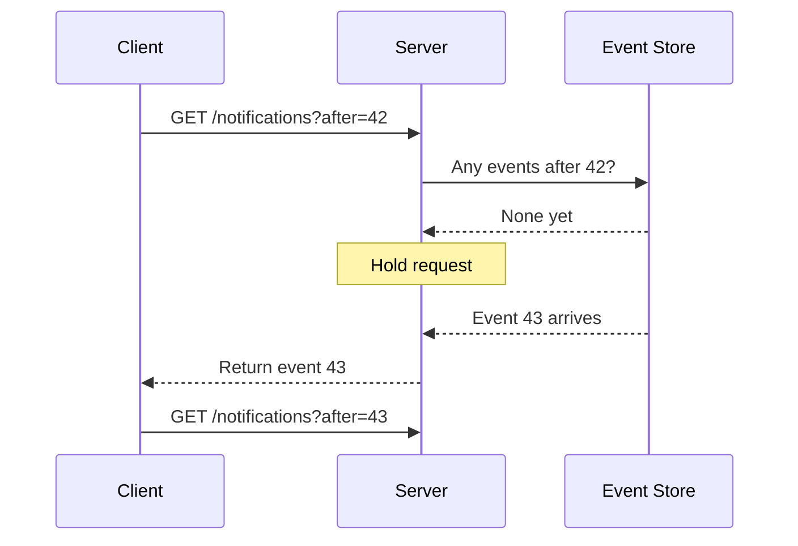
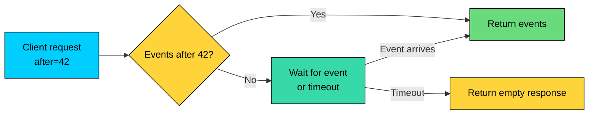
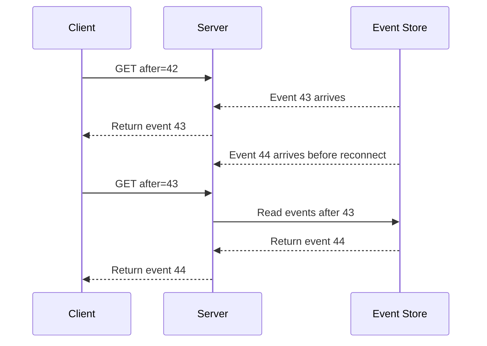
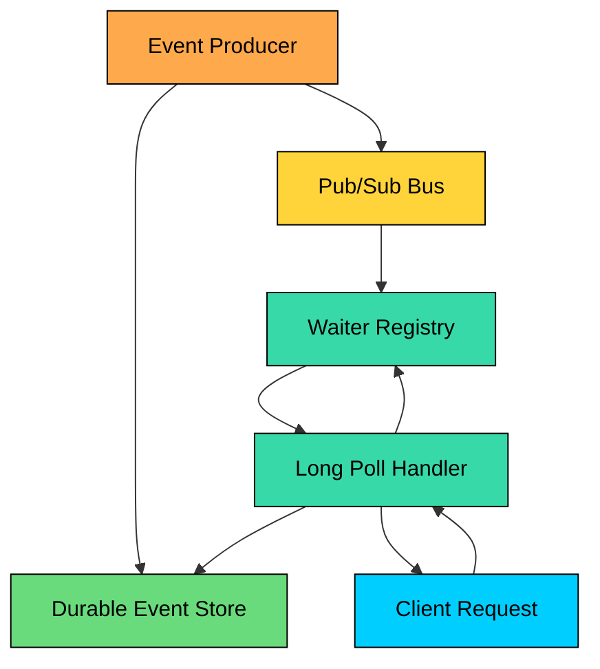

import React from 'react';
import CodeBlock from '../../../../components/ui/CodeBlock';
import Callout from '../../../../components/ui/Callout';

<div className="article-header">
  <div className="breadcrumb">
    <a href="/">Curated Notes</a>
    <span className="breadcrumb-separator">›</span>
    <span className="breadcrumb-current">Long Polling Explained</span>
  </div>
  <h1>Long Polling Explained</h1>
  <p style={{ color: 'var(--text-muted)', fontSize: '1.1rem', marginBottom: '16px', lineHeight: '1.6' }}>
    Master the essentials of Long Polling Explained in this curated guide.
  </p>
  <div className="meta-info">
    <span className="meta-item">
      <svg width="14" height="14" viewBox="0 0 24 24" fill="none" stroke="currentColor" strokeWidth="2"><circle cx="12" cy="12" r="10"/><polyline points="12 6 12 12 16 14"/></svg>
      10 min read
    </span>
    <span className="difficulty-badge difficulty-badge--intermediate">Intermediate</span>
  </div>
</div>

<section className="content-section">

Suppose you are building notifications and want users to see new messages soon after they arrive, but a WebSocket connection feels like more machinery than the product needs.

Short polling, asking the server every few seconds, forces a trade-off: poll often and most requests return nothing; poll slowly and updates feel delayed.

**Long polling** is a middle ground. The client sends a normal HTTP request, and the server holds it open until new data is available or a timeout fires. As soon as the client receives a response, it sends the next request.





This chapter covers how long polling works, how it differs from short polling, SSE, WebSockets, and WebRTC, how to design clients and servers without losing events, what operational issues appear at scale, and when long polling is the right tool.

---

## What Is Long Polling?

Long polling is a server-push technique built on normal HTTP requests.

The client sends a request such as:


```shell
GET /api/notifications?after=42 HTTP/1.1
Host: api.example.com
Accept: application/json
```


The `after` value tells the server the last event the client has processed.

If newer events already exist, the server responds immediately. Otherwise, it holds the request until an event arrives or a timeout fires. After every response, the client immediately asks again with the latest event ID it has seen.

This means long polling is not a single permanent connection. It is a chain of HTTP requests where each request may wait before returning.

---

## Long Polling vs Short Polling

Short polling checks on a fixed interval. Long polling waits for data.


| Metric | Short Polling | Long Polling |
|--------|---------------|--------------|
| Request pattern | Request every N seconds | Keep one pending request |
| Empty responses | Common | Still possible on timeout, but less frequent |
| Update latency | Up to the polling interval | Usually soon after data is available |
| Server work | Constant even when idle | Mostly tied to active clients and events |
| Complexity | Low | Moderate |


For example, 100,000 clients polling every 5 seconds creates about 20,000 requests per second even if no notifications exist. Long polling removes most of that waste, but it replaces it with many open requests. That is a different scaling problem, not a free optimization.

---

## Request Lifecycle

A long polling request has three phases.

#### 1. Check Existing Data

The server should first check durable storage for events newer than the client's cursor.

This step is important. Events may have arrived while the client was reconnecting, while a previous request timed out, or while the user was offline.

#### 2. Wait for New Data

If no data exists, the server waits. A production server should not spin in a loop. It should suspend the request and resume it when an event arrives from an event bus, database notification, queue, or in-process signal.





#### 3. Respond and Reconnect

The server responds with either new events or an empty response. The client updates its cursor and sends the next request.

Timeouts are normal. They prevent requests from being held forever and keep proxies, load balancers, and clients from treating the connection as stuck.

A typical hold timeout is somewhere around 20-60 seconds, but the right value depends on your infrastructure. Your proxy and load balancer idle timeouts should be longer than the server's long polling timeout.

---

## Avoiding Missed Events

The easiest mistake in long polling is to treat each request as the only source of truth.

There is always a gap between one response returning and the next request being sent.





The fix is simple: use a cursor.

Each event should have a stable, increasing ID or timestamp. The client includes the last processed ID in every request. The server always checks durable storage before waiting. This makes reconnect gaps safe.

For many systems, an increasing event ID is better than a timestamp. Timestamps can collide, move backward across machines, or produce awkward boundary bugs.

---

## A Basic Client

A long polling client needs to handle data, empty timeouts, errors, and cancellation.


```javascript
class LongPollingClient {
  constructor(endpoint) {
    this.endpoint = endpoint;
    this.lastEventId = 0;
    this.running = false;
  }

  async start() {
    this.running = true;

    while (this.running) {
      try {
        const response = await this.poll();

        for (const event of response.events) {
          this.handleEvent(event);
          this.lastEventId = event.id;
        }
      } catch (error) {
        console.log('poll failed:', error.message);
        await this.delayWithJitter();
      }
    }
  }

  async poll() {
    const url = `${this.endpoint}?after=${this.lastEventId}`;
    const controller = new AbortController();
    const timeout = setTimeout(() => controller.abort(), 35000);

    try {
      const response = await fetch(url, {
        signal: controller.signal,
        headers: { Accept: 'application/json' }
      });

      if (!response.ok) {
        throw new Error(`HTTP ${response.status}`);
      }

      return response.json();
    } finally {
      clearTimeout(timeout);
    }
  }

  handleEvent(event) {
    console.log('received:', event);
  }

  async delayWithJitter() {
    const delay = 1000 + Math.random() * 1000;
    return new Promise(resolve => setTimeout(resolve, delay));
  }

  stop() {
    this.running = false;
  }
}
```


Notice that the client timeout (35 seconds) is slightly longer than the expected server hold timeout (30 seconds). The client should always wait longer than the server. If the abort fired before the server's hold expired, clients would cancel healthy requests before getting a chance to respond.

---

## Server Design

The server should not dedicate one operating system thread per waiting request. At high concurrency, that model wastes memory and hits thread or file descriptor limits.

Use an async or event-driven server model. Good fits include Node.js with async handlers, Go with lightweight goroutines, async Python frameworks, Java or Kotlin reactive servers (or virtual threads on the JVM), and Nginx/OpenResty-style infrastructure.

At a high level, the server flow looks like this:

1. Authenticate and authorize the request.
2. Read events after the client's cursor.
3. If events exist, return them immediately.
4. If not, register the request as waiting for that user or topic.
5. Complete the request when an event arrives or the timeout fires.
6. Clean up waiters when the client disconnects.





The durable event store and the pub/sub bus serve different purposes. The event store prevents missed events during reconnects, while the pub/sub bus wakes up waiting requests quickly.

Do not rely only on pub/sub for correctness. Pub/sub messages are often transient. If a server misses one, the next request must still be able to recover from storage.

---

## Operational Challenges

Long polling is simple at the protocol level, but production systems still need careful limits.

#### Connection Capacity

Every active client can hold one request open. That means you need enough file descriptors, memory, and load balancer capacity for many concurrent open requests.

Thread-per-request servers can struggle here because idle long polls still occupy threads. Async servers are usually a better fit.

#### Proxy and Load Balancer Timeouts

Proxies often have default idle timeouts. If your server holds a request for 30 seconds but a proxy closes idle connections after 15 seconds, clients will see unnecessary failures.

Configure the proxy to outlast the server hold:


```shell
## Example Nginx settings for a 30 second long poll
location /api/notifications {
    proxy_pass http://backend;
    proxy_http_version 1.1;
    proxy_set_header Connection "";

    proxy_read_timeout 40s;
    send_timeout 40s;
}
```


#### Reconnect Storms

If a deployment, proxy restart, or network incident drops many clients at once, they may all reconnect together.

Use jitter and backoff after errors. For normal empty timeout responses, reconnect immediately. For failures, spread clients out.

#### Duplicate Delivery

Long polling should usually be at-least-once. A client may receive an event, process it, and then fail before saving the cursor locally.

Design event handlers to be idempotent. If the client sees the same event ID twice, it should ignore the duplicate.

#### Backpressure

If a client falls far behind, returning thousands of events in one response can create large payloads and slow processing.

Use page limits: return up to `N` events per response, include the newest cursor in the response, and let the client immediately request the next page. For state-like updates where old values are no longer useful, consider compaction so the client does not waste cycles replaying intermediate states.

---

## Long Polling vs Other Options

Long polling sits between simple polling and persistent transports.


| Technique | Direction | Best For | Trade-Off |
|-----------|-----------|----------|-----------|
| Short polling | Client asks repeatedly | Rare updates where delay is acceptable | Wasted requests or higher latency |
| Long polling | Server holds one request | Infrequent server-to-client updates over HTTP | Open request per client |
| Server-Sent Events | Server to client | Continuous one-way event streams | One-way only; HTTP/1.1 caps browsers at 6 connections per origin |
| WebSockets | Client and server | Bidirectional low-latency messages | Stateful connections; non-HTTP framing complicates proxies, caching, and load balancing |
| WebRTC | Peer/media transport | Audio, video, screen sharing, peer data | More complex NAT and media stack |


Use long polling when:

- Updates are server-to-client
- Update frequency is low or moderate
- You want to stay close to normal HTTP infrastructure
- WebSockets are unnecessary or not reliably available
- You can tolerate reconnects after every response

Choose something else when:

- The client sends frequent messages: use WebSockets.
- The server sends a continuous stream: consider SSE.
- The product needs audio, video, or peer-to-peer data channels: use WebRTC.
- Freshness is not important: use short polling or normal HTTP.

---

## Security

Long polling uses normal HTTP, so standard API security still applies. Authenticate every request and authorize the user for the requested topic, room, or resource. Use HTTPS and apply rate limits. Validate query parameters and cursors, and avoid leaking whether another user's events exist.

Long polling can increase request duration, so also think about resource abuse. An attacker who opens many long polls can consume connection slots even without sending much traffic. Use per-user and per-IP limits, and cap the number of open long polls per authenticated user.

---

## Metrics to Track

Useful production metrics include:

- Active long polling requests
- Request duration distribution
- Timeout response rate
- Event response rate
- Error and disconnect rate
- Reconnect rate
- Events returned per response
- Cursor lag per client or topic
- Open waiters per server
- Proxy and load balancer timeout errors

These metrics tell you whether the system is healthy, whether clients are falling behind, and whether infrastructure timeouts are fighting your application timeouts.

---

## Summary

Long polling is a practical way to deliver near-real-time server updates without a persistent bidirectional protocol.

The main ideas to remember:

1. **The server waits before responding.** If no data exists, it holds the request until data arrives or a timeout fires.
2. **The client immediately reconnects.** Each response is followed by another request with the latest cursor.
3. **Cursors prevent missed events.** Always check durable storage before waiting.
4. **Timeouts are normal.** Empty responses keep the request lifecycle healthy.
5. **Async servers scale better.** Many open requests are easier to handle with event-driven infrastructure.
6. **Use it for moderate server-to-client updates.** For bidirectional messaging, use WebSockets. For media or peer-to-peer data, use WebRTC.

Long polling is useful because it gives you timely updates while staying inside plain HTTP. For many systems, that is exactly the right trade-off.

---

## Quiz

</section>
