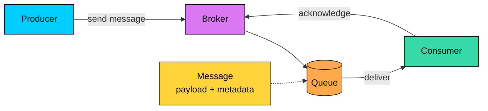
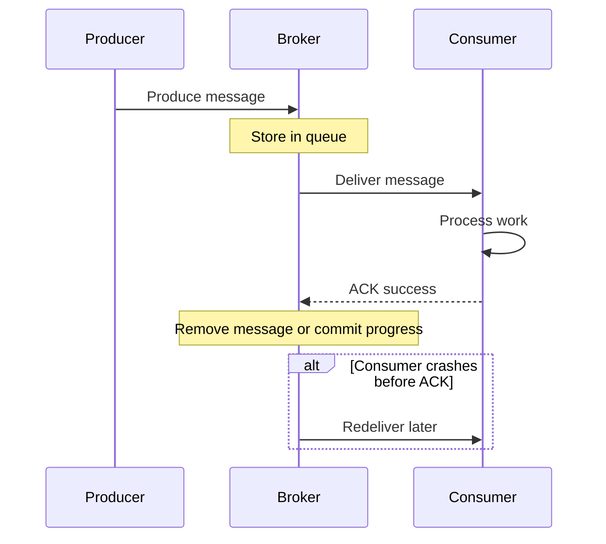
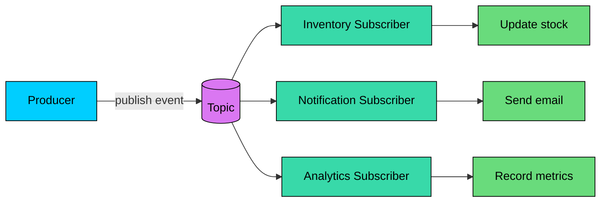
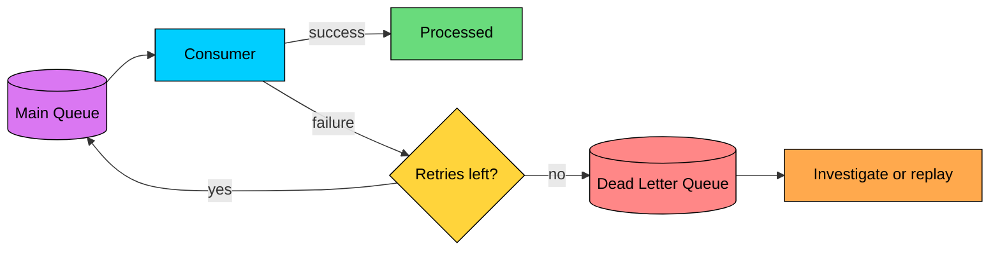

import React from 'react';
import CodeBlock from '../../../../components/ui/CodeBlock';
import Callout from '../../../../components/ui/Callout';

  

    <a href="/">Curated Notes</a>
    ›
    Message Queues
  

  <h1>Message Queues</h1>
  

    Master the essentials of Message Queues in this curated guide.
  

  

    
      <svg width="14" height="14" viewBox="0 0 24 24" fill="none" stroke="currentColor" strokeWidth="2"><circle cx="12" cy="12" r="10"/><polyline points="12 6 12 12 16 14"/></svg>
      10 min read
    
    Intermediate
  

<section className="content-section">

A **message queue** lets one part of a system send work to another part without waiting for that work to finish immediately.

Instead of calling another service directly, a producer writes a message to a queue. Later, one or more consumers read the message and process it.

This is useful when work can happen asynchronously, such as sending an email after signup, resizing an uploaded image, processing a payment event, updating a search index, fanning out a notification, or smoothing out a traffic spike.

The queue acts as a buffer between producers and consumers. It gives the system room to absorb bursts, retry failures, and scale workers independently.

But a queue is not just a performance trick. It changes the shape of the system. Once you introduce a queue, you also introduce delayed processing, retries, duplicates, ordering questions, and operational responsibility for backlogs.

---

## Core Components of a Message Queue

#### Producer

The producer creates messages and sends them to the queue. A producer should not need to know which consumer will process the message or whether that consumer is currently running.

Examples: API server, checkout service, upload service, scheduled job.

#### Consumer

The consumer reads messages and performs the work. Many consumers can process messages from the same queue in parallel.

Examples: email worker, payment worker, image processor, analytics pipeline.

#### Message

A message is the unit of work sent through the queue. It usually contains a **payload** with the business data, such as `orderId`, `userId`, or event details, and **metadata** like message ID, timestamp, headers, trace ID, priority, or retry count.

Messages should be small, explicit, and versioned. Large blobs usually belong in object storage, with the queue carrying a reference.

#### Queue

The queue stores messages until consumers can process them. Depending on the system, the queue may preserve order, support priorities, retain messages after consumption, or delete messages once they are acknowledged.

#### Broker

The broker is the system that owns queue storage and delivery. It accepts messages from producers, stores them, delivers them to consumers, tracks acknowledgments, and applies policies such as retries, retention, and dead lettering.

Examples include RabbitMQ, Amazon SQS, Google Cloud Pub/Sub, Azure Service Bus, and Redis Streams. Kafka is a distributed event log that is often used for queue-like workloads, but its model is different from a traditional broker.

---

## How Message Queues Work

The basic flow looks like this:

1. **Produce**: A service creates a message.
2. **Enqueue**: The broker stores the message.
3. **Deliver**: A consumer receives the message.
4. **Process**: The consumer performs the work.
5. **Acknowledge**: The consumer tells the broker the work succeeded.
6. **Remove or commit**: The broker deletes the message or records the consumer's progress.

Acknowledgment is the key reliability mechanism. If the consumer crashes before acknowledging the message, the broker can deliver it again.

That retry behavior is useful, but it means consumers must assume duplicate delivery can happen.

---

## Common Queue Patterns

Message systems support several patterns. The names vary by product, but the design ideas are common.

#### Work Queue

A work queue distributes tasks across a pool of consumers. Each message is normally processed by one consumer.

Use it when many workers can perform the same job, such as sending emails, generating reports, processing uploads, or running other background jobs.

Adding more consumers increases throughput until some other bottleneck appears, such as the database, an external API, or a rate limit.

#### Publish/Subscribe

In publish/subscribe, a producer publishes an event to a topic. Multiple independent subscribers can receive the event.

Use it when several parts of the system need to react to the same fact. An `OrderPlaced` event might update inventory, analytics, notifications, and fraud checks. A `UserCreated` event might trigger an onboarding email, CRM sync, and audit logging. A `PaymentCaptured` event might update billing, shipment, and customer history.

Pub/sub is good for event-driven systems because the producer does not need to know every downstream consumer.

#### Priority Queue

A priority queue processes higher-priority messages before lower-priority messages. Use it when some work should jump ahead, such as password reset emails before marketing emails, paid customer exports before free-tier exports, or fraud alerts before routine analytics tasks.

Priority can make lower-priority work wait longer, so it should be used carefully.

#### Delayed or Scheduled Queue

A delayed queue makes a message visible only after a delay or at a scheduled time. Common uses include retrying after a backoff period, running trial expiration checks, sending reminder emails, and handling timeouts.

Not every broker supports this directly. Some systems implement it with scheduled jobs, delay topics, or separate retry queues.

#### Dead Letter Queue

A dead letter queue stores messages that could not be processed after the normal retry policy. It keeps bad messages from blocking the main queue and gives engineers a place to investigate failures.

---

## Why Use Message Queues?

Message queues are useful when the producer and consumer should not be tightly coupled in time, capacity, or availability.

#### Decoupling

The producer does not need to know which consumer handles the work. This makes it easier to change, scale, or temporarily restart consumers without changing producer code.

Decoupling does not remove the contract between systems. The message schema becomes the contract.

#### Asynchronous Processing

The user-facing path can finish quickly while slower work runs in the background.

For example, an upload API can store the original file, enqueue an image-processing job, and return immediately. Workers can generate thumbnails after the request has completed.

#### Load Leveling

Queues absorb bursts. If 100,000 jobs arrive in one minute but workers can process only 10,000 per minute, the queue lets the system catch up gradually instead of failing immediately.

This is useful only when delayed processing is acceptable. If users need a response right now, a queue does not remove that requirement.

#### Reliability Through Retry

If a worker crashes or a dependency times out, the message can be retried. This is one of the main reasons queues are used for important background work.

Retries must be bounded and observable. Infinite retries can turn one bad message into a permanent capacity drain.

#### Independent Scaling

Producers and consumers can scale separately. If image uploads spike, add more image workers. If email volume drops, run fewer email workers.

The real scaling limit may still be downstream. More workers will not help if all of them are waiting on the same database lock or third-party rate limit.

---

## When to Use Message Queues

Use a message queue when asynchronous processing is acceptable and the system benefits from buffering, retry, or independent scaling.

Good fits include:

- **Background jobs**: Email, image processing, report generation, video transcoding
- **Event-driven workflows**: Several services reacting to the same business event
- **Traffic spikes**: Buffering bursts that workers can process later
- **Unreliable dependencies**: Retrying work when downstream services recover
- **Cross-service communication**: Reducing direct runtime dependency between services

Avoid adding a queue when:

- The caller needs an immediate answer
- The workflow requires strict synchronous validation
- The team has no plan to monitor backlogs
- Ordering must be exact across many unrelated entities
- A simple direct call would be easier and reliable enough

A queue can improve resilience, but it can also hide failure. A request may appear successful because the message was accepted, while the actual work fails minutes later. The product must be designed for that delay.

---

## Trade-offs and Failure Modes

Message queues solve real problems, but they introduce new ones.

#### Duplicate Processing

Most production systems should assume **at-least-once delivery**. A message may be delivered more than once if a consumer crashes after doing the work but before acknowledging it.

Consumers should be idempotent. Processing the same message twice should not charge a customer twice, send duplicate refunds, or corrupt state.

#### Ordering Is Limited

Ordering is usually guaranteed only within a narrow boundary, such as a single queue, partition, message group, or key.

If strict ordering matters, partition messages by the entity that must stay ordered, such as `orderId` or `accountId`. Global ordering rarely scales well.

#### Backlogs Can Become Incidents

A growing queue means consumers are falling behind. That may be fine for a short spike, but it becomes a production issue when messages age beyond the business deadline.

Queue depth alone is not enough. Track the age of the oldest message and consumer lag.

#### Retries Can Amplify Failures

If a downstream service is unhealthy, thousands of workers retrying aggressively can make recovery harder.

Use exponential backoff, jitter, rate limits, and circuit breakers where appropriate.

#### Message Contracts Need Discipline

Once other services consume your messages, changing the schema becomes a compatibility problem.

Use versioned schemas, additive changes, and clear ownership. Do not remove or rename fields without a migration plan.

---

## Best Practices

- **Keep messages small and explicit**: Put large files in object storage and send references through the queue.
- **Make consumers idempotent**: Use idempotency keys, unique constraints, or processed-message records.
- **Set retry and DLQ policies**: Retry transient failures, dead-letter poison messages, and alert on important failures.
- **Monitor the right signals**: Track publish rate, consume rate, queue depth, oldest message age, consumer errors, and retry rate.
- **Use backoff and jitter**: Avoid synchronized retry storms after dependency failures.
- **Choose ordering keys carefully**: Preserve order where it matters, but do not force global ordering unless the business truly requires it.
- **Secure the queue**: Encrypt sensitive payloads, restrict producers and consumers, and audit access.
- **Plan for replay**: Know whether old messages can be safely reprocessed after a bug fix or outage.
- **Document ownership**: Every queue should have an owner, a purpose, retention settings, and an alert policy.

---

## Popular Messaging Systems

Different systems make different trade-offs. Pick based on the workload, not just popularity.

| System | Best Fit | Notes |
|--------|----------|-------|
| **RabbitMQ** | Traditional work queues and routing | Mature broker with exchanges, routing keys, acknowledgments, retries, and DLQ support. Good when routing behavior matters. |
| **Amazon SQS** | Managed cloud queues | Simple, highly scalable managed queue. Good for background jobs and decoupling AWS services. FIFO queues are available when ordering is needed within message groups. |
| **Google Cloud Pub/Sub** | Managed pub/sub and event ingestion | Good for event fan-out and streaming ingestion on Google Cloud. Uses topics and subscriptions rather than a classic single queue model. |
| **Azure Service Bus** | Enterprise messaging on Azure | Supports queues, topics, subscriptions, sessions, scheduled delivery, and dead-letter subqueues. |
| **Apache Kafka** | Event streaming and durable logs | Stores ordered records in partitions and lets consumers track offsets. Excellent for event streams and replay, but not a drop-in replacement for every simple task queue. |
| **Redis Streams** | Lightweight stream processing | Useful when Redis is already in the architecture and the workload fits its durability and operational model. |

The most common mistake is choosing a system before defining the workload. A queue for email jobs, an event stream for analytics, and a workflow engine for multi-step business processes are related tools, but they are not the same tool.

---

## Summary

Message queues let producers hand work to consumers asynchronously. They help systems absorb bursts, retry failures, run background work, and scale producers and consumers independently.

The core trade-off is that work no longer happens immediately. You must design for delayed processing, duplicate delivery, partial failure, monitoring, and replay.

Use message queues when asynchronous work is acceptable and the buffer gives you real operational value. Keep the message contract clear, make consumers idempotent, monitor backlogs, and treat the queue as a production system, not a hidden implementation detail.

</section>
