import React from 'react';
import CodeBlock from '../../../../components/ui/CodeBlock';
import Callout from '../../../../components/ui/Callout';

<div className="article-header">
  <div className="breadcrumb">
    <a href="/">Curated Notes</a>
    <span className="breadcrumb-separator">›</span>
    <span className="breadcrumb-current">Publish-Subscribe (Pub/Sub)</span>
  </div>
  <h1>Publish-Subscribe (Pub/Sub)</h1>
  <p style={{ color: 'var(--text-muted)', fontSize: '1.1rem', marginBottom: '16px', lineHeight: '1.6' }}>
    Master the essentials of Publish-Subscribe (Pub/Sub) in this curated guide.
  </p>
  <div className="meta-info">
    <span className="meta-item">
      <svg width="14" height="14" viewBox="0 0 24 24" fill="none" stroke="currentColor" strokeWidth="2"><circle cx="12" cy="12" r="10"/><polyline points="12 6 12 12 16 14"/></svg>
      10 min read
    </span>
    <span className="difficulty-badge difficulty-badge--intermediate">Intermediate</span>
  </div>
</div>

<section className="content-section">

When an order is placed, several independent systems may need to react. Inventory may reserve stock, notifications may send a confirmation email, analytics may record the event, fraud detection may evaluate the order, and shipping may prepare fulfillment.

The order service should not call all of those services directly. That creates tight coupling and makes the order path slower and more fragile.

**Publish-subscribe**, usually called **pub/sub**, solves this by letting a publisher announce an event to a topic. Subscribers that care about that topic receive their own copy and react independently.

The publisher does not need to know who is listening.

---

## What Is Pub/Sub?

Pub/sub is a messaging pattern with three core ideas:

1. A **publisher** writes an event.
2. A **topic** receives the event.
3. Each **subscription** attached to that topic gets its own stream of messages.


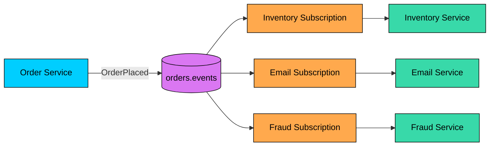


The subscription is important. In many systems, the topic is where events are published, but the subscription is where delivery state lives: acknowledgments, backlog, filters, retry policy, and dead-letter policy.

---

## Queue vs Pub/Sub

Queues and pub/sub often work together, but they solve different problems.


| Question | Work Queue | Pub/Sub |
|----------|------------|---------|
| Who receives a message? | One worker from a pool | Every interested subscription |
| Main purpose | Distribute work | Fan out events |
| Producer intent | "Someone should do this task" | "This thing happened" |
| Consumer ownership | Workers usually share one job type | Each subscriber owns its own reaction |
| Example | Resize this image | User registered |


A useful rule of thumb is to use a **work queue** for commands or tasks, and **pub/sub** for events and fan-out. Commands ask for work to be done. Events state that something already happened.

---

## Core Concepts

#### Publisher

A publisher creates events and sends them to a topic. It should publish facts, not instructions for every downstream service.

Good event:


```json
{
  "eventType": "OrderPlaced",
  "eventId": "evt_123",
  "orderId": "order_456",
  "customerId": "cust_789",
  "occurredAt": "2026-05-24T10:30:00Z"
}
```


Less useful event:


```json
{
  "instruction": "SendEmailAndUpdateAnalyticsAndReserveStock"
}
```


The first event lets subscribers decide what to do. The second leaks downstream implementation details into the publisher.

#### Topic

A topic is a named stream or channel where events are published. Topic design should be boring and predictable, with names like `orders.events`, `payments.events`, `users.events`, and `inventory.events`.

Avoid creating a new topic for every tiny variation unless the broker and team can operate that many topics cleanly.

#### Subscription

A subscription connects a consumer or service to a topic. Each subscription usually has its own backlog, acknowledgment state, retry policy, dead-letter policy, filter rules, and consumer instances.


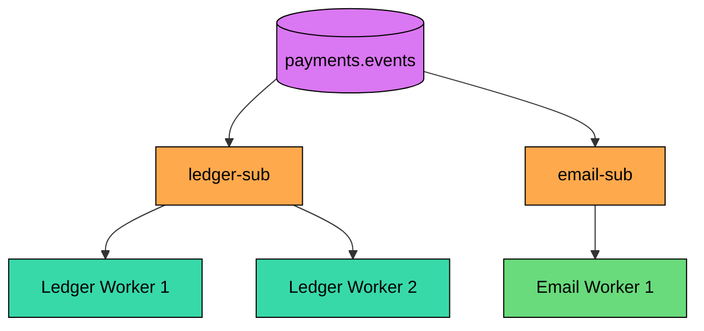


Here, the ledger service and email service each receive payment events. Within `ledger-sub`, multiple ledger workers share the work.

#### Message

A pub/sub message should include enough information for subscribers to process it safely. That usually means an event ID, an event type, an aggregate or entity ID, a timestamp, a schema version, a correlation or trace ID, the payload itself, and attributes for filtering when the broker supports them.

Subscribers should not need to guess what the event means.

---

## How Pub/Sub Works

The basic flow:


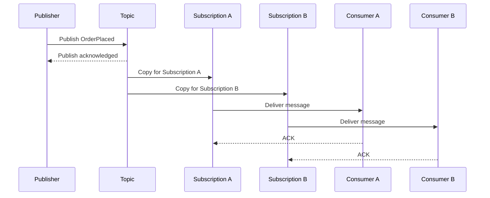


Each subscription processes independently. If the email subscriber is down, the inventory subscriber can continue. If analytics falls behind, it should not block fraud detection.

That independence is the real value of pub/sub.

---

## Fan-Out and Filtering

#### Fan-Out

Fan-out means one event is delivered to multiple subscriptions.


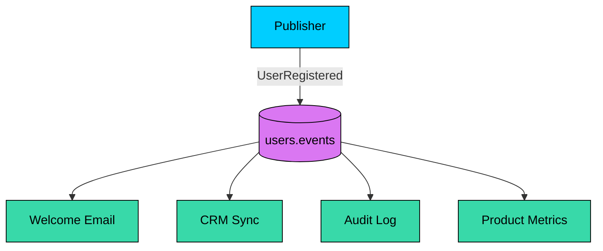


This keeps the publisher simple. New subscribers can be added without changing the publisher.

#### Filtering

Filtering lets a subscription receive only matching messages.


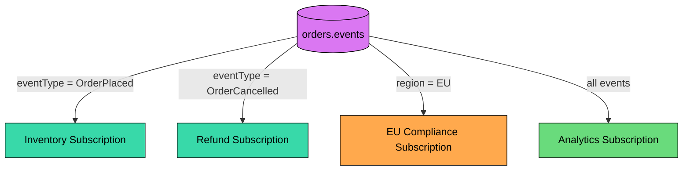


Prefer filtering on metadata or attributes when your broker supports it. Filtering by parsing large payloads in every consumer wastes work and spreads business rules everywhere.

---

## Push vs Pull Delivery

Pub/sub systems usually deliver messages in one of two ways.

#### Push

The broker calls a subscriber endpoint.


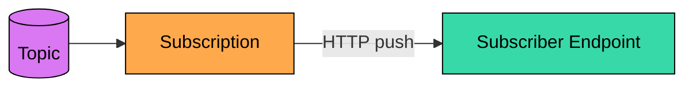


Push is convenient for webhooks and low-latency delivery. The subscriber must expose a reliable endpoint and handle bursts.

#### Pull

Subscribers fetch messages when they are ready.


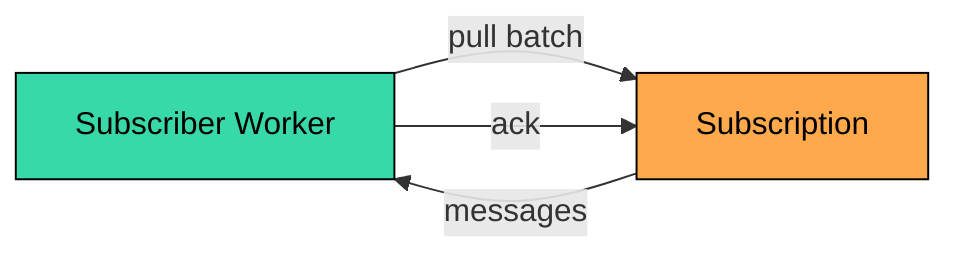


Pull gives consumers more control over batching, concurrency, and backpressure.


| Delivery Mode | Strength | Trade-off |
|---------------|----------|-----------|
| **Push** | Simple for web-facing endpoints and near-real-time callbacks | Backpressure is harder; endpoint must stay reachable |
| **Pull** | Consumer controls rate, batching, and concurrency | Consumer must run polling workers |


---

## Consumer Groups and Shared Subscriptions

Pub/sub fan-out and load balancing are different ideas.

Fan-out sends a copy to each subscription. Load balancing spreads one subscription's messages across multiple instances.


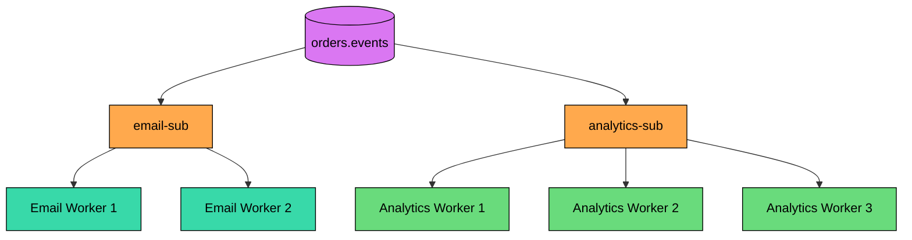


Kafka calls this a **consumer group**. Other systems may call it a shared subscription or competing consumers. The idea is the same: each service gets its own subscription, and instances of that service share the work.

---

## Durability and Replay

Pub/sub systems differ a lot in what they store.

Some are ephemeral: messages are delivered only to currently connected subscribers. If a subscriber is offline, it misses the message.

Others are durable: messages are retained for a period of time, and subscribers can catch up from their backlog.


| Mode | Behavior | Good For |
|------|----------|----------|
| **Ephemeral** | Only online subscribers receive messages | Presence, cache invalidation, low-value live updates |
| **Durable subscription** | Messages wait until the subscriber acknowledges them or retention expires | Business events, background processing |
| **Replayable log** | Consumers can seek to older offsets or timestamps within retention | Data pipelines, reprocessing, stream processing |


Replay is useful, but it is not free. Replaying old events can create duplicate side effects unless consumers are idempotent.

---

## Ordering

Most pub/sub systems do not provide global ordering. If they provide ordering, it is usually scoped to a partition, message group, ordering key, or entity key.

Design for this from the start. Put related events on the same key, such as `orderId` or `accountId`. Include fields like `eventId`, `eventTime`, and `version` so consumers can ignore stale events when a newer version has already been applied. Avoid workflows that require perfect global ordering.


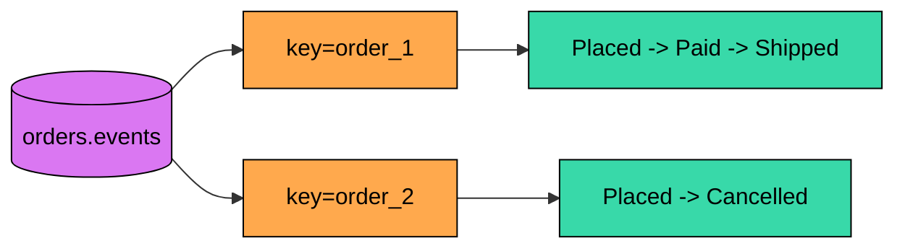


Per-order ordering is usually realistic. Ordering every event in the whole company is not.

---

## Delivery Failures

Most durable pub/sub systems use at-least-once delivery. A subscriber may receive the same event more than once.

Subscribers should be idempotent and should classify failures. Retry transient failures with backoff, dead-letter poison messages after a bounded number of attempts, alert on growing backlog and DLQ count, and avoid retry storms when a downstream dependency is unhealthy.


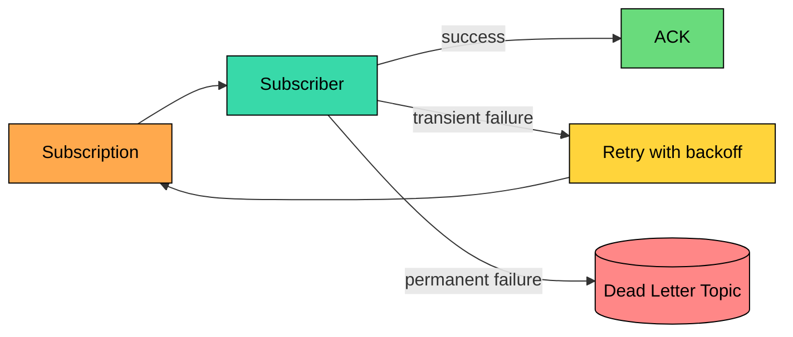


Pub/sub does not remove failure handling. It moves failure handling to each subscriber.

---

## Schema Evolution

Events become contracts. Once several services consume an event, changing it casually can break production.

Prefer additive changes, and keep old fields until consumers migrate off them. Include a schema version when it helps, and for high-volume or strongly typed event streams, use a schema registry. Treat event removal as a breaking change, and document who owns each event.

Avoid publishing database rows directly as events. Internal table shape is not a stable public contract.

---

## Common Patterns

#### Event Notification

Publish a small event that says something happened. Subscribers fetch more data if they need it.


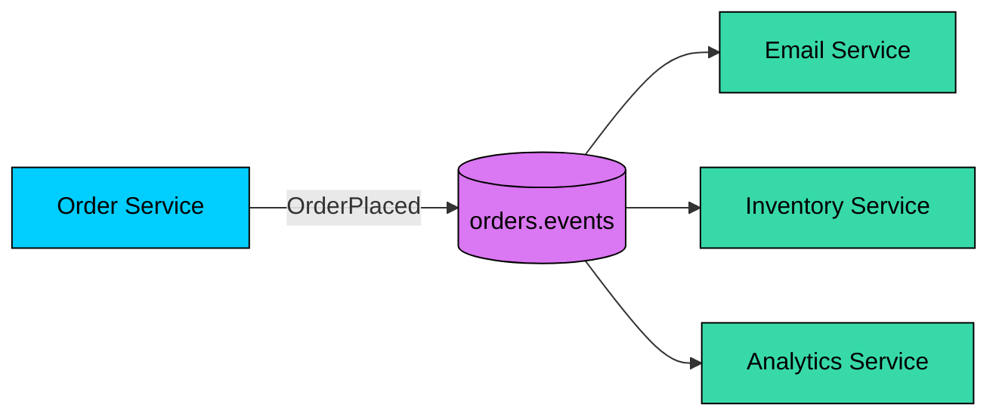


This is a good default when services need to react independently.

#### Fan-Out to Queues

Use pub/sub to fan out events, then give each subscriber its own queue for buffering and worker scaling.


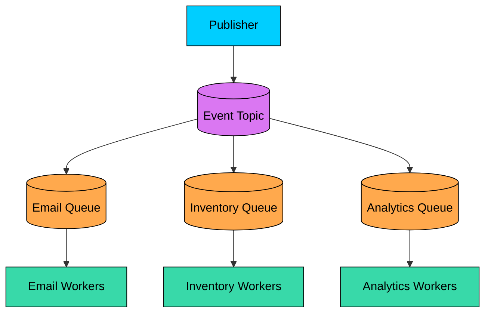


This is common with systems such as SNS to SQS. The topic handles fan-out; each queue handles durable work for one subscriber.

#### Event-Carried State Transfer

The event contains enough state for subscribers to update themselves without calling the publisher.

Example: `ProductPriceChanged` includes product ID, old price, new price, currency, and version.

This reduces synchronous calls but makes schema design more important.

#### Event Sourcing

Event sourcing is a separate architectural pattern where the source of truth is an append-only event log. Pub/sub can distribute those events, but publishing events does not automatically mean the system is doing event sourcing.

That distinction matters. Many systems use pub/sub for notifications while still storing current state in normal databases.

---

## Popular Implementations


| System | Model | Notes |
|--------|-------|-------|
| **Apache Kafka** | Durable partitioned log | Great for event streams, replay, consumer groups, and high-throughput pipelines. Ordering is per partition. |
| **Amazon SNS** | Managed fan-out service | Publishes to protocols such as SQS, Lambda, HTTP/S, email, and SMS. For failed deliveries, retries depend on protocol; DLQs can be attached to subscriptions. |
| **Google Cloud Pub/Sub** | Managed topics and subscriptions | Supports push and pull subscriptions, at-least-once delivery, ack deadlines, replay with retention, ordering keys, filters, and dead-letter topics. |
| **Azure Service Bus Topics** | Managed topics and subscriptions | Good for enterprise messaging with filters, sessions, scheduled delivery, and dead-letter subqueues. |
| **Redis Pub/Sub** | Ephemeral in-memory pub/sub | Very fast but at-most-once and not durable. Use Redis Streams when persistence and consumer groups matter. |


Do not choose only by brand name. Choose based on whether you need durability, replay, filtering, ordering, throughput, cloud integration, or low-latency ephemeral delivery.

---

## When to Use Pub/Sub

Use pub/sub when:

- Multiple services need to react to the same event.
- The publisher should not know all consumers.
- Subscribers can process independently.
- Eventual consistency is acceptable.
- New consumers may be added over time.

Avoid pub/sub when:

- The caller needs an immediate answer from the consumer.
- There is exactly one handler and no fan-out.
- The workflow needs strict step-by-step orchestration.
- Subscribers cannot tolerate duplicate or out-of-order events.
- Nobody owns monitoring the subscriptions and backlogs.

For multi-step business workflows, a workflow engine or orchestrator may be clearer than a chain of loosely connected events.

---

## Summary

Pub/sub lets publishers announce events without knowing who will consume them. Each subscription gets its own copy and can process independently.

The pattern is excellent for fan-out, event-driven workflows, and loose coupling. It also brings operational responsibilities: duplicate delivery, backlog monitoring, schema evolution, ordering limits, retries, and dead-letter handling.

Use pub/sub for events, not as a way to hide every service call. Design events as stable contracts, make subscribers idempotent, and choose a broker whose durability and replay model match the workload.

---

## Quiz

</section>
