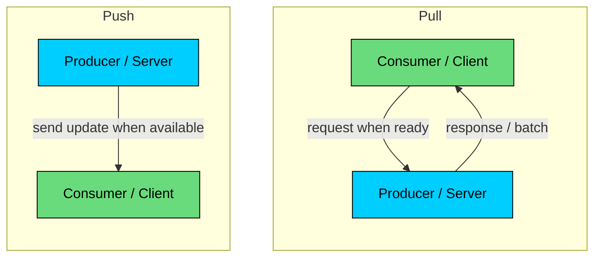
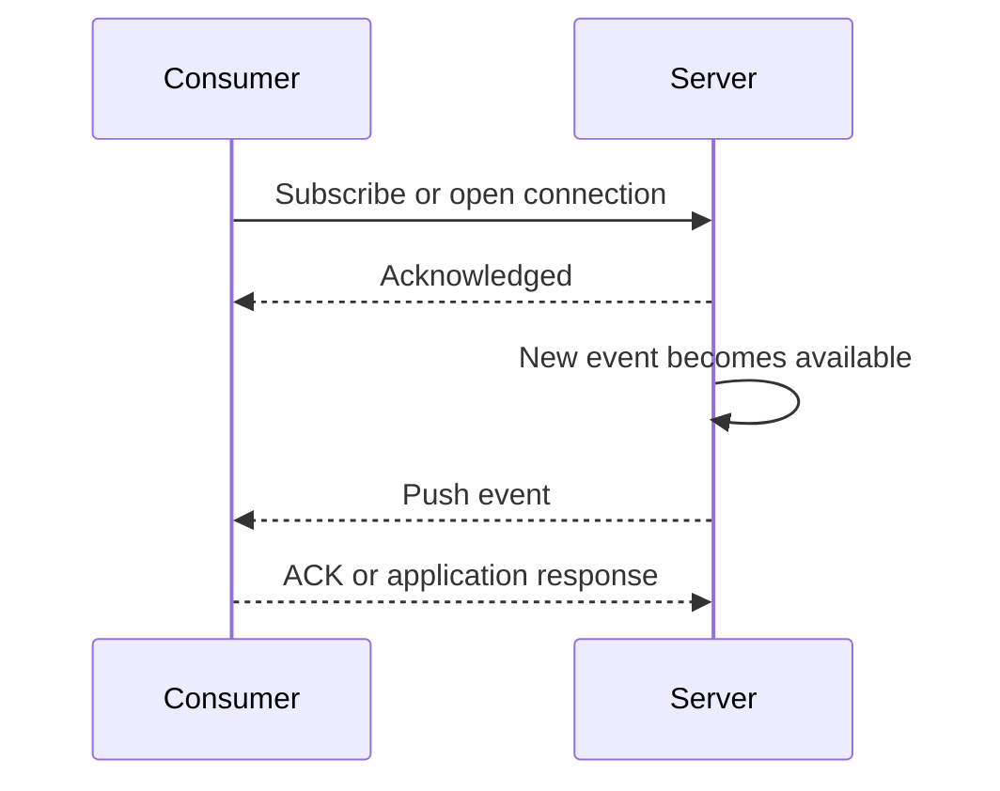
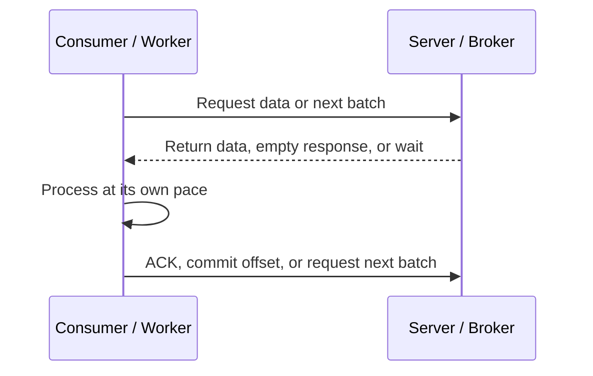
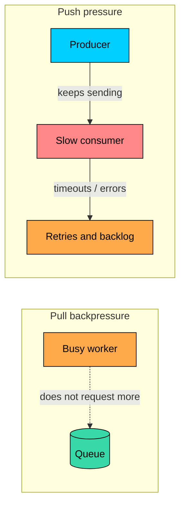

import React from 'react';
import CodeBlock from '../../../../components/ui/CodeBlock';
import Callout from '../../../../components/ui/Callout';

  

    <a href="/">Curated Notes</a>
    ›
    Push vs Pull Architecture
  

  <h1>Push vs Pull Architecture</h1>
  

    Master the essentials of Push vs Pull Architecture in this curated guide.
  

  

    
      <svg width="14" height="14" viewBox="0 0 24 24" fill="none" stroke="currentColor" strokeWidth="2"><circle cx="12" cy="12" r="10"/><polyline points="12 6 12 12 16 14"/></svg>
      10 min read
    
    Intermediate
  

<section className="content-section">

Push and pull describe who initiates data movement.

In a **push architecture**, the producer sends data to the consumer when it becomes available. In a **pull architecture**, the consumer asks for data when it is ready to handle it.

Neither is universally better. Push fits cases where freshness matters and consumers can receive updates reliably. Pull fits cases where consumers need control over rate, batching, retries, and recovery. Most production systems use both.

---

## 1. Push Architecture

In push architecture, the sender initiates delivery.

The consumer does not repeatedly ask "is there anything new?" Instead, it keeps a channel open, exposes an endpoint, subscribes to a broker, or registers with a delivery service.

When new data arrives, the system sends it.

Mobile notifications through APNs or FCM are a familiar example, as are webhooks from payment providers, GitHub, Stripe, or CI systems.

Server-Sent Events handle one-way browser updates, while WebSocket messages power chat, collaboration, and multiplayer state.

Brokers can push directly to an HTTP subscriber endpoint, and AI models can stream token responses to a client after the client kicks off a request.

Push is not the same as "all streaming." Many video streaming systems use client-driven segment fetching over HTTP.

The player pulls small chunks while the server provides them efficiently. The user experience feels continuous, but the delivery model is often pull-based at the protocol level.

#### How Push Works

The consumer may still initiate setup. A browser opens a WebSocket. A mobile app registers a device token. A webhook receiver exposes an endpoint.

After that setup, the server can deliver updates without waiting for a fresh data request.

#### Advantages of Push

The main appeal of push is low update latency. Consumers receive data soon after it is produced, without making repeated empty requests across the network.

That makes push a good fit for user-facing freshness, where chat messages, alerts, presence indicators, live dashboards, and collaborative editing all need fast delivery.

Push also gives natural fan-out, since a publisher or broker can send the same event to many subscribers at once. The user experience improves too, because the client can react as soon as something changes.

#### Disadvantages of Push

The trade-offs start with backpressure. The producer may send faster than consumers can process, and consumers must be reachable for delivery to succeed at all.

Webhooks and push endpoints fail when the receiver is down, slow, blocked by firewalls, or misconfigured.

Long-lived connections also cost resources, since WebSockets and SSE require connection management, heartbeats, load balancer support, and reconnection logic.

Failed deliveries make this worse: a burst of failed webhook attempts can create retry storms that amplify load.

State management becomes more complex too, because the system must track subscriptions, connection state, delivery attempts, and sometimes per-consumer offsets.

Push works well only when the delivery path has clear failure handling. At minimum, design retries, timeouts, idempotency, duplicate handling, and a way to recover missed data.

---

## 2. Pull Architecture

In pull architecture, the receiver initiates data retrieval.

The consumer asks for work, data, or updates when it is ready.

That request may be a normal API call, a polling loop, a worker fetching jobs from a queue, or a stream consumer reading the next batch from a log.

A browser or mobile app fetching an API response is the simplest case. A dashboard polling every 30 seconds is another.

Workers pulling jobs from a queue, Kafka consumers fetching records from partitions, and batch jobs reading files from object storage all follow the same pattern.

ETL pipelines pull changed data from a source system, and embedding workers pull documents to process at their own pace.

Pull is the default model for many systems because it gives the consumer control.

#### How Pull Works

The consumer can tune how often it requests data, how many items it asks for, how much concurrency it runs, and when it slows down.

#### Advantages of Pull

Pull gives natural backpressure, since consumers fetch only when they have capacity.

It also enables better batching, because a worker can request 10, 100, or 1,000 items depending on throughput and latency needs.

Recovery is simpler too, with consumers resuming from a cursor, timestamp, page token, or stream offset.

Pull works well with private networks, since consumers can call out to a broker or API without exposing a public endpoint.

That makes it a good fit for expensive processing, where AI inference, embedding generation, image processing, and ETL jobs often need careful concurrency control.

#### Disadvantages of Pull

The cost is freshness. Consumers see changes only when they ask again, so polling can waste work when frequent empty polls create unnecessary network and server load.

Latency depends on the interval, so a 60-second polling interval can add up to 60 seconds of delay.

Clients also have to coordinate polling behavior, because large fleets polling on the same schedule can create synchronized traffic spikes.

And consumers carry more responsibility on the client side, since they must manage pagination, cursors, retries, rate limits, and duplicate handling.

Pull is usually easier to make stable under load. It may be less immediate, but the consumer has a clear control point: it can slow down.

---

## 3. Push vs Pull in Messaging Systems

Push and pull are often discussed as client-server patterns, but the distinction also matters inside messaging systems.

Some brokers push messages to subscribers. Others let consumers pull messages. Some support both.

| Delivery Mode | Who Initiates Delivery? | Good For | Main Risk |
|---------------|--------------------------|----------|-----------|
| Push | Broker or server | Webhooks, low-latency notifications, browser updates | Receiver overload and retry storms |
| Pull | Consumer or worker | Queues, streams, batch processing, AI pipelines | Polling delay and consumer-side complexity |

For example, a webhook system pushes events to an HTTP endpoint, while a queue worker pulls jobs when it has available threads.

A Kafka consumer pulls records and commits offsets. A browser may receive pushed updates over WebSocket, then pull full details through an API.

Do not assume "pub/sub" always means push. Many pub/sub and streaming systems use pull-based consumers because pull gives better batching, offset management, and backpressure.

---

## 4. Backpressure Is the Core Trade-off

Backpressure is the ability of a slow consumer to tell the system: "I cannot handle more right now."

In pull systems, backpressure is built into the access pattern. A worker that is busy stops asking for more messages.

In push systems, backpressure must be designed explicitly.

Push systems need safeguards. That usually means per-consumer rate limits, bounded queues, and retry policies with exponential backoff and jitter.

Dead-letter queues catch the messages that keep failing, idempotent handlers protect against duplicates, and delivery timeouts prevent slow receivers from blocking the producer.

Circuit breakers help isolate failing endpoints, and a replay or reconciliation path gives the system a way to recover missed events.

Without these, push delivery can turn a downstream outage into a system-wide incident.

---

## 5. Choosing Push or Pull

Use push when freshness is more important than consumer-side control.

User notifications are an obvious fit, since a user should know quickly when a message, payment, or alert arrives.

Live collaboration falls into the same bucket, with edits, cursors, and presence needing low-latency updates.

Operational alerts also belong here, because humans and systems should receive incidents quickly.

Webhooks let external systems get callbacks when events happen. Streaming AI responses use push to send partial model output to a client and improve perceived latency.

Use pull when control, batching, and recovery matter more than immediacy.

Background jobs are a natural fit, with workers processing tasks at a controlled rate.

Data pipelines also benefit, since consumers can read batches, checkpoint progress, and replay if needed.

Expensive processing like GPU inference, embeddings, transcoding, and document parsing all need strict concurrency limits.

Unreliable clients such as mobile apps and edge devices can sync when they reconnect. Large datasets are safer to expose through pagination, cursors, and offsets than to push wholesale.

As a quick shortcut for matching requirements to a delivery model: when update latency must be as low as possible, choose push.

When the consumer needs to control throughput, choose pull. Large batches or expensive processing also favor pull.

Browsers receiving live updates do best with push over SSE or WebSockets, while receivers that are often offline are usually served by pull, or by a push notification followed by a later pull.

If you need replay from an offset, pull from a durable log or queue. For external callback integration, use a push webhook with retries and idempotency.

---

## 6. Hybrid Patterns

The best design is often a combination.

#### Push Notification, Pull Details

A common mobile pattern is:

1. Push a small notification: "You have a new message."
2. The app opens or wakes up.
3. The app pulls the latest message state from the API.

This avoids putting sensitive or large payloads in the notification and gives the app a reliable way to catch up if it missed earlier updates.

#### Webhook Plus Reconciliation

Webhooks are push-based, but robust integrations also provide pull APIs.

If a payment webhook fails or arrives out of order, the receiver can call the provider's API to fetch the current payment state.

The webhook tells the receiver to look; the pull API provides the source of truth.

#### Long Polling

Long polling is a pull request that behaves partly like push.

The client sends a request. If the server has no update, it holds the request open until data arrives or a timeout occurs. The client then immediately sends another request.

This is useful when WebSockets are not available but near-real-time behavior is needed.

#### Durable Log With Pull Consumers

Event streams such as Kafka-style logs often use pull consumers.

The producer writes events to the log. Consumers pull at their own pace and commit offsets. This gives strong control over replay, batching, and recovery.

That is often a better fit for internal data pipelines than pushing every event directly into every consumer.

---

## 7. Practical Decision Framework

A few questions help frame the choice. Start with freshness: how fresh must the data be, in milliseconds, seconds, minutes, or hours?

Then think about rate control, and whether it should sit with the producer, broker, consumer, or user.

Ask whether the consumer can be reached reliably, since a public endpoint, mobile device, private worker, and offline client all behave differently.

Consider what happens when the consumer is slow, and whether the system should queue, drop, retry, delay, or shed load.

If consumers need replay, plan for a durable log, queue, cursor, or API. Assume messages can be duplicated or reordered, because most real systems must handle both.

Finally, look at payload size, since large payloads usually belong in storage, with events carrying references.

Push gives low-latency delivery, but it requires careful failure handling. Pull gives control and resilience, but it can add polling delay.

Use push when the system must notify quickly. Use pull when the consumer must process safely at its own pace. Use both when you need fast notification and reliable recovery.

---

## Quiz

</section>
