import React from 'react';
import CodeBlock from '../../../../components/ui/CodeBlock';
import Callout from '../../../../components/ui/Callout';

<div className="article-header">
  <div className="breadcrumb">
    <a href="/">Curated Notes</a>
    <span className="breadcrumb-separator">›</span>
    <span className="breadcrumb-current">Synchronous vs Asynchronous Communication</span>
  </div>
  <h1>Synchronous vs Asynchronous Communication</h1>
  <p style={{ color: 'var(--text-muted)', fontSize: '1.1rem', marginBottom: '16px', lineHeight: '1.6' }}>
    Master the essentials of Synchronous vs Asynchronous Communication in this curated guide.
  </p>
  <div className="meta-info">
    <span className="meta-item">
      <svg width="14" height="14" viewBox="0 0 24 24" fill="none" stroke="currentColor" strokeWidth="2"><circle cx="12" cy="12" r="10"/><polyline points="12 6 12 12 16 14"/></svg>
      10 min read
    </span>
    <span className="difficulty-badge difficulty-badge--intermediate">Intermediate</span>
  </div>
</div>

<section className="content-section">

When a user clicks **Place Order**, several things have to happen: validating the cart, checking prices, creating the order, reserving inventory, capturing payment, sending a confirmation email, and updating analytics.

Some of those actions must complete before the user gets a response. Others can happen later.

That is the core difference between **synchronous** and **asynchronous** communication. In synchronous communication, the caller sends a request and waits for a response. In asynchronous communication, the sender records or publishes work and continues without waiting for the final processing result.

Neither style is better in every case. Most real systems use both. The design skill is knowing which parts of a workflow need an immediate answer and which parts can safely happen in the background.

---

## Synchronous Communication

Synchronous communication is the familiar request-response model.

The caller asks for something, waits, and then continues after it receives a response or error.


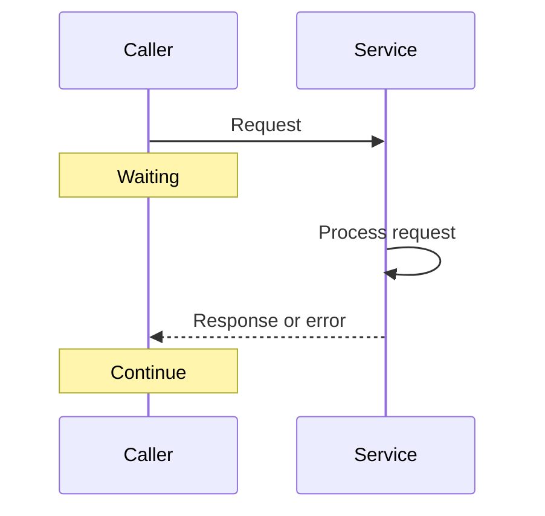


Common examples include HTTP APIs, gRPC calls, GraphQL queries, database queries, and RPC between internal services. Synchronous calls are a good fit when the caller cannot make progress without the answer.

---

## Synchronous Example

A mobile app showing an account balance needs an immediate answer.


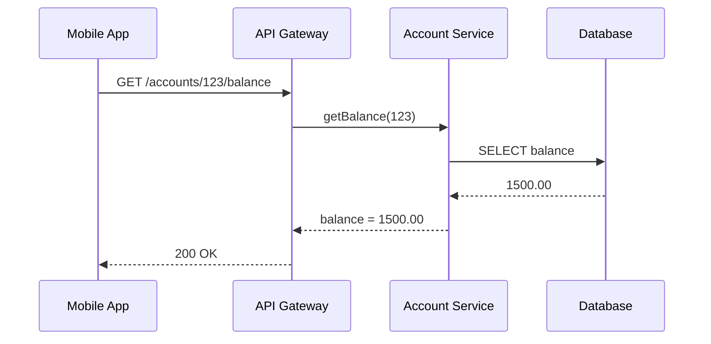


If the account service or database is unavailable, the app cannot honestly show the current balance. A synchronous call is appropriate because the user is waiting for that specific result.

---

## Synchronous Trade-offs


#### Advantages

- Simple request-response mental model
- Immediate success or failure signal
- Easier to reason about for user-facing reads
- Natural fit for validation and authorization
- Mature tooling for tracing, timeouts, and debugging

#### Disadvantages

- Caller availability depends on callee availability
- Slow downstream services increase user-facing latency
- Long call chains are fragile
- Failures can cascade without timeouts and circuit breakers
- Services become coupled at runtime


Synchronous communication is not bad. It is just expensive when used across long dependency chains.

---

## The Availability Problem

Suppose a request must call three services, and each service is available 99.9% of the time.


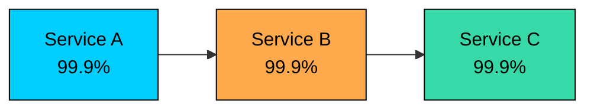


If all three must succeed for the request to succeed, the combined availability is roughly:


```plaintext
0.999 x 0.999 x 0.999 = 0.997

99.7% availability
```


This simplified math assumes independent failures and no fallback behavior, but the lesson is useful: every required synchronous dependency can reduce the availability of the user-facing path.

Good synchronous systems use timeouts, retries with care, circuit breakers, caching, graceful degradation, and small dependency chains.

---

## Asynchronous Communication

Asynchronous communication decouples the sender from final processing.

The sender writes a message, event, or job to an intermediary such as a queue, topic, stream, or durable table. A receiver processes it later.


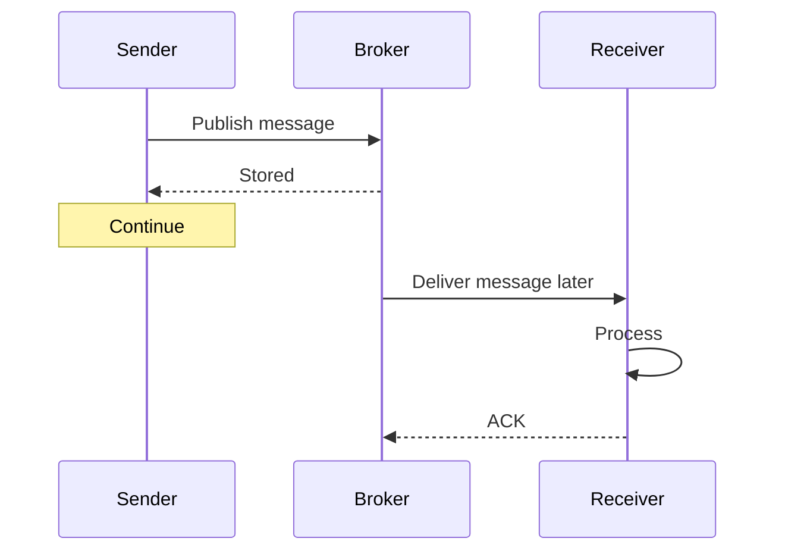


The sender usually knows that the message was accepted. It does not immediately know whether every downstream action succeeded.

That difference matters.

---

## Asynchronous Example

After an order is created, several follow-up actions can happen in the background.


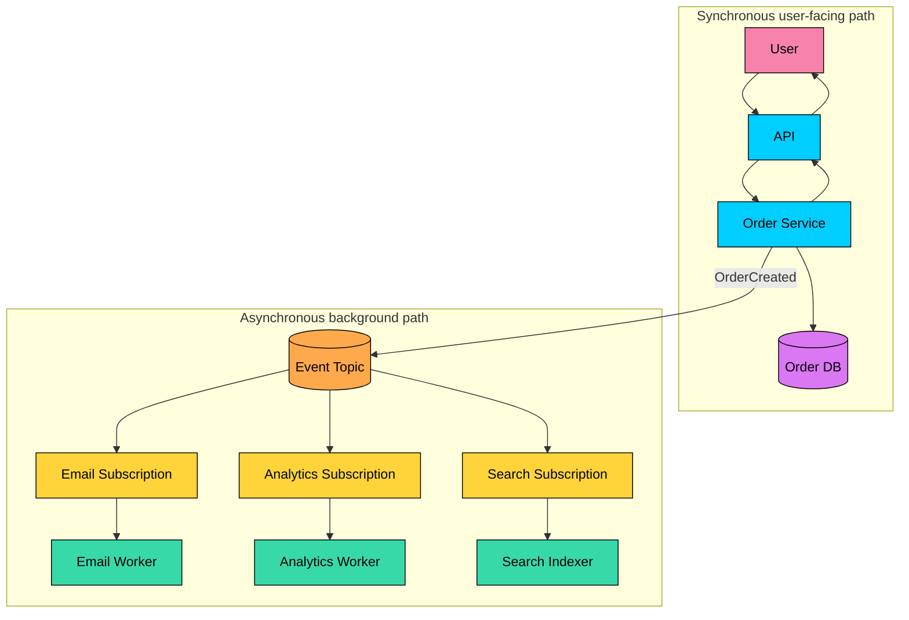


The user can receive an order ID once the order is durably saved. Email, analytics, and search indexing can happen later. If email is slow, checkout does not need to fail.

Payment and inventory are more subtle. Some businesses require those to complete before confirming the order. Others create a `PENDING` order and confirm it after payment and inventory succeed. The communication style must match the product promise.

---

## Asynchronous Trade-offs


#### Advantages

- Sender and receiver do not need to be available at the same time
- Queues and streams can absorb traffic spikes
- Slow consumers do not directly slow the user-facing request
- Work can be retried after transient failures
- Multiple consumers can react to the same event
- Consumers can scale independently

#### Disadvantages

- The final outcome is not known immediately
- Data becomes eventually consistent
- Debugging requires tracing across messages and services
- Duplicate delivery is common and must be handled
- Ordering is limited and must be designed for
- Brokers and queues add operational responsibility


Asynchronous communication trades immediate certainty for buffering, resilience, and independent processing.

---

## Eventual Consistency

With async workflows, different parts of the system can temporarily disagree.


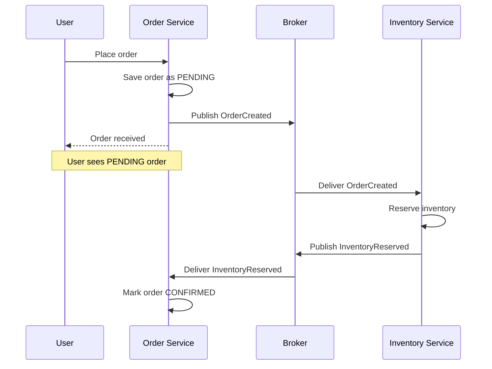


For a short time, the order exists before inventory has been reserved. That is not automatically wrong, but it must be visible in the state model. Names like `PENDING`, `PROCESSING`, `CONFIRMED`, and `FAILED` matter because users and support teams need to understand what is happening.

---

## When to Use Synchronous Communication

Use synchronous communication when:

- The caller needs an immediate answer.
- The operation is part of the user-facing decision.
- The dependency is fast and reliable enough.
- The workflow cannot proceed without the result.
- The system needs simple control flow more than buffering.

Typical examples are checking login and authorization, fetching an account balance, reading a product page, validating a coupon during checkout, checking whether a username is available, or returning search results.

For synchronous calls, set timeouts. A missing timeout can turn a slow dependency into a stuck request path.

---

## When to Use Asynchronous Communication

Use asynchronous communication when:

- Work can happen after the user gets a response.
- Multiple services need to react to the same event.
- The workload is slow or bursty.
- Failures should be retried later.
- The sender should not depend on receiver availability.
- Consumers need to scale independently.

Typical examples are sending emails or push notifications, updating search indexes, processing videos or images, generating reports, shipping analytics events, replicating data to a warehouse, and running webhook delivery retries.

Async is not a way to avoid thinking about correctness. It means correctness is handled with state transitions, retries, idempotency, monitoring, and repair tools.

---

## Common Patterns

#### Request-Response

The caller waits for a response.


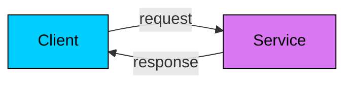


Use for reads, validation, and operations where the caller needs the result now.

#### Work Queue

The sender submits a task. One worker processes it.


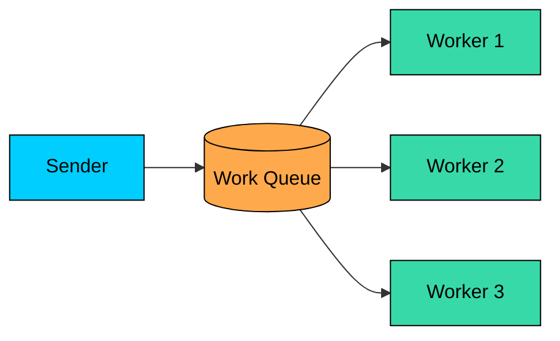


Use for background jobs such as image processing, report generation, or webhook delivery.

#### Publish-Subscribe

The publisher emits an event. Multiple subscriptions receive it.


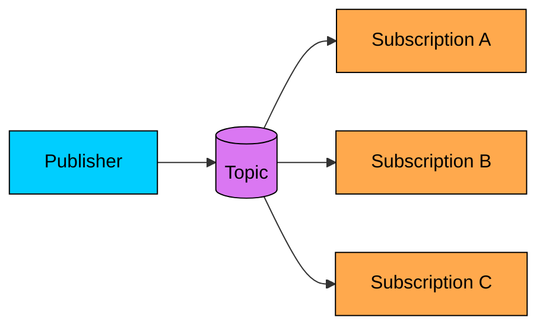


Use when several independent services need to react to the same event.

#### Request-Async Response

The client submits a long-running job and receives the result later.


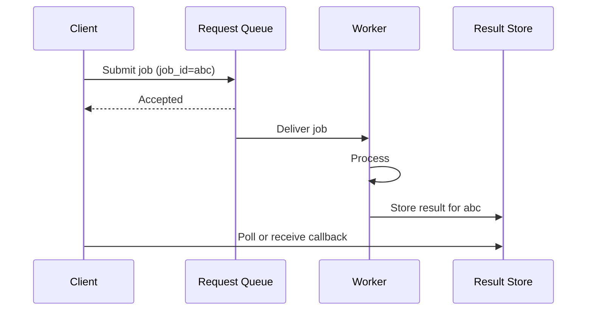


Use for exports, media processing, ML jobs, and other workflows where the result matters but does not need to be immediate.

---

## Hybrid Architecture

Most systems combine both styles.


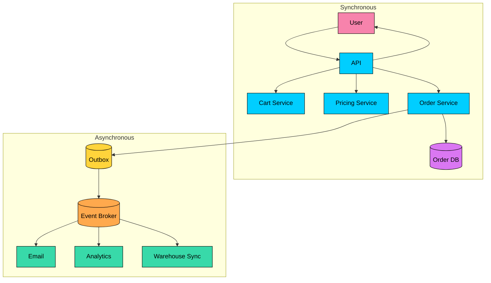


The synchronous path should do the minimum required to give the user a correct response. The asynchronous path handles follow-up work that can tolerate delay.

The outbox is shown because it avoids a common dual-write bug: saving the order but failing to publish the event.

---

## Design Checklist

Before choosing sync or async, ask:

- Does the caller need the result immediately?
- What should the user see while background work is pending?
- What happens if the receiver is down?
- How long can the work be delayed?
- Can the operation be retried safely?
- Are consumers idempotent?
- What ordering guarantees are required?
- How will failures surface to users or operators?
- Who owns the queue, topic, backlog, and DLQ?

The communication style is not just an implementation detail. It changes the user experience, failure model, and operational work.

---

## Summary

Synchronous communication gives immediate answers and simple control flow, but it couples the caller to downstream latency and availability.

Asynchronous communication adds buffering and resilience, but the final result arrives later and the system must handle eventual consistency, retries, duplicates, ordering, and monitoring.

Use synchronous calls when the caller genuinely needs the answer now. Use asynchronous messaging when work can happen later, receivers need to scale independently, or multiple services need to react to the same event.

Most good architectures use both: a small synchronous user-facing path, followed by asynchronous background processing for everything that does not need to block the response.

</section>
