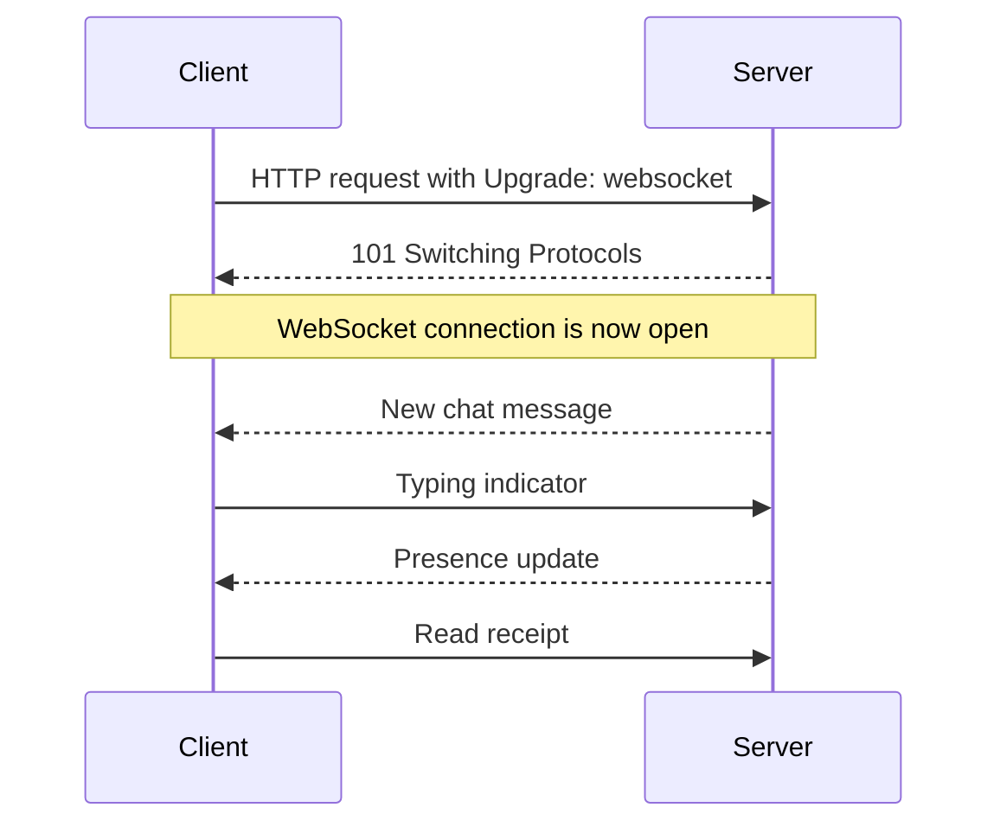
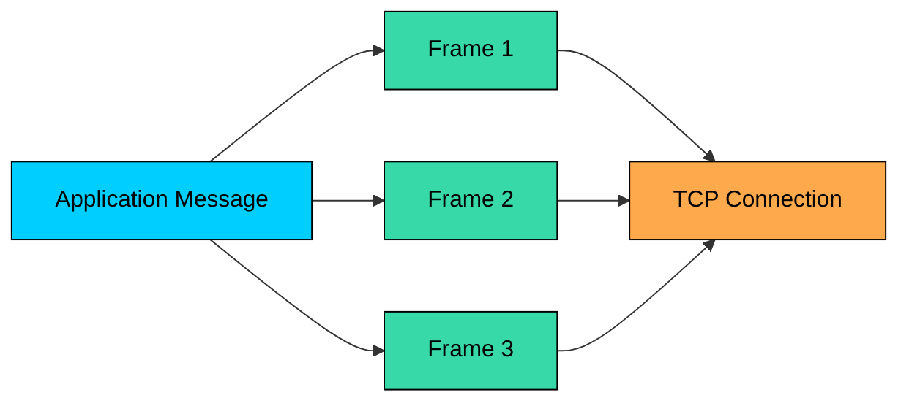
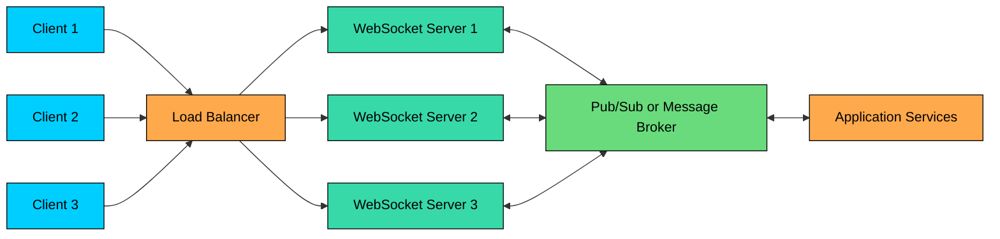

import React from 'react';
import CodeBlock from '../../../../components/ui/CodeBlock';
import Callout from '../../../../components/ui/Callout';

<div className="article-header">
  <div className="breadcrumb">
    <a href="/">Curated Notes</a>
    <span className="breadcrumb-separator">›</span>
    <span className="breadcrumb-current">WebSockets</span>
  </div>
  <h1>WebSockets</h1>
  <p style={{ color: 'var(--text-muted)', fontSize: '1.1rem', marginBottom: '16px', lineHeight: '1.6' }}>
    Master the essentials of WebSockets in this curated guide.
  </p>
  <div className="meta-info">
    <span className="meta-item">
      <svg width="14" height="14" viewBox="0 0 24 24" fill="none" stroke="currentColor" strokeWidth="2"><circle cx="12" cy="12" r="10"/><polyline points="12 6 12 12 16 14"/></svg>
      10 min read
    </span>
    <span className="difficulty-badge difficulty-badge--intermediate">Intermediate</span>
  </div>
</div>

<section className="content-section">

HTTP is a request-response protocol: the client asks, the server responds, and the application moves on. That model is awkward when the server needs to push data the moment something happens, such as a new chat message, a price tick, or a collaborator's cursor moving.

Polling wastes requests and adds delay. Long polling improves things but still ends each request and forces the client to reconnect.

**WebSockets** keep one connection open so both sides can send messages whenever they need to. The connection is long-lived, bidirectional, and message-oriented.





This chapter covers how the WebSocket handshake works, how WebSockets compare with HTTP, polling, long polling, and SSE, where WebSockets fit well and where they do not, what changes when you operate many long-lived connections, and how to build a basic WebSocket server and client.

---

## What WebSockets Provide

A WebSocket connection starts as HTTP, then upgrades to the WebSocket protocol. After the upgrade, both the client and server can send messages over the same TCP connection.

The connection is bidirectional (either side can send messages at any time), long-lived (it stays open across many messages), and low-overhead (messages do not carry full HTTP request and response headers). It is also ordered and reliable, since WebSockets run over TCP, and message-oriented: applications send text or binary messages rather than raw byte streams.

This makes WebSockets a good fit for application-level real-time data. It does not make them a replacement for every real-time protocol. For audio/video calls, WebRTC is usually a better fit. For one-way server updates, Server-Sent Events may be simpler.

---

## How the Handshake Works

The browser opens a WebSocket with a URL such as:


```javascript
const socket = new WebSocket('wss://api.example.com/chat');
```


`ws://` is the unencrypted scheme. `wss://` is WebSocket over TLS, similar to HTTPS. Production applications should use `wss://`.

The browser sends an HTTP request asking the server to switch protocols:


```shell
GET /chat HTTP/1.1
Host: api.example.com
Upgrade: websocket
Connection: Upgrade
Sec-WebSocket-Key: dGhlIHNhbXBsZSBub25jZQ==
Sec-WebSocket-Version: 13
Origin: https://app.example.com
```


If the server accepts the upgrade, it returns `101 Switching Protocols`:


```shell
HTTP/1.1 101 Switching Protocols
Upgrade: websocket
Connection: Upgrade
Sec-WebSocket-Accept: s3pPLMBiTxaQ9kYGzzhZRbK+xOo=
```


At that point, the HTTP exchange is over and the WebSocket protocol takes over the same connection.

Most WebSocket deployments use the HTTP/1.1 upgrade mechanism. WebSockets can also work with newer HTTP versions in some environments, but support across clients, proxies, and load balancers is not always uniform. For system design interviews and most production discussions, the HTTP/1.1 upgrade model is the right starting point.

---

## Frames and Messages

WebSocket data is carried in **frames**. A single application message may fit in one frame or be split across multiple frames. The protocol supports text frames (usually UTF-8), binary frames (such as protobuf, MessagePack, or custom binary payloads), close frames, and ping/pong frames.





Browsers handle framing for you. Your application usually sees complete messages through an `onmessage` handler.

Because WebSockets run over TCP, delivery is ordered. That is helpful for chat and collaboration events, but it can hurt highly time-sensitive streams. If one packet is delayed, later messages wait behind it. This is one reason WebSockets are not ideal for real-time audio/video media.

---

## WebSockets vs Other Options

The right real-time mechanism depends on direction, latency, browser support, and operational cost.


| Technique | Direction | Best For | Trade-Off |
|-----------|-----------|----------|-----------|
| Short polling | Client asks repeatedly | Simple status checks | Wastes requests and adds delay |
| Long polling | Server holds one request | Basic server push where WebSockets are unavailable | Reconnects after each response |
| Server-Sent Events | Server to client | Notifications, feeds, progress updates | One-way from server to browser |
| WebSockets | Client and server | Chat, collaboration, multiplayer state, live dashboards | Long-lived connection operations |
| WebRTC | Peer/media transport | Audio, video, screen sharing, peer data | More complex NAT and media stack |


Use WebSockets when both sides need to send events independently. If only the server needs to push updates, SSE can be simpler. If clients only need occasional updates, normal HTTP or polling may be enough.

---

## Where WebSockets Fit Well

WebSockets work well when the product needs low-latency, bidirectional application messages.

Common examples:

- **Chat:** messages, typing indicators, read receipts, presence
- **Collaboration:** document edits, cursor movement, selection changes
- **Multiplayer games:** player inputs and game state updates
- **Dashboards:** operational metrics and alerts
- **Trading interfaces:** market data and order status updates
- **IoT control planes:** device telemetry and commands
- **Live events:** viewer counts, reactions, chat, moderation actions

WebSockets are less suitable for several workloads. Large file upload or download is simpler over HTTP, and video streaming is better served by HLS, DASH, or WebRTC. Server-only notifications often do not need bidirectionality at all, so SSE may be enough. And workloads that require strict persistence before delivery need acknowledgements and replay layered on top, which WebSockets alone do not provide.

The important distinction is that WebSockets provide a transport. They do not automatically give you durability, ordering across servers, replay, moderation, authorization, or exactly-once delivery.

---

## A Basic Implementation

Here is a small Node.js server using the `ws` library.


```javascript
const http = require('http');
const WebSocket = require('ws');

const server = http.createServer();
const wss = new WebSocket.Server({ server });

wss.on('connection', (socket, request) => {
  console.log('Client connected from', request.socket.remoteAddress);

  socket.on('message', rawMessage => {
    const message = rawMessage.toString();
    socket.send(`echo: ${message}`);
  });

  socket.on('close', () => {
    console.log('Client disconnected');
  });
});

server.listen(8080, () => {
  console.log('WebSocket server listening on port 8080');
});
```


And a browser client:


```javascript
const socket = new WebSocket('ws://localhost:8080');

socket.addEventListener('open', () => {
  socket.send('hello');
});

socket.addEventListener('message', event => {
  console.log('received:', event.data);
});

socket.addEventListener('close', () => {
  console.log('connection closed');
});

socket.addEventListener('error', () => {
  console.log('connection error');
});
```


This is enough to demonstrate the protocol, but not enough for production. A real system needs authentication, message schemas, backpressure, heartbeats, reconnect behavior, and a way to route messages across many server instances.

---

## Scaling WebSockets

Scaling WebSockets is different from scaling normal HTTP APIs because connections are long-lived.

With normal HTTP, a load balancer can send each request to any healthy server. With WebSockets, a client may stay connected to one server for minutes or hours. That server now owns the connection state for that client.





A production deployment puts a load balancer in front of WebSocket servers, tunes idle timeouts so healthy connections are not dropped unexpectedly, and uses a message broker or pub/sub system to route events between server instances. It also keeps per-connection state small, tracks which server currently owns each user's connection, drains connections gracefully during deploys, and applies per-user and per-connection rate limits.

Sticky sessions can help, but they are not a complete architecture. If user A is connected to server 1 and user B is connected to server 2, the system still needs a way to deliver A's message to B.

---

## Reliability and Backpressure

A WebSocket connection can fail at any time. Laptops sleep. Phones switch networks. Proxies close idle connections. Deploys restart servers.

Good clients treat disconnects as normal. They reconnect with exponential backoff and jitter, resubscribe to rooms or streams after reconnecting, and resume from the last event ID when the product requires replay. They avoid sending unbounded messages while offline and show stale or disconnected state when it matters to the user.

Servers also need backpressure handling. A slow client can become a memory problem if the server keeps buffering messages faster than the network can send them.

Practical safeguards include limiting message size and capping the outbound queue size per connection. Drop or coalesce stale updates such as cursor positions, and close connections that cannot keep up. Use acknowledgements only when the product needs explicit delivery confirmation.

Heartbeats are another important detail. Servers can use WebSocket ping/pong frames to detect dead peers. Browser JavaScript does not expose protocol-level ping directly, so browser apps often use application-level heartbeat messages when they need explicit liveness checks.

---

## Security

WebSockets need the same security discipline as HTTP APIs, plus a few details specific to long-lived connections.

Use `wss://` in production so traffic is encrypted. Authenticate the user during the handshake or immediately after connection, and authorize every room, topic, or action. A connected socket should not mean "allowed to do everything."

Watch for these common issues:

- **Cross-site WebSocket hijacking:** browsers may include cookies during the handshake, so validate the `Origin` header and require proper authentication.
- **Token leakage:** query-string tokens can end up in logs. Prefer short-lived tokens and avoid long-lived secrets in URLs.
- **Unbounded input:** enforce message size limits and schema validation.
- **Connection abuse:** rate-limit connection attempts and messages per user or IP.
- **Resource exhaustion:** cap concurrent connections, subscriptions, and outbound queues.

For internal services, do not assume a WebSocket connection is trusted just because it came from inside the network. Keep authentication and authorization explicit.

---

## Operational Metrics

WebSocket problems often show up as missing updates or stale UI, not clean request failures. Monitor the connection lifecycle directly.

Useful metrics include:

- Active connections per server
- Connection open and close rate
- Close codes and disconnect reasons
- Authentication failures
- Messages sent and received per second
- Message size distribution
- Send queue depth
- Dropped or coalesced messages
- Reconnect rate
- Ping/pong latency or heartbeat latency
- Broker publish and delivery latency

Also log enough context to debug routing problems: user ID, connection ID, server instance, subscribed topics, and close code. Be careful not to log sensitive message payloads.

---

## Summary

WebSockets give web applications a long-lived, bidirectional channel between client and server. They are a strong fit for chat, collaboration, live dashboards, multiplayer state, trading interfaces, and other products where both sides need to send small messages quickly.

The main ideas to remember:

1. **WebSockets start with an HTTP upgrade.** After `101 Switching Protocols`, the connection uses the WebSocket protocol.
2. **They are bidirectional and long-lived.** Either side can send messages without opening a new HTTP request.
3. **They run over TCP.** Delivery is ordered and reliable, but delayed packets can hold later messages back.
4. **They are a transport, not a full system.** You still need authentication, authorization, schemas, durability, replay, and rate limits where the product requires them.
5. **Scaling requires connection-aware design.** Load balancing, pub/sub routing, deploy draining, heartbeats, and backpressure matter.

Use WebSockets when bidirectional real-time messaging is the core requirement. Use simpler HTTP, SSE, or polling when the product does not need a long-lived two-way connection.

</section>
