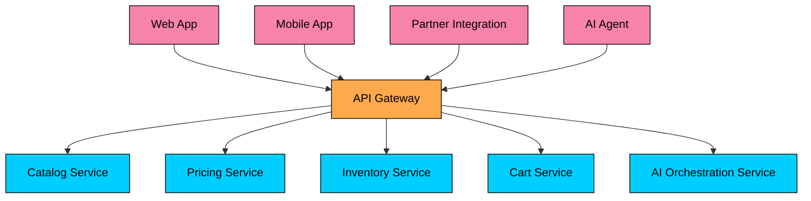
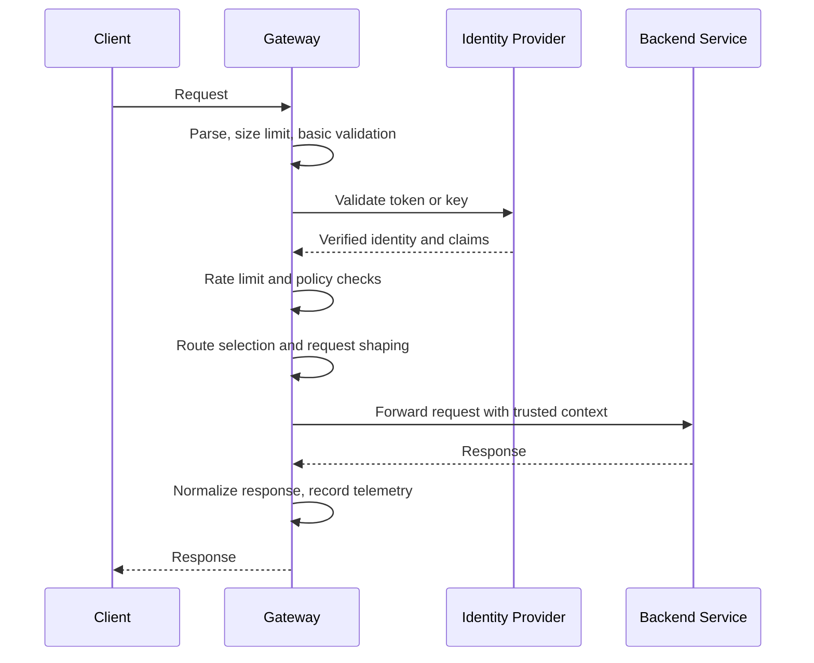

import React from 'react';
import CodeBlock from '../../../../components/ui/CodeBlock';
import Callout from '../../../../components/ui/Callout';

<div className="article-header">
  <div className="breadcrumb">
    <a href="/">Curated Notes</a>
    <span className="breadcrumb-separator">›</span>
    <span className="breadcrumb-current">API Gateways</span>
  </div>
  <h1>API Gateways</h1>
  <p style={{ color: 'var(--text-muted)', fontSize: '1.1rem', marginBottom: '16px', lineHeight: '1.6' }}>
    Master the essentials of API Gateways in this curated guide.
  </p>
  <div className="meta-info">
    <span className="meta-item">
      <svg width="14" height="14" viewBox="0 0 24 24" fill="none" stroke="currentColor" strokeWidth="2"><circle cx="12" cy="12" r="10"/><polyline points="12 6 12 12 16 14"/></svg>
      10 min read
    </span>
    <span className="difficulty-badge difficulty-badge--intermediate">Intermediate</span>
  </div>
</div>

<section className="content-section">

An **API gateway** is the controlled entry point for client traffic. Browsers, mobile apps, partner integrations, and AI agents call the gateway instead of each backend service directly. The gateway applies edge policy, chooses the right backend route, forwards the request, and returns the response.

The core idea is to keep the public API stable while backend services change behind it. The gateway centralizes cross-cutting concerns (authentication, rate limiting, validation, observability) so they are not duplicated and drifted across every service.

A gateway is not always needed. A single monolith behind a load balancer can be enough. Gateways become useful when clients need a stable API boundary in front of many services, many client types, or many operational policies.

---

## 1. Why API Gateways Exist

Consider a commerce application. A single product page might need product details from the catalog service, price and discounts from the pricing service, inventory status from the inventory service, recommendations from a personalization service, and user-specific cart state from the cart service.

If a mobile app calls all of those services directly, the app becomes coupled to the internal backend structure. Every service split, rename, migration, authentication change, or protocol change can become a client release.

That is especially painful for mobile and partner clients. Old app versions can stay in circulation for months. Partner API contracts often require advance notice before breaking changes.

An API gateway gives clients one stable contract.





The gateway does not simplify the backend on its own. It creates a deliberate boundary where cross-cutting concerns can be handled consistently.

---

## 2. Problems With Exposing Services Directly

Direct service exposure works at small scale. It breaks down when the system has many services, clients, teams, and security requirements.

#### 2.1 Clients Learn Too Much About the Backend

A client should not need to know that `checkout-service` was split into `order-service`, `payment-service`, and `fulfillment-service`.

Internal service boundaries are implementation details. Public API contracts should change more slowly than internal architecture.

#### 2.2 Edge Policy Gets Duplicated

Without a gateway, each public service tends to implement its own version of authentication, authorization checks, rate limiting, CORS handling, request validation, API key handling, audit logging, and correlation ID propagation.

Duplicating this logic across services creates drift. One service accepts an expired token. Another logs sensitive fields. A third has different rate limits. The system becomes harder to reason about and harder to secure.

#### 2.3 Clients Become Chatty

Every remote call has cost. On mobile networks, one extra request may mean another TLS handshake, another timeout, another retry, or another partial UI state.

Gateways can reduce client chattiness by exposing coarse-grained endpoints for common client workflows. For example, `GET /mobile/home` might return the data needed to render the home screen instead of forcing the app to coordinate seven backend calls.

Use this carefully. Aggregation belongs at the edge only when it is part of the client contract. Business rules still belong in the services that own the data.

#### 2.4 Protocols Do Not Always Match

External clients usually want stable HTTPS APIs. Internal services may use HTTP, gRPC, message queues, event streams, private provider APIs, or model-serving APIs.

A gateway can translate between public and internal protocols, but it should not hide important semantics. For example, a streaming AI response should preserve streaming behavior instead of buffering the whole answer and making the user wait.

---

## 3. What an API Gateway Does

Different products use the term "API gateway" differently. Some gateways are lightweight reverse proxies. Some are full API management platforms. Some are cloud-managed services. Some are Envoy, NGINX, HAProxy, Kong, Traefik, Apigee, AWS API Gateway, Azure API Management, or custom edge services.

The responsibilities are usually drawn from the same set.


| Responsibility | What It Means |
|----------------|---------------|
| **Routing** | Map public routes such as `/api/orders` to backend services |
| **TLS termination** | Terminate TLS at the edge so backends can run plaintext or internal mTLS |
| **Authentication** | Verify tokens, API keys, certificates, or session credentials |
| **Authorization** | Enforce coarse-grained access before traffic reaches services |
| **Rate limiting** | Limit traffic by user, tenant, API key, IP, route, or cost |
| **Request validation** | Reject malformed requests before they consume backend capacity |
| **Protocol translation** | Convert between public HTTP APIs and internal HTTP/gRPC/provider APIs |
| **Response shaping** | Filter fields, normalize errors, or adapt payloads for a client contract |
| **Caching** | Cache safe, repeatable responses at the edge |
| **Observability** | Emit access logs, metrics, traces, and correlation IDs |
| **Traffic control** | Support canaries, shadow traffic, regional routing, and graceful migrations |


The gateway is a control point. It should stay boring, predictable, and heavily observable.

---

## 4. API Gateway vs Load Balancer vs Ingress vs Service Mesh

These components often sit near each other, but they solve different problems.


| Component | Primary Role |
|-----------|--------------|
| **Load balancer** | Distribute traffic across healthy instances |
| **Reverse proxy** | Forward requests, terminate TLS, and apply proxy-level rules |
| **Kubernetes Ingress** | Expose HTTP(S) services into a Kubernetes cluster |
| **Kubernetes Gateway API** | Define richer, role-oriented Kubernetes traffic routing |
| **API gateway** | Manage client-facing API contracts, routing, and edge policy |
| **Service mesh** | Manage service-to-service traffic, identity, policy, and telemetry |


A real production path may use several of these together:


```plaintext
Client
  -> DNS or global traffic manager
  -> cloud load balancer
  -> API gateway
  -> Kubernetes Service
  -> service mesh data plane
  -> backend service
```


The API gateway is the client-facing API boundary in that chain. The service mesh is usually for internal east-west traffic. A load balancer focuses on traffic distribution and health.

Kubernetes Ingress is still widely used, but Gateway API is the newer successor for Kubernetes traffic routing. It provides a richer, role-oriented model for gateways and routes. That does not make it the same thing as every product called an API gateway.

---

## 5. Core Gateway Responsibilities

#### 5.1 Routing

Routing maps a public request to a backend destination.

Simple routing uses path and method:


| Public Request | Backend |
|----------------|---------|
| `GET /api/products/123` | Catalog service |
| `POST /api/orders` | Order service |
| `GET /api/users/me` | Profile service |
| `POST /api/chat/completions` | AI orchestration service |


More advanced routing may use:

- Hostname: `api.example.com` vs `partner.example.com`.
- Header: `X-Client-Version: 12`.
- Tenant: route a customer to its assigned region.
- Weight: send 5% of traffic to a new version.
- Capability: route streaming requests only to backends that support streaming.

Routing rules should be reviewed like code. A bad route change can break production as quickly as a bad deploy.

#### 5.2 Authentication and Coarse Authorization

The gateway is usually the first place to verify external identity.

Common approaches include:

- Validate JWT signatures, issuer, audience, and expiry.
- Integrate with OAuth2 or OpenID Connect.
- Validate API keys for partner or server-to-server clients.
- Use mutual TLS for high-trust machine clients.
- Exchange a broad external token for a narrower internal token.
- Pass verified identity context to backend services.

The gateway can reject obviously unauthorized traffic early. It should not become the only authorization layer.

Domain services still need to enforce domain permissions. The gateway may know that a user is authenticated and can call the orders API. The order service must still decide whether that user can read order `12345`.

#### 5.3 Rate Limiting and Quotas

Rate limiting protects backend capacity and makes abuse more expensive.

Useful limits are rarely just "100 requests per minute per IP." Production systems often combine several dimensions:

- Per user.
- Per organization or tenant.
- Per API key.
- Per endpoint.
- Per region.
- Per model, provider, or token budget for AI workloads.
- Per write-heavy operation, such as checkout or password reset.

For AI systems, request count alone is often the wrong unit. One request that asks for a 200,000-token context can cost more than hundreds of small metadata requests. Gateways or adjacent policy services often enforce budgets using estimated tokens, output limits, model class, tenant tier, or daily spend.

When a request is limited, return `429 Too Many Requests` with enough metadata for a well-behaved client to back off.

#### 5.4 Request Validation

Gateways should reject invalid requests before they hit backend services.

Validation may include:

- Required headers.
- Content type.
- Body size.
- Schema shape.
- Allowed methods.
- Known API version.
- Maximum upload size.
- Maximum prompt or payload size.

Validation is not a substitute for service-side validation. Treat it as an early filter that protects capacity and gives clients faster feedback.

#### 5.5 Transformation and Protocol Translation

Gateways can adapt external contracts to internal service APIs. They might convert a public JSON request into an internal gRPC call, rename fields while migrating from one API version to another, remove internal-only fields before returning a partner response, normalize backend error responses into a stable public error format, or preserve Server-Sent Events and streaming HTTP responses for chat completions.

Transformation is useful when it protects the public contract. It becomes dangerous when it grows into business logic. If the gateway starts calculating discounts, choosing fulfillment rules, or deciding fraud outcomes, the ownership boundary is wrong.

#### 5.6 Caching

Gateways can cache responses for safe, repeatable reads.

Good candidates:

- Public product metadata.
- Feature flag bootstrap responses.
- Static configuration.
- Anonymous catalog pages.
- Expensive read-only partner endpoints.

Poor candidates:

- User-specific secrets.
- Checkout state.
- Payment status without strict cache rules.
- Personalized AI responses.
- Anything where stale data creates correctness or privacy risk.

Caching at the gateway needs explicit cache keys, TTLs, invalidation rules, and privacy controls. A missing tenant ID or authorization claim in the cache key can leak data across users.

#### 5.7 Observability

Gateways see the front door of the system, so they are valuable observability points. They should emit request counts by route, method, status code, tenant, and client type; latency percentiles (not only averages); upstream error rates; rate-limit decisions; authentication failures; request and trace IDs; and payload size or token usage where appropriate.

Do not log secrets, authorization headers, raw payment data, or full prompts by default. Logging is part of the security boundary, not an afterthought.

---

## 6. Request Flow Through a Gateway

A typical request goes through the gateway in this order:





For a food delivery app, `POST /orders` might look like this:

1. The client sends the order request to the gateway.
2. The gateway checks body size, content type, required headers, and API version.
3. The gateway validates the user's token.
4. The gateway applies rate limits for order creation.
5. The gateway routes the request to the order service.
6. The order service owns the business workflow: pricing, inventory reservation, payment authorization, and delivery assignment.
7. The gateway returns the response using the public error and response format.
8. The gateway records metrics and traces for the request.

Notice what the gateway did not do: it did not own the checkout workflow. Long-running or business-critical coordination belongs in backend services, workflow engines, or orchestration layers. The gateway should remain an edge component.

---

## 7. Design Choices That Matter

#### 7.1 One Gateway or Many?

A single shared gateway is simple to start with. It gives all clients the same entry point and keeps platform policy centralized.

As the system grows, many teams split gateways by audience or risk boundary:

- Public consumer API.
- Partner API.
- Internal admin API.
- Mobile BFF.
- AI tool or agent API.
- Regional gateway.

Multiple gateways reduce blast radius and clarify ownership. They also add operational overhead. Choose the split based on contract ownership, security requirements, latency budget, and release cadence.

#### 7.2 Gateway or BFF?

An API gateway is a shared edge boundary. A Backend for Frontend is a client-specific backend.

Use a gateway for common edge concerns: authentication, routing, rate limits, TLS, logging, and coarse policy.

Use a BFF when a client needs its own API shape, aggregation strategy, caching behavior, or release cadence. Do not keep adding mobile-specific and web-specific branches to a shared gateway until it becomes an unowned application.

#### 7.3 Managed Service or Self-Hosted Gateway?

Managed gateways reduce operational work. They can be a good fit when the traffic shape matches the provider model and the platform team wants less infrastructure to operate.

Self-hosted gateways give more control over latency, networking, plugins, custom policy, streaming behavior, and deployment topology. They also require teams to own upgrades, capacity planning, security patches, and incident response.

The wrong choice is the one nobody operates well.

#### 7.4 Synchronous, Streaming, and Long-Lived Traffic

Not all API traffic is short HTTP request-response traffic.

Gateways may need to handle:

- WebSockets.
- Server-Sent Events.
- gRPC streams.
- File uploads.
- Long polling.
- Token-streaming AI responses.

These workloads require careful timeout, buffering, retry, and connection-draining settings. A gateway that works well for small JSON responses can still break streaming responses by buffering them, closing idle connections too early, or retrying non-idempotent requests.

---

## 8. Common Mistakes

#### 8.1 Putting Business Logic in the Gateway

The gateway should enforce edge policy and adapt API contracts. It should not own domain rules.

If checkout correctness depends on gateway code, the design is fragile. A batch job, internal admin tool, or future service may bypass the gateway and violate the same rules.

#### 8.2 Making the Gateway a Single Point of Failure

Because all client traffic passes through the gateway, it must be deployed like critical infrastructure:

- Multiple instances.
- Multi-zone placement.
- Health checks.
- Autoscaling.
- Connection draining.
- Safe configuration rollout.
- Fast rollback.

The gateway should fail closed for security decisions and fail predictably for traffic decisions.

#### 8.3 Using Retries Without Idempotency

Gateways can retry failed upstream calls, but retries are not harmless.

Retrying `GET /products` is usually safe. Retrying `POST /orders` can create duplicate orders unless the operation uses idempotency keys or service-side deduplication.

Retries need timeouts, budgets, and clear rules about which methods and status codes are safe to retry.

#### 8.4 Logging Sensitive Data

Gateway logs are tempting because they are centralized. That also makes them dangerous.

Do not log access tokens, API keys, passwords, payment fields, private customer data, or full AI prompts unless there is a specific compliance-approved reason. Prefer redaction, hashing, sampling, and field allowlists.

#### 8.5 Treating Gateway Configuration as "Just Config"

Gateway configuration is production code. It changes routing, auth, limits, headers, and client behavior.

Use reviews, tests, staged rollout, config validation, and ownership. A one-line route change can take down an API.

---

## 9. When You Do Not Need an API Gateway

Do not add a gateway just because the architecture diagram feels incomplete.

You may not need one when:

- A single application serves the public API cleanly.
- A load balancer already covers the traffic needs.
- There is only one trusted client.
- The team cannot operate another critical component.
- The gateway would only forward every request unchanged.

In those cases, keep the system simpler. Add a gateway when it solves a real boundary problem: multiple clients, multiple services, repeated edge policy, protocol mismatch, API contract stability, or stronger traffic governance.

---

## 10. Key Takeaways

- An API gateway is the client-facing boundary for backend services.
- It centralizes edge concerns such as routing, authentication, rate limiting, validation, observability, and traffic control.
- It should not become the owner of domain logic or long-running business workflows.
- It is different from a load balancer, Kubernetes ingress, and service mesh, even though they may all appear in the same traffic path.
- Gateway design is mostly about ownership: who owns the public contract, who owns policy, and who operates the request path when it fails.

---

## Quiz

</section>
