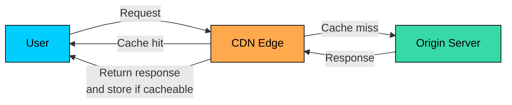
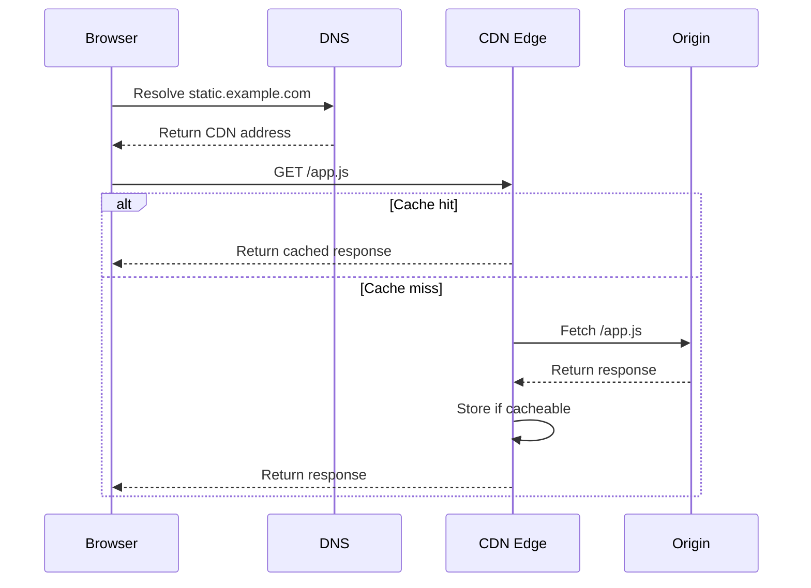

import React from 'react';
import CodeBlock from '../../../../components/ui/CodeBlock';
import Callout from '../../../../components/ui/Callout';

<div className="article-header">
  <div className="breadcrumb">
    <a href="/">Curated Notes</a>
    <span className="breadcrumb-separator">›</span>
    <span className="breadcrumb-current">Content Delivery Network (CDN)</span>
  </div>
  <h1>Content Delivery Network (CDN)</h1>
  <p style={{ color: 'var(--text-muted)', fontSize: '1.1rem', marginBottom: '16px', lineHeight: '1.6' }}>
    Master the essentials of Content Delivery Network (CDN) in this curated guide.
  </p>
  <div className="meta-info">
    <span className="meta-item">
      <svg width="14" height="14" viewBox="0 0 24 24" fill="none" stroke="currentColor" strokeWidth="2"><circle cx="12" cy="12" r="10"/><polyline points="12 6 12 12 16 14"/></svg>
      10 min read
    </span>
    <span className="difficulty-badge difficulty-badge--intermediate">Intermediate</span>
  </div>
</div>

<section className="content-section">

A **Content Delivery Network (CDN)** is a distributed layer of edge servers that sits between users and your origin servers.

Instead of sending every request to one central location, the CDN can serve cached content from an edge location closer to the user. For cache misses, it forwards the request to the origin, stores the response when it is cacheable, and serves later requests from the edge.

CDNs are common in systems that serve users across regions: websites, APIs, video platforms, software downloads, games, news sites, and SaaS products.

Speed is the obvious benefit, but a good CDN setup also reduces origin load, absorbs traffic spikes, improves availability, and gives teams a place to enforce security rules before traffic reaches the application.

In this chapter, we will cover what a CDN does, how request routing works, what CDNs cache, how cache keys, headers, TTLs, and invalidation behave at the edge, the benefits and trade-offs, common use cases, and how to choose a CDN provider.

---

## What a CDN Does

A CDN is a network of **edge locations**, often called **points of presence (PoPs)**. Each edge location runs servers that can terminate client connections, cache responses, and proxy requests to the origin.

The **origin** is the authoritative backend for the content. It might be an object storage bucket, web server, load balancer, API gateway, or application service.





Without a CDN, every user request travels to the origin. With a CDN, many requests stop at the edge.

That changes the scaling problem. The origin no longer needs to serve every image, JavaScript file, video segment, or cacheable API response. It only handles misses, dynamic requests, writes, and content that should not be cached.

---

## How CDN Routing Works

A CDN does not choose an edge only by physical distance. Real routing decisions can be influenced by DNS answers, anycast routing (where the same IP address is announced from multiple locations), network latency, edge capacity, health checks, peering relationships, regional rules, and the customer's CDN configuration.

From the user's point of view, the flow usually looks like this:

1. The user requests [`https://static.example.com/app.js`](https://static.example.com/app.js).
2. DNS resolves the hostname to the CDN, not directly to the origin.
3. The user's request reaches an edge location chosen by the CDN's routing system.
4. The edge checks whether it has a valid cached response for that request.
5. On a cache hit, the edge returns the response immediately.
6. On a cache miss, the edge fetches the response from the origin.
7. If the response is cacheable, the edge stores it for future requests.





The first request for an object in a region may still be slow because it has to reach the origin. The payoff comes when many later requests are served from the edge.

---

## What CDNs Cache

CDNs are best known for caching static assets like images, CSS files, JavaScript bundles, fonts, video segments, audio files, documents, software installers, and game patches. They can also cache some dynamic responses, such as rendered HTML pages, search results, catalog pages, or API responses. This is safe only when the response is the same for everyone who shares the cache key. Do not cache private user data at a shared edge unless the response is keyed correctly and the CDN is configured to prevent cross-user leaks.

A good CDN candidate is read often, does not change on every request, can be served identically to many users, can tolerate a known staleness window, and is large or expensive enough that caching pays off. Poor candidates include account pages, carts, payment flows, admin pages, and responses that depend heavily on private cookies or authorization state.

---

## Cache Keys

A CDN cache is usually a large key-value store. The key decides whether two requests are considered the same object. A basic CDN cache key includes the scheme (such as `https`), host (such as `static.example.com`), path (such as `/images/logo.png`), and sometimes the query string (such as `?w=800`). Many CDNs can also vary the cache key by selected headers or cookies, which is powerful but easy to misconfigure.

If the key is too broad, users may receive the wrong response. For example, if the CDN ignores a language header, a user requesting Spanish content may receive English content.

If the key is too narrow, the hit ratio drops. For example, if the CDN varies on every cookie, most requests become unique and the cache stops helping.

#### Common Cache Key Choices


```shell
Good:
  /assets/app.9f3a1c.js
  /images/product-123.jpg?w=800&format=webp
  /api/catalog?page=2&sort=popular

Risky:
  /api/me
  /checkout
  /admin/users
  /recommendations?user_id=123
```


For public content, keep the key stable and small. For personalized content, bypass shared CDN caching unless you have a carefully designed variation strategy.

---

## HTTP Caching Headers

CDNs usually follow HTTP caching headers from the origin, although provider-specific rules can override them.

Common headers include:


```plaintext
Cache-Control: public, max-age=31536000, immutable
Cache-Control: public, s-maxage=300, stale-while-revalidate=60
Cache-Control: private, max-age=0
Cache-Control: no-store
ETag: "v42"
Last-Modified: Thu, 21 May 2026 10:00:00 GMT
```


Important directives:

- **public:** Shared caches such as CDNs may store the response.
- **private:** The response is intended for one user and should not be stored in a shared cache.
- **max-age:** How long the response can be considered fresh by caches.
- **s-maxage:** Like `max-age`, but specifically for shared caches.
- **no-store:** Do not store the response.
- **immutable:** The asset will not change while it is fresh.
- **stale-while-revalidate:** Serve a stale response briefly while refreshing it in the background, if supported.

`ETag` and `Last-Modified` support validation. When cached content expires, the CDN can ask the origin whether the object changed. If it has not changed, the origin can return `304 Not Modified` instead of sending the full object again.

---

## TTLs and Invalidation

A **TTL** controls how long a CDN can treat cached content as fresh.

Long TTLs give better performance and higher hit ratios. Short TTLs reduce staleness but send more traffic to the origin.

The cleanest pattern for static assets is **versioned URLs**:


```shell
/assets/app.9f3a1c.js
/assets/app.a81c20.js
/images/logo.v7.png
```


When the file changes, its URL changes. The old object can stay cached for a long time because no new page points to it.

For content that keeps the same URL, you need a freshness strategy:

- Use a short TTL.
- Purge the URL when content changes.
- Purge by surrogate key or cache tag if the CDN supports it. This lets you invalidate a group of related objects without listing every URL.
- Use conditional revalidation with `ETag` or `Last-Modified`.
- Use `stale-while-revalidate` for content that can be briefly stale.

Avoid designing a system that requires constant global purges. Purges can take time, have provider limits, and are easy to get wrong during incidents.

---

## Benefits of a CDN

#### Lower Latency

Users often connect to an edge location that is closer in network terms than the origin. This reduces round-trip time for TLS handshakes, HTTP requests, and large downloads.

#### Less Origin Load

Cache hits do not reach the origin. This can dramatically reduce bandwidth, CPU, storage reads, and database pressure.

#### Better Availability

If one edge location has trouble, CDN routing can move traffic elsewhere. Some CDNs can also serve stale cached content when the origin is temporarily unavailable.

#### Traffic Spike Absorption

CDNs are built for high fan-out traffic. They are useful when a product launch, breaking news story, live event, sale, or software release sends many users to the same content.

#### Security at the Edge

Many CDN platforms include DDoS protection, web application firewall rules, bot filtering, TLS management, rate limits, and geo rules. These features do not replace application security, but they reduce the amount of unwanted traffic that reaches the origin.

#### Protocol and Media Optimizations

Depending on the provider, CDNs can support HTTP/2, HTTP/3, compression, image optimization, video packaging, edge compute, and request routing rules.

---

## Trade-offs and Failure Modes

CDNs make systems faster, but they also add another layer to operate.

#### Stale Content

The edge may serve old content until the TTL expires or a purge completes. This is acceptable for images and product listings, but dangerous for prices, permissions, legal text, and account data.

#### Cache Key Bugs

A wrong cache key can either destroy the hit ratio or serve one user's response to another user. Cookie, header, and query string behavior should be reviewed carefully.

#### Origin Overload on Misses

When a popular object expires everywhere at the same time, many edges may fetch it from the origin.

Several techniques reduce this risk:

- **Origin shielding:** Route cache misses through a small number of shield locations before reaching the origin.
- **Request collapsing:** Let one origin fetch satisfy multiple concurrent misses for the same object.
- **Jittered TTLs:** Add small variation to expiration times so many objects do not expire together.
- **Stale-while-revalidate:** Serve slightly stale content while refreshing it in the background.

#### Debugging Complexity

The response may depend on edge location, cache state, headers, cookies, routing rules, and origin behavior. Good logging and response headers are essential.

Useful debug headers include:


```plaintext
Cache-Control: public, s-maxage=300
Age: 123
X-Cache: HIT
X-Request-ID: req_abc123
```


#### Cost

CDN pricing often includes bandwidth, request count, cache fill traffic, invalidations, logs, security features, image processing, and edge compute. Video delivery and large downloads can become expensive.

#### Regional and Compliance Requirements

Some systems must control where data is processed or cached. This matters for regulated data, contractual restrictions, and regional privacy requirements.

---

## Common Use Cases

#### Static Web Assets

The most common use case is serving JavaScript, CSS, fonts, and images from the edge. Versioned filenames and long TTLs work well here.

#### Video and Audio Streaming

Streaming systems split media into many segments. CDNs cache and deliver those segments close to users, reducing buffering and origin bandwidth.

#### Software and Game Downloads

Installers, mobile app assets, game patches, and operating system updates are large and often requested by many users at the same time. CDN caching is a strong fit.

#### Public API and HTML Caching

Some APIs and rendered pages can be cached at the edge, especially catalog pages, documentation pages, search results, and anonymous home pages. The key is to cache only responses that are safe to share.

#### Security Front Door

Many teams put a CDN in front of public applications to terminate TLS, apply WAF rules, block abusive traffic, and route requests before they reach the application stack.

---

## Production Practices

Use these defaults unless your application has a reason to do something different:

- Put immutable static assets on versioned URLs.
- Give immutable assets long TTLs.
- Use short TTLs or explicit purges for content that changes in place.
- Do not cache authenticated or personalized responses in a shared cache by default.
- Keep cookies out of the cache key unless they are required.
- Normalize query strings so equivalent requests map to the same key.
- Use origin shielding or request collapsing for expensive objects.
- Allow stale content briefly for pages where freshness is not critical.
- Add response headers that expose cache status and request IDs.
- Monitor hit ratio per route, not just globally.

Useful metrics to watch include the cache hit ratio, origin request rate and bandwidth, edge and origin latency, 4xx and 5xx rates, cache fill errors, purge volume and purge latency, and the top paths by bandwidth and request count.

A high global hit ratio can hide a bad path. Inspect the endpoints that matter most to the user experience and the origin bill.

---

## CDN Providers

Major CDN providers include:

- [Akamai](https://www.akamai.com/content-delivery-network)
- [Cloudflare](https://www.cloudflare.com/application-services/products/cdn/)
- [Fastly](https://www.fastly.com/products/cdn)
- [Amazon CloudFront](https://aws.amazon.com/cloudfront/)
- [Google Cloud CDN and Media CDN](https://cloud.google.com/cdn)
- [Azure Front Door](https://learn.microsoft.com/en-us/azure/frontdoor/scenarios)

Choose a provider based on your system's needs, not on a generic ranking. Useful selection criteria include geographic coverage for your users, integration with your cloud provider, cache rule flexibility, purge speed and granularity, origin shielding and request collapsing, observability and log delivery, security features, edge compute support, media delivery support, pricing for your traffic pattern, and operational familiarity within your team.

For example, a team already running on AWS may prefer CloudFront because of AWS integration. A media company may care more about video delivery features. A platform team serving dynamic web applications may care about programmable edge logic, fast purges, and detailed logs.

Also check product lifecycle. For example, Microsoft has been moving customers from classic Azure CDN offerings toward Azure Front Door as its modern CDN platform.

---

## Summary

A CDN is an edge layer that improves performance and reliability by serving cacheable content closer to users.

The design work goes well beyond "turn on CDN." Most of the effort is in deciding what can be cached, how the cache key is built, how freshness is controlled, how content is invalidated, and how the origin is protected during misses.

For static assets, use versioned URLs and long TTLs. For dynamic or semi-dynamic content, be explicit about cache keys, headers, and staleness. For private data, bypass shared caching unless the design has been reviewed carefully.

A well-configured CDN makes a global system faster, cheaper to operate, and more resilient. A carelessly configured one can hide stale data, leak personalized responses, or turn cache misses into origin incidents.

</section>
