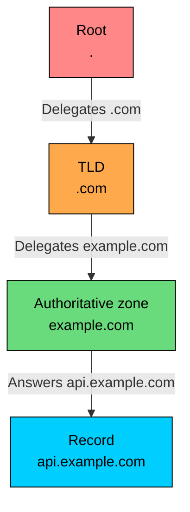
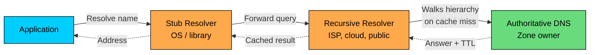
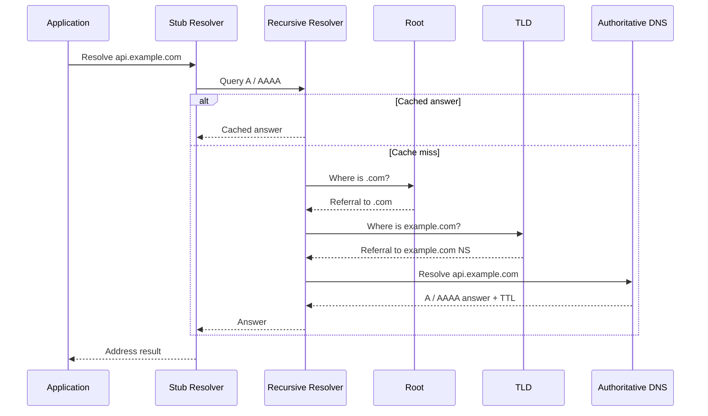
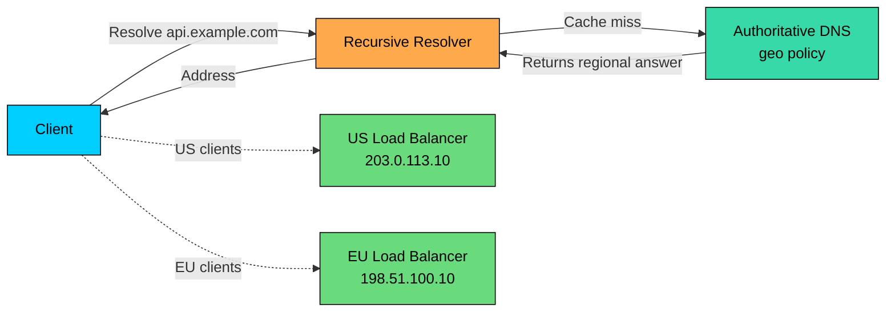

import React from 'react';
import CodeBlock from '../../../../components/ui/CodeBlock';
import Callout from '../../../../components/ui/Callout';

<div className="article-header">
  <div className="breadcrumb">
    <a href="/">Curated Notes</a>
    <span className="breadcrumb-separator">›</span>
    <span className="breadcrumb-current">Domain Name System (DNS)</span>
  </div>
  <h1>Domain Name System (DNS)</h1>
  <p style={{ color: 'var(--text-muted)', fontSize: '1.1rem', marginBottom: '16px', lineHeight: '1.6' }}>
    Master the essentials of Domain Name System (DNS) in this curated guide.
  </p>
  <div className="meta-info">
    <span className="meta-item">
      <svg width="14" height="14" viewBox="0 0 24 24" fill="none" stroke="currentColor" strokeWidth="2"><circle cx="12" cy="12" r="10"/><polyline points="12 6 12 12 16 14"/></svg>
      10 min read
    </span>
    <span className="difficulty-badge difficulty-badge--intermediate">Intermediate</span>
  </div>
</div>

<section className="content-section">

**DNS (Domain Name System)** is the distributed, hierarchical naming system that turns names such as `api.example.com` into the records clients need to connect to a service. It is also one of the first control planes engineers reach for to point a domain at a load balancer, move traffic between regions, or publish mail and security records.

DNS matters in system design because it sits before almost every network connection. If DNS is slow, stale, poisoned, blocked, or misconfigured, the application may never receive a request.

DNS is also cached by design, built for scale and availability rather than instant global consistency, which shapes how every change propagates through the system.

---

## 1. What DNS Does

DNS maps a **domain name** to one or more **resource records**.

Examples:


```plaintext
api.example.com.      300  IN  A      203.0.113.10
api.example.com.      300  IN  AAAA   2001:db8::10
www.example.com.      300  IN  CNAME  edge.example-cdn.net.
example.com.          3600 IN  MX 10  mail.example.com.
```


Each record has:

- **Name:** The domain name, such as `api.example.com`.
- **TTL:** How long resolvers may cache the answer.
- **Class:** Almost always `IN` for Internet.
- **Type:** `A`, `AAAA`, `CNAME`, `MX`, `TXT`, and so on.
- **Value:** The record data.

DNS is hierarchical. The root delegates to top-level domains such as `.com`. The `.com` registry delegates `example.com` to authoritative name servers. Those authoritative name servers hold the records for the zone.





There are 13 logical root server identities, named A through M. They are not 13 physical machines. They are served by many instances around the world, commonly using anycast.

---

## 2. How DNS Resolution Works

Most applications do not query authoritative DNS servers directly. They ask a local **stub resolver**, which forwards the query to a **recursive resolver**.

Common recursive resolvers include:

- ISP resolvers
- Enterprise resolvers
- Cloud VPC resolvers
- Kubernetes DNS components
- Public resolvers such as Cloudflare `1.1.1.1` or Google Public DNS `8.8.8.8`

If the recursive resolver has a cached answer, it returns it immediately. If not, it walks the DNS hierarchy.





Step by step:

1. The application asks the operating system to resolve `api.example.com`.
2. The operating system's stub resolver asks a recursive resolver.
3. The recursive resolver asks a root server where to find `.com`.
4. The root server returns a referral to `.com` TLD name servers.
5. The resolver asks a `.com` TLD server where to find `example.com`.
6. The TLD server returns the authoritative name servers for `example.com`.
7. The resolver asks an authoritative name server for `api.example.com`.
8. The authoritative server returns the requested record set and TTL.
9. The resolver caches the answer and returns it to the client.





This recursive resolver behavior is why authoritative DNS providers do not see every client lookup. They usually see cache misses from recursive resolvers, not every end-user request.

DNS traditionally uses UDP port `53` for ordinary queries. It also uses TCP port `53`, especially for large responses, retries after truncated UDP responses, and zone transfers between name servers. Encrypted resolver protocols use different transports: DoT commonly uses TLS on port `853`, while DoH sends DNS queries over HTTPS on port `443`.

---

## 3. Recursive vs Iterative Queries

DNS uses two query patterns.

**Recursive query:** The client asks a resolver to return the final answer or an error. The resolver does the work of following referrals.

**Iterative query:** A server returns the best information it has, often a referral to another server. The requester continues from there.

In normal client behavior, your laptop or application runtime sends a recursive query to its configured resolver. The recursive resolver then uses iterative queries against root, TLD, and authoritative servers.


| Query Type | Who Uses It                         | Behavior                          |
| ---------- | ----------------------------------- | --------------------------------- |
| Recursive  | Client to recursive resolver        | "Find the final answer for me."   |
| Iterative  | Recursive resolver to DNS hierarchy | "Here is the next server to ask." |


This distinction matters for debugging. If `dig @8.8.8.8 api.example.com` works but `dig @ns1.example-dns.com api.example.com` fails, the recursive resolver may be masking an authoritative problem from cache.

---

## 4. DNS Simulation


---

## 5. DNS Components

#### Domain Registrar

The registrar is where a domain is registered, such as `example.com`. The registrar controls which authoritative name servers are listed for the domain at the registry.

Changing DNS records and changing name server delegation are different operations. Updating an `A` record at your DNS provider is not the same as changing which name servers own the domain.

#### Registry and TLD Servers

A registry operates a top-level domain such as `.com`, `.org`, or a country-code TLD. TLD servers do not store every `api.example.com` record. They store delegation data that points resolvers to the authoritative name servers for `example.com`.

#### Authoritative Name Servers

Authoritative name servers hold the source-of-truth records for a zone, such as `example.com`.

If you run `api.example.com` on a cloud load balancer, the authoritative DNS record might point to that load balancer. If you move to a CDN, the authoritative record might become a `CNAME` to the CDN provider.

#### Recursive Resolvers

Recursive resolvers do the lookup work for clients and cache results. They are performance-critical and security-sensitive. A slow or broken recursive resolver can make healthy services look down.

#### Stub Resolvers

The stub resolver is the client-side resolver library or OS component. It usually forwards queries to a recursive resolver configured through DHCP, VPN, container runtime, `/etc/resolv.conf`, or platform settings.

Stub resolver behavior varies. Some cache. Some do not. Some application runtimes cache DNS longer than expected. Java, browsers, mobile SDKs, service meshes, and libc implementations can all behave differently.

---

## 6. DNS Record Types

DNS is a typed database. These records show up constantly in production.


| Record         | Purpose                                    | Example                                               |
| -------------- | ------------------------------------------ | ----------------------------------------------------- |
| `A`            | Maps a name to an IPv4 address             | `api.example.com -> 203.0.113.10`                     |
| `AAAA`         | Maps a name to an IPv6 address             | `api.example.com -> 2001:db8::10`                     |
| `CNAME`        | Points one name at another name            | `www.example.com -> edge.provider.net`                |
| `MX`           | Mail routing for a domain                  | `example.com -> mail.example.com`                     |
| `TXT`          | Text data for verification and policy      | SPF, DKIM, ownership verification                     |
| `NS`           | Delegates a zone to name servers           | `example.com -> ns1.provider.net`                     |
| `SOA`          | Zone authority and timing metadata         | Serial, refresh, retry, negative cache TTL            |
| `CAA`          | Restricts which CAs may issue certificates | `letsencrypt.org`                                     |
| `SRV`          | Service location with port and priority    | Some internal and legacy service discovery            |
| `HTTPS / SVCB` | Service binding hints                      | HTTP/3, alternative endpoints, ECH-related deployment |


Two practical notes are worth remembering. A `CNAME` points to another name, not directly to an IP address, so the resolver must continue resolving the target. And standard DNS does not allow a `CNAME` at the zone apex if other records such as `SOA` and `NS` exist there, which is why many providers offer `ALIAS`, `ANAME`, or CNAME flattening as provider-specific workarounds.

---

## 7. TTL and Caching

DNS caching is controlled by **TTL (Time To Live)**. A TTL tells resolvers how long they may reuse an answer.


```plaintext
api.example.com.  60  IN  A  203.0.113.10
```


This answer can be cached for up to 60 seconds by a resolver that receives it.

TTL is a tradeoff:


| TTL             | Behavior                       | Tradeoff                           |
| --------------- | ------------------------------ | ---------------------------------- |
| 30-60 seconds   | Faster changes and failover    | More DNS query volume              |
| 300-600 seconds | Good default for many services | Changes are not immediate          |
| 3600+ seconds   | Cache-friendly and stable      | Poor fit for active traffic shifts |


Low TTL does not mean instant change. Existing caches may keep old answers until they expire. Some resolvers enforce minimums. Some clients cache independently. Some applications resolve once at startup and never refresh until restarted.

#### Negative Caching

DNS also caches failures. If a resolver receives `NXDOMAIN` for a name, it may cache that negative result based on zone metadata, commonly from the SOA record.

This matters during rollouts. If clients look up `new-api.example.com` before the record exists, they may cache the failure and continue failing after you create the record.

#### CNAME Chains

CNAME chains add lookup steps:


```plaintext
www.example.com.       300 IN CNAME example.cdn.net.
example.cdn.net.       60  IN CNAME edge.provider.net.
edge.provider.net.     60  IN A     203.0.113.20
```


Short chains are normal. Long chains add latency, increase failure points, and make migrations harder to reason about.

---

## 8. DNS and Traffic Steering

DNS can steer traffic by returning different answers for the same hostname.

Common policies include:

- Weighted records
- Geo-based answers
- Latency-based answers
- Health-check-based failover
- Regional routing
- Blue-green or canary migration

DNS steering is useful, but coarse. It happens at resolution time, not request time. A resolver may cache an answer and serve it to many clients. DNS does not know current CPU load, connection count, queue depth, tenant, user identity, or HTTP path.

Use DNS for global or regional entry-point selection. Use load balancers, gateways, service meshes, or application routing for per-request decisions.

Example:





---

## 9. DNS Security

DNS has several security concerns. The right control depends on the threat.

#### DNSSEC

**DNSSEC** signs DNS records so resolvers can validate that answers came from the zone owner and were not modified. It provides authenticity and integrity for DNS data.

DNSSEC does not encrypt DNS queries. Observers can still see what name is being queried unless another privacy mechanism is used.

Operationally, DNSSEC adds key management. Broken signatures, expired keys, or bad DS records can make a domain fail validation even when the underlying service is healthy.

#### DoT and DoH

**DNS over TLS (DoT)** and **DNS over HTTPS (DoH)** encrypt DNS traffic between the client and recursive resolver.

They protect the client-to-resolver path from passive observation or tampering. They do not automatically hide queries from the recursive resolver itself, and they do not replace DNSSEC's data-origin validation.

#### Cache Poisoning and Spoofing

DNS cache poisoning tries to make a resolver cache a forged answer. Modern resolvers use defenses such as source-port randomization, query ID randomization, bailiwick checking, DNSSEC validation, and hardened resolver behavior.

For application teams, the main lesson is simple: use reputable DNS providers, enable DNSSEC when you can operate it correctly, protect registrar access, and monitor domain and certificate changes.

---

## 10. Private DNS and Service Discovery

DNS is not only for the public internet.

Private DNS is common in:

- Cloud VPCs
- Kubernetes clusters
- Corporate networks
- VPN-connected environments
- Service meshes and internal platforms

Examples:


```plaintext
payments.production.svc.cluster.local.  30 IN A 10.20.4.15
db.internal.example.com.                60 IN A 10.0.12.8
```


Private DNS introduces its own failure modes:

- Split-horizon records return different answers inside and outside the network.
- VPN clients may use the wrong resolver.
- Search domains and `ndots` settings can create surprising query volume.
- Internal names may leak to public resolvers if resolver configuration is wrong.
- Short TTLs can overload cluster DNS during traffic spikes.

In Kubernetes, DNS is the common service discovery interface, but high-QPS systems still need to understand caching, connection reuse, and service mesh behavior. Resolving a name on every request is usually a bad design.

---

## 11. DNS Failure Modes

DNS failures often look like application failures until you check resolution explicitly.


| Symptom                                 | Likely Cause                                                    |
| --------------------------------------- | --------------------------------------------------------------- |
| `NXDOMAIN`                              | Name does not exist, wrong zone, or negative cache              |
| `SERVFAIL`                              | DNSSEC validation failure, authoritative outage, resolver issue |
| Slow first request                      | DNS lookup latency, long CNAME chain, resolver problem          |
| Some users reach old endpoint           | Cached old answers or resolver TTL behavior                     |
| Works on VPN but not outside            | Split-horizon DNS or private zone dependency                    |
| Works with one resolver but not another | Propagation, DNSSEC, cache, or resolver policy difference       |
| Browser works, backend fails            | Different resolver path or runtime DNS cache                    |


Useful debugging commands:


```shell
dig api.example.com A
dig api.example.com AAAA
dig +trace api.example.com
dig @1.1.1.1 api.example.com
dig @8.8.8.8 api.example.com
dig NS example.com
dig SOA example.com
```


When debugging production DNS, compare:

- Public resolver vs corporate resolver
- Inside VPC vs outside VPC
- Authoritative answer vs recursive cached answer
- A and AAAA records
- DNSSEC-validating vs non-validating resolver
- Application runtime behavior vs command-line resolver behavior

---

## 12. DNS in System Design

Use DNS deliberately.

#### Use Stable Names

Applications should depend on stable names, not hard-coded IP addresses.

Good:


```shell
DATABASE_HOST=db.internal.example.com
MODEL_API_URL=https://models.example.com
```


Bad:


```shell
DATABASE_HOST=10.0.12.8
MODEL_API_URL=https://203.0.113.40
```


Names let you move services, rotate infrastructure, change providers, and issue certificates without changing application configuration.

#### Plan TTLs Before Migrations

Lower TTLs before a planned migration, wait for old caches to age out, then change records. After the migration stabilizes, raise TTLs if the record is stable.

Do not lower a TTL at the same moment you need the change. Resolvers that already cached the old longer TTL can keep using it.

#### Separate DNS From Request Routing

DNS is a good place to choose a region or entry point. It is not a good place to choose the exact backend for each request.

For example, an AI inference platform might use:

- DNS to route `api.example.com` to the nearest healthy edge region
- A load balancer to distribute connections inside the region
- An API gateway to authenticate and rate limit
- An application router to choose a model pool
- Service discovery to find healthy inference workers

Each layer has a different job.

---

## 13. Key Takeaways

DNS is a distributed, hierarchical, cached database for names and typed records.

The practical points:

- DNS maps names to records, not only to IP addresses.
- Clients usually query recursive resolvers, not authoritative servers directly.
- Root and TLD servers return referrals; authoritative servers provide final answers for their zones.
- TTLs control cache lifetime, but DNS changes are not instant.
- Negative answers can be cached too.
- DNS can steer traffic, but only coarsely and only at resolution time.
- DNSSEC signs DNS data; it does not encrypt queries.
- DoH and DoT encrypt client-to-resolver traffic; they do not replace DNSSEC.
- Private DNS is essential in cloud and Kubernetes systems, but it has its own failure modes.

When DNS works, no one thinks about it. When it does not, the failures appear as intermittent outages, slow first requests, failed migrations, broken certificates, unreachable services, and incident calls that start with "it works on my machine."

</section>
