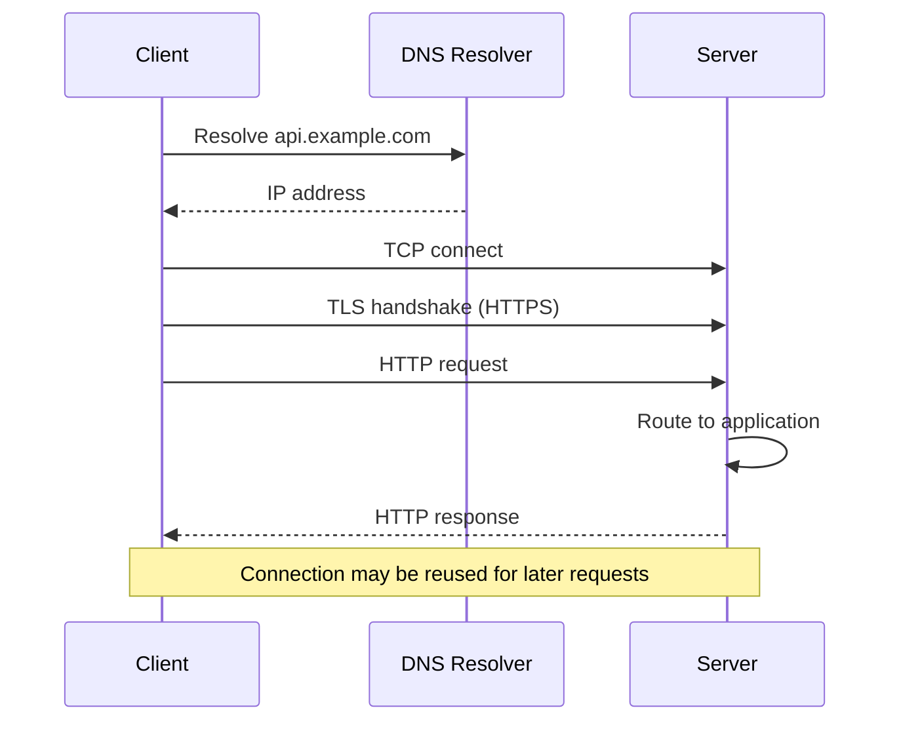
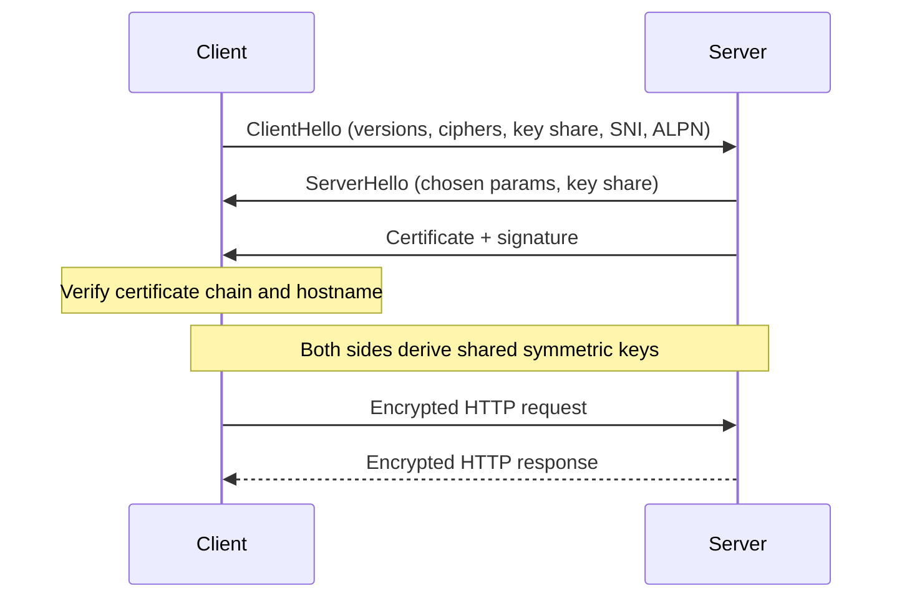

import React from 'react';
import CodeBlock from '../../../../components/ui/CodeBlock';
import Callout from '../../../../components/ui/Callout';

<div className="article-header">
  <div className="breadcrumb">
    <a href="/">Curated Notes</a>
    <span className="breadcrumb-separator">›</span>
    <span className="breadcrumb-current">HTTP/HTTPS</span>
  </div>
  <h1>HTTP/HTTPS</h1>
  <p style={{ color: 'var(--text-muted)', fontSize: '1.1rem', marginBottom: '16px', lineHeight: '1.6' }}>
    Master the essentials of HTTP/HTTPS in this curated guide.
  </p>
  <div className="meta-info">
    <span className="meta-item">
      <svg width="14" height="14" viewBox="0 0 24 24" fill="none" stroke="currentColor" strokeWidth="2"><circle cx="12" cy="12" r="10"/><polyline points="12 6 12 12 16 14"/></svg>
      10 min read
    </span>
    <span className="difficulty-badge difficulty-badge--intermediate">Intermediate</span>
  </div>
</div>

<section className="content-section">

**HTTP (Hypertext Transfer Protocol)** is the application protocol behind the web, most public APIs, and a large share of internal service-to-service traffic. **HTTPS** is the same protocol carried over **TLS (Transport Layer Security)**, which is the default in production.

Plain HTTP is mostly limited to local development, tightly controlled internal health checks, and the redirect that sends a client to the HTTPS version of a URL. Anything user-facing or security-sensitive runs over HTTPS, and modern browsers warn or block features that do not.

The same HTTP semantics, the methods, status codes, headers, and bodies, are preserved across very different transports underneath. HTTP/1.1 and HTTP/2 run over TCP, while HTTP/3 runs over QUIC over UDP, which is one of the main complications when reasoning about HTTP at scale.

---

## 1. What HTTP Is

**HTTP (Hypertext Transfer Protocol)** is an application-layer protocol for exchanging requests and responses. A client sends a request. A server returns a response.

HTTP defines semantics:

- Methods such as `GET`, `POST`, `PUT`, and `DELETE`
- Status codes such as `200`, `404`, `429`, and `503`
- Headers such as `Content-Type`, `Authorization`, `Cache-Control`, and `ETag`
- Message bodies such as HTML, JSON, images, protobuf, or event streams
- Caching, conditional requests, redirects, content negotiation, and authentication hooks

HTTP is not tied to one transport forever. HTTP/1.1 and HTTP/2 commonly run over TCP, while HTTP/3 runs over QUIC, which itself runs over UDP. HTTP is an application protocol, not a wire format glued to TCP. HTTP/1.1 messages are textual, while HTTP/2 and HTTP/3 use binary framing and preserve the same HTTP semantics.

---

## 2. HTTP Request and Response

A typical HTTP exchange has three parts:

1. A request line or protocol-specific equivalent
2. Headers
3. An optional body

**Request:**


```shell
GET /v1/models?limit=20 HTTP/1.1
Host: api.example.com
Accept: application/json
Authorization: Bearer <token>
User-Agent: example-client/1.4
```


**Response:**


```shell
HTTP/1.1 200 OK
Content-Type: application/json
Cache-Control: private, max-age=60
Date: Mon, 25 May 2026 10:00:00 GMT

{
  "data": [
    { "id": "model-small", "status": "available" }
  ]
}
```


The request target identifies the resource. Headers carry metadata. The body carries the representation or command payload when the method allows one.

HTTP/2 and HTTP/3 do not send this exact textual format on the wire, but the same concepts remain: method, scheme, authority, path, headers, status, and body.

---

## 3. How HTTP Works

At a high level, an HTTP request follows this path:





1. The client resolves the hostname through DNS.
2. The client opens or reuses a transport connection.
3. For HTTPS, the client and server perform a TLS handshake.
4. The client sends an HTTP request.
5. The server routes the request to application code or an upstream service.
6. The server sends an HTTP response.
7. The connection may be reused for later requests.

This flow hides many production components: CDNs, WAFs, API gateways, reverse proxies, service meshes, load balancers, sidecars, and application servers. Each can read or modify HTTP metadata if it terminates TLS or operates after TLS termination.

#### Stateless Protocol, Stateful Systems

HTTP is stateless at the protocol semantics level. A request should contain enough information for the server to understand it without relying on an implicit protocol session.

That does not mean web systems are stateless. They often use:

- Cookies
- Session stores
- OAuth access tokens
- JWTs
- CSRF tokens
- Connection pools
- Sticky load balancing
- Server-side caches

The important design question is where state lives and what happens when a request is retried, routed to another server, or arrives after a timeout.

---

## 4. Methods and Status Codes

HTTP methods carry semantics that clients, proxies, gateways, and retry logic can rely on.


| Method | Common Use | Safe | Idempotent |
| --- | --- | --- | --- |
| `GET` | Read a resource | Yes | Yes |
| `HEAD` | Read response headers only | Yes | Yes |
| `POST` | Create a subordinate resource or start a command | No | No by default |
| `PUT` | Replace or create a resource at a known URI | No | Yes |
| `PATCH` | Partially update a resource | No | Not guaranteed |
| `DELETE` | Delete a resource | No | Yes |


**Safe** means the client did not ask for a state change. **Idempotent** means repeating the same request has the same intended effect as sending it once.

Idempotency is not trivia. It controls whether clients can safely retry after timeouts, connection resets, and load balancer failures. `POST /payments` should usually require an idempotency key. `GET /orders/123` should not mutate state.

Status codes should be specific enough for clients and operators to act on:


| Range | Meaning | Examples |
| --- | --- | --- |
| `1xx` | Informational | `100 Continue`, `103 Early Hints` |
| `2xx` | Success | `200 OK`, `201 Created`, `204 No Content` |
| `3xx` | Redirect or alternate location | `301 Moved Permanently`, `302 Found`, `304 Not Modified` |
| `4xx` | Client-side problem | `400 Bad Request`, `401 Unauthorized`, `403 Forbidden`, `404 Not Found`, `409 Conflict`, `429 Too Many Requests` |
| `5xx` | Server-side or upstream problem | `500 Internal Server Error`, `502 Bad Gateway`, `503 Service Unavailable`, `504 Gateway Timeout` |


Use status codes as part of the API contract. A vague `500` for validation errors forces clients to guess. A `200` with an error object breaks caches, metrics, SDKs, and retry policies.

---

## 5. Caching and Conditional Requests

HTTP has mature caching semantics. Used well, they reduce latency, origin load, cloud spend, and failure blast radius.

Important headers include:


| Header | Purpose |
| --- | --- |
| `Cache-Control` | Defines who may cache and for how long |
| `ETag` | Entity validator for conditional requests |
| `If-None-Match` | Client asks whether an ETag is still current |
| `Last-Modified` | Timestamp validator |
| `Vary` | Tells caches which request headers affect the response |
| `Content-Encoding` | Indicates compression such as `gzip`, `br`, or `zstd` |


For example, a client can avoid downloading an unchanged response:


```shell
GET /assets/app.js HTTP/1.1
If-None-Match: "a9f31"

HTTP/1.1 304 Not Modified
ETag: "a9f31"
```


Caching is not only for browsers. CDNs, API gateways, package registries, feature stores, model metadata endpoints, and documentation sites all benefit from correct cache headers. For personalized or sensitive responses, use restrictive directives such as `Cache-Control: private` or `no-store` where appropriate.

---

## 6. What HTTPS Adds

**HTTPS** is HTTP over TLS. TLS is the modern protocol. SSL is obsolete terminology and should not be used for new systems.

HTTPS provides three main protections:

1. **Confidentiality:** Intermediaries on the network cannot read the HTTP request or response body.
2. **Integrity:** Intermediaries cannot modify protected traffic without detection.
3. **Server authentication:** The client can verify that it is talking to a server authorized for the hostname.

HTTPS does not solve every security problem:

- It does not authenticate the user unless the application adds authentication.
- It does not make a vulnerable API safe.
- It does not hide the destination IP address.
- It may still expose the hostname through DNS and, depending on deployment, SNI.
- It does not prevent a compromised endpoint from reading data.

Still, HTTPS is table stakes. Browsers warn on plain HTTP. Many platform features require secure contexts. Production APIs should assume HTTPS from the first design review.

---

## 7. How TLS Works

The secure connection in HTTPS is established through a **TLS handshake**.





A modern TLS 1.3 handshake does roughly this:

1. **ClientHello:** The client sends supported TLS versions, cipher suites, key share, SNI, and ALPN options.
2. **ServerHello:** The server chooses protocol parameters and returns its key share.
3. **Certificate:** The server sends a certificate chain proving it is authorized for the hostname.
4. **Certificate verification:** The client checks hostname, validity period, signature chain, trust anchor, and policy constraints.
5. **Key derivation:** Both sides derive shared symmetric keys from the key exchange.
6. **Encrypted HTTP:** Application data flows under the negotiated keys.

Older TLS explanations often describe RSA key transport and a "pre-master secret" encrypted with the server's public key. That is not the normal TLS 1.3 model. Modern TLS uses ephemeral key exchange, commonly based on ECDHE, which provides forward secrecy.

TLS also uses **ALPN (Application-Layer Protocol Negotiation)** so the client and server can agree on protocols such as `http/1.1` or `h2`. HTTP/3 uses QUIC, where TLS 1.3 is integrated into the QUIC handshake.

#### 0-RTT

TLS 1.3 and QUIC can support 0-RTT data for repeat connections. This can reduce latency, but early data can be replayed. Use it only for operations that are safe to replay, such as idempotent reads.

---

## 8. HTTP vs HTTPS


| Feature | HTTP | HTTPS |
| --- | --- | --- |
| **Protection** | Plaintext | Encrypted and integrity-protected with TLS |
| **Common Port** | 80 | 443 |
| **Server Authentication** | None by default | Certificate-based hostname verification |
| **Tamper Resistance** | None | Protected by TLS |
| **Browser Treatment** | Marked insecure for many contexts | Required for most production web features |
| **Production Use** | Redirects, local development, tightly controlled internal cases | Default for web apps, APIs, mobile backends, and service endpoints |


Do not choose HTTP for performance. TLS overhead is usually small compared with application work, database calls, network distance, and payload size. Connection reuse, TLS 1.3, HTTP/2, HTTP/3, session resumption, and hardware acceleration have made HTTPS practical as the default.

---

## 9. HTTP Versions

HTTP has evolved without changing its core request-response semantics.

#### HTTP/1.1

HTTP/1.1 made persistent connections the default and added important semantics around hostnames, caching, content negotiation, range requests, and transfer encodings.

Operationally, HTTP/1.1 is simple and widely supported. Its weakness is concurrency. A single connection handles responses in order. Clients often open multiple connections to the same origin to work around this. HTTP pipelining exists in the specification, but it was difficult to deploy safely and never became the normal browser behavior.

#### HTTP/2

HTTP/2 keeps HTTP semantics but changes the wire format to binary framing.

It adds:

- Multiplexed streams over one TCP connection
- Header compression with HPACK
- Stream priorities, though real-world support has varied
- Better connection reuse than HTTP/1.1

HTTP/2 reduces application-layer head-of-line blocking because multiple requests can be in flight on one connection. It does not eliminate TCP-level head-of-line blocking. If a TCP segment is lost, all streams on that TCP connection can be stalled until the missing bytes are recovered.

HTTP/2 server push was part of the original design, but it proved difficult to use effectively and has been removed or disabled in major browser implementations. Do not design new systems around server push.

#### HTTP/3

HTTP/3 keeps HTTP semantics but runs over **QUIC** instead of TCP. QUIC runs over UDP and includes TLS 1.3, stream multiplexing, recovery, flow control, congestion control, and connection migration.

HTTP/3 helps with:

- Reducing TCP-level head-of-line blocking between streams
- Faster connection setup in some cases
- Better behavior when mobile clients change networks
- User-space transport evolution without waiting for OS TCP changes

HTTP/3 is not automatically faster for every workload. UDP may be blocked or degraded on some networks. Operators need fallback to HTTP/2 or HTTP/1.1, plus visibility into QUIC handshake failures, HTTP/3 adoption, and performance by client network.


| Version | Transport | Wire Format | Main Benefit | Main Caveat |
| --- | --- | --- | --- | --- |
| HTTP/1.1 | TCP | Textual messages | Universal support, simple debugging | Limited concurrency per connection |
| HTTP/2 | TCP | Binary frames | Multiplexing and header compression | Still affected by TCP-level head-of-line blocking |
| HTTP/3 | QUIC over UDP | Binary HTTP/3 frames over QUIC | Stream-level recovery and connection migration | UDP reachability and operational maturity |


---

## 10. HTTP in Distributed Systems

HTTP is easy to start with and easy to abuse. Production systems need discipline around failure behavior.

#### Timeouts

Every HTTP client should set timeouts:

- DNS resolution timeout
- Connection timeout
- TLS handshake timeout
- Request write timeout
- Response header timeout
- Overall deadline
- Idle connection timeout

The defaults in many libraries are unsafe for production. A missing timeout can turn one slow upstream into thread exhaustion, connection pool starvation, or a cascading failure.

#### Retries

Retries should respect method semantics and application idempotency.

- Retrying `GET` is usually safe.
- Retrying `POST` can create duplicates unless the API supports idempotency keys.
- Retrying after a timeout is ambiguous: the server may have processed the request.
- Retrying too aggressively can amplify an outage.

Use bounded retries, backoff, jitter, deadlines, and clear retry budgets.

#### Streaming

HTTP is not only for short JSON responses. Streaming is common in modern systems:

- Server-Sent Events for token streaming
- Chunked HTTP responses for incremental output
- WebSockets for bidirectional communication
- gRPC streaming over HTTP/2
- HTTP/3 streams over QUIC

For AI products, streaming changes user experience and infrastructure behavior. You need cancellation, idle timeouts, backpressure, partial failure handling, and metrics for time to first token and stream completion.

#### Proxies and Headers

Most production HTTP requests pass through proxies or load balancers. Applications need to handle forwarded metadata carefully:

- `Host`
- `X-Forwarded-For`
- `X-Forwarded-Proto`
- `Forwarded`
- `X-Request-ID` or `traceparent`
- `Authorization`

Only trust forwarding headers from infrastructure you control. Public clients can forge headers unless the edge proxy sanitizes them.

#### Observability

HTTP gives excellent operational signals:

- Request rate
- Latency percentiles
- Status code distribution
- Retry rate
- Payload size
- TLS handshake failures
- Upstream error rate
- Cache hit ratio
- Time to first byte
- Stream duration

Use these signals by route, method, status class, client, region, and upstream. Aggregate averages hide the failures users experience.

---

## 11. Key Takeaways

HTTP is the protocol semantics of the web: methods, resources, headers, status codes, caching, and bodies.

HTTPS is HTTP protected by TLS. It provides confidentiality, integrity, and server authentication, but it does not replace application security.

The practical points:

- Use HTTPS by default for production traffic.
- Treat HTTP method semantics as part of the API contract.
- Use precise status codes and cache headers.
- Understand that HTTP/1.1, HTTP/2, and HTTP/3 preserve semantics but differ greatly on the wire.
- Do not claim HTTP/2 eliminates all head-of-line blocking; TCP can still block all streams.
- Do not build new designs around HTTP/2 server push.
- Use HTTP/3 where QUIC's properties help, but keep fallback and observability.
- Set timeouts, retries, deadlines, and idempotency rules deliberately.

HTTP looks simple because the tooling is familiar. At scale, the hard parts are the same as any distributed system: latency, retries, overload, state, security, compatibility, and failure visibility.

---

## Quiz

</section>
