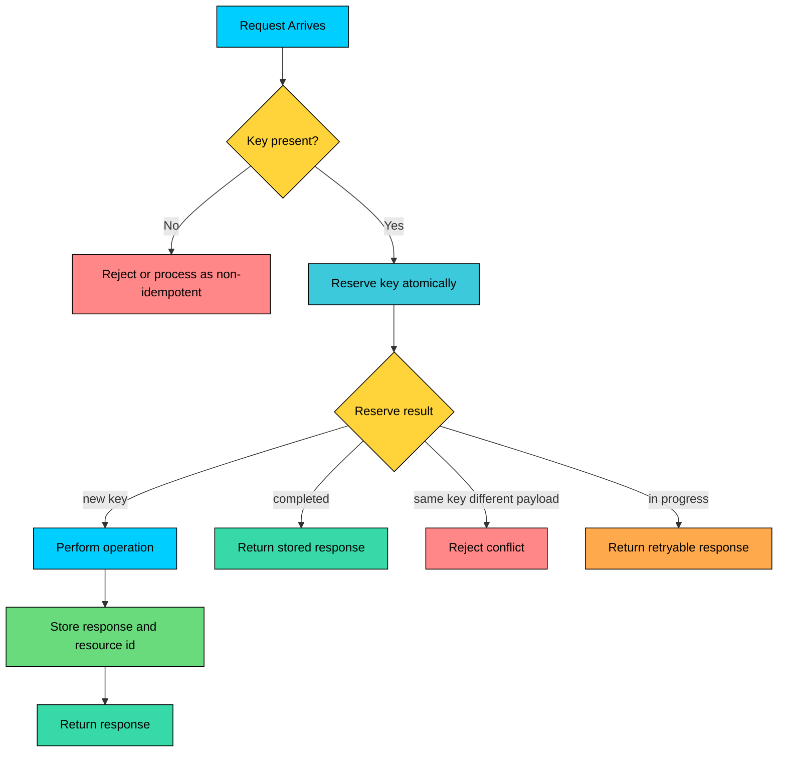
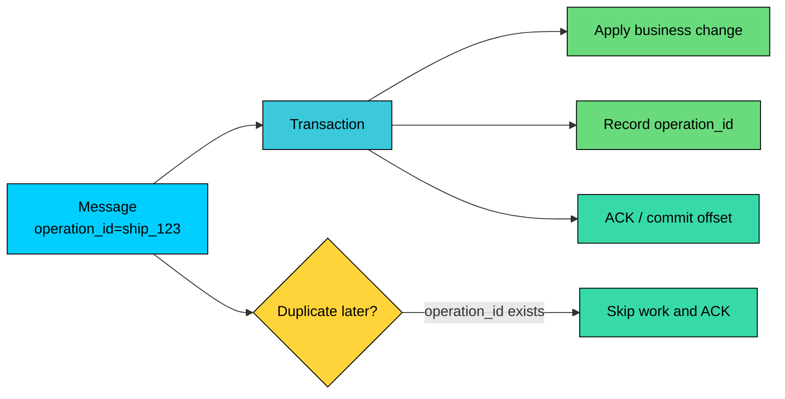

import React from 'react';
import CodeBlock from '../../../../components/ui/CodeBlock';
import Callout from '../../../../components/ui/Callout';

<div className="article-header">
  <div className="breadcrumb">
    <a href="/">Curated Notes</a>
    <span className="breadcrumb-separator">›</span>
    <span className="breadcrumb-current">Idempotency</span>
  </div>
  <h1>Idempotency</h1>
  <p style={{ color: 'var(--text-muted)', fontSize: '1.1rem', marginBottom: '16px', lineHeight: '1.6' }}>
    Master the essentials of Idempotency in this curated guide.
  </p>
  <div className="meta-info">
    <span className="meta-item">
      <svg width="14" height="14" viewBox="0 0 24 24" fill="none" stroke="currentColor" strokeWidth="2"><circle cx="12" cy="12" r="10"/><polyline points="12 6 12 12 16 14"/></svg>
      10 min read
    </span>
    <span className="difficulty-badge difficulty-badge--intermediate">Intermediate</span>
  </div>
</div>

<section className="content-section">

**Idempotency** is the property that running an operation multiple times has the same intended effect as running it once. It is what lets a client safely retry a request after a network failure, a timeout, or an ambiguous response.

Distributed systems need retries. Networks drop, clients time out, processes crash, brokers redeliver, and operators replay failed work. Without idempotency, those retries can charge a customer twice, create duplicate orders, send the same email three times, or corrupt downstream state.

Idempotency applies beyond HTTP APIs. It matters anywhere work can be retried, replayed, or delivered more than once: payment APIs, order creation, webhook handlers, message consumers, background jobs, data pipelines, and model-run submission.

---

## 1. What Idempotency Means

An operation is **idempotent** when running it multiple times has the same intended effect as running it once.


| Operation                                                         | Idempotent? | Reason                                                                                                                                                   |
| ----------------------------------------------------------------- | ----------- | -------------------------------------------------------------------------------------------------------------------------------------------------------- |
| Set user status to `ACTIVE`                                       | Yes         | Repeating the write leaves the same target state                                                                                                         |
| Delete session `sess_123`                                         | Yes         | The session is absent after the first delete                                                                                                             |
| Upload the same file to the same object key (overwrite semantics) | Yes         | The same object is replaced with the same content. Not idempotent on versioned buckets, which create a new version per upload, or on append-mode storage |
| Increment login count                                             | No          | Each retry increments the counter again                                                                                                                  |
| Append an item to a list                                          | No          | Each retry appends another item                                                                                                                          |
| Create payment without an operation ID                            | No          | Each retry can create a new payment                                                                                                                      |


Idempotency is about **effect**, not identical responses.

For example, the first `DELETE /sessions/sess_123` might return `204 No Content`. A retry on a resource that is already gone often returns `404 Not Found`, though some APIs choose to return `204` again to keep retries simple. The responses differ, but the final state is the same: the session no longer exists.

For client experience, many APIs still return the original response for a duplicate retry. That keeps the caller from having to interpret a successful duplicate as an error.

---

## 2. Natural Idempotency vs Engineered Idempotency

Some operations are naturally idempotent because they set a target state.


```sql
UPDATE users
SET status = 'ACTIVE'
WHERE id = 123;
```


Running this statement several times leaves the user in the same state.

Other operations are not naturally idempotent because they apply a delta or create a new resource every time.


```sql
UPDATE inventory
SET stock = stock + 10
WHERE item_id = 1;
```


Each retry adds 10 more units. To make this safe, attach a stable operation ID:


```sql
INSERT INTO inventory_changes (operation_id, item_id, delta)
VALUES ('shipment_789', 1, 10)
ON CONFLICT (operation_id) DO NOTHING;
```


The operation ID turns "add 10 units" into "apply shipment `shipment_789` once."

This distinction matters:

- **Natural idempotency:** The operation itself sets a final state.
- **Engineered idempotency:** The system records a stable operation identity and rejects or reuses duplicates.

Payments, order creation, email delivery, webhook processing, and job submission usually need engineered idempotency.

---

## 3. Idempotency Keys

An **idempotency key** is a stable identifier for one logical operation.


```plaintext
POST /v1/payments HTTP/1.1
Host: api.example.com
Authorization: Bearer <token>
Content-Type: application/json
Idempotency-Key: payment:order_123:attempt_1
```


```json
{
  "order_id": "order_123",
  "amount_cents": 4999,
  "currency": "USD"
}
```


The same logical operation must reuse the same key on every retry. A new key means a new operation.

Good keys are:

- **Client-generated:** The key exists before the first request is sent.
- **Stable across retries:** The same operation always uses the same key.
- **Unique for distinct operations:** Two different payment attempts do not share a key.
- **Scoped:** The server evaluates the key within a user, account, tenant, endpoint, or operation type.
- **Bound to the request:** The server rejects the same key with a different payload.
- **Durable:** The key survives process restarts and failover.

Do not generate the idempotency key only after the server receives the request. If the response is lost, the client will not know the generated key to use on retry.

---

## 4. Server-Side Implementation

A production implementation usually stores idempotency records in durable storage.


```sql
CREATE TABLE idempotency_keys (
  scope TEXT NOT NULL,
  key TEXT NOT NULL,
  request_hash TEXT NOT NULL,
  status TEXT NOT NULL,
  response_status INTEGER,
  response_body JSONB,
  resource_id TEXT,
  locked_until TIMESTAMP,
  created_at TIMESTAMP NOT NULL DEFAULT now(),
  completed_at TIMESTAMP,
  PRIMARY KEY (scope, key)
);
```


The `scope` prevents accidental collisions across tenants or endpoints. The `request_hash` catches client bugs where the same key is reused for a different payload. The status separates first execution from duplicate retries.

#### 4.1 Request Flow





The reserve step must be atomic. This pattern is unsafe:


```plaintext
1. Check whether the idempotency key exists.
2. See that it does not exist.
3. Process the payment.
4. Insert the idempotency key.
```


Two concurrent retries can pass step 2 and both process the payment. Use a unique constraint, transaction, lock, compare-and-set operation, or a business table keyed by the operation ID.

#### 4.2 Reserving a Key


```sql
INSERT INTO idempotency_keys (scope, key, request_hash, status)
VALUES ('tenant_123:/v1/payments', 'payment:order_123:attempt_1', 'hash_abc', 'IN_PROGRESS')
ON CONFLICT (scope, key) DO NOTHING;
```


If the insert succeeds, this request owns the operation. If it does not, the server loads the existing record and decides whether to return a stored response, reject a payload mismatch, or ask the client to retry later.

---

## 5. Handling In-Progress Requests

Concurrent retries are common. A user double-clicks, a mobile client retries aggressively, or two workers process the same job.

When a duplicate request arrives while the first request is still running, the server has several options:


| Strategy                    | Behavior                                     | Tradeoff                                     |
| --------------------------- | -------------------------------------------- | -------------------------------------------- |
| Return `409 Conflict`       | Tell the client the operation is in progress | Simple, client must retry                    |
| Return `202 Accepted`       | Expose an operation resource to poll         | Good for long-running work                   |
| Wait briefly                | Block until the first request completes      | Easier for clients, ties up server resources |
| Return cached partial state | Useful for workflows with explicit states    | Requires careful state modeling              |


For long-running operations, an operation resource is often cleaner than holding the connection open:


```json
{
  "id": "payment_attempt_123",
  "status": "processing",
  "retry_after_seconds": 2
}
```


The idempotency key identifies the operation. The operation resource describes its current state.

---

## 6. External Side Effects

The hardest idempotency bugs happen when the operation calls an external system.

Example payment flow:

1. Reserve idempotency key.
2. Create local payment attempt.
3. Call payment provider.
4. Provider charges the card.
5. Local service crashes before saving the provider result.

On retry, the service must not charge again. Better designs reduce this gap:

- Pass an idempotency key to the external provider when the provider supports it.
- Store a local payment attempt before calling the provider.
- Store the provider's charge ID as soon as it is known.
- Reconcile by querying the provider using a provider-side request ID or metadata.
- Use a workflow engine for long-running, multi-step operations when appropriate.
- Keep side effects behind transactional boundaries where the database can enforce uniqueness.

No database transaction can include every external API. The design needs a recovery path for "the external side effect happened, but local state did not finish updating."

---

## 7. Idempotency in Messaging

Message systems often provide at-least-once delivery. A consumer can receive the same message again after a crash, rebalance, visibility-timeout expiry, or manual replay.

Consumers should treat duplicate delivery as normal.





Durable deduplication can take several shapes: a processed-message table with a unique message ID, a business table keyed by operation ID, a state machine that ignores stale transitions, or a compacted topic backed by a durable key-value store. The business write is often the best deduplication point. A `shipments` table with a unique `shipment_id` is stronger than a separate in-memory set that says a message was processed.

Commit broker offsets or acknowledge messages only after the business operation is durably recorded. If the process crashes after the write but before the ack, the broker may redeliver. Idempotency makes that redelivery safe.

---

## 8. HTTP Method Semantics

HTTP defines idempotency at the method level. The property applies to the intended effect requested by the client.


| Method   | Idempotent by Semantics? | Practical Meaning                                                |
| -------- | ------------------------ | ---------------------------------------------------------------- |
| `GET`    | Yes                      | Reads a representation. Logging and metrics may still happen.    |
| `HEAD`   | Yes                      | Same semantics as GET without a response body.                   |
| `PUT`    | Yes                      | Replaces or creates a resource at a known URI.                   |
| `DELETE` | Yes                      | Leaves the resource deleted after the first successful delete.   |
| `POST`   | No by default            | Often creates a new subordinate resource or triggers processing. |
| `PATCH`  | Depends                  | Setting a field can be idempotent. Incrementing a field is not.  |


Examples:

- `PUT /users/123/status` with `{ "status": "ACTIVE" }` is idempotent.
- `PATCH /users/123` with `{ "status": "ACTIVE" }` can be idempotent if defined as a set operation.
- `PATCH /inventory/1` with `{ "increment_by": 10 }` is not idempotent.
- `POST /payments` without an idempotency key is not idempotent.
- `POST /payments` with an idempotency key can be engineered to be idempotent.

Idempotent does not mean "no side effects." It means repeated identical requests have the same intended effect on resource state.

---

## 9. Retention and Scope

Idempotency records cannot be kept forever in every system. They contain request hashes, response bodies, resource IDs, timestamps, and sometimes tenant-specific metadata.

Retention should be long enough to cover realistic retry windows. That includes client retries after network failures, mobile apps coming back online, broker redelivery windows, provider retry schedules for webhooks, operator replay windows, and compliance or audit needs. If a key expires, the server may treat a late retry as a new operation. Document the retention window as part of the API contract.

Scope matters too. The same key string may appear in different tenants or endpoints. Store keys under a scope such as:


```plaintext
tenant_id + endpoint + idempotency_key
```


This prevents one tenant or operation type from colliding with another.

---

## 10. Common Pitfalls

#### 10.1 New Key on Every Retry

If each retry gets a new key, the server sees each attempt as a new operation. The key must represent the logical operation, not the HTTP attempt.

#### 10.2 Payload Mismatch

The same key with a different request body should be rejected. Returning the old result for a different payload can hide client bugs and corrupt workflows.

#### 10.3 Non-Atomic Reservation

Check-then-insert logic can race. Reserve the key atomically or let a unique constraint protect the business operation.

#### 10.4 Dedupe in Memory

An in-memory set disappears on restart and is not shared across replicas. Use durable storage for production deduplication.

#### 10.5 Side Effects Before Reservation

Calling an external provider before reserving the key leaves no durable record for retries to find.

#### 10.6 Confusing Idempotency with Exactly-Once

Idempotency does not prove that the code ran once. It makes repeated attempts converge on one intended effect.

Exactly-once guarantees, where available, are usually limited to a specific system boundary. A broker may provide exactly-once processing for topic-to-topic workflows, but that does not automatically make calls to an external payment provider exactly-once.

---

## 11. Best Practices

- Use stable operation IDs for operations with side effects.
- Require idempotency keys for unsafe retryable endpoints such as payment creation and job submission.
- Scope keys by tenant, caller, endpoint, or operation type.
- Store request hashes and reject mismatches.
- Reserve keys atomically.
- Store the original response when client consistency matters.
- Keep business state and deduplication state in the same transaction when possible.
- Pass idempotency keys to downstream providers that support them.
- Treat message consumers as duplicate-tolerant by default.
- Document key retention windows.
- Test concurrent retries, timeouts, process crashes, provider failures, and broker redelivery.

---

## Summary

Idempotency makes retries safe. It lets a system receive the same logical operation more than once without creating duplicate side effects.

Natural idempotency comes from setting target state. Engineered idempotency comes from stable operation IDs, durable records, request hashes, atomic reservation, and unique constraints.

HTTP method semantics help, but they are not enough for payment creation, order submission, webhook processing, background jobs, and message consumers. Those workflows need explicit idempotency design.

The practical goal is simple: clients, brokers, and operators should be able to retry after uncertainty without charging twice, creating duplicate orders, sending duplicate irreversible actions, or corrupting state.

---

## Quiz

</section>
