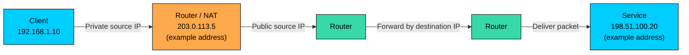
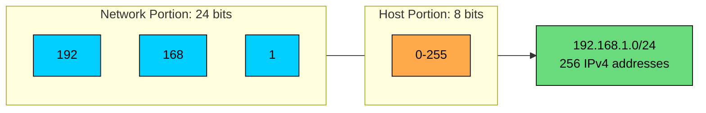
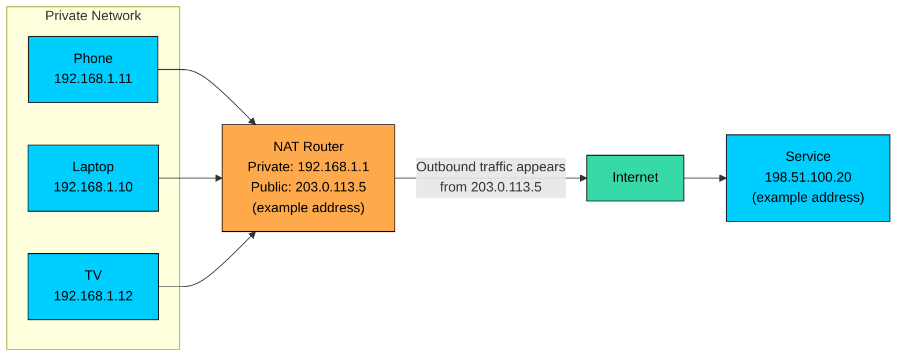
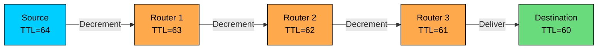

import React from 'react';
import CodeBlock from '../../../../components/ui/CodeBlock';
import Callout from '../../../../components/ui/Callout';

<div className="article-header">
  <div className="breadcrumb">
    <a href="/">Curated Notes</a>
    <span className="breadcrumb-separator">›</span>
    <span className="breadcrumb-current">IP Addresses</span>
  </div>
  <h1>IP Addresses</h1>
  <p style={{ color: 'var(--text-muted)', fontSize: '1.1rem', marginBottom: '16px', lineHeight: '1.6' }}>
    Master the essentials of IP Addresses in this curated guide.
  </p>
  <div className="meta-info">
    <span className="meta-item">
      <svg width="14" height="14" viewBox="0 0 24 24" fill="none" stroke="currentColor" strokeWidth="2"><circle cx="12" cy="12" r="10"/><polyline points="12 6 12 12 16 14"/></svg>
      10 min read
    </span>
    <span className="difficulty-badge difficulty-badge--intermediate">Intermediate</span>
  </div>
</div>

<section className="content-section">

An **IP address** is the logical address Layer 3 uses to decide where packets should go. Routers, firewalls, load balancers, cloud networks, DNS, and service endpoints all depend on it.

An IP address is not a permanent identity for a machine. It is assigned to a network interface within a routing scope. A laptop can hold several. A container can get a new one every time it starts. Thousands of users can sit behind one public IPv4 address because of NAT. A single public IP can represent a load balancer, CDN edge, or anycast service rather than a single server.

In system design, IP addresses are routing coordinates, not user identity, device identity, or a trust boundary.

---

## 1. What an IP Address Does

Every IP packet carries at least two addresses: a source IP that says where the packet appears to come from, and a destination IP that says where it should be delivered. Routers inspect the destination IP, compare it with their routing table, and forward the packet to the next hop. Each router only needs to know the next forwarding decision, not the full end-to-end path.





Layer 2 uses MAC addresses for local delivery on the current link. Layer 3 uses IP addresses for routing across networks. When traffic leaves your local network, the destination MAC address changes at every hop, but the destination IP usually remains the same until the packet reaches the target or a device rewrites it through NAT or proxying.

IP addressing shows up constantly in backend work:

- VPC and subnet design
- Kubernetes pod and service networking
- Load balancer listeners and target groups
- Firewall rules and security groups
- Database allowlists
- DNS records
- NAT gateways and egress controls
- Private service connectivity

If the addressing plan is wrong, systems become hard to connect, hard to secure, and painful to merge later.

---

## 2. IPv4

**IPv4** is the older and still heavily used version of IP. It uses 32-bit addresses, normally written as four decimal octets separated by dots.

For example:


```plaintext
  192    .    168    .     1     .    25
11000000   10101000   00000001   00011001
 (8 bits)   (8 bits)   (8 bits)   (8 bits)
```


Each octet ranges from `0` to `255`. A 32-bit space gives `2^32`, or about 4.3 billion, possible addresses. That number looked large when IPv4 was designed. It is small for a world of phones, laptops, cloud instances, containers, connected devices, and global services.

The public IPv4 pool is exhausted. The Internet Assigned Numbers Authority allocated its last large blocks to Regional Internet Registries in 2011, and regional exhaustion followed over time. IPv4 still works because the industry stretched it with private addressing, NAT, address markets, and careful allocation.

#### Historical Address Classes

Early IPv4 used **classful addressing**, where the first bits of the address determined the network size.


| Class | First Octet Range | Default Mask | Historical Use |
|-------|-------------------|--------------|----------------|
| A | 1-126 | 255.0.0.0 (/8) | Very large networks |
| B | 128-191 | 255.255.0.0 (/16) | Medium networks |
| C | 192-223 | 255.255.255.0 (/24) | Small networks |
| D | 224-239 | N/A | Multicast |
| E | 240-255 | N/A | Reserved or experimental use |


Classful addressing wasted large parts of the address space. A company that needed 500 addresses could not fit in a Class C network with 254 usable host addresses, so it often received a much larger Class B allocation. That model did not scale.

Modern networks use **CIDR**, not classful addressing. You may still hear "Class A" or "Class C" in casual conversation, but production design should use CIDR notation.

---

## 3. CIDR and Subnets

**CIDR (Classless Inter-Domain Routing)** describes how many leading bits identify the network. The suffix is called the prefix length.

For example, in `192.168.1.0/24` the first 24 bits identify the network and the remaining 8 bits identify addresses inside that network, so the block contains `2^8 = 256` IPv4 addresses.





For a traditional IPv4 subnet, the first address is the network address and the last address is the broadcast address. That leaves 254 usable host addresses in a `/24`.

There are exceptions:

- A `/32` identifies one IPv4 address, often used for host routes or firewall rules.
- A `/31` can be used for point-to-point links where a broadcast address is not needed.
- Cloud providers often reserve addresses inside each subnet. For example, you may not get all theoretically usable addresses in an AWS, Azure, or GCP subnet.
- IPv6 does not use broadcast, so the IPv4 "minus two" rule does not apply the same way.

#### Common IPv4 CIDR Blocks


| CIDR | Subnet Mask | Total Addresses | Typical Use |
|------|-------------|-----------------|-------------|
| /8 | 255.0.0.0 | 16,777,216 | Very large private networks, large allocations |
| /16 | 255.255.0.0 | 65,536 | VPCs, corporate networks, large environments |
| /20 | 255.255.240.0 | 4,096 | Medium subnets or environment ranges |
| /24 | 255.255.255.0 | 256 | Small subnets, VLANs, service ranges |
| /28 | 255.255.255.240 | 16 | Small network segments |
| /32 | 255.255.255.255 | 1 | Single host route or exact firewall match |


#### Example: `10.0.0.0/20`

The prefix `/20` leaves 12 host bits:

- Address count: `2^12 = 4,096`
- Range: `10.0.0.0` through `10.0.15.255`
- Traditional usable host range: `10.0.0.1` through `10.0.15.254`

This kind of calculation matters when designing subnets for application tiers, Kubernetes clusters, NAT gateways, and managed databases.

---

## 4. Designing Subnets in Cloud Systems

Cloud platforms make IP planning feel deceptively simple. You choose a CIDR block for a VPC or virtual network, then carve it into subnets. The hard part comes later, when networks need to peer, merge, expand, or connect to on-premise systems.

A common starting point might look like this:


| Range | Purpose |
|-------|---------|
| `10.0.0.0/16` | VPC or virtual network |
| `10.0.0.0/20` | Public subnets across availability zones |
| `10.0.16.0/20` | Private application subnets |
| `10.0.32.0/20` | Data subnets |
| `10.0.48.0/20` | Kubernetes nodes or pods, depending on the model |


Good IP plans leave room for growth. They also avoid overlap with networks you may need to connect later.

Overlapping CIDR ranges are one of the most expensive mistakes in cloud networking. If two VPCs both use `10.0.0.0/16`, direct routing between them becomes difficult or impossible without NAT, proxying, renumbering, or more complex network translation.

Practical guidance:

- Avoid using the same default range everywhere.
- Reserve space for future environments and regions.
- Keep production, staging, data, and shared services in predictable ranges.
- Check existing corporate, VPN, partner, and on-premise ranges before choosing cloud CIDRs.
- Account for Kubernetes pod IP consumption early. Pod-dense clusters can burn through addresses faster than teams expect.
- Remember that cloud subnets may reserve provider-specific addresses.

An address plan is infrastructure architecture. Treat it that way.

---

## 5. Public and Private IP Addresses

The most important IPv4 distinction is whether an address is publicly routable.

#### Public IP Addresses

A **public IP address** is globally routable on the internet. Public addresses are allocated through Regional Internet Registries, ISPs, cloud providers, and network operators. Public address space is coordinated so unrelated networks do not accidentally use the same globally routed prefixes.

Public IPs are used for:

- Internet-facing load balancers
- CDN and edge services
- NAT gateways
- VPN endpoints
- Public DNS targets
- Mail servers and other externally reachable services

Public does not mean safe. A public IP is reachable, nothing more. Security still depends on firewall policy, authentication, patching, protocol hardening, DDoS protection, and application controls.

#### Private IPv4 Addresses

Private IPv4 ranges are defined by RFC 1918. They can be reused by any private network because routers on the public internet do not route them.


| Range | CIDR | Address Count | Common Use |
|-------|------|---------------|------------|
| `10.0.0.0` to `10.255.255.255` | `10.0.0.0/8` | 16,777,216 | Cloud VPCs, large corporate networks |
| `172.16.0.0` to `172.31.255.255` | `172.16.0.0/12` | 1,048,576 | Enterprise networks, containers, internal platforms |
| `192.168.0.0` to `192.168.255.255` | `192.168.0.0/16` | 65,536 | Home networks, small offices, labs |


Private addresses only need to be unique inside the routing domain where they are used. Your laptop and your neighbor's laptop can both be `192.168.1.10` because those addresses live behind different routers.

#### Carrier-Grade NAT

Another range appears often in ISP and mobile networks:


| Range | CIDR | Purpose |
|-------|------|---------|
| `100.64.0.0` to `100.127.255.255` | `100.64.0.0/10` | Shared address space for carrier-grade NAT |


Carrier-grade NAT lets providers place many customers behind a smaller number of public IPv4 addresses. It helps with IPv4 scarcity but complicates inbound connectivity, abuse tracking, and some peer-to-peer protocols.

---

## 6. NAT

**NAT (Network Address Translation)** rewrites packet addresses as traffic crosses a network boundary.

The most common form is source NAT for outbound traffic. A private host sends a packet to the internet. The NAT device replaces the private source IP with a public IP and records the mapping so it can forward the response back to the right internal host.





NAT is the reason IPv4 survived address exhaustion. It is also a source of operational complexity:

- Inbound connections require port forwarding, load balancers, VPNs, or proxies.
- Logs must preserve the original client IP through headers or proxy protocol when traffic passes through intermediaries.
- NAT tables can fill under high connection churn.
- Long-lived idle connections can be dropped by NAT timeouts.
- Multiple clients can share one public IP, so IP-based rate limiting can punish unrelated users.
- Protocols that embed IP addresses in payloads may need special handling.

In cloud systems, NAT gateways are common for private subnets that need outbound internet access. They are useful, but they are also capacity, cost, and availability dependencies. High-throughput workloads, package downloads, telemetry agents, and model-serving nodes pulling large artifacts can all stress NAT gateways if the design is careless.

NAT is a workaround for IPv4 scarcity. It is not a substitute for a clean addressing model.

---

## 7. IPv6

**IPv6** uses 128-bit addresses. That creates a much larger address space and removes the need to conserve addresses the way IPv4 does.

An IPv6 address is written as eight groups of hexadecimal digits:


```plaintext
2001:0db8:85a3:0000:0000:8a2e:0370:7334
```


IPv6 has two shortening rules: drop leading zeros in a group (so `0db8` becomes `db8`), and replace one consecutive run of zero groups with `::`. The address above can be written as:


```plaintext
2001:db8:85a3::8a2e:370:7334
```


The prefix `2001:db8::/32` is reserved for documentation examples, just like `192.0.2.0/24`, `198.51.100.0/24`, and `203.0.113.0/24` are reserved for IPv4 documentation examples.

#### What Changes with IPv6

IPv6 changes more than the address length. Important differences include:

- IPv6 has no broadcast. It uses multicast and neighbor discovery instead.
- IPv6 subnets are commonly `/64`, especially for LAN-style networks.
- IPv6 routers do not fragment packets in transit. Hosts are expected to use path MTU discovery.
- Link-local addresses use `fe80::/10` and are normal in IPv6 networks.
- Address assignment can use SLAAC, DHCPv6, static configuration, or cloud-provider mechanisms.
- NAT is not required for basic address conservation, though IPv6 firewalling is still essential.

#### Adoption Status

IPv6 adoption is no longer theoretical. It is common in mobile networks, large ISPs, consumer broadband, content networks, and major cloud platforms. Adoption is uneven by country, provider, enterprise network, and cloud architecture, so most production systems still need to handle both IPv4 and IPv6.

The usual transition model is **dual-stack**: services publish both A records for IPv4 and AAAA records for IPv6, clients try IPv6 when available and fall back to IPv4 if needed, and operators keep both stacks observable, secured, and tested. Dual-stack avoids a hard cutover, but it doubles the number of paths that can fail. Firewalls, DNS, load balancers, service discovery, metrics, logs, and incident runbooks all need to account for both address families.

---

## 8. Special IP Addresses

Some address ranges have special behavior. Knowing them saves time during debugging.


| Address or Range | Name | Purpose |
|------------------|------|---------|
| `127.0.0.0/8` | IPv4 loopback | Traffic returns to the same host; `127.0.0.1` is the common form |
| `::1/128` | IPv6 loopback | IPv6 loopback address |
| `0.0.0.0` | Unspecified address | Used as a bind address meaning all IPv4 interfaces, or as a placeholder source before assignment |
| `::` | IPv6 unspecified address | IPv6 equivalent of an unspecified address |
| `0.0.0.0/0` | Default IPv4 route | Matches any IPv4 destination if no more specific route exists |
| `::/0` | Default IPv6 route | Matches any IPv6 destination if no more specific route exists |
| `255.255.255.255` | Limited broadcast | Broadcast on the local IPv4 network, commonly used by DHCP discovery |
| `169.254.0.0/16` | IPv4 link-local | Self-assigned when DHCP fails; also includes cloud metadata patterns in many environments |
| `fe80::/10` | IPv6 link-local | Required for local-link IPv6 communication |
| `224.0.0.0/4` | IPv4 multicast | One-to-many delivery for multicast groups |
| `100.64.0.0/10` | Shared address space | Carrier-grade NAT |


A few details are worth calling out.

#### Loopback

When you connect to `127.0.0.1` or `localhost`, traffic stays on the local machine. It goes through the local network stack but never reaches the physical network. This is useful for development, health checks, sidecars, local agents, and inter-process communication.

Be careful with bind addresses. Binding to `127.0.0.1` exposes the service only locally, while binding to `0.0.0.0` exposes it on all IPv4 interfaces allowed by the host firewall and network path. That difference is the source of many "works locally but not from another machine" problems.

#### `0.0.0.0`

`0.0.0.0` means different things depending on context:

- In a server bind address, `0.0.0.0:8080` means listen on all IPv4 interfaces.
- In a route table, `0.0.0.0/0` is the default IPv4 route.
- As a source address, it can mean the host does not yet have an assigned address.

#### Link-Local and Metadata Endpoints

If a laptop gets an address like `169.254.x.x`, DHCP likely failed or the network path to DHCP is broken.

In cloud environments, `169.254.169.254` is commonly used as a metadata endpoint for instances and workloads. It can expose credentials, tokens, or configuration depending on the platform. Treat access to metadata endpoints as security-sensitive, especially in systems that fetch user-controlled URLs.

---

## 9. How Routing Works

Once a packet has a destination IP, routers decide where to send it next.

#### Routing Tables

A routing table maps destination prefixes to next hops. A simplified table might look like this:


```plaintext
Destination        Next Hop
10.0.1.0/24        local subnet
10.0.0.0/8         10.0.1.1
0.0.0.0/0          internet gateway
```


Routers use **longest prefix match**. If a packet for `10.0.1.25` matches both `10.0.0.0/8` and `10.0.1.0/24`, the `/24` wins because it is more specific.

#### Hop-by-Hop Forwarding

IP routing is hop by hop. A router does not need to know the entire path. It only needs to know the next hop for the best matching route.

You can inspect paths with tools such as `traceroute` or `tracepath`, keeping in mind that firewalls, ICMP filtering, asymmetric routing, and load balancing can make the output incomplete or misleading.


```shell
$ traceroute api.example.com
 1  192.168.1.1      1.2 ms    local gateway
 2  10.0.0.1         5.8 ms    ISP gateway
 3  198.51.100.10    8.3 ms    provider network
 4  203.0.113.20     9.1 ms    edge network
 5  192.0.2.34       9.5 ms    destination
```


The example uses documentation IP ranges. Real traceroute output will show addresses owned by your ISP, cloud provider, CDN, or transit networks.

#### TTL and Hop Limit

IPv4 uses a **TTL (Time to Live)** field. IPv6 uses a **Hop Limit** field. The purpose is the same: prevent packets from looping forever.

Each router decrements the value by 1. When it reaches 0, the router drops the packet and usually sends an ICMP time exceeded message.





This is how traceroute discovers intermediate hops: it sends packets with increasing TTL or Hop Limit values and records the routers that report expiration.

#### BGP

At internet scale, routing is coordinated by **BGP (Border Gateway Protocol)**. The internet is made of autonomous systems: ISPs, cloud providers, CDNs, enterprises, and other networks. BGP lets those systems advertise which IP prefixes they can reach and choose paths according to routing policy.

BGP is powerful and blunt. It does not know whether your application is healthy. It knows that a prefix is reachable through a path. Route leaks, bad announcements, and accidental withdrawals can make large services unreachable.

The October 2021 Facebook outage is a useful example: route changes made Facebook, Instagram, and WhatsApp unreachable for hours because the relevant network prefixes disappeared from global routing. The failure was not an HTTP problem or a database problem. It was reachability at the routing layer.

---

## 10. IP Addresses in System Design

IP addressing choices shape reliability, security, and operability.

#### Do Not Treat IP as Identity

An IP address can change, be shared, be translated, or represent an intermediary. Do not use IP address alone as a durable user identity or security decision.

Common pitfalls:

- Rate limiting by public IP can group many unrelated users behind one NAT.
- Allowlisting office IPs breaks when employees use VPNs, mobile networks, or cloud-hosted tools.
- Logs may show a proxy or load balancer IP unless original client IP forwarding is configured correctly.
- Containers and pods often have short-lived addresses.

Use IPs as one signal, not the whole identity model.

#### Preserve Client Address Carefully

Applications often need the original client IP for abuse detection, geolocation, audit logs, and rate limiting. But once traffic passes through proxies or load balancers, the source IP seen by the application may be the proxy.

Common mechanisms include:

- `X-Forwarded-For`
- `Forwarded`
- Proxy Protocol
- Cloud load balancer metadata

Only trust these values from infrastructure you control. A client can forge HTTP headers unless a trusted proxy overwrites or sanitizes them.

#### Plan for Address Exhaustion

Address exhaustion affects private networks too, not only the public IPv4 pool. It happens inside large cloud estates, Kubernetes clusters, data platforms, and multi-region networks.

Watch for:

- Too-small VPC ranges
- Overlapping networks after mergers or cloud migrations
- Kubernetes pod CIDR exhaustion
- NAT port exhaustion
- IPv4-only dependencies in otherwise dual-stack systems
- Hidden assumptions in firewall rules and allowlists

The earlier you fix addressing design, the cheaper it is.

#### Prefer Names for Service Contracts

Applications should usually depend on DNS names or service discovery names, not hard-coded IP addresses. IPs are implementation details. Names allow failover, migration, load balancing, certificate validation, and regional routing.

Hard-coded IPs are sometimes appropriate for infrastructure controls, but they should be rare and documented.

---

## 11. Key Takeaways

IP addresses are Layer 3 routing addresses. They identify where packets should go within a routing context, not who a user is or what a device permanently is.

The practical points to remember:

- IPv4 is still heavily used, but public IPv4 space is exhausted.
- CIDR replaced classful addressing and is the basis of modern subnet design.
- Private IPv4 ranges are reusable, but overlapping ranges create serious routing problems.
- NAT keeps IPv4 usable but adds state, failure modes, logging complexity, and scaling limits.
- IPv6 is widely deployed and should be part of modern system design, usually through dual-stack operation.
- Special addresses such as `127.0.0.1`, `0.0.0.0`, `169.254.169.254`, and `0.0.0.0/0` have context-specific meanings.
- Routing uses longest prefix match and hop-by-hop forwarding.
- IP-based controls are useful, but they are not a complete identity or security model.

A solid addressing plan rarely gets noticed. A weak one creates failed peering, exhausted pod ranges, broken VPNs, NAT bottlenecks, bad logs, and services that cannot talk to each other.

---

## Quiz

</section>
