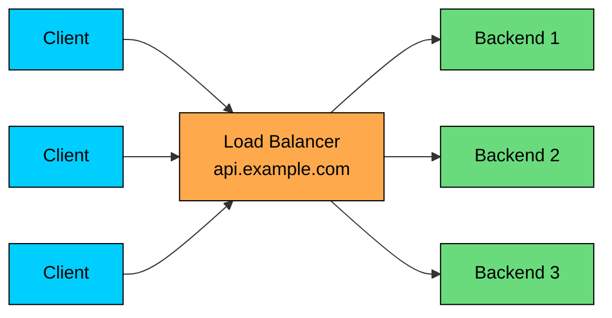
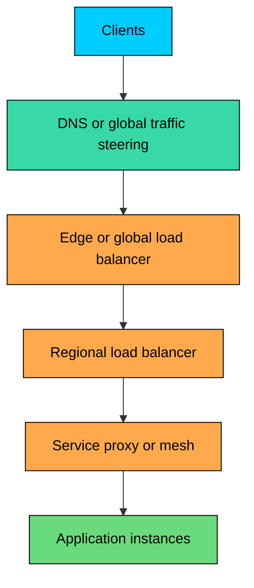
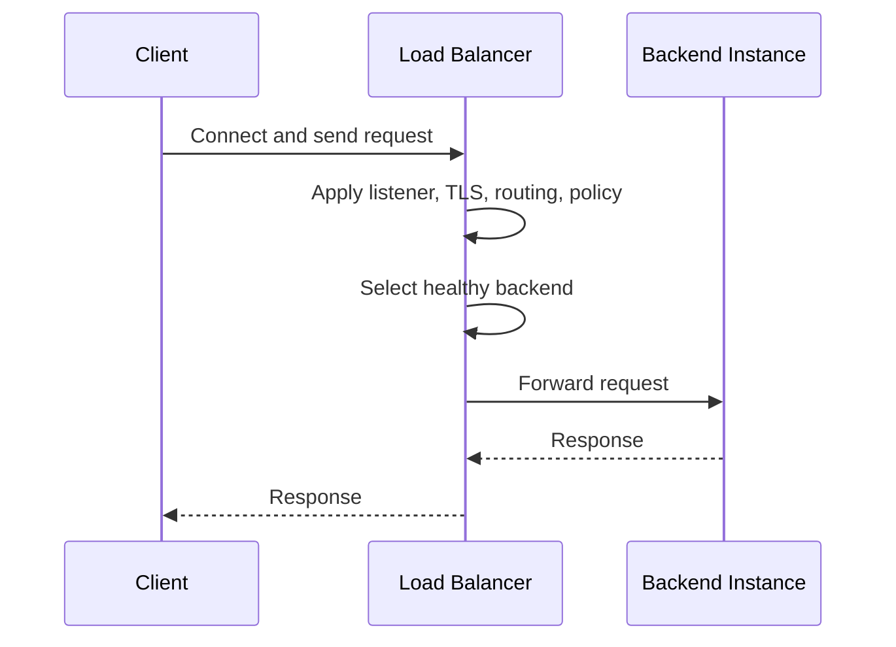

import React from 'react';
import CodeBlock from '../../../../components/ui/CodeBlock';
import Callout from '../../../../components/ui/Callout';

<div className="article-header">
  <div className="breadcrumb">
    <a href="/">Curated Notes</a>
    <span className="breadcrumb-separator">›</span>
    <span className="breadcrumb-current">Load Balancers</span>
  </div>
  <h1>Load Balancers</h1>
  <p style={{ color: 'var(--text-muted)', fontSize: '1.1rem', marginBottom: '16px', lineHeight: '1.6' }}>
    Master the essentials of Load Balancers in this curated guide.
  </p>
  <div className="meta-info">
    <span className="meta-item">
      <svg width="14" height="14" viewBox="0 0 24 24" fill="none" stroke="currentColor" strokeWidth="2"><circle cx="12" cy="12" r="10"/><polyline points="12 6 12 12 16 14"/></svg>
      10 min read
    </span>
    <span className="difficulty-badge difficulty-badge--intermediate">Intermediate</span>
  </div>
</div>

<section className="content-section">

A **load balancer** sits between clients and backend services. It accepts traffic on a stable address, picks a healthy backend, and forwards the request.

That single job becomes the place where production concerns get centralized: scaling, failover, TLS termination, connection draining, traffic policy, and observability. The goal is to keep traffic moving to backends that can handle it, not to spread requests evenly across the pool.





---

## 1. Why Load Balancers Matter

Load balancers solve several practical problems:

1. **Horizontal scaling:** Add or remove backend instances without changing the client-facing address.
2. **Availability:** Stop sending new traffic to unhealthy instances.
3. **Deployments:** Drain traffic from an instance or version before replacing it.
4. **Traffic control:** Route by host, path, protocol, region, tenant, or service policy.
5. **Connection management:** Reuse upstream connections, enforce timeouts, and protect backends from overload.
6. **Security boundary:** Terminate TLS, apply WAF rules, rate limit, or isolate private backends from direct internet access.
7. **Observability:** Centralize request logs, latency metrics, error rates, and backend health signals.

The main design benefit is indirection. Clients talk to the load balancer. Backends can change behind it.

---

## 2. Where Load Balancers Sit

Load balancers appear at several layers of a system.





Common placements:

- **Global front door:** Routes users to a region or edge.
- **Regional load balancer:** Distributes traffic across zones and instances.
- **Internal service load balancer:** Routes service-to-service traffic inside a VPC, Kubernetes cluster, or service mesh.
- **Client-side load balancer:** Library or sidecar chooses endpoints directly from service discovery.
- **Database or cache proxy:** Distributes connections to replicas, shards, or primary/replica endpoints.

Do not assume a system has only one load balancer. Large systems often use several, each with a different responsibility.

---

## 3. Layer 4 vs Layer 7

The most important distinction is whether the load balancer understands the application protocol.

#### 3.1 Layer 4 Load Balancers

A **Layer 4 load balancer** works at the transport layer. It sees IP addresses, ports, TCP, UDP, and connection state. It does not need to parse HTTP paths, headers, cookies, or request bodies.

Layer 4 load balancers are common for:

- High-throughput TCP and UDP services
- TLS pass-through
- Databases and caches
- Game servers
- Real-time protocols
- Services where the application protocol is custom or encrypted end to end

They are usually faster and simpler than Layer 7 load balancers, but they have less routing context.

#### 3.2 Layer 7 Load Balancers

A **Layer 7 load balancer** understands the application protocol, most commonly HTTP.

It can route based on:

- Hostname
- URL path
- HTTP method
- Headers
- Cookies
- gRPC method
- JWT claims or tenant metadata, if integrated carefully

Layer 7 load balancers are common for web apps, APIs, microservices, and edge gateways.

The trade-off is cost and complexity. Parsing application traffic gives more control, but it also introduces more configuration, more failure modes, and more CPU work.


| Feature | Layer 4 | Layer 7 |
|---------|---------|---------|
| **Decision input** | IP, port, protocol, connection | HTTP/gRPC metadata and request details |
| **Typical protocols** | TCP, UDP, TLS pass-through | HTTP, HTTPS, HTTP/2, gRPC |
| **Strength** | Throughput, simplicity, protocol neutrality | Rich routing and policy |
| **Weakness** | Limited request awareness | More overhead and configuration risk |
| **Examples** | Network load balancer, LVS/IPVS, AWS NLB | NGINX, HAProxy HTTP mode, Envoy, AWS ALB |


---

## 4. How Request Flow Works

A typical request through a Layer 7 load balancer looks like this:





Important details:

- The load balancer may terminate TLS or pass encrypted traffic through.
- It may reuse upstream connections instead of opening one backend connection per client connection.
- It may retry failed requests, but only when retrying is safe.
- It should enforce timeouts so slow backends do not consume resources forever.
- It should stop routing to backends that fail health checks.

---

## 5. Health Checks

Health checks decide whether a backend is eligible for new traffic.

Simple checks prove only that a process accepts connections. Better checks prove that the backend is ready to serve real work.


| Check | What It Proves | What It Can Miss |
|-------|----------------|------------------|
| **TCP connect** | Port is open | Application may be broken |
| **HTTP `/health`** | App responds to a known endpoint | Downstream dependency may fail later |
| **Readiness check** | Instance should receive traffic | May be too shallow if poorly designed |
| **Synthetic request** | A representative path works | More expensive and harder to keep reliable |


Health checks should be fast, stable, and meaningful. They should also include thresholds:


```shell
Interval:            10 seconds
Timeout:             2 seconds
Unhealthy threshold: 3 failed checks
Healthy threshold:   2 successful checks
```


Without thresholds, a transient blip can flap an instance in and out of rotation. With thresholds that are too slow, failed instances keep receiving traffic.

---

## 6. Connection Draining and Deployments

Removing a backend from rotation is not the same as killing it.

During a deployment, the safer flow is:

1. Mark the instance as draining.
2. Stop sending it new requests.
3. Let in-flight requests finish.
4. Close or migrate long-lived connections according to policy.
5. Shut the instance down.

This matters for HTTP requests, WebSockets, gRPC streams, file uploads, and token-streaming AI responses. Killing a backend while it is streaming a response is visible to the user.

Good systems combine load balancer draining with application shutdown hooks. The application should stop accepting new work before the process exits.

---

## 7. TLS Termination

Many load balancers terminate TLS. The client establishes HTTPS with the load balancer, and the load balancer forwards traffic to the backend.

There are three common patterns:


| Pattern | Description | Use Case |
|---------|-------------|----------|
| **TLS termination** | LB decrypts; backend receives plaintext HTTP | Common web/API deployments |
| **TLS pass-through** | LB forwards encrypted TCP without decrypting | End-to-end encryption or custom protocols |
| **TLS re-encryption (bridging)** | LB decrypts and inspects, then opens a new TLS connection to the backend | Zero-trust or regulated internal networks |


TLS termination centralizes certificate management and enables Layer 7 routing. Pass-through preserves end-to-end encryption but limits application-aware features.

---

## 8. Session Affinity

**Session affinity**, often called sticky sessions, routes the same client to the same backend.

Common methods:

- Source IP affinity
- Cookie-based affinity
- Header-based hashing
- Consistent hashing on a tenant, user, or session key

Affinity is useful when backends hold local state, maintain warm caches, or handle long-lived sessions.

It is also a design smell if used to hide avoidable statefulness. If an application can store session state in a shared database, cache, or token, it is usually easier to scale and recover.

Use affinity deliberately. Document what breaks if a user moves to another backend.

---

## 9. Algorithms

The load balancer needs a selection policy. Common algorithms include:


| Algorithm | Best For | Watch Out For |
|-----------|----------|---------------|
| **Round robin** | Homogeneous short requests | Ignores request cost and active load |
| **Weighted round robin** | Backends with known capacity differences | Weights can drift from reality |
| **Least connections / least requests** | Long or uneven requests | Needs accurate active request tracking |
| **Power of two choices** | Large backend pools | Approximate, but cheap and effective |
| **Consistent hash** | Cache locality and sticky routing | Uneven keys can create hot spots |
| **Random** | Simple, low-coordination balancing | No health/load awareness unless combined with checks |
| **Locality-aware** | Multi-zone or multi-region systems | Can overload local capacity without spillover rules |


The key point: no algorithm fixes unhealthy backends, missing timeouts, bad retries, or insufficient capacity.

---

## 10. Failure Modes

Load balancers improve availability, but they also become shared infrastructure that many services depend on. Design for their failure modes.

#### 10.1 The Load Balancer as a Bottleneck

A load balancer has limits: connections, packets per second, requests per second, TLS handshakes, memory, and rule evaluation cost.

Track saturation. Do not discover the limit during an incident.

#### 10.2 Bad Health Checks

If health checks are too shallow, broken backends stay in rotation. If they are too strict, healthy backends get removed during harmless dependency blips.

Health check design is production logic, not boilerplate.

#### 10.3 Retry Storms

Retries at the load balancer can amplify outages. If every failed request is retried three times against an already overloaded pool, the load balancer makes the incident worse.

Retries need budgets, timeouts, backoff, and idempotency awareness.

#### 10.4 Long-Lived Connections

WebSockets, HTTP/2 streams, gRPC streams, and AI token streams do not behave like short HTTP requests. They consume connection slots for longer and complicate deployments.

Use draining, max connection age, keepalive settings, and clear reconnect behavior.

#### 10.5 Uneven Request Cost

One request may cost 2 ms and another may run a 30-second report or a long model inference. Balancing request counts is not the same as balancing work.

For expensive workloads, route using application-level signals such as queue depth, model type, tenant quota, or estimated cost.

---

## 11. Load Balancers in Modern Systems

#### 11.1 Kubernetes

In Kubernetes, "load balancer" can mean several things:

- A cloud load balancer created for a `Service` of type `LoadBalancer`
- An ingress controller such as NGINX, HAProxy, or Envoy-based gateways
- A service mesh sidecar or node proxy
- kube-proxy (in iptables or IPVS mode), eBPF-based datapaths such as Cilium, or cloud-native routing integrations

Be precise about which layer you mean. A Kubernetes Service, an ingress controller, and a cloud load balancer solve different problems.

#### 11.2 Service Mesh and Sidecars

Service meshes move some load balancing into sidecars or node proxies. The client-side proxy can choose among discovered endpoints, apply retries, enforce mTLS, and collect telemetry.

This is useful, but it increases operational complexity. Bad mesh configuration can break service-to-service traffic as effectively as bad code.

#### 11.3 AI Systems

AI inference traffic stresses load balancers in ways that classic HTTP traffic does not. Responses stream tokens for tens of seconds, sometimes minutes. That makes ordinary request-count metrics misleading and turns connection draining into a first-class concern.

A normal Layer 7 load balancer is a good front door for TLS, authentication, and ingress, but model-aware scheduling (GPU placement, queue depth, model availability) belongs in a dedicated inference gateway behind it.

---

## 12. Practical Design Rules

1. Put a load balancer in front of any horizontally scaled service.
2. Use Layer 4 when you need protocol neutrality or maximum throughput.
3. Use Layer 7 when routing depends on HTTP/gRPC metadata.
4. Make health checks meaningful, not just "process is alive."
5. Configure timeouts deliberately: client, load balancer, upstream, idle, and request timeouts.
6. Use connection draining for deployments.
7. Keep backend services stateless when possible.
8. Treat retries as load multipliers.
9. Monitor the load balancer itself, not only the backends.
10. Do not rely on one layer. Use DNS/global routing, regional load balancers, and service routing for different decisions.

---

## Summary

A load balancer is a traffic control point. It gives clients a stable endpoint while backend instances scale, fail, deploy, and recover behind it.

#### **Key takeaways:**

1. **Load balancers provide indirection.** Clients connect to a stable address while backends change behind it.
2. **Layer 4 and Layer 7 solve different problems.** Layer 4 is transport-oriented; Layer 7 is application-aware.
3. **Health checks are part of system correctness.** A bad health check can route traffic to broken instances or remove good ones.
4. **Connection draining matters for real deployments.** Stopping new traffic before shutdown avoids needless user-visible failures.
5. **TLS termination, retries, affinity, and routing policy are design choices.** Each has trade-offs.
6. **Algorithms are only one piece.** Timeouts, capacity, health, retries, and observability matter just as much.
7. **Modern systems use multiple load-balancing layers.** DNS, edge, regional, service mesh, and application routing often work together.

Use load balancers to create controlled indirection. Then make that control honest with health checks, capacity planning, and clear failure behavior.

</section>
