import React from 'react';
import CodeBlock from '../../../../components/ui/CodeBlock';
import Callout from '../../../../components/ui/Callout';

<div className="article-header">
  <div className="breadcrumb">
    <a href="/">Curated Notes</a>
    <span className="breadcrumb-separator">›</span>
    <span className="breadcrumb-current">Load Balancing Algorithms</span>
  </div>
  <h1>Load Balancing Algorithms</h1>
  <p style={{ color: 'var(--text-muted)', fontSize: '1.1rem', marginBottom: '16px', lineHeight: '1.6' }}>
    Master the essentials of Load Balancing Algorithms in this curated guide.
  </p>
  <div className="meta-info">
    <span className="meta-item">
      <svg width="14" height="14" viewBox="0 0 24 24" fill="none" stroke="currentColor" strokeWidth="2"><circle cx="12" cy="12" r="10"/><polyline points="12 6 12 12 16 14"/></svg>
      10 min read
    </span>
    <span className="difficulty-badge difficulty-badge--intermediate">Intermediate</span>
  </div>
</div>

<section className="content-section">

A **load balancing algorithm** is the policy a load balancer uses to pick the next backend. The right policy depends on the workload. A static web server, a WebSocket service, a cache cluster, and an AI inference gateway each need a different one.

The goal is to distribute **work** across healthy capacity while preserving correctness, latency, and failure behavior, not just to spread request counts. This chapter covers the algorithms you are most likely to see and how to choose among them.

---

## 1. What an Algorithm Can and Cannot Know

A load-balancing algorithm only sees the signals available at the layer where it runs.


| Layer | Signals Available | Signals Usually Missing |
|-------|-------------------|-------------------------|
| **DNS** | Resolver location, weights, health status | Active requests, exact client path, request cost |
| **Layer 4** | IP, port, protocol, connection count | HTTP path, headers, tenant, method |
| **Layer 7** | HTTP/gRPC metadata, active requests, upstream latency | Full business cost unless provided by the app |
| **Application gateway** | Tenant, model, queue depth, auth context, custom cost | Raw packet-level simplicity |


This matters because algorithm names can be misleading. "Least connections" is useful only if connection count is a good proxy for load. "Least response time" helps only if measured latency reflects future capacity. "Round robin" is fine only when requests and backends are similar.

No algorithm compensates for missing health checks, bad timeouts, retry storms, or insufficient capacity.

---

## 2. Round Robin

Round robin sends requests to backends in order, then loops back to the beginning.


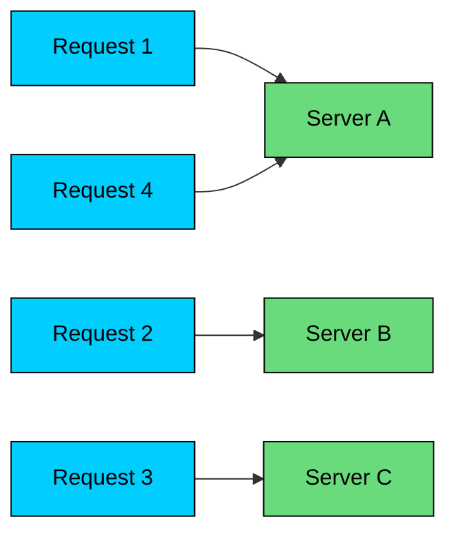


#### When It Works

Round robin is a good default when:

- Backends have similar capacity.
- Requests have similar cost.
- Connections are short-lived.
- There is no strong need for session affinity.
- Health checks remove failed backends.

#### Where It Fails

Round robin ignores current load. If one backend gets slow because of garbage collection, noisy neighbors, a cache miss pattern, or a long-running request, round robin keeps sending it traffic.

It also performs poorly when requests have very different costs. Ten "small" requests and ten "generate a large report" requests are not the same amount of work.

#### Simple Implementation


```java
import java.util.List;
import java.util.concurrent.atomic.AtomicInteger;

class RoundRobin {
    private final List<String> backends;
    private final AtomicInteger index = new AtomicInteger(0);

    RoundRobin(List<String> backends) {
        if (backends.isEmpty()) throw new IllegalArgumentException("backends cannot be empty");
        this.backends = backends;
    }

    String pick() {
        int i = Math.floorMod(index.getAndIncrement(), backends.size());
        return backends.get(i);
    }
}
```


In production, the list should contain only healthy, ready backends.

---

## 3. Weighted Round Robin

Weighted round robin gives some backends more turns than others.


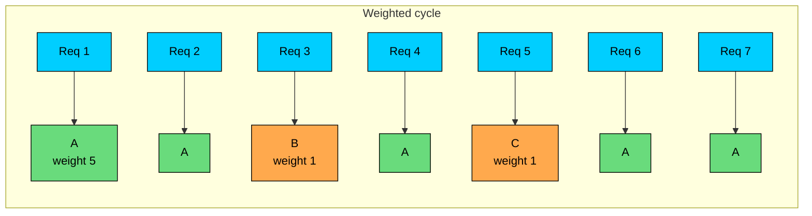


If backends have weights `[5, 1, 1]`, the first backend should receive roughly five times as many selections as either of the others.

#### When It Works

Use weighted round robin when:

- Backends have known capacity differences.
- You want to send a small percentage of traffic to a canary.
- A new region should receive limited traffic during ramp-up.
- You need a simple active-active split.

#### Where It Fails

Weights are static unless you update them. They may not reflect live behavior.

A backend with weight `5` may still be overloaded if it receives expensive requests. A backend with weight `1` may be underused if its requests are cheap. Weighted round robin is capacity-aware only in the narrow sense that you told it the capacities in advance.

#### Smooth Weighted Round Robin

Naive weighted round robin can create bursts. A smoother implementation spreads selections across the cycle.


```java
import java.util.ArrayList;
import java.util.List;

class SmoothWeightedRoundRobin {
    private static class Backend {
        String name;
        int weight;
        int current;

        Backend(String name, int weight) {
            this.name = name;
            this.weight = weight;
        }
    }

    private final List<Backend> backends = new ArrayList<>();
    private final int totalWeight;

    SmoothWeightedRoundRobin(List<String> names, List<Integer> weights) {
        if (names.size() != weights.size() || names.isEmpty()) {
            throw new IllegalArgumentException("names and weights must be non-empty and equal length");
        }
        int total = 0;
        for (int i = 0; i < names.size(); i++) {
            backends.add(new Backend(names.get(i), weights.get(i)));
            total += weights.get(i);
        }
        totalWeight = total;
    }

    String pick() {
        Backend best = null;
        for (Backend backend : backends) {
            backend.current += backend.weight;
            if (best == null || backend.current > best.current) {
                best = backend;
            }
        }
        best.current -= totalWeight;
        return best.name;
    }
}
```


This is still not a substitute for live load feedback.

---

## 4. Least Connections and Least Requests

Least connections sends new work to the backend with the fewest active connections. In HTTP/gRPC systems, the more useful version is often **least requests**, which tracks active in-flight requests or streams.


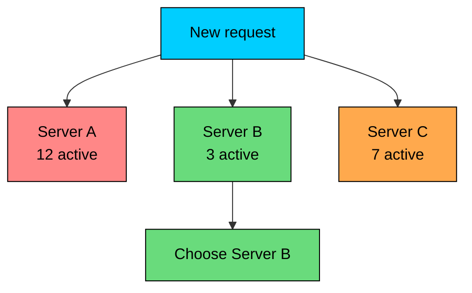


#### When It Works

Use least connections or least requests when:

- Requests have uneven duration.
- Connections stay open for a meaningful amount of time.
- Backends have similar capacity.
- The load balancer can accurately track active work.

This is a better fit than round robin for WebSockets, long polling, gRPC streams, and APIs where request duration varies.

#### Where It Fails

Connection count is not always load.

One idle WebSocket is not the same as one busy gRPC stream. One image request is not the same as one expensive search query. If a backend is slow, it may accumulate more active requests, and least requests will naturally shift traffic away. That is useful, but it can also cause oscillation if measurements are noisy.

#### Basic Implementation


```java
import java.util.HashMap;
import java.util.List;
import java.util.Map;
import java.util.Random;

class LeastRequests {
    private final Map<String, Integer> active = new HashMap<>();
    private final Random random = new Random();

    LeastRequests(List<String> backends) {
        for (String backend : backends) active.put(backend, 0);
    }

    synchronized String pick() {
        int min = active.values().stream().min(Integer::compareTo).orElseThrow();
        List<String> candidates = active.entrySet().stream()
            .filter(entry -> entry.getValue() == min)
            .map(Map.Entry::getKey)
            .toList();
        String chosen = candidates.get(random.nextInt(candidates.size()));
        active.put(chosen, active.get(chosen) + 1);
        return chosen;
    }

    synchronized void release(String backend) {
        active.computeIfPresent(backend, (key, count) -> Math.max(0, count - 1));
    }
}
```


Production implementations must handle backend removal, failed requests, timeouts, and concurrency safely.

---

## 5. Power of Two Choices

The **power of two choices**, often called P2C, picks two random healthy backends and sends the request to the less loaded one.

It is surprisingly effective. It avoids scanning every backend while still avoiding the worst random choices.


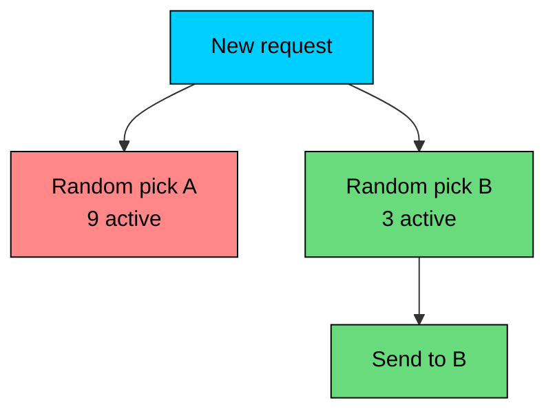


#### Why It Matters

For large backend pools, a full least-requests scan can be expensive or hard to coordinate. P2C gives most of the benefit at constant cost.

Many modern proxies use variants of this idea for least-request balancing.

#### Simple Implementation


```java
import java.util.HashMap;
import java.util.List;
import java.util.Map;
import java.util.Random;

class PowerOfTwoChoices {
    private final Map<String, Integer> active = new HashMap<>();
    private final Random random = new Random();

    PowerOfTwoChoices(List<String> backends) {
        if (backends.size() < 2) throw new IllegalArgumentException("need at least two backends");
        for (String backend : backends) active.put(backend, 0);
    }

    synchronized String pick() {
        var names = active.keySet().stream().toList();
        String a = names.get(random.nextInt(names.size()));
        String b;
        do {
            b = names.get(random.nextInt(names.size()));
        } while (a.equals(b));

        String chosen = active.get(a) <= active.get(b) ? a : b;
        active.put(chosen, active.get(chosen) + 1);
        return chosen;
    }
}
```


If backend weights differ, compare an adjusted score instead of raw active counts.

---

## 6. Random

Random selection chooses a healthy backend at random.

That sounds crude, but it is useful in distributed systems because it requires little coordination and avoids some synchronized behavior.


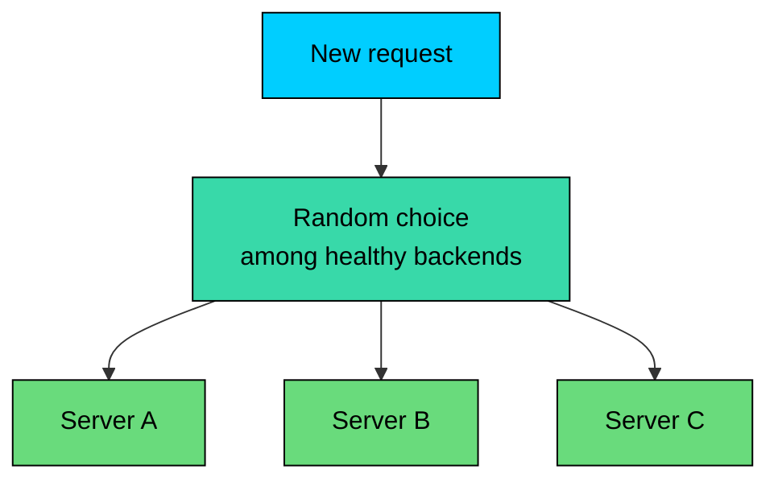


#### When It Works

Use random selection when:

- Backends are homogeneous.
- The pool is large.
- Requests are short-lived.
- You want a simple fallback policy.
- You combine it with health checks and retries.

#### Simple Implementation


```java
import java.util.List;
import java.util.Random;

class RandomPicker {
    private final List<String> backends;
    private final Random random = new Random();

    RandomPicker(List<String> backends) {
        if (backends.isEmpty()) throw new IllegalArgumentException("backends cannot be empty");
        this.backends = backends;
    }

    String pick() {
        return backends.get(random.nextInt(backends.size()));
    }
}
```


#### Where It Fails

Pure random can create unlucky streaks. It also ignores capacity and active load. P2C is often a better default when you can track a simple load signal.

---

## 7. Least Response Time

Least response time routes traffic to the backend with the best observed latency.


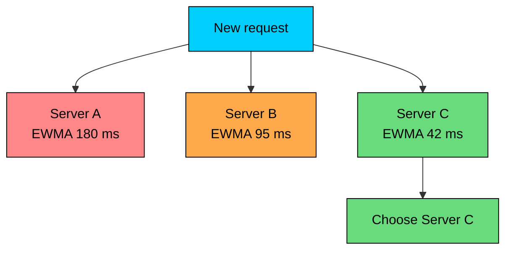


#### When It Works

Use it when latency varies by backend and recent latency is a useful predictor of future latency.

Examples:

- Backends in different zones
- Heterogeneous instances
- Services with variable downstream dependency latency
- Read-heavy services where response time correlates with load

#### Where It Fails

Least response time can be unstable.

If one backend receives fewer requests, its latency sample may be stale. If one backend gets a run of cheap requests, it may look artificially fast. If every load balancer independently chases the fastest backend, they can all pile onto it and make it slow.

Use smoothing, minimum sample counts, outlier detection, and circuit breakers. Do not route all traffic based on one recent response.

#### Smoothed Latency


```java
import java.util.HashMap;
import java.util.List;
import java.util.Map;

class SmoothedLatency {
    private final Map<String, Double> latencyMs = new HashMap<>();
    private final double alpha;

    SmoothedLatency(List<String> backends, double alpha) {
        for (String backend : backends) latencyMs.put(backend, null);
        this.alpha = alpha;
    }

    void record(String backend, double observedMs) {
        Double current = latencyMs.get(backend);
        latencyMs.put(
            backend,
            current == null ? observedMs : (1 - alpha) * current + alpha * observedMs
        );
    }

    String pick() {
        return latencyMs.entrySet().stream()
            .filter(entry -> entry.getValue() != null)
            .min(Map.Entry.comparingByValue())
            .map(Map.Entry::getKey)
            .orElseGet(() -> latencyMs.keySet().iterator().next());
    }
}
```


This example is intentionally incomplete. A production version needs exploration so new or previously quiet backends get sampled.

---

## 8. Hash-Based Routing

Hash-based routing sends the same key to the same backend while the backend set is stable.

The key might be:

- Source IP
- Session ID
- User ID
- Tenant ID
- Cache key
- Request path
- Model name


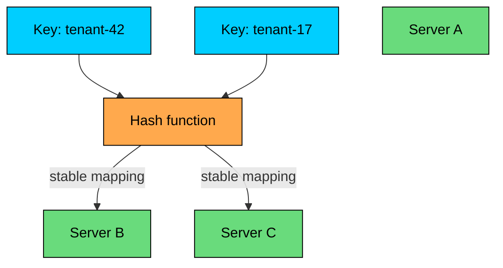


#### Source IP Hash

Source IP hash is simple: hash the client IP and map it to a backend.


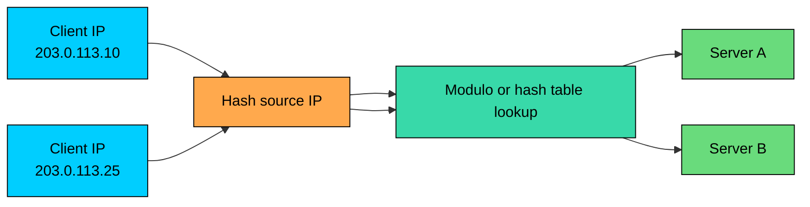


It can help with sticky sessions, but it has problems:

- Many clients may share one NAT IP.
- Mobile clients change IPs.
- IPv6 privacy addresses can change.
- Large enterprise customers can create hot spots.
- Adding or removing a backend remaps many clients if simple modulo hashing is used.

Source IP hash is a blunt tool. Cookie-based, header-based, or application-key hashing is often better.

#### Consistent Hashing

Consistent hashing reduces remapping when backends are added or removed.

Instead of computing `hash(key) % number_of_backends`, the load balancer maps backends and keys onto a hash ring. When one backend changes, only part of the key space moves.


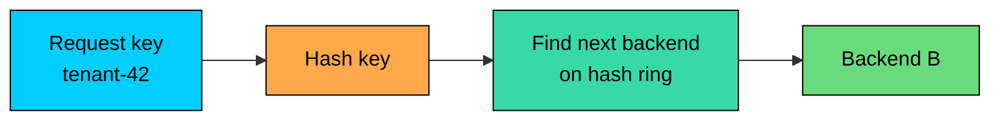


Rendezvous hashing is a compact alternative with similar stability goals: score every backend for a key and pick the highest score. When a backend is added or removed, only keys that prefer that backend move.


```java
import java.nio.charset.StandardCharsets;
import java.util.List;

class RendezvousHash {
    private final List<String> backends;

    RendezvousHash(List<String> backends) {
        if (backends.isEmpty()) throw new IllegalArgumentException("backends cannot be empty");
        this.backends = backends;
    }

    String pick(String key) {
        String best = null;
        long bestScore = -1;
        for (String backend : backends) {
            long score = fnv1a32(key + "|" + backend);
            if (best == null || Long.compareUnsigned(score, bestScore) > 0) {
                best = backend;
                bestScore = score;
            }
        }
        return best;
    }

    private static long fnv1a32(String value) {
        long hash = 0x811c9dc5L;
        for (byte b : value.getBytes(StandardCharsets.UTF_8)) {
            hash ^= Byte.toUnsignedInt(b);
            hash = (hash * 0x01000193L) & 0xffffffffL;
        }
        return hash;
    }
}
```


Consistent hashing is useful for:

- Distributed caches
- Stateful shards
- Session affinity
- Tenant-locality routing
- Reducing cache churn during scaling

#### Maglev and Rendezvous Hashing

Modern proxies may use variants such as Maglev hashing or rendezvous hashing. They serve the same broad goal: stable key-to-backend mapping with limited disruption when the backend set changes.

Use these when key stability matters. Avoid them when the workload has hot keys unless you have a strategy for splitting or shedding hot traffic.

---

## 9. Locality-Aware Routing

Locality-aware routing prefers nearby backends: same zone, same region, same rack, or same cluster.

This reduces latency and cross-zone cost. It also keeps failures smaller when a dependency has regional problems.


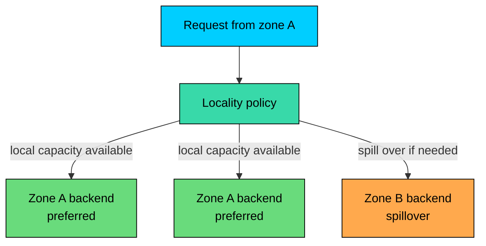


#### Where It Fails

Locality can overload local capacity. If one zone has 40% of clients but only 25% of backend capacity, strict local routing will burn that zone while remote capacity sits idle.

Good locality policies need spillover:

1. Prefer local healthy backends.
2. Spill to nearby zones when local load crosses a threshold.
3. Avoid sending traffic to a region that violates compliance or data residency policy.
4. Rebalance slowly after recovery.

---

## 10. Adaptive and Load-Aware Routing

Adaptive routing uses live signals such as queue depth, CPU, error rate, observed latency, or application-provided load reports.

This is common in advanced service meshes, RPC frameworks, and inference gateways.


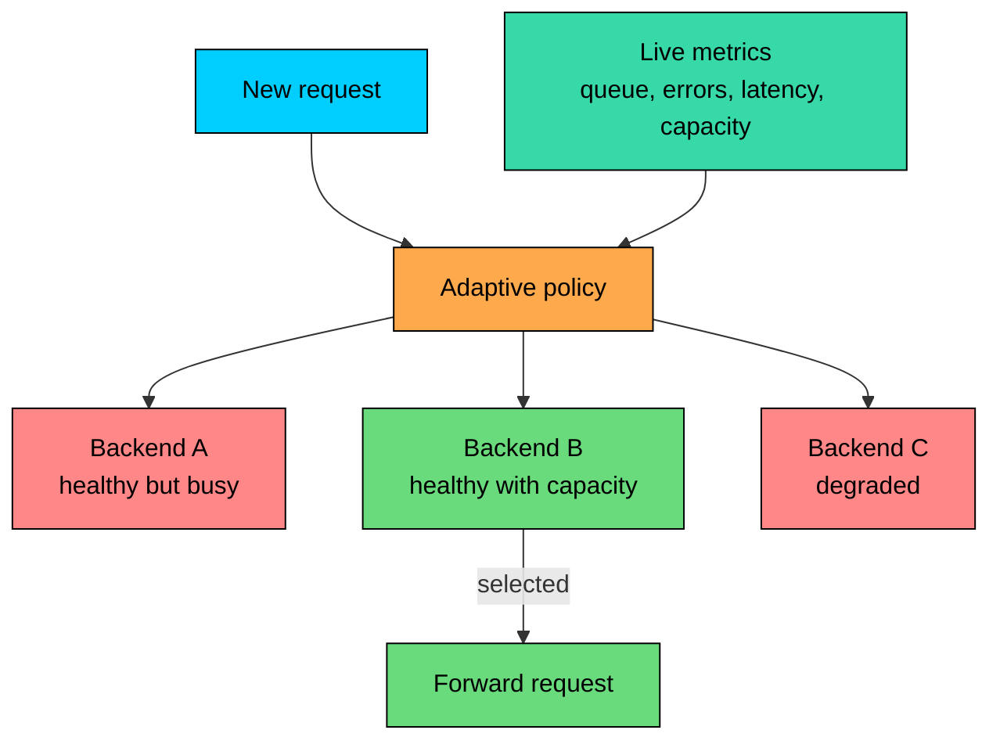


#### When It Helps

Adaptive routing is useful when simple signals are not enough:

- Expensive API requests
- Search and ranking systems
- ML inference
- Multi-tenant services
- Backends with different hardware
- Services with queueing behavior

#### Where It Fails

Adaptive systems can become feedback loops. If every client routes away from a slightly slow backend at the same time, load shifts suddenly and creates a new slow backend.

Use smoothing, caps, outlier detection, slow start, and circuit breakers. Make the algorithm stable before making it clever.

---

## 11. Algorithm Choice by Workload


| Workload | Good Starting Point | Why |
|----------|---------------------|-----|
| **Static web/API with equal instances** | Round robin or P2C | Simple and effective |
| **Uneven request duration** | Least requests or P2C | Avoids piling onto busy backends |
| **Long-lived connections** | Least connections | Connection count matters more |
| **Heterogeneous instances** | Weighted round robin or weighted least requests | Capacity differs |
| **Cache cluster** | Consistent hash / Maglev / rendezvous | Preserves cache locality |
| **Canary release** | Weighted routing | Controls exposure |
| **Multi-zone service** | Locality-aware with spillover | Keeps traffic close but avoids overload |
| **AI inference gateway** | Queue/load-aware routing behind L7 LB | Model, GPU, and queue signals matter |


In practice, several layers each apply their own algorithm:

- DNS chooses a region.
- A regional load balancer chooses a gateway.
- The gateway chooses a service pool.
- The service router chooses a model worker, shard, or replica.

Each layer should use the signals it can see.

---

## 12. Common Mistakes

#### 12.1 Confusing Requests with Work

Equal request count does not mean equal load. Measure CPU, memory, queue time, latency, active requests, and error rates.

#### 12.2 Ignoring Slow Start

A newly added backend often has cold caches, empty connection pools, and just-in-time compilation or model warmup work. Sending it a full traffic share immediately can hurt it.

Slow start gradually increases traffic to new or recovered backends.

#### 12.3 Retrying Without Budgets

Retries can turn a partial outage into a full outage. A load balancer should not blindly retry every failed request.

Retry only when:

- The method is safe or the request is idempotent.
- The retry has a deadline.
- There is a retry budget.
- The next backend is likely to do better.

#### 12.4 Keeping Dead Backends in the Pool

Algorithms assume the pool contains eligible backends. Health checking and endpoint discovery must remove dead, draining, or overloaded instances.

#### 12.5 Using Sticky Routing to Hide Bad State Management

Sticky routing can be valid, but it should not be the only thing keeping the application correct. Backends fail. Deployments happen. Clients move.

If moving a user to another backend breaks the session, write that down as a real reliability risk.

---

## 13. Quick Comparison


| Algorithm | Load Awareness | Affinity | Cost | Best Use |
|-----------|----------------|----------|------|----------|
| **Round robin** | None | No | Low | Homogeneous short requests |
| **Weighted round robin** | Static capacity only | No | Low | Known capacity differences, canaries |
| **Least connections** | Active connections | No | Medium | Long-lived connections |
| **Least requests** | In-flight requests | No | Medium | Uneven request duration |
| **Power of two choices** | Approximate active load | No | Low | Large pools |
| **Random** | None | No | Low | Simple fallback, large homogeneous pools |
| **Least response time** | Observed latency | No | Medium | Latency-sensitive services with stable samples |
| **Source IP hash** | None | Weak | Low | Simple affinity |
| **Consistent hash / Maglev** | None by default | Strong key affinity | Medium | Caches, shards, session locality |
| **Locality-aware** | Location and health | Sometimes | Medium | Multi-zone and multi-region services |
| **Adaptive routing** | Custom live signals | Depends | High | Expensive, heterogeneous, or queued workloads |


---

## Summary

Load-balancing algorithms are policies for choosing a backend. The best policy depends on what the load balancer can observe and what the workload needs.

#### **Key takeaways:**

1. **Round robin is simple, not intelligent.** Use it when requests and backends are similar.
2. **Weights express expected capacity, not live load.** They are useful for canaries and heterogeneous pools, but they drift.
3. **Least connections and least requests handle uneven duration better.** They need accurate active-work tracking.
4. **Power of two choices is a strong default for large pools.** It gives good balance without scanning every backend.
5. **Hash-based routing preserves locality.** Use consistent hashing, Maglev, or rendezvous hashing when backend changes should move fewer keys.
6. **Latency-aware routing needs smoothing.** Raw recent latency can create noisy feedback loops.
7. **Locality-aware routing needs spillover.** Prefer nearby capacity, but do not overload it blindly.
8. **AI inference needs application-aware routing.** GPU type, model availability, queue depth, tenant quota, and data policy matter more than generic request counts.
9. **The algorithm is only part of reliability.** Health checks, timeouts, draining, slow start, retries, and observability decide how the system behaves under stress.

Choose the simplest algorithm that matches the workload, then prove it with production metrics.

</section>
