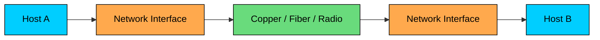
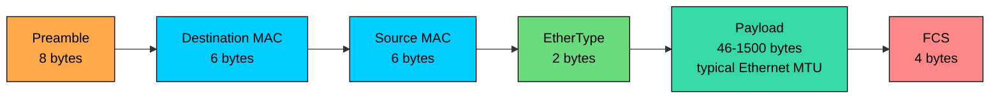
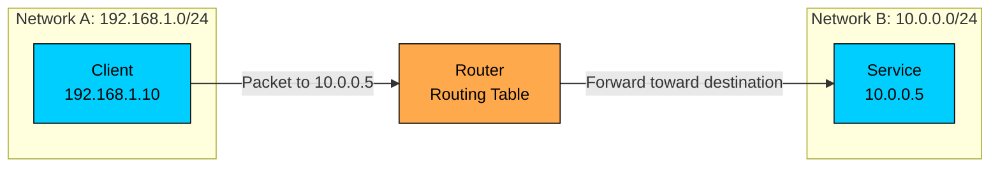
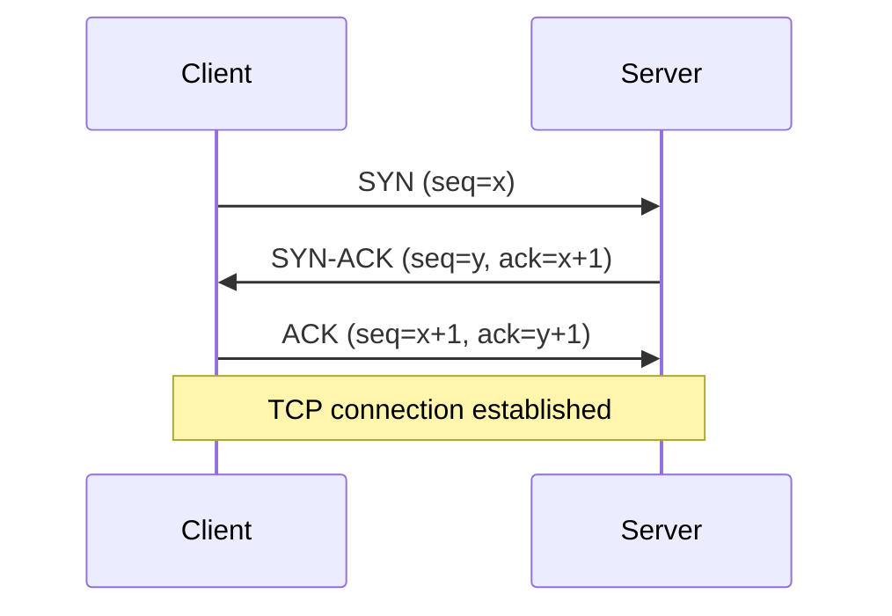
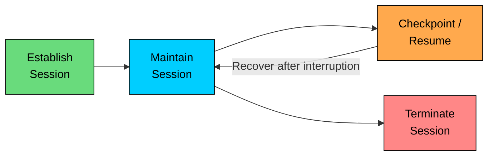
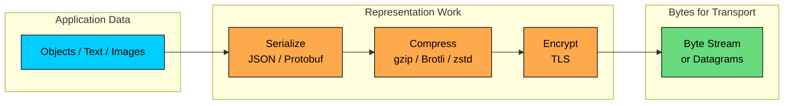
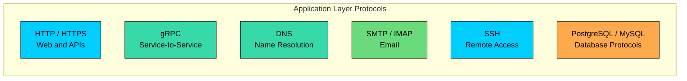
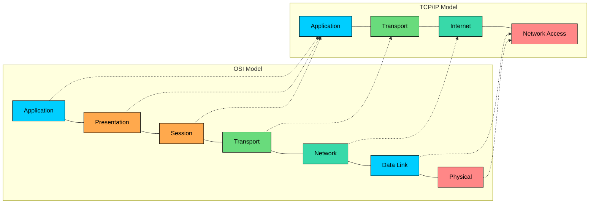

import React from 'react';
import CodeBlock from '../../../../components/ui/CodeBlock';
import Callout from '../../../../components/ui/Callout';

  

    <a href="/">Curated Notes</a>
    ›
    OSI Model
  

  <h1>OSI Model</h1>
  

    Master the essentials of OSI Model in this curated guide.
  

  

    
      <svg width="14" height="14" viewBox="0 0 24 24" fill="none" stroke="currentColor" strokeWidth="2"><circle cx="12" cy="12" r="10"/><polyline points="12 6 12 12 16 14"/></svg>
      10 min read
    
    Intermediate
  

<section className="content-section">

The **OSI (Open Systems Interconnection) model** is a reference framework that divides network communication into seven layers, from raw bits on a wire to application-level protocols. ISO published it in the 1980s to give the industry a common vocabulary for the responsibilities every networked system has to handle.

Most production systems do not implement OSI literally. The Internet is built around the TCP/IP model, and modern protocols often cross OSI boundaries: TLS sits between application protocols and transport, QUIC runs over UDP but adds transport-level features, and service meshes operate at both Layer 4 and Layer 7.

What the model still gives engineers is diagnostic clarity. When something fails, naming the layer narrows the problem from "the network is broken" down to a specific class of fault.

---

## 1. Why the OSI Model Exists

Early networks were fragmented by vendor-specific protocols and hardware. Systems from one vendor often could not communicate with systems from another. The OSI model, published by ISO in the 1980s, gave the industry a common vocabulary for network responsibilities.

The model does not prescribe one implementation. It separates concerns:

- Layer 1 moves bits.
- Layer 2 delivers frames on a local link.
- Layer 3 routes packets between networks.
- Layer 4 delivers data between processes.
- Layers 5 through 7 cover sessions, representation, and application protocols.

That separation still matters. When an API call fails, "the network is broken" is too vague to be useful. A senior engineer narrows the failure domain: DNS resolution, TCP connection setup, TLS handshake, HTTP routing, load balancer policy, application timeout, or backend saturation. OSI helps structure that investigation.

```mermaid
flowchart TB
    subgraph OSI["The 7 Layers of the OSI Model"]
        L7["Layer 7: Application<br/>HTTP, DNS, SMTP, gRPC"]:::primary
        L6["Layer 6: Presentation<br/>Encoding, Compression, Encryption"]:::orange
        L5["Layer 5: Session<br/>Session Lifecycle, Checkpoints"]:::orange
        L4["Layer 4: Transport<br/>TCP, UDP, Ports"]:::green
        L3["Layer 3: Network<br/>IP, ICMP, Routing"]:::teal
        L2["Layer 2: Data Link<br/>Ethernet, WiFi, MAC, Switches"]:::primary
        L1["Layer 1: Physical<br/>Signals, Cables, Radio, Optics"]:::red
    end

    L7 --> L6 --> L5 --> L4 --> L3 --> L2 --> L1

    classDef primary fill:#00ceff,stroke:#000,color:#000
    classDef orange fill:#ffa94d,stroke:#000,color:#000
    classDef green fill:#69db7c,stroke:#000,color:#000
    classDef teal fill:#38d9a9,stroke:#000,color:#000
    classDef red fill:#ff8787,stroke:#000,color:#000
```

A common mnemonic from bottom to top is **Please Do Not Throw Sausage Pizza Away**: Physical, Data Link, Network, Transport, Session, Presentation, Application.

---

## 2. The Seven Layers

#### Layer 1: Physical

The Physical layer transmits raw bits over a medium. It covers electrical signals on copper, light pulses through fiber, and radio waves for WiFi and cellular networks. It has no concept of HTTP, IP addresses, ports, or files. Its job is to move signals reliably enough that the next layer can interpret them.

Layer 1 concerns include:

- Cable and connector standards
- Optical transceivers
- Radio frequencies and modulation
- Signal strength and noise
- Link speed negotiation
- Bit timing and synchronization

| Medium | What to Watch | Typical Use |
|--------|---------------|-------------|
| Twisted-pair Ethernet | Cable category, length, interference, negotiated speed | Offices, racks, edge devices |
| Fiber optic | Transceiver type, wavelength, light level, connector quality | Data centers, metro links, long-haul links |
| WiFi | Signal strength, channel contention, interference, roaming | Laptops, phones, local wireless access |
| Cellular | Coverage, radio conditions, carrier NAT, variable latency | Mobile and IoT clients |

If Layer 1 is failing, higher-layer fixes do not help. A bad cable, failing transceiver, weak WiFi signal, or overloaded radio channel can look like random application instability until you check the link.

---

#### Layer 2: Data Link

The Data Link layer turns raw bits into **frames** and handles delivery on a local network segment. Ethernet and WiFi are the common examples.

Layer 2 introduces **MAC addresses**, which identify network interfaces on a local link. A MAC address is usually a 48-bit value such as `00:1A:2B:3C:4D:5E`. In older explanations, MAC addresses are described as permanent hardware addresses. In practice, they can be configured, virtualized, or randomized by operating systems, hypervisors, containers, and cloud platforms.

Layer 2 responsibilities include:

- Framing data
- Local addressing with MAC addresses
- Detecting corrupted frames using checksums such as Ethernet FCS
- Controlling access to a shared medium
- Switching frames inside a local network

The common Layer 2 device is an Ethernet switch. A switch learns which MAC addresses are reachable on which ports and forwards frames accordingly. A hub, by contrast, repeats signals to every port and is essentially a Layer 1 device. Many modern switches also provide Layer 3 routing features, so "switch" describes a product class more than a strict OSI layer.

Layer 2 is local. It can deliver a frame to another device on the same link or VLAN. To reach a different network, traffic needs Layer 3.

| Concept | Role |
|---------|------|
| Frame | Layer 2 data unit |
| MAC address | Local link address for an interface |
| Switch | Forwards frames within a local network |
| VLAN | Separates Layer 2 broadcast domains on shared infrastructure |
| FCS | Detects corrupted Ethernet frames |

---

#### Layer 3: Network

The Network layer routes traffic between networks. It is what lets a laptop in Mumbai reach an API server in Virginia or a service in one cloud VPC reach a database subnet in another region.

Layer 3 uses logical addresses, most commonly **IPv4** and **IPv6** addresses. Routers inspect the destination IP address and forward each packet one hop closer to its destination.

Layer 3 responsibilities include:

- IP addressing
- Routing between networks
- Packet forwarding
- Network reachability and error reporting through ICMP
- Path MTU discovery and fragmentation behavior

MAC and IP addresses solve different problems. A MAC address is used for local delivery on a single link, while an IP address is used for routing across networks. Protocols such as ARP for IPv4 and Neighbor Discovery for IPv6 connect those two worlds by mapping IP reachability to link-layer delivery.

| Protocol | Purpose |
|----------|---------|
| IPv4 / IPv6 | Addressing and packet routing |
| ICMP / ICMPv6 | Error reporting and diagnostics, including `ping` and path MTU discovery |
| ARP | Maps IPv4 addresses to MAC addresses on a local network |
| Neighbor Discovery | IPv6 neighbor resolution and router discovery |
| OSPF / BGP | Routing protocols used to exchange reachability information |

Be careful with the phrase "Layer 3 fragments packets." IPv4 supports fragmentation, but relying on it is a poor design choice. IPv6 routers do not fragment packets in transit. Modern systems usually depend on path MTU discovery and sensible payload sizing.

Layer 3 gets a packet to the right host or network interface. It does not know which process on that host should receive the data. That is Layer 4.

---

#### Layer 4: Transport

The Transport layer delivers data between processes. It adds **ports**, which identify the application endpoint on a host. A web server often listens on port `443`. SSH commonly listens on port `22`. A client usually uses an ephemeral source port chosen by the operating system.

The combination of protocol, source IP, source port, destination IP, and destination port identifies a network flow.

Layer 4 responsibilities include:

- Process-to-process delivery using ports
- Segmentation and reassembly
- Flow control
- Congestion control, depending on the protocol
- Reliability and ordering, depending on the protocol

TCP and UDP are the protocols engineers deal with most often at this layer.

| Feature | TCP | UDP |
|---------|-----|-----|
| Connection setup | Uses a handshake | No connection setup |
| Delivery model | Reliable, ordered byte stream while the connection is healthy | Best effort datagrams |
| Retransmission | Built in | Not built in |
| Ordering | Preserved by TCP | Not guaranteed |
| Congestion control | Built in | Application or protocol must handle it |
| Common use | HTTP/1.1, HTTP/2, database connections, SSH | DNS, QUIC, real-time media, some game traffic |

TCP does not guarantee that an application operation succeeds. It guarantees reliable, ordered delivery of bytes until the connection fails. If a connection breaks mid-request, the application still needs timeouts, retries, idempotency, and duplicate handling.

Before application data flows over TCP, the client and server establish a connection:

Port numbers are divided into ranges:

| Range | Type | Examples |
|-------|------|----------|
| 0-1023 | Well-known | HTTP (80), HTTPS (443), SSH (22) |
| 1024-49151 | Registered | PostgreSQL (5432), MySQL (3306), custom services |
| 49152-65535 | Dynamic / Ephemeral | Commonly assigned to client-side connections |

Layer 4 is also where many production load balancers operate. A Layer 4 load balancer forwards TCP or UDP flows without understanding HTTP routes, headers, cookies, or request bodies. That makes it fast and general, but less aware of application behavior.

---

#### Layer 5: Session

The Session layer describes how communication sessions are established, maintained, resumed, and closed.

In modern Internet stacks, there is rarely a separate Session-layer implementation. Session behavior is usually handled by application protocols, libraries, frameworks, or infrastructure. Still, the concept is useful because production systems are full of session-like state:

- A TLS session can be resumed to reduce handshake cost.
- An HTTP client can reuse connections through keep-alive or connection pools.
- A gRPC stream can remain open for a long-running operation.
- A WebSocket connection can represent a live client session.
- A resumable upload can checkpoint progress after each chunk.

| Example | Session Concern |
|---------|-----------------|
| TLS | Session resumption and key lifecycle |
| WebSocket | Long-lived bidirectional connection |
| gRPC streaming | Stream lifecycle and cancellation |
| SIP | Voice and video session setup |
| Resumable uploads | Checkpoints and recovery after disconnects |

For system design, the important question is what state exists across requests or connections, and what happens when that state is lost. Where the Layer 5 logic physically lives matters less than the lifecycle of that state.

---

#### Layer 6: Presentation

The Presentation layer deals with how data is represented before applications consume it or after applications produce it. This includes encoding, serialization, compression, and encryption.

In real systems, Presentation-layer concerns are usually implemented inside application libraries or protocol stacks rather than as a separate layer. JSON, Protocol Buffers, Avro, and MessagePack define how structured data becomes bytes. UTF-8 defines how text becomes bytes. gzip, Brotli, and Zstandard reduce payload size. TLS encrypts data between endpoints.

Use current terminology here: **TLS** is the modern protocol. **SSL** is obsolete and should not be used for new systems.

| Function | Examples |
|----------|----------|
| Serialization | JSON, Protocol Buffers, Avro, MessagePack |
| Text encoding | UTF-8 |
| Compression | gzip, Brotli, zstd |
| Encryption | TLS 1.2, TLS 1.3 |
| Media encoding | JPEG, PNG, AV1, H.264 |

Presentation choices have real operational consequences. A verbose JSON payload can dominate latency on mobile networks. A badly chosen compression setting can save bandwidth but burn CPU. A TLS misconfiguration can break clients or weaken security. A schema change can corrupt data if producers and consumers are not rolled out carefully.

---

#### Layer 7: Application

The Application layer is where application protocols define meaning. It is the layer your software most directly speaks: HTTP requests, DNS queries, SMTP messages, SSH sessions, gRPC calls, Kafka protocol requests, and database wire protocols.

Layer 7 covers the protocol surface that applications use to communicate, which is different from the business logic those applications implement.

| Protocol | Common Port | Purpose |
|----------|-------------|---------|
| HTTP | 80 | Web and API traffic without TLS |
| HTTPS | 443 | HTTP over TLS; also commonly HTTP/2 and HTTP/3 |
| SSH | 22 | Secure remote access |
| SMTP | 25 | Server-to-server email transfer |
| DNS | 53 | Domain name resolution |
| PostgreSQL | 5432 | PostgreSQL database connections |
| MySQL | 3306 | MySQL database connections |

Layer 7 is where API gateways, reverse proxies, WAFs, and many service meshes make richer decisions. They can route by hostname or path, enforce authentication, inspect headers, apply rate limits, terminate TLS, retry selected requests, and emit application-level metrics.

For an AI product, Layer 7 might be an HTTPS endpoint for chat completions, a gRPC interface to an inference service, a streaming response over Server-Sent Events, or a database protocol call to a vector store. The network layers below still matter, but Layer 7 defines the contract the application relies on.

---

## 3. Encapsulation and Decapsulation

When an application sends data, each lower layer adds its own metadata. This is **encapsulation**.

For example, an HTTPS request from a client to an API service might flow like this:

1. The **Application layer** creates an HTTP request.
2. The **Presentation layer** serializes, compresses, and encrypts data as needed.
3. The **Transport layer** adds a TCP header, creating a TCP segment. For HTTP/3, QUIC runs over UDP instead.
4. The **Network layer** adds an IP header, creating an IP packet.
5. The **Data Link layer** adds an Ethernet or WiFi header and trailer, creating a frame.
6. The **Physical layer** sends bits as electrical, optical, or radio signals.

On the receiving side, **decapsulation** happens in reverse. Each layer reads and removes the metadata it understands, then passes the remaining payload upward.

Each layer names its data unit differently:

| Layer | Data Unit |
|-------|-----------|
| Application / Presentation / Session | Data |
| Transport | TCP segment or UDP datagram |
| Network | Packet |
| Data Link | Frame |
| Physical | Bits |

This naming is useful during debugging. Packet captures, load balancer logs, TCP resets, TLS alerts, HTTP status codes, and application exceptions all describe different layers of the same communication path.

---

## 4. OSI vs. TCP/IP

The OSI model is a reference model. The **TCP/IP model** is closer to how the Internet is described and implemented in practice.

TCP/IP usually has four layers:

- Application
- Transport
- Internet
- Network Access

| OSI Layers | TCP/IP Layer | Examples |
|------------|--------------|----------|
| Application + Presentation + Session | Application | HTTP, DNS, SSH, TLS, gRPC |
| Transport | Transport | TCP, UDP, QUIC behavior over UDP |
| Network | Internet | IPv4, IPv6, ICMP |
| Data Link + Physical | Network Access | Ethernet, WiFi, fiber, cellular |

The mapping is approximate. ARP and IPv6 Neighbor Discovery sit between link-layer and network-layer concerns. TLS is usually discussed near the application layer, but operationally it sits between application protocols and transport. QUIC is carried in UDP datagrams but implements reliability, congestion control, streams, and integrated TLS 1.3.

Layer models are useful abstractions, not strict specifications, so these crossovers are expected.

---

## 5. How Engineers Use OSI in Practice

The OSI model is most useful when diagnosing failures or choosing infrastructure.

#### Troubleshooting by Layer

If a client cannot reach a service, work from concrete signals instead of guessing.

| Symptom | Likely Layer to Check | Examples |
|---------|-----------------------|----------|
| Link down, no carrier, weak signal | Layer 1 | Cable, transceiver, WiFi signal, radio interference |
| Host cannot reach local gateway | Layer 2 | VLAN, switch port, MAC table, ARP or Neighbor Discovery |
| Traffic cannot cross networks | Layer 3 | Route tables, security groups, NACLs, BGP, ICMP, MTU |
| Connection refused or timed out | Layer 4 | Port binding, firewall, load balancer listener, TCP reset |
| TLS handshake fails | Layer 6 / Application boundary | Certificate, SNI, cipher suites, protocol version, mTLS |
| HTTP returns 401, 404, 429, or 503 | Layer 7 | Auth, routing, rate limits, upstream health, application capacity |
| Request starts but stalls under load | Multiple layers | Congestion, connection pool exhaustion, head-of-line blocking, backend saturation |

This layered thinking prevents expensive misdiagnosis. A team should not rewrite retry logic before checking whether a load balancer is closing idle connections. It should not tune database queries before confirming DNS, routing, and TLS are healthy.

#### Infrastructure Choices

Layer awareness also affects design choices:

- A **Layer 4 load balancer** is a good fit when you need fast TCP or UDP forwarding and do not need request inspection.
- A **Layer 7 load balancer or reverse proxy** is better when routing depends on hostnames, paths, headers, authentication, or request-level policy.
- A **service mesh** often combines Layer 4 connection handling with Layer 7 policy, telemetry, retries, and mTLS.
- A **CDN** works heavily at Layer 7 but depends on DNS, routing, TLS, caching, and edge network placement.
- A **database connection pool** is an application concern, but failures often surface as Layer 4 connection exhaustion or timeouts.

For example, consider a model inference API:

1. DNS resolves `api.example.com` to an edge or load balancer.
2. The client establishes a TCP or QUIC connection.
3. TLS authenticates the server and encrypts traffic.
4. HTTP routes the request to an inference service.
5. The service may stream tokens back over HTTP chunking, Server-Sent Events, WebSockets, or gRPC streaming.
6. Backend services may call vector databases, object storage, queues, and telemetry systems over their own protocols.

Every step can fail differently. OSI gives you a clean way to reason about those failures without pretending the stack is simpler than it is.

---

## 6. Key Takeaways

The OSI model is a practical vocabulary for networked systems, even though production stacks are usually TCP/IP-based and do not map perfectly to seven layers.

Use it to separate concerns:

- Layer 1: signals and media
- Layer 2: local frames and MAC-level delivery
- Layer 3: IP addressing and routing
- Layer 4: ports, TCP, UDP, and process-to-process delivery
- Layer 5: session lifecycle and recovery concepts
- Layer 6: representation, compression, serialization, and encryption
- Layer 7: application protocols and request semantics

The most important habit is precision. When a distributed system fails, name the layer, identify the evidence, and narrow the blast radius. Precise layer attribution turns vague network complaints into fixable problems.

</section>
