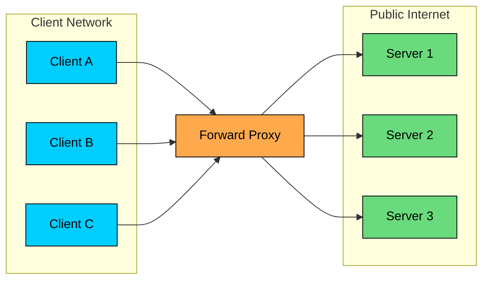
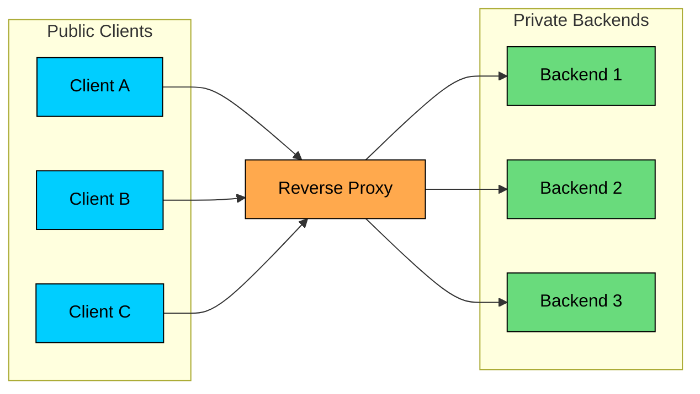

import React from 'react';
import CodeBlock from '../../../../components/ui/CodeBlock';
import Callout from '../../../../components/ui/Callout';

<div className="article-header">
  <div className="breadcrumb">
    <a href="/">Curated Notes</a>
    <span className="breadcrumb-separator">›</span>
    <span className="breadcrumb-current">Proxy vs Reverse Proxy</span>
  </div>
  <h1>Proxy vs Reverse Proxy</h1>
  <p style={{ color: 'var(--text-muted)', fontSize: '1.1rem', marginBottom: '16px', lineHeight: '1.6' }}>
    Master the essentials of Proxy vs Reverse Proxy in this curated guide.
  </p>
  <div className="meta-info">
    <span className="meta-item">
      <svg width="14" height="14" viewBox="0 0 24 24" fill="none" stroke="currentColor" strokeWidth="2"><circle cx="12" cy="12" r="10"/><polyline points="12 6 12 12 16 14"/></svg>
      10 min read
    </span>
    <span className="difficulty-badge difficulty-badge--intermediate">Intermediate</span>
  </div>
</div>

<section className="content-section">

A **proxy** is an intermediary that forwards network traffic on behalf of another party. The useful distinction is which party it represents: a **forward proxy** represents the client, and a **reverse proxy** represents the server.

Clients route outbound traffic through forward proxies for filtering, logging, caching, or egress control. Services place reverse proxies in front of their backends for TLS termination, routing, load balancing, and security.

That single difference in the direction of trust shows up across many infrastructure components: corporate egress proxies, API gateways, CDNs, load balancers, service meshes, WAFs, and Kubernetes ingress controllers.

---

## 1. Forward Proxy

A **forward proxy** sits between clients and the destinations they want to reach.

The destination server sees the proxy as the client. The proxy may hide the original client IP, enforce policy, log traffic, cache responses, or block requests.





Request flow:

1. A client sends a request to the forward proxy.
2. The proxy checks policy: destination, user, method, category, malware risk, or allowlist.
3. If allowed, the proxy opens a connection to the destination server.
4. The destination responds to the proxy.
5. The proxy returns the response to the client.

For HTTP traffic, the client may explicitly know it is using a proxy. For HTTPS, a forward proxy commonly uses the `CONNECT` method to create a TCP tunnel to the target host. If the organization performs TLS inspection, the proxy terminates and re-issues TLS using an enterprise-trusted certificate authority. That is powerful, but it is also a serious trust and privacy boundary.

#### Why Teams Use Forward Proxies

Forward proxies are common for outbound control.


| Use Case                 | What the Proxy Provides                                          |
| ------------------------ | ---------------------------------------------------------------- |
| Corporate egress control | Allow or block destinations, enforce policy, log outbound access |
| Privacy or IP masking    | Destination sees the proxy IP instead of the client's IP         |
| Content filtering        | Block malware, phishing, adult content, or unapproved services   |
| Caching                  | Reuse popular responses to reduce bandwidth                      |
| Developer access         | Route traffic through a bastion or controlled network path       |
| Compliance               | Centralize audit logs for outbound traffic                       |


Do not confuse IP masking with anonymity. A proxy operator can still log users, destinations, headers, timings, and payloads if it can see them. The destination may also identify users through cookies, browser fingerprints, logins, or application tokens.

#### Proxy vs VPN

A VPN and a forward proxy can both route traffic through an intermediary, but they operate differently.


&gt; **Is a VPN the same as a proxy?**
&gt;
&gt; No. A VPN usually creates an encrypted network tunnel for most or all device traffic. A proxy typically forwards traffic for specific applications or protocols. Either one can be misconfigured, logged, blocked, or inspected depending on who operates it.


---

## 2. Reverse Proxy

A **reverse proxy** sits in front of backend servers. Clients connect to the reverse proxy, and the reverse proxy forwards requests to the appropriate backend.

The client sees one stable endpoint. Backend servers can scale, move, fail, deploy, or remain private behind the proxy.





Request flow:

1. The client connects to [`https://api.example.com`](https://api.example.com).
2. DNS points that name to a reverse proxy, load balancer, CDN, gateway, or ingress.
3. The reverse proxy applies listener, TLS, routing, security, and timeout rules.
4. It selects a backend service or instance.
5. The backend responds to the reverse proxy.
6. The reverse proxy returns the response to the client.

Reverse proxies are common because they create a controlled boundary between public clients and private infrastructure.

#### What Reverse Proxies Provide


| Capability                 | Why It Matters                                                |
| -------------------------- | ------------------------------------------------------------- |
| TLS termination            | Centralizes certificates and HTTPS policy                     |
| Load balancing             | Sends traffic to healthy backend instances                    |
| Routing                    | Chooses backend by host, path, header, method, or protocol    |
| Caching                    | Reduces origin load and latency                               |
| Compression                | Shrinks responses before sending to clients                   |
| WAF and filtering          | Blocks known attack patterns and bad requests                 |
| Rate limiting              | Protects backends from abuse or overload                      |
| Authentication integration | Validates tokens or forwards identity metadata                |
| Observability              | Centralizes access logs, latency, status codes, and trace IDs |
| Connection management      | Reuses upstream connections and enforces timeouts             |


Examples include NGINX, HAProxy, Envoy, Apache httpd, Traefik, Caddy, Cloudflare, Fastly, AWS Application Load Balancer, Google Cloud Load Balancing, Azure Application Gateway, and Kubernetes ingress controllers.

---

## 3. Side-by-Side Comparison


| Aspect | Forward Proxy | Reverse Proxy |
|---|---|---|
| Represents | Clients | Servers or services |
| Traffic Direction | Outbound from a client network | Inbound to a service |
| Who Configures It | Client, browser, OS, enterprise network, workload platform | Service owner, platform team, CDN, cloud provider |
| Destination Sees | Proxy as the client | Reverse proxy as the server endpoint |
| Common Goal | Egress control, privacy, filtering, caching | Ingress control, routing, load balancing, security |
| Common Examples | Corporate proxy, Squid, browser proxy, egress proxy | NGINX, HAProxy, Envoy, CDN, API gateway, ingress |


The naming can be confusing because both are "in the middle." The direction of trust makes the difference.

---

## 4. Layer 4 vs Layer 7 Proxies

Proxies can operate at different layers.

#### Layer 4 Proxy

A Layer 4 proxy works with TCP or UDP connections. It may see source IP, destination IP, ports, TLS handshake metadata, and connection state, but it does not parse HTTP paths or headers.

Use Layer 4 when:

- You need TLS pass-through.
- The protocol is not HTTP.
- Throughput and simplicity matter.
- You want to preserve end-to-end application encryption.

#### Layer 7 Proxy

A Layer 7 proxy understands the application protocol, usually HTTP.

It can route or enforce policy using:

- Hostnames
- URL paths
- HTTP methods
- Headers
- Cookies
- gRPC methods
- JWT claims, when integrated carefully

Layer 7 gives richer control but creates more configuration and failure modes. If the proxy parses, modifies, retries, or buffers requests, it becomes part of the application behavior.

---

## 5. TLS Termination and Trust Boundaries

Reverse proxies often terminate TLS. The client establishes HTTPS with the proxy. The proxy then forwards traffic to the backend over HTTP or over a new TLS connection.

Common patterns:


| Pattern           | Description                                               | Tradeoff                                                   |
| ----------------- | --------------------------------------------------------- | ---------------------------------------------------------- |
| TLS termination   | Proxy decrypts; backend receives HTTP or internal traffic | Enables Layer 7 routing, but proxy can see plaintext       |
| TLS re-encryption | Proxy decrypts, inspects, then opens TLS to backend       | Stronger internal protection, more certificate management  |
| TLS pass-through  | Proxy forwards encrypted TCP without decrypting           | Preserves end-to-end encryption, limits HTTP-aware routing |


This is a security boundary. If a reverse proxy terminates TLS, it must be treated as trusted infrastructure. It can see headers, cookies, authorization tokens, request bodies, and responses.

For forward proxies, TLS inspection is even more sensitive. The proxy can only inspect HTTPS payloads if clients trust a certificate authority controlled by the proxy operator. That is appropriate in some enterprise environments, but it should be explicit and governed.

---

## 6. Headers and Client Identity

When a reverse proxy forwards a request, the backend often sees the proxy's IP address as the direct peer. If the backend needs the original client IP or scheme, the proxy must pass that information explicitly.

Common headers:


| Header              | Purpose                          |
| ------------------- | -------------------------------- |
| `Host`              | Original requested host          |
| `X-Forwarded-For`   | Chain of client and proxy IPs    |
| `X-Forwarded-Proto` | Original scheme, such as `https` |
| `Forwarded`         | Standardized forwarded metadata  |
| `X-Request-ID`      | Request correlation ID           |
| `traceparent`       | Distributed tracing context      |


Only trust these headers from proxies you control. Public clients can forge `X-Forwarded-For`. A good edge proxy strips untrusted forwarding headers and writes clean ones before traffic reaches the application.

Many production bugs come from getting this wrong:

- Apps generating `http://` redirects behind an HTTPS terminator
- Rate limiting the proxy IP instead of the real client IP
- Audit logs recording only load balancer addresses
- Security checks trusting forged client IP headers
- Broken absolute URLs because `Host` was not preserved

---

## 7. Caching

Both forward and reverse proxies can cache responses, but the goals differ.

Forward proxy caching saves bandwidth for a client network. Reverse proxy caching protects origin services and improves user-facing latency.

Caching must respect HTTP semantics:

- `Cache-Control`
- `ETag`
- `Vary`
- `Authorization`
- Cookies
- Query parameters
- Content encoding

Caching private or personalized responses incorrectly is a serious incident. A reverse proxy cache should treat authenticated and user-specific responses carefully unless the application explicitly marks them cacheable for the right scope.

---

## 8. Reverse Proxy vs Load Balancer vs API Gateway

These terms overlap in real products.


| Component          | Primary Role                                                                                               |
| ------------------ | ---------------------------------------------------------------------------------------------------------- |
| Reverse proxy      | Fronts services and forwards requests to backends                                                          |
| Load balancer      | Selects healthy backend instances or regions                                                               |
| API gateway        | Adds API-specific policy such as auth, rate limits, quotas, transformations, and developer-facing controls |
| CDN                | Caches and serves content from edge locations, often acting as a reverse proxy                             |
| Service mesh proxy | Handles service-to-service traffic, mTLS, retries, telemetry, and policy                                   |


A single system can be all of these. For example, Envoy can act as a reverse proxy, load balancer, API gateway component, and service mesh sidecar. Cloudflare can act as CDN, WAF, reverse proxy, and DDoS protection layer.

Labels matter less than behavior. Ask what traffic the component sees, what policy it enforces, and what failure modes it introduces.

---

## 9. NGINX Reverse Proxy Example

Here is a minimal NGINX reverse proxy for an HTTP backend.

#### Install and Reload


```shell
sudo apt update
sudo apt install nginx
sudo nginx -t
sudo systemctl reload nginx
```


#### Basic Reverse Proxy


```plaintext
server {
    listen 80;
    server_name example.com;

    location / {
        proxy_pass http://backend1.internal.example.com:8080;
        proxy_http_version 1.1;

        proxy_set_header Host $host;
        proxy_set_header X-Real-IP $remote_addr;
        proxy_set_header X-Forwarded-For $proxy_add_x_forwarded_for;
        proxy_set_header X-Forwarded-Proto $scheme;
        proxy_set_header X-Request-ID $request_id;

        proxy_connect_timeout 3s;
        proxy_read_timeout 30s;
        proxy_send_timeout 30s;
    }
}
```


#### Load Balancing Across Backends


```plaintext
upstream backend_app {
    least_conn;

    server backend1.internal.example.com:8080 max_fails=3 fail_timeout=10s;
    server backend2.internal.example.com:8080 max_fails=3 fail_timeout=10s;
    server backend3.internal.example.com:8080 max_fails=3 fail_timeout=10s;

    keepalive 64;
}

server {
    listen 80;
    server_name example.com;

    location / {
        proxy_pass http://backend_app;
        proxy_http_version 1.1;
        proxy_set_header Connection "";

        proxy_set_header Host $host;
        proxy_set_header X-Real-IP $remote_addr;
        proxy_set_header X-Forwarded-For $proxy_add_x_forwarded_for;
        proxy_set_header X-Forwarded-Proto $scheme;
    }
}
```


NGINX uses round robin by default. `least_conn` is useful when requests have uneven duration. Sticky routing is available through other mechanisms, but it should be used deliberately because it can hide statefulness in the backend.

This example is intentionally minimal. Production configurations also need TLS, access logs, request size limits, buffer settings, health checks or upstream failure policy, compression, security headers, and deployment-specific timeouts.

---

## 10. Failure Modes

Proxies improve architecture by adding indirection. They also become part of the critical path.

Common failure modes:


| Failure                    | What Happens                                                    |
| -------------------------- | --------------------------------------------------------------- |
| Proxy outage               | All dependent traffic fails even if backends are healthy        |
| Bad timeout                | Slow backends consume proxy resources or clients fail too early |
| Retry storm                | Proxy retries amplify backend overload                          |
| Buffering mismatch         | Streaming responses, uploads, or WebSockets break               |
| Header trust bug           | Application trusts forged client metadata                       |
| TLS misconfiguration       | Clients fail handshakes or security posture weakens             |
| Cache mistake              | Stale or private data is served incorrectly                     |
| Health check too shallow   | Proxy sends traffic to broken backends                          |
| Connection pool exhaustion | Proxy cannot open or reuse upstream connections                 |


For AI systems, watch long-running and streaming requests carefully. Token streams, file uploads, batch job submissions, and model inference calls need explicit timeout, buffering, and cancellation behavior. A proxy configured for short web requests can break these workflows under load.

---

## 11. Key Takeaways

Forward proxies and reverse proxies are both intermediaries, but they represent different sides of the connection.

- A **forward proxy** represents clients and controls outbound traffic.
- A **reverse proxy** represents services and controls inbound traffic.
- Reverse proxies often provide TLS termination, routing, load balancing, caching, WAF policy, rate limiting, and observability.
- Forward proxies are often used for egress control, filtering, privacy, compliance, and controlled access.
- Forwarded headers are trust-sensitive. Strip untrusted values at the edge and set clean ones.
- TLS termination creates a trust boundary; treat the proxy as sensitive infrastructure.
- A proxy can improve reliability, but it can also become a bottleneck or single point of failure.

In production, do not stop at "it forwards requests." Ask what the proxy can see, what it changes, what it caches, what it retries, what it logs, and what happens when it fails.

---

## Quiz

</section>
