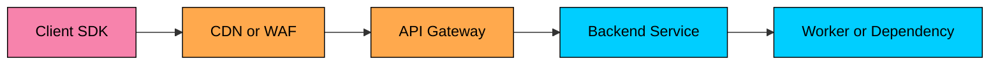

import React from 'react';
import CodeBlock from '../../../../components/ui/CodeBlock';
import Callout from '../../../../components/ui/Callout';

<div className="article-header">
  <div className="breadcrumb">
    <a href="/">Curated Notes</a>
    <span className="breadcrumb-separator">›</span>
    <span className="breadcrumb-current">Rate Limiting</span>
  </div>
  <h1>Rate Limiting</h1>
  <p style={{ color: 'var(--text-muted)', fontSize: '1.1rem', marginBottom: '16px', lineHeight: '1.6' }}>
    Master the essentials of Rate Limiting in this curated guide.
  </p>
  <div className="meta-info">
    <span className="meta-item">
      <svg width="14" height="14" viewBox="0 0 24 24" fill="none" stroke="currentColor" strokeWidth="2"><circle cx="12" cy="12" r="10"/><polyline points="12 6 12 12 16 14"/></svg>
      10 min read
    </span>
    <span className="difficulty-badge difficulty-badge--intermediate">Intermediate</span>
  </div>
</div>

<section className="content-section">

**Rate limiting** controls how much work a client is allowed to send into a system over a time window. It is an admission-control decision: for each incoming request, the system decides whether to let it start, reject it, or delay it.

Good rate limits do more than block abusive users. They protect shared capacity, keep one tenant from starving another, reduce retry storms, cap expensive operations, and make overload behavior predictable. A public API might allow `100 requests per minute` per API key. A login endpoint might allow `5 failed attempts per 10 minutes` per account. An AI API might limit by input tokens or daily spend rather than raw request count.

When a limit is exceeded, the system rejects the request quickly, usually with `429 Too Many Requests`, and tells the client when or how to retry. Doing this well requires choosing the right unit of work, the right key, the right algorithm, and the right behavior when shared state fails.

---

## 1. Why Rate Limiting Matters

Rate limits exist because backend capacity is finite.

Without limits, a single caller can consume thread pools, database connections, cache bandwidth, queue capacity, third-party API quota, or model-serving capacity. The caller may be malicious, but it may also be a normal client with a retry bug.

Rate limiting helps with five practical problems.

#### 1.1 Protecting Shared Infrastructure

One noisy tenant should not make the API slow for everyone else.

If tenant `acme` accidentally starts polling `GET /orders` thousands of times per second, the system should contain that load at the edge instead of letting it saturate the order service and database.

#### 1.2 Preserving Fairness

Rate limits divide capacity across users, tenants, plans, regions, or API keys.

A free plan might get `60 requests per minute`. An enterprise plan might get `5,000 requests per minute`. Internal services may have separate limits tied to the capacity they are allowed to consume.

#### 1.3 Controlling Cost

Some requests are much more expensive than others.

One `POST /generate-report` request may scan millions of rows. One LLM request with a large context window may cost more than hundreds of small metadata reads. Treating every request as equal is often wrong.

#### 1.4 Reducing Failure Amplification

When a dependency is slow, clients often retry. If every retry is admitted immediately, the system can turn a small incident into a large one.

Rate limits, retry budgets, and backoff rules keep failure from multiplying.

#### 1.5 Making API Behavior Explicit

Clear limits are part of the API contract. Clients can pace themselves, batch work, cache responses, and avoid unnecessary errors.

---

## 2. What Should Be Limited?

The first design decision is the unit of work.


| Limit Type | Example | When It Helps |
|------------|---------|---------------|
| **Request count** | `100 requests / minute` | Simple APIs where requests have similar cost |
| **Weighted requests** | Search costs `5`, metadata read costs `1` | Endpoints have different backend cost |
| **Bytes** | `100 MB uploaded / hour` | Upload, export, or media-heavy APIs |
| **Concurrency** | `10 in-flight requests` | Expensive or long-running operations |
| **Queue depth** | `1,000 pending jobs` | Async workers and background processing |
| **Tokens** | `1M input tokens / day` | AI inference and embedding APIs |
| **Money budget** | `$50 model spend / day` | Multi-model AI systems with variable provider cost |


Request count is easy to explain, but it is often too blunt. A production system usually combines several limits. For an AI chat API, a reasonable policy might cap requests per minute per user, concurrent generations per organization, input tokens per minute per model family, daily spend per workspace, and add stricter limits for tool calls that reach external systems.

The goal is not to invent complicated policy. The goal is to measure the resource that can run out.

---

## 3. Where Rate Limits Are Enforced

Rate limiting can happen at several layers.





Each layer has a different job.


| Layer | Good For | Weakness |
|-------|----------|----------|
| **Client SDK** | Pacing well-behaved clients | Cannot protect against buggy or hostile clients |
| **CDN / WAF** | IP-level abuse, bot traffic, coarse edge rules | Limited knowledge of authenticated users and business cost |
| **API gateway** | User, tenant, API key, route, and plan limits | May not know deep domain cost |
| **Service** | Domain-specific limits and expensive operation guards | Load has already reached the service |
| **Worker / dependency wrapper** | Protecting queues, third-party APIs, model pools, databases | Too late for general API admission control |


The best systems use layered limits. The edge blocks obvious abuse. The gateway enforces API policy. Domain services protect expensive business operations. Workers protect downstream capacity.

---

## 4. Core Concepts

Every rate limiter needs a few pieces of state.

#### 4.1 Key

The key identifies who or what is being limited. Common keys include IP address, user ID, organization or tenant ID, API key, route, model name, or a composite such as `tenant_id + endpoint + model`.

Choose keys carefully. IP-only limits punish users behind NATs and are easy for attackers to rotate. User-only limits can miss unauthenticated abuse. Tenant-level limits protect shared capacity better than only per-user limits.

#### 4.2 Limit

The limit defines how much work is allowed. Typical limits look like `100 requests per minute`, `10 concurrent exports`, `1,000 write operations per hour`, or `2 million tokens per day`.

#### 4.3 Window

The window defines the time interval used for the decision. Windows can be per second, per minute, per hour, or a rolling 24 hours. Short windows protect immediate capacity. Long windows enforce quota or pricing policy.

#### 4.4 Decision

For each request, the limiter returns one of three outcomes: allow, reject, or (sometimes) delay or enqueue. Most API gateways reject immediately when the limit is exceeded. Some internal systems queue or shed lower-priority work instead.

---

## 5. Rate Limiting Algorithms

There is no single best algorithm. Each one trades accuracy, memory, burst tolerance, and operational complexity.

The code examples below are single-process teaching implementations. In production, the same state transitions usually run inside an atomic datastore operation, gateway plugin, local limiter, or dedicated rate-limit service.

#### 5.1 Fixed Window Counter

The fixed window counter divides time into fixed buckets and counts requests in the current bucket.

Example policy:


```plaintext
Limit: 100 requests per minute
Window: 12:00:00 - 12:00:59
```


If the counter reaches `100`, new requests are rejected until the next minute starts.

#### How It Works

1. Compute the current window from the timestamp.
2. Increment a counter for `key + window`.
3. Allow the request if the counter is within the limit.
4. Expire the counter after the window ends.

#### Example


```plaintext
Key: user:42:/api/search
Window: 2026-05-25T12:00
Counter: 87 / 100
Decision: allow
```


#### Code Example


```python
import time

class FixedWindowLimiter:
    def __init__(self, limit, window_seconds):
        self.limit = limit
        self.window_seconds = window_seconds
        self.counts = {}

    def allow(self, key, now=None):
        now = time.time() if now is None else now
        window = int(now // self.window_seconds)
        counter_key = (key, window)

        count = self.counts.get(counter_key, 0) + 1
        self.counts[counter_key] = count

        # Production implementations should expire old window keys.
        return count <= self.limit
```


#### Pros

- Simple to implement.
- Cheap in memory.
- Works well for coarse quotas.
- Easy to implement with an atomic increment and TTL in Redis or another fast store.

#### Cons

- Allows bursts at window boundaries.
- A client can send `100` requests at `12:00:59` and another `100` at `12:01:00`.
- Not ideal for protecting resources that need smooth traffic.

Use fixed windows for simple quotas where boundary bursts are acceptable.

#### 5.2 Sliding Window Log

The sliding window log stores the timestamp of each request and counts only timestamps inside the rolling window.

Example:


```plaintext
Limit: 100 requests in any rolling 60-second period
```


#### How It Works

1. Store request timestamps for the key.
2. Remove timestamps older than the window.
3. Count the remaining timestamps.
4. Allow the request if the count is below the limit.
5. Add the new timestamp if allowed.

#### Code Example


```python
import time
from collections import defaultdict, deque

class SlidingWindowLogLimiter:
    def __init__(self, limit, window_seconds):
        self.limit = limit
        self.window_seconds = window_seconds
        self.events = defaultdict(deque)

    def allow(self, key, now=None):
        now = time.time() if now is None else now
        cutoff = now - self.window_seconds
        timestamps = self.events[key]

        while timestamps and timestamps[0] <= cutoff:
            timestamps.popleft()

        if len(timestamps) >= self.limit:
            return False

        timestamps.append(now)
        return True
```


#### Pros

- Very accurate.
- Handles boundary bursts correctly.
- Easy to reason about.

#### Cons

- Memory grows with request volume.
- Every decision may need cleanup of old timestamps.
- Expensive for high-cardinality, high-throughput APIs.

Use sliding logs when accuracy matters and the volume per key is modest, such as password reset attempts or sensitive account operations.

#### 5.3 Sliding Window Counter

The sliding window counter approximates a rolling window without storing every timestamp.

It keeps the current fixed-window count and the previous fixed-window count, then weights the previous window based on how much of it overlaps the rolling window.

Example:


```plaintext
Limit: 100 requests per minute
Previous window count: 80
Current window count: 30
Current window elapsed: 25%

Estimated count = 80 * 75% + 30 = 90
Decision: allow
```


The `75%` is not a coincidence: with 25% of the current window elapsed, 75% of the previous window still falls inside the trailing 60-second rolling view, so the previous count is weighted by that fraction.

#### Code Example


```python
import time

class SlidingWindowCounterLimiter:
    def __init__(self, limit, window_seconds):
        self.limit = limit
        self.window_seconds = window_seconds
        self.state = {}

    def allow(self, key, now=None):
        now = time.time() if now is None else now
        window_start = now - (now % self.window_seconds)

        current_start, previous_count, current_count = self.state.get(
            key,
            (window_start, 0, 0),
        )

        if window_start > current_start:
            windows_passed = int((window_start - current_start) // self.window_seconds)
            previous_count = current_count if windows_passed == 1 else 0
            current_count = 0
            current_start = window_start

        elapsed = now - current_start
        previous_weight = (self.window_seconds - elapsed) / self.window_seconds
        estimated_count = previous_count * previous_weight + current_count

        if estimated_count + 1 > self.limit:
            self.state[key] = (current_start, previous_count, current_count)
            return False

        current_count += 1
        self.state[key] = (current_start, previous_count, current_count)
        return True
```


#### Pros

- Smoother than a fixed window.
- Much cheaper than a sliding log.
- Good fit for many API gateway limits.

#### Cons

- Approximate, not exact.
- Slightly more complex than fixed windows.
- Still depends on consistent time calculations across limiter nodes.

Use sliding window counters when you need better boundary behavior without the memory cost of a full request log.

#### 5.4 Token Bucket

The token bucket algorithm allows controlled bursts.

A bucket holds tokens. Tokens refill at a steady rate up to a maximum capacity. Each request consumes one or more tokens. If the bucket has enough tokens, the request is allowed. If not, the request is rejected or delayed.

Example:


```plaintext
Refill rate: 10 tokens per second
Bucket size: 100 tokens
Request cost: 1 token
```


This allows a client to burst up to `100` requests after being idle, then continue at `10 requests per second`.

#### Code Example


```python
import time

class TokenBucketLimiter:
    def __init__(self, capacity, refill_rate_per_second):
        self.capacity = capacity
        self.refill_rate = refill_rate_per_second
        self.buckets = {}

    def allow(self, key, cost=1, now=None):
        now = time.monotonic() if now is None else now
        tokens, last_refill = self.buckets.get(key, (self.capacity, now))

        elapsed = max(0, now - last_refill)
        tokens = min(self.capacity, tokens + elapsed * self.refill_rate)

        if tokens < cost:
            self.buckets[key] = (tokens, now)
            return False

        tokens -= cost
        self.buckets[key] = (tokens, now)
        return True
```


#### Pros

- Handles bursts well.
- Controls long-term average rate.
- Common in API gateways, proxies, and service clients.
- Supports weighted costs: a cheap request costs `1`, an expensive request costs `10`.

#### Cons

- Allows bursts up to bucket capacity.
- Requires careful tuning of refill rate and burst size.
- Distributed implementations need atomic updates.

Use token buckets for public APIs where short bursts are acceptable but sustained traffic must stay within a rate.

#### 5.5 Leaky Bucket

The leaky bucket algorithm smooths traffic by processing requests at a constant rate.

Think of it as a small queue. Requests enter the bucket. Work leaves the bucket at a fixed rate. If the bucket is full, new requests are rejected.

#### Code Example


```python
import time
from collections import defaultdict, deque

class LeakyBucketLimiter:
    def __init__(self, capacity, leak_rate_per_second):
        self.capacity = capacity
        self.interval = 1.0 / leak_rate_per_second
        self.queues = defaultdict(deque)

    def allow(self, key, now=None):
        now = time.monotonic() if now is None else now
        queue = self.queues[key]

        while queue and queue[0] <= now:
            queue.popleft()

        if len(queue) >= self.capacity:
            return False

        last_scheduled = queue[-1] if queue else now
        queue.append(max(now, last_scheduled) + self.interval)
        return True
```


The example above implements admission-only smoothing: each accepted request reserves a future drain slot, and the limiter rejects when too many slots are pending. A delay-based variant would block the caller until the next drain time instead of returning immediately. Both shapes are called "leaky bucket" in practice; pick the one that matches whether your stack can pause callers.

#### Pros

- Produces smoother downstream traffic.
- Useful when a backend needs a steady request rate.
- Can protect fragile dependencies.

#### Cons

- Adds latency when admitted requests are forced to wait, or wastes capacity by rejecting when only the schedule is full.
- Less flexible for natural client bursts than token bucket.

Use leaky buckets when smoothing matters more than burst tolerance, especially in front of fragile downstream systems or third-party APIs.

---

## 6. Choosing an Algorithm


| Algorithm | Accuracy | Memory | Burst Behavior | Good Fit |
|-----------|----------|--------|----------------|----------|
| **Fixed window** | Low at boundaries | Low | Allows boundary bursts | Simple quotas |
| **Sliding log** | High | High | Strict rolling limit | Low-volume sensitive operations |
| **Sliding counter** | Medium-high | Low | Smooths boundary bursts | General API limits |
| **Token bucket** | Medium | Low | Allows configured bursts | Public APIs and weighted limits |
| **Leaky bucket** | Medium | Queue-sized | Smooths traffic | Protecting fragile dependencies |


As a default:

- Use token bucket for most per-user or per-API-key request limits.
- Use sliding window counter when boundary bursts are a real problem.
- Use sliding window log for sensitive, low-volume security controls.
- Use fixed window for simple quota enforcement.
- Use leaky bucket when the downstream system needs a steady flow.

---

## 7. Distributed Rate Limiting

Rate limiting becomes harder when traffic is handled by many gateway or service instances.

If each instance keeps only local counters, a client can exceed the global limit by spreading traffic across instances.


```plaintext
Limit: 100 requests per minute
Gateway instances: 10
Local limit per instance: 100
Actual possible traffic: 1,000 requests per minute
```


You need a strategy for shared state.

#### 7.1 Centralized Counter Store

Store counters in Redis, Memcached, DynamoDB, FoundationDB, or another fast shared system.

The limiter must update counters atomically. A common Redis implementation uses `INCR` plus `EXPIRE` for fixed windows, or Lua scripts for token buckets and sliding counters.

The trade-off is latency and availability. Every request may need a network call to the limiter store.

#### 7.2 Local Limiters With Periodic Sync

Each node enforces a local budget and periodically syncs with a central service.

This reduces latency and dependency on a central store, but the global limit becomes approximate. It works well when small overages are acceptable.

#### 7.3 Sharded Limiters

Route each rate-limit key to a specific shard.

This improves scalability, but hot tenants or popular API keys can overload a shard. You may need key splitting, adaptive limits, or special handling for large tenants.

#### 7.4 Multi-Region Limits

Global limits across regions are expensive to enforce exactly. Cross-region coordination adds latency and can fail during network partitions. The common approaches are to enforce per-region limits and accept small global drift, allocate regional budgets from a global quota, pin each tenant to a home region, or enforce strict global limits only for costly operations.

Exact global rate limiting is rarely worth the operational cost for ordinary request counts. It may be worth it for money, quota, abuse, or compliance-sensitive operations.

---

## 8. Failure Modes

Rate limiters sit on the request path. Their failure behavior matters.

#### 8.1 Race Conditions

The check and increment must be atomic.

This is wrong:


```plaintext
1. Read current count.
2. If count < limit, allow.
3. Increment count.
```


Two requests can read the same count and both pass. Use an atomic operation or a transaction.

#### 8.2 Missing Expiration

Counters need TTLs. Without expiration, every user, route, and window key stays in memory forever.

#### 8.3 Hot Keys

Large tenants, popular API keys, or NATed IP addresses can create hot keys. A single counter can become the bottleneck.

Plan for high-cardinality keys and high-traffic tenants separately.

#### 8.4 Clock Skew

Algorithms based on wall-clock time can behave strangely when nodes disagree about time.

Prefer server-side time from the limiter store when possible. Use monotonic clocks for local elapsed-time calculations.

#### 8.5 Fail Open vs Fail Closed

If the limiter store is unavailable, should requests be allowed?

There is no universal answer.

- For public read APIs, failing open may preserve availability.
- For login attempts, payment operations, expensive AI calls, or abuse controls, failing closed or using a small local emergency budget may be safer.

Make this decision explicitly. Do not let timeout behavior decide it for you.

#### 8.6 Retry Storms

A rejected request can create more traffic if clients retry immediately.

Return clear retry information and design clients to use exponential backoff with jitter.

---

## 9. HTTP Responses and Headers

When an HTTP client exceeds a limit, return `429 Too Many Requests`.

Include a response body that explains the limit in stable, machine-readable terms.

Example:


```plaintext
HTTP/1.1 429 Too Many Requests
Retry-After: 30
Content-Type: application/json

{
  "error": "rate_limit_exceeded",
  "message": "Too many requests for this API key.",
  "limit": 100,
  "window_seconds": 60,
  "retry_after_seconds": 30
}
```


The `Retry-After` header tells the client how long to wait before trying again.

Many APIs also return rate-limit metadata headers. The IETF HTTPAPI working group's `draft-ietf-httpapi-ratelimit-headers` defines structured fields named `RateLimit` and `RateLimit-Policy`. The draft is still evolving, so syntax can change between revisions:


```plaintext
RateLimit-Policy: "burst";q=100;w=60
RateLimit: "burst";r=0;t=30
```


Many production APIs still use earlier `RateLimit-*` fields:


```plaintext
RateLimit-Limit: 100
RateLimit-Remaining: 0
RateLimit-Reset: 30
```


Older APIs may use `X-RateLimit-*` variants.

Header conventions still vary across platforms and specifications. Document exactly what your API sends, what each value means, whether failed requests count, and whether limits are per user, tenant, route, API key, or some combination.

Clients should treat headers as hints, not guarantees. Servers may lower limits during incidents, deploy new policies, or shed load for reasons outside the normal quota window.

---

## 10. Rate Limiting and AI Systems

AI workloads make rate limiting more complicated because request count is a poor proxy for cost.

Two requests can differ by orders of magnitude:

- A short classification call with 200 input tokens.
- A chat request with 200,000 input tokens, retrieval, tool calls, and a long streamed answer.

Useful AI rate limits often include input tokens per minute, output tokens per minute, concurrent generations, requests per model pool, tool calls per user, vector search queries per tenant, daily or monthly spend, and model allowlists by plan.

Streaming also changes behavior. A request may be admitted quickly but hold a connection and model slot for a long time. Limit both admission rate and concurrency for streaming endpoints.

Do not log full prompts or responses just to debug rate limits. Track token counts, model, tenant, request ID, and policy decision. Keep sensitive content out of logs by default.

---

## 11. Practical Design Checklist

Before adding a rate limit, answer these questions:

1. What resource are we protecting?
2. What key identifies the caller or tenant?
3. Is the limit based on request count, cost, concurrency, bytes, tokens, or money?
4. What happens when the limit is exceeded?
5. Are retries safe for this endpoint?
6. Should failed requests count?
7. Is the limit global, regional, or local to one service?
8. What happens if the limiter store is down?
9. What headers and errors will clients receive?
10. What dashboards and alerts show rate-limit decisions?

Rate limits should be observable. Track allowed requests, rejected requests, limiter latency, hot keys, store errors, and top limited tenants or API keys.

---

## 12. Key Takeaways

- Rate limiting is admission control for shared capacity.
- The right unit is not always request count; use tokens, cost, bytes, concurrency, or weighted requests when those match the real bottleneck.
- Token bucket is a strong default for public APIs because it supports bursts while controlling sustained rate.
- Fixed windows are simple but allow boundary bursts.
- Sliding logs are accurate but expensive.
- Distributed rate limiting requires atomic updates, explicit failure behavior, and careful handling of hot keys and multi-region drift.
- For HTTP APIs, return `429 Too Many Requests`, include `Retry-After` when useful, and document rate-limit headers clearly.

</section>
