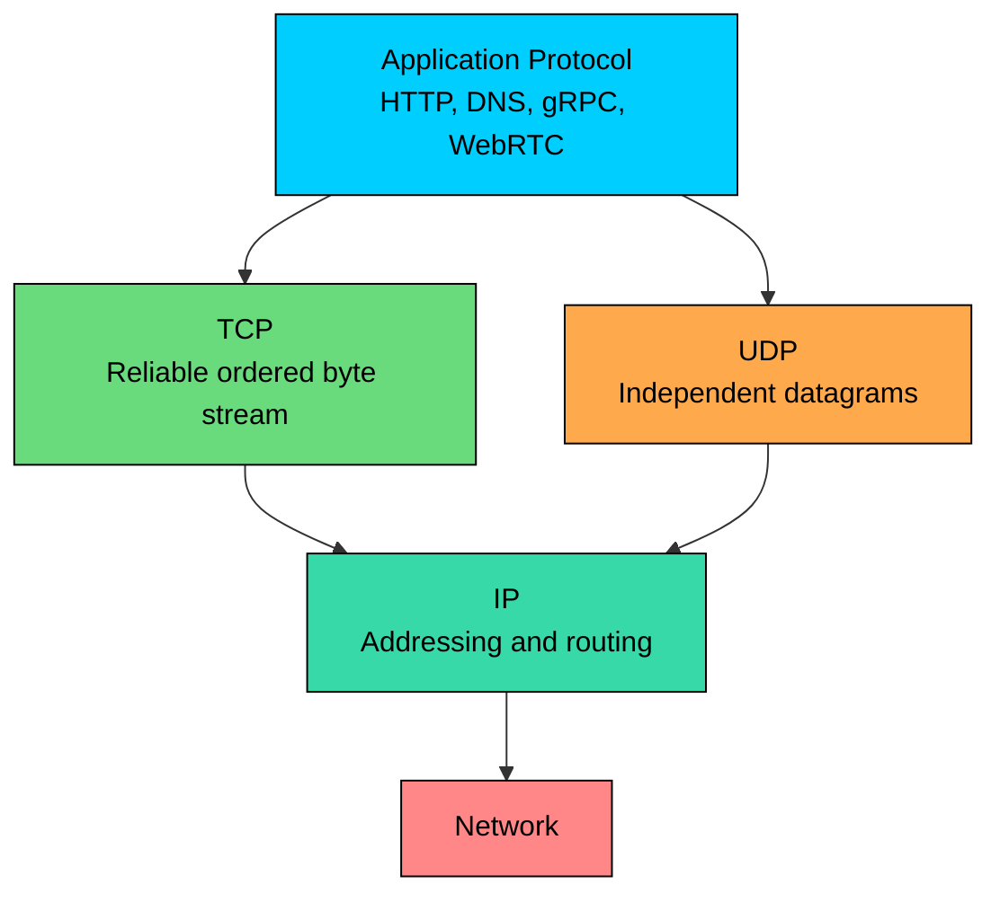
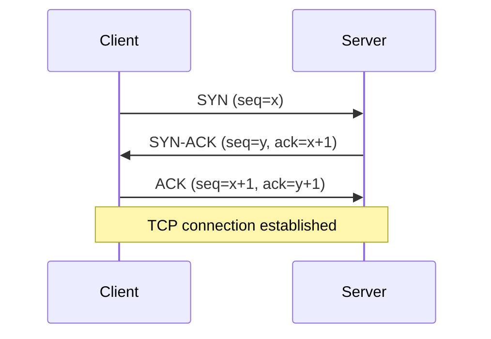
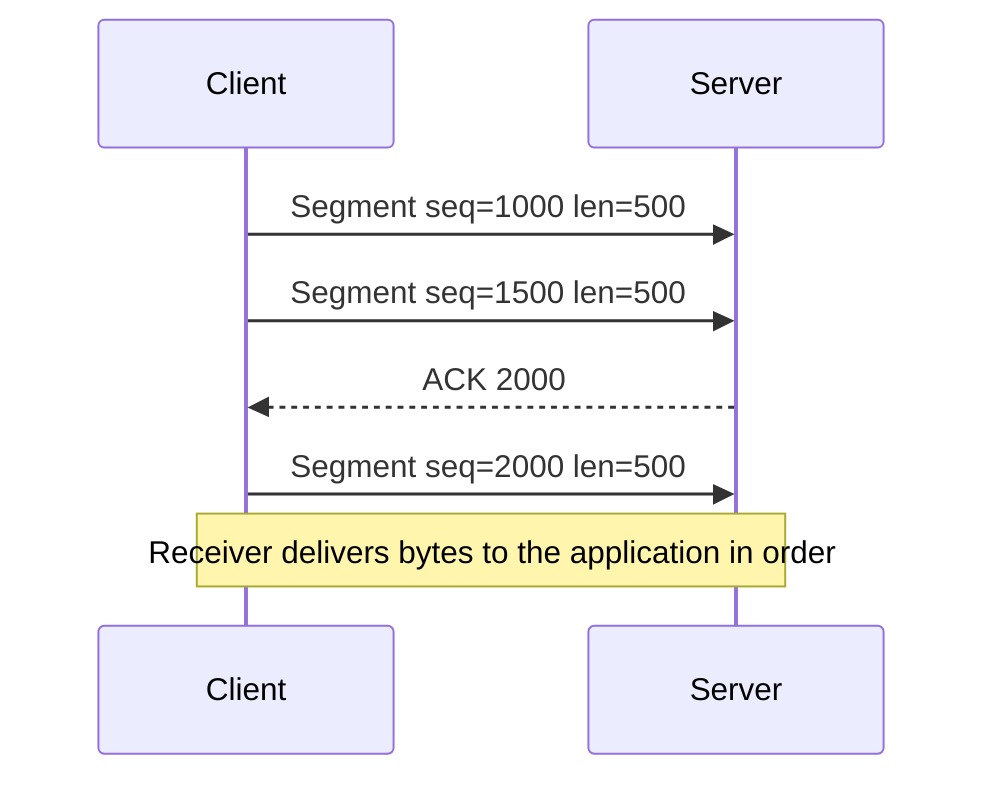
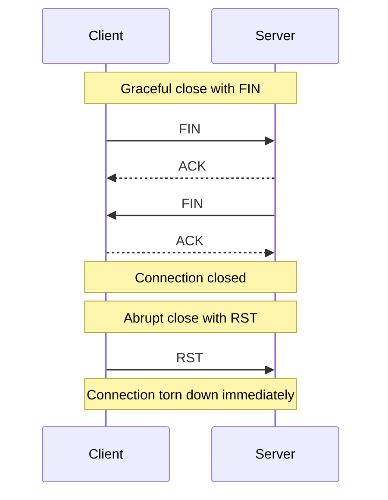
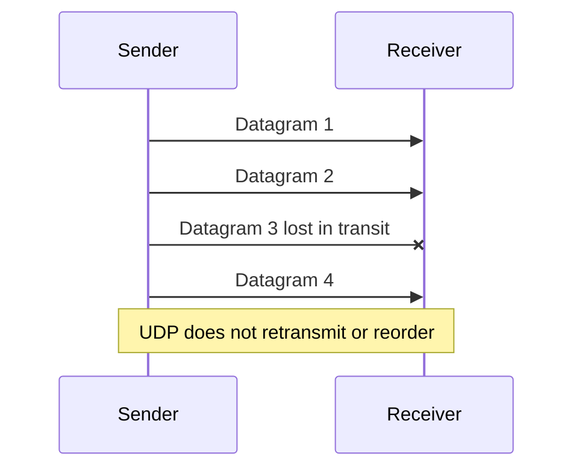
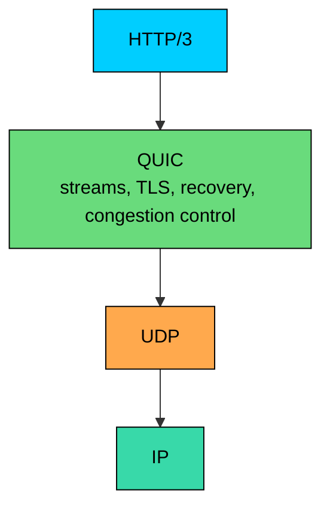

import React from 'react';
import CodeBlock from '../../../../components/ui/CodeBlock';
import Callout from '../../../../components/ui/Callout';

  

    <a href="/">Curated Notes</a>
    ›
    TCP vs UDP
  

  <h1>TCP vs UDP</h1>
  

    Master the essentials of TCP vs UDP in this curated guide.
  

  

    
      <svg width="14" height="14" viewBox="0 0 24 24" fill="none" stroke="currentColor" strokeWidth="2"><circle cx="12" cy="12" r="10"/><polyline points="12 6 12 12 16 14"/></svg>
      10 min read
    
    Intermediate
  

<section className="content-section">

**TCP** and **UDP** are the two transport protocols that sit directly above IP. Both solve the same problem of delivering data between processes using ports, but they make very different tradeoffs.

TCP gives applications a reliable, ordered byte stream. UDP gives applications independent, best-effort datagrams with almost no transport behavior of its own.

The choice between them depends on what the application should do when packets are lost, delayed, duplicated, reordered, or blocked. Modern stacks complicate the picture further, because QUIC, the transport behind HTTP/3, runs over UDP while adding TLS, reliability, and congestion control in user space.

---

## 1. The Transport Layer

IP gets packets from one host or network interface toward another. The **transport layer** gets data to the right process on that host.

Transport protocols provide some combination of:

- **Ports:** Identify the application endpoint, such as `443` for HTTPS or `5432` for PostgreSQL.
- **Segmentation:** Split larger application data into pieces that fit the path.
- **Reassembly:** Put received pieces back into a useful form.
- **Reliability:** Detect loss and retransmit, if the protocol supports it.
- **Ordering:** Deliver data in the order the application expects, if the protocol supports it.
- **Flow control:** Prevent a sender from overwhelming the receiver.
- **Congestion control:** Reduce sending rate when the network appears congested.

TCP provides most of these behaviors in the transport layer. UDP provides ports, length, and checksums, then leaves reliability, ordering, pacing, and recovery to the application or to another protocol built on top of UDP.

---

## 2. TCP

**TCP (Transmission Control Protocol)** is connection-oriented. Before application data is exchanged, the client and server establish connection state. Once established, TCP presents the application with a byte stream.

**TCP is a stream, not a message protocol.** If an application writes three messages, the receiver may read them as one combined chunk, three chunks, or several partial chunks. Message boundaries belong to the application protocol, not TCP.

TCP is a good fit when the application needs all bytes delivered in order and would rather wait than process stale or incomplete data.

#### What TCP Provides

TCP provides:

- **Connection setup:** A three-way handshake establishes connection state and sequence numbers.
- **Ordered delivery:** Bytes are delivered to the application in sequence.
- **Retransmission:** Lost segments are resent.
- **Duplicate suppression:** Duplicate data is detected through sequence numbers.
- **Flow control:** The receiver advertises how much data it can accept.
- **Congestion control:** The sender adjusts its rate to avoid overloading the network.
- **Backpressure:** A slow receiver or congested path eventually slows the sender.

TCP does not guarantee that an application operation succeeds. It guarantees reliable, ordered delivery of bytes while the connection remains healthy. If a connection breaks after the server commits a database transaction but before the client receives the response, the client still needs timeouts, retries, idempotency keys, and duplicate handling.

#### Connection Setup

TCP uses a three-way handshake:

1. **SYN:** The client asks to open a connection and sends an initial sequence number.
2. **SYN-ACK:** The server acknowledges the client sequence number and sends its own.
3. **ACK:** The client acknowledges the server sequence number.

After that, both sides can exchange data.

The handshake costs at least one round trip before application data flows, although TLS 1.3, connection reuse, TCP Fast Open in limited environments, and QUIC can reduce setup costs in different ways.

#### Data Transfer

During transfer, TCP tracks byte positions with sequence numbers. The receiver acknowledges data it has received. If data is lost, the sender retransmits it.

The cost of this reliability is waiting. If one TCP segment is lost, later bytes may already be sitting in the receiver's buffer, but the application cannot receive them until the missing bytes arrive. This is **head-of-line blocking** at the TCP stream level.

For many systems, that behavior is required. A SQL result, an HTTP response body, or a file download is usually useless if bytes are missing or reordered.

#### Connection Close

TCP connections can close gracefully with FIN packets or abruptly with RST packets.

A graceful close means each side has finished sending bytes. It does not mean the business operation succeeded. Applications still need clear protocol-level success responses and durable state handling.

#### Where TCP Fits

TCP is the default for:

- HTTP/1.1 and HTTP/2
- Traditional HTTPS
- SSH
- SMTP, IMAP, and many mail flows
- Database connections such as PostgreSQL and MySQL
- Most internal RPC systems, including standard gRPC over HTTP/2
- Message brokers and queues that require ordered byte streams

For request-response APIs, admin tools, database protocols, and most service-to-service calls, TCP remains the boring and correct choice.

---

## 3. UDP

**UDP (User Datagram Protocol)** is connectionless. It sends independent datagrams without a transport-layer handshake.

UDP does not provide reliable delivery, ordering, retransmission, flow control, or congestion control by itself. A UDP datagram may arrive, arrive late, arrive twice, arrive out of order, or never arrive.

That tradeoff is intentional. For real-time systems, waiting for old data can be worse than dropping it.

#### What UDP Provides

UDP provides:

- **Ports:** Source and destination process identifiers.
- **Datagram boundaries:** One send maps to one datagram at the UDP layer.
- **Length:** The receiver knows the datagram size.
- **Checksum:** Corruption detection. The UDP checksum is mandatory in IPv6 and optional in IPv4, though commonly used.
- **No connection setup:** The sender can transmit immediately.

UDP's small header is 8 bytes. TCP's base header is 20 bytes before options. Header size matters in some environments, but the bigger difference is behavioral: UDP does not make the sender wait for acknowledgments or retransmissions.

#### How UDP Works

An application creates a datagram and sends it to a destination IP and port. If an application is listening there and the network delivers the datagram, the receiver can process it. If the datagram is lost, UDP does not recover it.

Applications that use UDP responsibly usually add what they need:

- Sequence numbers to detect loss or reordering
- Timestamps to discard stale data
- Application-level acknowledgments for important messages
- Forward error correction for media
- Rate control to avoid flooding the network
- Encryption through DTLS, SRTP, or QUIC

UDP is not permission to ignore congestion. A high-volume UDP system that sends faster than the network can carry will cause loss, hurt other traffic, and often hurt itself.

#### Where UDP Fits

UDP is commonly used for:

- DNS queries
- Real-time voice and video
- Online games
- WebRTC media
- QUIC and HTTP/3
- Service discovery and local network protocols
- Telemetry where occasional loss is acceptable

UDP is a good fit when timeliness matters more than complete delivery, or when a higher-level protocol provides its own transport behavior.

---

## 4. TCP vs UDP

| Feature | TCP | UDP |
|---|---|---|
| Abstraction | Ordered byte stream | Independent datagrams |
| Connection setup | Three-way handshake | No transport handshake |
| Reliability | Retransmits lost data while connection is healthy | No built-in retransmission |
| Ordering | Delivers bytes in order | No ordering guarantee |
| Message boundaries | Not preserved | Preserved per datagram |
| Flow control | Built in | Not built in |
| Congestion control | Built in | Not built in |
| Head-of-line blocking | Yes, within the TCP stream | Not at UDP layer |
| Typical protocols | HTTP/1.1, HTTP/2, SSH, databases, SMTP | DNS, QUIC, WebRTC media, games |

The simplest rule: use TCP when the application wants a complete ordered stream, and use UDP when the application can tolerate loss, needs low-latency datagrams, or is built on a protocol such as QUIC that adds the missing pieces back in.

Avoid saying "TCP is slow and UDP is fast." TCP can achieve excellent throughput on healthy paths. UDP can perform badly if the application handles loss, pacing, or packet size poorly.

---

## 5. QUIC and HTTP/3

The modern TCP-vs-UDP conversation has to include **QUIC**.

QUIC is a transport protocol carried inside UDP datagrams. It was originally developed at Google and later standardized by the IETF. HTTP/3 is HTTP semantics carried over QUIC.

QUIC uses UDP not because UDP magically improves performance, but because UDP is widely deployable through existing networks and lets QUIC implement transport behavior in user space instead of depending on operating-system TCP stacks.

QUIC provides:

- Connection establishment with integrated TLS 1.3
- Encryption by default
- Reliability and retransmission
- Congestion control
- Flow control
- Multiplexed streams
- Connection migration when a client changes networks, such as moving from WiFi to cellular

QUIC avoids one important TCP limitation for multiplexed protocols. In HTTP/2 over TCP, many streams share one TCP connection. If one TCP segment is lost, all streams behind that missing byte can be blocked at the TCP layer. QUIC has independent streams, so loss on one stream does not block delivery of unrelated streams in the same way.

QUIC is not always better. UDP may be blocked or degraded by some networks. QUIC can be harder for legacy middleboxes to inspect. Operators need observability, fallback behavior, and careful rollout.

---

## 6. Choosing Between TCP, UDP, and QUIC

Start with application semantics, not protocol fashion.

#### Choose TCP When

TCP is usually right when:

- Every byte matters.
- Data must be processed in order.
- The application protocol is already built around streams.
- You want mature behavior through firewalls, proxies, and enterprise networks.
- You are using common protocols such as HTTP/1.1, HTTP/2, SSH, PostgreSQL, MySQL, SMTP, or standard gRPC.

Examples:

- A payment API call
- A database transaction
- A file upload where the final object must be exact
- An internal gRPC call with deadlines and retries
- An admin SSH session

#### Choose UDP When

UDP is usually right when:

- Fresh data is more valuable than complete old data.
- The application can tolerate loss or repair it itself.
- You need datagram boundaries.
- You are building on an existing UDP-based protocol.
- You control pacing, retransmission, and congestion behavior.

Examples:

- Real-time voice and video packets
- Game state updates
- DNS lookups
- Local discovery protocols
- Telemetry where occasional loss is acceptable

#### Choose QUIC or HTTP/3 When

QUIC or HTTP/3 can be a strong fit when:

- You want HTTP semantics over a modern encrypted transport.
- Connection setup latency matters.
- Clients move between networks, such as mobile users switching from WiFi to cellular.
- Multiplexed streams suffer from TCP head-of-line blocking.
- You can operate UDP/443 reliably and provide fallback to TCP-based HTTP when needed.

Examples:

- Browser-facing web traffic at scale
- Mobile APIs where connection migration helps
- Streaming responses from an AI inference endpoint
- Latency-sensitive edge APIs
- Systems that benefit from HTTP/3 but can fall back to HTTP/2

---

## 7. Production Design Considerations

Protocol choice affects reliability, capacity, and operations.

#### Timeouts and Retries

TCP retransmits bytes. It does not retry application operations.

A client that times out after sending a request may not know whether the server processed it. This is why APIs that mutate state need idempotency keys, request IDs, deduplication, or clear retry semantics.

For UDP systems, application-level retry behavior must be explicit. DNS retries are different from game-state updates, and both are different from media recovery.

#### Packet Size and MTU

Large packets are more likely to be fragmented or dropped. Fragmentation is especially painful for UDP because losing one fragment loses the whole datagram.

Practical guidance:

- Keep UDP datagrams comfortably below common path MTUs unless the protocol handles discovery and fragmentation carefully.
- Do not assume jumbo frames exist outside controlled networks.
- For TCP, understand that the stack handles segmentation, but path MTU issues can still cause stalls.

#### Load Balancing

TCP load balancers usually assign a connection to a backend and keep that flow stable.

UDP is trickier because there may be no connection in the transport-layer sense. Load balancers often use a flow hash over source IP, source port, destination IP, destination port, and protocol. NAT rebinding, mobile network changes, and short-lived datagrams can affect routing behavior.

QUIC has connection IDs that help maintain connection continuity even when client IP or port changes, if infrastructure supports it correctly.

#### Observability

TCP gives operators familiar signals: connection counts, resets, retransmits, SYN backlog, accept queue, connection duration, and socket errors.

UDP systems need protocol-specific metrics:

- Datagrams sent and received
- Loss estimate
- Jitter
- Reordering
- Application-level acknowledgments
- Dropped packets at socket buffers
- Rate limiting and pacing behavior

For QUIC and HTTP/3, expose handshake failures, fallback rates, stream resets, congestion metrics, and UDP reachability.

#### Security

Neither TCP nor UDP automatically makes an application secure.

- TCP applications commonly use TLS.
- UDP applications can use DTLS, SRTP, WireGuard-style protocols, or QUIC's integrated TLS 1.3.
- UDP services need care around spoofing and amplification attacks.
- Public UDP endpoints should enforce rate limits and validate clients before sending large responses.

Security comes from the protocol stack and operational controls, not from choosing TCP or UDP alone.

---

## 8. Real-World Examples

#### Web and APIs

HTTP/1.1 and HTTP/2 commonly run over TCP with TLS. HTTP/3 runs over QUIC over UDP. A mature web platform often supports HTTP/2 and HTTP/3, measures performance, and falls back cleanly when UDP is blocked.

#### Databases

Databases generally use TCP because queries, results, transactions, and replication streams need reliable ordered bytes. The harder design problems are connection pooling, timeout handling, transaction retries, and backpressure.

#### DNS

DNS traditionally uses UDP for small queries because it is simple and low latency. DNS can also use TCP, and modern encrypted DNS variants include DNS over TLS, DNS over HTTPS, and DNS over QUIC. The right transport depends on payload size, privacy, deployment environment, and resolver support.

#### Real-Time Media

Voice and video systems usually prefer timely delivery over perfect delivery. A late audio packet is often useless. These systems use jitter buffers, codecs, packet loss concealment, forward error correction, and congestion control to keep the session usable.

#### Online Games

Games often send frequent state updates over UDP. If a player position update is lost, the next update may supersede it. Critical events, such as inventory changes or purchases, need reliable application-level handling or a separate reliable channel.

#### AI Systems

Most AI APIs use TCP-based HTTPS because request integrity, authentication, and broad compatibility matter. Streaming tokens can use HTTP chunking, Server-Sent Events, WebSockets, gRPC streaming, or HTTP/3 depending on the client and platform.

Internal AI infrastructure may use TCP or gRPC for control-plane calls and model metadata, while using specialized streaming or UDP-based protocols for real-time media input, low-latency interactive experiences, or telemetry where loss is acceptable.

---

## 9. Key Takeaways

TCP and UDP are transport-layer tools with different contracts.

- TCP gives a reliable, ordered byte stream, but it does not guarantee application success.
- UDP gives independent datagrams with minimal transport behavior.
- TCP preserves byte order, not application message boundaries.
- UDP preserves datagram boundaries, but not delivery or order.
- TCP includes flow control and congestion control.
- UDP applications must provide their own pacing, reliability, and recovery when needed.
- QUIC runs over UDP and adds encryption, streams, recovery, congestion control, and connection migration.
- Protocol choice should follow application semantics: correctness, timeliness, network compatibility, operational visibility, and failure handling.

In system design, the better question is what the application should do when data is late, lost, duplicated, reordered, or processed twice. "TCP is reliable" and "UDP is fast" are starting points, not design conclusions.

---

## Quiz

</section>
