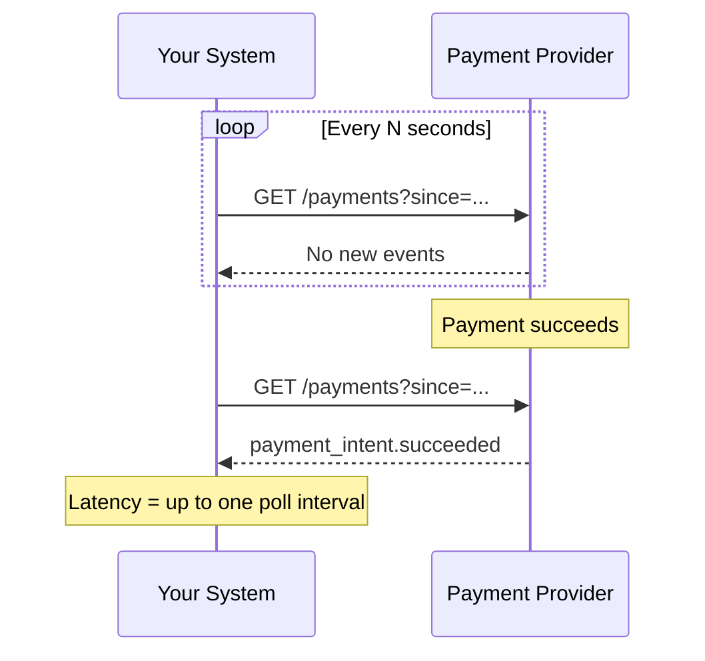
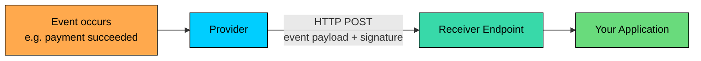
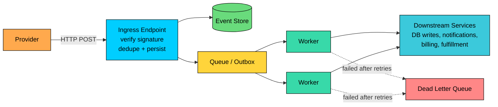

import React from 'react';
import CodeBlock from '../../../../components/ui/CodeBlock';
import Callout from '../../../../components/ui/Callout';

<div className="article-header">
  <div className="breadcrumb">
    <a href="/">Curated Notes</a>
    <span className="breadcrumb-separator">›</span>
    <span className="breadcrumb-current">Webhooks</span>
  </div>
  <h1>Webhooks</h1>
  <p style={{ color: 'var(--text-muted)', fontSize: '1.1rem', marginBottom: '16px', lineHeight: '1.6' }}>
    Master the essentials of Webhooks in this curated guide.
  </p>
  <div className="meta-info">
    <span className="meta-item">
      <svg width="14" height="14" viewBox="0 0 24 24" fill="none" stroke="currentColor" strokeWidth="2"><circle cx="12" cy="12" r="10"/><polyline points="12 6 12 12 16 14"/></svg>
      10 min read
    </span>
    <span className="difficulty-badge difficulty-badge--intermediate">Intermediate</span>
  </div>
</div>

<section className="content-section">

Suppose you run an e-commerce system and use a payment provider such as [Stripe](https://stripe.com/). When a payment succeeds, your system needs to mark the order paid, send a receipt, and notify fulfillment. The catch is that you do not control when the bank confirms the payment or when a subscription invoice is paid.

One option is polling: repeatedly ask the provider for new events.





Polling wastes work when most checks return "nothing changed" and adds latency until the next poll.

A **webhook** flips the direction. Instead of your system repeatedly asking for updates, the provider sends an HTTP request to your system when an event occurs.

This chapter covers what a webhook is, how webhook delivery works, what a webhook request contains, how to build a safe webhook receiver, and how to design webhook processing for production scale.

---

## 1. What Is a Webhook?

&gt; A webhook is an HTTP callback from one system to another when an event occurs.

The sending system is usually called the **provider**. The receiving system exposes an endpoint and is often called the **consumer** or **receiver**.





Common examples include a payment provider sending `payment_intent.succeeded`, GitHub sending `pull_request.opened`, a CI system sending `build.failed`, an AI platform sending `fine_tuning.job.completed`, a document processing service sending `extraction.completed`, or a vector database sending `indexing.failed`.

Webhooks are a push-based integration pattern. They are useful when a system needs to react to a change owned by another system.

Webhooks do not remove distributed-systems failure modes. A webhook is still an HTTP request crossing an unreliable network. It can be delayed, duplicated, delivered out of order, or fail completely until retried. Good webhook design starts with those assumptions.

---

## 2. How Webhooks Work

At a high level, webhook delivery has four steps: **registration, event creation, delivery, and acknowledgment**.

#### Example: GitHub Webhook to Your App

Suppose you operate an internal developer platform. When someone opens a pull request in GitHub, your platform should start checks, post a Slack notification, and update a deployment dashboard.

Here is the flow.

#### Step 1: Register an Endpoint

You configure a webhook in GitHub:

- Endpoint URL: [`https://platform.example.com/webhooks/github`](https://platform.example.com/webhooks/github)
- Events: `pull_request`, `push`, `issue_comment`
- Secret: a high-entropy value shared between GitHub and your receiver

The endpoint must be reachable by the provider. For public SaaS providers, that usually means a public HTTPS URL. For private integrations, it may mean a webhook relay, private connectivity, or an outbound agent inside your network.

#### Step 2: The Provider Records an Event

When a pull request is opened, GitHub records an internal event. The event normally includes the event type (such as `pull_request`), the action (such as `opened`), a delivery identifier, repository and actor metadata, and either resource data or a reference to fetch it.

#### Step 3: The Provider Sends an HTTP Request

The provider sends a `POST` request to your endpoint. The request usually contains a JSON body and provider-specific headers.

The provider may also sign the payload with a shared secret. Your receiver uses that signature to verify that the request came from the provider and that the payload was not modified in transit.

#### Step 4: Your Receiver Acknowledges Receipt

Your receiver should do the minimum required work in the request path: read the raw request body, verify the signature, validate the event type, persist the event or enqueue it durably, and return a `2xx` response.

Heavy work should happen asynchronously. Do not call half a dozen downstream services while the provider is waiting for the webhook response.

---

## 3. Anatomy of a Webhook Request

Most webhooks use `POST` because event data belongs in the request body. Some systems support other methods, but `POST` is the standard shape for webhook delivery.

A webhook request usually has three parts: the endpoint URL, request headers, and request body.

#### Request Headers

Headers carry delivery metadata and security information. The exact names vary by provider.

Common headers include:


| Header | Purpose |
|--------|---------|
| `Content-Type` | Usually `application/json` |
| Event type header | Event name, such as `pull_request` or `payment_intent.succeeded` |
| Delivery ID | Unique identifier for this delivery attempt or event |
| Signature | HMAC or similar signature used to verify authenticity |
| Timestamp | Helps detect replayed requests when used with a signature |
| User agent | Identifies the sender, such as GitHub or Stripe |


Do not build your design around generic header names like `X-Event-Type`. Real providers use their own names. GitHub uses headers such as `X-GitHub-Event`, `X-GitHub-Delivery`, and `X-Hub-Signature-256`. Stripe uses `Stripe-Signature`.

#### Request Body

The body usually contains an event envelope and a resource payload.

The envelope tells you what happened. The resource payload gives details about the object involved.

#### Example: GitHub Pull Request Event


```json
{
  "action": "opened",
  "number": 42,
  "pull_request": {
    "id": 11223344,
    "title": "Add login validation",
    "user": {
      "login": "octocat"
    },
    "created_at": "2026-05-24T12:00:00Z"
  },
  "repository": {
    "name": "awesome-project",
    "full_name": "octocat/awesome-project"
  },
  "sender": {
    "login": "octocat"
  }
}
```


#### Example: AI Job Completed Event


```json
{
  "id": "evt_01HYZ8R7J8K2Z5Q9N4J3P2A1BC",
  "type": "batch.completed",
  "created_at": "2026-05-24T12:03:41Z",
  "data": {
    "job_id": "batch_9f8e7d6c",
    "status": "completed",
    "input_file_id": "file_in_123",
    "output_file_id": "file_out_456",
    "request_count": 25000,
    "failed_request_count": 17
  }
}
```


This style is common in modern AI systems. Long-running work such as batch inference, file parsing, fine-tuning, data labeling, and vector indexing often completes outside the original request. A webhook lets the provider notify your system when the job reaches a terminal state.

---

## 4. Building a Webhook Receiver

A webhook receiver looks simple from the outside: accept a request and return a response.

In production, the hard parts are reliability and trust. Events can be duplicated, arrive out of order, or be retried by the provider after a failed delivery. Attackers can send forged requests, downstream systems may be slow or unavailable, and your receiver may be redeployed mid-delivery.

#### 4.1 Dedicated Endpoint

Expose a narrow endpoint for each provider or integration:


```plaintext
POST /webhooks/github
POST /webhooks/stripe
POST /webhooks/ai-jobs
```


The endpoint should accept only the expected HTTP method and content types, use HTTPS in production, apply request size limits, avoid session authentication and CSRF requirements intended for browser forms, and keep provider-specific parsing and verification isolated.

Provider-specific endpoints are usually easier to operate than a single generic `/webhook` route because each provider has different signature rules, headers, payload shapes, retry behavior, and event names.

#### 4.2 Verify Before Parsing Business Data

Verify the webhook before you trust the payload.

Most providers use HMAC signatures. The provider computes a signature using the raw request body and a shared secret. Your receiver recomputes the signature and compares it with the signature header.

A few details matter. Verify against the raw request body, not a re-serialized JSON object, and use constant-time comparison so a timing side-channel cannot leak the secret. Include the timestamp in verification when the provider supports it and reject stale timestamps to reduce replay risk. Store secrets in a secrets manager and support secret rotation without downtime.


```java
// Stripe-style: sign timestamp + "." + rawBody, header carries "t=..,v1=.."
String signedPayload = timestamp + "." + rawRequestBody;
String expected = hmacSha256(secret, signedPayload);

// GitHub uses a "sha256=" prefix on X-Hub-Signature-256
String providedSignature = stripPrefix(signatureFromHeader, "sha256=");

if (!constantTimeEquals(expected, providedSignature)) {
    return "401 Unauthorized";
}

if (Math.abs(now() - timestamp) > FIVE_MINUTES) {
    return "401 Unauthorized";  // stale, reject to prevent replay
}
```


This example shows the shape of the check. In real code, use the provider's official library when one exists. Signature formats vary: Stripe signs a timestamped payload and sends `Stripe-Signature: t=..,v1=..`; GitHub prefixes its hex digest with `sha256=` in `X-Hub-Signature-256`; others use different schemes and may keep multiple active secrets during rotation.

#### 4.3 Make Processing Idempotent

Most webhook providers use at-least-once delivery. That means your receiver must assume duplicates.

Do not treat "we returned 200 last time" as proof that the business operation ran exactly once. The response may have been lost. The provider may redeliver manually. Operators may replay old events during recovery.

Use a stable idempotency key such as the provider event ID (`evt_123`), the provider delivery ID (GitHub's delivery GUID), or a resource ID plus event type when the provider emits distinct event objects for the same resource change. Store processed IDs in durable storage with a unique constraint.


```sql
CREATE TABLE webhook_events (
  provider TEXT NOT NULL,
  event_id TEXT NOT NULL,
  event_type TEXT NOT NULL,
  status TEXT NOT NULL,
  received_at TIMESTAMP NOT NULL DEFAULT now(),
  processed_at TIMESTAMP,
  payload JSONB NOT NULL,
  PRIMARY KEY (provider, event_id)
);
```


When a duplicate arrives, return success if the original event was already accepted.


```java
if (eventAlreadyAccepted(provider, eventId)) {
    return "200 OK";
}
```


This does not create true exactly-once delivery. It creates idempotent side effects, which is the practical goal.

#### 4.4 Do Not Depend on Delivery Order

Providers often do not guarantee event order. Even when events are created in order, retries can reorder delivery.

For example, retries or network reordering may cause your receiver to observe events in an unexpected sequence:


```plaintext
invoice.paid
customer.subscription.created
invoice.created
```


Even when the provider creates these events in the correct order on its side, the order you see at the endpoint can differ. Your handler should not assume that `created` always arrives before `paid`.

Common strategies include fetching the latest resource state from the provider before applying important changes, using resource version numbers or timestamps when available, making state transitions explicit and rejecting invalid regressions, and reconciling periodically by querying the provider for missed or inconsistent records.

For payments, the webhook is often best treated as a signal: "something changed." The authoritative state may still need to be fetched from the provider API before fulfilling an order or granting access.

#### 4.5 Return the Right Status Code

Provider retry rules differ, but the broad pattern is simple: `2xx` means accepted, non-`2xx` usually means failed and may be retried.

Use status codes deliberately:


| Response | Meaning |
|----------|---------|
| `200 OK` or `204 No Content` | Event was accepted or already processed |
| `400 Bad Request` | Payload is malformed or unsupported |
| `401 Unauthorized` / `403 Forbidden` | Signature or authorization check failed |
| `404 Not Found` | Endpoint is wrong or no longer exists |
| `429 Too Many Requests` | Receiver is overloaded; treated as a retryable failure by most providers |
| `500` / `503` | Temporary receiver failure; provider should retry |


Do not return `200 OK` before the event is durably accepted. If your process crashes after returning success but before persisting the event, the provider has no way to know it never made it to disk and will not retry.

---

## 5. Webhook Security

Webhook endpoints are public attack surfaces. Treat them like unauthenticated internet-facing APIs until proven otherwise.

#### Verify Signatures

Signature verification is the main defense against forged webhooks.

Without it, anyone who discovers your endpoint could send fake events such as `payment_succeeded`, `subscription_active`, `admin_user_created`, or `batch.completed`, leading to free access, incorrect financial records, leaked data, or unauthorized workflow execution.

#### Protect Against Replay

A valid webhook can still be replayed later by an attacker or by an operator using redelivery tooling.

Reject signatures with stale timestamps when supported, deduplicate by event or delivery ID, record received and processed events, and make downstream side effects idempotent.

Replay protection is especially important for events that grant access, move money, send email, or trigger external jobs.

#### Use IP Allow Lists Carefully

Some providers publish IP ranges for webhook delivery. Allow lists can reduce noise and block obvious spoofing attempts.

They should not replace signature verification.

IP ranges change, traffic may come through relays, and private network paths can be reconfigured. If you use allow lists, automate updates and monitor rejected traffic.

#### Avoid Sensitive Data Leaks

Be disciplined with logging and responses. Do not log secrets, tokens, authorization headers, or full payment payloads. Do not put secrets in webhook URLs, and never return stack traces or internal error messages to the provider. Redact PII before sending logs to third-party observability tools, and keep test and production webhook secrets separate.

---

## 6. Designing Scalable Webhook Infrastructure

A simple synchronous handler can work for low volume. It will struggle once traffic spikes, downstream dependencies slow down, or multiple providers retry at the same time.

A production webhook pipeline separates **ingestion** from **processing**.





#### 6.1 Keep Ingestion Fast

The ingress endpoint should verify the signature, validate the basic envelope, deduplicate or reserve the event ID, persist the raw event, enqueue a processing job in the same transaction as the persist (transactional outbox), and return a `2xx` response.

This keeps the provider-facing path short and predictable. The outbox boundary matters: persisting to the database and enqueueing into a separate broker as two independent writes reintroduces the dual-write problem, where a crash between the two can either drop the event or process it twice. Either commit both atomically (a row in an `outbox` table that a relay forwards to the queue), or skip the queue entirely and let workers poll the events table.

For queues, common choices include:

- **SQS** for managed queueing with simple operational overhead
- **RabbitMQ** for flexible routing and traditional work queues
- **Kafka** for high-throughput event streams and replay
- **Cloud Pub/Sub** or **Azure Service Bus** for managed queueing on those clouds

The queue choice matters less than the boundary: the webhook endpoint should not be responsible for expensive business processing.

Some providers can also deliver events directly to managed event buses such as Amazon EventBridge or Azure Event Grid. That can reduce public endpoint operations, but the same design rules still apply: verify trust boundaries, persist important events, process idempotently, and monitor failures.

#### 6.2 Store Events for Audit and Replay

Persist incoming events before processing them.

Store:

- Provider
- Event ID and event type
- Delivery ID, if separate from event ID
- Headers needed for debugging
- Raw payload or redacted payload
- Signature verification result
- Processing status
- Timestamps for received, queued, processed, failed, and replayed states

This event store gives you an operational ledger. It lets you answer practical questions:

- Did we receive the provider event?
- Did signature verification fail?
- Did we enqueue it?
- Which worker processed it?
- Which downstream call failed?
- Can we replay it safely?

For sensitive domains, store the raw payload only if you have a clear retention and redaction policy.

#### 6.3 Process with Workers

Workers perform the actual business logic: fetch the latest provider state when needed, apply idempotent state transitions, update internal databases, call downstream services, trigger notifications or workflows, and mark the event as processed or failed.

Workers let you control concurrency. That matters for expensive workloads such as AI batch output processing, embedding generation, document parsing, and analytics fan-out. You can scale workers horizontally, apply per-provider rate limits, and pause a bad event type without taking down the public webhook endpoint.

#### 6.4 Retry with Backoff and Jitter

Some failures are temporary: database failover, provider API timeout, downstream service deployment, rate limiting, or a transient network blip. Retry these with exponential backoff and jitter.

Do not retry all errors the same way. A malformed payload or unsupported event type will not become valid after 10 attempts. Classify failures as retryable or terminal.

Good retry design includes a maximum attempt count, backoff with jitter, per-provider and per-tenant rate limits, visibility into the next retry time, idempotent worker logic, and manual replay tooling for operators.

#### 6.5 Use a Dead Letter Queue

After repeated failures, move the event to a dead letter queue or failed-event table.

A DLQ is not a trash can. It is an investigation queue.

For each DLQ event, operators should be able to see:

- Provider and event type
- Payload or redacted payload
- Error message and stack trace
- Attempt count
- First failure time and last failure time
- Related internal resource IDs

After the underlying issue is fixed, replay the event through the same idempotent processing path.

#### 6.6 Add Observability

Webhook failures are easy to miss. The provider may retry silently, and your users may only notice the downstream symptom: an order stuck in `PENDING`, a fine-tuning job never marked complete, or an invoice email not sent.

Track metrics at each stage:

- Events received by provider and event type
- Signature verification failures
- Accepted vs rejected events
- Queue depth and oldest event age
- Processing latency
- Retry count
- DLQ count
- Downstream API failure rate
- End-to-end time from provider event creation to local processing

Useful alerts:

- Sudden drop to zero events from an active provider
- Spike in signature failures
- Growing queue backlog
- Increasing event age
- DLQ count above zero for critical event types
- High webhook endpoint latency or non-`2xx` rate

Logs should include correlation IDs, provider event IDs, and internal resource IDs. Distributed traces are useful when webhook processing fans out to multiple services.

---

## 7. Common Mistakes

Avoid these mistakes in production systems:

1. **Doing too much work in the HTTP handler:** This increases timeout risk and makes provider retries more likely.
2. **Skipping signature verification:** A public endpoint without verification is an open workflow trigger.
3. **Parsing JSON before preserving the raw body:** Many signature checks require the exact bytes that were sent.
4. **Assuming exactly-once delivery:** Webhooks are commonly delivered at least once. Design for duplicates.
5. **Assuming event order:** Retries and provider internals can reorder delivery.
6. **Returning success before durable persistence:** A crash after `200 OK` can lose the event permanently.
7. **Subscribing to every event type:** Extra events add load, cost, and operational noise.
8. **No reconciliation job:** Webhooks are delivery signals. Critical systems still need a way to compare local state with provider state.

---

## 8. When to Use Webhooks

Use webhooks when:

- Another system owns the event
- Your system needs to react soon after the event occurs
- Polling would add unnecessary latency or cost
- The receiver can expose or operate a reliable endpoint
- You can handle retries, duplicates, and delayed delivery

Avoid webhooks as the only mechanism when:

- The receiver cannot be reached reliably
- Strict ordering is required
- The consumer must control throughput tightly
- Events are mission-critical and there is no replay or reconciliation path
- The provider cannot sign requests or identify events reliably

In many production systems, webhooks and polling are used together. The webhook gives fast notification. A reconciliation job periodically polls the provider to catch missed, delayed, or inconsistent events.

---

## Summary

Webhooks are a practical way for systems to notify each other about events without constant polling.

The simple version is "send an HTTP request when something happens." The production version is more precise:

- Verify the sender
- Persist before acknowledging
- Process asynchronously
- Assume duplicates
- Do not depend on ordering
- Retry safely
- Reconcile critical state
- Make the whole path observable

Handled this way, webhooks become a reliable integration boundary for payments, developer workflows, SaaS automation, AI job orchestration, and many other distributed-system workflows.

</section>
