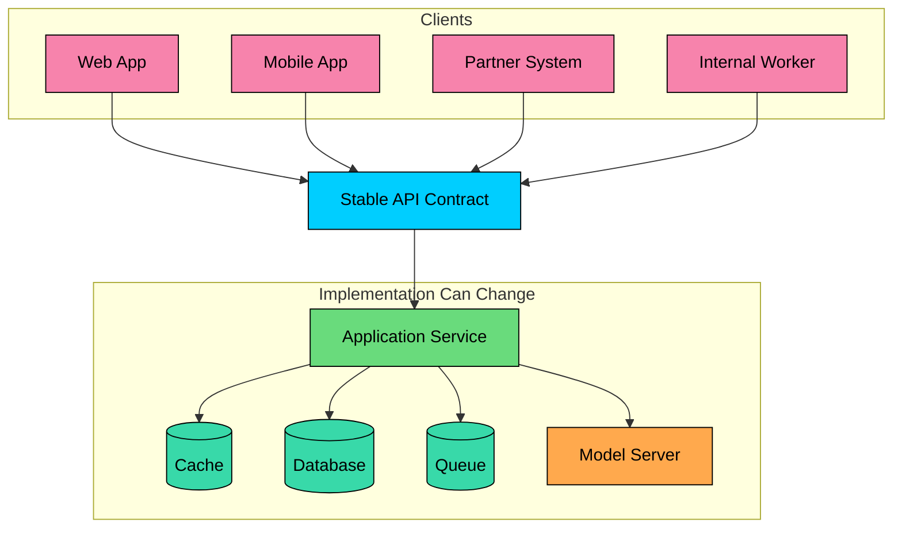

import React from 'react';
import CodeBlock from '../../../../components/ui/CodeBlock';
import Callout from '../../../../components/ui/Callout';

<div className="article-header">
  <div className="breadcrumb">
    <a href="/">Curated Notes</a>
    <span className="breadcrumb-separator">›</span>
    <span className="breadcrumb-current">What's an API?</span>
  </div>
  <h1>What's an API?</h1>
  <p style={{ color: 'var(--text-muted)', fontSize: '1.1rem', marginBottom: '16px', lineHeight: '1.6' }}>
    Master the essentials of What's an API? in this curated guide.
  </p>
  <div className="meta-info">
    <span className="meta-item">
      <svg width="14" height="14" viewBox="0 0 24 24" fill="none" stroke="currentColor" strokeWidth="2"><circle cx="12" cy="12" r="10"/><polyline points="12 6 12 12 16 14"/></svg>
      10 min read
    </span>
    <span className="difficulty-badge difficulty-badge--intermediate">Intermediate</span>
  </div>
</div>

<section className="content-section">

**API** stands for Application Programming Interface. An API is a contract that lets one piece of software use another without knowing its internal implementation. The contract defines what operations are available, what inputs are accepted, what outputs are returned, and what errors mean.

APIs come in many shapes. A weather API returns forecast data for a location. A payment API processes a charge. A model inference API streams generated tokens. A library API exposes functions inside a process. In every case the caller works against the contract, not the provider's database, source code, or infrastructure.

The boundary is where engineering discipline shows up. It is where the system validates input, authenticates callers, enforces authorization, applies rate limits, reports errors, and protects internal services from direct exposure. A good API hides everything else.

---

## 1. What an API Contract Defines

A useful API contract answers several questions.


| Contract Area | Example |
|---------------|---------|
| Operation | `GET /v1/orders/ord_123` |
| Input | Path parameters, query parameters, headers, and request body |
| Output | JSON response, binary file, stream, or event |
| Error model | Status codes, error codes, retry guidance |
| Authentication | API key, OAuth token, session cookie, mTLS |
| Authorization | Which caller can access which resource |
| Limits | Rate limits, payload size, timeout, pagination |
| Compatibility | Versioning, deprecation, optional fields |


For a network API, the contract may be written in documentation, OpenAPI, Protocol Buffers, GraphQL schema definitions, AsyncAPI, or a provider-specific format. For a library API, the contract may be expressed through function signatures, type definitions, docstrings, and tests.

#### 1.1 An API Contract in Practice


```plaintext
POST /v1/model-runs HTTP/1.1
Host: api.example.com
Authorization: Bearer <token>
Content-Type: application/json
Idempotency-Key: 5d4b6b3e-6b81-4e5a-8b7f-7d4c2d8fd831
```


```json
{
  "model": "recommendation-ranker",
  "input": {
    "user_id": "usr_123",
    "candidate_item_ids": ["item_1", "item_2", "item_3"]
  }
}
```


The response should be predictable:


```json
{
  "id": "run_789",
  "status": "queued",
  "created_at": "2026-05-25T10:30:00Z"
}
```


The caller should also know what can go wrong:


```json
{
  "type": "https://api.example.com/errors/invalid-request",
  "title": "Invalid request",
  "status": 400,
  "detail": "candidate_item_ids must contain at least one item",
  "request_id": "req_abc123"
}
```


This is the difference between "the server returned some data" and "the system has a contract clients can build against."

---

## 2. APIs Are Boundaries

APIs let systems evolve independently. The server can change its database schema, storage engine, model serving stack, queue provider, or internal service layout without forcing every client to change, as long as the API contract remains compatible.





This boundary is valuable for several reasons:

- **Encapsulation:** Callers use behavior without knowing internals.
- **Compatibility:** Old clients keep working while the server changes carefully.
- **Security:** Callers get controlled access instead of direct database or system access.
- **Ownership:** Teams can own service boundaries and publish contracts.
- **Reuse:** Several clients can use the same capability.
- **Observability:** Requests can be measured, logged, traced, and audited at the boundary.

APIs also create obligations. A public API that breaks clients is a production incident. An internal API with vague ownership becomes a coordination tax. A model API that hides latency, cost, or safety behavior makes downstream systems hard to reason about.

---

## 3. Types of APIs

APIs can be grouped by who uses them and how they are called.

#### 3.1 Public APIs

Public APIs are exposed to external developers, customers, partners, or third-party systems. They need clear documentation, stable contracts, authentication and authorization, rate limits and quotas, a versioning and deprecation policy, safe error responses, and support channels backed by operational monitoring. Examples include payment APIs, maps APIs, messaging APIs, cloud APIs, and AI platform APIs.

#### 3.2 Partner APIs

Partner APIs are exposed to selected external organizations. They are not open to everyone, but they still cross company boundaries, and they often need stronger operational controls than public self-service APIs: contract review, tenant-specific access, audit logging, data-sharing restrictions, change-management windows, and higher support expectations.

#### 3.3 Internal APIs

Internal APIs are used inside one organization. A checkout service may call inventory, payment, fraud, fulfillment, notification, and analytics services.

Internal APIs still need timeouts, schema compatibility, ownership, documentation, and clear failure behavior. The blast radius can be larger than a public API because internal services often sit on checkout, login, payment, search, or inference request paths.

#### 3.4 Library APIs

Library APIs are called inside the same process. A programming language standard library, web framework, database client, or ML library exposes functions, classes, and types.


```python
numbers = [5, 3, 8, 1, 4]
numbers.sort()

fruits = ["apple", "banana"]
fruits.append("orange")
last = fruits.pop()
```


The caller does not know how Python stores list capacity internally. The API exposes behavior.

---

## 4. Network APIs

Most system design discussions focus on network APIs. A client sends data over a network to a server, and the server responds or streams results.

#### 4.1 Request Parts

An HTTP API request usually has:


| Part | Purpose | Example |
|------|---------|---------|
| Method | Operation semantics | `GET`, `POST`, `PATCH`, `DELETE` |
| Path | Target resource or action | `/v1/orders/ord_123` |
| Query string | Filtering, pagination, options | `?limit=50&cursor=abc` |
| Headers | Metadata and credentials | `Authorization`, `Accept`, `Content-Type` |
| Body | Structured input | JSON payload |


```plaintext
GET /v1/orders?limit=20&status=paid HTTP/1.1
Host: api.example.com
Accept: application/json
Authorization: Bearer <token>
```


#### 4.2 Response Parts

An HTTP API response usually has:


| Part | Purpose | Example |
|------|---------|---------|
| Status code | Outcome at the HTTP level | `200`, `201`, `400`, `401`, `404`, `429`, `500` |
| Headers | Metadata | `Content-Type`, `Cache-Control`, `RateLimit-Remaining` |
| Body | Returned representation or error | JSON object, file bytes, stream |


```json
{
  "data": [
    {
      "id": "ord_123",
      "status": "paid",
      "total_cents": 8997
    }
  ],
  "next_cursor": "cur_456"
}
```


The body should not be the only place where the outcome is encoded. A failed request should not return `200 OK` with `{ "success": false }` unless the API has a deliberate protocol reason. Generic clients, gateways, proxies, SDKs, and monitoring systems depend on status codes.

---

## 5. Common API Styles

Different API styles use different contracts.


| Style | Contract Shape | Common Use |
|-------|----------------|------------|
| REST | Resources and HTTP semantics | Public web APIs, product backends |
| GraphQL | Typed graph and client queries | Flexible product screens over connected data |
| gRPC | Service methods and Protocol Buffers | Internal service-to-service APIs |
| WebSocket | Long-lived bidirectional connection | Chat, collaboration, trading, games |
| Server-Sent Events | One-way HTTP event stream | Progress updates, notifications, token streaming |
| Webhooks | HTTP callbacks | Provider-to-server event notifications |
| Message-driven APIs | Events on a broker | Asynchronous fanout and data pipelines |
| SOAP | XML envelopes and WSDL | Legacy enterprise integrations |


The first API in a small product is often REST because it is easy to inspect, easy to document, and works across browsers, mobile apps, scripts, and backend services. As the system grows, other styles may appear for specific needs: GraphQL for client-shaped reads, gRPC for typed internal calls, SSE for token streaming, WebSocket for bidirectional sessions, and events for asynchronous workflows.

---

## 6. Authentication, Authorization, and Limits

An API usually needs to know who is calling, what they are allowed to do, and how much traffic they can send.

#### 6.1 Authentication

Authentication identifies the caller.

Common methods:

- **API keys:** Common for server-to-server access and developer platforms.
- **OAuth 2.0 access tokens:** Common when a user or client grants scoped API access.
- **Session cookies:** Common for browser applications.
- **mTLS:** Common for internal services and high-trust enterprise integrations.

Do not put API keys or bearer tokens in query parameters. URLs can appear in browser history, proxy logs, analytics systems, referrer headers, and monitoring tools. Use headers such as `Authorization`.

#### 6.2 Authorization

Authorization decides whether the caller can perform the requested action on the requested resource.

An authenticated user may still be forbidden from reading another tenant's invoice, deleting another team's dataset, or using a model they are not licensed to call. Authorization must check the resource and the role.

#### 6.3 Rate Limits and Quotas

Rate limits protect the API from overload and abuse. Quotas enforce product or tenant usage limits.

For AI APIs, a request-count limit is often not enough. A short chat completion and a large document-processing request have different cost profiles. Token counts, file size, model type, concurrency, and queue time may all matter.

---

## 7. API Reliability

Production APIs need clear failure behavior.

#### 7.1 Timeouts

Every API call should have a timeout. Without timeouts, callers can wait indefinitely, threads can pile up, and downstream outages can spread through the system.

#### 7.2 Retries

Retries are useful only when the operation is safe to repeat or the API supports idempotency. Retrying `GET /orders/ord_123` is usually fine. Retrying `POST /payments` without an idempotency key can charge twice.

#### 7.3 Idempotency

Idempotency means repeating the same request has the same intended effect as sending it once.

Payment, order creation, model-run creation, and job-submission APIs often use idempotency keys:


```plaintext
POST /v1/payments HTTP/1.1
Host: api.example.com
Authorization: Bearer <token>
Content-Type: application/json
Idempotency-Key: 0f05d9c5-1a68-4dc5-b17a-88ef6c7e3e37
```


#### 7.4 Observability

APIs should emit enough telemetry to debug production issues. At minimum that means a request or trace ID, the caller identity or tenant (when safe to log), the route and method, the status code, the latency, the payload size, any rate-limit decisions, and timing for downstream dependencies. Logs must avoid secrets, credentials, raw access tokens, sensitive personal data, model prompts, and private documents unless the system has explicit controls for that data.

---

## 8. How Engineers Use an API

A practical API integration flow looks like this:

1. Read the official documentation or machine-readable contract.
2. Identify authentication, required scopes, limits, and pricing.
3. Test a request with `curl`, an API client, or a generated SDK.
4. Validate success and error responses.
5. Add timeouts, retries, and idempotency where appropriate.
6. Handle rate limits and pagination.
7. Log request IDs and important failure details.
8. Keep credentials out of code, URLs, logs, and client-side bundles.

Example `curl` request:


```shell
curl https://api.example.com/v1/weather?city=London \
  -H "Accept: application/json" \
  -H "Authorization: Bearer $API_TOKEN"
```


Example Python request:


```python
import os
import requests

token = os.environ["API_TOKEN"]

response = requests.get(
    "https://api.example.com/v1/weather",
    params={"city": "London"},
    headers={
        "Accept": "application/json",
        "Authorization": f"Bearer {token}",
    },
    timeout=5,
)

if response.status_code == 200:
    print(response.json())
elif response.status_code == 429:
    raise RuntimeError("Rate limit exceeded")
else:
    raise RuntimeError(f"API call failed: {response.status_code}")
```


This example keeps the token in an environment variable, sends it in a header, uses query parameters for non-secret input, and sets a timeout.

---

## Summary

An API is a contract between software systems. It defines operations, inputs, outputs, errors, security expectations, limits, and compatibility rules.

APIs are boundaries. They let clients use capabilities without direct access to databases, source code, infrastructure, or internal services.

Public, partner, internal, and library APIs have different audiences, but all benefit from clear contracts and predictable behavior.

Network APIs need disciplined handling of methods, paths, headers, bodies, status codes, authentication, authorization, rate limits, timeouts, retries, and observability.

Strong APIs make systems easier to integrate, evolve, secure, and operate. Weak APIs leak implementation details and turn every client into a special case.

</section>
