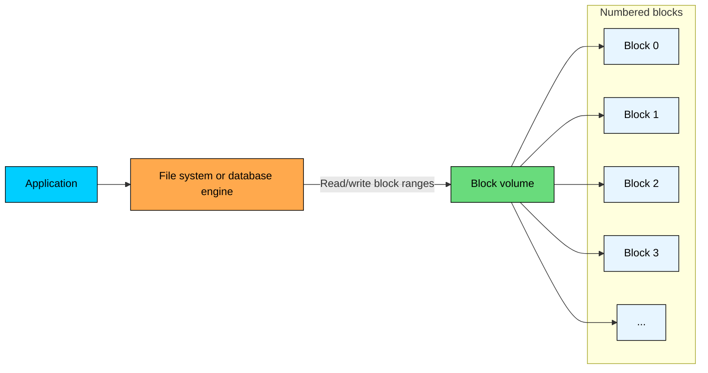
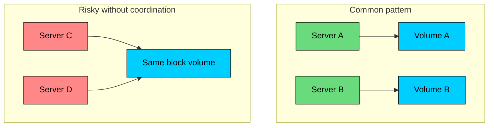
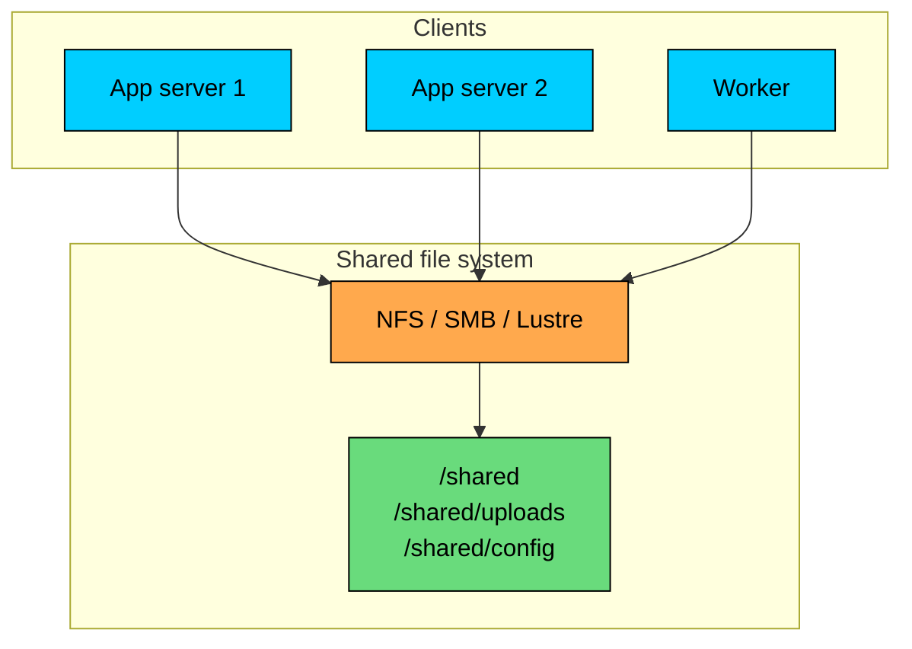
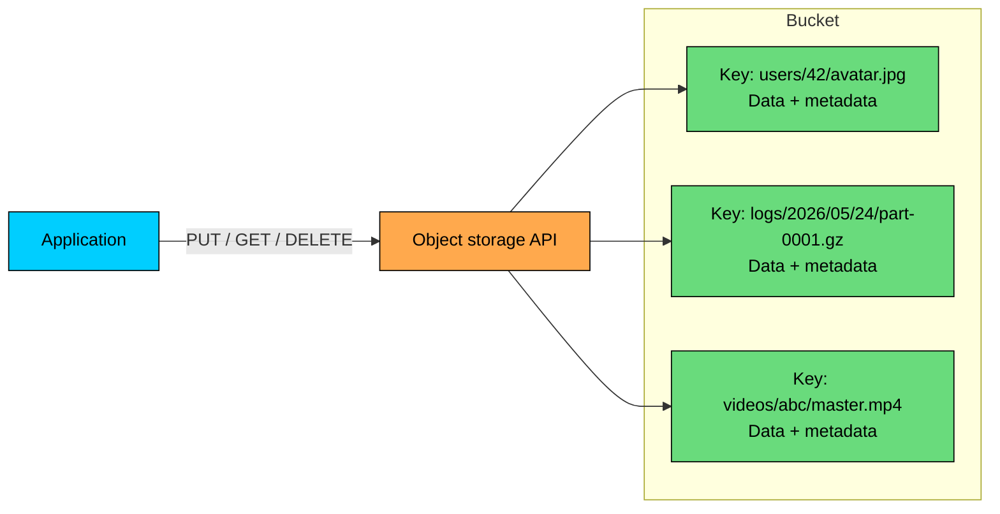
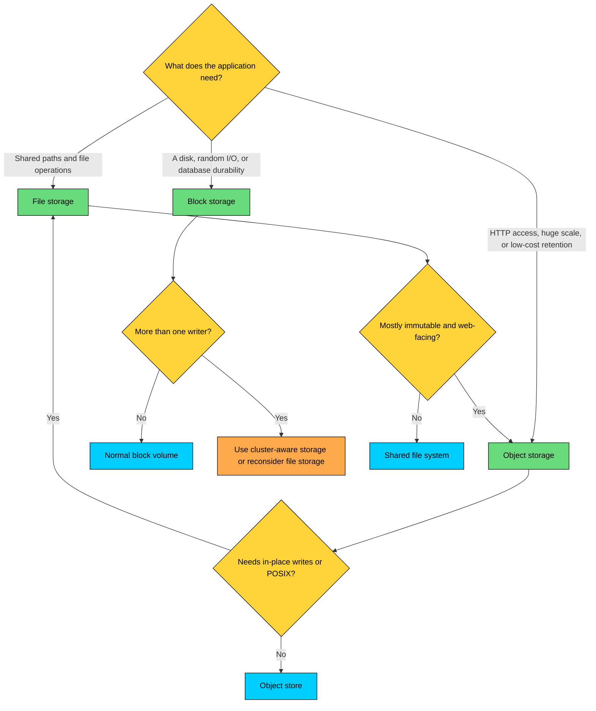
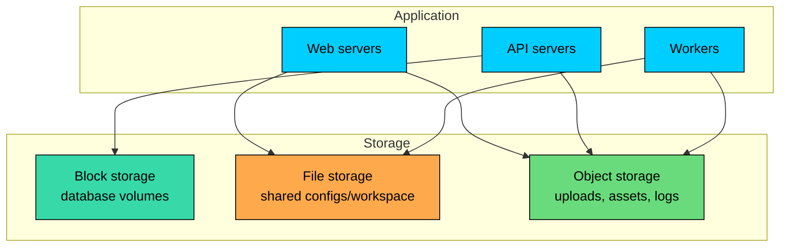

import React from 'react';
import CodeBlock from '../../../../components/ui/CodeBlock';
import Callout from '../../../../components/ui/Callout';

<div className="article-header">
  <div className="breadcrumb">
    <a href="/">Curated Notes</a>
    <span className="breadcrumb-separator">›</span>
    <span className="breadcrumb-current">Block vs File vs Object Storage</span>
  </div>
  <h1>Block vs File vs Object Storage</h1>
  <p style={{ color: 'var(--text-muted)', fontSize: '1.1rem', marginBottom: '16px', lineHeight: '1.6' }}>
    Master the essentials of Block vs File vs Object Storage in this curated guide.
  </p>
  <div className="meta-info">
    <span className="meta-item">
      <svg width="14" height="14" viewBox="0 0 24 24" fill="none" stroke="currentColor" strokeWidth="2"><circle cx="12" cy="12" r="10"/><polyline points="12 6 12 12 16 14"/></svg>
      10 min read
    </span>
    <span className="difficulty-badge difficulty-badge--intermediate">Intermediate</span>
  </div>
</div>

<section className="content-section">

Storage systems are not interchangeable buckets for bytes. The storage type you choose decides how applications read, write, share, protect, and pay for data.

The three common models are **block storage**, which exposes a disk-like device made of numbered blocks; **file storage**, which exposes files and directories through a shared file system; and **object storage**, which exposes objects through an API, usually HTTP, addressed by keys.

Most real systems use more than one. A web application might keep its database on block storage, shared application files on file storage, and user uploads in object storage. The important skill is knowing which access pattern each model is built for.

---

## At a Glance


| Aspect | Block Storage | File Storage | Object Storage |
|--------|---------------|--------------|----------------|
| Main abstraction | Disk volume | File system | Bucket/container of objects |
| Data unit | Fixed-size blocks | Files and directories | Objects with keys and metadata |
| Access style | Read/write block ranges through a disk interface | Open/read/write files by path | PUT/GET/DELETE objects by key |
| Common protocols | Local: NVMe, SATA, SAS. Network: NVMe-oF, iSCSI, Fibre Channel | NFS, SMB (plus parallel file systems like Lustre) | HTTP/REST APIs |
| Update model | Efficient random reads and writes | In-place file updates | Usually replace the object |
| Sharing model | Usually attached to one writer | Designed for shared file access | Many clients via API, no POSIX file sharing |
| Latency profile | Lowest, especially local SSD/NVMe | Higher than block due to network and coordination | Higher than block/file, optimized for scale |
| Best fit | Databases, VM disks, transactional workloads | Shared directories, legacy apps, home directories | Media, backups, logs, data lakes, static assets |
| Cloud examples | EBS, Persistent Disk, Azure Managed Disks | EFS, Filestore, Azure Files, FSx | S3, Cloud Storage, Azure Blob Storage |


A practical rule covers most designs.

Use **block storage** when software needs a disk (databases, VM boot volumes, low-latency random I/O). Use **file storage** when multiple machines need the same directory tree with normal file operations. Use **object storage** when you are storing lots of independent blobs and care about scale, durability, HTTP access, and cost.

---

## 1. Block Storage

Block storage is the closest model to a physical disk. It presents a volume as a long sequence of fixed-size blocks. The storage layer does not know what those blocks contain. They might hold a database page, part of a video file, a file-system journal entry, or unused space.

That low-level interface is why block storage is fast and flexible. The operating system, database, or file system decides how bytes are organized.

#### 1.1 How Block Storage Works





On a normal server, the operating system formats a block device with a file system such as ext4, XFS, APFS, or NTFS. The file system maps paths like `/var/lib/postgresql/base/...` to the underlying blocks.

Databases add another layer. PostgreSQL, MySQL, MongoDB, and similar systems store data in files, but internally they think in pages. A query might read a few 8 KB or 16 KB pages scattered across the volume. Block storage is good at this kind of random I/O.

#### 1.2 What Block Storage Is Good At

#### **Low-latency random I/O**

Block storage is the right choice when small reads and writes matter. Local NVMe can be extremely fast. Cloud block volumes add network hops, but they are still designed for predictable low-latency I/O compared with file or object storage.

This is why databases usually sit on block storage. A database cannot wait for an HTTP object request every time it needs a page from an index.

#### **Durable writes**

Transactional systems depend on the ability to flush data and know when it is safely persisted. Databases use write-ahead logs, file-system barriers, and `fsync()`-style operations to build ACID guarantees on top of block storage.

The details still matter. A badly configured disk cache, weak storage controller, or incorrect mount option can break durability assumptions. But the block-storage interface is the one databases are designed around.

#### **Bootable disks and VM volumes**

Virtual machines need something that behaves like a disk. The guest operating system expects to partition it, format it, mount it, and boot from it. Block storage provides that interface directly.

Object storage cannot boot an operating system. File storage can hold VM images, but the running VM still needs a block-device abstraction.

#### 1.3 Attachment and Sharing

A normal block volume has one active writer. That is not an arbitrary product limitation; it comes from how file systems work.

Most file systems assume they own the device. They cache metadata in memory, allocate free blocks, update journals, and reorder writes. If two machines mount the same ordinary block volume as if they both have exclusive control, their cached views diverge and the file system can corrupt itself.





Some cloud and SAN products support multi-attach block volumes. They are useful, but they do not remove the coordination problem. You need a cluster-aware file system such as GFS2, OCFS2, or a storage-aware application that can coordinate writes correctly.

For most application teams, if multiple hosts need shared file access, file storage is the simpler and safer tool.

#### 1.4 Cloud Block Storage

Cloud block storage gives a VM a persistent disk without making you manage the physical disk. Providers replicate data within a failure domain, expose snapshots, and let you choose performance classes.


| Provider | Service | Typical Use |
|----------|---------|-------------|
| AWS | EBS | Persistent disks for EC2 |
| Google Cloud | Persistent Disk / Hyperdisk | Persistent disks for Compute Engine |
| Azure | Managed Disks | Persistent disks for Azure VMs |


Cloud block volumes are usually zonal. They survive instance failure, but they are not automatically the same thing as a cross-region disaster-recovery plan. Production systems still need backups, snapshots, replication, or database-level recovery.

#### 1.5 When to Use Block Storage

Block storage is the right tool for relational and document databases that need random reads and writes, and for VM boot disks and attached application disks.

It also fits transaction logs and queues that need durable low-latency writes, and any application that wants a local file system without needing many machines to share it.

Avoid block storage when the data is mostly independent files that must be shared by many servers or retained cheaply at massive scale. That is where file and object storage fit better.

---

## 2. File Storage

File storage exposes a shared file system over the network. Applications use familiar paths such as `/mnt/shared/reports/q1.pdf`, while a file server or managed service handles the actual storage, permissions, caching, and locking.

The key difference from block storage is sharing. File storage is built so multiple clients can mount the same namespace at the same time.

#### 2.1 How File Storage Works





Common protocols and systems include:


| Name | Type | Common Use |
|------|------|------------|
| NFS | Network protocol | Unix/Linux file sharing, cloud file systems such as EFS and Filestore |
| SMB | Network protocol | Windows file sharing, Azure Files, FSx for Windows |
| Lustre | Parallel file system | High-throughput workloads such as HPC and large-scale processing, with its own LNet transport and client modules rather than a generic wire protocol |


The file server owns the file-system metadata. When a client opens a file, checks permissions, lists a directory, renames a path, or takes a lock, the request goes through that coordination layer.

#### 2.2 What File Storage Is Good At

#### **Shared POSIX-style access**

Many applications expect ordinary file operations: create, open, read, write, seek, rename, delete. File storage preserves that programming model while allowing more than one machine to see the same files.

That is valuable for web servers reading the same uploaded files, Kubernetes workloads that need `ReadWriteMany` volumes, build systems and CI workers sharing a workspace, user home directories mounted on many machines, and legacy applications that cannot be rewritten for an object API.

#### **In-place file changes**

File storage supports operations such as appending to a file, replacing a small range, or renaming a directory. Object storage generally does not.

This matters for applications that treat files as mutable working state rather than immutable blobs.

#### **Coordination through file-system semantics**

File servers can coordinate locks, permissions, and visibility between clients. This does not make a file share a distributed database. Locks can be advisory, client caching can affect visibility, and protocol behavior differs. But for many shared-file workloads, the semantics are good enough and much simpler than building coordination yourself.

#### 2.3 Limits of File Storage

#### **Metadata can become the bottleneck**

Every file system needs metadata: directory entries, permissions, sizes, timestamps, file-to-block mappings, and locks. In network file storage, many client operations depend on a metadata service.

At small and medium scale, this is fine. At very large scale, metadata operations such as listing huge directories, walking deep trees, or creating millions of tiny files can dominate performance.

#### **It costs more than object storage**

Managed file storage provides stronger semantics than object storage, and those semantics are not free. You pay for the coordination layer, lower-latency access, and shared namespace. At large scale, storing archival data or user media on file storage is often much more expensive than putting it in object storage.

#### **It is not always globally simple**

A file share is usually regional or zonal. Cross-region file sharing introduces latency, replication lag, conflict handling, and failure-mode questions. Object storage is usually the better base for global distribution, especially when paired with a CDN.

#### 2.4 Cloud File Storage


| Provider | Service | Notes |
|----------|---------|-------|
| AWS | EFS | Managed NFS for Linux workloads |
| AWS | FSx | Managed file systems such as Windows File Server, Lustre, NetApp ONTAP, and OpenZFS |
| Google Cloud | Filestore | Managed NFS file shares |
| Azure | Azure Files | Managed SMB and NFS file shares |


Managed file services remove a lot of operational work: replication, patching, failover, capacity management, and backups. They do not remove the need to understand workload shape. A directory with millions of tiny files, a chatty workload with many metadata calls, or high write contention can still perform poorly.

#### 2.5 When to Use File Storage

File storage is the right tool when multiple machines need to read and write the same files, or when the application expects file paths and POSIX-style operations.

It also fits shared home directories, build workspaces, and mounted content directories, and any case where rewriting the application to use object storage is not worth the complexity.

Avoid file storage when files are mostly immutable, accessed over HTTP, or retained for a long time at large scale. Those are object-storage workloads.

---

## 3. Object Storage

Object storage treats data as independent objects. Each object has the **data** (the bytes being stored), a **key** (the name used to retrieve it), and **metadata** (system and application information attached to the object).

There is no mounted disk and no real directory tree. You call an API: put this object, get that object, delete this object, list keys with this prefix.

#### 3.1 How Object Storage Works





Keys often look like paths:


```javascript
users/42/avatar.jpg
logs/2026/05/24/part-0001.gz
videos/abc/master.mp4
```


The slash is a naming convention, not a real directory separator. Consoles and SDKs may show folder-like views, but the object store is addressing keys in a bucket or container.

This design is a major reason object storage scales so well. The system can shard the keyspace across many servers, replicate data across failure domains, and grow without exposing that complexity to clients.

#### 3.2 HTTP Access

Object storage is usually accessed through HTTP APIs:


```shell
PUT /bucket/users/42/avatar.jpg
GET /bucket/users/42/avatar.jpg
DELETE /bucket/users/42/avatar.jpg
```


That API shape has practical advantages. Browsers and mobile apps can upload directly with signed URLs, CDNs can cache and serve objects efficiently, services in any language can use the same storage system, and firewalls and load balancers already understand HTTP.

The trade-off is that object storage is not a disk. A `GET` request is not the same as reading a local block. The system is optimized for durable, scalable object access, not microsecond random writes.

#### 3.3 What Object Storage Is Good At

#### **Unstructured data at scale**

Images, videos, documents, backups, logs, model artifacts, and data lake files are excellent object-storage use cases. These objects are usually written once, read many times, and replaced rather than edited in place.

#### **Durability and lifecycle management**

Cloud object stores are designed for very high durability. They replicate or erasure-code data across multiple devices and failure domains, verify checksums, and repair lost or corrupted fragments in the background.

They also provide lifecycle policies. Old logs can move from frequent-access storage to cheaper archive tiers. Temporary exports can expire automatically. These features matter when retention grows from gigabytes to petabytes.

#### **Strong consistency for object operations**

Modern object stores give strong read-after-write consistency for object operations within a single region. S3 has worked this way since December 2020, and GCS and Azure Blob behave the same.

After a successful `PUT`, the next `GET` sees the new object, the next `LIST` includes it, and the next `DELETE` plus `GET` returns not found. Older documentation that described eventual consistency for new-key reads or for listings no longer applies.

Cross-region replication, event notifications, and bucket configuration changes remain eventually consistent.

#### **Web and analytics integration**

Object storage has become the default storage layer for static websites, CDNs, data lakes, and ML pipelines. Query engines, stream processors, and data warehouses can read directly from object stores using formats such as Parquet, ORC, JSON, CSV, and Avro.

#### 3.4 Limits of Object Storage

#### **No normal in-place modification**

If you need to change a few bytes in the middle of a large object, object storage is the wrong interface. In most designs, you write a new object or a new version of the object.

Some systems support multipart upload, ranged reads, versioning, object composition, or append-like features for specific products. Those features are useful, but they do not make object storage behave like a local file system or database disk.

#### **No POSIX file semantics**

Object storage does not provide the normal contract of `open`, `seek`, `write`, `rename`, and `fsync`.

FUSE adapters can make object storage look like a file system, but they cannot perfectly reproduce local file-system behavior. They are useful for some read-heavy or compatibility workloads, but risky for software that depends on precise file semantics.

#### **Higher per-operation latency**

Object storage operations travel through an API layer, authorization checks, routing, metadata lookup, and distributed storage nodes. That is acceptable for serving a photo or reading a Parquet file split. It is not acceptable for the inner loop of a transactional database.

#### **Request patterns still matter**

Object stores scale horizontally, but request shape still matters. Hot objects, poor key design, excessive listing, millions of tiny objects, and chatty request patterns can all cause cost or performance problems.

Modern cloud object stores do a lot of automatic partitioning, so old advice such as always randomizing S3 key prefixes is usually unnecessary. The better rule is to avoid designs that concentrate all traffic on a small number of keys or require huge recursive listings.

#### 3.5 When to Use Object Storage

Object storage is the right tool for user uploads and media files, for backups and archives and compliance retention, for application logs and event archives, for data lakes and analytics datasets, for static assets served through a CDN, and for ML datasets, model artifacts, and batch-processing inputs.

Avoid it for primary database storage, VM boot volumes, workloads that require frequent small in-place updates, and applications that need strict POSIX file-system behavior.

---

## 4. Choosing the Right Storage

The fastest way to choose is to start with the access pattern, not the product name.

#### 4.1 Decision Framework





#### 4.2 Use Case Matrix


| Use Case | Recommended Storage | Reason |
|----------|---------------------|--------|
| PostgreSQL, MySQL, MongoDB | Block | Low-latency random I/O and durable write semantics |
| VM boot disk | Block | Operating systems need a disk interface |
| Single-host container volume | Block | Fast local file-system semantics |
| Kubernetes `ReadWriteMany` volume | File | Multiple pods need the same mounted file system |
| Shared user home directories | File | Familiar paths, permissions, and multi-host access |
| Legacy app expecting file paths | File | Avoids rewriting the application around an API |
| User uploads | Object | Durable, scalable, CDN-friendly |
| Static website assets | Object | HTTP access and CDN integration |
| Video storage and delivery | Object | Large immutable objects and edge caching |
| Backups and archives | Object | Low-cost retention and lifecycle policies |
| Data lake | Object | Cheap scalable storage with analytics integration |
| Application logs | Object | Write-once retention and batch analytics |
| Session data | Usually neither | Use Redis or another low-latency store; persist separately if needed |


#### 4.3 Hybrid Architecture Example

Production systems often split data by access pattern.





The database uses block storage because it needs fast page reads, WAL writes, and durable flushes. The application uses file storage only where it needs shared mounted files. User content and logs go to object storage because they are large, durable, HTTP-friendly, and much cheaper to keep over time.

This separation is one of the most common storage patterns in scalable systems.

---

## 5. Common Mistakes

#### Mistake 1: Putting database files in object storage

Object storage is excellent for database backups, exports, and analytical copies. It is not a primary disk for a transactional database. The database needs low-latency random writes and precise durability semantics.

#### Mistake 2: Using file storage as a cheap object store

File storage feels convenient because everything has a path, but it becomes expensive and metadata-heavy for large collections of immutable content. If the application mainly uploads and downloads whole files, object storage is usually a better fit.

#### Mistake 3: Treating object storage like a mounted file system

Mount adapters are useful, but they can hide important differences: rename behavior, consistency of directory listings, partial writes, lock semantics, and performance under many small operations. They should be chosen deliberately, not as a default abstraction.

#### Mistake 4: Ignoring the failure domain

A disk that survives VM restart is not automatically a disaster-recovery system. A file share replicated across zones is not automatically global active-active storage. Object storage is highly durable, but availability, replication policy, deletion protection, and recovery process still need design.

---

## 6. Summary

**Block storage** is for disk-like workloads. Use it when you need low-latency random I/O, durable writes, databases, or VM disks. Treat multi-writer access as a specialized design problem.

**File storage** is for shared file-system workloads. Use it when multiple machines need the same paths, permissions, locks, and in-place file operations. Watch metadata-heavy workloads and cost at scale.

**Object storage** is for independent objects at large scale. Use it for uploads, media, backups, logs, data lakes, static assets, and archives. It gives excellent durability and economics, but it is not a disk and not a POSIX file system.

The best storage choice follows the access pattern. Ask how the data is read, written, shared, retained, and recovered. Once those answers are clear, the right storage model is usually obvious.

---

## Quiz

</section>
