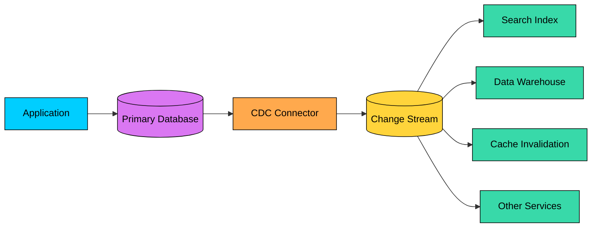
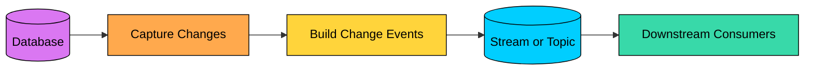
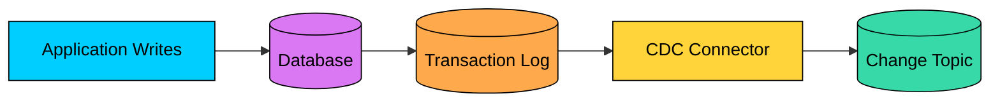
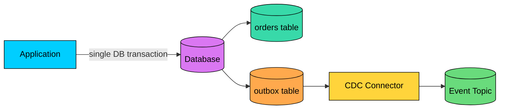
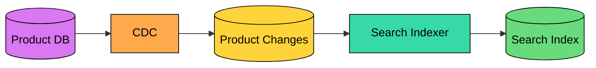

import React from 'react';
import CodeBlock from '../../../../components/ui/CodeBlock';
import Callout from '../../../../components/ui/Callout';

<div className="article-header">
  <div className="breadcrumb">
    <a href="/">Curated Notes</a>
    <span className="breadcrumb-separator">›</span>
    <span className="breadcrumb-current">Change Data Capture (CDC)</span>
  </div>
  <h1>Change Data Capture (CDC)</h1>
  <p style={{ color: 'var(--text-muted)', fontSize: '1.1rem', marginBottom: '16px', lineHeight: '1.6' }}>
    Master the essentials of Change Data Capture (CDC) in this curated guide.
  </p>
  <div className="meta-info">
    <span className="meta-item">
      <svg width="14" height="14" viewBox="0 0 24 24" fill="none" stroke="currentColor" strokeWidth="2"><circle cx="12" cy="12" r="10"/><polyline points="12 6 12 12 16 14"/></svg>
      10 min read
    </span>
    <span className="difficulty-badge difficulty-badge--intermediate">Intermediate</span>
  </div>
</div>

<section className="content-section">

Most production databases do not live alone. The same data may need to appear in a search index, cache, data warehouse, fraud system, recommendation pipeline, or another service.

A common but painful approach is to run batch jobs:

1. Query the database every few minutes or hours.
2. Find rows that changed.
3. Copy them somewhere else.

That works for some reporting workloads, but it creates stale data, expensive scans, and awkward failure cases.

**Change Data Capture (CDC)** is the pattern of capturing database changes as they happen and sending those changes to downstream systems.





CDC is especially useful when the database is already the source of truth and downstream systems need to stay close to it without direct coupling to the application write path.

---

## What CDC Captures

CDC turns database mutations into change events. The common event types are inserts, updates, and deletes, and some systems also capture schema changes.

A change event often contains:


| Field | Purpose |
|-------|---------|
| **Operation** | Insert, update, or delete |
| **Table** | Source table or collection |
| **Primary key** | Identifies the changed row |
| **Before value** | Previous row state, if available |
| **After value** | New row state, if available |
| **Commit position** | Log sequence number, binlog position, or offset |
| **Commit timestamp** | When the database committed the change |
| **Transaction metadata** | Helps preserve ordering across related changes |


Example:


```json
{
  "operation": "update",
  "table": "orders",
  "primaryKey": { "order_id": "order_123" },
  "before": { "status": "PAID" },
  "after": { "status": "SHIPPED" },
  "commitPosition": "mysql-bin.000042:981273",
  "committedAt": "2026-05-24T10:30:00Z"
}
```


The exact shape depends on the database and CDC tool.

---

## How CDC Works

At a high level, a CDC pipeline has four stages:





1. **Capture**: Detect committed changes from the source database.
2. **Normalize**: Convert database-specific changes into events.
3. **Publish**: Write events to a stream, queue, topic, or sink.
4. **Consume**: Downstream systems apply changes to their own stores.

CDC should follow committed database changes. It should not publish events for transactions that later roll back.

---

## CDC Approaches

There are three common ways to implement CDC.

#### Timestamp-Based CDC

Timestamp-based CDC uses a column such as `updated_at` to find changed rows.


```sql
SELECT *
FROM orders
WHERE updated_at > '2026-05-24 10:00:00';
```


This is simple, but it is not true CDC in the strongest sense. It is polling with a change marker.

It is easy to understand, works with almost any database, and is good enough for small systems and low-stakes sync jobs. The downside is that it misses hard deletes unless you also use soft deletes, can miss changes when `updated_at` is not updated consistently, may miss intermediate updates between polls, depends on clock behavior and timestamp precision, and can create expensive table scans without proper indexes.

Use it when the workload is simple and occasional delay or loss of intermediate states is acceptable.

#### Trigger-Based CDC

Trigger-based CDC uses database triggers to write changes into an audit or outbox table.


```sql
CREATE TRIGGER orders_audit_update
AFTER UPDATE ON orders
FOR EACH ROW
INSERT INTO orders_audit (
  order_id,
  old_status,
  new_status,
  changed_at
)
VALUES (
  OLD.id,
  OLD.status,
  NEW.status,
  NOW()
);
```


Triggers capture deletes and before/after values, can be customized per table, work even when transaction logs are hard to access, and are useful for audit tables and the transactional outbox pattern. The downside is that they add work to every write transaction, can slow down hot tables, often become hard to maintain, may need updates when the schema changes, and can break application writes if the trigger code itself has a bug.

Triggers are useful, but they should be treated as production application code.

#### Log-Based CDC

Log-based CDC reads the database's transaction log, such as the MySQL binlog, the PostgreSQL WAL via logical replication, the SQL Server transaction log (exposed through SQL Server CDC tables), or the MongoDB oplog and change streams.





This is the preferred approach for many high-volume systems because the database already writes these logs for durability and replication.

It captures inserts, updates, and deletes, preserves commit order more naturally, has lower impact on application write paths than triggers, scales better for busy databases, and can resume from a stored log position after an outage. The trade-off is that it requires database-specific configuration, careful permissions and operational ownership, log retention long enough for the connector to recover, expensive initial snapshots on large tables, and explicit planning for schema changes.

Log-based CDC is often the best production default, but it is not "set and forget."

---

## CDC vs Events vs Event Sourcing

CDC is often confused with event-driven architecture and event sourcing.

They are related, but not the same.


| Pattern | Source of Truth | What It Publishes |
|---------|-----------------|-------------------|
| **CDC** | Database tables | Row-level changes after they commit |
| **Domain events** | Application business logic | Business facts such as `OrderPlaced` |
| **Event sourcing** | Append-only event log | Events are the primary record of state |


CDC usually says, "This row changed."

A domain event says, "This business thing happened."

Those are not always equivalent. A single business action may update several rows. A row update may not mean anything useful to another service.

#### The Outbox Pattern

The transactional outbox pattern combines application events with CDC.

Instead of trying to write to the database and publish to Kafka in two separate steps, the application writes both business data and an event record into the same database transaction. CDC then streams the outbox table.





This avoids the classic dual-write problem, where the database write succeeds, the event publish to the broker fails, and downstream systems never hear about the change.

With an outbox, the event record is committed in the same transaction as the business change. CDC publishes it later, so a successful database commit always leads to a published event, and a rolled-back transaction publishes nothing.

---

## Common Use Cases

#### Search Indexing

When product, article, or user records change, CDC can update a search index such as Elasticsearch or OpenSearch.





This keeps search up to date without making the application write synchronously to both the database and search index.

#### Data Warehousing

CDC can feed a lakehouse or warehouse with lower latency than nightly ETL.

It is commonly used to replicate operational data into analytical systems where it can be joined, cleaned, and queried without loading the production database.

#### Cache Invalidation

When a row changes, CDC can emit an invalidation event for related cache keys.

This is often safer than trying to update cached values directly because consumers can delete stale entries and let the normal read path rebuild them.

#### Replication Between Services

CDC can help one service build a local read model from another service's data.

Use this carefully. Replicating tables between services can create hidden coupling. Prefer publishing stable domain events or outbox events when other services need business meaning, not raw table shape.

#### Audit and Compliance

CDC can preserve a history of changes for audit, debugging, or compliance workflows.

If this is the goal, make sure retention, immutability, access control, and PII handling are designed explicitly.

---

## Debezium and Kafka Example

Debezium is a common open-source CDC platform. It reads database logs and publishes change events, often through Kafka Connect into Kafka topics.

A simplified modern MySQL connector configuration looks like this:


```json
{
  "name": "orders-mysql-cdc",
  "config": {
    "connector.class": "io.debezium.connector.mysql.MySqlConnector",
    "database.hostname": "mysql",
    "database.port": "3306",
    "database.user": "cdc_user",
    "database.password": "secret",
    "database.server.id": "184054",
    "topic.prefix": "ecommerce",
    "database.include.list": "shop",
    "table.include.list": "shop.orders",
    "schema.history.internal.kafka.bootstrap.servers": "kafka:9092",
    "schema.history.internal.kafka.topic": "schema-changes.shop"
  }
}
```


The key pieces are `topic.prefix`, which namespaces the output topics for this source, and `table.include.list`, which limits capture to selected tables. The connector stores offsets so it can resume from the last processed log position, and the schema history topic lets it interpret historical change events correctly as schemas evolve.

In production, you also need to plan snapshots, credentials, topic naming, schema evolution, monitoring, and log retention.

---

## Operational Challenges

CDC pipelines are production systems. They need the same care as APIs and databases.

#### Initial Snapshot

Most CDC tools need an initial snapshot before streaming new changes. Large tables can make this expensive. Plan for snapshot duration, the load it places on the database, backfill consistency, and whether downstream consumers can handle a flood of historical rows arriving all at once.

#### Lag

CDC lag means downstream systems are behind the source database. The signals worth monitoring are the source log position versus the connector position, the age of the oldest unprocessed event, consumer lag, sink write failures, and dead-letter counts.

#### Log Retention

If the connector is down longer than the database keeps its transaction logs, it may not be able to resume. You may need a new snapshot.

For PostgreSQL, unused replication slots can also retain WAL and grow disk usage. For MySQL, binlog retention must cover connector outages.

#### Ordering

CDC preserves source commit order only within certain boundaries. Once events are partitioned, transformed, or consumed by multiple workers, downstream ordering can change.

Consumers should use primary keys, versions, commit positions, or timestamps to ignore stale updates.

#### Deletes

Deletes are easy to mishandle.

Downstream systems need to know whether a delete means removing the record, marking it inactive, emitting a tombstone, or retaining it for compliance.

Make delete semantics explicit.

#### Schema Evolution

Database schema changes can break consumers if change events are treated as stable contracts.

Prefer additive changes, version downstream schemas, and test migrations against CDC consumers.

#### Security and Privacy

CDC can expose everything in a table, including fields that were never meant for broad consumption. Protect the stream by restricting connector privileges, masking or excluding sensitive columns, encrypting data in transit and at rest, controlling who can read CDC topics, and applying retention rules for personal data.

---

## Best Practices

- **Prefer log-based CDC for high-volume production systems** when the database supports it.
- **Use the outbox pattern for business events** instead of asking consumers to infer business meaning from raw table changes.
- **Make consumers idempotent** because CDC events can be replayed or duplicated.
- **Monitor lag and log retention** so the connector can recover after outages.
- **Limit captured tables and columns** to what downstream systems actually need.
- **Handle deletes deliberately** with clear tombstone or soft-delete behavior.
- **Version schemas** and treat CDC streams as contracts.
- **Avoid leaking database internals** across service boundaries when domain events would be clearer.
- **Test snapshots, restarts, and replay** before relying on CDC during an incident.

---

## Summary

Change Data Capture streams committed database changes to downstream systems. It is useful for search indexing, data warehousing, cache invalidation, read-model replication, audit trails, and outbox-based event publishing.

Timestamp polling is simple but limited. Triggers are flexible but add write-path overhead. Log-based CDC is usually the strongest production approach, but it requires careful operation.

CDC is not the same as event sourcing, and raw row changes are not always good domain events. Used well, CDC reduces dual writes and keeps systems in sync. Used casually, it leaks database internals, spreads sensitive data, and creates fragile coupling.

</section>
