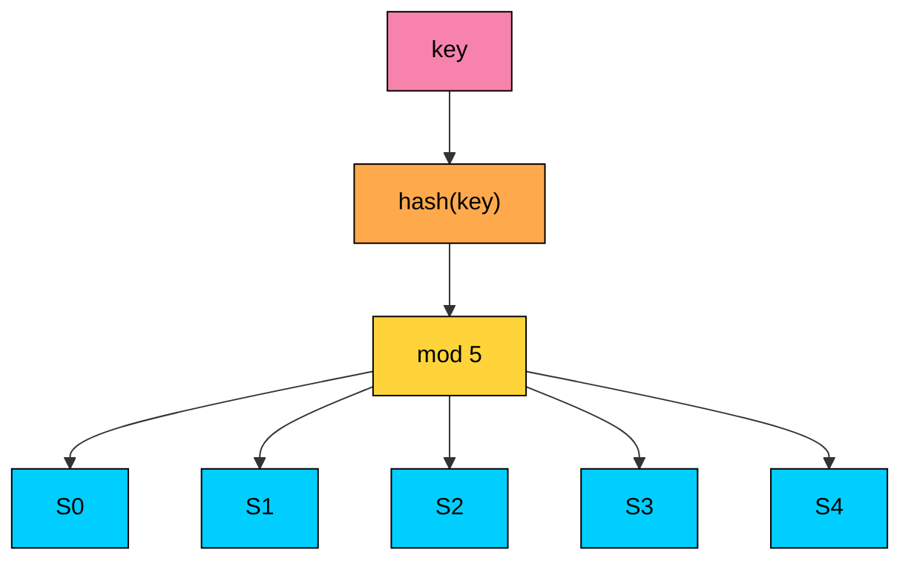
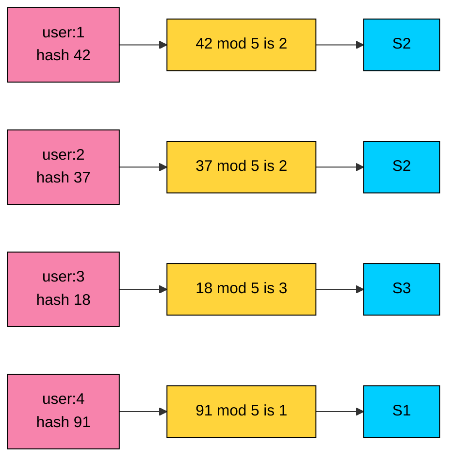
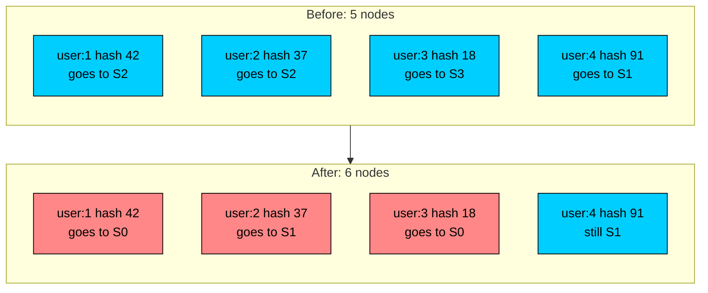
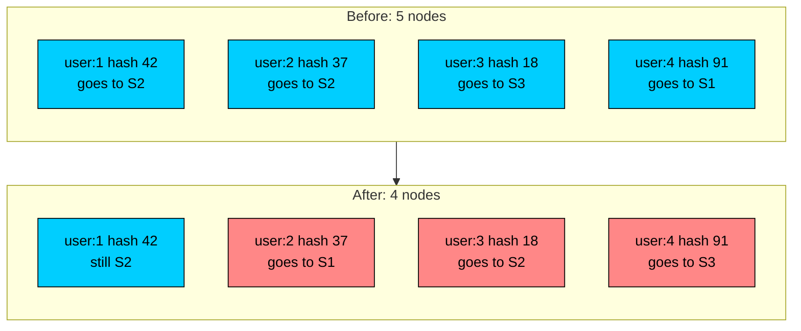
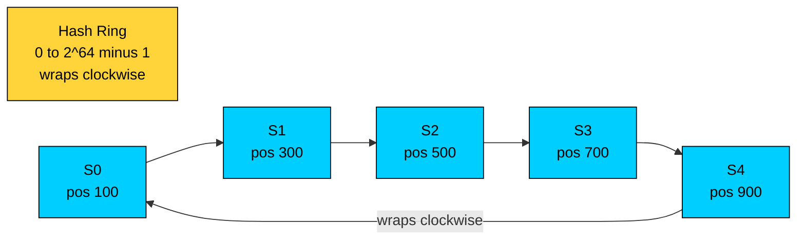
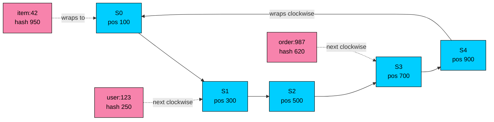
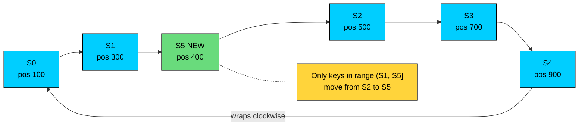
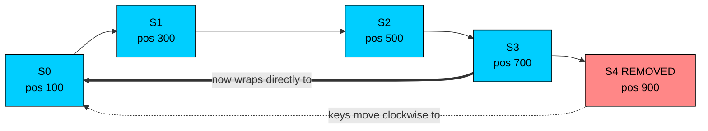
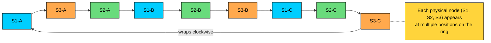
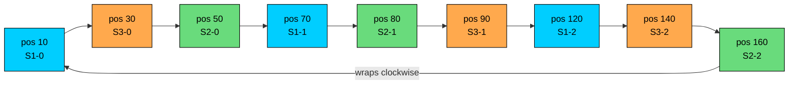

import React from 'react';
import CodeBlock from '../../../../components/ui/CodeBlock';
import Callout from '../../../../components/ui/Callout';

<div className="article-header">
  <div className="breadcrumb">
    <a href="/">Curated Notes</a>
    <span className="breadcrumb-separator">›</span>
    <span className="breadcrumb-current">Consistent Hashing</span>
  </div>
  <h1>Consistent Hashing</h1>
  <p style={{ color: 'var(--text-muted)', fontSize: '1.1rem', marginBottom: '16px', lineHeight: '1.6' }}>
    Master the essentials of Consistent Hashing in this curated guide.
  </p>
  <div className="meta-info">
    <span className="meta-item">
      <svg width="14" height="14" viewBox="0 0 24 24" fill="none" stroke="currentColor" strokeWidth="2"><circle cx="12" cy="12" r="10"/><polyline points="12 6 12 12 16 14"/></svg>
      10 min read
    </span>
    <span className="difficulty-badge difficulty-badge--intermediate">Intermediate</span>
  </div>
</div>

<section className="content-section">

Distributed systems often need a stable way to decide which node owns a key.

Examples:

- Which cache node stores `user:123`?
- Which storage shard owns `order:987`?
- Which worker should process events for `customer:42`?
- Which vector index partition should receive a document embedding?

A simple approach is:


```javascript
node = hash(key) % number_of_nodes
```


That works while the node count stays fixed. It breaks badly when nodes are added or removed. If `number_of_nodes` changes from 5 to 6, most keys get a different result. For a cache, that means a large cache miss storm. For a storage system, it means a large data movement event. For a stateful worker fleet, it means many keys move to new owners at once.

**Consistent hashing** solves this by minimizing key movement when membership changes. When a node is added or removed, only the keys near that node move. Most keys keep the same owner.

Consistent hashing is used in distributed caches, Dynamo-style databases, storage systems, load balancers for stateful traffic, queue partitioning, and routing layers. The exact implementation varies, but the design goal is the same: stable ownership with controlled movement.

---

## 1. The Problem with Modulo Hashing

Modulo hashing maps a key to a node by taking the hash modulo the number of nodes.

Suppose we have 5 nodes:


```javascript
S0, S1, S2, S3, S4
```


For each key:


```javascript
owner = hash(key) % 5
```





This gives deterministic routing. The same key goes to the same node as long as the node list and node count do not change.





#### Adding a Node

Now add `S5`.

The formula changes from:


```javascript
hash(key) % 5
```


to:


```javascript
hash(key) % 6
```





That small formula change remaps most keys.

This is painful because the system does not just change a routing table. It also moves operational load:

- Cache entries become cold on their new owners.
- Storage shards need data migration.
- Stateful workers lose locality.
- In-flight requests may hit a different owner than earlier requests.
- Downstream databases can see a sudden read spike after cache misses.

#### Removing a Node

If `S4` fails, the formula changes from:


```javascript
hash(key) % 5
```


to:


```javascript
hash(key) % 4
```





Again, most keys move even though only one node changed.

Modulo hashing is fine for fixed partition counts. For example, Kafka-style partitioning often hashes keys into a stable number of partitions, then moves partitions between brokers separately. The problem appears when the hash target is the live node count.

---

## 2. How Consistent Hashing Works


Consistent hashing maps both nodes and keys into the same fixed hash space.

The hash space is usually shown as a ring:

- Hash values run from `0` to a large maximum, such as `2^64 - 1`.
- After the maximum value, the ring wraps back to `0`.
- Each node is placed on the ring using `hash(node_id)`.
- Each key is placed on the ring using `hash(key)`.
- A key belongs to the first node found while moving clockwise from the key's position.





#### Mapping a Key

To route `user:123`:

1. Compute `hash("user:123")`.
2. Locate that position on the ring.
3. Walk clockwise until the next node.
4. Route the key to that node.





If the key lands exactly on a node position, it belongs to that node. In practice, with a large hash space, exact collisions are rare. A real implementation still needs deterministic collision handling.

#### Adding a Node

When a new node joins, it claims the range between its predecessor and itself.

Suppose `S5` is placed between `S1` and `S2`.





Only keys in the range `(S1, S5]` move from `S2` to `S5`. Keys owned by other nodes stay where they are.

With `N` evenly balanced nodes, adding one node moves roughly `1 / (N + 1)` of the keys. It does not remap the whole keyspace.

#### Removing a Node

When a node leaves, only its range moves to the next clockwise node.





If `S4` leaves, the keys previously assigned to `S4` move to its successor. Other ranges are unchanged.

This is the central benefit: membership changes cause local movement, not global reshuffling.

---

## 3. Virtual Nodes

Basic consistent hashing places each physical node at one point on the ring. That is usually not enough.

With only one point per node, the ranges can be uneven. One node may own a large slice of the ring while another owns a small slice. If a node fails, its entire range moves to one successor, which can overload that successor.

**Virtual nodes**, often called **vnodes**, fix this by placing each physical node at many positions on the ring.





Instead of this:


```javascript
S1 -> one ring position
S2 -> one ring position
S3 -> one ring position
```


use this:





```plaintext
S1-0 -> position 10
S1-1 -> position 70
S1-2 -> position 120
S2-0 -> position 50
S2-1 -> position 80
S2-2 -> position 160
S3-0 -> position 30
S3-1 -> position 90
S3-2 -> position 140
```


Each virtual node maps back to a physical node.

Benefits:

1. **Better distribution:** many small ranges are easier to balance than a few large ranges.
2. **Smoother failure behavior:** when a physical node fails, its ranges are spread across several successors.
3. **Weighted capacity:** larger nodes can receive more virtual nodes than smaller nodes.
4. **Incremental migration:** operators can add or remove virtual nodes gradually instead of moving a huge range at once.

Virtual nodes are the difference between the clean classroom version of consistent hashing and a version you can operate in production.

---

## 4. Replication with Consistent Hashing

Consistent hashing decides the primary owner of a key. Many real systems also need replicas.

A common approach is:

1. Hash the key onto the ring.
2. Pick the first node clockwise as the primary.
3. Continue clockwise to pick the next distinct physical nodes as replicas.

For a replication factor of `3`, a key may be stored on:


```javascript
primary: S2
replica: S5
replica: S1
```


Production systems usually add placement constraints:

- Do not place two replicas on the same physical node.
- Avoid placing all replicas in the same rack or availability zone.
- Prefer region-local reads when the consistency model allows it.
- Rebalance when node capacity, disk usage, or failure domains change.

Consistent hashing is placement logic. It does not by itself provide replication, quorum reads, conflict resolution, or durability. Those are separate parts of the storage design.

---

## 5. Code Implementation

The implementation below uses:

- A sorted list of ring positions.
- A map from ring position to physical server.
- Multiple virtual nodes per physical server.
- Binary search to find the first position greater than or equal to the key hash.

For production code, use a fast, stable, well-distributed non-cryptographic hash such as MurmurHash, xxHash, or CityHash. The examples use SHA-256 because it is available in the standard libraries and produces stable output across runs.


```java
import java.nio.ByteBuffer;
import java.nio.charset.StandardCharsets;
import java.security.MessageDigest;
import java.security.NoSuchAlgorithmException;
import java.util.*;

class ConsistentHashRing {
    private final int virtualNodes;
    private final TreeMap<Long, String> ring = new TreeMap<>();
    private final Set<String> servers = new HashSet<>();

    public ConsistentHashRing(Collection<String> initialServers, int virtualNodes) {
        if (virtualNodes <= 0) {
            throw new IllegalArgumentException("virtualNodes must be positive");
        }
        this.virtualNodes = virtualNodes;

        for (String server : initialServers) {
            addServer(server);
        }
    }

    private long hash(String value) {
        try {
            MessageDigest digest = MessageDigest.getInstance("SHA-256");
            byte[] bytes = digest.digest(value.getBytes(StandardCharsets.UTF_8));
            return ByteBuffer.wrap(bytes).getLong();
        } catch (NoSuchAlgorithmException e) {
            throw new IllegalStateException("SHA-256 is not available", e);
        }
    }

    public void addServer(String server) {
        if (!servers.add(server)) {
            return;
        }

        for (int i = 0; i < virtualNodes; i++) {
            ring.put(hash(server + "#" + i), server);
        }
    }

    public void removeServer(String server) {
        if (!servers.remove(server)) {
            return;
        }

        for (int i = 0; i < virtualNodes; i++) {
            ring.remove(hash(server + "#" + i));
        }
    }

    public String getServer(String key) {
        if (ring.isEmpty()) {
            throw new IllegalStateException("hash ring has no servers");
        }

        long position = hash(key);
        Map.Entry<Long, String> entry = ring.ceilingEntry(position);
        if (entry == null) {
            entry = ring.firstEntry();
        }
        return entry.getValue();
    }
}

public class Main {
    public static void main(String[] args) {
        ConsistentHashRing ring = new ConsistentHashRing(
            List.of("S0", "S1", "S2", "S3", "S4"),
            100
        );

        System.out.println("user:123 -> " + ring.getServer("user:123"));
        System.out.println("order:987 -> " + ring.getServer("order:987"));

        ring.addServer("S5");
        System.out.println("After adding S5:");
        System.out.println("user:123 -> " + ring.getServer("user:123"));

        ring.removeServer("S2");
        System.out.println("After removing S2:");
        System.out.println("order:987 -> " + ring.getServer("order:987"));
    }
}
```


Lookup is `O(log V)`, where `V` is the number of virtual nodes. Adding or removing a physical server is `O(R log V)`, where `R` is the number of virtual nodes assigned to that server.

---

## 6. Operational Considerations

Consistent hashing is useful, but production systems still need operational guardrails.

#### Use a Stable Node Identity

The node identifier must not change accidentally. If the ring uses an IP address and the instance gets a new IP, the system may treat the same machine as a different node and move keys unnecessarily.

Prefer stable identifiers:

- `cache-a-17`
- `shard-003`
- `az1-rack4-node12`
- A persistent node UUID stored on disk

#### Use Enough Virtual Nodes

Too few virtual nodes produce uneven load. Too many increase memory usage and membership update cost.

The right number depends on fleet size, key distribution, node capacity differences, and how often membership changes. In many cache clients, tens to hundreds of virtual nodes per physical node is a common starting point. Storage systems may use a more deliberate token or partition assignment strategy.

#### Account for Uneven Key Popularity

Consistent hashing balances key ownership, not request volume.

If one key is extremely hot, the node that owns it can still overload. Common mitigations include:

- Request coalescing
- Local caching
- Hot-key replication
- Splitting large tenants or high-traffic keys
- Application-level load shedding

#### Do Not Confuse Routing with Rebalancing

Changing the ring changes where keys should live. It does not move the data by itself.

A storage system needs background migration, repair, checksums, throttling, and progress tracking. A cache can often tolerate cold misses, but a database cannot simply forget the old owner.

#### Keep Membership Consistent Enough

Clients need a reasonably consistent view of the ring. If two clients use different membership lists, they may route the same key to different owners.

This is usually handled with:

- A central configuration service
- Gossip membership with versioning
- A control plane that publishes ring snapshots
- Client-side ring versions attached to requests

#### Consider Alternatives

Consistent hashing is not the only stable assignment technique.


| Technique               | Good Fit                                        | Notes                                                         |
| ----------------------- | ----------------------------------------------- | ------------------------------------------------------------- |
| Consistent hashing ring | Caches, storage shards, stateful routing        | Familiar and supports vnodes                                  |
| Rendezvous hashing      | Selecting one or more owners from a node set    | Simple, no ring structure, good for small to medium node sets |
| Jump consistent hash    | Fast mapping from key to bucket number          | Great when buckets are numbered and mostly append-only        |
| Fixed partitions        | Logs, queues, databases with partition movement | Decouples key hashing from physical node membership           |


Many modern systems use fixed logical partitions rather than hashing directly to physical nodes. Keys map to partitions, and partitions move between nodes through a control plane. This gives operators more control over rebalancing, placement, and failure recovery.

---

## 7. Where Consistent Hashing Works Well

Consistent hashing is a good fit when:

1. Keys need stable owners.
2. Nodes are added or removed over time.
3. Moving all keys on membership change would be expensive.
4. Approximate balance is acceptable with virtual nodes or weights.
5. The system can handle the operational work of migration or cache warming.

Common use cases:

- Distributed caches
- CDN cache routing
- Sharded key-value stores
- Dynamo-style storage systems
- Stateful request routing
- Worker assignment for keyed streams
- Tenant-to-shard routing
- Vector index shard routing
- Feature store partition routing

It is less useful when requests are stateless and any node can serve any request. In that case, ordinary load balancing is usually simpler and more flexible.

---

## Summary

Consistent hashing provides stable key ownership in a changing cluster.

Key takeaways:

1. **Modulo hashing remaps too many keys** when the live node count changes.
2. **Consistent hashing uses a fixed hash space** and maps both keys and nodes onto it.
3. **A key belongs to the next node clockwise** from the key's hash position.
4. **Adding a node moves only the keys in that node's new range.**
5. **Removing a node moves only the keys owned by that node.**
6. **Virtual nodes improve balance** and make failures less concentrated.
7. **Consistent hashing is placement logic, not a full storage system.** Replication, migration, durability, and conflict handling are separate concerns.
8. **Modern systems often combine consistent hashing with control planes, fixed partitions, weights, and failure-domain-aware placement.**

Use consistent hashing when stable ownership matters. Do not use it as a substitute for ordinary load balancing when every node can handle every request.

</section>
