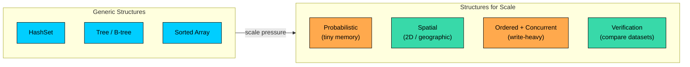
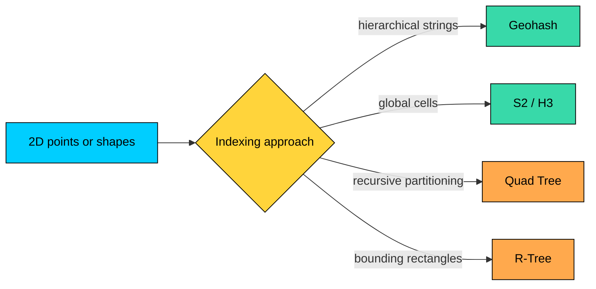
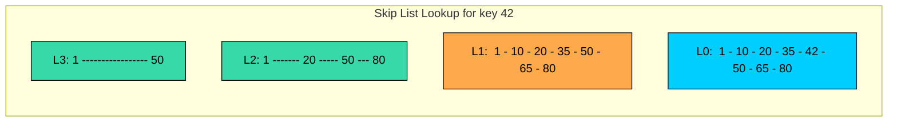
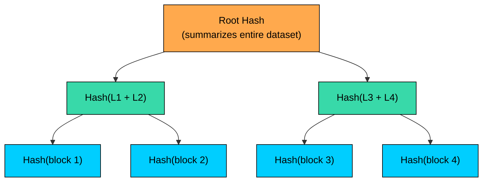
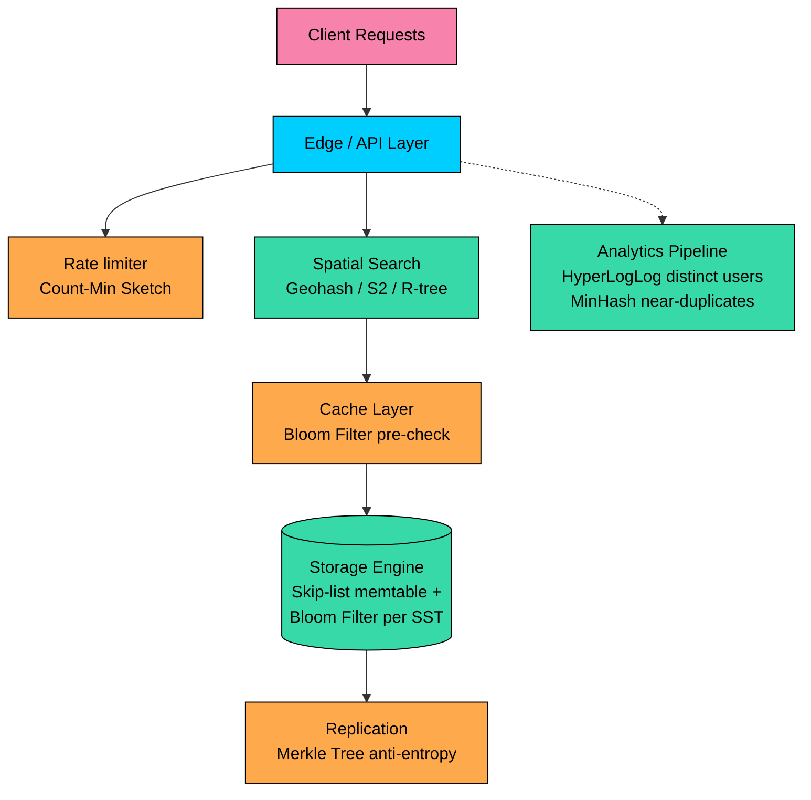

import React from 'react';
import CodeBlock from '../../../../components/ui/CodeBlock';
import Callout from '../../../../components/ui/Callout';

  

    <a href="/">Curated Notes</a>
    ›
    Data Structures for Scale
  

  <h1>Data Structures for Scale</h1>
  

    Master the essentials of Data Structures for Scale in this curated guide.
  

  

    
      <svg width="14" height="14" viewBox="0 0 24 24" fill="none" stroke="currentColor" strokeWidth="2"><circle cx="12" cy="12" r="10"/><polyline points="12 6 12 12 16 14"/></svg>
      10 min read
    
    Intermediate
  

<section className="content-section">

A web crawler tracks billions of URLs. A ride-sharing app finds nearby drivers across a global fleet. A replicated database holds terabytes per node. A hash set, B-tree, or sorted array does not handle workloads like these.

This section covers eleven structures that do, grouped into four families.

---

## Why General-Purpose Structures Are Not Enough

A `HashSet<String>` is fine for a few million entries. A balanced tree handles ordered iteration well. A sorted array supports binary search.

These structures share three assumptions that break in large systems.

| Assumption                          | Why It Fails at Scale                                                                                                     |
| ----------------------------------- | ------------------------------------------------------------------------------------------------------------------------- |
| **Data fits in memory**             | A billion URLs as hash keys can occupy tens of gigabytes after object headers, load-factor slack, and the keys themselves |
| **Exact answers are required**      | Many problems only need approximate counts or fast pre-checks, and exactness costs orders of magnitude more memory        |
| **One machine holds the structure** | Distributed systems shard data across nodes, so the structure must support efficient merging and partial views            |

Specialized structures replace each assumption with something cheaper. The dominant cost they cut is rarely CPU. It is memory footprint, query latency, write throughput, or coordination across nodes.

The eleven structures in this section fall into the four families on the right side of that diagram.

| Family                     | Structures                                                          | Problem Solved                                                                | Cost Accepted                                      |
| -------------------------- | ------------------------------------------------------------------- | ----------------------------------------------------------------------------- | -------------------------------------------------- |
| **Probabilistic / Sketch** | Bloom Filter, Cuckoo Filter, HyperLogLog, Count-Min Sketch, MinHash | Membership, distinct counts, frequencies, similarity in tiny memory           | Small, bounded error                               |
| **Spatial / Geographic**   | Geohash, S2, H3, Quad Tree, R-Tree                                  | Find nearby objects in 2D or on a sphere without scanning every record        | Only useful for spatial queries                    |
| **Ordered + Concurrent**   | Skip List                                                           | Sorted lookups, updates, and range scans under concurrent writes              | Probabilistic balance instead of strict guarantees |
| **Verification**           | Merkle Tree                                                         | Detect and repair differences between replicas without comparing every record | Both sides must agree on hashing and ordering      |

The rest of this chapter walks through each family.

---

## Family 1: Probabilistic and Sketch Structures

Probabilistic structures answer questions like "have we seen this?", "how many distinct items did we see?", or "how often does this item appear?" without storing every input.

They collapse inputs into hash bits, fingerprints, or compact counters. The structure cannot reconstruct the original items and accepts a small, bounded error rate. In exchange, memory stays nearly constant as the data grows.

| Structure            | Question                         | Output                                              |
| -------------------- | -------------------------------- | --------------------------------------------------- |
| **Bloom Filter**     | Is this item in the set?         | Definitely no, or probably yes                      |
| **Cuckoo Filter**    | Same as Bloom, with deletes?     | Probabilistic membership, plus safe deletion        |
| **HyperLogLog**      | How many distinct items?         | Approximate count, typically within 1-2%            |
| **Count-Min Sketch** | How often does this item appear? | Approximate frequency, with possible overestimation |
| **MinHash**          | How similar are these two sets?  | Approximate Jaccard similarity                      |

The footprint difference is large enough to change what the system can offer. A `HashSet` of one billion 20-byte identifiers occupies tens of gigabytes after hash-table overhead. A Bloom Filter at a 1% false-positive rate for the same workload uses about 1.2 GB. A HyperLogLog estimating distinct counts uses around 12 KB regardless of whether it sees a million or a billion items.

This is why probabilistic structures appear in places that handle large or unbounded inputs:

- **LSM-tree storage engines** keep a Bloom Filter per SST file to skip files that cannot contain a key
- **CDNs and caches** use Bloom Filters to avoid lookups for keys unlikely to be present
- **Analytics** tools use HyperLogLog for distinct-user counts over rolling windows
- **Stream processing** uses Count-Min Sketch for heavy hitters and top-k over event streams
- **Search and deduplication** uses MinHash and locality-sensitive hashing to find near-duplicate documents

The catch is that the answer is approximate. The application must tolerate false positives, overcounts, or small similarity errors.

---

## Family 2: Spatial and Geographic Structures

Spatial problems do not map cleanly to one-dimensional indexes. A B-tree on latitude and a B-tree on longitude cannot efficiently answer "find all restaurants within 2 km of this location," because the index does not understand that two coordinates together describe a point.

Spatial structures index data by location, region, or shape. They make proximity queries, bounding-box queries, and polygon intersection efficient by partitioning space.

| Structure     | Best For                                                                              | Trade-off                                                                                   |
| ------------- | ------------------------------------------------------------------------------------- | ------------------------------------------------------------------------------------------- |
| **Geohash**   | Locations stored as strings in a normal database column, prefix-matched for proximity | Rectangular cells distort near the poles, and points across a cell boundary share no prefix |
| **S2**        | Global geometry, polygon coverings, precise spatial relationships                     | Library-heavy, more complex than string-based approaches                                    |
| **H3**        | Hexagonal cell aggregation, uniform neighbor distances, supply-demand analytics       | Fixed hexagonal grid does not align with administrative boundaries                          |
| **Quad Tree** | In-memory point data in bounded space                                                 | Performance depends on data distribution and needs depth limits                             |
| **R-Tree**    | Database-backed indexes on rectangles, polygons, and other shapes                     | Overlapping rectangles can force a search to follow multiple branches                       |

A ride-sharing service that handles millions of riders cannot scan every driver's coordinates per request. A mapping product cannot test every road polygon against the visible viewport. Spatial indexes turn `O(n)` scans into `O(log n)` or better by ruling out large regions early. They power PostGIS, MongoDB's `2dsphere` index, Elasticsearch geo queries, and the cell-based dispatch indexes used inside ride-sharing systems.

The choice between them usually comes down to where the structure lives and what kind of query the system runs. A string in a SQL column points to Geohash. A library-managed cell ID that flows through caches, queues, and analytics points to S2 or H3. An in-memory index for points in a bounded area points to a Quad Tree. A database-backed index for shapes, not only points, points to an R-Tree.

---

## Family 3: Ordered Structures Under Concurrency

Storage engines, in-memory indexes, and ordered caches need fast lookups, fast updates, and fast range scans on the same structure. Balanced binary search trees support all three operations, but their rebalancing logic is hard to make efficient under concurrent writes.

Skip Lists use probabilistic higher-level "express lanes" over a sorted linked list. Searches skip large portions of the list using the upper lanes, while updates only touch a few nodes near the change.

The lookup walks down from the highest lane and drops into the next lane when the next node would overshoot the target.

Skip lists give expected `O(log n)` lookups, inserts, and deletes while keeping the implementation small and amenable to concurrent updates. That combination is hard to get from a balanced tree without significant complexity. They appear in LSM-tree memtables such as RocksDB and LevelDB, in Redis sorted sets (which pair a skip list with a hash table for ordered range queries plus `O(1)` membership), and in embedded indexes where implementation simplicity matters.

The trade-off is probabilistic balance. Worst-case behavior is unlikely but not impossible. Workloads that require deterministic worst-case bounds still need a balanced tree.

---

## Family 4: Verification Structures

Distributed systems often need to confirm that two copies of a dataset are identical, or to find the small subset that differs. Replicas drift apart during partitions. Backups need to be checked against the source. Anti-entropy processes need to repair only the rows that disagree, not re-send everything.

A naive comparison sends every record across the network and compares byte by byte. That is fine for small datasets and unworkable for terabyte replicas.

A **Merkle Tree** organizes hashes into a tree. Each leaf hashes one block or range. Each internal node hashes its children. The root hash summarizes the entire dataset in one fixed-size value.

Two replicas compare their root hashes in one round trip. If the roots match, the datasets are identical. If the roots differ, the protocol walks down only the subtrees whose hashes disagree, isolating the changed blocks in `O(log n)` steps.

Merkle Trees power anti-entropy repair in Dynamo-style stores such as Cassandra and Riak. Git commit and tree objects form a Merkle structure so two clones can detect missing objects quickly. Blockchains use Merkle roots so lightweight clients can verify which transactions are in a block without downloading the full chain. Content-addressed storage uses them for tamper detection and deduplication.

The cost is that both sides must agree exactly on hashing, ordering, serialization, and tree shape. A difference in any of those produces false mismatches.

---

## Common Misuses

A few failure patterns are worth flagging before the deep-dive chapters:

- A Bloom Filter cannot serve as a primary cache. It returns membership, not the value.
- HyperLogLog cannot list the distinct items. It only counts them.
- Count-Min Sketch can overestimate, never underestimate. Workloads where underestimation would be a correctness bug are fine; the reverse is not.
- Geohash queries at high latitudes need to account for cell distortion near the poles.
- Skip Lists do not give deterministic worst-case latency bounds.
- A Merkle Tree comparison across systems that disagree on ordering or serialization produces false mismatches.

---

## Where These Structures Live in a Real System

A single production system often combines several of these structures across its layers.

None of these structures replaces a hash table or a B-tree. They cover specific places where the dominant cost is memory, network, or coordination rather than CPU.

---

## Summary

Generic data structures stop being enough when datasets outgrow memory, when distributed systems need to merge partial views, when queries span 2D space, or when replicas must compare large datasets cheaply.

The four families in this section answer those pressures:

- **Probabilistic / sketch** structures trade exactness for compact memory.
- **Spatial / geographic** structures index data by location to make proximity and shape queries efficient.
- **Ordered + concurrent** structures keep sorted data fast to query and update under concurrent writes.
- **Verification** structures summarize datasets with hashes so two systems can find differences with minimal data transfer.

The next chapter goes into Bloom Filters, the most widely used probabilistic structure and a building block inside most large-scale storage engines.

</section>
