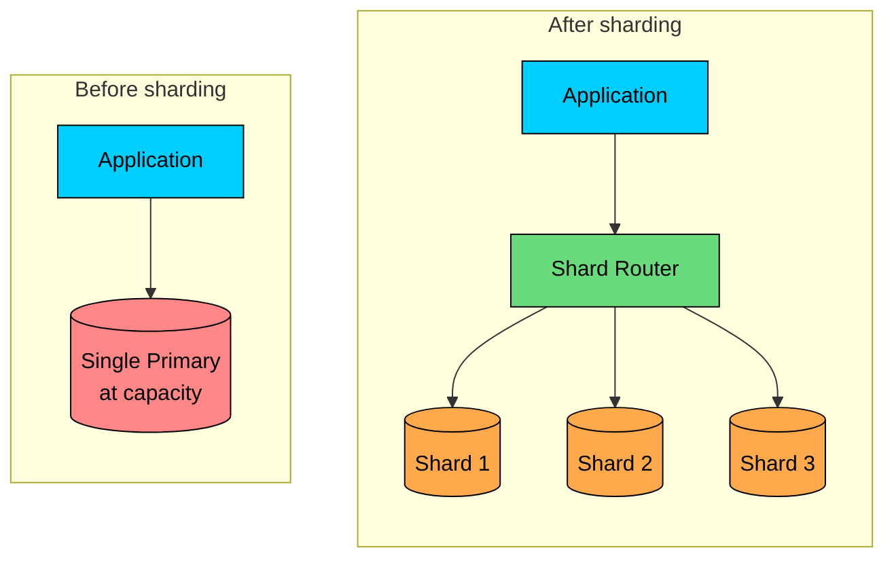
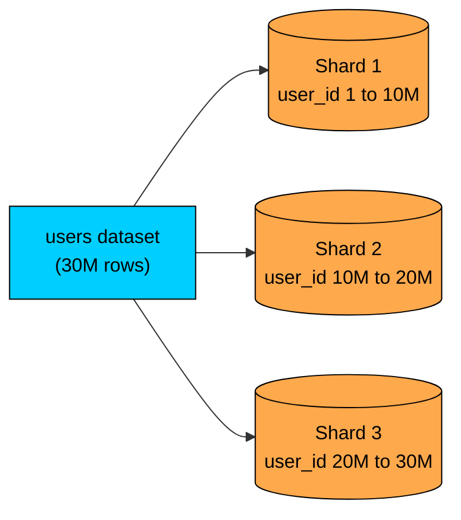
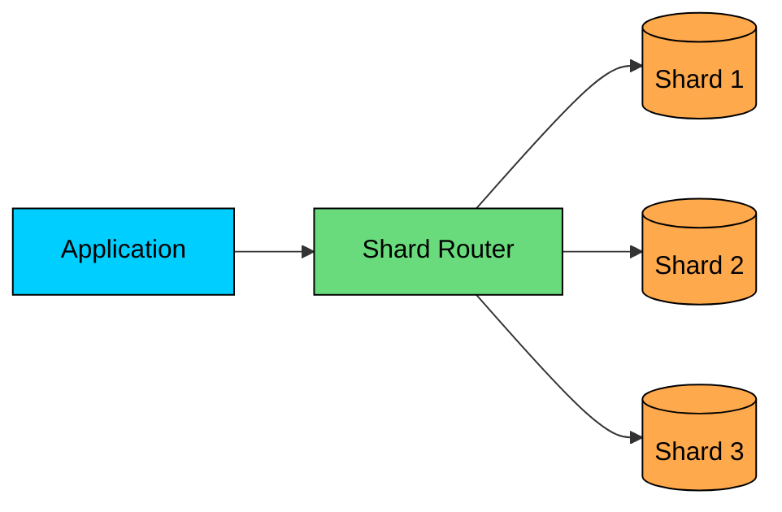
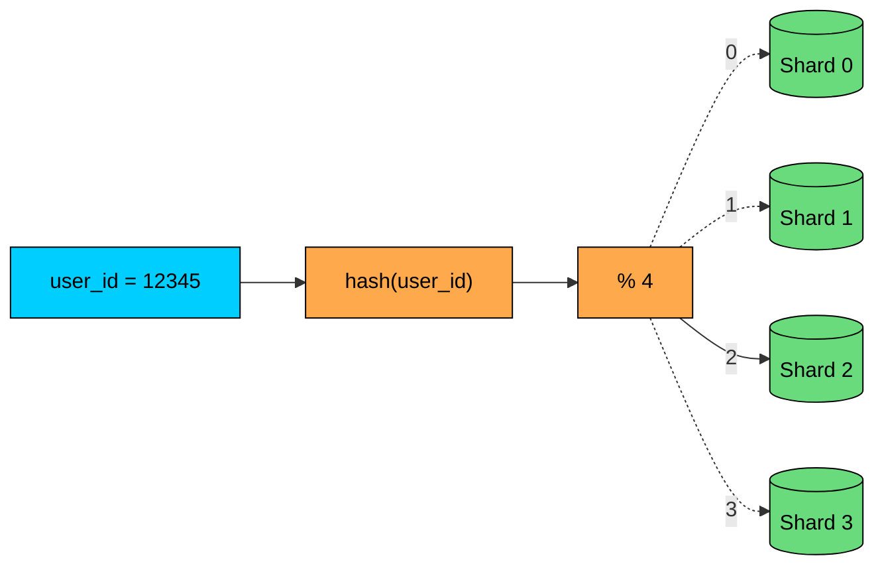
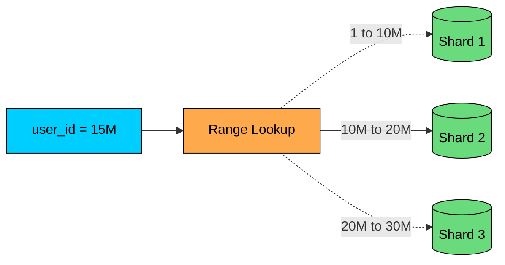
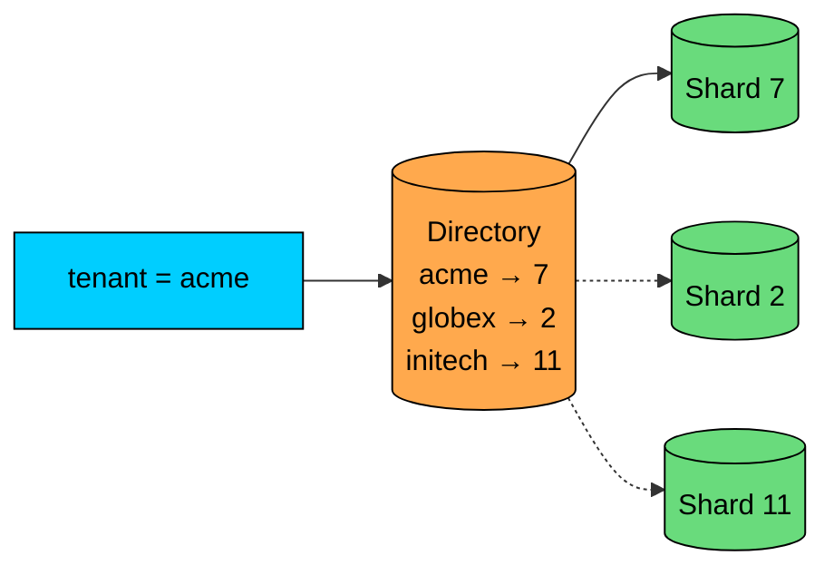
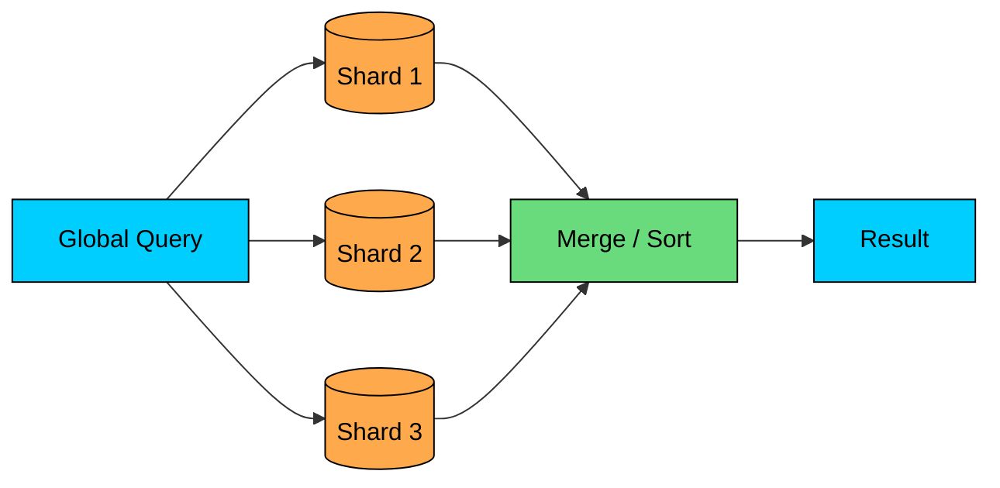

import React from 'react';
import CodeBlock from '../../../../components/ui/CodeBlock';
import Callout from '../../../../components/ui/Callout';

<div className="article-header">
  <div className="breadcrumb">
    <a href="/">Curated Notes</a>
    <span className="breadcrumb-separator">›</span>
    <span className="breadcrumb-current">Sharding</span>
  </div>
  <h1>Sharding</h1>
  <p style={{ color: 'var(--text-muted)', fontSize: '1.1rem', marginBottom: '16px', lineHeight: '1.6' }}>
    Master the essentials of Sharding in this curated guide.
  </p>
  <div className="meta-info">
    <span className="meta-item">
      <svg width="14" height="14" viewBox="0 0 24 24" fill="none" stroke="currentColor" strokeWidth="2"><circle cx="12" cy="12" r="10"/><polyline points="12 6 12 12 16 14"/></svg>
      10 min read
    </span>
    <span className="difficulty-badge difficulty-badge--intermediate">Intermediate</span>
  </div>
</div>

<section className="content-section">

Eventually, some databases outgrow a single machine.

You can add indexes, tune queries, add read replicas, and buy a larger server. Those are usually the right first moves. But if one primary database can no longer handle the write volume, storage size, or working set, you need to split the data across multiple machines.

That is **sharding**.

Sharding is horizontal partitioning across database nodes. Each node stores a subset of the rows. Together, the shards form one logical dataset, but no single database server owns all the data.





Sharding is powerful, but it is one of the most expensive database scaling decisions you can make. It improves capacity by distributing data and load, but it also makes routing, transactions, joins, migrations, rebalancing, and operations harder.

Use it when the bottleneck is real and simpler techniques are no longer enough.

---

## 1. What is Database Sharding?

Database sharding splits a dataset into smaller pieces called **shards**.

Each shard stores a subset of the data and usually runs on a separate database server or cluster.





For example, users might be split by `user_id`:


| Shard | Users |
|-------|-------|
| Shard 1 | `user_id` 1 to 10M |
| Shard 2 | `user_id` 10M to 20M |
| Shard 3 | `user_id` 20M to 30M |


When the application needs user 18M, it routes the query to Shard 2.

The column used to choose the shard is the **shard key**. Picking the shard key is the most important design decision in sharding.

---

## 2. Why Shard?

Sharding helps when a single primary database cannot handle the workload.

Common reasons:

- **Storage:** the dataset no longer fits comfortably on one machine.
- **Write throughput:** one primary cannot process all writes.
- **Working set size:** hot data no longer fits in memory on one node.
- **Tenant isolation:** large customers need isolated capacity.
- **Regional placement:** data needs to live near users or inside legal boundaries.


| Problem | How Sharding Helps |
|---------|--------------------|
| One node runs out of disk | Data is split across multiple nodes |
| Writes overload one primary | Writes are distributed by shard key |
| Hot working set is too large | Each shard caches a smaller subset |
| Large tenants affect everyone | Tenants can be isolated onto separate shards |
| Data residency matters | Shards can be placed by region |


Sharding is not mainly a read-scaling strategy. Read replicas and caching usually solve read pressure with less complexity. Sharding is most valuable when you need to scale writes, storage, or isolation boundaries.

---

## 3. How Sharding Works

A sharded system needs three things:

1. A shard key.
2. A mapping from shard key to shard.
3. A router that sends each request to the right shard.





The router may live in application code, a data-access library, a proxy, or the database system itself.

For a request like:


```sql
SELECT *
FROM orders
WHERE user_id = 123;
```


the router can use `user_id = 123` to find the correct shard.

If the query does not include the shard key, routing becomes harder. The system may need to query every shard and merge the results. That is called a **scatter-gather query**, and it is one of the major costs of sharding.

---

## 4. Choosing a Shard Key

The shard key decides where data lives.

A good shard key should:

- Distribute data evenly.
- Distribute traffic evenly.
- Match common query patterns.
- Keep related data together when possible.
- Avoid hot shards.
- Allow future growth and rebalancing.

This is harder than it sounds.

#### 4.1 Good Shard Key: `user_id`

For many consumer applications, `user_id` is a reasonable shard key.

Most user-specific queries include the user ID:


```sql
SELECT *
FROM orders
WHERE user_id = 123;
```


This routes cleanly to one shard.

#### 4.2 Risky Shard Key: `created_at`

Sharding by timestamp can create hot shards.

If all new writes go to the shard for "today" or "this month," one shard receives most writes while older shards sit idle.

Time-based sharding can work for append-heavy logs or archival systems, but it needs careful design around hot ranges and retention.

#### 4.3 Risky Shard Key: Low-Cardinality Fields

Fields like `country`, `status`, or `plan_type` usually have too few values.

If you shard by `country`, one large country may dominate the system. If you shard by `status`, almost all active users may live on one shard.

Low-cardinality shard keys often produce uneven data and uneven traffic.

---

## 5. Sharding Strategies

There are several ways to map keys to shards.

#### 5.1 Hash-Based Sharding

Hash-based sharding applies a hash function to the shard key.





Example:


```plaintext
shard = hash(user_id) % number_of_shards
```


Hashing usually gives a more even distribution than ranges.

Rebalancing is the hard part. If you change `number_of_shards`, many keys may move. Production systems often use virtual shards or consistent hashing to reduce data movement.

#### 5.2 Range-Based Sharding

Range-based sharding maps ranges of key values to shards.





Example:


| Shard | Key Range |
|-------|-----------|
| Shard 1 | `user_id` 1 to 10M |
| Shard 2 | `user_id` 10M to 20M |
| Shard 3 | `user_id` 20M to 30M |


Range sharding is easy to understand and supports range queries well.

Hot ranges are the trade-off. New entity creation concentrates on the highest range, and time-ordered keys make it worse. You may need pre-splitting, dynamic range splitting, or a different shard key.

#### 5.3 Directory-Based Sharding

Directory-based sharding uses a lookup table or metadata service to map keys to shards.





Example:


| Tenant | Shard |
|--------|-------|
| `acme` | Shard 7 |
| `globex` | Shard 2 |
| `initech` | Shard 11 |


This is flexible. You can move one tenant to another shard by updating the directory.

The directory itself becomes load-bearing infrastructure. It must be highly available, cached carefully, and updated safely during migrations.

#### 5.4 Geo-Based Sharding

Geo-based sharding places data by region. A typical setup puts US users in US shards, EU users in EU shards, and India users in India shards.

This can reduce latency and help with data residency. Global queries become harder, and users or organizations that move regions need special handling.

---

## 6. Cross-Shard Queries

The best sharded queries include the shard key.

This is good:


```sql
SELECT *
FROM orders
WHERE user_id = 123;
```


The router sends it to one shard.

This is harder:


```sql
SELECT *
FROM orders
WHERE status = 'FAILED'
ORDER BY created_at DESC
LIMIT 100;
```


If `status` is not the shard key, the system may need to query every shard, merge results, sort globally, and return the top 100.





Scatter-gather queries are slower, more expensive, and harder to make reliable. They also get worse as the number of shards grows.

Common ways to avoid them:

- Design APIs around the shard key.
- Keep related data on the same shard.
- Maintain denormalized read models.
- Use search indexes for global search.
- Use analytics systems for global reporting.

---

## 7. Joins and Transactions Across Shards

Sharding changes how you design relationships.

Joining two tables on the same shard can be fine. Joining data across shards is expensive because the database cannot perform a normal local join.

For example, if `orders` and `order_items` are both sharded by `user_id`, user-specific order queries stay local. This usually means denormalizing `user_id` into `order_items` so both tables share the same shard key.

If `orders` are sharded by `user_id` but `products` are sharded by `product_id`, joining orders to products may require cross-shard coordination or duplicated product data.

Transactions have similar issues.

A transaction inside one shard is a normal database transaction. A transaction across multiple shards requires distributed transaction coordination or application-level compensation. That adds latency, failure modes, and operational complexity.

Good sharded systems try to keep the most important transactions single-shard.

---

## 8. Rebalancing and Resharding

Shards do not stay balanced forever.

One shard may grow faster. One tenant may become huge. One range may become hot. Hardware changes. Traffic changes.

Rebalancing means moving data so load is spread more evenly.

This is operationally difficult because the system must:

- Copy data to the new shard.
- Keep source and destination in sync during the move.
- Route reads and writes correctly while data is moving.
- Verify the copy.
- Cut traffic over safely.
- Clean up old data after confidence is high.

Naive modulo hashing makes rebalancing painful because changing the number of shards can move a large fraction of keys.

Common mitigation strategies:

- Use virtual shards or buckets.
- Use consistent hashing.
- Move tenants individually with a directory mapping.
- Split hot ranges.
- Keep migration tooling ready before you urgently need it.

---

## 9. Hot Shards

A hot shard receives more traffic or stores more data than others. Common causes are a bad shard key, a large tenant, a celebrity user, a time-based hot range, a popular product or event, and uneven regional traffic.

Hot shards are dangerous because the whole system can become limited by one shard.

Mitigations include:

- Move large tenants to dedicated shards.
- Add a secondary split key for very hot entities.
- Cache hot reads.
- Use write buffering for bursty counters.
- Split hot ranges.
- Revisit the data model if one entity dominates traffic.

Even with perfect hashing, traffic can be uneven because users are not equally active.

---

## 10. When Not to Shard

Sharding is expensive. Avoid it if a simpler option solves the problem.

Try these first:

1. Add or fix indexes.
2. Optimize slow queries.
3. Add caching for hot reads.
4. Use read replicas for read-heavy workloads.
5. Archive cold data.
6. Partition large tables within one database.
7. Vertically scale the primary if that is still reasonable.
8. Denormalize or precompute expensive read models.

Do not shard because it sounds scalable. Shard because one database can no longer meet a measured requirement and the workload has a shard key that keeps important operations local.

---

## 11. Practical Rules of Thumb

Use these guidelines when designing a sharded system:

1. Pick the shard key from access patterns, not just data distribution.
2. Keep the most important reads and writes single-shard.
3. Avoid low-cardinality shard keys.
4. Watch for hot tenants, hot users, and hot time ranges.
5. Design global queries as separate read models when possible.
6. Avoid cross-shard transactions on critical paths.
7. Plan rebalancing before the first emergency.
8. Track data size, QPS, latency, and error rate per shard.
9. Keep shard routing simple and observable.
10. Treat shard-map changes like production migrations.

---

## Summary

Sharding splits data across multiple database nodes so the system can scale beyond one machine's storage, write throughput, or isolation limits.

The central design choice is the shard key. A good shard key distributes data and traffic while keeping common operations on one shard. A bad shard key creates hot shards, scatter-gather queries, and painful migrations.

Sharding is powerful, but it is not a first-line optimization. It makes joins, transactions, routing, rebalancing, and operations harder. Use it only after simpler techniques are no longer enough and the access patterns justify the complexity.

---

## Quiz

</section>
