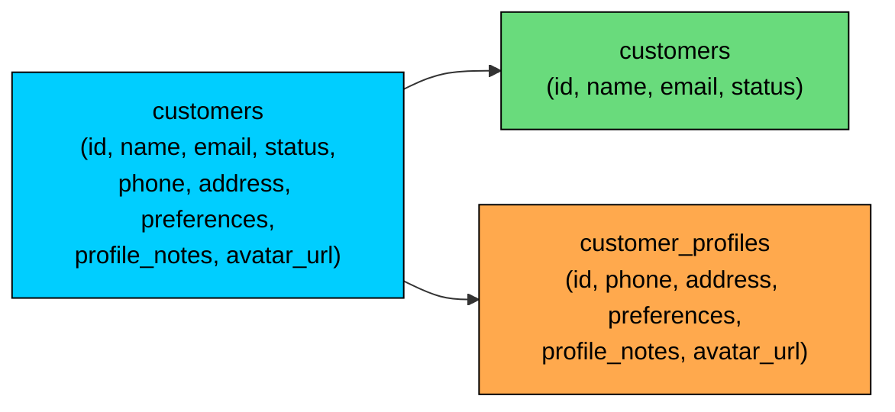

import React from 'react';
import CodeBlock from '../../../../components/ui/CodeBlock';
import Callout from '../../../../components/ui/Callout';

<div className="article-header">
  <div className="breadcrumb">
    <a href="/">Curated Notes</a>
    <span className="breadcrumb-separator">›</span>
    <span className="breadcrumb-current">Vertical Partitioning</span>
  </div>
  <h1>Vertical Partitioning</h1>
  <p style={{ color: 'var(--text-muted)', fontSize: '1.1rem', marginBottom: '16px', lineHeight: '1.6' }}>
    Master the essentials of Vertical Partitioning in this curated guide.
  </p>
  <div className="meta-info">
    <span className="meta-item">
      <svg width="14" height="14" viewBox="0 0 24 24" fill="none" stroke="currentColor" strokeWidth="2"><circle cx="12" cy="12" r="10"/><polyline points="12 6 12 12 16 14"/></svg>
      10 min read
    </span>
    <span className="difficulty-badge difficulty-badge--intermediate">Intermediate</span>
  </div>
</div>

<section className="content-section">

Some tables become slow not because they have too many rows, but because each row is too wide.

A `users` table might start with a few common fields: ID, name, email, and status. Over time it grows to include profile text, preferences, notification settings, avatars, security metadata, onboarding state, billing flags, and large JSON blobs.

Most requests may need only five columns, but the table carries fifty.

**Vertical partitioning** splits a wide table by columns. Frequently accessed columns stay in one table. Rarely accessed or large columns move to separate tables that share the same primary key.

The goal is simple: keep the hot path small.

---

## 1. What is Vertical Partitioning?

Vertical partitioning divides a table by columns.

Horizontal partitioning divides rows. Sharding distributes rows across machines. Vertical partitioning keeps the same logical entity but stores different groups of columns separately.





For example, this wide table:


```sql
CREATE TABLE customers (
    customer_id BIGINT PRIMARY KEY,
    name TEXT NOT NULL,
    email TEXT NOT NULL,
    status TEXT NOT NULL,
    phone TEXT,
    address TEXT,
    preferences JSONB,
    profile_notes TEXT,
    avatar_url TEXT,
    created_at TIMESTAMPTZ NOT NULL
);
```


can be split into hot and cold tables:


```sql
CREATE TABLE customers (
    customer_id BIGINT PRIMARY KEY,
    name TEXT NOT NULL,
    email TEXT NOT NULL,
    status TEXT NOT NULL,
    created_at TIMESTAMPTZ NOT NULL
);

CREATE TABLE customer_profiles (
    customer_id BIGINT PRIMARY KEY REFERENCES customers(customer_id),
    phone TEXT,
    address TEXT,
    preferences JSONB,
    profile_notes TEXT,
    avatar_url TEXT
);
```


Most requests read from `customers`. Only profile pages, settings pages, or admin tools join `customer_profiles`.

---

## 2. Why Wide Tables Hurt

Databases store data in pages or blocks. When rows are wide, fewer rows fit in each page.

That affects performance:

- More pages must be read from disk or memory.
- Fewer hot rows fit in cache.
- Index lookups still have to fetch full-width rows from the heap, which costs more I/O per row.
- Updates to large columns can create more write amplification.
- Queries may carry large values through execution even when the application does not need them.

Vertical partitioning helps when hot queries repeatedly touch a small subset of columns.


| Access Pattern | Better Layout |
|----------------|---------------|
| Login needs `email`, `password_hash`, `status` | Keep these in a compact hot table |
| Profile page needs `bio`, `avatar`, `preferences` | Move to a profile/details table |
| Audit metadata is rarely read | Move to an audit/details table |
| Large JSON blob is rarely needed | Move it away from frequent reads |


This is not about avoiding `SELECT *` only. Even if your query selects a few columns, row width and storage layout can still affect cache locality, table scans, vacuum/maintenance behavior, and update cost depending on the database.

---

## 3. Hot and Cold Columns

The most common vertical partitioning pattern is a hot/cold split.

**Hot columns** are read frequently by latency-sensitive paths. These tend to be small identifiers and flags like `user_id`, `email`, `display_name`, `status`, `created_at`, and small flags used by common queries.

**Cold columns** are read less often, larger, or needed by specialized workflows. Typical examples are profile biographies, preferences JSON, avatars and document metadata, audit fields, long descriptions, and rarely used settings.

The split should come from query evidence, not intuition. Use query logs, tracing, and production metrics to see which columns are read together.

---

## 4. Query Patterns After Splitting

After vertical partitioning, hot queries become simpler and narrower.


```sql
-- Hot path: small, frequent lookup
SELECT customer_id, name, email, status
FROM customers
WHERE customer_id = 123;
```


Cold queries join only when needed:


```sql
-- Profile page: less frequent, needs details
SELECT
    c.customer_id,
    c.name,
    c.email,
    p.phone,
    p.address,
    p.preferences,
    p.avatar_url
FROM customers c
JOIN customer_profiles p ON p.customer_id = c.customer_id
WHERE c.customer_id = 123;
```


This design is useful only if many important queries avoid the join. If most queries immediately join the split tables back together, you may have added complexity without much benefit.

---

## 5. Vertical Partitioning vs Normalization

Vertical partitioning can look like normalization, but the motivation is different.

Normalization splits data to reduce duplication and protect data integrity. Vertical partitioning splits columns to match access patterns and reduce read or write cost.


| Technique | Main Goal |
|-----------|-----------|
| Normalization | Avoid duplication and update anomalies |
| Vertical partitioning | Separate hot and cold columns |
| Denormalization | Duplicate or precompute data for faster reads |
| Horizontal partitioning | Split rows within a table or database |
| Sharding | Split rows across database nodes |


In practice, schemas often use several of these techniques together.

---

## 6. Benefits

Vertical partitioning can help in several ways.

#### 6.1 Better Cache Efficiency

Smaller hot rows let more frequently accessed data fit in memory.

If the application mostly needs `customer_id`, `name`, and `email`, keeping large profile fields out of the hot table can reduce cache churn.

#### 6.2 Less I/O for Common Queries

Queries that scan or fetch hot rows read less data.

This matters for dashboards, lists, login flows, account lookups, and high-QPS APIs.

#### 6.3 Cleaner Ownership Boundaries

Different parts of an application may own different parts of an entity.

For example, authentication may own `users`, while profile management owns `user_profiles`. A vertical split can make that ownership clearer.

#### 6.4 Different Storage or Retention Policies

Some cold data can live on cheaper storage, be archived separately, or have different backup/retention requirements.

This depends on the database and infrastructure. Not every database lets you place split tables on different storage tiers easily.

---

## 7. Trade-offs

Vertical partitioning adds complexity.

#### 7.1 More Joins

Queries that need the full entity now join multiple tables.

That is acceptable when those queries are less frequent. It is a problem when the join happens on every request.

#### 7.2 More Application Awareness

Application code, ORM mappings, migrations, and tests must understand that one logical entity spans multiple tables.

Views can hide some complexity:


```sql
CREATE VIEW customer_full_view AS
SELECT
    c.customer_id,
    c.name,
    c.email,
    c.status,
    p.phone,
    p.address,
    p.preferences,
    p.avatar_url
FROM customers c
LEFT JOIN customer_profiles p ON p.customer_id = c.customer_id;
```


Views are useful for compatibility, but hot paths should still query the narrow table directly when performance matters.

#### 7.3 More Migration Work

Splitting an existing large table takes planning:

1. Create the new table.
2. Start dual-writing new and updated rows to both tables.
3. Backfill existing rows.
4. Verify data matches.
5. Switch reads gradually.
6. Remove old columns when safe.

Dual-writing before the backfill avoids the problem of backfilled rows becoming stale the moment a source row changes.

The migration can be more difficult than the final schema.

#### 7.4 Transaction and Consistency Concerns

If both tables live in the same database, updates can usually be done in one transaction.

If the split crosses databases or services, consistency becomes harder. At that point, you are moving toward service decomposition, not just vertical partitioning.

---

## 8. When to Use Vertical Partitioning

Use vertical partitioning when:

- A table has many columns or large columns.
- Hot queries use only a small subset of columns.
- Large cold columns reduce cache efficiency.
- Different parts of the entity have different access patterns.
- Some fields have different retention, privacy, or storage requirements.
- Measurements show row width or unnecessary I/O is part of the problem.

Avoid it when:

- The table is small.
- Most queries need most columns.
- A missing index or bad query is the real bottleneck.
- The split would force joins on every hot path.
- The team is not ready for the migration and schema complexity.

Before splitting a table, try simpler fixes:

1. Stop using `SELECT *`.
2. Add the right indexes.
3. Check execution plans.
4. Move very large blobs to object storage if appropriate.
5. Cache stable read results.
6. Archive cold rows if row count, not row width, is the real issue.

---

## 9. Practical Rules of Thumb

Use these guidelines:

1. Split by access pattern, not by aesthetics.
2. Keep the most common request path on the narrow table.
3. Use the same primary key across split tables.
4. Keep one-to-one split tables truly one-to-one unless the model intentionally changes.
5. Avoid splitting columns that are almost always read together.
6. Measure before and after; vertical partitioning is not automatically faster.
7. Plan the backfill and dual-write period carefully.
8. Use views for compatibility, but not as an excuse to rejoin everything everywhere.
9. Document which table owns which fields.
10. Revisit the split as access patterns change.

---

## Summary

Vertical partitioning splits a wide table by columns so common queries can read a smaller, hotter table while rarely used or large fields live elsewhere.

It works best when a table has clear hot and cold column groups. It can improve cache efficiency, reduce I/O, and make ownership boundaries clearer.

The cost is schema complexity. Some queries need joins, migrations are harder, and application code must understand the split. Use vertical partitioning when measurements show wide rows are hurting important access patterns, not as a default design habit.

---

## Quiz

</section>
