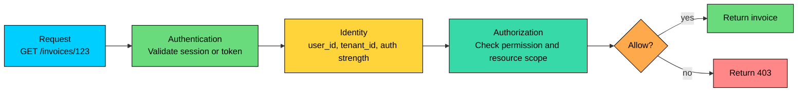
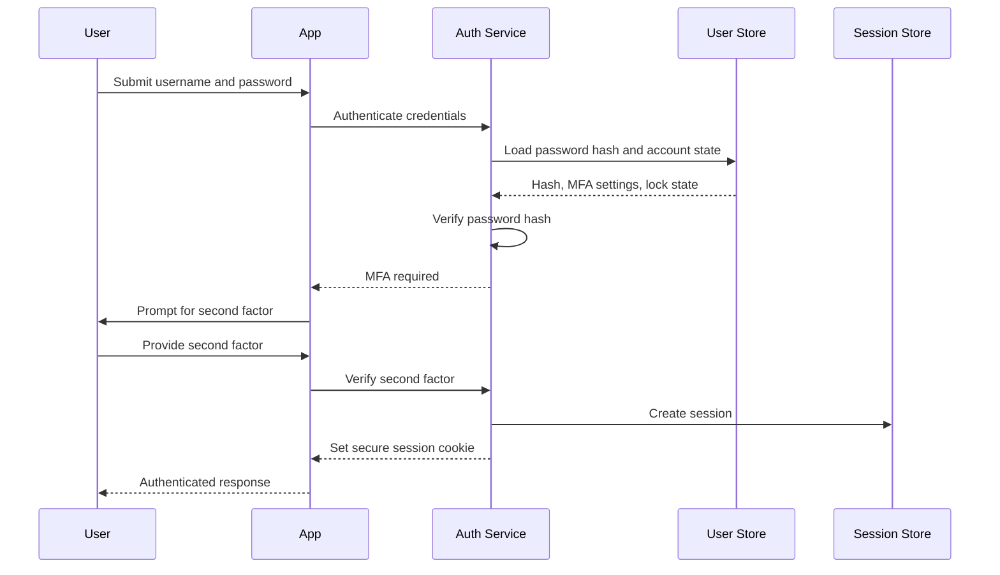
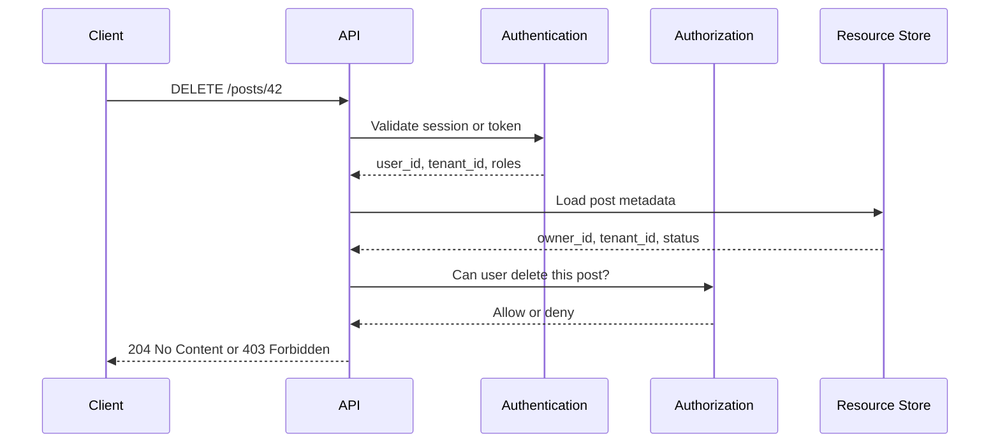

import React from 'react';
import CodeBlock from '../../../../components/ui/CodeBlock';
import Callout from '../../../../components/ui/Callout';

<div className="article-header">
  <div className="breadcrumb">
    <a href="/">Curated Notes</a>
    <span className="breadcrumb-separator">›</span>
    <span className="breadcrumb-current">Authentication & Authorization</span>
  </div>
  <h1>Authentication & Authorization</h1>
  <p style={{ color: 'var(--text-muted)', fontSize: '1.1rem', marginBottom: '16px', lineHeight: '1.6' }}>
    Master the essentials of Authentication & Authorization in this curated guide.
  </p>
  <div className="meta-info">
    <span className="meta-item">
      <svg width="14" height="14" viewBox="0 0 24 24" fill="none" stroke="currentColor" strokeWidth="2"><circle cx="12" cy="12" r="10"/><polyline points="12 6 12 12 16 14"/></svg>
      10 min read
    </span>
    <span className="difficulty-badge difficulty-badge--intermediate">Intermediate</span>
  </div>
</div>

<section className="content-section">

Authentication and authorization are separate security decisions.

**Authentication** answers: "Who is making this request?"

**Authorization** answers: "Is this identity allowed to do this action on this resource?"

A user can be correctly authenticated and still have no right to access a particular record, endpoint, or admin action. Many serious security bugs happen because systems verify identity and then forget to enforce authorization at the resource level.

---

## 1. The Boundary

Consider a user opening an invoice in a SaaS application.





Authentication may tell the system this is `user_42` from `tenant_a`. Authorization must still check whether `user_42` can read `invoice_123`, whether the invoice belongs to `tenant_a`, and whether any additional policy applies.

Do not treat login as a global permission grant. Login only establishes identity.

---

## 2. Authentication

Authentication verifies that a caller controls an accepted credential or authenticator.

For humans, that may be a password, passkey, security key, one-time code, or biometric unlock. For machines, it may be a client certificate, signed JWT, API key, workload identity token, or cloud IAM role.

Authentication is not always identity proofing. A system may know that the same account returned, without proving the user's real-world identity. That is enough for many products, but regulated systems may need stronger identity proofing and assurance levels.

#### Common Factors

Authentication factors are usually grouped as:


| Factor | Meaning | Examples |
|--------|---------|----------|
| Something you know | A secret the user remembers | Password, PIN |
| Something you have | A device or credential the user controls | Security key, authenticator app, passkey-capable device |
| Something you are | A biometric trait used locally to unlock a credential | Fingerprint, face unlock |


Biometrics need one clarification. In well-designed systems, the fingerprint or face scan does not get sent to your server. It unlocks a local device credential, often a cryptographic key. The server verifies a signed challenge, not a copy of the user's biometric data.

#### Authentication Methods


| Method | How it works | Notes |
|--------|--------------|-------|
| Password login | User submits a username and password | Use strong password hashing and MFA for sensitive accounts |
| Passkeys / WebAuthn | Device signs a challenge with a private key | Phishing-resistant and preferred for high-value accounts |
| Session cookie | Server stores a session and sends an opaque cookie | Common for browser apps |
| Bearer token | Client sends a signed or opaque token | Common for APIs and mobile apps |
| OAuth 2.0 | Delegated API access | OAuth is about access, not login |
| OpenID Connect | Authentication layer on OAuth 2.0 | Common for "Sign in with Google" style login |
| SAML | XML-based federated login | Common in enterprise SSO |
| mTLS / workload identity | Machine proves possession of a certificate or platform-issued identity | Common for service-to-service authentication |


The right method depends on the client, risk, and operational environment. A browser SaaS app, mobile app, public API, and internal service mesh usually should not all use the same authentication mechanism.

#### Password Login Flow





A production authentication flow checks more than the password:

- Is the account active?
- Is the password hash valid?
- Is MFA required?
- Is the login anomalous enough to require step-up authentication?
- Has the account or credential been compromised?
- Should the session be created, rotated, or denied?

Passwords should be stored with a dedicated password hashing algorithm such as Argon2id, bcrypt, or scrypt. Do not store plaintext passwords. Do not use fast general-purpose hashes such as SHA-256 by themselves for password storage.

#### Sessions and Tokens

After authentication succeeds, the system usually creates a session or issues a token.

For browser applications, an opaque session ID in a `Secure`, `HttpOnly`, `SameSite` cookie is often the simplest safe default. The server stores the session data and can revoke it immediately.

For APIs, mobile apps, service-to-service calls, and federated systems, tokens are common. Tokens may be opaque references that require server-side lookup, or self-contained signed tokens such as JWTs.

The storage choice is part of the security design. Browser-accessible storage such as `localStorage` is exposed to JavaScript and is risky if an XSS bug exists. Cookies need CSRF defenses. JWTs need careful expiration, audience validation, key rotation, and revocation strategy.

There is no free storage location. Each option moves the risk.

---

## 3. Authorization

Authorization decides whether a caller is allowed to perform an action. The caller may be a logged-in user, a service account, a device, or an anonymous client. Authorization applies in all cases; some public endpoints simply grant the anonymous caller a narrow set of actions.

A complete decision pulls in four things: the **subject** (user, service, device, or anonymous client), the **action** (read, create, update, delete, approve, export), the **resource** (invoice, document, tenant, account, deployment), and the **context** around the request (tenant, ownership, relationship, network, time, authentication strength, data classification).

Authentication identifies the subject. Authorization evaluates the rest.

#### Common Authorization Models


| Model | Decision is based on | Example |
|-------|----------------------|---------|
| RBAC | Roles mapped to permissions | `billing_admin` can `invoices:refund` |
| ABAC | Attributes of subject, resource, action, and environment | Allow if `user.department == document.department` |
| ReBAC | Relationships between subjects and objects | Allow if user is a member of the project |
| ACL | Per-resource access lists | Document grants Alice read/write |
| Policy-based access | Declarative policies evaluated by an engine | OPA, Cedar, cloud IAM policies |


Real systems often combine models. RBAC may grant `invoices:read`, while ABAC or ReBAC ensures the invoice belongs to the user's tenant or project.

#### Authorization Flow





The API loads resource metadata before the final authorization decision. Checking only the user's role is not enough. The system must also check the target resource.


```java
public boolean canDeletePost(User user, Post post) {
    if (!authz.hasPermission(user, "posts:delete")) {
        return false;
    }

    if (!user.getTenantId().equals(post.getTenantId())) {
        return false;
    }

    return post.getStatus() != PostStatus.LOCKED;
}
```


This is the difference between "the user has a delete permission somewhere" and "the user may delete this specific post."

---

## 4. End-to-End Example

An editor tries to delete a blog post. The full flow looks like this:

1. The user signs in.
2. The authentication service validates credentials and MFA.
3. The server creates a session or issues a token.
4. The user sends `DELETE /posts/42`.
5. The API validates the session or token.
6. The API loads post `42`.
7. The authorization layer checks:
   - Does the user have `posts:delete`?
   - Does the post belong to the same tenant?
   - Is the post locked, archived, or under legal hold?
   - Does this action require step-up authentication?
8. The API either deletes the post or returns `403 Forbidden`.

An authenticated user who lacks access gets `403 Forbidden`. A request with missing or invalid authentication usually gets `401 Unauthorized`. The names are imperfect, but the distinction is useful: `401` means the caller has not presented valid credentials; `403` means the caller is known but not allowed.

---

## 5. Production Practices

#### Authenticate at the edge, authorize at the operation

Gateways, middleware, and load balancers can validate sessions and tokens early. That is useful.

Authorization still belongs close to the protected operation. Background jobs, admin endpoints, GraphQL resolvers, file downloads, and internal APIs need checks too. Attackers only need one missed path.

#### Deny by default

If no rule explicitly allows the action, deny it.


```java
if (!authz.isAllowed(user, action, resource)) {
    throw new ForbiddenException();
}
```


New endpoints should start closed. New resources should start private. New roles should start with no permissions.

#### Validate authorization on every request

Do not rely on the frontend hiding buttons. Do not rely on a route being hard to guess. Do not rely on IDs being random.

Every protected request should be checked server-side. This includes static files, exports, webhooks, asynchronous jobs, and service-to-service calls.

#### Separate authentication strength from authorization

A user may be allowed to view an account with a normal session but require stronger authentication to change MFA settings, rotate API keys, export data, or approve payments.

This is called step-up authentication. It is common for sensitive operations.

#### Design for revocation

Access changes must take effect predictably. A disabled user, a password or MFA reset, a removed role, a compromised token, a stolen session, or an employee leaving the company should all flow through the same revocation path with predictable timing.

Server-side sessions are easy to revoke. Self-contained tokens need short lifetimes, refresh-token rotation, revocation lists, or permission-version checks.

#### Log the decisions that matter

Log authentication and authorization events with enough detail to investigate incidents:

- Login success and failure.
- MFA challenge and failure.
- Session creation and revocation.
- Permission denied.
- Privileged action allowed.
- Role or policy changed.

Avoid logging secrets, passwords, full tokens, or sensitive personal data. Logs should help investigation without becoming another source of compromise.

#### Test the negative cases

Most access-control bugs are not in the happy path.

Test:

- No credentials.
- Invalid credentials.
- Expired session or token.
- Authenticated user with no permission.
- Correct role but wrong tenant.
- Correct role but wrong resource owner.
- Revoked role.
- Locked or restricted resource.
- Service account calling a user-only endpoint.

Authorization tests should be first-class tests, not a few incidental controller checks.

---

## 6. Common Mistakes

#### Confusing OAuth with login

OAuth 2.0 is for delegated access to APIs. OpenID Connect adds the identity layer used for login. Many products say "OAuth login" casually, but the implementation should be OIDC when the application needs to authenticate a user.

#### Trusting claims without validation

A token is not trustworthy because it looks like a JWT. The server must validate signature, issuer, audience, expiration, algorithm, and key ID. For opaque tokens, the server must introspect or look them up with the issuer.

#### Putting authorization only in the UI

The UI can improve user experience by hiding unavailable actions. It cannot protect data. All real enforcement must happen server-side.

#### Checking only roles

`admin` or `editor` is rarely enough information. The system also needs resource scope: tenant, owner, project, environment, region, workflow state, or data classification.

#### Treating internal traffic as trusted

Internal services still need authentication and authorization. A compromised service, misconfigured job, or leaked service token can cause the same damage as an external attacker.

#### Ignoring lifecycle events

Authentication and authorization are tied to account lifecycle. If joiner, mover, and leaver workflows are manual, access will drift. Connect identity, HR, directory, and application authorization systems where the risk justifies it.

---

## 7. Key Takeaways

Authentication establishes identity. Authorization controls access.

Good systems keep those decisions separate, validate both on the server, deny by default, and check access against the specific resource being requested.

Use strong authentication for account access, step-up authentication for sensitive actions, and explicit authorization checks for every protected operation. The hard part is not the login screen. The hard part is making sure every path that touches data asks, "Is this caller allowed to do this here?"

</section>
