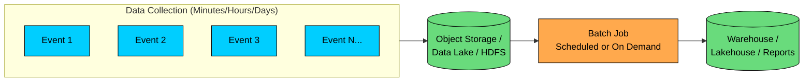
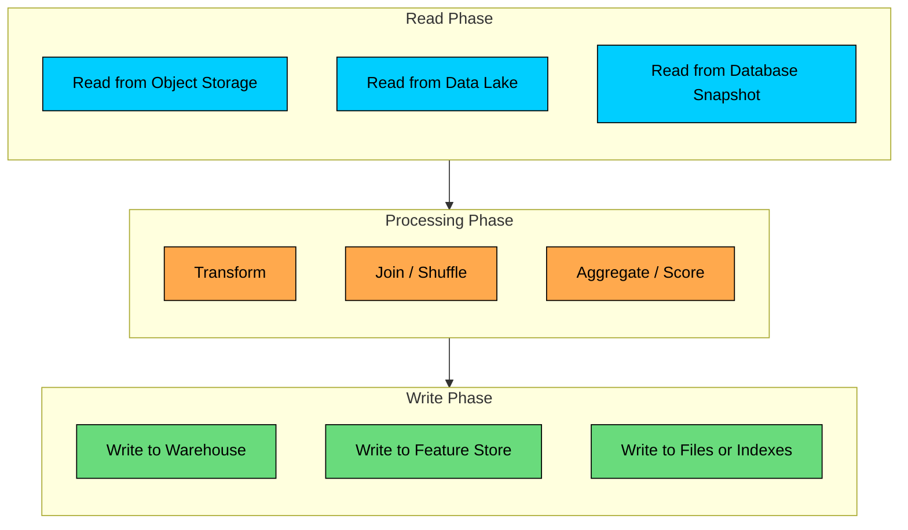
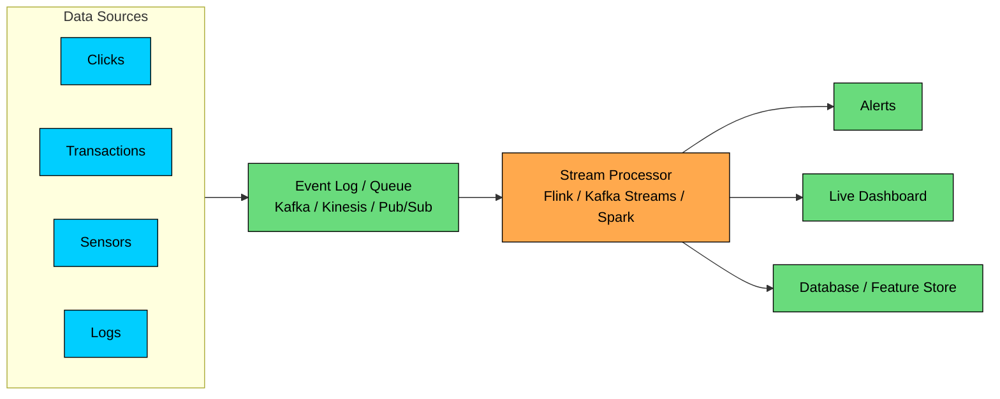
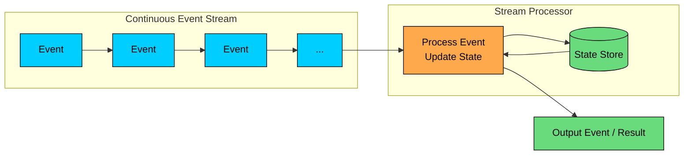
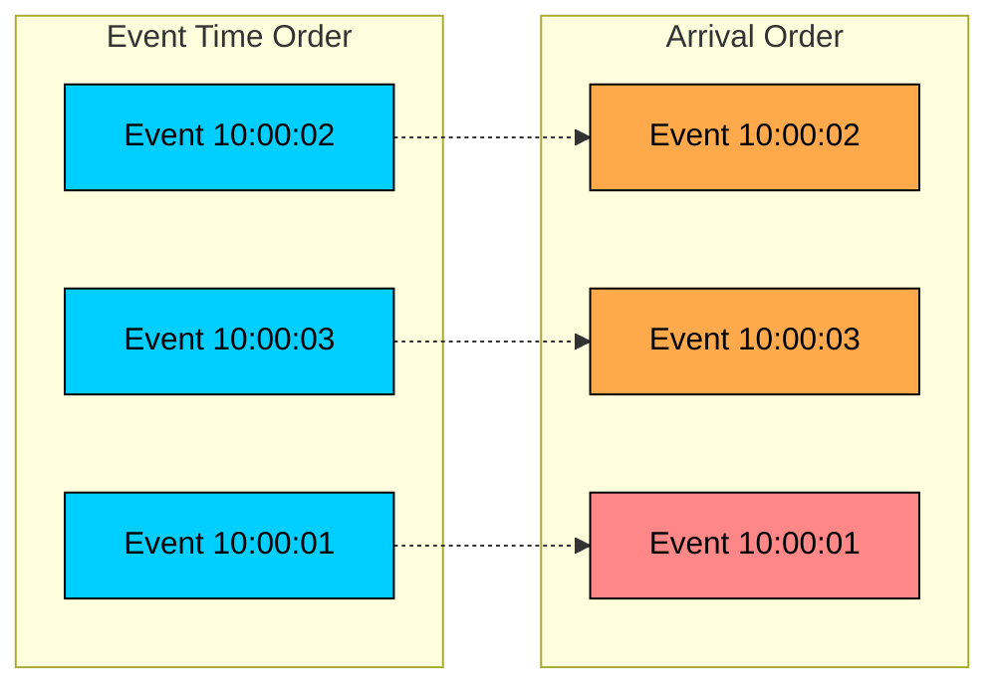
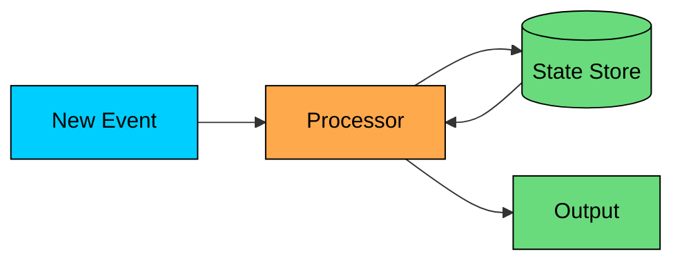
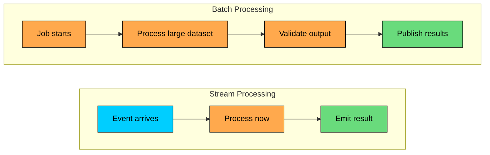
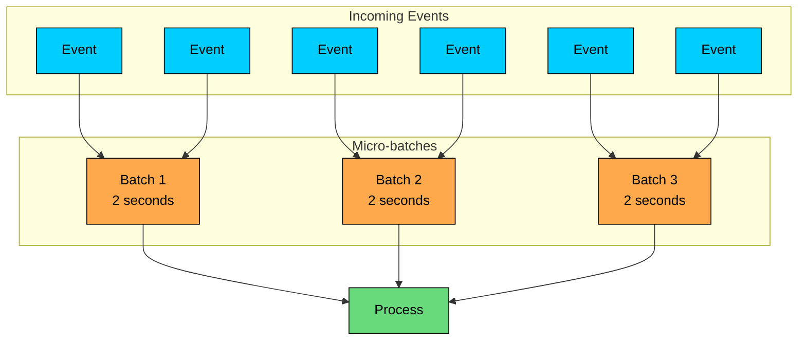

import React from 'react';
import CodeBlock from '../../../../components/ui/CodeBlock';
import Callout from '../../../../components/ui/Callout';

<div className="article-header">
  <div className="breadcrumb">
    <a href="/">Curated Notes</a>
    <span className="breadcrumb-separator">›</span>
    <span className="breadcrumb-current">Batch vs Stream Processing</span>
  </div>
  <h1>Batch vs Stream Processing</h1>
  <p style={{ color: 'var(--text-muted)', fontSize: '1.1rem', marginBottom: '16px', lineHeight: '1.6' }}>
    Master the essentials of Batch vs Stream Processing in this curated guide.
  </p>
  <div className="meta-info">
    <span className="meta-item">
      <svg width="14" height="14" viewBox="0 0 24 24" fill="none" stroke="currentColor" strokeWidth="2"><circle cx="12" cy="12" r="10"/><polyline points="12 6 12 12 16 14"/></svg>
      10 min read
    </span>
    <span className="difficulty-badge difficulty-badge--intermediate">Intermediate</span>
  </div>
</div>

<section className="content-section">

Data processing is a latency decision. Batch processing handles bounded datasets as jobs; stream processing handles unbounded events as they arrive.

Most mature data platforms use both. The right choice depends on freshness, correctness, cost, and how much operational complexity the team can support.

In this chapter, you will learn:

- How batch and stream processing differ
- What makes stream processing harder to operate
- Where micro-batch processing fits
- How to choose the right mix for a system

---

## 1. What is Batch Processing?

Batch processing reads a finite dataset, applies computation, and writes the result. The job has a clear beginning and end.

For example, an ecommerce company might process all orders from the previous day at 02:00, compute revenue by category, update warehouse tables, and produce finance reports before the business day starts.





#### Characteristics of Batch Processing


| Characteristic | Practical Meaning |
|----------------|-------------------|
| **Latency** | Usually minutes to hours. Results are available after the job finishes. |
| **Throughput** | High. The system can amortize scheduling, I/O, and coordination overhead across many records. |
| **Dataset shape** | Bounded. The input is a known slice of data, such as one partition, one table snapshot, or one date range. |
| **Fault tolerance** | Straightforward compared with streaming. Failed jobs can often retry from checkpoints or rerun from input data. |
| **Correctness model** | Easier to validate because inputs and outputs can be compared after the job completes. |
| **Operational profile** | Often bursty. Clusters may scale up for scheduled jobs and scale down afterward. |


#### Common Batch Use Cases

Batch processing is common for daily analytics, ETL and ELT pipelines, machine learning training, embedding generation, billing, settlement, data backfills, and compliance exports. These workloads benefit from complete input, reproducible runs, and the ability to validate output before publishing it.

#### The Batch Processing Model

A batch job usually follows three steps:

1. **Input:** read a bounded dataset from storage.
2. **Process:** filter, join, aggregate, enrich, validate, or run model inference.
3. **Output:** write results to a destination table, file, index, or service.





Batch systems can make optimizations that are difficult in streaming systems. They can sort the full input, repartition large datasets, perform multi-pass algorithms, run expensive joins, and validate output before publishing it.

That is why batch remains common even in systems with real-time requirements. When you need an exact answer over a large historical dataset, batch is usually the first tool to consider.

#### Popular Batch Processing Tools

Apache Spark is common for large-scale ETL, feature pipelines, backfills, and joins. Hadoop MapReduce still appears in legacy Hadoop environments and very large sequential jobs. Hive, Trino, Presto, dbt, and cloud data warehouses cover SQL-oriented transformations, interactive queries, scheduled ELT, BI tables, and governed reporting.

Hadoop MapReduce is still important historically, but most new systems start with Spark, SQL engines, managed warehouses, or lakehouse-style platforms rather than writing raw MapReduce jobs.

---

## 2. What is Stream Processing?

Stream processing consumes events continuously and updates results as data arrives. The input does not end. The processor keeps running, maintains state, and emits outputs to downstream systems.

A payment platform, for example, cannot wait for an overnight batch to detect stolen cards. It needs to evaluate each transaction within the authorization path or immediately beside it.





#### Characteristics of Stream Processing


| Characteristic | Practical Meaning |
|----------------|-------------------|
| **Latency** | Usually milliseconds to seconds, depending on engine, state, sink, and durability requirements. |
| **Throughput** | Can be very high, but low-latency processing leaves less room to amortize overhead than large batch jobs. |
| **Dataset shape** | Unbounded. The system sees a continuous event stream, not a complete table. |
| **State** | Often required for counts, joins, deduplication, sessions, and pattern detection. |
| **Fault tolerance** | Harder than batch. The system must recover state and resume from the right offsets. |
| **Correctness model** | Depends on event time, watermarks, deduplication, idempotent writes, and sink behavior. |


#### Common Stream Use Cases

Stream processing is common for fraud detection, monitoring, alerting, live operational dashboards, recommendations, IoT telemetry, content moderation, and Change Data Capture (CDC). These workloads lose value when the system waits for a scheduled batch window.

#### The Stream Processing Model

Stream processors usually run the same loop for the lifetime of the application:

1. **Consume:** read events from an event log, queue, CDC stream, or socket.
2. **Process:** validate events, update state, join with reference data, run rules or model inference, and compute aggregates.
3. **Emit:** write results to another stream, database, cache, dashboard, alerting system, or feature store.





Reading one event is easy. Producing correct output is harder when events arrive out of order, processors crash, downstream systems time out, and a late event changes an answer you already published.

#### Popular Stream Processing Tools

Apache Flink is a strong fit for low-latency stateful pipelines, event-time processing, complex event processing, and streaming SQL. Kafka Streams fits Kafka-native services and Kafka-to-Kafka transformations. Spark Structured Streaming works well for teams already using Spark and for pipelines that benefit from shared batch and streaming logic. Beam/Dataflow and managed cloud services are useful when portability or managed operations matter more than controlling the runtime directly.

Tool choice depends less on marketing labels and more on operational fit: state size, latency target, language support, deployment model, connector maturity, and how the system writes results.

---

## 3. Challenges in Stream Processing

Stream processing looks simple in diagrams. It is not simple in production. The complications come from time, state, and failure.

#### Challenge 1: Out-of-Order Events

Events often arrive in a different order than they occurred. Mobile clients retry requests. Services buffer messages during deploys. Brokers repartition data. Networks delay packets. A producer may write event `10:00:03` before event `10:00:01` reaches the stream.





This is why stream processors distinguish between event time, processing time, and ingestion time. Event time is when the event happened, processing time is when the processor handled it, and ingestion time is when the event entered the streaming system.

For analytics and billing, event time is usually the correct basis. For operational alerts, processing time may be acceptable because freshness matters more than historical precision.

#### Challenge 2: Late Events

A late event is an event that belongs to a time window whose result may already have been emitted.


```plaintext
Window: 10:00 - 10:05
Initial result emitted at 10:06

Late arrival at 10:07:
  event_time = 10:03
  user_id = 42
  amount = 79.00
```


The system can drop the event, update the result, wait longer before finalizing, or send late data to a separate reconciliation path. Each choice trades off simplicity, completeness, latency, and downstream correction handling.

Watermarks are the common mechanism for deciding when a window is complete enough to publish. A watermark is the processor's estimate that it has seen all events earlier than a given event-time timestamp. It is a trade-off, not a guarantee. Aggressive watermarks reduce latency and increase late events. Conservative watermarks improve completeness and delay output.

#### Challenge 3: State Management

Most useful stream jobs are stateful. Counting purchases per user, detecting repeated login failures, joining clicks with sessions, deduplicating retries, and computing rolling model features all require memory of prior events.





State introduces real engineering constraints. It must be partitioned so work can scale horizontally, checkpointed so failures do not reset the computation, expired or compacted so it does not grow forever, and restored quickly enough to meet recovery objectives.

In AI systems, this matters for online features. A model may need "number of failed payments in the last 10 minutes" or "products viewed in the current session." Those features are only useful if the stream processor maintains them correctly under retries, deploys, and partitions.

#### Challenge 4: Processing Guarantees

Failure semantics are often summarized as at-most-once, at-least-once, and exactly-once.

At-most-once processing can lose events because an event may be processed zero or one time. At-least-once processing avoids loss but can create duplicate effects. Exactly-once processing means the result is applied once for a defined boundary of inputs and outputs, but it requires careful coordination and compatible sinks.

The phrase "exactly-once" is easy to misuse. A streaming engine can often provide exactly-once state updates inside the engine, and sometimes exactly-once writes to supported sinks. It cannot make every external API exactly-once. If your stream job calls a payment gateway, sends an email, or invokes a model endpoint with side effects, you still need idempotency keys, deduplication, transactional writes, or compensating logic.

Instead of asking whether the engine supports exactly-once, ask:

&gt; If this job crashes after processing an event but before or during output, what visible effect can happen downstream?

That question exposes the real failure mode.

---

## 4. Comparing Batch and Stream Processing

#### The Latency-Throughput Trade-off

Batch processing optimizes for efficient work over many records. Stream processing optimizes for time-to-decision.





| Metric | Batch | Stream |
|--------|-------|--------|
| **Time to first result** | Minutes to hours | Milliseconds to seconds |
| **Cost per record** | Often lower for large workloads | Often higher because work is continuous |
| **Resource pattern** | Bursty or scheduled | Always running |
| **Backfills** | Natural fit | Possible through replay, but operationally heavier |
| **Debugging** | Easier to reproduce from fixed input | Harder because time, state, and ordering matter |
| **Best default** | Historical computation and reconciliation | Operational decisions that lose value if delayed |


#### Data Characteristics

Batch jobs work on bounded datasets, so the input can be complete for the chosen period and can be sorted or repartitioned before computation. Late data is usually handled by rerunning the job or adjusting the input window, and output often replaces or appends partitions and tables.

Streaming jobs work on unbounded datasets, so input is always still arriving. The processor must tolerate out-of-order events, handle late data in application logic, and rely on replay from durable logs when reprocessing is needed. Output is usually incremental: updates, events, or continuously refreshed state.

#### Programming Model

Batch code can assume a finite input:


```python
data = read_all_from("s3://logs/date=2026-05-24/")

result = (
    data
    .filter(lambda log: log.level == "ERROR")
    .group_by(lambda log: log.service)
    .count()
)

result.write_to("warehouse.error_counts_daily")
```


Stream code must define how to group an infinite input into useful slices:


```python
stream = consume_from("kafka://logs")

(
    stream
    .filter(lambda log: log.level == "ERROR")
    .window(size="1 minute", time="event_time")
    .group_by(lambda log: log.service)
    .count()
    .emit_to("ops.error_counts_live")
)
```


The window is not an implementation detail. It is part of the product behavior. A "five-minute error rate" and an "hourly error count" answer different operational questions.

#### Where Unified APIs Help

Newer systems increasingly expose batch and streaming through similar APIs. Spark Structured Streaming uses Spark's DataFrame model for streaming workloads, while Flink supports both bounded and unbounded streams. This reduces the learning curve and can make code reuse easier.

The core design differences remain. A streaming job still needs decisions about event time, watermarks, state retention, replay, and output semantics. A batch job still needs decisions about partitioning, scheduling, data quality, and backfills.

---

## 5. Micro-Batch: A Practical Middle Ground

Micro-batch processing groups incoming events into small batches, often measured in seconds, and processes each group as a mini batch job.





Micro-batch is often the right trade-off when the business needs fresh data but not per-event latency. A dashboard that updates every 10 seconds, a warehouse table that updates every minute, or a feature pipeline that tolerates short delays may not need a true event-at-a-time engine.

Spark Structured Streaming commonly uses this model. The benefit is operational familiarity: many transformations look like batch transformations, and the engine can process each trigger as a small job. The cost is latency floor and less natural handling for workloads that need very low latency or fine-grained event-time behavior.

---

## 6. How to Choose

Start with the consequence of delay.

#### Choose Batch When

Choose batch when the result is only needed after a reporting period closes, the workload scans large historical datasets, correctness matters more than immediacy, or the system needs backfills, audits, reconciliation, training, embedding generation, expensive joins, or global aggregation.

#### Choose Stream When

Choose stream processing when a delayed decision loses business value or creates risk. It is the better fit when the system must react while users, devices, or transactions are active, maintain continuously updated state, publish incremental events, or process naturally event-shaped inputs such as clicks, transactions, telemetry, and database changes.

#### Use Both When

Most production systems land here. They stream for immediate decisions, use batch for reconciliation and historical truth, train models in batch while updating online features from streams, publish operational dashboards from streams, and rebuild indexes from the source of truth in batch.

This combination is not a failure of architecture. It reflects two different jobs: fast reaction and durable correction.

---

## Summary

Batch processing works on bounded data. It is the right default for large historical jobs, offline analytics, training pipelines, backfills, billing, and reconciliation.

Stream processing works on unbounded data. It is the right default when the system must react while events are still fresh: fraud detection, alerting, live dashboards, online recommendations, IoT, CDC, and operational workflows.

Micro-batch sits between the two. It gives near-real-time results for workloads that can tolerate seconds of latency and benefit from a batch-like execution model.

Start with freshness and correctness requirements: how fresh does this result need to be, and what guarantees does the business require? Answer that first. The architecture follows.

---

## Quiz

</section>
