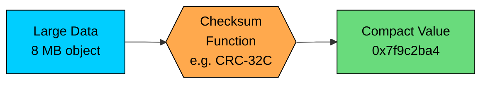
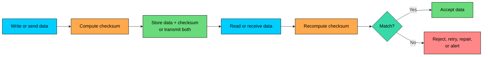
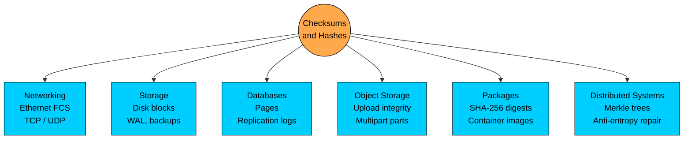
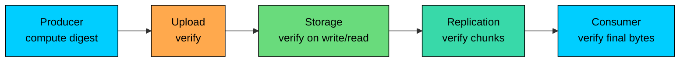

import React from 'react';
import CodeBlock from '../../../../components/ui/CodeBlock';
import Callout from '../../../../components/ui/Callout';

<div className="article-header">
  <div className="breadcrumb">
    <a href="/">Curated Notes</a>
    <span className="breadcrumb-separator">›</span>
    <span className="breadcrumb-current">Checksums</span>
  </div>
  <h1>Checksums</h1>
  <p style={{ color: 'var(--text-muted)', fontSize: '1.1rem', marginBottom: '16px', lineHeight: '1.6' }}>
    Master the essentials of Checksums in this curated guide.
  </p>
  <div className="meta-info">
    <span className="meta-item">
      <svg width="14" height="14" viewBox="0 0 24 24" fill="none" stroke="currentColor" strokeWidth="2"><circle cx="12" cy="12" r="10"/><polyline points="12 6 12 12 16 14"/></svg>
      10 min read
    </span>
    <span className="difficulty-badge difficulty-badge--intermediate">Intermediate</span>
  </div>
</div>

<section className="content-section">

A **checksum** is a compact value computed from data so a system can later check whether that data has changed. The producer computes the value, stores or transmits it alongside the data, and the consumer recomputes and compares.

Checksums appear at almost every layer of a distributed system: network frames, TCP and UDP packets, storage blocks, database pages, object storage uploads, backups, container images, package downloads, and replication logs.

What a checksum can prove depends on the algorithm. A CRC detects accidental corruption. A cryptographic hash resists deliberate collisions. An HMAC or digital signature also proves who produced the data. Picking the wrong algorithm for the threat model is a common system-design mistake.

---

## 1. What a Checksum Is

A **checksum** is a short value derived from a larger piece of data.

For example, a storage system may store:


```plaintext
object:   video-segment-001
bytes:    8 MB
checksum: crc32c=0x7f9c2ba4
```


Later, when the object is read back, the system recomputes `crc32c` over the returned bytes. If the recomputed value is different, the read path knows the object was corrupted, truncated, mixed with the wrong bytes, or otherwise damaged.





A checksum is usually much smaller than the data. That is the point. A 4-byte CRC can protect a network frame. A 32-byte SHA-256 digest can identify a multi-gigabyte artifact.

Because the checksum is smaller than the data, collisions are mathematically possible. Two different inputs can produce the same checksum. Good algorithms make accidental undetected corruption unlikely for the error model they were designed for.

---

## 2. What Checksums Can and Cannot Tell You

Checksums answer a narrow question:

**Do these bytes match the bytes I expected, according to this algorithm?**

They are useful for detecting:

- Bit flips
- Truncated writes
- Partial reads
- Wrong block reads
- Corrupted network frames
- Damaged files
- Bad disk sectors
- Memory or DMA corruption
- Replication or backup transfer errors

They do not automatically answer:

- Who created the data?
- Was the checksum itself tampered with?
- Is this data authorized?
- Is the algorithm secure against an attacker?
- Is the application-level operation correct?

If an attacker can change both the file and the checksum, a plain checksum provides no protection. For adversarial environments, use authenticated integrity: HMACs, digital signatures, signed manifests, TLS, package signatures, or other trust mechanisms.

---

## 3. How Verification Works

The verification flow is the same in networks, files, databases, and object storage.





What happens after a mismatch depends on the system:

- A network card may drop the frame and rely on a higher layer to retransmit.
- TCP may discard a bad segment; the sender retransmits when acknowledgments indicate data is missing.
- A storage engine may read another replica.
- An object store may fail the request and return an integrity error.
- A backup system may mark the backup as unusable.
- A database may stop startup rather than replay a corrupt page.

Checksums detect corruption. Recovery requires another mechanism: retransmission, replication, erasure coding, backups, repair jobs, or manual intervention.

---

## 4. Types of Integrity Checks

Not all checksums are the same. Choose the algorithm based on the error model.

#### Parity

A parity bit records whether a group of bits contains an even or odd number of `1` bits.

Parity can detect any single-bit error in that group. It cannot detect many multi-bit errors. It is simple and cheap, but too weak for most application-level integrity checks.

#### Simple Additive Checksums

A simple checksum may add bytes or words together and store the low bits of the result.

These are fast and easy to implement, but weak. They may miss reordered bytes or error patterns that cancel each other out.

Use simple additive checksums only when required by an existing protocol or when the error model is very limited.

#### CRC

**CRC (Cyclic Redundancy Check)** algorithms treat data as a polynomial over binary values and compute a remainder using a chosen generator polynomial.

You do not need the algebra to use CRCs correctly. The practical point is that CRCs are designed to catch common accidental corruption patterns: burst errors, bit flips, and transmission noise.

Common examples:

- CRC-32
- CRC-32C
- CRC-64

CRC-32C is widely used in storage and networking because it has good error-detection properties and hardware acceleration on many CPUs.

CRC is not a cryptographic algorithm. An attacker can deliberately modify data and compute a new CRC.

#### Cryptographic Hashes

A cryptographic hash produces a fixed-size digest and is designed to make collisions and preimages computationally infeasible.

Common examples:

- SHA-256
- SHA-384
- SHA-512
- BLAKE3

Cryptographic hashes are useful for:

- Verifying downloads
- Identifying content by digest
- Deduplicating immutable blobs
- Building Merkle trees
- Verifying container images and package artifacts
- Comparing large files without reading them repeatedly

MD5 and SHA-1 should not be used for security-sensitive integrity because practical collision attacks exist. They may still appear in legacy systems or non-adversarial deduplication, but new designs should prefer SHA-256 or a modern alternative.

#### HMACs and Digital Signatures

If you need to prove that data came from a trusted party and was not modified, a plain checksum or hash is not enough. Use an HMAC when both sides share a secret key, and a digital signature when one party signs and many parties verify with a public key.

Examples:

- Signed package repositories
- Signed container images
- Webhook signatures
- API request signatures
- Software update manifests

HMACs and signatures separate accidental corruption detection from authenticated integrity, where the recipient can prove who produced the data.

---

## 5. Algorithm Comparison


| Mechanism | Good For | Not Good For |
|-----------|----------|--------------|
| Parity | Very cheap single-bit error detection | Multi-bit corruption, files, adversarial changes |
| Additive checksum | Simple protocol checks | Strong error detection or security |
| CRC-32 / CRC-32C | Accidental corruption in frames, blocks, files | Malicious tampering |
| SHA-256 | Strong content digest and artifact verification | Proving who produced the digest |
| HMAC | Integrity and authenticity with a shared secret | Public verification without sharing the secret |
| Digital signature | Publicly verifiable authenticity | Very high-throughput per-packet checks |


Picking the wrong row in this table is the common failure. A CRC is excellent for detecting disk or network corruption, but it is the wrong tool for verifying a software release from an untrusted mirror unless the expected digest is authenticated separately.

---

## 6. Where Checksums Are Used





#### Networking

Ethernet frames include a frame check sequence, commonly a CRC, so corrupted frames can be discarded.

IPv4 has a header checksum. IPv6 removed the IP-layer header checksum and relies on link-layer and transport-layer checks instead. TCP and UDP checksums cover their headers, payload, and an IP pseudo-header according to each protocol's rules. These checks are not security mechanisms. TLS, QUIC, IPsec, or application signatures handle stronger integrity and authentication.

#### Storage Systems

Storage systems use checksums to detect corruption at rest and in transit:

- Disk blocks
- Filesystem blocks
- Database pages
- Write-ahead logs
- Object storage parts
- Backup chunks
- Erasure-coded fragments

Modern storage systems often store checksums separately from the data path they protect. If a disk returns the wrong block without any I/O error, a checksum stored in metadata can detect the mismatch.

#### Databases

Databases use checksums on pages and logs to detect torn writes, disk corruption, and bad replication data.

If a database reads a page and the page checksum fails, it should not continue as if the data is valid. Depending on the system, it may read a replica, restore from backup, stop the process, or mark the page corrupt.

#### Object Storage and Uploads

Object stores often let clients send a checksum with an upload. The service computes its own checksum and rejects the object if the values differ.

For multipart uploads, be careful. Provider-specific ETags are not always a simple MD5 of the full object. Treat documented checksum fields as integrity signals, not incidental identifiers.

#### Package and Artifact Distribution

Package managers, container registries, and release systems use cryptographic hashes to identify artifacts.

Example:


```shell
sha256sum app-linux-amd64.tar.gz
```


The digest only helps if the expected value is obtained through a trusted channel: a signed release manifest, package index, transparency log, or secure website.

#### Distributed Systems

Checksums and hashes help compare data across nodes without transferring all bytes first.

Examples:

- Replication systems compare log segment checksums.
- Anti-entropy repair uses hashes or Merkle trees to find divergent ranges.
- Content-addressable storage names data by digest.
- Deduplication systems avoid storing identical chunks twice.
- Backup systems verify that restored data matches what was written.

At this layer, checksums become a design tool rather than a low-level implementation detail.

---

## 7. End-to-End Integrity

A common mistake is to assume that a checksum at one layer protects the whole system. It does not. A network frame checksum may prove the frame arrived intact at one link, but it says nothing about whether the application wrote the correct object, whether a proxy returned the wrong file, or whether storage later corrupted a block.

For important data, use **end-to-end integrity**:

1. Compute a checksum or digest at the producer.
2. Store it with trusted metadata.
3. Verify it after every major boundary: upload, replication, storage, restore, and download.
4. Repair from another copy when verification fails.





Distributed storage systems care about this because corruption can happen anywhere: client memory, network cards, kernel buffers, disks, SSD firmware, replication jobs, compaction, backup pipelines, or restore tooling.

---

## 8. Checksums vs Encryption

Checksums and encryption solve different problems.

**Checksums** detect changes.

**Encryption** hides content from parties that do not have the key.

Encryption modes used in modern protocols often include authenticated integrity, but encryption alone is not the same as a checksum. Likewise, a checksum does not hide data.

In practice:

- Use CRCs for fast accidental corruption detection.
- Use SHA-256 or another modern hash for content identity.
- Use HMACs or signatures for authenticity.
- Use TLS or another secure protocol for protected communication.
- Use encryption at rest when storage confidentiality matters.

---

## 9. Design Considerations

#### Choose the Right Granularity

Checksumming an entire 10 GB object detects corruption, but it does not tell you which block is bad. Checksumming 4 MB chunks lets a system retry or repair only the damaged chunk.

Smaller granularity improves repair precision but increases metadata size and verification overhead.

#### Store Checksums Where They Catch the Failure

If data and checksum are corrupted together in the same way, verification may not help. Storage engines often keep checksums in page headers, metadata blocks, manifests, or separate indexes depending on the failure model.

The design question is: what failures are you trying to catch?

#### Verify on Both Write and Read

Verifying only during writes catches upload or transmission errors. Verifying on reads catches bit rot and silent corruption at rest.

Cold data needs periodic scrubbing because it may not be read for months. A backup that is never restored or verified is only a theory.

#### Do Not Ignore Mismatches

A checksum mismatch is not a warning to log and continue past. It means the bytes are not the bytes expected by that layer.

Possible responses:

- Retry the transfer.
- Read another replica.
- Reconstruct from erasure-coded fragments.
- Quarantine the object.
- Mark the backup invalid.
- Alert an operator.

Continuing with corrupt data usually turns a contained integrity failure into a larger incident.

---

## 10. Key Takeaways

Checksums are compact values used to detect whether data changed.

The practical points:

- A checksum match means no detected change, not proof that change was impossible.
- CRCs are strong tools for accidental corruption, not malicious tampering.
- Cryptographic hashes such as SHA-256 are better for content identity and artifact verification.
- HMACs and digital signatures provide authenticated integrity.
- Checksums detect corruption; replicas, retransmission, erasure coding, or backups recover from it.
- Verify data at system boundaries and during reads, not only when writing.
- Treat checksum mismatches as data-integrity failures, not harmless noise.

Corruption is a fact of life across long-running systems. Checksums let the system catch it before bad bytes propagate into application state, replicas, or backups.

</section>
