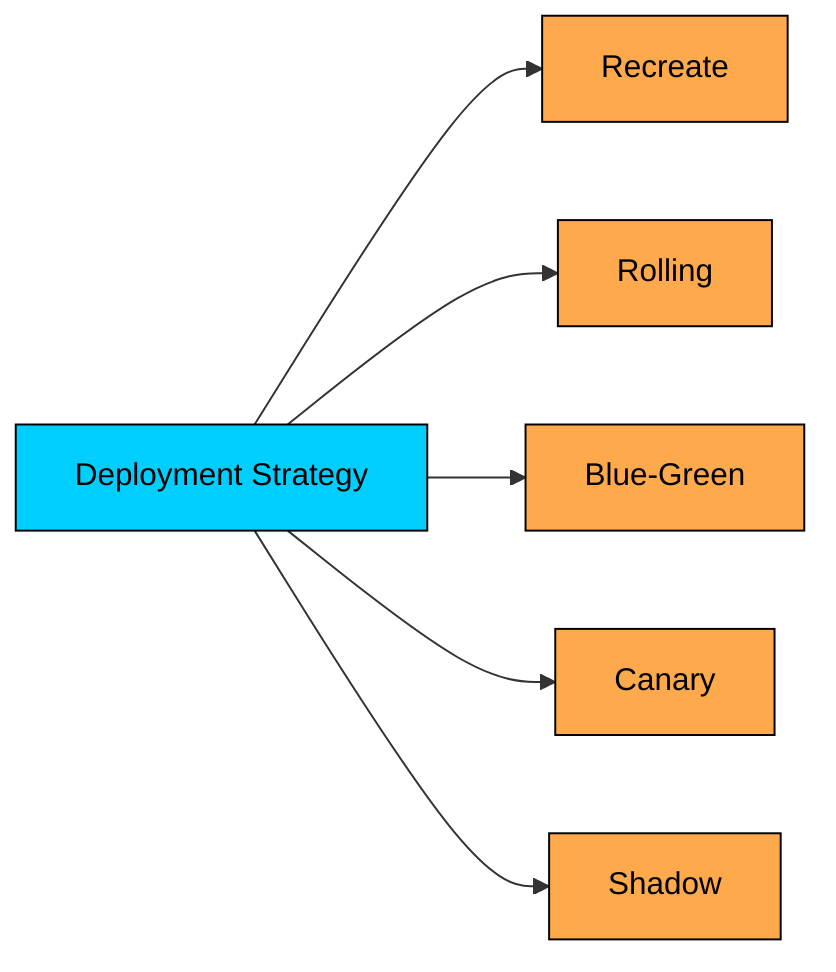
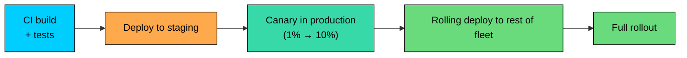

import React from 'react';
import CodeBlock from '../../../../components/ui/CodeBlock';
import Callout from '../../../../components/ui/Callout';

  

    <a href="/">Curated Notes</a>
    ›
    Deployment Strategies Overview
  

  <h1>Deployment Strategies Overview</h1>
  

    Master the essentials of Deployment Strategies Overview in this curated guide.
  

  

    
      <svg width="14" height="14" viewBox="0 0 24 24" fill="none" stroke="currentColor" strokeWidth="2"><circle cx="12" cy="12" r="10"/><polyline points="12 6 12 12 16 14"/></svg>
      10 min read
    
    Intermediate
  

<section className="content-section">

A **deployment strategy** is the plan for moving a new version of an application from a build artifact to live production traffic without breaking the system in front of real users.

Every team picks a strategy, even if they never name it. Restarting a process, replacing containers one at a time, or standing up a parallel stack and flipping a switch are all strategies, with different trade-offs in downtime, rollback speed, infrastructure cost, and risk.

---

## 1. What a Deployment Strategy Has to Solve

A live system has open connections, in-flight requests, cached state, and users who notice when something is broken. A deployment strategy has to answer:

1. **How does the new version reach the servers?** Replace the whole fleet, in batches, or stand up a parallel fleet?
2. **What happens to traffic during the change?** Pause it, drain it, split it, or shift gradually?
3. **What if the new version is broken?** How fast can traffic move away, and what state needs to be reverted?
4. **What about long-lived state?** Database schemas, message queues, and background jobs do not switch versions instantly.
5. **How is "healthy" defined?** Process-is-running is a weaker signal than request-success-rate-is-good.

---

## 2. The Core Strategies

Five strategies cover almost every deployment pipeline in production today.

#### 2.1 Recreate

Stop the old version, then start the new version. The simplest strategy, and the only one that always involves downtime. Fits internal tools, batch jobs, or applications with planned maintenance windows. Still common for stateful services that cannot safely run two versions at once.

#### 2.2 Rolling

Replace instances one batch at a time. The old version keeps serving traffic while the new version comes online incrementally. The default in Kubernetes, AWS ECS, and most orchestrators. Avoids downtime without standing up a second fleet, but both versions run side by side during the rollout, so the application has to tolerate that.

#### 2.3 Blue-Green

Run two complete environments. "Blue" serves production traffic. "Green" is a parallel copy running the new version. When green is verified, traffic flips from blue to green in one step. Gives the fastest rollback in the catalog at the cost of double infrastructure during the cutover. Database changes still need care because both colors usually share the same database.

#### 2.4 Canary

Send a small slice of traffic to the new version, watch metrics, then expand. A typical rollout: 1% → 5% → 25% → 100%, with health checks at each step. The safest way to ship a high-risk change, limiting blast radius while producing real production data. The cost is operational complexity: traffic splitting, version-aware metrics, and a clear rule for when to promote or roll back.

#### 2.5 Shadow

Send a copy of production traffic to the new version, but ignore its responses. Real users continue to be served by the old version. Useful for performance-sensitive rewrites (search, ranking, payments) that need realistic load without being on the critical path. The complexity is in routing, response comparison, and avoiding side effects on external systems.

---

## 3. A Quick Comparison

| Strategy | Downtime | Extra Infra | Rollback Speed | Blast Radius | Complexity |
|----------|----------|-------------|----------------|--------------|------------|
| **Recreate** | Yes | None | Slow (redeploy old) | Whole fleet | Very low |
| **Rolling** | None | Small (surge) | Moderate (roll back batch by batch) | Grows over the rollout | Low |
| **Blue-Green** | None | Double during cutover | Very fast (flip back) | Whole fleet at cutover | Medium |
| **Canary** | None | Small | Fast (shift traffic away) | Limited to canary % | High |
| **Shadow** | None | Double for shadowed traffic | N/A (not user-facing) | Zero user impact | High |

No strategy is universally best. A small internal API can survive recreate. A payments service moving a critical change probably wants canary on top of rolling. A team rewriting a search engine probably wants shadow traffic before any cutover at all.

---

## 4. The Trade-offs That Actually Drive the Choice

Strategy names are a shorthand. The real decision comes from a handful of dimensions.

#### 4.1 Risk of the Change

Low-risk changes (copy edits, dependency bumps, additive features behind a flag) can ship through plain rolling deployments. High-risk changes (algorithm rewrites, schema-coupled features, performance-sensitive paths) deserve canary or shadow, often combined with feature flags so the code can ship dark and be enabled later.

#### 4.2 Cost of Downtime

A B2B tool used in one time zone can take a maintenance window. A global payments API cannot afford a minute of errors. The cost of downtime sets a floor on how careful the rollout has to be.

#### 4.3 Time to Rollback

What matters during an incident is not how the rollout was done, but how fast traffic can move away from the broken version.

| Strategy | Typical Rollback Window |
|----------|-------------------------|
| Recreate | Minutes to tens of minutes (redeploy old artifact) |
| Rolling | Minutes (reverse the rollout) |
| Blue-Green | Seconds (flip traffic back) |
| Canary | Seconds to a minute (shift traffic away) |
| Shadow | Not applicable; new version is not in the user path |

Blue-green and canary turn rollback into a traffic decision instead of a deployment, which is the strongest argument for their extra cost.

#### 4.4 Database and Stateful Compatibility

Most strategies assume the application is stateless; the database, cache, and queues keep running while the code rolls out. For canary, blue-green, and rolling, schema changes need to be **backward compatible**: add columns before reading them, write to both old and new during transitions, drop old columns only after the old code is gone. Feature flags pair well here because the code can ship dark, the schema can change in safe steps, and the feature can be turned on independently.

#### 4.5 Infrastructure Cost

Blue-green doubles infrastructure during the cutover. Canary needs traffic splitting and version-aware monitoring. Rolling needs a small amount of surge capacity. The dollar cost is rarely the blocker; the real cost is the operational machinery (traffic splitting, health signals, automated rollback) and the discipline to use it.

#### 4.6 Traffic Patterns

A 1% canary on a quiet hour may not exercise the new version at all. Real-time systems with long-lived connections (WebSockets, gRPC streams, video calls) make rolling deployments more complex because connections do not migrate cleanly between versions. The strategy has to fit the traffic shape.

---

## 5. How These Strategies Are Combined

In production, teams rarely use one strategy in isolation.

A common pipeline looks like this:

The pipeline uses staging to catch obvious problems, canary to catch problems that only appear under real traffic, and rolling deployment to finish the rollout efficiently. Feature flags sit on top of all of this so risky behavior can be enabled and disabled independently of the deploy.

Other combinations show up too:

- **Blue-green + canary:** Bring up the green environment, send a small canary slice to it, then promote the rest of the traffic.
- **Shadow + canary:** Shadow tests the new version under real load, then a canary rollout exposes a small fraction of users once the shadow data looks good.
- **Rolling + feature flags:** Ship the code dark, ramp up the feature for a percentage of users later, decoupling deploy from release.

The strategies are tools. Production pipelines usually layer them.

---

## 6. Deploy vs Release

A useful distinction that does not appear in the strategy names: **deploying** code and **releasing** a feature are separate operations.

- **Deploy:** Get the new artifact onto production servers.
- **Release:** Make the new behavior visible to users.

Feature flags break the link between the two. A deploy can put the new code on every server with the feature turned off. A release happens later, by flipping a flag, possibly for a subset of users, with no new deployment. This separation is why "trunk-based development" works at scale: code is deployed often, in small steps, behind flags, and product behavior is released on a different cadence.

---

## 7. Signals That Tell You the Deployment Is Working

A strategy is only as good as the signal it uses to decide "this is working" or "this is not working." Healthy deployment signals are usually the same as healthy service signals:

1. **Error rate:** 5xx responses, exceptions, failed jobs.
2. **Latency:** p50, p95, p99 of important endpoints.
3. **Saturation:** CPU, memory, queue depth, connection pool usage.
4. **Business metrics:** Orders per minute, sign-ups, checkout success rate.

Comparing these signals between old and new is straightforward in canary, harder in rolling (mixed fleet), and only possible across the cutover in blue-green. A deployment with no signals is a deployment hoping nothing went wrong.

---

## 8. When Each Strategy Fits

A pragmatic guide for picking a starting point.

| Situation | Reasonable Strategy |
|-----------|---------------------|
| Internal tool, single instance, downtime acceptable | Recreate |
| Stateless web service, several instances, steady traffic | Rolling |
| Critical API where rollback speed dominates | Blue-Green |
| High-risk change, large user base, version-aware metrics available | Canary |
| Performance-sensitive rewrite, side effects under control | Shadow |
| Risky feature, mature flagging system | Rolling deploy + feature flag rollout |
| Schema change | Rolling deploy + backward-compatible migration in stages |
| Long-lived connections (WebSockets, streams) | Rolling with careful drain + reconnect handling |

These are starting points, not rules. The actual strategy in a mature system is usually a layered combination tuned to the change at hand.

---

## 9. Common Pitfalls

1. **Treating "no downtime" as "no risk."** A rolling deployment can still ship a broken version to 100% of users; it just spreads the damage over minutes instead of doing it instantly.
2. **Skipping the rollback drill.** Strategies that promise fast rollback only deliver if the team has practiced. The first exercise should not be during an incident.
3. **Ignoring schema compatibility.** A canary or rolling deploy that ships a schema-breaking change can take down both versions at once.
4. **Confusing health checks with health signals.** Health checks tell the load balancer the process is up; they do not tell the rollout system that user requests are succeeding.
5. **Forgetting non-HTTP traffic.** Background workers, queue consumers, and stream processors also have versions and need a deployment strategy.

---

## Summary

A deployment strategy is the plan for moving code into production safely.

#### **Key takeaways:**

1. **Every team has a strategy, named or not.** Restart, rolling, blue-green, canary, and shadow each make different trade-offs.
2. **The choice is driven by risk, downtime cost, rollback speed, infrastructure cost, and stateful compatibility.** Strategy names are shorthand for those trade-offs.
3. **Recreate is simple and has downtime.** Rolling avoids downtime but mixes versions. Blue-green flips fast at the cost of double infrastructure. Canary limits blast radius. Shadow tests safely without user impact.
4. **Most production pipelines combine strategies.** Staging plus canary plus rolling, often with feature flags layered on top, is a common pattern.
5. **Deploy and release are different.** Feature flags decouple shipping the code from turning on the behavior, which makes risky changes safer.
6. **A strategy is only as good as its signals.** Error rate, latency, saturation, and business metrics decide whether to promote or roll back.
7. **Database changes constrain everything.** Schema migrations must be backward compatible during multi-version rollouts.

The strategies in this chapter are tools, not exclusive choices. Production pipelines usually layer them, tuned to the risk and traffic profile of each change.

---

## Quiz

</section>
